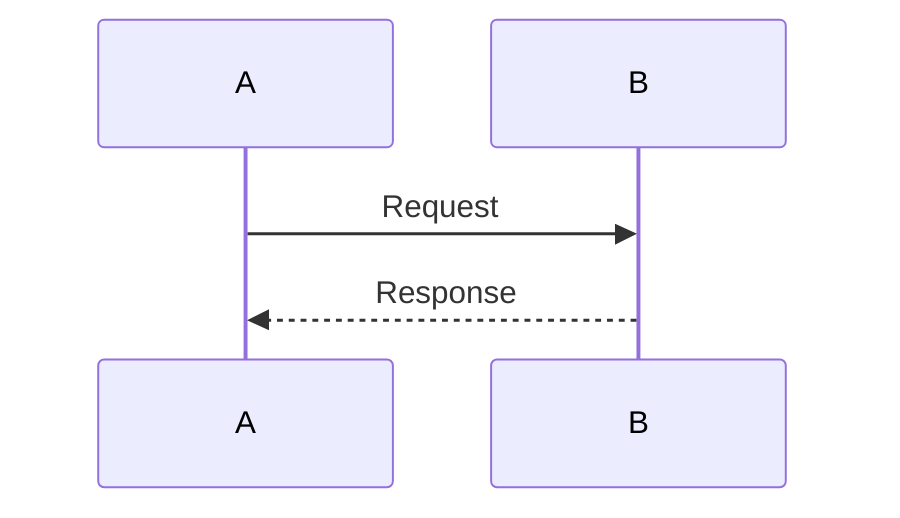
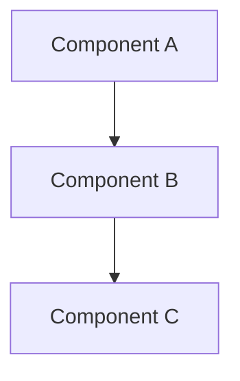
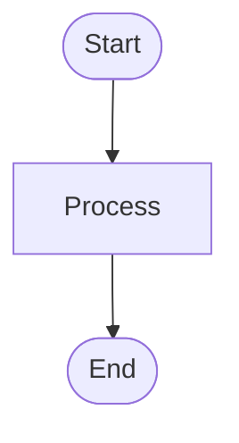

## Description
<!-- Provide a brief description of the changes in this PR -->

## Type of Change
- [ ] Bug fix
- [ ] New feature
- [ ] Breaking change
- [ ] Documentation update
- [ ] Refactoring

## Architecture Overview
<!-- Add Mermaid diagrams here to illustrate the architecture changes -->

### Sequence Diagram
<!-- Example: -->

### Architecture Diagram
<!-- Example: -->

### Flow Diagram
<!-- Example: -->

## Changes Made
<!-- List the key changes in this PR -->

## Testing
- [ ] Unit tests added/updated
- [ ] Integration tests added/updated
- [ ] Manual testing completed

## Related Issues
<!-- Link to related issues -->
Closes #

## Checklist
- [ ] Code follows project style guidelines
- [ ] Self-review completed
- [ ] Comments added for complex code
- [ ] Documentation updated
- [ ] No new warnings generated
- [ ] Tests pass locally

## Screenshots (if applicable)
<!-- Add screenshots for UI changes -->

## Additional Notes
<!-- Any additional information reviewers should know -->
