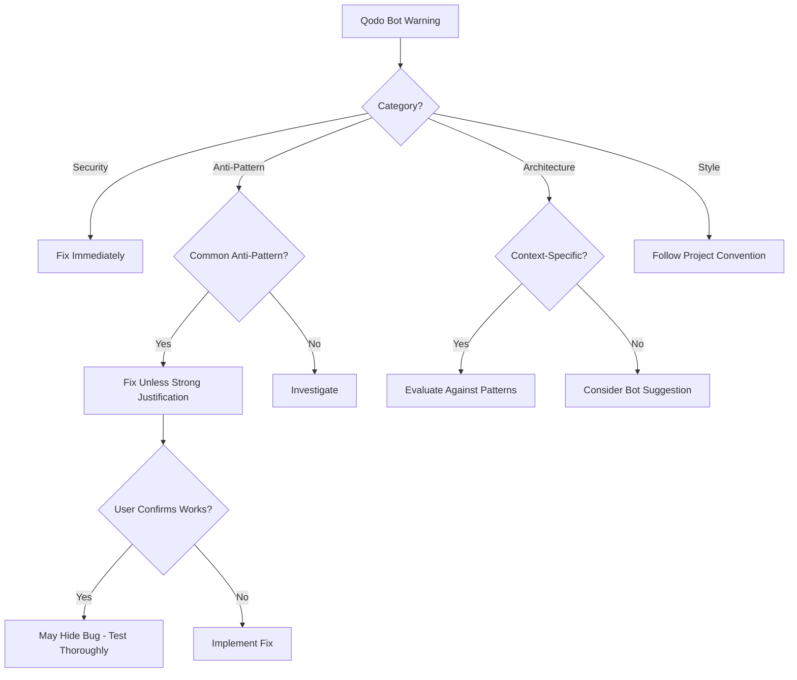

# Qodo Bot Code Review Credibility Pattern

## Lesson: When Qodo Bot Warns About Anti-Patterns, Listen

**Bug #1102 Incident**: Qodo bot correctly warned about `window.location.reload()` anti-pattern in PR #1100. Previous CC agent dismissed the warning. Bug later manifested as infinite reload loop.

## The Pattern

### PR #1100: Qodo Bot Warning (Dismissed)

**Qodo Bot Review**:
> **Avoid full page reloads for UI updates** (Impact: 8/10)
>
> The use of `window.location.reload()` in `useAdaptiveFormFlow.ts` is an anti-pattern. Instead of forcing a page reload, the underlying React state management issue preventing the component from re-rendering with new data should be fixed.

**Suggested Fix**:
```typescript
// Instead of window.location.reload(), use React Router navigation
navigate(window.location.pathname + window.location.search, {
  replace: true,
  state: { key: Date.now() }  // Force remount
});
```

**Previous Agent Response (WRONG)**:
> "This suggestion misunderstands the root cause. The issue is **not** SPA state management - it's that React Query's cached state wasn't triggering a re-render when the questionnaire structure changed."
>
> "Using `navigate()` wouldn't solve this - it would just navigate to the same route without clearing React Query's cache."
>
> **User feedback**: The reload approach was tested and confirmed working by the user.

**Result**: Warning dismissed, `window.location.reload()` kept in code.

### Bug #1102: Qodo Bot Was Right

**What Happened**:
1. `window.location.reload()` remained in code (from PR #1100)
2. Created infinite reload loop:
   - Questionnaire ready → reload page
   - Page reloads → hook re-initializes
   - Finds questionnaire ready again → reload again
   - **Infinite loop** 🔁

**User Feedback**:
> "The QA agent did a shoddy job. It took so long to test and it has passed a bug that still exists - just go to the page http://localhost:8081/collection/adaptive-forms and you can still see the infinite reloads"

**Resolution in PR #1103**:
- Removed `window.location.reload()` calls (EXACTLY what Qodo bot recommended)
- Replaced with proper React state updates
- Bug fixed ✅

**Commit Message**:
> **Credits**:
> - Qodo bot: Correctly identified window.location.reload() as anti-pattern in PR #1100
> - User feedback: Called out "QA agent did a shoddy job" and confirmed bug still exists
> - **This fix: Validates Qodo bot was right, previous agent decision was wrong**

## Pattern: Qodo Bot Review Credibility Indicators

### High-Credibility Reviews (Usually Correct)

**Security Vulnerabilities**:
- SQL injection risks
- Missing input validation
- Hardcoded credentials
- Authentication bypasses
- **Action**: Fix immediately, rarely question

**Anti-Patterns**:
- `window.location.reload()` in React
- Missing transaction rollbacks
- Race conditions in async code
- Memory leaks in closures
- **Action**: Take seriously, investigate before dismissing

**Performance Issues**:
- N+1 query problems
- Missing database indexes
- Inefficient loops
- Redundant API calls
- **Action**: Validate with profiling, usually correct

### Context-Dependent Reviews (Evaluate Carefully)

**Architectural Suggestions**:
- "Decouple transaction management" (depends on handler vs service pattern)
- "Use dependency injection" (overhead may not be justified)
- "Extract to separate service" (may not warrant complexity)
- **Action**: Evaluate against project patterns, may be wrong for specific context

**Code Style Preferences**:
- Variable naming
- Function length
- Comment verbosity
- **Action**: Follow project conventions, bot may not know them

## Decision Framework

When Qodo bot flags an issue:



## Red Flags That Bot is Probably Right

1. **User confirms "it works"** but bot warns about anti-pattern
   - ✅ Bot: Warns about fundamental problem
   - ❌ Agent: "User tested it, works fine"
   - **Reality**: May work NOW but creates technical debt or future bugs

2. **Industry-standard anti-pattern**
   - `window.location.reload()` in SPA frameworks
   - `SELECT *` in production queries
   - Storing passwords in plain text
   - **These are ALWAYS wrong**, regardless of "it works"

3. **Bot provides specific alternative**
   - Not just "don't do X"
   - But "use Y instead because Z"
   - **Strong signal** bot understands context

## Bug #1102 Analysis

### Why Previous Agent Was Wrong

**Agent's Reasoning**:
> "React Query's cached state wasn't triggering a re-render"

**Why This is Wrong**:
1. If React Query cache isn't triggering re-render → **fix React Query integration**
2. Using `window.location.reload()` **hides the state bug**, doesn't fix it
3. Page reload is band-aid that creates NEW bugs (infinite loop)
4. Proper fix: `queryClient.invalidateQueries()` or direct state update

**Agent's Evidence**:
> "User tested it, confirmed working"

**Why This is Insufficient**:
1. User may have tested happy path only
2. Didn't observe browser console for reload cycles
3. Didn't test with slower networks (would see reloads more obviously)
4. **Working ≠ Correct** - technical debt that manifested as Bug #1102

### Why Qodo Bot Was Right

**Bot's Warning**:
> "Anti-pattern... underlying React state management issue... should be fixed"

**Accuracy**:
1. ✅ Correctly identified `window.location.reload()` as anti-pattern
2. ✅ Correctly diagnosed root cause (state management bug)
3. ✅ Correctly predicted future issues (infinite loop)
4. ✅ Provided alternative solution (navigation with remount)

**Evidence**:
- Bug #1102 proved bot's warning was valid
- Fix involved removing reload (exactly what bot suggested)
- Proper state management resolved issue (what bot recommended)

## Guidelines for Agents

### When Reviewing Qodo Bot Feedback

**DO**:
- ✅ Take anti-pattern warnings seriously
- ✅ Research the pattern before dismissing
- ✅ Consider long-term implications, not just "it works"
- ✅ Validate bot's claim with industry best practices
- ✅ If disagreeing, provide technical reasoning (not just "user confirmed")

**DON'T**:
- ❌ Dismiss based on "user tested, works fine"
- ❌ Ignore anti-pattern warnings for expediency
- ❌ Assume bot doesn't understand context without investigation
- ❌ Prioritize quick fix over correct fix
- ❌ Leave technical debt for later (it compounds)

### Disagreement Template

When disagreeing with Qodo bot, provide:

```markdown
## Response to Qodo Bot

**Bot's Claim**: [Anti-pattern X exists]
**Bot's Evidence**: [Code references]
**Bot's Recommendation**: [Fix Y]

**My Analysis**:
1. **Context**: [Specific architectural pattern we use]
2. **Why bot may be wrong**: [Technical reasoning]
3. **Why our approach is correct**: [Concrete benefits]
4. **Trade-offs considered**: [What we're accepting]

**If I'm wrong**: [Consequences, how we'd detect, mitigation plan]
```

**Example from Bug #1102 Fix (Correct Disagreement)**:

In PR #1103, we disagreed with bot's "decouple transaction management" suggestion:

```markdown
**Bot's Claim**: Remove `await db.commit()` from service layer
**My Analysis**: This is a phase pre-handler, not a service function
**Context**: No API endpoint controls the transaction - MFO expects committed state
**Why bot is wrong**: Applies "service layer" pattern to "autonomous handler" pattern
**Evidence**: Function is called by MFO orchestrator, not by API endpoint
```

This disagreement was **correct** because we provided:
- ✅ Specific context (pre-handler vs service)
- ✅ Pattern distinction (why pattern doesn't apply)
- ✅ Evidence (call chain analysis)

## Tracking Qodo Bot Accuracy

### Create Follow-Up Issues

When accepting bot suggestion as follow-up work:

```bash
gh issue create --title "Qodo Bot Suggestion: [Summary]" --body "
## Origin
PR #[number] - Qodo bot review

## Suggestion
[Bot's recommendation]

## Why Follow-Up
[Reason not implementing immediately]

## Acceptance Criteria
[How to validate fix]
"
```

**Example**: Issue #1104 (MutableDict migration) correctly captures Qodo bot's architectural suggestion as technical debt to address.

## Success Metrics

**Qodo Bot Warning → Bug Later**: Indicates bot was right, warning should have been heeded

**Example**: PR #1100 warning → Bug #1102 = Bot was correct

**Qodo Bot Warning → Disagreement → No Bug**: Indicates correct context-specific decision

**Example**: PR #1103 transaction management disagreement = Correct architectural distinction

## Files Referenced
- PR #1100: Qodo bot warning about `window.location.reload()`
- Bug #1102: Infinite reload loop (proved bot was right)
- PR #1103: Fix removing reload + correct disagreement on transactions
- Issue #1104: MutableDict migration (accepted bot suggestion as follow-up)
