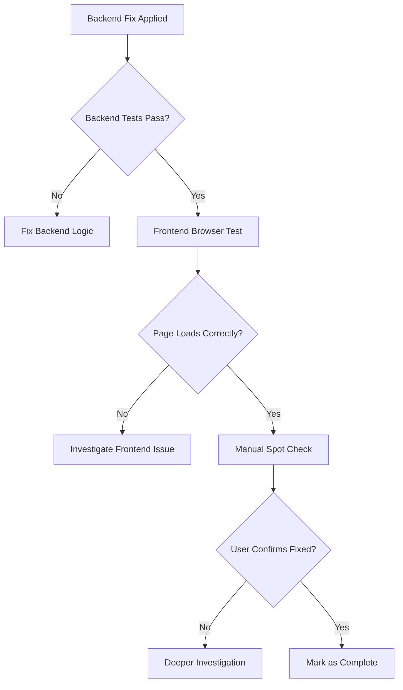

# QA Agent False Positive Validation Pattern

## Problem: QA Agent Claimed Bug Fixed, But User Confirmed Still Broken

**Bug #1102**: QA agent validated backend fix, marked as complete, but infinite reload loop still existed.

**User Feedback**: "The QA agent did a shoddy job. It took so long to test and it has passed a bug that still exists - just go to the page http://localhost:8081/collection/adaptive-forms and you can still see the infinite reloads"

## Root Cause: Incomplete Test Coverage

**What QA Agent Tested**:
- ✅ Backend: Questionnaires persist to database correctly
- ✅ Backend: `flag_modified()` calls prevent data loss
- ✅ API: Responses include questionnaire data

**What QA Agent MISSED**:
- ❌ Frontend: Actual page behavior in browser
- ❌ Frontend: Infinite reload loop in React hooks
- ❌ User Experience: Real user workflow end-to-end

**Why It Failed**:
1. QA focused on **backend logic** (data persistence)
2. Bug had **TWO separate issues**: backend (JSONB) + frontend (page reload)
3. Backend fix was correct, but frontend issue remained
4. QA didn't verify **user-facing behavior** in browser

## Mandatory Multi-Level Validation Pattern

When validating bug fixes, **ALWAYS test at BOTH levels**:

### Level 1: Backend Logic Testing (Necessary but NOT Sufficient)
```python
# Test backend data persistence
async def test_questionnaire_persistence():
    # Create flow
    flow = await create_collection_flow(...)

    # Generate questionnaire
    await generate_bootstrap_questionnaire(flow, db, context)

    # Verify persisted to database
    await db.refresh(flow)
    assert flow.collection_config["bootstrap_questionnaire"] is not None

    # ✅ Backend test PASSES
```

**Result**: Backend logic works ✅
**But**: User still sees infinite reloads ❌

### Level 2: Frontend Browser Testing (REQUIRED for UI Bugs)
```typescript
// Test actual page behavior with Playwright
test('adaptive forms page loads without infinite reload', async ({ page }) => {
  // Navigate to page
  await page.goto('http://localhost:8081/collection/adaptive-forms');

  // Wait for initial load
  await page.waitForSelector('[data-testid="asset-selection"]');

  // Monitor console for reload indicators
  const reloadLogs = [];
  page.on('console', msg => {
    if (msg.text().includes('[vite] connecting')) {
      reloadLogs.push(msg.text());
    }
  });

  // Wait and verify NO additional reloads after initial load
  await page.waitForTimeout(10000);  // 10 seconds observation

  // Should see exactly 1 initial connection, not repeated connections
  expect(reloadLogs.length).toBeLessThanOrEqual(1);

  // ✅ Frontend test would have CAUGHT the infinite loop
});
```

**Result**: Frontend test FAILS → reveals the bug still exists

## Workflow: Always Validate User-Facing Behavior



## Mandatory Checklist for Bug Validation

Before marking ANY bug as fixed:

- [ ] **Backend tests pass** (unit + integration)
- [ ] **Frontend tests pass** (Playwright browser automation)
- [ ] **Manual verification** in actual browser (not just test runner)
- [ ] **Console logs clean** (no errors, no infinite loops)
- [ ] **Network tab normal** (no request storms)
- [ ] **User workflow completes** (from start to finish)

**Missing ANY of these = incomplete validation**

## Bug #1102 Correct Validation Sequence

### What SHOULD Have Happened:

1. **Backend Fix Applied**:
   - Added `flag_modified()` calls
   - Tests confirmed JSONB persistence works

2. **Frontend Browser Test**:
   ```bash
   # Launch Playwright test
   npm run test:e2e -- adaptive-forms.spec.ts

   # Test navigates to page
   # FAILS: Detects infinite reload loop in console
   # Reveals: Frontend issue still exists
   ```

3. **Investigation**:
   - Backend fix works ✅
   - But page still broken ❌
   - Search for `window.location.reload()` in frontend code
   - Find reload calls in `useAdaptiveFormFlow.ts`

4. **Complete Fix**:
   - Backend: `flag_modified()` (already done)
   - Frontend: Remove `window.location.reload()` (now done)

5. **Re-validate**:
   - Backend tests: ✅ Pass
   - Frontend tests: ✅ Pass
   - Manual check: ✅ Page loads, no infinite reloads
   - User confirms: ✅ Bug resolved

## Red Flags for Incomplete Validation

**Warning Signs**:
- QA only tests backend API responses
- QA claims "works for me" without browser test
- QA validates in test environment but not production URLs
- QA checks database state but not UI behavior
- QA runs tests but doesn't observe actual page

**Golden Rule**: If the bug affects what users SEE, validation MUST include what users SEE (browser testing).

## Detection Pattern

When user reports issue persists after "fix":
1. ❌ **Don't blame user** - they're seeing real behavior
2. ✅ **Re-test user workflow exactly** - reproduce their steps
3. ✅ **Check test coverage gaps** - what did QA miss?
4. ✅ **Look for multi-component bugs** - backend + frontend issues combined

## Lesson from Bug #1102

**User was RIGHT, QA agent was WRONG**:
- Backend fix was partial solution (1 of 2 bugs)
- QA validated backend only (incomplete testing)
- Frontend issue remained undetected
- User manually verified and found persisting bug

**Takeaway**: Backend tests passing ≠ bug fixed. Always validate user-facing behavior.

## Tools for Multi-Level Validation

### Backend Validation
```bash
# Unit tests
pytest tests/unit/ -v

# Integration tests
pytest tests/integration/ -v

# Database state check
docker exec -it migration_postgres psql -U postgres -d migration_db -c "SELECT collection_config FROM migration.collection_flows WHERE flow_id = 'uuid';"
```

### Frontend Validation
```bash
# Playwright E2E test
npm run test:e2e -- --headed  # Watch browser behavior

# Manual browser check
open http://localhost:8081/collection/adaptive-forms
# Open DevTools → Console → Network → Watch for issues
```

### Combined Validation
```bash
# Full user journey test
npm run test:e2e:journey  # Tests complete flow end-to-end
```

## Files Referenced
- Bug #1102: Infinite reload loop validation failure
- QA agent: Incorrectly validated backend-only fix
- User feedback: Caught the persisting frontend bug

## Success Criteria

✅ **Properly validated fix**:
- Backend logic correct
- Frontend UI works
- Browser console clean
- User workflow completes
- No error logs
- User confirms resolution

❌ **Incomplete validation**:
- Only backend tested
- "Works on my machine"
- Test environment only
- Skipped browser verification
