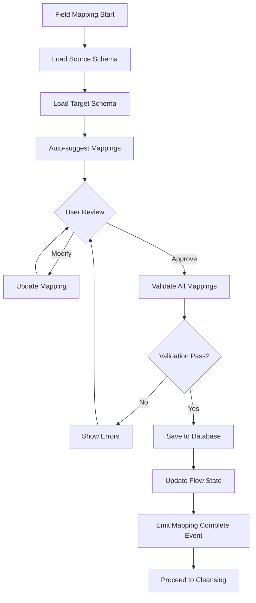

# Technical Implementation Guide - Platform Revamp July 2025

This guide provides specific code patterns, examples, and templates for implementing the platform revamp fixes identified in the agentic plan.

## 1. State Management Patterns

### 1.1 Database Transaction Patterns

#### Before (Anti-pattern with mixed state):
```python
# ❌ BAD: Mixed PostgreSQL and potential SQLite state
class OldFlowService:
    async def update_flow_state(self, flow_id: str, state_data: dict):
        # Direct database update without proper transaction
        flow = await self.db.query(DiscoveryFlow).filter_by(id=flow_id).first()
        flow.state_data = state_data
        await self.db.commit()
        
        # Separate state update (could fail)
        await self.state_manager.update(flow_id, state_data)
```

#### After (Proper transactional pattern):
```python
# ✅ GOOD: Single PostgreSQL transaction with proper error handling
class UnifiedFlowService:
    async def update_flow_state(self, flow_id: str, state_data: dict):
        async with AsyncSessionLocal() as session:
            async with session.begin():  # Automatic rollback on error
                try:
                    # Update flow record
                    flow = await session.get(DiscoveryFlow, flow_id)
                    if not flow:
                        raise FlowNotFoundError(f"Flow {flow_id} not found")
                    
                    # Validate state transition
                    self._validate_state_transition(flow.current_state, state_data)
                    
                    # Update in single transaction
                    flow.state_data = state_data
                    flow.updated_at = datetime.utcnow()
                    
                    # Create audit record
                    audit = FlowStateAudit(
                        flow_id=flow_id,
                        previous_state=flow.current_state,
                        new_state=state_data.get('phase'),
                        changed_by=self.current_user_id
                    )
                    session.add(audit)
                    
                    # Commit all changes atomically
                    await session.commit()
                    
                    # Emit event after successful commit
                    await self.event_bus.emit(
                        "flow.state.updated",
                        {"flow_id": flow_id, "new_state": state_data}
                    )
                    
                except Exception as e:
                    # Transaction automatically rolled back
                    logger.error(f"Failed to update flow state: {e}")
                    raise
```

### 1.2 Error Handling Templates

#### Comprehensive Error Handler:
```python
from typing import Optional, Dict, Any
from functools import wraps
import asyncio

class FlowOperationError(Exception):
    """Base exception for flow operations"""
    def __init__(self, message: str, flow_id: Optional[str] = None, details: Optional[Dict[str, Any]] = None):
        self.flow_id = flow_id
        self.details = details or {}
        super().__init__(message)

def handle_flow_errors(operation_name: str):
    """Decorator for consistent error handling across flow operations"""
    def decorator(func):
        @wraps(func)
        async def wrapper(*args, **kwargs):
            flow_id = kwargs.get('flow_id') or (args[1] if len(args) > 1 else None)
            
            try:
                return await func(*args, **kwargs)
            
            except asyncio.TimeoutError:
                error_msg = f"{operation_name} timed out for flow {flow_id}"
                logger.error(error_msg)
                raise FlowOperationError(error_msg, flow_id, {"error_type": "timeout"})
            
            except IntegrityError as e:
                error_msg = f"Database integrity error in {operation_name}"
                logger.error(f"{error_msg}: {e}")
                raise FlowOperationError(error_msg, flow_id, {"error_type": "integrity", "details": str(e)})
            
            except Exception as e:
                error_msg = f"Unexpected error in {operation_name}"
                logger.exception(f"{error_msg}: {e}")
                raise FlowOperationError(error_msg, flow_id, {"error_type": "unexpected", "details": str(e)})
        
        return wrapper
    return decorator

# Usage example:
class FlowService:
    @handle_flow_errors("create_flow")
    async def create_flow(self, flow_id: str, flow_data: dict):
        # Implementation with automatic error handling
        pass
```

### 1.3 State Recovery Pattern

```python
class StateRecoveryService:
    """Handles state recovery and consistency checks"""
    
    async def recover_flow_state(self, flow_id: str) -> Dict[str, Any]:
        """Recover flow state from database with validation"""
        async with AsyncSessionLocal() as session:
            # Get flow with all related data
            query = select(DiscoveryFlow).options(
                selectinload(DiscoveryFlow.phases),
                selectinload(DiscoveryFlow.audit_logs)
            ).where(DiscoveryFlow.id == flow_id)
            
            result = await session.execute(query)
            flow = result.scalar_one_or_none()
            
            if not flow:
                raise FlowNotFoundError(f"Flow {flow_id} not found")
            
            # Reconstruct state from database
            recovered_state = {
                "flow_id": flow.id,
                "current_phase": flow.current_phase,
                "phases": {},
                "metadata": flow.metadata or {},
                "created_at": flow.created_at.isoformat(),
                "updated_at": flow.updated_at.isoformat()
            }
            
            # Rebuild phase states
            for phase in flow.phases:
                recovered_state["phases"][phase.name] = {
                    "status": phase.status,
                    "started_at": phase.started_at.isoformat() if phase.started_at else None,
                    "completed_at": phase.completed_at.isoformat() if phase.completed_at else None,
                    "result_data": phase.result_data or {}
                }
            
            # Validate recovered state
            self._validate_state_consistency(recovered_state)
            
            return recovered_state
    
    def _validate_state_consistency(self, state: Dict[str, Any]):
        """Validate state consistency rules"""
        # Example validation rules
        if state["current_phase"] not in state["phases"]:
            raise ValueError(f"Current phase {state['current_phase']} not in phases")
        
        # Check phase progression
        phase_order = ["initialization", "data_import", "field_mapping", "cleansing", "validation"]
        completed_phases = [p for p, data in state["phases"].items() if data["status"] == "completed"]
        
        for i, phase in enumerate(completed_phases[1:], 1):
            prev_phase = completed_phases[i-1]
            if phase_order.index(phase) < phase_order.index(prev_phase):
                raise ValueError(f"Invalid phase progression: {prev_phase} -> {phase}")
```

## 2. Field Mapping Fix Details

### 2.1 API Changes Needed

#### Current Broken API (to be fixed):
```python
# ❌ Current: Incorrect parameter handling
@router.post("/field-mapping/submit")
async def submit_field_mapping(
    request: Request,
    mapping_data: dict = Body(...),  # Wrong: expects raw dict
    db: AsyncSession = Depends(get_async_db)
):
    # This doesn't properly validate the mapping structure
    pass
```

#### Fixed API Implementation:
```python
# ✅ Fixed: Proper data models and validation
from pydantic import BaseModel, Field, validator
from typing import List, Dict, Optional

class FieldMappingItem(BaseModel):
    """Single field mapping configuration"""
    source_field: str = Field(..., description="Source field name")
    target_field: str = Field(..., description="Target field name")
    transformation: Optional[str] = Field(None, description="Transformation function")
    data_type: str = Field(..., description="Expected data type")
    is_required: bool = Field(False, description="Whether field is required")
    
    @validator('data_type')
    def validate_data_type(cls, v):
        allowed_types = ['string', 'integer', 'float', 'boolean', 'datetime', 'json']
        if v not in allowed_types:
            raise ValueError(f"Invalid data type. Must be one of: {allowed_types}")
        return v

class FieldMappingRequest(BaseModel):
    """Complete field mapping submission"""
    flow_id: str
    mappings: List[FieldMappingItem]
    auto_map_remaining: bool = Field(False, description="Auto-map unmapped fields")
    validation_rules: Optional[Dict[str, Any]] = None

@router.post("/field-mapping/submit")
async def submit_field_mapping(
    request: Request,
    mapping_request: FieldMappingRequest,  # Proper model validation
    db: AsyncSession = Depends(get_async_db),
    current_user: Dict = Depends(get_current_user)
):
    """Submit field mapping configuration with validation"""
    try:
        # Extract multi-tenant context
        client_account_id = request.headers.get("X-Client-Account-ID")
        engagement_id = request.headers.get("X-Engagement-ID")
        
        if not all([client_account_id, engagement_id]):
            raise HTTPException(400, "Missing required tenant headers")
        
        # Validate flow exists and user has access
        flow = await validate_flow_access(
            db, mapping_request.flow_id, 
            client_account_id, current_user["id"]
        )
        
        # Process mapping
        service = FieldMappingService(db)
        result = await service.process_field_mapping(
            flow_id=mapping_request.flow_id,
            mappings=mapping_request.mappings,
            auto_map=mapping_request.auto_map_remaining,
            validation_rules=mapping_request.validation_rules
        )
        
        return {
            "status": "success",
            "flow_id": mapping_request.flow_id,
            "mapped_fields": len(result["mapped"]),
            "unmapped_fields": len(result["unmapped"]),
            "validation_warnings": result.get("warnings", [])
        }
        
    except Exception as e:
        logger.error(f"Field mapping submission failed: {e}")
        raise HTTPException(500, f"Failed to process field mapping: {str(e)}")

@router.get("/field-mapping/preview/{flow_id}")
async def preview_field_mapping(
    flow_id: str,
    request: Request,
    db: AsyncSession = Depends(get_async_db),
    current_user: Dict = Depends(get_current_user)
):
    """Get field mapping preview with source/target schemas"""
    # Implementation for previewing mappings
    pass
```

### 2.2 Frontend Component Modifications

#### Current Broken Component:
```typescript
// ❌ Current: Direct state manipulation without proper validation
const AttributeMapping = () => {
    const [mappings, setMappings] = useState({});
    
    const handleSubmit = async () => {
        // Sends raw unvalidated data
        await fetch('/api/v1/field-mapping/submit', {
            method: 'POST',
            body: JSON.stringify(mappings)
        });
    };
};
```

#### Fixed Frontend Implementation:
```typescript
// ✅ Fixed: Proper TypeScript types and validation
interface FieldMapping {
    sourceField: string;
    targetField: string;
    transformation?: string;
    dataType: 'string' | 'integer' | 'float' | 'boolean' | 'datetime' | 'json';
    isRequired: boolean;
}

interface FieldMappingState {
    mappings: FieldMapping[];
    unmappedSource: string[];
    unmappedTarget: string[];
    validationErrors: Record<string, string>;
}

const FieldMappingComponent: React.FC = () => {
    const { flowId } = useParams<{ flowId: string }>();
    const [state, setState] = useState<FieldMappingState>({
        mappings: [],
        unmappedSource: [],
        unmappedTarget: [],
        validationErrors: {}
    });
    
    // Load schemas on mount
    useEffect(() => {
        loadFieldSchemas();
    }, [flowId]);
    
    const loadFieldSchemas = async () => {
        try {
            const response = await apiClient.get(`/field-mapping/preview/${flowId}`);
            const { sourceSchema, targetSchema, suggestedMappings } = response.data;
            
            setState(prev => ({
                ...prev,
                mappings: suggestedMappings || [],
                unmappedSource: sourceSchema.fields.map(f => f.name),
                unmappedTarget: targetSchema.fields.map(f => f.name)
            }));
        } catch (error) {
            console.error('Failed to load schemas:', error);
            showError('Failed to load field schemas');
        }
    };
    
    const validateMapping = (mapping: FieldMapping): string | null => {
        if (!mapping.sourceField || !mapping.targetField) {
            return 'Both source and target fields are required';
        }
        
        if (mapping.dataType === 'integer' && mapping.sourceDataType === 'string') {
            if (!mapping.transformation) {
                return 'Transformation required for string to integer conversion';
            }
        }
        
        return null;
    };
    
    const handleAddMapping = (mapping: FieldMapping) => {
        const error = validateMapping(mapping);
        if (error) {
            setState(prev => ({
                ...prev,
                validationErrors: {
                    ...prev.validationErrors,
                    [mapping.sourceField]: error
                }
            }));
            return;
        }
        
        setState(prev => ({
            ...prev,
            mappings: [...prev.mappings, mapping],
            unmappedSource: prev.unmappedSource.filter(f => f !== mapping.sourceField),
            unmappedTarget: prev.unmappedTarget.filter(f => f !== mapping.targetField),
            validationErrors: {}
        }));
    };
    
    const handleSubmit = async () => {
        try {
            // Validate all mappings
            const errors: Record<string, string> = {};
            state.mappings.forEach(mapping => {
                const error = validateMapping(mapping);
                if (error) {
                    errors[mapping.sourceField] = error;
                }
            });
            
            if (Object.keys(errors).length > 0) {
                setState(prev => ({ ...prev, validationErrors: errors }));
                return;
            }
            
            // Submit with proper structure
            const response = await apiClient.post('/field-mapping/submit', {
                flow_id: flowId,
                mappings: state.mappings,
                auto_map_remaining: false,
                validation_rules: {}
            });
            
            if (response.data.status === 'success') {
                showSuccess('Field mappings saved successfully');
                // Navigate to next step
                navigate(`/discovery/cleansing/${flowId}`);
            }
        } catch (error) {
            console.error('Failed to submit mappings:', error);
            showError('Failed to save field mappings');
        }
    };
    
    return (
        <div className="field-mapping-container">
            {/* UI Components */}
        </div>
    );
};
```

### 2.3 State Flow Diagram



## 3. Real CrewAI Implementation

### 3.1 Agent Class Structures

#### Base CrewAI Agent Template:
```python
from crewai import Agent, Task, Crew
from typing import List, Dict, Any
import logging

class DiscoveryAgentBase:
    """Base class for discovery-related CrewAI agents"""
    
    def __init__(self, llm_config: Dict[str, Any]):
        self.llm_config = llm_config
        self.logger = logging.getLogger(self.__class__.__name__)
        
    def create_agent(self) -> Agent:
        """Create the CrewAI agent instance"""
        raise NotImplementedError("Subclasses must implement create_agent")
    
    def create_tasks(self, context: Dict[str, Any]) -> List[Task]:
        """Create tasks for this agent"""
        raise NotImplementedError("Subclasses must implement create_tasks")

class SchemaAnalysisAgent(DiscoveryAgentBase):
    """Agent for analyzing data schemas and structures"""
    
    def create_agent(self) -> Agent:
        return Agent(
            role="Senior Data Architect",
            goal="Analyze and understand complex data schemas to facilitate accurate migration",
            backstory="""You are an experienced data architect with 15+ years of experience 
            in enterprise data migrations. You excel at understanding complex data relationships,
            identifying data quality issues, and recommending optimal mapping strategies.""",
            llm=self.llm_config,
            verbose=True,
            allow_delegation=False,
            tools=[
                SchemaInspectorTool(),
                DataProfilerTool(),
                RelationshipAnalyzerTool()
            ]
        )
    
    def create_tasks(self, context: Dict[str, Any]) -> List[Task]:
        source_schema = context.get("source_schema", {})
        target_schema = context.get("target_schema", {})
        
        return [
            Task(
                description=f"""Analyze the source data schema and create a comprehensive report:
                
                Source Schema: {source_schema}
                
                Your analysis should include:
                1. Data types and constraints for each field
                2. Identified primary and foreign keys
                3. Data quality observations
                4. Potential migration challenges
                5. Recommended transformations
                
                Provide a structured JSON report with your findings.
                """,
                expected_output="Detailed JSON schema analysis report",
                agent=self.create_agent()
            ),
            Task(
                description=f"""Compare source and target schemas to identify mapping opportunities:
                
                Target Schema: {target_schema}
                
                Based on your source analysis, provide:
                1. Direct field mappings (1:1)
                2. Complex mappings requiring transformation
                3. Missing required fields in source
                4. Additional fields in source not in target
                5. Data type conversion requirements
                
                Output a mapping recommendation in JSON format.
                """,
                expected_output="JSON mapping recommendations",
                agent=self.create_agent()
            )
        ]

class DataQualityAgent(DiscoveryAgentBase):
    """Agent for assessing and improving data quality"""
    
    def create_agent(self) -> Agent:
        return Agent(
            role="Data Quality Specialist",
            goal="Ensure data meets quality standards for successful migration",
            backstory="""You are a meticulous data quality expert who has cleaned and 
            validated data for hundreds of enterprise migrations. You have a keen eye 
            for anomalies, inconsistencies, and potential data corruption.""",
            llm=self.llm_config,
            verbose=True,
            allow_delegation=False,
            tools=[
                DataValidatorTool(),
                AnomalyDetectorTool(),
                DataCleanserTool()
            ]
        )
    
    def create_tasks(self, context: Dict[str, Any]) -> List[Task]:
        data_sample = context.get("data_sample", [])
        quality_rules = context.get("quality_rules", {})
        
        return [
            Task(
                description=f"""Perform comprehensive data quality assessment:
                
                Data Sample Size: {len(data_sample)} records
                Quality Rules: {quality_rules}
                
                Analyze:
                1. Completeness (null values, missing data)
                2. Accuracy (data type mismatches, invalid values)
                3. Consistency (duplicate detection, referential integrity)
                4. Timeliness (date validations, stale data)
                5. Uniqueness (primary key violations)
                
                Provide a detailed quality report with severity levels.
                """,
                expected_output="Comprehensive data quality report",
                agent=self.create_agent()
            ),
            Task(
                description="""Create data cleansing recommendations:
                
                Based on the quality assessment, provide:
                1. Automated cleansing rules (regex, transformations)
                2. Manual review requirements
                3. Data enrichment opportunities
                4. Risk assessment for each issue
                5. Cleansing priority order
                
                Output actionable cleansing strategies.
                """,
                expected_output="Data cleansing strategy document",
                agent=self.create_agent()
            )
        ]
```

### 3.2 Crew Configuration Examples

```python
from crewai import Crew, Process
from typing import Dict, Any, List
import asyncio

class DiscoveryCrewOrchestrator:
    """Orchestrates multiple CrewAI agents for discovery flow"""
    
    def __init__(self, llm_config: Dict[str, Any]):
        self.llm_config = llm_config
        self.schema_agent = SchemaAnalysisAgent(llm_config)
        self.quality_agent = DataQualityAgent(llm_config)
        self.mapping_agent = FieldMappingAgent(llm_config)
        
    def create_discovery_crew(self, context: Dict[str, Any]) -> Crew:
        """Create a crew for the discovery phase"""
        
        # Create agents
        agents = [
            self.schema_agent.create_agent(),
            self.quality_agent.create_agent(),
            self.mapping_agent.create_agent()
        ]
        
        # Create tasks with dependencies
        schema_tasks = self.schema_agent.create_tasks(context)
        quality_tasks = self.quality_agent.create_tasks(context)
        mapping_tasks = self.mapping_agent.create_tasks(context)
        
        # Set task dependencies
        quality_tasks[0].context = [schema_tasks[1]]  # Quality depends on schema analysis
        mapping_tasks[0].context = [schema_tasks[1], quality_tasks[0]]  # Mapping depends on both
        
        all_tasks = schema_tasks + quality_tasks + mapping_tasks
        
        return Crew(
            agents=agents,
            tasks=all_tasks,
            process=Process.sequential,  # or Process.hierarchical for complex flows
            verbose=True,
            memory=True,  # Enable memory for context retention
            embedder={
                "provider": "openai",
                "config": {
                    "api_key": self.llm_config.get("openai_api_key")
                }
            }
        )
    
    async def run_discovery_analysis(self, flow_id: str, data: Dict[str, Any]) -> Dict[str, Any]:
        """Execute the discovery crew and return results"""
        try:
            # Prepare context
            context = {
                "flow_id": flow_id,
                "source_schema": data.get("source_schema"),
                "target_schema": data.get("target_schema"),
                "data_sample": data.get("data_sample", []),
                "quality_rules": data.get("quality_rules", {})
            }
            
            # Create and run crew
            crew = self.create_discovery_crew(context)
            
            # Execute crew (this is synchronous, so we run in executor)
            loop = asyncio.get_event_loop()
            result = await loop.run_in_executor(
                None,
                crew.kickoff
            )
            
            # Parse and structure results
            return self._parse_crew_results(result)
            
        except Exception as e:
            logger.error(f"Discovery crew execution failed: {e}")
            raise

    def _parse_crew_results(self, raw_result: Any) -> Dict[str, Any]:
        """Parse crew execution results into structured format"""
        return {
            "schema_analysis": raw_result.tasks_output[0].raw,
            "quality_assessment": raw_result.tasks_output[2].raw,
            "mapping_recommendations": raw_result.tasks_output[4].raw,
            "execution_time": raw_result.execution_time,
            "token_usage": raw_result.token_usage
        }
```

### 3.3 Task Definitions

```python
from crewai import Task
from typing import List, Dict, Any

class DiscoveryTaskFactory:
    """Factory for creating discovery-related tasks"""
    
    @staticmethod
    def create_data_profiling_task(agent: Agent, data_info: Dict[str, Any]) -> Task:
        """Create a comprehensive data profiling task"""
        return Task(
            description=f"""
            Perform deep data profiling on the provided dataset:
            
            Dataset: {data_info.get('name')}
            Size: {data_info.get('row_count')} rows, {data_info.get('column_count')} columns
            
            Profile the following aspects:
            1. Statistical summaries for numeric columns (mean, median, std dev, quartiles)
            2. Cardinality analysis for categorical columns
            3. Null value patterns and distributions
            4. Data type inference and validation
            5. Outlier detection using IQR and z-score methods
            6. Correlation analysis between numeric columns
            7. Time series patterns if date columns exist
            
            Output a comprehensive profiling report in JSON format with:
            - Column-level statistics
            - Data quality scores
            - Identified patterns and anomalies
            - Visualization recommendations
            """,
            expected_output="Detailed JSON data profiling report",
            agent=agent,
            tools=[DataProfilerTool(), StatisticalAnalyzer(), PatternDetector()]
        )
    
    @staticmethod
    def create_relationship_discovery_task(agent: Agent, schema: Dict[str, Any]) -> Task:
        """Create task for discovering data relationships"""
        return Task(
            description=f"""
            Analyze the schema to discover hidden relationships and dependencies:
            
            Schema Tables: {list(schema.get('tables', {}).keys())}
            
            Investigate:
            1. Foreign key relationships not explicitly defined
            2. Composite key patterns
            3. Hierarchical data structures
            4. Many-to-many relationship indicators
            5. Temporal relationships between tables
            6. Business logic encoded in data patterns
            
            Use statistical analysis and pattern matching to identify:
            - Column name similarities
            - Data distribution matches
            - Referential patterns
            - Business rule indicators
            
            Provide a relationship map with confidence scores.
            """,
            expected_output="JSON relationship discovery report with confidence scores",
            agent=agent,
            tools=[RelationshipAnalyzer(), PatternMatcher(), BusinessRuleDetector()]
        )
    
    @staticmethod
    def create_migration_risk_assessment_task(agent: Agent, context: Dict[str, Any]) -> Task:
        """Create task for assessing migration risks"""
        return Task(
            description=f"""
            Conduct a comprehensive migration risk assessment:
            
            Source System: {context.get('source_system')}
            Target System: {context.get('target_system')}
            Data Volume: {context.get('data_volume')}
            
            Assess risks in the following categories:
            
            1. Data Loss Risks:
               - Precision loss in numeric conversions
               - Character encoding issues
               - Truncation possibilities
            
            2. Performance Risks:
               - Large table migration strategies
               - Index recreation overhead
               - Network bandwidth constraints
            
            3. Business Continuity Risks:
               - Downtime requirements
               - Rollback complexity
               - Data synchronization challenges
            
            4. Compliance Risks:
               - Data privacy requirements
               - Audit trail maintenance
               - Regulatory constraints
            
            Provide risk mitigation strategies for each identified risk.
            """,
            expected_output="Comprehensive risk assessment with mitigation strategies",
            agent=agent,
            tools=[RiskAnalyzer(), ComplianceChecker(), PerformanceEstimator()]
        )
```

## 4. Code Removal Guide

### 4.1 Files to Delete

```python
# Complete list of files to remove with safety checks

files_to_remove = [
    # Legacy API endpoints
    "backend/app/api/v2/discovery_flow_v2.py",  # Deprecated v2 endpoint
    
    # Session-based implementations
    "backend/app/services/session_manager.py",  # Old session management
    "backend/app/models/session_models.py",     # Session data models
    
    # Mixed state implementations  
    "backend/app/services/state/dual_state_manager.py",  # SQLite/PostgreSQL mix
    
    # Old flow implementations
    "backend/app/services/discovery_flow_old.py",  # Pre-CrewAI flow
    
    # Deprecated utilities
    "backend/app/utils/session_utils.py",  # Session-related utilities
    "backend/app/utils/state_migration.py",  # One-time migration scripts
]

# Script to safely remove files
import os
import shutil
from datetime import datetime

def safe_remove_deprecated_files(files: List[str], backup_dir: str = "deprecated_backup"):
    """Safely remove deprecated files with backup"""
    
    # Create backup directory
    timestamp = datetime.now().strftime("%Y%m%d_%H%M%S")
    backup_path = f"{backup_dir}/{timestamp}"
    os.makedirs(backup_path, exist_ok=True)
    
    removed_files = []
    errors = []
    
    for file_path in files:
        try:
            if os.path.exists(file_path):
                # Create backup
                backup_file = os.path.join(backup_path, os.path.basename(file_path))
                shutil.copy2(file_path, backup_file)
                
                # Remove original
                os.remove(file_path)
                removed_files.append(file_path)
                print(f"✓ Removed: {file_path}")
            else:
                print(f"⚠ Not found: {file_path}")
                
        except Exception as e:
            errors.append(f"Failed to remove {file_path}: {e}")
            print(f"✗ Error: {file_path} - {e}")
    
    # Write removal log
    with open(f"{backup_path}/removal_log.txt", "w") as f:
        f.write(f"Removal Date: {datetime.now()}\n")
        f.write(f"Files Removed: {len(removed_files)}\n")
        f.write(f"Errors: {len(errors)}\n\n")
        f.write("Removed Files:\n")
        for file in removed_files:
            f.write(f"  - {file}\n")
        if errors:
            f.write("\nErrors:\n")
            for error in errors:
                f.write(f"  - {error}\n")
    
    return removed_files, errors
```

### 4.2 Functions to Remove

```python
# Functions and methods to remove from existing files

# In backend/app/services/discovery_service.py
# REMOVE these session-based methods:
class DiscoveryService:
    # DELETE THIS METHOD
    def create_session(self, user_id: str) -> str:
        """Creates a new discovery session"""
        pass
    
    # DELETE THIS METHOD  
    def get_session_state(self, session_id: str) -> dict:
        """Gets session state"""
        pass
    
    # DELETE THIS METHOD
    def update_session_state(self, session_id: str, state: dict):
        """Updates session state"""
        pass

# In backend/app/api/v1/endpoints/discovery.py
# REMOVE these endpoints:
@router.post("/session/create")  # DELETE
@router.get("/session/{session_id}/state")  # DELETE
@router.put("/session/{session_id}/state")  # DELETE

# In backend/app/models/discovery.py
# REMOVE these fields from DiscoveryFlow model:
class DiscoveryFlow(Base):
    # session_id = Column(String, unique=True)  # DELETE THIS LINE
    # session_data = Column(JSON)  # DELETE THIS LINE
    # Keep flow_id and other fields
```

### 4.3 Patterns to Eliminate

```python
# Pattern elimination guide with examples

# 1. Session ID patterns to remove
# BEFORE (Remove this pattern):
def process_discovery(session_id: str, data: dict):
    session = get_session(session_id)
    session.update(data)
    
# AFTER (Use this pattern):
def process_discovery(flow_id: str, data: dict):
    flow = get_flow(flow_id)
    flow.update_state(data)

# 2. Dual state patterns to remove  
# BEFORE (Remove this pattern):
class DualStateManager:
    def save_state(self, key: str, data: dict):
        self.postgres_store.save(key, data)
        self.sqlite_store.save(key, data)  # Remove SQLite
        
# AFTER (Use this pattern):
class FlowStateManager:
    def save_state(self, flow_id: str, data: dict):
        # PostgreSQL only
        self.postgres_store.save(flow_id, data)

# 3. Direct database access patterns to remove
# BEFORE (Remove this pattern):
def get_discovery_data():
    conn = psycopg2.connect(DATABASE_URL)
    cursor = conn.cursor()
    cursor.execute("SELECT * FROM discovery_flows")
    
# AFTER (Use this pattern):
async def get_discovery_data():
    async with AsyncSessionLocal() as session:
        result = await session.execute(
            select(DiscoveryFlow).where(
                DiscoveryFlow.client_account_id == self.client_account_id
            )
        )
        return result.scalars().all()

# 4. Synchronous patterns to remove
# BEFORE (Remove this pattern):
def slow_operation():
    time.sleep(5)
    return process_data()
    
# AFTER (Use this pattern):
async def fast_operation():
    await asyncio.sleep(5)
    return await process_data_async()
```

## 5. Testing Patterns

### 5.1 Unit Test Templates

```python
# Base test class for flow operations
import pytest
from unittest.mock import Mock, AsyncMock, patch
from datetime import datetime

class TestFlowBase:
    """Base class for flow-related tests"""
    
    @pytest.fixture
    async def mock_db_session(self):
        """Mock database session"""
        session = AsyncMock()
        session.begin = AsyncMock()
        session.commit = AsyncMock()
        session.rollback = AsyncMock()
        return session
    
    @pytest.fixture
    def mock_flow(self):
        """Mock discovery flow object"""
        flow = Mock()
        flow.id = "test-flow-123"
        flow.client_account_id = 1
        flow.status = "active"
        flow.created_at = datetime.utcnow()
        flow.state_data = {}
        return flow
    
    @pytest.fixture
    def mock_event_bus(self):
        """Mock event bus for testing events"""
        bus = AsyncMock()
        bus.emit = AsyncMock()
        return bus

# Unit test for state management
class TestFlowStateManager(TestFlowBase):
    
    @pytest.mark.asyncio
    async def test_update_state_success(self, mock_db_session, mock_flow, mock_event_bus):
        """Test successful state update"""
        # Arrange
        mock_db_session.get.return_value = mock_flow
        state_manager = FlowStateManager(mock_db_session, mock_event_bus)
        new_state = {"phase": "field_mapping", "progress": 50}
        
        # Act
        result = await state_manager.update_state("test-flow-123", new_state)
        
        # Assert
        assert result is True
        assert mock_flow.state_data == new_state
        mock_db_session.commit.assert_called_once()
        mock_event_bus.emit.assert_called_once_with(
            "flow.state.updated",
            {"flow_id": "test-flow-123", "new_state": new_state}
        )
    
    @pytest.mark.asyncio
    async def test_update_state_flow_not_found(self, mock_db_session, mock_event_bus):
        """Test state update with non-existent flow"""
        # Arrange
        mock_db_session.get.return_value = None
        state_manager = FlowStateManager(mock_db_session, mock_event_bus)
        
        # Act & Assert
        with pytest.raises(FlowNotFoundError):
            await state_manager.update_state("non-existent", {})
        
        mock_db_session.commit.assert_not_called()
        mock_event_bus.emit.assert_not_called()
    
    @pytest.mark.asyncio
    async def test_update_state_transaction_rollback(self, mock_db_session, mock_flow):
        """Test transaction rollback on error"""
        # Arrange
        mock_db_session.get.return_value = mock_flow
        mock_db_session.commit.side_effect = Exception("DB Error")
        state_manager = FlowStateManager(mock_db_session)
        
        # Act & Assert
        with pytest.raises(Exception):
            await state_manager.update_state("test-flow-123", {})
        
        # Transaction should be rolled back (handled by context manager)
        assert mock_db_session.commit.called

# Unit test for field mapping
class TestFieldMappingService(TestFlowBase):
    
    @pytest.mark.asyncio
    async def test_validate_mapping_success(self):
        """Test successful mapping validation"""
        service = FieldMappingService(Mock())
        
        mapping = FieldMappingItem(
            source_field="customer_id",
            target_field="customerId", 
            transformation="camelCase",
            data_type="string",
            is_required=True
        )
        
        result = service.validate_mapping(mapping)
        assert result.is_valid is True
        assert len(result.warnings) == 0
    
    @pytest.mark.asyncio
    async def test_validate_mapping_type_mismatch(self):
        """Test mapping validation with type mismatch"""
        service = FieldMappingService(Mock())
        
        mapping = FieldMappingItem(
            source_field="age",
            target_field="age",
            transformation=None,  # No transformation
            data_type="string",  # Expecting string
            is_required=True
        )
        
        # Mock source schema shows age is integer
        source_schema = {"age": {"type": "integer"}}
        
        result = service.validate_mapping(mapping, source_schema)
        assert result.is_valid is False
        assert "Type mismatch" in result.errors[0]
```

### 5.2 Integration Test Examples

```python
# Integration tests for complete flows
import pytest
from httpx import AsyncClient
from sqlalchemy.ext.asyncio import AsyncSession

class TestDiscoveryFlowIntegration:
    """Integration tests for discovery flow"""
    
    @pytest.mark.asyncio
    async def test_complete_discovery_flow(
        self, 
        async_client: AsyncClient,
        test_db: AsyncSession,
        test_user_headers: dict
    ):
        """Test complete discovery flow from start to finish"""
        
        # 1. Initialize flow
        init_response = await async_client.post(
            "/api/v1/unified-discovery/flow/initialize",
            json={
                "name": "Test Discovery",
                "source_system": "ServiceNow",
                "target_system": "AWS"
            },
            headers=test_user_headers
        )
        assert init_response.status_code == 200
        flow_id = init_response.json()["flow_id"]
        
        # 2. Upload data
        with open("tests/fixtures/sample_cmdb.csv", "rb") as f:
            files = {"file": ("cmdb.csv", f, "text/csv")}
            upload_response = await async_client.post(
                f"/api/v1/data-import/upload/{flow_id}",
                files=files,
                headers=test_user_headers
            )
        assert upload_response.status_code == 200
        
        # 3. Wait for processing
        await asyncio.sleep(2)
        
        # 4. Check field mapping suggestions
        mapping_response = await async_client.get(
            f"/api/v1/field-mapping/preview/{flow_id}",
            headers=test_user_headers
        )
        assert mapping_response.status_code == 200
        assert "suggested_mappings" in mapping_response.json()
        
        # 5. Submit field mappings
        submit_response = await async_client.post(
            "/api/v1/field-mapping/submit",
            json={
                "flow_id": flow_id,
                "mappings": mapping_response.json()["suggested_mappings"],
                "auto_map_remaining": True
            },
            headers=test_user_headers
        )
        assert submit_response.status_code == 200
        
        # 6. Verify flow status
        status_response = await async_client.get(
            f"/api/v1/unified-discovery/flow/status/{flow_id}",
            headers=test_user_headers
        )
        assert status_response.status_code == 200
        assert status_response.json()["current_phase"] == "cleansing"
        
        # 7. Verify database state
        flow = await test_db.get(DiscoveryFlow, flow_id)
        assert flow is not None
        assert flow.current_phase == "cleansing"
        assert len(flow.phases) >= 3  # init, import, mapping
    
    @pytest.mark.asyncio
    async def test_flow_error_handling(
        self,
        async_client: AsyncClient,
        test_user_headers: dict
    ):
        """Test error handling in discovery flow"""
        
        # 1. Try to access non-existent flow
        response = await async_client.get(
            "/api/v1/unified-discovery/flow/status/non-existent",
            headers=test_user_headers
        )
        assert response.status_code == 404
        
        # 2. Try to upload invalid file type
        files = {"file": ("test.exe", b"invalid", "application/exe")}
        response = await async_client.post(
            "/api/v1/data-import/upload/some-flow",
            files=files,
            headers=test_user_headers
        )
        assert response.status_code == 400
        assert "Invalid file type" in response.json()["detail"]
```

### 5.3 End-to-End Test Scenarios

```python
# E2E test scenarios using Playwright
from playwright.async_api import async_playwright, Page
import pytest

class TestDiscoveryFlowE2E:
    """End-to-end tests for discovery flow UI"""
    
    @pytest.mark.asyncio
    async def test_discovery_flow_ui_journey(self, authenticated_page: Page):
        """Test complete discovery flow through UI"""
        
        # 1. Navigate to discovery page
        await authenticated_page.goto("/discovery")
        await authenticated_page.wait_for_load_state("networkidle")
        
        # 2. Start new discovery
        await authenticated_page.click("button:text('New Discovery')")
        
        # 3. Fill discovery form
        await authenticated_page.fill("input[name='name']", "E2E Test Discovery")
        await authenticated_page.select_option("select[name='sourceSystem']", "ServiceNow")
        await authenticated_page.select_option("select[name='targetSystem']", "AWS")
        await authenticated_page.click("button:text('Start Discovery')")
        
        # 4. Wait for redirect to import page
        await authenticated_page.wait_for_url("**/discovery/cmdb-import/**")
        
        # 5. Upload test file
        await authenticated_page.set_input_files(
            "input[type='file']",
            "tests/fixtures/sample_cmdb.csv"
        )
        await authenticated_page.click("button:text('Upload')")
        
        # 6. Wait for processing
        await authenticated_page.wait_for_selector("text=Upload successful", timeout=30000)
        
        # 7. Navigate to field mapping
        await authenticated_page.click("button:text('Continue to Field Mapping')")
        await authenticated_page.wait_for_url("**/discovery/field-mapping/**")
        
        # 8. Verify mapping suggestions loaded
        await authenticated_page.wait_for_selector(".mapping-row", timeout=10000)
        mapping_rows = await authenticated_page.query_selector_all(".mapping-row")
        assert len(mapping_rows) > 0
        
        # 9. Accept mappings
        await authenticated_page.click("button:text('Accept All Suggestions')")
        await authenticated_page.click("button:text('Save Mappings')")
        
        # 10. Verify navigation to cleansing
        await authenticated_page.wait_for_url("**/discovery/cleansing/**")
        
        # 11. Check final status
        status_text = await authenticated_page.text_content(".flow-status")
        assert "cleansing" in status_text.lower()
    
    @pytest.mark.asyncio
    async def test_discovery_flow_error_recovery(self, authenticated_page: Page):
        """Test error handling and recovery in UI"""
        
        # 1. Start discovery with invalid data
        await authenticated_page.goto("/discovery")
        await authenticated_page.click("button:text('New Discovery')")
        
        # 2. Submit form without required fields
        await authenticated_page.click("button:text('Start Discovery')")
        
        # 3. Verify error messages
        error_message = await authenticated_page.wait_for_selector(".error-message")
        assert await error_message.is_visible()
        assert "required" in (await error_message.text_content()).lower()
        
        # 4. Fill required fields and retry
        await authenticated_page.fill("input[name='name']", "Recovery Test")
        await authenticated_page.select_option("select[name='sourceSystem']", "ServiceNow")
        await authenticated_page.select_option("select[name='targetSystem']", "AWS")
        await authenticated_page.click("button:text('Start Discovery')")
        
        # 5. Verify successful submission
        await authenticated_page.wait_for_url("**/discovery/cmdb-import/**")
```

## 6. Database Migrations

### 6.1 SQL Scripts Needed

```sql
-- Migration: Remove session_id and cleanup legacy fields
-- File: alembic/versions/xxx_remove_session_id.py

"""Remove session_id and legacy fields

Revision ID: xxx
Revises: yyy
Create Date: 2025-01-07 10:00:00.000000

"""
from alembic import op
import sqlalchemy as sa
from sqlalchemy.dialects import postgresql

def upgrade():
    # 1. Drop session_id column if exists
    op.drop_column('discovery_flows', 'session_id')
    
    # 2. Drop session_data column if exists
    op.drop_column('discovery_flows', 'session_data')
    
    # 3. Add new indices for performance
    op.create_index(
        'idx_discovery_flows_client_flow',
        'discovery_flows',
        ['client_account_id', 'id']
    )
    
    op.create_index(
        'idx_discovery_flows_status_updated',
        'discovery_flows',
        ['status', 'updated_at']
    )
    
    # 4. Add flow_metadata column if not exists
    op.add_column(
        'discovery_flows',
        sa.Column('flow_metadata', postgresql.JSONB, nullable=True)
    )
    
    # 5. Create flow_events table for event sourcing
    op.create_table(
        'flow_events',
        sa.Column('id', sa.String, primary_key=True),
        sa.Column('flow_id', sa.String, sa.ForeignKey('discovery_flows.id'), nullable=False),
        sa.Column('event_type', sa.String, nullable=False),
        sa.Column('event_data', postgresql.JSONB, nullable=False),
        sa.Column('created_at', sa.DateTime, server_default=sa.func.now()),
        sa.Column('created_by', sa.Integer, sa.ForeignKey('users.id'))
    )
    
    op.create_index('idx_flow_events_flow_created', 'flow_events', ['flow_id', 'created_at'])

def downgrade():
    op.drop_table('flow_events')
    op.drop_column('discovery_flows', 'flow_metadata')
    op.drop_index('idx_discovery_flows_status_updated')
    op.drop_index('idx_discovery_flows_client_flow')
    # Note: Not adding back session_id as it's deprecated
```

### 6.2 Data Cleanup Queries

```sql
-- Data cleanup scripts to run before/after migration

-- 1. Identify orphaned records
SELECT df.id, df.created_at, df.status
FROM discovery_flows df
LEFT JOIN client_accounts ca ON df.client_account_id = ca.id
WHERE ca.id IS NULL;

-- 2. Clean up incomplete flows older than 30 days
DELETE FROM discovery_flows
WHERE status IN ('initializing', 'failed')
AND updated_at < NOW() - INTERVAL '30 days';

-- 3. Archive completed flows to history table
INSERT INTO discovery_flows_history
SELECT * FROM discovery_flows
WHERE status = 'completed'
AND updated_at < NOW() - INTERVAL '90 days';

DELETE FROM discovery_flows
WHERE status = 'completed'
AND updated_at < NOW() - INTERVAL '90 days';

-- 4. Update null state_data to empty JSON
UPDATE discovery_flows
SET state_data = '{}'::jsonb
WHERE state_data IS NULL;

-- 5. Consolidate duplicate flows per client
WITH duplicates AS (
    SELECT 
        client_account_id,
        engagement_id,
        MIN(created_at) as earliest,
        COUNT(*) as count
    FROM discovery_flows
    WHERE status = 'active'
    GROUP BY client_account_id, engagement_id
    HAVING COUNT(*) > 1
)
UPDATE discovery_flows df
SET status = 'archived'
FROM duplicates d
WHERE df.client_account_id = d.client_account_id
AND df.engagement_id = d.engagement_id
AND df.created_at > d.earliest;

-- 6. Vacuum and analyze for performance
VACUUM ANALYZE discovery_flows;
VACUUM ANALYZE flow_phases;
```

### 6.3 Index Optimizations

```sql
-- Performance optimization indices

-- 1. Composite indices for common queries
CREATE INDEX CONCURRENTLY idx_discovery_flows_client_status_updated
ON discovery_flows(client_account_id, status, updated_at DESC);

CREATE INDEX CONCURRENTLY idx_flow_phases_flow_status
ON flow_phases(discovery_flow_id, status);

-- 2. Partial indices for active flows
CREATE INDEX CONCURRENTLY idx_active_flows
ON discovery_flows(client_account_id, created_at DESC)
WHERE status IN ('active', 'in_progress');

-- 3. JSONB indices for state queries
CREATE INDEX CONCURRENTLY idx_flow_state_phase
ON discovery_flows USING gin((state_data->'current_phase'));

CREATE INDEX CONCURRENTLY idx_flow_metadata
ON discovery_flows USING gin(flow_metadata);

-- 4. Text search index for flow names
CREATE INDEX CONCURRENTLY idx_flow_name_search
ON discovery_flows USING gin(to_tsvector('english', name));

-- 5. Index for event queries
CREATE INDEX CONCURRENTLY idx_flow_events_type_created
ON flow_events(event_type, created_at DESC);

-- 6. Foreign key indices
CREATE INDEX CONCURRENTLY idx_flows_engagement
ON discovery_flows(engagement_id);

CREATE INDEX CONCURRENTLY idx_flows_created_by
ON discovery_flows(created_by);

-- 7. Analyze table statistics
ANALYZE discovery_flows;
ANALYZE flow_phases;
ANALYZE flow_events;

-- 8. Check index usage
SELECT 
    schemaname,
    tablename,
    indexname,
    idx_scan as index_scans,
    idx_tup_read as tuples_read,
    idx_tup_fetch as tuples_fetched
FROM pg_stat_user_indexes
WHERE schemaname = 'public'
AND tablename IN ('discovery_flows', 'flow_phases', 'flow_events')
ORDER BY idx_scan DESC;
```

## Implementation Checklist

### Phase 1: State Management Fix (Week 1)
- [ ] Implement new FlowStateManager with proper transactions
- [ ] Update all state operations to use new manager
- [ ] Add comprehensive error handling
- [ ] Create state recovery mechanisms
- [ ] Write unit tests for state operations
- [ ] Deploy and monitor for issues

### Phase 2: Field Mapping Fix (Week 1-2)
- [ ] Create proper Pydantic models for field mapping
- [ ] Update API endpoints with validation
- [ ] Fix frontend components with TypeScript types
- [ ] Add mapping validation logic
- [ ] Implement auto-mapping suggestions
- [ ] Test end-to-end flow

### Phase 3: Real CrewAI Implementation (Week 2-3)
- [ ] Create SchemaAnalysisAgent
- [ ] Create DataQualityAgent
- [ ] Create FieldMappingAgent
- [ ] Implement crew orchestration
- [ ] Add agent tools and utilities
- [ ] Test agent interactions

### Phase 4: Code Cleanup (Week 3-4)
- [ ] Run file removal script
- [ ] Update imports in remaining files
- [ ] Remove deprecated functions
- [ ] Clean up database schema
- [ ] Update documentation
- [ ] Final testing and validation

### Phase 5: Database Migration (Week 4)
- [ ] Create and test migration scripts
- [ ] Run data cleanup queries
- [ ] Apply index optimizations
- [ ] Monitor query performance
- [ ] Validate data integrity
- [ ] Document changes

---

**Note**: This guide should be used in conjunction with the AGENTIC_REVAMP_PLAN.md for complete implementation guidance. Always test changes thoroughly in a development environment before applying to production.