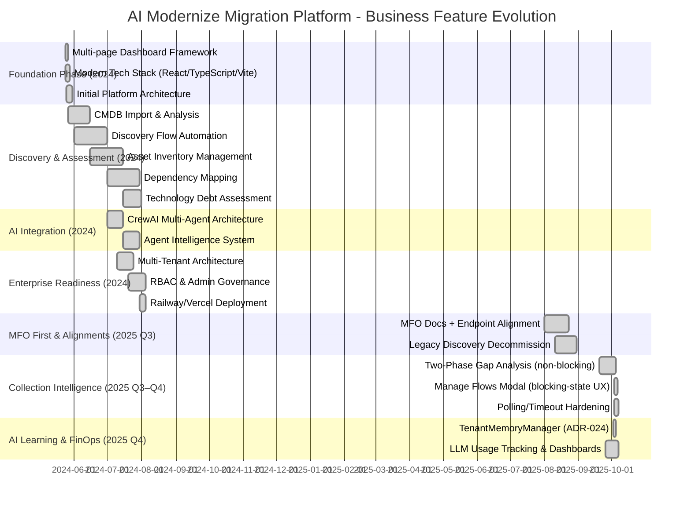

# AI Modernize Migration Platform - Business Application Evolution

## Executive Summary

The platform has matured from concept to an enterprise-grade system (May 2024 → October 2025), now centered on an MFO-first architecture, tenant-scoped learning, and FinOps-grade LLM usage tracking. The latest cycle focused on reliability, cost transparency, and non-blocking user flows—especially within Collection—while hardening multi-tenant boundaries and aligning all flows behind the Master Flow Orchestrator.

**Key Business Achievements (Updated 2025):**
- 17 AI agents across the migration lifecycle (13 active today)
- MFO-first unification: all lifecycle operations via `/api/v1/master-flows/*`
- Two-phase gap analysis for Collection with non-blocking progress polling
- Manage Flows modal to recover from blocking states and keep work moving
- TenantMemoryManager adoption (ADR-024) for enterprise agent learning (pgvector)
- LLM usage FinOps: enforced tracking, admin dashboards, and cost observability
- Real-time experience via SSE-ready smart polling (no WebSockets required)
- Modularized MFO package and endpoint alignment across flows

## Platform Overview

The AI Modernize Migration Platform orchestrates the migration journey across: **Discovery**, **Assessment**, **Planning**, **Execution**, **Modernization**, **Decommission**, and FinOps visibility. Built with a Next.js/TypeScript frontend and a FastAPI backend, the system uses **CrewAI** agents under a strict multi-tenant architecture. The Master Flow Orchestrator (MFO) is the single entry for lifecycle operations; child flows are internal implementation details.

### Core Business Value Proposition
- Accelerated delivery: significant cycle-time reductions via non-blocking flows
- Risk mitigation: agentic analysis and validation, with MFO-governed state
- Cost control: LLM usage tracked and optimized with model routing
- Enterprise scale: multi-tenant isolation for concurrent engagements
- Compliance: RBAC and auditable AI usage with hardened API patterns

## Business Feature Timeline (Updated)

## Key Capability Milestones (New & Updated)

### MFO-First Architecture (Q3 2025)
**Business Impact**: Unified, governable flow lifecycle
- All lifecycle operations consolidated under `/api/v1/master-flows/*`
- Legacy discovery endpoints removed; unified discovery accessed via MFO
- Clear separation: master state vs child operational state (two-table pattern)

### Collection Flow Intelligence (Q3–Q4 2025)
**Business Impact**: Throughput and UX resilience
- Two-phase gap analysis with progress polling (non-blocking execution)
- Manage Flows modal enables users to act even in blocking states
- Routing stability for `asset_selection` and related phases
- UI polish: AG Grid visibility fixes; questionnaire display and write-back resolved

### FinOps for LLM Usage (Q4 2025)
**Business Impact**: Cost transparency and control
- All LLM calls tracked via multi-model service; admin dashboards expose consumption
- Intelligent model selection for cost/performance optimization
- Usage logs and summaries by feature, model, and tenant

### Enterprise Agent Learning (Q4 2025)
**Business Impact**: Safer, scalable learning
- TenantMemoryManager replaces CrewAI memory; pgvector-backed and tenant-scoped
- Eliminates 401s from legacy embedding paths; explicit factory-based configuration
- Standard APIs to store and retrieve patterns before/after agent runs

## Technical Architecture Evolution (Highlights)

### Then → Now
- From mixed flow entry points → MFO-only lifecycle orchestration
- From file-based/fragile agent memory → Tenant-scoped pgvector learning
- From WebSocket assumptions → SSE-ready smart polling (Railway-friendly)
- From monolith files → Modularized MFO package and routers with clear precedence

### What This Enables
- Predictable flow control and recoverability (Manage Flows)
- Lower total cost of ownership via LLM FinOps
- Reliable real-time UX without persistent connections
- Safer multi-tenant isolation with auditable learning

## Business Value Delivered

### Operational Efficiency
- Non-blocking Collection workflows increase parallelism and shorten cycles
- MFO governance reduces failure modes and speeds incident resolution

### Cost & Compliance
- LLM usage visibility strengthens budgeting and accountability
- Tenant-scoped learning with auditability improves data governance

### Customer Outcomes
- Faster time-to-value in discovery/collection phases
- Higher confidence through structured AI recommendations and validation

## Current Status and Roadmap

### Current Capabilities (October 2025)
- Discovery → Assessment orchestration via MFO (production)
- Two-phase Collection gap analysis with progress polling (production)
- Manage Flows UX to unblock work and handle edge states (production)
- TenantMemoryManager integrated; CrewAI memory disabled by default
- LLM usage tracking dashboards and admin endpoints available
- Real-time experience delivered via resilient polling; SSE-ready design

### Forward Look (Q1–Q2 2026)
- CloudBridge integrations for external systems connectivity
- Advanced analytics: predictive success and ROI dashboards
- Additional phase agents (Execution, Modernization, Decommission) to active
- Enterprise security and compliance enhancements

## Market Positioning

The platform advances beyond traditional tools by combining MFO-governed workflows, agentic intelligence, tenant-aware learning, and FinOps transparency. This creates durable differentiation in reliability, scalability, and cost control across complex enterprise migrations.

## Conclusion

From a strong 2024 foundation to a hardened, enterprise-ready platform in 2025, the system now pairs governed orchestration with intelligent, cost-aware automation. With non-blocking Collection flows, tenant-scoped learning, and MFO-first operations, the platform delivers faster outcomes, lower risk, and measurable cost control—positioning the solution for continued expansion in 2026.