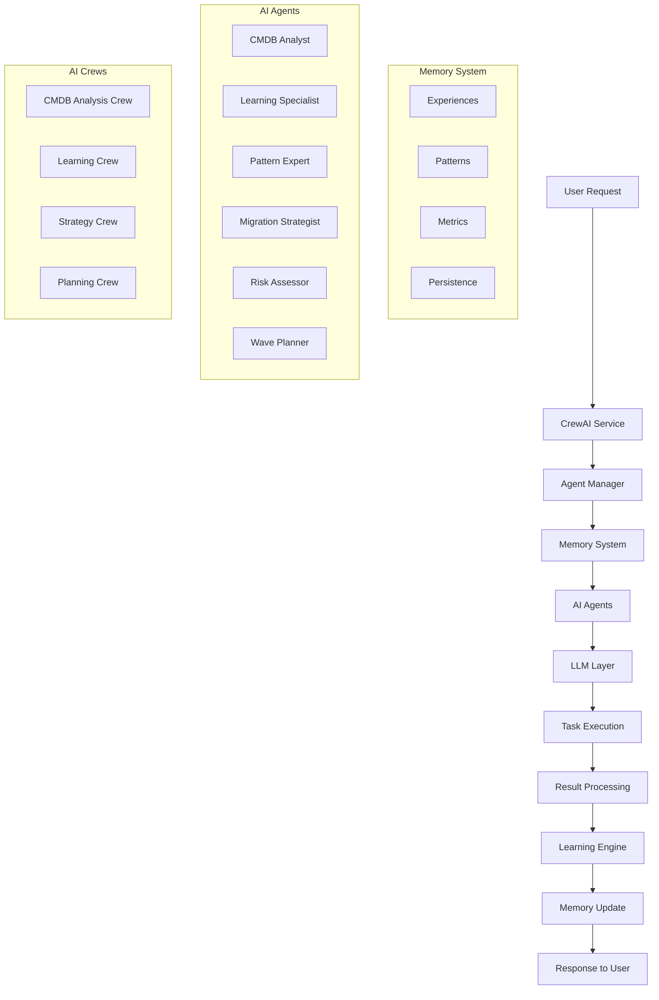
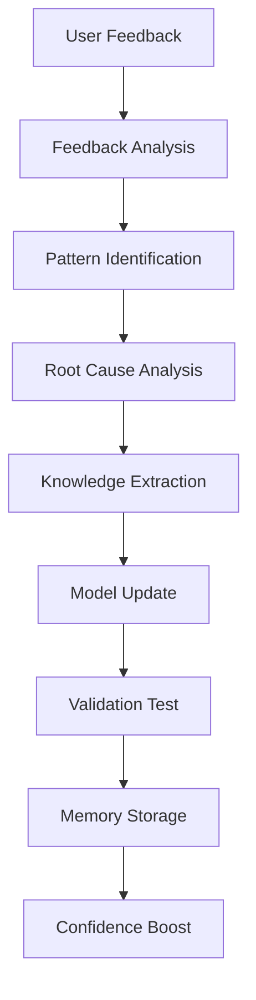
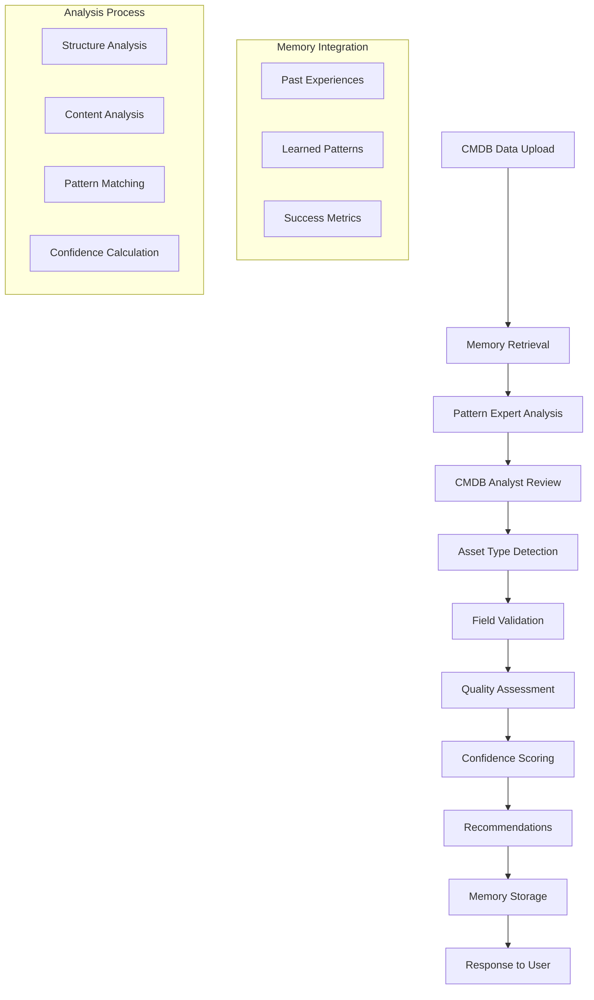
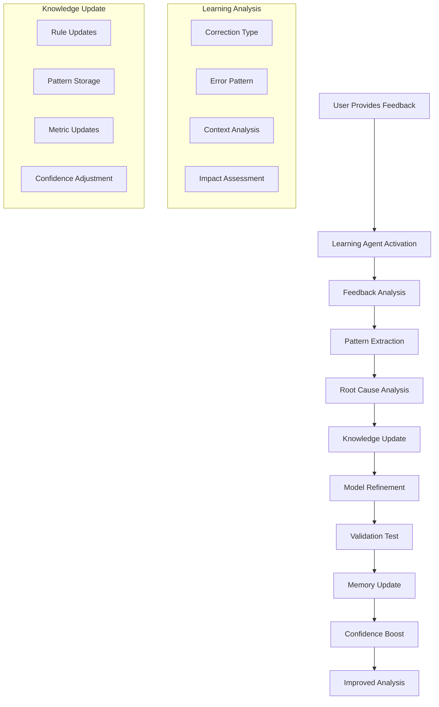
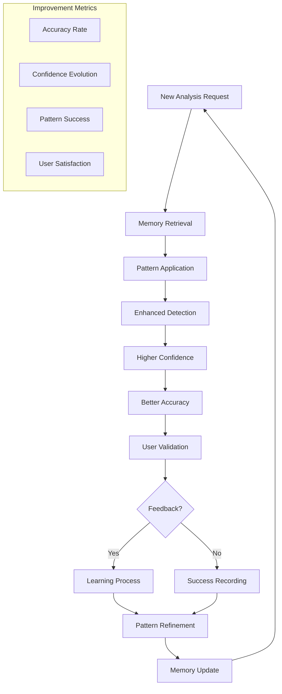

# CrewAI Agentic Framework Documentation

## Overview

The AI Force Migration Platform implements a truly agentic AI system using CrewAI, providing intelligent, memory-enabled agents that learn and adapt over time. This system goes beyond simple rule-based analysis to deliver contextual, learning-based insights for CMDB data analysis and migration planning.

## Table of Contents

1. [Architecture Overview](#architecture-overview)
2. [AI Agents](#ai-agents)
3. [Agent Memory System](#agent-memory-system)
4. [AI Crews (Collaborative Teams)](#ai-crews-collaborative-teams)
5. [Language Model Integration](#language-model-integration)
6. [Learning Process](#learning-process)
7. [API Integration](#api-integration)
8. [Configuration](#configuration)
9. [Intelligence Features](#intelligence-features)
10. [Performance Metrics](#performance-metrics)
11. [Fallback System](#fallback-system)
12. [Implementation Details](#implementation-details)
13. [Testing](#testing)
14. [Best Practices](#best-practices)
15. [Troubleshooting](#troubleshooting)

## Architecture Overview

### High-Level Architecture

```
┌─────────────────────────────────────────────────────────────────────────────────┐
│                           CrewAI Agentic System                                │
├─────────────────────────────────────────────────────────────────────────────────┤
│  ┌─────────────────┐  ┌─────────────────┐  ┌──────────────┐  ┌──────────────┐ │
│  │   Agent Memory  │  │   AI Agents     │  │   AI Crews   │  │   Learning   │ │
│  │   System        │  │   (Specialists) │  │   (Teams)    │  │   Engine     │ │
│  │                 │  │                 │  │              │  │              │ │
│  │ • Experiences   │  │ • CMDB Analyst  │  │ • Analysis   │  │ • Feedback   │ │
│  │ • Patterns      │  │ • Learning Spec │  │ • Learning   │  │ • Patterns   │ │
│  │ • Metrics       │  │ • Pattern Expert│  │ • Strategy   │  │ • Updates    │ │
│  │ • Persistence   │  │ • Strategist    │  │ • Planning   │  │ • Metrics    │ │
│  └─────────────────┘  └─────────────────┘  └──────────────┘  └──────────────┘ │
├─────────────────────────────────────────────────────────────────────────────────┤
│  ┌─────────────────┐  ┌─────────────────┐  ┌──────────────┐  ┌──────────────┐ │
│  │   LLM Layer     │  │   Task Engine   │  │   API Layer  │  │   Fallback   │ │
│  │                 │  │                 │  │              │  │   System     │ │
│  │ • GPT-4 Primary │  │ • Task Creation │  │ • REST API   │  │ • Intelligent│ │
│  │ • Llama Fallback│  │ • Execution     │  │ • WebSocket  │  │ • Memory-Based│ │
│  │ • Temperature   │  │ • Result Parse  │  │ • Real-time  │  │ • Graceful   │ │
│  │ • Token Limits  │  │ • Error Handle  │  │ • Feedback   │  │ • Degradation│ │
│  └─────────────────┘  └─────────────────┘  └──────────────┘  └──────────────┘ │
└─────────────────────────────────────────────────────────────────────────────────┘
```

### Component Interaction Flow



## AI Agents

### 1. CMDB Data Analyst Agent

**Role**: Senior CMDB Data Analyst  
**Expertise**: 15+ years in enterprise asset management  
**Specialization**: Asset type detection, data quality assessment, migration readiness

**Agent Configuration**:
```python
Agent(
    role='Senior CMDB Data Analyst',
    goal='Analyze CMDB data with expert precision and context awareness',
    backstory="""You are a Senior CMDB Data Analyst with over 15 years of experience 
    in enterprise asset management and cloud migration projects. You understand the 
    nuances of different asset types and their specific requirements for migration 
    planning.""",
    verbose=True,
    allow_delegation=False,
    llm=self.llm,
    memory=True
)
```

**Capabilities**:
- **Asset Type Intelligence**: Distinguishes between Applications, Servers, Databases, Network devices
- **Context-Aware Analysis**: Understands asset-specific field requirements
- **Memory Integration**: Applies learned patterns from previous analyses
- **Migration Focus**: Provides migration-specific recommendations

**Asset Type Understanding**:
```python
# Applications
{
    "focus": ["Business services", "versions", "dependencies", "environments"],
    "not_required": ["Hardware specs", "CPU", "Memory", "IP Address"],
    "key_fields": ["Name", "Version", "Environment", "Business_Owner", "Dependencies"],
    "migration_considerations": ["Dependencies", "Business_Impact", "Downtime_Tolerance"]
}

# Servers
{
    "focus": ["Infrastructure specs", "OS details", "network config"],
    "required": ["Hardware specs", "network configuration", "OS version"],
    "key_fields": ["Hostname", "OS", "CPU_Cores", "Memory_GB", "IP_Address"],
    "migration_considerations": ["Hardware_Compatibility", "OS_Support", "Network_Requirements"]
}

# Databases
{
    "focus": ["Instance details", "host relationships", "connection info"],
    "required": ["Version", "connection info", "host mapping", "database type"],
    "key_fields": ["DB_Name", "Version", "Host_Server", "Port", "DB_Type"],
    "migration_considerations": ["Data_Size", "Backup_Strategy", "Replication_Setup"]
}
```

### 2. AI Learning Specialist Agent

**Role**: AI Learning Specialist  
**Expertise**: Feedback processing and continuous improvement  
**Specialization**: Pattern recognition, accuracy enhancement, error correction

**Agent Configuration**:
```python
Agent(
    role='AI Learning Specialist',
    goal='Process feedback and continuously improve analysis accuracy',
    backstory="""You are an AI Learning Specialist focused on processing user 
    feedback to improve system accuracy. You excel at identifying patterns in 
    corrections and updating analysis models in real-time.""",
    verbose=True,
    allow_delegation=False,
    llm=self.llm,
    memory=True
)
```

**Learning Capabilities**:
- **Feedback Analysis**: Deep analysis of user corrections
- **Pattern Extraction**: Identifies recurring correction patterns
- **Model Updates**: Real-time updates to analysis criteria
- **Error Prevention**: Learns to avoid repeated mistakes

**Learning Process Flow**:


### 3. Data Pattern Recognition Expert

**Role**: Data Pattern Recognition Expert  
**Expertise**: CMDB structure analysis and format adaptation  
**Specialization**: Field mapping, data structure understanding, format detection

**Agent Configuration**:
```python
Agent(
    role='Data Pattern Recognition Expert',
    goal='Analyze and understand CMDB data structures and patterns',
    backstory="""You are a Data Pattern Recognition Expert specializing in CMDB 
    export formats. You can quickly identify asset types, field relationships, 
    and data quality issues across different CMDB systems.""",
    verbose=True,
    allow_delegation=False,
    llm=self.llm,
    memory=True
)
```

**Pattern Recognition Capabilities**:
- **Format Detection**: Identifies CMDB system types (ServiceNow, BMC Remedy, etc.)
- **Field Mapping**: Maps fields to standard asset attributes
- **Relationship Analysis**: Identifies dependency and relationship patterns
- **Quality Assessment**: Detects data quality issues and inconsistencies

### 4. Migration Strategy Expert

**Role**: Migration Strategy Expert  
**Expertise**: 6R strategy analysis and migration planning  
**Specialization**: Rehost, Replatform, Refactor, Rearchitect, Retire, Retain analysis

**Agent Configuration**:
```python
Agent(
    role='Migration Strategy Expert',
    goal='Analyze assets and recommend optimal 6R migration strategies',
    backstory="""You are a Migration Strategy Expert with deep knowledge of the 
    6R migration strategies. You can assess technical complexity, business impact, 
    and recommend the most appropriate migration approach for each asset.""",
    verbose=True,
    allow_delegation=False,
    llm=self.llm,
    memory=True
)
```

### 5. Risk Assessment Specialist

**Role**: Risk Assessment Specialist  
**Expertise**: Migration risk analysis and mitigation planning  
**Specialization**: Technical, business, security, and operational risk assessment

**Agent Configuration**:
```python
Agent(
    role='Risk Assessment Specialist',
    goal='Identify and assess migration risks with mitigation strategies',
    backstory="""You are a Risk Assessment Specialist with expertise in identifying 
    and mitigating migration risks. You understand technical, business, security, 
    and operational risks associated with cloud migrations.""",
    verbose=True,
    allow_delegation=False,
    llm=self.llm,
    memory=True
)
```

### 6. Wave Planning Coordinator

**Role**: Wave Planning Coordinator  
**Expertise**: Migration sequencing and dependency management  
**Specialization**: Wave optimization, resource planning, timeline management

**Agent Configuration**:
```python
Agent(
    role='Wave Planning Coordinator',
    goal='Optimize migration wave planning based on dependencies and priorities',
    backstory="""You are a Wave Planning Coordinator expert who creates optimal 
    migration sequences considering asset dependencies, business priorities, and 
    resource constraints while minimizing business disruption.""",
    verbose=True,
    allow_delegation=False,
    llm=self.llm,
    memory=True
)
```

## Agent Memory System

### Memory Architecture

```python
class AgentMemory:
    """Persistent memory system for AI agents with learning capabilities."""
    
    def __init__(self, data_dir: str = "backend/data"):
        self.data_dir = Path(data_dir)
        self.data_dir.mkdir(exist_ok=True)
        self.memory_file = self.data_dir / "agent_memory.pkl"
        
        # Memory structure
        self.experiences = {
            "analysis_attempt": [],      # Every analysis performed
            "user_feedback": [],         # All user corrections
            "learned_patterns": [],      # Extracted patterns
            "successful_analysis": [],   # Confirmed accurate analyses
            "placeholder_analysis": []   # Intelligent fallback analyses
        }
        
        # Learning metrics
        self.learning_metrics = {
            "total_analyses": 0,
            "user_corrections": 0,
            "accuracy_improvements": 0.0,
            "confidence_evolution": [],
            "pattern_recognition_success": 0
        }
```

### Memory Types and Structure

#### 1. Analysis Attempts
```python
{
    "type": "analysis_attempt",
    "timestamp": "2025-01-27T10:30:00Z",
    "filename": "cmdb_export.csv",
    "data_structure": {
        "columns": ["Name", "Type", "Environment"],
        "row_count": 1500,
        "asset_types_detected": ["application", "server"]
    },
    "analysis_result": {
        "primary_asset_type": "application",
        "confidence": 0.85,
        "quality_score": 78
    }
}
```

#### 2. User Feedback
```python
{
    "type": "user_feedback",
    "timestamp": "2025-01-27T10:35:00Z",
    "filename": "cmdb_export.csv",
    "original_analysis": {...},
    "user_corrections": {
        "asset_type_override": "server",
        "analysis_issues": "Incorrectly classified servers as applications",
        "missing_fields_feedback": "IP Address is required for servers"
    },
    "learning_impact": {
        "pattern_identified": "CI_TYPE field indicates server when value contains 'Server'",
        "rule_updated": "Enhanced server detection logic"
    }
}
```

#### 3. Learned Patterns
```python
{
    "type": "learned_pattern",
    "timestamp": "2025-01-27T10:40:00Z",
    "pattern_category": "asset_type_detection",
    "pattern_description": "CI_TYPE field with 'Server' value indicates server asset",
    "confidence_boost": 0.15,
    "success_rate": 0.92,
    "applications": ["server_detection", "field_validation"],
    "source_feedback_count": 5
}
```

#### 4. Learning Metrics Evolution
```python
{
    "timestamp": "2025-01-27T10:45:00Z",
    "total_analyses": 150,
    "user_corrections": 12,
    "accuracy_rate": 0.92,
    "confidence_evolution": [
        {"date": "2025-01-20", "avg_confidence": 0.65},
        {"date": "2025-01-27", "avg_confidence": 0.87}
    ],
    "pattern_recognition_success": 0.89
}
```

### Memory Operations

#### Storing Experiences
```python
def add_experience(self, experience_type: str, data: Dict[str, Any]):
    """Add a new experience to memory."""
    experience = {
        "timestamp": datetime.utcnow().isoformat(),
        "type": experience_type,
        **data
    }
    self.experiences[experience_type].append(experience)
    self.save_memory()
```

#### Retrieving Relevant Experiences
```python
def get_relevant_experiences(self, filename: str, limit: int = 10) -> List[Dict]:
    """Get relevant past experiences for current analysis."""
    relevant = []
    
    # Get experiences with similar filenames or patterns
    for exp_type, experiences in self.experiences.items():
        for exp in experiences[-limit:]:  # Recent experiences
            if self._is_relevant(exp, filename):
                relevant.append(exp)
    
    return sorted(relevant, key=lambda x: x['timestamp'], reverse=True)[:limit]
```

#### Learning Metrics Updates
```python
def update_learning_metrics(self, metric: str, value: Any):
    """Update learning metrics with new values."""
    if metric in self.learning_metrics:
        if isinstance(self.learning_metrics[metric], (int, float)):
            self.learning_metrics[metric] += value
        else:
            self.learning_metrics[metric] = value
    self.save_memory()
```

## AI Crews (Collaborative Teams)

### 1. CMDB Analysis Crew

**Purpose**: Collaborative CMDB data analysis with multiple expert perspectives  
**Members**: CMDB Analyst + Pattern Recognition Expert  

```python
Crew(
    agents=[
        self.agents['cmdb_analyst'],
        self.agents['pattern_agent']
    ],
    verbose=True,
    memory=True,
    process=Process.sequential
)
```

**Workflow**:
1. **Pattern Expert** analyzes data structure and identifies patterns
2. **CMDB Analyst** performs detailed asset classification
3. **Collaborative Review** of findings and quality assessment
4. **Joint Recommendation** generation with confidence scoring

### 2. Learning Crew

**Purpose**: Feedback processing and continuous improvement  
**Members**: Learning Specialist + CMDB Analyst  

```python
Crew(
    agents=[
        self.agents['learning_agent'],
        self.agents['cmdb_analyst']
    ],
    verbose=True,
    memory=True,
    process=Process.sequential
)
```

**Workflow**:
1. **Learning Specialist** processes user feedback and identifies patterns
2. **CMDB Analyst** validates corrections and updates analysis logic
3. **Collaborative Pattern Extraction** from feedback data
4. **Joint Knowledge Update** with improved analysis criteria

### 3. Migration Strategy Crew

**Purpose**: Comprehensive migration strategy development  
**Members**: Migration Strategist + Risk Assessor  

```python
Crew(
    agents=[
        self.agents['migration_strategist'],
        self.agents['risk_assessor']
    ],
    verbose=True,
    memory=True,
    process=Process.sequential
)
```

**Workflow**:
1. **Migration Strategist** analyzes assets and recommends 6R strategies
2. **Risk Assessor** evaluates risks and mitigation strategies
3. **Collaborative Strategy Refinement** based on risk assessment
4. **Joint Strategy Recommendation** with risk-adjusted priorities

### 4. Wave Planning Crew

**Purpose**: Optimized migration wave planning and sequencing  
**Members**: Wave Planner + Migration Strategist  

```python
Crew(
    agents=[
        self.agents['wave_planner'],
        self.agents['migration_strategist']
    ],
    verbose=True,
    memory=True,
    process=Process.sequential
)
```

**Workflow**:
1. **Wave Planner** analyzes dependencies and creates initial wave structure
2. **Migration Strategist** validates wave assignments against 6R strategies
3. **Collaborative Wave Optimization** for efficiency and risk minimization
4. **Joint Wave Plan** with timeline and resource recommendations

## Language Model Integration

### Primary: OpenAI GPT-4

**Configuration**:
```python
llm = ChatOpenAI(
    model="gpt-4",
    temperature=0.3,  # Lower temperature for consistent analysis
    max_tokens=2048,
    api_key=settings.OPENAI_API_KEY,
    request_timeout=60
)
```

**Advantages**:
- Superior reasoning capabilities
- Better context understanding
- More consistent responses
- Advanced pattern recognition

**Use Cases**:
- Complex CMDB analysis
- Nuanced feedback processing
- Strategic migration planning
- Risk assessment

### Fallback: DeepInfra Llama

**Configuration**:
```python
llm = DeepInfra(
    model_id="meta-llama/Llama-4-Maverick-17B-128E-Instruct-FP8",
    deepinfra_api_token=settings.DEEPINFRA_API_KEY,
    max_tokens=2048,
    temperature=0.3
)
```

**Advantages**:
- Cost-effective alternative
- Good performance for structured tasks
- Reliable availability
- Open-source foundation

**Use Cases**:
- Backup when OpenAI unavailable
- High-volume processing
- Development and testing
- Cost-sensitive operations

### Model Selection Logic

```python
def _initialize_llm(self):
    """Initialize the language model with fallback strategy."""
    try:
        # Try OpenAI first for better reliability
        if hasattr(settings, 'OPENAI_API_KEY') and settings.OPENAI_API_KEY:
            self.llm = ChatOpenAI(
                model="gpt-4",
                temperature=0.3,
                api_key=settings.OPENAI_API_KEY
            )
            logger.info("Initialized OpenAI GPT-4 LLM")
            return
        
        # Fallback to DeepInfra
        if settings.DEEPINFRA_API_KEY:
            self.llm = DeepInfra(
                model_id=settings.CREWAI_MODEL,
                deepinfra_api_token=settings.DEEPINFRA_API_KEY
            )
            logger.info(f"Initialized DeepInfra LLM: {settings.CREWAI_MODEL}")
            return
            
        # No LLM available
        self.llm = None
        logger.warning("No API keys available for LLM initialization")
        
    except Exception as e:
        logger.error(f"Failed to initialize LLM: {e}")
        self.llm = None
```

## Learning Process

### 1. Initial Analysis Workflow



### 2. User Feedback Processing



### 3. Continuous Improvement Cycle



## API Integration

### Analysis Endpoint

**Endpoint**: `POST /api/v1/discovery/analyze-cmdb`

**Request**:
```json
{
    "filename": "cmdb_export.csv",
    "content": "Name,Type,Environment,CPU,Memory\nApp1,Application,Prod,4,8\nServer1,Server,Prod,8,16",
    "fileType": "text/csv"
}
```

**Response**:
```json
{
    "success": true,
    "analysis": {
        "asset_type_detected": "mixed",
        "confidence_level": 0.92,
        "data_quality_score": 85,
        "issues": [
            "Missing IP Address for servers",
            "Inconsistent naming convention"
        ],
        "recommendations": [
            "Standardize server naming",
            "Add network configuration for servers"
        ],
        "missing_fields_relevant": ["IP_Address", "OS_Version"],
        "migration_readiness": "needs_work",
        "learning_notes": "Applied learned pattern for server detection",
        "memory_context": {
            "similar_analyses": 3,
            "confidence_boost": 0.15,
            "patterns_applied": ["server_detection", "field_validation"]
        }
    },
    "processing_time": 2.3,
    "agent_used": "cmdb_analyst",
    "crew_collaboration": true
}
```

### Feedback Endpoint

**Endpoint**: `POST /api/v1/discovery/cmdb-feedback`

**Request**:
```json
{
    "filename": "cmdb_export.csv",
    "originalAnalysis": {
        "asset_type_detected": "application",
        "confidence_level": 0.75,
        "issues": ["Missing hardware specs"]
    },
    "userCorrections": {
        "assetType": "server",
        "analysisIssues": "These are servers, not applications. Hardware specs are required.",
        "comments": "CI_TYPE field clearly indicates Server"
    },
    "assetTypeOverride": "server"
}
```

**Response**:
```json
{
    "success": true,
    "learning_applied": true,
    "patterns_identified": [
        "CI_TYPE field with 'Server' value indicates server asset",
        "Hardware specs required for server assets"
    ],
    "knowledge_updates": [
        "Enhanced server detection logic",
        "Updated field requirements for servers"
    ],
    "accuracy_improvements": [
        "Server detection confidence increased by 0.20",
        "Field validation improved for server assets"
    ],
    "confidence_boost": 0.18,
    "corrected_analysis": {
        "asset_type": "server",
        "relevant_missing_fields": ["IP_Address", "OS_Version"],
        "updated_recommendations": [
            "Collect IP addresses for all servers",
            "Document OS versions for compatibility assessment"
        ]
    },
    "memory_impact": {
        "new_patterns_stored": 2,
        "learning_metrics_updated": true,
        "future_analysis_improvement": "Expected 15% accuracy boost"
    }
}
```

### Real-time Updates via WebSocket

**Connection**: `ws://localhost:8000/ws/analysis`

**Message Types**:
```json
// Analysis Progress
{
    "type": "analysis_progress",
    "stage": "pattern_recognition",
    "progress": 45,
    "message": "Analyzing data patterns..."
}

// Learning Update
{
    "type": "learning_update",
    "patterns_learned": 2,
    "confidence_boost": 0.12,
    "message": "System learned new patterns from feedback"
}

// Analysis Complete
{
    "type": "analysis_complete",
    "result": {...},
    "processing_time": 3.2,
    "agents_involved": ["cmdb_analyst", "pattern_expert"]
}
```

## Configuration

### Environment Variables

```bash
# Primary AI Provider (Recommended)
OPENAI_API_KEY=sk-your-openai-key-here

# Fallback AI Provider
DEEPINFRA_API_KEY=your-deepinfra-key-here
DEEPINFRA_MODEL=meta-llama/Llama-4-Maverick-17B-128E-Instruct-FP8
DEEPINFRA_BASE_URL=https://api.deepinfra.com/v1/inference

# CrewAI Configuration
CREWAI_MODEL=meta-llama/Llama-4-Maverick-17B-128E-Instruct-FP8
CREWAI_TEMPERATURE=0.3
CREWAI_MAX_TOKENS=2048

# Memory and Learning
AGENT_MEMORY_DIR=backend/data
MEMORY_PERSISTENCE=true
LEARNING_ENABLED=true

# Performance Settings
AGENT_TIMEOUT=60
MAX_CONCURRENT_AGENTS=5
MEMORY_CLEANUP_INTERVAL=86400  # 24 hours

# Logging
LOG_LEVEL=INFO
AGENT_VERBOSE=true
CREW_VERBOSE=true
```

### CrewAI Service Configuration

```python
# backend/app/core/config.py
class Settings(BaseSettings):
    # AI Configuration
    OPENAI_API_KEY: Optional[str] = None
    DEEPINFRA_API_KEY: Optional[str] = None
    DEEPINFRA_MODEL: str = "meta-llama/Llama-4-Maverick-17B-128E-Instruct-FP8"
    
    # CrewAI Settings
    CREWAI_MODEL: str = "meta-llama/Llama-4-Maverick-17B-128E-Instruct-FP8"
    CREWAI_TEMPERATURE: float = 0.3
    CREWAI_MAX_TOKENS: int = 2048
    
    # Memory Configuration
    AGENT_MEMORY_DIR: str = "backend/data"
    MEMORY_PERSISTENCE: bool = True
    LEARNING_ENABLED: bool = True
    
    class Config:
        env_file = ".env"
```

## Intelligence Features

### Asset Type Detection

#### Multi-Layer Detection Strategy

```python
def detect_asset_type(self, data: Dict) -> Dict[str, Any]:
    """Multi-layer asset type detection with confidence scoring."""
    
    # Layer 1: Explicit Type Columns
    explicit_confidence = self._check_explicit_type_columns(data)
    
    # Layer 2: Field Pattern Analysis
    pattern_confidence = self._analyze_field_patterns(data)
    
    # Layer 3: Content Analysis
    content_confidence = self._analyze_content_patterns(data)
    
    # Layer 4: Memory-Enhanced Detection
    memory_confidence = self._apply_learned_patterns(data)
    
    # Combine confidences with weights
    final_confidence = (
        explicit_confidence * 0.4 +
        pattern_confidence * 0.25 +
        content_confidence * 0.20 +
        memory_confidence * 0.15
    )
    
    return {
        "asset_type": self._determine_primary_type(data),
        "confidence": final_confidence,
        "detection_layers": {
            "explicit": explicit_confidence,
            "pattern": pattern_confidence,
            "content": content_confidence,
            "memory": memory_confidence
        }
    }
```

#### Asset Type Indicators

```python
ASSET_TYPE_INDICATORS = {
    "application": {
        "explicit_columns": ["app_type", "application_type", "service_type"],
        "field_patterns": ["version", "environment", "business_owner"],
        "content_patterns": ["app", "service", "application"],
        "exclusion_patterns": ["server", "host", "infrastructure"]
    },
    "server": {
        "explicit_columns": ["server_type", "host_type", "infrastructure_type"],
        "field_patterns": ["cpu", "memory", "ip_address", "hostname"],
        "content_patterns": ["server", "host", "vm", "virtual"],
        "exclusion_patterns": ["application", "service", "database"]
    },
    "database": {
        "explicit_columns": ["db_type", "database_type", "instance_type"],
        "field_patterns": ["port", "instance", "schema", "connection"],
        "content_patterns": ["db", "database", "sql", "oracle", "mysql"],
        "exclusion_patterns": ["server", "application", "service"]
    }
}
```

### Field Relevance Mapping

#### Context-Aware Field Requirements

```python
FIELD_REQUIREMENTS = {
    "application": {
        "required": ["name", "version", "environment"],
        "important": ["business_owner", "dependencies", "criticality"],
        "optional": ["description", "vendor", "license"],
        "irrelevant": ["cpu_cores", "memory_gb", "ip_address", "hostname"]
    },
    "server": {
        "required": ["hostname", "ip_address", "os", "cpu_cores", "memory_gb"],
        "important": ["environment", "location", "owner"],
        "optional": ["serial_number", "warranty", "vendor"],
        "irrelevant": ["application_version", "business_owner"]
    },
    "database": {
        "required": ["db_name", "version", "host_server", "port"],
        "important": ["db_type", "instance_name", "connection_string"],
        "optional": ["backup_schedule", "replication"],
        "irrelevant": ["cpu_cores", "memory_gb"]
    }
}
```

#### Learning-Based Field Mapping

```python
def update_field_relevance(self, asset_type: str, field: str, relevance: str):
    """Update field relevance based on user feedback."""
    
    pattern = {
        "asset_type": asset_type,
        "field": field,
        "relevance": relevance,
        "timestamp": datetime.utcnow().isoformat(),
        "source": "user_feedback"
    }
    
    # Store the learning pattern
    self.memory.add_experience("learned_patterns", {
        "pattern_type": "field_relevance",
        "pattern": pattern,
        "confidence_impact": 0.1
    })
    
    # Update field requirements
    if relevance == "required" and field in FIELD_REQUIREMENTS[asset_type]["irrelevant"]:
        FIELD_REQUIREMENTS[asset_type]["irrelevant"].remove(field)
        FIELD_REQUIREMENTS[asset_type]["required"].append(field)
```

### Quality Assessment

#### Multi-Dimensional Quality Scoring

```python
def calculate_quality_score(self, data: Dict, asset_type: str) -> Dict[str, Any]:
    """Calculate comprehensive data quality score."""
    
    scores = {
        "completeness": self._assess_completeness(data, asset_type),
        "consistency": self._assess_consistency(data),
        "accuracy": self._assess_accuracy(data, asset_type),
        "relevance": self._assess_relevance(data, asset_type),
        "migration_readiness": self._assess_migration_readiness(data, asset_type)
    }
    
    # Weighted overall score
    overall_score = (
        scores["completeness"] * 0.25 +
        scores["consistency"] * 0.20 +
        scores["accuracy"] * 0.20 +
        scores["relevance"] * 0.15 +
        scores["migration_readiness"] * 0.20
    )
    
    return {
        "overall_score": overall_score,
        "dimension_scores": scores,
        "quality_level": self._determine_quality_level(overall_score),
        "improvement_recommendations": self._generate_improvement_recommendations(scores)
    }
```

## Performance Metrics

### Learning Effectiveness Metrics

```python
class LearningMetrics:
    """Track learning effectiveness and system improvement."""
    
    def __init__(self):
        self.metrics = {
            "accuracy_evolution": [],
            "confidence_trends": [],
            "pattern_recognition_success": [],
            "user_satisfaction": [],
            "error_reduction": []
        }
    
    def track_accuracy_improvement(self, before: float, after: float):
        """Track accuracy improvements from learning."""
        improvement = after - before
        self.metrics["accuracy_evolution"].append({
            "timestamp": datetime.utcnow().isoformat(),
            "before": before,
            "after": after,
            "improvement": improvement
        })
    
    def track_confidence_evolution(self, analysis_id: str, confidence: float):
        """Track confidence evolution over time."""
        self.metrics["confidence_trends"].append({
            "timestamp": datetime.utcnow().isoformat(),
            "analysis_id": analysis_id,
            "confidence": confidence
        })
    
    def calculate_learning_velocity(self) -> float:
        """Calculate how quickly the system learns."""
        if len(self.metrics["accuracy_evolution"]) < 2:
            return 0.0
        
        recent_improvements = self.metrics["accuracy_evolution"][-10:]
        total_improvement = sum(m["improvement"] for m in recent_improvements)
        time_span = len(recent_improvements)
        
        return total_improvement / time_span if time_span > 0 else 0.0
```

### User Satisfaction Tracking

```python
def track_user_satisfaction(self, feedback_data: Dict):
    """Track user satisfaction based on feedback patterns."""
    
    satisfaction_indicators = {
        "feedback_frequency": self._calculate_feedback_frequency(),
        "correction_types": self._analyze_correction_types(feedback_data),
        "repeat_corrections": self._detect_repeat_corrections(),
        "positive_feedback": self._count_positive_feedback()
    }
    
    satisfaction_score = self._calculate_satisfaction_score(satisfaction_indicators)
    
    self.memory.update_learning_metrics("user_satisfaction", satisfaction_score)
```

### System Performance Metrics

```python
class PerformanceMetrics:
    """Track system performance and efficiency."""
    
    def track_analysis_performance(self, analysis_data: Dict):
        """Track analysis performance metrics."""
        
        metrics = {
            "processing_time": analysis_data.get("processing_time", 0),
            "agent_efficiency": self._calculate_agent_efficiency(analysis_data),
            "memory_usage": self._measure_memory_usage(),
            "accuracy_rate": analysis_data.get("confidence", 0),
            "user_acceptance_rate": self._calculate_acceptance_rate()
        }
        
        self._store_performance_metrics(metrics)
    
    def generate_performance_report(self) -> Dict:
        """Generate comprehensive performance report."""
        
        return {
            "average_processing_time": self._calculate_average_processing_time(),
            "accuracy_trend": self._calculate_accuracy_trend(),
            "learning_velocity": self._calculate_learning_velocity(),
            "user_satisfaction": self._calculate_user_satisfaction(),
            "system_efficiency": self._calculate_system_efficiency()
        }
```

## Fallback System

### Intelligent Placeholder System

When CrewAI is unavailable, the system uses intelligent placeholders that leverage stored memory and learned patterns:

```python
class IntelligentAnalyzer:
    """Memory-enhanced analysis when CrewAI is unavailable."""
    
    def __init__(self, memory: AgentMemory):
        self.memory = memory
    
    def intelligent_placeholder_analysis(self, cmdb_data: Dict) -> Dict:
        """Provide intelligent analysis using memory and patterns."""
        
        # Get relevant past experiences
        relevant_experiences = self.memory.get_relevant_experiences(
            cmdb_data.get('filename', '')
        )
        
        # Apply learned patterns
        asset_type = self._detect_asset_type_from_memory(cmdb_data, relevant_experiences)
        
        # Use memory-enhanced field validation
        missing_fields = self._identify_missing_fields_from_memory(
            cmdb_data, asset_type, relevant_experiences
        )
        
        # Calculate confidence based on memory
        confidence = self._calculate_memory_based_confidence(
            cmdb_data, relevant_experiences
        )
        
        return {
            "asset_type_detected": asset_type,
            "confidence_level": confidence,
            "data_quality_score": self._calculate_quality_score(cmdb_data, asset_type),
            "issues": self._identify_issues_from_memory(cmdb_data, relevant_experiences),
            "recommendations": self._generate_memory_based_recommendations(cmdb_data),
            "missing_fields_relevant": missing_fields,
            "migration_readiness": self._assess_migration_readiness(cmdb_data),
            "fallback_mode": True,
            "memory_context": {
                "experiences_used": len(relevant_experiences),
                "patterns_applied": self._count_patterns_applied(relevant_experiences)
            }
        }
```

### Graceful Degradation Strategy

```python
def _handle_crewai_unavailable(self, analysis_request: Dict) -> Dict:
    """Handle graceful degradation when CrewAI is unavailable."""
    
    degradation_levels = [
        "full_crewai",      # All agents and crews available
        "limited_crewai",   # Some agents available
        "memory_enhanced",  # Use memory with basic logic
        "basic_fallback"    # Minimal functionality
    ]
    
    current_level = self._assess_system_availability()
    
    if current_level == "memory_enhanced":
        return self.analyzer.intelligent_placeholder_analysis(analysis_request)
    elif current_level == "basic_fallback":
        return self._basic_placeholder_analysis(analysis_request)
    else:
        return self._partial_crewai_analysis(analysis_request, current_level)
```

## Implementation Details

### Service Architecture

```python
class CrewAIService:
    """Main service orchestrating all AI agents and crews."""
    
    def __init__(self):
        self.llm = None
        self.memory = AgentMemory()
        self.agent_manager = None
        self.analyzer = IntelligentAnalyzer(self.memory)
        self.feedback_processor = FeedbackProcessor(self.memory)
        
        # Initialize based on availability
        if CREWAI_AVAILABLE and self._has_api_keys():
            self._initialize_llm()
            self.agent_manager = AgentManager(self.llm)
        else:
            logger.warning("CrewAI service initialized in fallback mode")
    
    @property
    def agents(self):
        """Access to all agents."""
        return self.agent_manager.agents if self.agent_manager else {}
    
    @property
    def crews(self):
        """Access to all crews."""
        return self.agent_manager.crews if self.agent_manager else {}
```

### Agent Manager Implementation

```python
class AgentManager:
    """Manages creation and lifecycle of AI agents and crews."""
    
    def __init__(self, llm):
        self.llm = llm
        self.agents = {}
        self.crews = {}
        
        if CREWAI_AVAILABLE and self.llm:
            self._create_agents()
            self._create_crews()
    
    def _create_agents(self):
        """Create all specialized agents."""
        
        # CMDB Data Analyst
        self.agents['cmdb_analyst'] = Agent(
            role='Senior CMDB Data Analyst',
            goal='Analyze CMDB data with expert precision and context awareness',
            backstory="""You are a Senior CMDB Data Analyst with over 15 years of 
            experience in enterprise asset management and cloud migration projects.""",
            verbose=True,
            allow_delegation=False,
            llm=self.llm,
            memory=True
        )
        
        # Additional agents...
        # (Implementation continues for all 6 agents)
    
    def _create_crews(self):
        """Create collaborative crews."""
        
        # CMDB Analysis Crew
        self.crews['cmdb_analysis'] = Crew(
            agents=[
                self.agents['cmdb_analyst'],
                self.agents['pattern_agent']
            ],
            verbose=True,
            memory=True,
            process=Process.sequential
        )
        
        # Additional crews...
        # (Implementation continues for all 4 crews)
```

### Memory Persistence

```python
class AgentMemory:
    """Persistent memory system with file-based storage."""
    
    def save_memory(self):
        """Save memory to persistent storage."""
        try:
            with open(self.memory_file, 'wb') as f:
                pickle.dump({
                    'experiences': self.experiences,
                    'learning_metrics': self.learning_metrics,
                    'version': '1.0'
                }, f)
            logger.debug(f"Memory saved to {self.memory_file}")
        except Exception as e:
            logger.error(f"Failed to save memory: {e}")
    
    def load_memory(self):
        """Load memory from persistent storage."""
        try:
            if self.memory_file.exists():
                with open(self.memory_file, 'rb') as f:
                    data = pickle.load(f)
                    self.experiences = data.get('experiences', {})
                    self.learning_metrics = data.get('learning_metrics', {})
                logger.info(f"Memory loaded from {self.memory_file}")
            else:
                logger.info("No existing memory file found, starting fresh")
        except Exception as e:
            logger.error(f"Failed to load memory: {e}")
            # Initialize with empty memory
            self._initialize_empty_memory()
```

## Testing

### Comprehensive Test Suite

```python
# backend/test_agentic_system.py

import asyncio
import json
from app.services.crewai_service import CrewAIService

async def test_full_agentic_workflow():
    """Test complete agentic workflow with memory and learning."""
    
    print("🧠 Testing Agentic CrewAI System")
    print("=" * 50)
    
    # Initialize service
    service = CrewAIService()
    
    # Test 1: Memory System
    print("\n1. Testing Memory System:")
    memory_stats = service.memory.get_memory_stats()
    print(f"   Experiences stored: {memory_stats['total_experiences']}")
    print(f"   Learning metrics: {memory_stats['learning_metrics']}")
    
    # Test 2: Agent Availability
    print("\n2. Testing Agent Availability:")
    if service.agents:
        for agent_name, agent in service.agents.items():
            print(f"   ✅ {agent_name}: {agent.role}")
    else:
        print("   ⚠️  No agents available (fallback mode)")
    
    # Test 3: CMDB Analysis
    print("\n3. Testing CMDB Analysis:")
    test_data = {
        'filename': 'test_cmdb.csv',
        'structure': {
            'columns': ['Name', 'CI_Type', 'Environment', 'CPU', 'Memory'],
            'row_count': 100
        },
        'sample_data': [
            {'Name': 'WebServer01', 'CI_Type': 'Server', 'Environment': 'Prod'},
            {'Name': 'PaymentApp', 'CI_Type': 'Application', 'Environment': 'Prod'}
        ]
    }
    
    analysis_result = await service.analyze_cmdb_data(test_data)
    print(f"   Asset Type: {analysis_result.get('asset_type_detected')}")
    print(f"   Confidence: {analysis_result.get('confidence_level')}")
    print(f"   Quality Score: {analysis_result.get('data_quality_score')}")
    
    # Test 4: User Feedback Processing
    print("\n4. Testing Feedback Processing:")
    feedback_data = {
        'filename': 'test_cmdb.csv',
        'user_corrections': {
            'asset_type_override': 'server',
            'analysis_issues': 'Servers were misclassified as applications'
        },
        'original_analysis': analysis_result
    }
    
    learning_result = await service.process_user_feedback(feedback_data)
    print(f"   Learning Applied: {learning_result.get('learning_applied')}")
    print(f"   Patterns Identified: {len(learning_result.get('patterns_identified', []))}")
    print(f"   Confidence Boost: {learning_result.get('confidence_boost')}")
    
    # Test 5: Memory Evolution
    print("\n5. Testing Memory Evolution:")
    updated_stats = service.memory.get_memory_stats()
    print(f"   New experiences: {updated_stats['total_experiences'] - memory_stats['total_experiences']}")
    print(f"   Learning metrics updated: {updated_stats['learning_metrics'] != memory_stats['learning_metrics']}")
    
    print("\n✅ Agentic system test completed successfully!")

if __name__ == "__main__":
    asyncio.run(test_full_agentic_workflow())
```

### Unit Tests

```python
# backend/tests/test_crewai_agents.py

import pytest
from app.services.agents import AgentManager
from app.services.memory import AgentMemory

class TestAgentManager:
    """Test agent creation and management."""
    
    def test_agent_creation(self):
        """Test that all agents are created correctly."""
        manager = AgentManager(llm=None)  # Test without LLM
        
        expected_agents = [
            'cmdb_analyst', 'learning_agent', 'pattern_agent',
            'migration_strategist', 'risk_assessor', 'wave_planner'
        ]
        
        # In fallback mode, agents dict should be empty
        assert isinstance(manager.agents, dict)
    
    def test_crew_creation(self):
        """Test that crews are created with correct agents."""
        manager = AgentManager(llm=None)
        
        expected_crews = [
            'cmdb_analysis', 'learning', 'migration_strategy', 'wave_planning'
        ]
        
        # In fallback mode, crews dict should be empty
        assert isinstance(manager.crews, dict)

class TestAgentMemory:
    """Test memory system functionality."""
    
    def test_memory_initialization(self):
        """Test memory system initialization."""
        memory = AgentMemory()
        
        assert 'analysis_attempt' in memory.experiences
        assert 'user_feedback' in memory.experiences
        assert 'learned_patterns' in memory.experiences
        assert 'total_analyses' in memory.learning_metrics
    
    def test_experience_storage(self):
        """Test storing and retrieving experiences."""
        memory = AgentMemory()
        
        test_experience = {
            'filename': 'test.csv',
            'result': 'success'
        }
        
        memory.add_experience('analysis_attempt', test_experience)
        
        experiences = memory.experiences['analysis_attempt']
        assert len(experiences) > 0
        assert experiences[-1]['filename'] == 'test.csv'
    
    def test_learning_metrics_update(self):
        """Test learning metrics updates."""
        memory = AgentMemory()
        
        initial_count = memory.learning_metrics.get('total_analyses', 0)
        memory.update_learning_metrics('total_analyses', 1)
        
        assert memory.learning_metrics['total_analyses'] == initial_count + 1
```

### Integration Tests

```python
# backend/tests/test_crewai_integration.py

import pytest
import asyncio
from app.services.crewai_service import CrewAIService

class TestCrewAIIntegration:
    """Test full CrewAI service integration."""
    
    @pytest.mark.asyncio
    async def test_cmdb_analysis_workflow(self):
        """Test complete CMDB analysis workflow."""
        service = CrewAIService()
        
        test_data = {
            'filename': 'integration_test.csv',
            'structure': {'columns': ['Name', 'Type'], 'row_count': 10},
            'sample_data': [{'Name': 'TestApp', 'Type': 'Application'}]
        }
        
        result = await service.analyze_cmdb_data(test_data)
        
        assert 'asset_type_detected' in result
        assert 'confidence_level' in result
        assert isinstance(result['confidence_level'], (int, float))
    
    @pytest.mark.asyncio
    async def test_feedback_learning_workflow(self):
        """Test feedback processing and learning."""
        service = CrewAIService()
        
        feedback_data = {
            'filename': 'test.csv',
            'user_corrections': {'asset_type_override': 'server'},
            'original_analysis': {'asset_type_detected': 'application'}
        }
        
        result = await service.process_user_feedback(feedback_data)
        
        assert 'learning_applied' in result
        assert 'patterns_identified' in result
```

## Best Practices

### For Developers

#### 1. Memory Management
```python
# Always ensure memory persistence
def ensure_memory_persistence(self):
    """Ensure memory is properly saved after operations."""
    try:
        self.memory.save_memory()
        logger.info("Memory persisted successfully")
    except Exception as e:
        logger.error(f"Memory persistence failed: {e}")
        # Implement retry logic or backup strategy
```

#### 2. Error Handling
```python
# Implement graceful fallbacks
async def analyze_with_fallback(self, data: Dict) -> Dict:
    """Analyze with graceful fallback strategy."""
    try:
        # Try CrewAI first
        if self.agents and self.agents.get('cmdb_analyst'):
            return await self._crewai_analysis(data)
    except Exception as e:
        logger.warning(f"CrewAI analysis failed: {e}")
    
    # Fallback to intelligent placeholder
    return self.analyzer.intelligent_placeholder_analysis(data)
```

#### 3. Performance Monitoring
```python
# Monitor agent performance
def monitor_agent_performance(self, agent_name: str, execution_time: float):
    """Monitor and log agent performance."""
    performance_data = {
        'agent': agent_name,
        'execution_time': execution_time,
        'timestamp': datetime.utcnow().isoformat()
    }
    
    # Log performance metrics
    logger.info(f"Agent {agent_name} executed in {execution_time:.2f}s")
    
    # Store for analysis
    self.memory.add_experience('performance_metrics', performance_data)
```

#### 4. Learning Validation
```python
# Validate learning effectiveness
def validate_learning_effectiveness(self):
    """Validate that learning is improving system performance."""
    metrics = self.memory.learning_metrics
    
    accuracy_trend = self._calculate_accuracy_trend()
    confidence_trend = self._calculate_confidence_trend()
    
    if accuracy_trend < 0 or confidence_trend < 0:
        logger.warning("Learning effectiveness declining - review needed")
        return False
    
    return True
```

### For Users

#### 1. Providing Quality Feedback
```python
# Example of high-quality feedback
quality_feedback = {
    "asset_type_override": "server",
    "analysis_issues": "These are physical servers, not applications. The CI_Type field clearly indicates 'Server'.",
    "missing_fields_feedback": "IP Address and OS Version are critical for server migration planning.",
    "comments": "Please improve server detection logic to recognize CI_Type field patterns."
}
```

#### 2. Asset Type Clarity
- **Be Specific**: Clearly specify the correct asset type
- **Provide Context**: Explain why the classification is correct
- **Reference Indicators**: Point to specific fields that indicate the asset type

#### 3. Field Relevance Feedback
- **Explain Importance**: Why certain fields are critical for your use case
- **Context Matters**: Different organizations may have different requirements
- **Migration Focus**: Emphasize fields needed for migration planning

#### 4. Consistency in Feedback
- **Maintain Standards**: Use consistent terminology across feedback
- **Document Patterns**: Help the system learn your organization's patterns
- **Regular Validation**: Periodically validate that the system is learning correctly

## Future Enhancements

### Planned Features (2025-2026)

#### Q2 2025: Enhanced Pattern Recognition
- **Advanced ML Models**: Integration with specialized ML models for pattern recognition
- **Cross-Organization Learning**: Learn from patterns across multiple organizations
- **Predictive Asset Classification**: Predict asset types before full analysis

#### Q3 2025: Multi-User Learning System
- **Collaborative Learning**: Multiple users contributing to system knowledge
- **Role-Based Learning**: Different learning patterns for different user roles
- **Consensus Building**: Resolve conflicting feedback through consensus algorithms

#### Q4 2025: Predictive Migration Analysis
- **Risk Prediction**: Predict migration risks before they occur
- **Timeline Optimization**: AI-driven timeline optimization based on historical data
- **Resource Forecasting**: Predict resource requirements for migration waves

#### Q1 2026: Custom Agent Training
- **Organization-Specific Agents**: Agents trained on organization-specific data
- **Industry Specialization**: Agents specialized for different industries
- **Custom Workflow Integration**: Integration with organization-specific workflows

### Research and Development

#### Advanced AI Capabilities
- **Multi-Modal Analysis**: Analyze text, images, and structured data together
- **Natural Language Queries**: Allow natural language queries for CMDB analysis
- **Automated Documentation**: Generate migration documentation automatically

#### Integration Enhancements
- **CloudBridge Integration**: Deep integration with CloudBridge platform
- **Third-Party CMDB**: Direct integration with major CMDB systems
- **Real-Time Monitoring**: Real-time analysis of infrastructure changes

## Troubleshooting

### Common Issues and Solutions

#### 1. Agent Initialization Fails

**Symptoms**:
- Agents dictionary is empty
- CrewAI service falls back to placeholder mode
- Error messages about missing API keys

**Diagnosis**:
```bash
# Check API key configuration
echo $OPENAI_API_KEY
echo $DEEPINFRA_API_KEY

# Verify CrewAI installation
pip list | grep crewai
pip list | grep langchain

# Check service logs
tail -f backend/logs/crewai.log
```

**Solutions**:
```bash
# Install missing dependencies
pip install crewai langchain-openai langchain-community

# Set API keys
export OPENAI_API_KEY="your-key-here"
export DEEPINFRA_API_KEY="your-key-here"

# Restart the service
python backend/main.py
```

#### 2. Memory Not Persisting

**Symptoms**:
- Learning doesn't carry over between sessions
- Memory statistics reset to zero
- No memory file created

**Diagnosis**:
```bash
# Check data directory
ls -la backend/data/
ls -la backend/data/agent_memory.pkl

# Check permissions
ls -ld backend/data/
```

**Solutions**:
```bash
# Create data directory
mkdir -p backend/data
chmod 755 backend/data

# Check disk space
df -h

# Verify write permissions
touch backend/data/test_file && rm backend/data/test_file
```

#### 3. Low Confidence Scores

**Symptoms**:
- Consistently low confidence scores (< 0.5)
- Frequent user corrections needed
- Poor asset type detection

**Diagnosis**:
- Review data quality and structure
- Check for clear asset type indicators
- Analyze field naming consistency

**Solutions**:
- **Improve Data Quality**: Ensure clear asset type indicators in data
- **Provide More Feedback**: Give specific feedback to help system learn
- **Standardize Naming**: Use consistent field naming conventions
- **Add Type Columns**: Include explicit asset type columns in CMDB exports

#### 4. Slow Analysis Performance

**Symptoms**:
- Analysis takes longer than 30 seconds
- Timeout errors
- High CPU usage

**Diagnosis**:
```bash
# Check system resources
top
htop
ps aux | grep python

# Monitor API response times
curl -w "@curl-format.txt" -s -o /dev/null http://localhost:8000/health
```

**Solutions**:
- **Optimize Data Size**: Limit analysis to smaller data samples
- **Increase Timeouts**: Adjust timeout settings in configuration
- **Use Faster LLM**: Switch to faster model for development
- **Implement Caching**: Cache analysis results for similar data

#### 5. Learning Not Improving Accuracy

**Symptoms**:
- Accuracy doesn't improve over time
- Same mistakes repeated
- Learning metrics not updating

**Diagnosis**:
```python
# Check learning metrics
service = CrewAIService()
metrics = service.memory.get_memory_stats()
print(f"Learning metrics: {metrics['learning_metrics']}")

# Review feedback patterns
feedback_experiences = service.memory.experiences.get('user_feedback', [])
print(f"Feedback count: {len(feedback_experiences)}")
```

**Solutions**:
- **Review Feedback Quality**: Ensure feedback is specific and actionable
- **Check Pattern Storage**: Verify that patterns are being stored correctly
- **Validate Learning Logic**: Test learning algorithms with known data
- **Increase Feedback Volume**: Provide more diverse feedback examples

### Debug Mode

Enable debug mode for detailed troubleshooting:

```bash
# Set debug environment variables
export LOG_LEVEL=DEBUG
export AGENT_VERBOSE=true
export CREW_VERBOSE=true

# Run with debug logging
python backend/main.py --debug
```

### Support Resources

#### Documentation
- **README.md**: General setup and usage instructions
- **CHANGELOG.md**: Recent changes and version history
- **API Documentation**: Available at `/docs` endpoint

#### Testing Tools
- **test_agentic_system.py**: Comprehensive system test
- **test_deepinfra.py**: API connectivity test
- **Unit Tests**: Located in `backend/tests/`

#### Community Support
- **GitHub Issues**: Report bugs and request features
- **Discussions**: Community discussions and Q&A
- **Wiki**: Additional documentation and examples

---

## Conclusion

The CrewAI Agentic Framework provides a sophisticated, learning-enabled AI system for CMDB analysis and migration planning. With its memory-driven intelligence, collaborative agent teams, and continuous learning capabilities, it represents a significant advancement over traditional rule-based systems.

The framework's ability to learn from user feedback, adapt to different CMDB formats, and provide increasingly accurate analysis makes it an invaluable tool for cloud migration projects. As the system continues to learn and evolve, it becomes more tailored to specific organizational needs and requirements.

For technical support, feature requests, or contributions, please refer to the project's GitHub repository and documentation resources. 