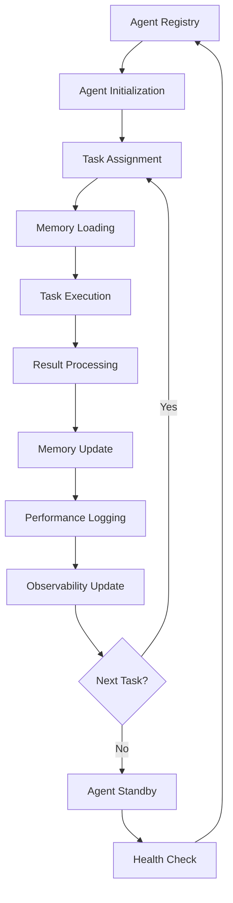
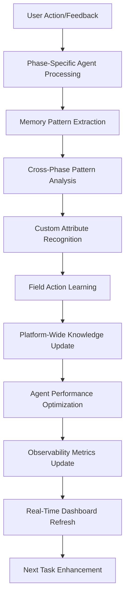

# CrewAI Agentic Framework Documentation

## Overview

The AI Force Migration Platform implements a truly agentic AI system using CrewAI, providing intelligent, memory-enabled agents that learn and adapt over time. This system goes beyond simple rule-based analysis to deliver contextual, learning-based insights for CMDB data analysis and migration planning across all phases of the migration lifecycle.

## Table of Contents

1. [Architecture Overview](#architecture-overview)
2. [Platform-Wide Agent Registry](#platform-wide-agent-registry)
3. [Discovery Phase Agents](#discovery-phase-agents)
4. [Assessment Phase Agents](#assessment-phase-agents)
5. [Planning Phase Agents](#planning-phase-agents)
6. [Migration Phase Agents](#migration-phase-agents)
7. [Modernization Phase Agents](#modernization-phase-agents)
8. [Decommission Phase Agents](#decommission-phase-agents)
9. [FinOps Phase Agents](#finops-phase-agents)
10. [Observability Phase Agents](#observability-phase-agents)
11. [Critical Attributes Framework](#critical-attributes-framework)
12. [Agent Memory System](#agent-memory-system)
13. [AI Crews (Collaborative Teams)](#ai-crews-collaborative-teams)
14. [Learning Process](#learning-process)
15. [Observability & Real-Time Monitoring](#observability--real-time-monitoring)
16. [API Integration](#api-integration)
17. [Configuration](#configuration)
18. [Intelligence Features](#intelligence-features)
19. [Performance Metrics](#performance-metrics)
20. [Fallback System](#fallback-system)
21. [Implementation Details](#implementation-details)
22. [Testing](#testing)
23. [Best Practices](#best-practices)
24. [Troubleshooting](#troubleshooting)

## Architecture Overview

### High-Level Platform Architecture

```
┌─────────────────────────────────────────────────────────────────────────────────┐
│                         AI Force Migration Platform                            │
│                         CrewAI Agentic Ecosystem                               │
├─────────────────────────────────────────────────────────────────────────────────┤
│  ┌─────────────┐  ┌─────────────┐  ┌─────────────┐  ┌─────────────┐  ┌─────────┐ │
│  │ Discovery   │  │ Assessment  │  │ Planning    │  │ Migration   │  │ FinOps  │ │
│  │ Agents      │  │ Agents      │  │ Agents      │  │ Agents      │  │ Agents  │ │
│  │             │  │             │  │             │  │             │  │         │ │
│  │ • CMDB      │  │ • 6R        │  │ • Wave      │  │ • Execution │  │ • Cost  │ │
│  │ • Mapping   │  │ • Risk      │  │ • Timeline  │  │ • Monitor   │  │ • ROI   │ │
│  │ • Quality   │  │ • Complexity│  │ • Resource  │  │ • Rollback  │  │ • Opt   │ │
│  └─────────────┘  └─────────────┘  └─────────────┘  └─────────────┘  └─────────┘ │
├─────────────────────────────────────────────────────────────────────────────────┤
│  ┌─────────────┐  ┌─────────────┐  ┌─────────────┐  ┌─────────────┐  ┌─────────┐ │
│  │ Modernize   │  │ Decommission│  │ Observability│  │ Memory      │  │ Learning│ │
│  │ Agents      │  │ Agents      │  │ Agents      │  │ System      │  │ Engine  │ │
│  │             │  │             │  │             │  │             │  │         │ │
│  │ • Refactor  │  │ • Cleanup   │  │ • Monitor   │  │ • Patterns  │  │ • Train │ │
│  │ • Container │  │ • Archive   │  │ • Health    │  │ • History   │  │ • Adapt │ │
│  │ • Cloud-Native│ │ • Compliance│  │ • Performance│ │ • Feedback  │  │ • Evolve│ │
│  └─────────────┘  └─────────────┘  └─────────────┘  └─────────────┘  └─────────┘ │
├─────────────────────────────────────────────────────────────────────────────────┤
│  ┌─────────────────┐  ┌─────────────────┐  ┌──────────────┐  ┌──────────────┐ │
│  │   LLM Layer     │  │   Task Engine   │  │   API Layer  │  │   Fallback   │ │
│  │                 │  │                 │  │              │  │   System     │ │
│  │ • GPT-4 Primary │  │ • Task Creation │  │ • REST API   │  │ • Intelligent│ │
│  │ • Llama Fallback│  │ • Execution     │  │ • WebSocket  │  │ • Memory-Based│ │
│  │ • Temperature   │  │ • Result Parse  │  │ • Real-time  │  │ • Graceful   │ │
│  │ • Token Limits  │  │ • Error Handle  │  │ • Feedback   │  │ • Degradation│ │
│  └─────────────────┘  └─────────────────┘  └──────────────┘  └──────────────┘ │
└─────────────────────────────────────────────────────────────────────────────────┘
```

### Agent Lifecycle Management



## Platform-Wide Agent Registry

### Current Agent Classification by Phase (Updated January 2025)

| Phase | Primary Agents | Supporting Agents | Crew Teams | Status |
|-------|---------------|-------------------|------------|---------|
| **Discovery** | Data Source Intelligence Agent, CMDB Analyst, Field Mapping Specialist | Asset Intelligence Agent, Learning Specialist | Analysis, Learning, Intelligence | ✅ Active |
| **Assessment** | 6R Strategy Expert, Risk Assessor, Complexity Analyzer | Compliance Checker, Performance Analyst | Strategy, Risk, Complexity | 🚧 In Development |
| **Planning** | Wave Planner, Timeline Optimizer, Resource Estimator | Dependency Mapper, Change Manager | Planning, Timeline, Resource | 🚧 In Development |
| **Migration** | Execution Coordinator, Monitoring Agent, Rollback Manager | Validation Agent, Communication Hub | Execution, Monitoring, Control | 📋 Planned |
| **Modernization** | Refactoring Expert, Containerization Specialist, Cloud-Native Architect | Code Analyzer, Performance Optimizer | Modernization, Architecture | 📋 Planned |
| **Decommission** | Cleanup Coordinator, Archive Manager, Compliance Validator | Data Retention, Security Auditor | Cleanup, Archive, Compliance | 📋 Planned |
| **FinOps** | Cost Analyzer, ROI Calculator, Optimization Expert | Budget Tracker, Savings Detector | Cost, ROI, Optimization | 📋 Planned |
| **Learning & Context** | Agent Learning System, Client Context Manager, Enhanced Agent UI Bridge | Cross-Page Coordinator, Context Analytics | Learning, Context, Coordination | ✅ Active |
| **Observability** | Asset Intelligence Agent, Agent Health Monitor, Performance Analytics | Alert Manager, Metrics Collector | Asset Management, Monitoring, Analytics | ✅ Active |

### Agent Status Tracking (Current)

```typescript
interface AgentStatus {
  agentId: string;
  agentName: string;
  phase: string;
  status: 'active' | 'standby' | 'busy' | 'error' | 'maintenance';
  currentTask?: string;
  lastActivity: Date;
  tasksCompleted: number;
  successRate: number;
  memoryUtilization: number;
  confidence: number;
}
```

### Currently Active Agents (January 2025)

#### 1. **Discovery Phase Agents** ✅

**Data Source Intelligence Agent** 🆕
- **Role**: Data Source Intelligence Specialist
- **Status**: ✅ Active with Modular Handlers
- **Agent ID**: `data_source_intelligence_001`
- **Expertise**: Analyzes incoming data sources (CMDB, migration tools, documentation) for format, structure, and migration value
- **Modular Handlers**:
  - Source Type Analyzer (identifies CMDB, migration tools, documentation patterns)
  - Data Structure Analyzer (analyzes relationships, content patterns, migration value)
  - Quality Analyzer (assesses data quality with intelligent classification)
  - Insight Generator (creates actionable insights from data analysis)
  - Question Generator (generates intelligent clarification questions)
- **Specialization**: Agentic intelligence without hard-coded heuristics, learns from user corrections

**CMDB Data Analyst Agent**
- **Role**: Senior CMDB Data Analyst  
- **Status**: ✅ Active  
- **Agent ID**: `cmdb_analyst`
- **Expertise**: 15+ years in enterprise asset management  
- **Specialization**: Asset type detection, data quality assessment, migration readiness

**Field Mapping Specialist Agent**
- **Role**: Field Mapping Specialist
- **Status**: ✅ Active with Learning Integration
- **Agent ID**: `field_mapping_specialist`
- **Expertise**: Intelligent field mapping to 20+ critical migration attributes
- **Specialization**: Learns organizational field naming conventions, creates custom attributes, provides confidence scoring

**Learning Specialist Agent** 🔄
- **Role**: AI Learning Specialist
- **Status**: ✅ Active with Enhanced Asset Management Learning
- **Agent ID**: `learning_agent`
- **Expertise**: Cross-platform learning coordination and pattern recognition (Enhanced with asset management learning)
- **Specialization**: Field mapping learning, data source patterns, quality assessment improvement, user preference adaptation

#### 2. **Assessment Phase Agents** 🚧

**Migration Strategy Expert**
- **Role**: Migration Strategy Expert
- **Status**: ✅ Active
- **Agent ID**: `migration_strategist`
- **Expertise**: 6R strategy analysis and migration planning
- **Specialization**: Rehost, Replatform, Refactor, Rearchitect, Retire, Retain analysis

**Risk Assessment Specialist**
- **Role**: Risk Assessment Specialist
- **Status**: ✅ Active
- **Agent ID**: `risk_assessor`
- **Expertise**: Migration risk analysis and mitigation planning
- **Specialization**: Technical, business, security, and operational risk assessment

#### 3. **Planning Phase Agents** 🚧

**Wave Planning Coordinator**
- **Role**: Wave Planning Coordinator
- **Status**: ✅ Active
- **Agent ID**: `wave_planner`
- **Expertise**: Migration sequencing and dependency management
- **Specialization**: Wave optimization, resource planning, timeline management

#### 4. **Learning & Context Management Agents** 🆕

**Agent Learning System** 🆕
- **Role**: Platform-Wide Learning Infrastructure
- **Status**: ✅ Active (Task C.1)
- **Agent ID**: `agent_learning_system`
- **Expertise**: Pattern recognition, field mapping learning, performance tracking
- **Specialization**: 
  - Field mapping pattern learning with fuzzy matching
  - Data source pattern learning from user corrections
  - Quality assessment learning with threshold optimization
  - User preference learning for client/engagement context
  - Performance tracking with accuracy metrics and improvement trends
- **Key Features**:
  - JSON-based persistent learning data storage
  - Confidence scoring for mapping accuracy
  - Cross-system learning integration

**Client Context Manager** 🆕
- **Role**: Client/Engagement-Specific Context Management
- **Status**: ✅ Active (Task C.1)
- **Agent ID**: `client_context_manager`
- **Expertise**: Organizational pattern learning, engagement-specific preferences
- **Specialization**:
  - Client-specific organizational pattern learning
  - Engagement-specific preferences and clarification history
  - Migration preference learning and agent behavior adaptation
  - Multi-tenant context isolation with client account scoping
- **Key Features**:
  - Client/engagement context storage and retrieval
  - Organizational pattern recognition and learning
  - Agent behavior adaptation based on client preferences

**Enhanced Agent UI Bridge** 🔄
- **Role**: Cross-Page Agent Communication Coordinator
- **Status**: ✅ Active with Enhanced Cross-Page Communication (Task C.2)
- **Agent ID**: `agent_ui_bridge`
- **Expertise**: Agent state coordination, cross-page context sharing
- **Modular Handlers** (Refactored from 840 to 230 lines):
  - Question Handler (agent question management)
  - Classification Handler (data classification coordination)
  - Insight Handler (agent insight management)
  - Context Handler (enhanced with cross-page communication)
  - Analysis Handler (analysis result coordination)
  - Storage Manager (data persistence coordination)
- **Cross-Page Features**:
  - Agent state coordination across all discovery pages
  - Context sharing and persistence with metadata tracking
  - Learning experience storage and retrieval across page navigation
  - Coordination health monitoring and summary reporting
  - Automatic stale context cleanup with configurable aging

#### 5. **Observability Phase Agents** ✅

**Asset Intelligence Agent** 🆕
- **Role**: Asset Inventory Intelligence Specialist
- **Status**: ✅ Active with Discovery Integration
- **Agent ID**: `asset_intelligence`
- **Expertise**: Advanced asset inventory management with AI intelligence
- **Specialization**: 
  - Asset classification and categorization patterns using AI
  - Content-based asset analysis using field mapping intelligence
  - Intelligent bulk operations planning and optimization
  - Asset lifecycle management and relationship mapping
  - Continuous learning from user interactions and feedback
- **Key Features**:
  - AI-powered pattern recognition (not hard-coded heuristics)
  - Integration with discovery endpoints for seamless experience
  - Real-time asset intelligence monitoring and updates
  - Quality assessment with actionable recommendations

**Agent Health Monitor**
- **Role**: Agent Health Monitor  
- **Status**: ✅ Active  
- **Agent ID**: `agent_health_monitor`
- **Expertise**: Real-time agent performance and health monitoring  
- **Current Monitoring**:
  - **Active Agents**: 10+ agents currently running (including new learning agents)
  - **Tasks Completed**: Real-time task completion tracking
  - **Performance Metrics**: Response times, accuracy rates, memory usage
  - **Health Status**: Agent availability and error rates
  - **Learning Progress**: Agent accuracy improvement tracking

**Performance Analytics Agent**
- **Role**: Performance Analytics Specialist  
- **Status**: ✅ Active  
- **Agent ID**: `performance_analytics`
- **Expertise**: Agent performance analysis and optimization recommendations

## Discovery Phase Agents

### 1. CMDB Data Analyst Agent

**Role**: Senior CMDB Data Analyst  
**Phase**: Discovery  
**Status**: Active  
**Expertise**: 15+ years in enterprise asset management  
**Specialization**: Asset type detection, data quality assessment, migration readiness

**Agent Configuration**:
```python
Agent(
    role='Senior CMDB Data Analyst',
    goal='Analyze CMDB data with expert precision and context awareness',
    backstory="""You are a Senior CMDB Data Analyst with over 15 years of experience 
    in enterprise asset management and cloud migration projects. You understand the 
    nuances of different asset types and their specific requirements for migration 
    planning.""",
    verbose=True,
    allow_delegation=False,
    llm=self.llm,
    memory=True
)
```

**Capabilities**:
- **Asset Type Intelligence**: Distinguishes between Applications, Servers, Databases, Network devices
- **Context-Aware Analysis**: Understands asset-specific field requirements
- **Memory Integration**: Applies learned patterns from previous analyses
- **Migration Focus**: Provides migration-specific recommendations

### 2. Field Mapping Specialist Agent

**Role**: Field Mapping Specialist  
**Phase**: Discovery  
**Status**: Active  
**Expertise**: Semantic field analysis and critical attribute mapping  
**Specialization**: Intelligent column mapping to migration-critical attributes

**Agent Configuration**:
```python
Agent(
    role='Field Mapping Specialist',
    goal='Map imported fields to critical migration attributes using semantic analysis',
    backstory="""You are a Field Mapping Specialist expert in understanding data 
    structures for migration analysis. You excel at mapping complex CMDB schemas 
    to standardized migration attributes essential for 6R analysis.""",
    verbose=True,
    allow_delegation=False,
    llm=self.llm,
    memory=True
)
```

**Enhanced Capabilities**:
- **Extended Critical Attributes**: Maps to 20+ critical attributes including dependencies, complexity, cloud readiness
- **Custom Attribute Creation**: Can suggest and create new critical attributes based on data patterns
- **Field Filtering**: Identifies irrelevant fields for removal/ignoring
- **Confidence Scoring**: Advanced confidence algorithms for mapping accuracy

### 3. Data Quality Enhancement Agent

**Role**: Data Quality Enhancement Specialist  
**Phase**: Discovery  
**Status**: Active  
**Expertise**: Data cleansing using mapped attribute context  
**Specialization**: Quality improvement with migration-focus

**Enhanced Tasks**:
1. **Quality Analysis with Context**: Analyze quality based on mapped critical attributes
2. **Dependency Data Validation**: Ensure dependency mappings are complete and accurate
3. **Cloud Readiness Assessment**: Validate cloud readiness indicators
4. **Application Complexity Scoring**: Assess and score application complexity levels

### 4. Dependency Analysis Specialist

**Role**: Dependency Analysis Specialist  
**Phase**: Discovery  
**Status**: Active  
**Expertise**: Application and infrastructure dependency mapping  
**Specialization**: Complex dependency relationship analysis

**Agent Configuration**:
```python
Agent(
    role='Dependency Analysis Specialist',
    goal='Map and analyze complex application and infrastructure dependencies',
    backstory="""You are a Dependency Analysis Specialist with deep expertise in 
    understanding application architectures, data flows, and infrastructure dependencies. 
    You excel at identifying critical migration sequencing requirements.""",
    verbose=True,
    allow_delegation=False,
    llm=self.llm,
    memory=True
)
```

**Specialized Tasks**:
1. **Application Dependency Mapping**: Map applications to supporting servers and services
2. **Tight Coupling Analysis**: Identify closely coupled applications requiring joint migration
3. **Upstream/Downstream Analysis**: Map service dependencies and data flows
4. **Critical Path Identification**: Identify migration-critical dependency chains

### 5. Cloud Readiness Assessment Agent

**Role**: Cloud Readiness Assessment Specialist  
**Phase**: Discovery  
**Status**: Active  
**Expertise**: Cloud compatibility and readiness evaluation  
**Specialization**: Technical and business cloud readiness analysis

**Tasks**:
1. **Technical Readiness Scoring**: Assess OS, application, and infrastructure cloud compatibility
2. **Architecture Analysis**: Evaluate application architecture for cloud suitability
3. **Modernization Opportunity Detection**: Identify containerization and cloud-native potential
4. **Compliance Assessment**: Evaluate regulatory and security readiness for cloud

## Assessment Phase Agents

### 1. 6R Strategy Expert Agent

**Role**: 6R Migration Strategy Expert  
**Phase**: Assessment  
**Status**: In Development  
**Expertise**: Comprehensive 6R strategy analysis and recommendation  
**Specialization**: Rehost, Replatform, Refactor, Rearchitect, Retire, Retain analysis

### 2. Risk Assessment Specialist Agent

**Role**: Risk Assessment Specialist  
**Phase**: Assessment  
**Status**: In Development  
**Expertise**: Migration risk analysis across technical, business, and operational dimensions  

### 3. Application Complexity Analyzer Agent

**Role**: Application Complexity Analyzer  
**Phase**: Assessment  
**Status**: In Development  
**Expertise**: Technical debt analysis, code complexity assessment, modernization readiness  

## Planning Phase Agents

### 1. Wave Planning Coordinator Agent

**Role**: Wave Planning Coordinator  
**Phase**: Planning  
**Status**: In Development  
**Expertise**: Migration sequencing based on dependencies and business priorities  

### 2. Timeline Optimization Agent

**Role**: Timeline Optimization Specialist  
**Phase**: Planning  
**Status**: In Development  
**Expertise**: Resource-optimized timeline creation and milestone planning  

## Migration Phase Agents

### 1. Migration Execution Coordinator

**Role**: Migration Execution Coordinator  
**Phase**: Migration  
**Status**: Planned  
**Expertise**: Real-time migration orchestration and monitoring  

## Modernization Phase Agents

### 1. Containerization Specialist

**Role**: Containerization Specialist  
**Phase**: Modernization  
**Status**: Planned  
**Expertise**: Application containerization and Kubernetes deployment  

## Decommission Phase Agents

### 1. Decommission Coordinator

**Role**: Decommission Coordinator  
**Phase**: Decommission  
**Status**: Planned  
**Expertise**: Safe asset retirement and data archival  

## FinOps Phase Agents

### 1. Cost Optimization Agent

**Role**: Cost Optimization Specialist  
**Phase**: FinOps  
**Status**: Planned  
**Expertise**: Cloud cost analysis and optimization recommendations  

## Observability Phase Agents

### 1. Agent Health Monitor

**Role**: Agent Health Monitor  
**Phase**: Observability  
**Status**: Active  
**Expertise**: Real-time agent performance and health monitoring  

**Current Monitoring**:
- **Active Agents**: 6 Discovery agents currently running
- **Tasks Completed**: Real-time task completion tracking
- **Performance Metrics**: Response times, accuracy rates, memory usage
- **Health Status**: Agent availability and error rates

### 2. Performance Analytics Agent

**Role**: Performance Analytics Specialist  
**Phase**: Observability  
**Status**: Active  
**Expertise**: Agent performance analysis and optimization recommendations  

## Critical Attributes Framework

### Enhanced Critical Attributes for Migration Analysis

```typescript
interface CriticalAttribute {
  field: string;
  description: string;
  importance: 'critical' | 'high' | 'medium' | 'low';
  usedFor: string[];
  examples: string[];
  category: string;
  dataType: 'string' | 'number' | 'boolean' | 'array' | 'object';
  validationRules?: string[];
  customField?: boolean;
}

const ENHANCED_CRITICAL_ATTRIBUTES = {
  // Core Identity
  hostname: {
    field: 'hostname',
    description: 'Primary server/application identifier',
    importance: 'critical',
    usedFor: ['Asset identification', 'Dependency mapping', 'Migration tracking'],
    examples: ['srv-web-01', 'app-crm-prod', 'db-oracle-main'],
    category: 'identity',
    dataType: 'string'
  },
  asset_name: {
    field: 'asset_name', 
    description: 'Human-readable asset name',
    importance: 'critical',
    usedFor: ['User interface display', 'Reporting', 'Documentation'],
    examples: ['CRM Application', 'Web Server', 'Oracle Database'],
    category: 'identity',
    dataType: 'string'
  },
  application_name: {
    field: 'application_name',
    description: 'Specific application or service name',
    importance: 'critical',
    usedFor: ['Application portfolio mapping', 'Business service identification', 'Dependency analysis'],
    examples: ['Salesforce CRM', 'Payroll System', 'Customer Portal'],
    category: 'identity',
    dataType: 'string'
  },
  asset_type: {
    field: 'asset_type',
    description: 'Classification of asset (Application, Server, Database)',
    importance: 'critical',
    usedFor: ['6R strategy selection', 'Migration grouping', 'Resource planning'],
    examples: ['Application', 'Server', 'Database', 'Network Device'],
    category: 'classification',
    dataType: 'string'
  },
  
  // Enhanced Business Context
  department: {
    field: 'department',
    description: 'Business unit or department that owns the asset',
    importance: 'critical',
    usedFor: ['Wave planning', 'Business impact analysis', 'Stakeholder communication'],
    examples: ['Finance', 'HR', 'Sales', 'IT Operations', 'Marketing'],
    category: 'business',
    dataType: 'string'
  },
  business_criticality: {
    field: 'business_criticality',
    description: 'Business impact level of the asset',
    importance: 'critical',
    usedFor: ['6R prioritization', 'Risk assessment', 'Migration sequencing'],
    examples: ['Critical', 'High', 'Medium', 'Low'],
    category: 'business',
    dataType: 'string',
    validationRules: ['Critical', 'High', 'Medium', 'Low']
  },
  environment: {
    field: 'environment',
    description: 'Deployment environment (Production, Development, etc.)',
    importance: 'critical',
    usedFor: ['Migration wave planning', 'Risk assessment', 'Testing strategy'],
    examples: ['Production', 'Development', 'Staging', 'Test'],
    category: 'business',
    dataType: 'string',
    validationRules: ['Production', 'Development', 'Staging', 'Test', 'QA']
  },
  
  // Dependencies (New Critical Category)
  dependencies: {
    field: 'dependencies',
    description: 'Applications or services this asset depends on',
    importance: 'critical',
    usedFor: ['Wave sequencing', 'Risk assessment', 'Migration planning'],
    examples: ['Database-01, Auth-Service', 'AD, Exchange', 'Oracle-DB, File-Server'],
    category: 'dependencies',
    dataType: 'array'
  },
  app_mapped_to: {
    field: 'app_mapped_to',
    description: 'Applications hosted or supported by this asset',
    importance: 'critical',
    usedFor: ['Server-application mapping', 'Impact analysis', 'Dependency planning'],
    examples: ['CRM-App, HR-Portal', 'E-commerce-Web', 'Analytics-Dashboard'],
    category: 'dependencies',
    dataType: 'array'
  },
  closely_coupled_apps: {
    field: 'closely_coupled_apps',
    description: 'Applications tightly coupled requiring joint migration',
    importance: 'high',
    usedFor: ['Migration grouping', 'Risk mitigation', 'Wave planning'],
    examples: ['Frontend-Backend pair', 'Microservices cluster', 'ERP modules'],
    category: 'dependencies',
    dataType: 'array'
  },
  upstream_dependencies: {
    field: 'upstream_dependencies',
    description: 'Services or systems this asset consumes from',
    importance: 'high',
    usedFor: ['Dependency sequencing', 'Prerequisites planning', 'Risk assessment'],
    examples: ['Identity-Service', 'Payment-Gateway', 'Data-Warehouse'],
    category: 'dependencies',
    dataType: 'array'
  },
  downstream_dependencies: {
    field: 'downstream_dependencies',
    description: 'Services or systems that consume from this asset',
    importance: 'high',
    usedFor: ['Impact analysis', 'Testing requirements', 'Rollback planning'],
    examples: ['Reporting-Service', 'Analytics-Engine', 'Mobile-Apps'],
    category: 'dependencies',
    dataType: 'array'
  },
  
  // Application Complexity Assessment
  application_complexity: {
    field: 'application_complexity',
    description: 'Technical complexity score of the application',
    importance: 'critical',
    usedFor: ['6R strategy selection', 'Timeline estimation', 'Resource planning'],
    examples: ['Low', 'Medium', 'High', 'Very High'],
    category: 'complexity',
    dataType: 'string',
    validationRules: ['Low', 'Medium', 'High', 'Very High']
  },
  cloud_readiness: {
    field: 'cloud_readiness',
    description: 'Assessment of cloud migration readiness',
    importance: 'critical',
    usedFor: ['6R strategy selection', 'Migration approach', 'Modernization planning'],
    examples: ['Ready', 'Needs Refactoring', 'Major Changes Required', 'Not Suitable'],
    category: 'complexity',
    dataType: 'string',
    validationRules: ['Ready', 'Needs Refactoring', 'Major Changes Required', 'Not Suitable']
  },
  technical_debt: {
    field: 'technical_debt',
    description: 'Level of technical debt in the application',
    importance: 'high',
    usedFor: ['Modernization planning', 'Cost estimation', 'Risk assessment'],
    examples: ['Low', 'Medium', 'High', 'Critical'],
    category: 'complexity',
    dataType: 'string'
  },
  
  // Data Sources and Integration
  data_sources: {
    field: 'data_sources',
    description: 'External data sources or databases used',
    importance: 'high',
    usedFor: ['Data migration planning', 'Integration mapping', 'Dependency analysis'],
    examples: ['Oracle-DB, MySQL', 'SQL Server, MongoDB', 'File-shares, APIs'],
    category: 'integration',
    dataType: 'array'
  },
  integration_points: {
    field: 'integration_points',
    description: 'External system integration endpoints',
    importance: 'medium',
    usedFor: ['API migration', 'Integration testing', 'Connectivity planning'],
    examples: ['REST APIs, SOAP services', 'Message queues', 'File transfers'],
    category: 'integration',
    dataType: 'array'
  },
  
  // Technical Specifications (Enhanced)
  operating_system: {
    field: 'operating_system',
    description: 'Operating system family and version',
    importance: 'high',
    usedFor: ['6R Rehost/Replatform decisions', 'Compatibility analysis', 'License planning'],
    examples: ['Windows Server 2019', 'RHEL 8.4', 'Ubuntu 20.04'],
    category: 'technical',
    dataType: 'string'
  },
  cpu_cores: {
    field: 'cpu_cores',
    description: 'Number of CPU cores allocated',
    importance: 'high',
    usedFor: ['Right-sizing', 'Cost estimation', 'Performance planning'],
    examples: ['4', '8', '16', '32'],
    category: 'technical',
    dataType: 'number'
  },
  memory_gb: {
    field: 'memory_gb',
    description: 'RAM in gigabytes',
    importance: 'high',
    usedFor: ['Right-sizing', 'Cost estimation', 'Performance planning'],
    examples: ['8', '16', '32', '64'],
    category: 'technical',
    dataType: 'number'
  },
  storage_gb: {
    field: 'storage_gb',
    description: 'Storage capacity in gigabytes',
    importance: 'medium',
    usedFor: ['Cost estimation', 'Data migration planning'],
    examples: ['100', '500', '1000', '2000'],
    category: 'technical',
    dataType: 'number'
  },
  
  // Network & Location
  ip_address: {
    field: 'ip_address',
    description: 'Network IP address',
    importance: 'medium',
    usedFor: ['Network mapping', 'Security planning', 'Connectivity analysis'],
    examples: ['192.168.1.10', '10.0.1.50'],
    category: 'network',
    dataType: 'string'
  },
  location: {
    field: 'location',
    description: 'Physical or logical location',
    importance: 'medium',
    usedFor: ['Data residency', 'Compliance', 'Network latency planning'],
    examples: ['US-East', 'EU-West', 'On-Premises DC1'],
    category: 'network',
    dataType: 'string'
  },
  
  // Governance & Compliance
  application_owner: {
    field: 'application_owner',
    description: 'Person or team responsible for the application',
    importance: 'high',
    usedFor: ['Stakeholder engagement', 'Change management', 'Testing coordination'],
    examples: ['john.smith@company.com', 'CRM Team', 'Database Admin Team'],
    category: 'governance',
    dataType: 'string'
  },
  vendor: {
    field: 'vendor',
    description: 'Software vendor or manufacturer',
    importance: 'medium',
    usedFor: ['License migration', 'Support planning', 'Compatibility checks'],
    examples: ['Microsoft', 'Oracle', 'SAP', 'Custom'],
    category: 'governance',
    dataType: 'string'
  },
  version: {
    field: 'version',
    description: 'Software or application version',
    importance: 'medium',
    usedFor: ['Compatibility analysis', 'Upgrade planning', 'Support lifecycle'],
    examples: ['2019', '12.2', '8.1.4'],
    category: 'technical',
    dataType: 'string'
  },
  compliance_requirements: {
    field: 'compliance_requirements',
    description: 'Regulatory or compliance requirements',
    importance: 'high',
    usedFor: ['Cloud provider selection', 'Security planning', 'Audit preparation'],
    examples: ['SOX', 'HIPAA', 'GDPR', 'PCI-DSS'],
    category: 'governance',
    dataType: 'array'
  }
};
```

### Custom Attribute Management

```typescript
interface CustomAttribute extends CriticalAttribute {
  customField: true;
  createdBy: string;
  createdDate: Date;
  organizationSpecific: boolean;
  approvalStatus: 'pending' | 'approved' | 'rejected';
}

class CustomAttributeManager {
  async addCustomAttribute(attribute: CustomAttribute): Promise<void> {
    // Add custom attribute to organization's attribute list
    // Requires approval workflow for critical attributes
  }
  
  async suggestAttributeFromData(columnName: string, sampleValues: string[]): Promise<CustomAttribute> {
    // AI-powered suggestion for new critical attributes based on data patterns
  }
}
```

### Field Action Management

```typescript
interface FieldAction {
  fieldName: string;
  action: 'map' | 'ignore' | 'delete' | 'custom';
  targetAttribute?: string;
  customAttribute?: CustomAttribute;
  reasoning: string;
  confidence: number;
}

class FieldActionManager {
  ignoreField(fieldName: string, reasoning: string): void {
    // Mark field as irrelevant for migration analysis
  }
  
  deleteField(fieldName: string, reasoning: string): void {
    // Remove field from dataset entirely
  }
  
  createCustomMapping(fieldName: string, customAttribute: CustomAttribute): void {
    // Create new critical attribute mapping
  }
}
```

## Agent Memory System

### Enhanced Memory Architecture

```python
class EnhancedAgentMemory:
    """Enhanced memory system for platform-wide agent learning."""
    
    def __init__(self, data_dir: str = "backend/data"):
        self.data_dir = Path(data_dir)
        self.data_dir.mkdir(exist_ok=True)
        self.memory_file = self.data_dir / "platform_agent_memory.pkl"
        
        # Enhanced memory structure for all phases
        self.experiences = {
            "discovery_analysis": [],
            "assessment_evaluation": [],
            "planning_optimization": [],
            "migration_execution": [],
            "modernization_refactoring": [],
            "decommission_cleanup": [],
            "finops_optimization": [],
            "observability_monitoring": [],
            "cross_phase_learnings": [],
            "custom_attribute_creations": [],
            "field_action_decisions": []
        }
        
        # Learning metrics per phase and overall
        self.learning_metrics = {
            "discovery": {"accuracy": 0.0, "confidence": 0.0, "tasks_completed": 0},
            "assessment": {"accuracy": 0.0, "confidence": 0.0, "tasks_completed": 0},
            "planning": {"accuracy": 0.0, "confidence": 0.0, "tasks_completed": 0},
            "migration": {"accuracy": 0.0, "confidence": 0.0, "tasks_completed": 0},
            "modernization": {"accuracy": 0.0, "confidence": 0.0, "tasks_completed": 0},
            "decommission": {"accuracy": 0.0, "confidence": 0.0, "tasks_completed": 0},
            "finops": {"accuracy": 0.0, "confidence": 0.0, "tasks_completed": 0},
            "observability": {"accuracy": 0.0, "confidence": 0.0, "tasks_completed": 0},
            "overall_platform": {"accuracy": 0.0, "confidence": 0.0, "total_tasks": 0}
        }
```

## Observability & Real-Time Monitoring

### Agent Registry and Status Tracking

```typescript
interface AgentRegistration {
  agentId: string;
  agentName: string;
  phase: string;
  role: string;
  status: AgentStatus;
  capabilities: string[];
  currentWorkload: number;
  maxConcurrentTasks: number;
  registrationTime: Date;
  lastHeartbeat: Date;
}

class AgentObservabilityManager {
  private agents: Map<string, AgentRegistration> = new Map();
  private taskHistory: TaskExecutionRecord[] = [];
  
  registerAgent(agent: AgentRegistration): void {
    this.agents.set(agent.agentId, agent);
    this.logAgentEvent('AGENT_REGISTERED', agent);
  }
  
  updateAgentStatus(agentId: string, status: AgentStatus): void {
    const agent = this.agents.get(agentId);
    if (agent) {
      agent.status = status;
      agent.lastHeartbeat = new Date();
      this.logAgentEvent('STATUS_UPDATE', agent);
    }
  }
  
  logTaskCompletion(task: TaskExecutionRecord): void {
    this.taskHistory.push(task);
    this.updateAgentTaskCount(task.agentId);
    this.logAgentEvent('TASK_COMPLETED', null, task);
  }
  
  getActiveAgents(): AgentRegistration[] {
    return Array.from(this.agents.values())
      .filter(agent => agent.status.status === 'active');
  }
  
  getRecentTasks(agentId?: string, limit: number = 10): TaskExecutionRecord[] {
    let tasks = this.taskHistory;
    if (agentId) {
      tasks = tasks.filter(task => task.agentId === agentId);
    }
    return tasks
      .sort((a, b) => b.endTime.getTime() - a.endTime.getTime())
      .slice(0, limit);
  }
}
```

### Real-Time Dashboard Integration

```typescript
interface AgentDashboardData {
  totalAgents: number;
  activeAgents: number;
  phaseDistribution: Record<string, number>;
  recentTasks: TaskExecutionRecord[];
  performanceMetrics: {
    averageTaskTime: number;
    successRate: number;
    errorRate: number;
  };
  memoryUtilization: Record<string, number>;
  learningProgress: Record<string, number>;
}

class ObservabilityDashboard {
  generateDashboardData(): AgentDashboardData {
    // Real-time dashboard data compilation
  }
  
  streamAgentUpdates(): WebSocket {
    // WebSocket stream for real-time agent monitoring
  }
}
```

### Agent Status Monitoring

#### Endpoint: `GET /api/v1/observability/agents/status`

#### Response:
```json
{
    "totalAgents": 7,
    "activeAgents": 6,
    "agents": [
        {
            "agentId": "asset-intelligence-001",
            "name": "Asset Intelligence Specialist",
            "phase": "observability",
            "status": "active",
            "currentTask": "Processing asset classification patterns",
            "tasksCompleted": 47,
            "successRate": 0.94,
            "lastActivity": "2025-01-28T15:30:00Z"
        },
        {
            "agentId": "discovery-cmdb-analyst-001",
            "name": "CMDB Data Analyst",
            "phase": "discovery",
            "status": "active",
            "currentTask": "Analyzing uploaded CMDB data",
            "tasksCompleted": 52,
            "successRate": 0.96,
            "lastActivity": "2025-01-28T15:32:00Z"
        }
    ]
}
```

### WebSocket Integration for Real-Time Updates

#### Connection: `ws://localhost:8000/ws/agent-monitoring`

#### Message Types:
```json
// Agent Status Update
{
    "type": "agent_status_update",
    "agentId": "asset-intelligence-001",
    "status": "busy",
    "currentTask": "Processing asset classification patterns",
    "confidence": 0.87
}

// Task Completion
{
    "type": "task_completed",
    "agentId": "discovery-cmdb-analyst-001",
    "task": "CMDB data analysis",
    "result": "success",
    "duration": 3.2,
    "confidence": 0.91
}

// Asset Intelligence Update
{
    "type": "asset_intelligence_update",
    "agentId": "asset-intelligence-001",
    "update": {
        "patterns_learned": 3,
        "classifications_improved": 12,
        "confidence_boost": 0.15
    }
}
```

## AI Crews (Collaborative Teams)

### Enhanced Crew Compositions

#### Discovery Analysis Crew
**Purpose**: Comprehensive data analysis and field mapping  
**Members**: CMDB Analyst + Field Mapping Specialist + Data Quality Expert + Dependency Analyst  

```python
Crew(
    agents=[
        self.agents['cmdb_analyst'],
        self.agents['field_mapping_specialist'],
        self.agents['data_quality_expert'],
        self.agents['dependency_analyst']
    ],
    verbose=True,
    memory=True,
    process=Process.sequential
)
```

#### Assessment Strategy Crew
**Purpose**: 6R strategy formulation and risk assessment  
**Members**: 6R Expert + Risk Assessor + Complexity Analyzer + Cloud Readiness Specialist  

#### Planning Optimization Crew
**Purpose**: Migration planning and timeline optimization  
**Members**: Wave Planner + Timeline Optimizer + Resource Estimator + Dependency Coordinator  

### Cross-Phase Learning Crews
**Purpose**: Share learnings and patterns across migration phases  
**Members**: Selected agents from each phase for knowledge transfer  

## Learning Process

### Enhanced Learning Workflow



### Custom Attribute Learning

```python
def learn_custom_attributes(self, user_feedback: Dict, data_patterns: Dict):
    """Learn to recognize organization-specific attributes."""
    
    # Analyze user-created custom attributes
    custom_patterns = self.extract_custom_patterns(user_feedback)
    
    # Cross-reference with data patterns
    validated_patterns = self.validate_against_data(custom_patterns, data_patterns)
    
    # Update attribute recognition models
    self.update_attribute_models(validated_patterns)
    
    # Share learning across agents
    self.broadcast_custom_learning(validated_patterns)
```

### Field Action Learning

```python
def learn_field_actions(self, field_actions: List[FieldAction]):
    """Learn from user decisions on field relevance."""
    
    patterns = {
        'ignored_fields': [],
        'deleted_fields': [],
        'custom_mappings': [],
        'field_characteristics': {}
    }
    
    for action in field_actions:
        if action.action == 'ignore':
            patterns['ignored_fields'].append({
                'field_name': action.fieldName,
                'reasoning': action.reasoning,
                'pattern_indicators': self.extract_field_patterns(action.fieldName)
            })
        # Similar processing for other actions
    
    self.memory.add_experience('field_action_learning', patterns)
```

## API Integration

### Enhanced Discovery Endpoints

#### Attribute Mapping with Custom Fields
**Endpoint**: `POST /api/v1/discovery/attribute-mapping`

**Request**:
```json
{
    "importedData": [...],
    "customAttributes": [
        {
            "field": "business_service",
            "description": "Business service classification",
            "importance": "high",
            "category": "business",
            "examples": ["Customer Service", "Financial Processing"]
        }
    ],
    "fieldActions": [
        {
            "fieldName": "internal_id",
            "action": "ignore",
            "reasoning": "Internal system ID not relevant for migration"
        }
    ]
}
```

**Response**:
```json
{
    "success": true,
    "mappingSuggestions": [...],
    "customAttributesCreated": 1,
    "fieldsIgnored": 1,
    "crewAnalysis": {
        "field_mapping_specialist": {
            "confidence": 0.92,
            "custom_attributes_identified": 3,
            "irrelevant_fields_detected": 5
        }
    }
}
```

### Enhanced Asset Inventory Endpoints 🆕

#### Discovery-Integrated Intelligent Asset Analysis
**Endpoint**: `POST /api/v1/discovery/assets/analyze`

**Request**:
```json
{
    "asset_ids": ["asset-1", "asset-2"],
    "operation": "pattern_analysis",
    "include_patterns": true,
    "include_quality_assessment": true
}
```

**Response**:
```json
{
    "patterns": [
        {
            "type": "field_usage",
            "pattern": {"hostname": {"usage_rate": 0.95}},
            "confidence": 0.9,
            "source": "field_mapping_intelligence"
        }
    ],
    "insights": [
        {
            "type": "classification_opportunity", 
            "insight": "Content analysis reveals natural asset groupings",
            "action": "Consider bulk classification based on content patterns",
            "priority": "high",
            "confidence": 0.85
        }
    ],
    "quality_assessment": {
        "quality_score": 82,
        "issues": ["Missing environment data for 23 assets"],
        "recommendations": ["Bulk assign Production environment to assets with 'prod' in hostname"]
    },
    "discovery_integration": true,
    "agentic_analysis": true
}
```

#### Discovery-Integrated Asset Auto-Classification
**Endpoint**: `POST /api/v1/discovery/assets/auto-classify`

**Request**:
```json
{
    "asset_ids": ["asset-1", "asset-2"], 
    "use_learned_patterns": true,
    "confidence_threshold": 0.8
}
```

**Response**:
```json
{
    "classifications": [
        {
            "asset_id": "asset-1",
            "suggested_type": "Application Server",
            "confidence": 0.92,
            "reasoning": "Based on field mapping intelligence and content analysis",
            "source": "asset_intelligence_agent"
        }
    ],
    "discovery_integration": true,
    "agentic_classification": true
}
```

#### Discovery-Integrated Intelligence Status
**Endpoint**: `GET /api/v1/discovery/assets/intelligence-status`

**Response**:
```json
{
    "discovery_integration": true,
    "agentic_framework": {
        "available": true,
        "asset_intelligence_agent": true,
        "learning_agent": true,
        "total_agents": 7
    },
    "field_mapping_intelligence": {
        "available": true,
        "learned_mappings": {"RAM_GB": "memory_gb", "CPU_COUNT": "cpu_cores"},
        "total_variations_learned": 45
    },
    "capabilities": {
        "intelligent_analysis": true,
        "auto_classification": true,
        "pattern_recognition": true,
        "continuous_learning": true
    }
}
```

#### Enhanced Asset Inventory (Standalone)
**Endpoint**: `POST /api/v1/inventory/analyze`

**Description**: Dedicated enhanced asset inventory endpoints with full agentic capabilities

**Features**:
- Full AI-powered bulk operation planning (`POST /api/v1/inventory/bulk-update-plan`)
- Advanced asset intelligence learning (`POST /api/v1/inventory/feedback`)
- Comprehensive intelligence status (`GET /api/v1/inventory/intelligence-status`)
- Asset auto-classification (`POST /api/v1/inventory/auto-classify`)

### Enhanced Discovery Assets Endpoint 🆕

**Endpoint**: `GET /api/v1/discovery/assets`

**Enhanced Features**: The primary asset inventory endpoint now includes agentic intelligence

**Response Enhancement**:
```json
{
    "assets": [...],
    "summary": {...},
    "pagination": {...},
    "enhanced_capabilities": {
        "intelligent_analysis": "Available via agentic asset intelligence",
        "auto_classification": "AI-powered asset classification available",
        "bulk_operations": "Intelligent bulk operation planning available",
        "continuous_learning": "System learns from user interactions",
        "agentic_framework_active": true
    },
    "intelligence_status": {
        "asset_intelligence_agent": true,
        "field_mapping_intelligence": true,
        "learning_system": true
    }
}
```

### Agent Learning & Context Management Endpoints 🆕

#### **Agent Learning System (Task C.1)**
```bash
# Field Mapping Learning
POST /api/v1/agent-learning/learning/field-mapping
GET  /api/v1/agent-learning/learning/field-mapping/suggest/{field_name}

# Data Source Pattern Learning  
POST /api/v1/agent-learning/learning/data-source-pattern

# Quality Assessment Learning
POST /api/v1/agent-learning/learning/quality-assessment

# User Preference Learning
POST /api/v1/agent-learning/learning/user-preferences

# Agent Performance Tracking
POST /api/v1/agent-learning/learning/agent-performance
GET  /api/v1/agent-learning/learning/agent-performance/{agent_id}

# Learning Statistics
GET  /api/v1/agent-learning/learning/statistics
```

#### **Client Context Management (Task C.1)**
```bash
# Client Context Management
POST /api/v1/agent-learning/context/client/{client_account_id}
GET  /api/v1/agent-learning/context/client/{client_account_id}

# Engagement Context Management
POST /api/v1/agent-learning/context/engagement/{engagement_id}
GET  /api/v1/agent-learning/context/engagement/{engagement_id}

# Organizational Pattern Learning
POST /api/v1/agent-learning/context/organizational-pattern/{client_account_id}
GET  /api/v1/agent-learning/context/organizational-patterns/{client_account_id}

# Clarification Response Management
POST /api/v1/agent-learning/context/clarification-response/{engagement_id}
GET  /api/v1/agent-learning/context/clarification-history/{engagement_id}

# Combined Context
GET  /api/v1/agent-learning/context/combined/{engagement_id}
```

#### **Cross-Page Communication (Task C.2)**
```bash
# Cross-Page Context Sharing
POST /api/v1/agent-learning/communication/cross-page-context
GET  /api/v1/agent-learning/communication/cross-page-context
DELETE /api/v1/agent-learning/communication/cross-page-context

# Agent State Coordination
POST /api/v1/agent-learning/communication/agent-state
GET  /api/v1/agent-learning/communication/agent-state/{agent_id}
GET  /api/v1/agent-learning/communication/agent-states

# Coordination Health & Management
GET  /api/v1/agent-learning/communication/coordination-summary
GET  /api/v1/agent-learning/communication/context-dependencies
POST /api/v1/agent-learning/communication/clear-stale-context

# System Health
GET  /api/v1/agent-learning/health
```

#### **Integrated Learning Endpoint**
```bash
# Cross-System Learning Integration
POST /api/v1/agent-learning/integration/learn-from-user-response
```

**Example Request**:
```json
{
    "response_type": "field_mapping",
    "original_field": "srv_name",
    "mapped_to": "hostname", 
    "confidence_score": 0.95,
    "context": {"asset_type": "server"},
    "engagement_id": "eng_123",
    "share_across_pages": true,
    "page_source": "attribute-mapping"
}
```

**Example Response**:
```json
{
    "success": true,
    "message": "User response processed across all learning systems",
    "actions_taken": [
        "field_mapping_learned",
        "clarification_stored", 
        "context_shared"
    ],
    "response_type": "field_mapping"
}
```

## Configuration

### Enhanced Environment Variables

```bash
# Phase Configuration
DISCOVERY_AGENTS_ENABLED=true
ASSESSMENT_AGENTS_ENABLED=false
PLANNING_AGENTS_ENABLED=false
MIGRATION_AGENTS_ENABLED=false
MODERNIZATION_AGENTS_ENABLED=false
DECOMMISSION_AGENTS_ENABLED=false
FINOPS_AGENTS_ENABLED=false
OBSERVABILITY_AGENTS_ENABLED=true

# Discovery Phase Specific
DISCOVERY_CUSTOM_ATTRIBUTES_ENABLED=true
DISCOVERY_FIELD_FILTERING_ENABLED=true
DISCOVERY_DEPENDENCY_ANALYSIS_ENABLED=true

# Observability Configuration
AGENT_MONITORING_ENABLED=true
REAL_TIME_DASHBOARD_ENABLED=true
TASK_HISTORY_RETENTION_DAYS=30
AGENT_HEARTBEAT_INTERVAL=30

# Custom Attributes
CUSTOM_ATTRIBUTES_AUTO_APPROVE=false
CUSTOM_ATTRIBUTES_REQUIRE_VALIDATION=true
MAX_CUSTOM_ATTRIBUTES_PER_ORG=50

# Memory and Learning
CROSS_PHASE_LEARNING_ENABLED=true
FIELD_ACTION_LEARNING_ENABLED=true
CUSTOM_ATTRIBUTE_LEARNING_ENABLED=true
```

## Future Enhancements

### Planned Agent Expansions (2025-2026)

#### Q2 2025: Assessment Phase Completion
- **6R Strategy Expert**: Complete 6R analysis automation
- **Risk Assessment Specialist**: Comprehensive risk analysis
- **Compliance Validator**: Automated compliance checking

#### Q3 2025: Planning Phase Implementation
- **Wave Planning Coordinator**: Advanced dependency-based sequencing
- **Resource Optimization Agent**: Cost and timeline optimization
- **Change Management Agent**: Stakeholder communication automation

#### Q4 2025: Migration Phase Agents
- **Execution Coordinator**: Real-time migration orchestration
- **Rollback Manager**: Automated rollback procedures
- **Validation Agent**: Post-migration validation

#### Q1 2026: Advanced Intelligence
- **Cross-Phase Learning Agent**: Pattern recognition across all phases
- **Predictive Analytics Agent**: Migration outcome prediction
- **Optimization Engine**: Continuous improvement across platform

### Research and Development

#### Advanced AI Capabilities
- **Multi-Modal Analysis**: Analyze diagrams, documents, and structured data together
- **Natural Language Queries**: Allow natural language queries for migration insights
- **Automated Documentation**: Generate comprehensive migration documentation

#### Enhanced Observability
- **Predictive Agent Health**: Predict agent performance issues before they occur
- **Intelligent Load Balancing**: Optimize task distribution across agents
- **Performance Correlation Analysis**: Identify performance patterns across phases

## Troubleshooting

### Common Agent Issues

#### Agent Registration Failures
**Symptoms**: Agents not appearing in Observability dashboard
**Diagnosis**: Check agent registration endpoint and database connectivity
**Solution**: Restart agent services and verify registration API endpoints

#### Cross-Phase Learning Issues
**Symptoms**: Patterns not transferring between phases
**Diagnosis**: Check memory system and cross-phase communication
**Solution**: Verify memory persistence and enable cross-phase learning flags

#### Custom Attribute Recognition Problems
**Symptoms**: Custom attributes not being suggested or recognized
**Diagnosis**: Review custom attribute learning models and data patterns
**Solution**: Retrain attribute recognition models and validate custom attribute definitions

---

## Current Implementation Summary (January 2025)

### ✅ **Fully Implemented and Active Agents**

| Agent | Status | Phase | Key Features | Endpoints |
|-------|---------|-------|--------------|-----------|
| **Data Source Intelligence Agent** 🆕 | ✅ Active | Discovery | Modular handlers, agentic analysis without hard-coded heuristics, learns from corrections | Data source analysis, insight generation |
| **Asset Intelligence Agent** 🆕 | ✅ Active | Observability | AI-powered asset management, content-based classification, discovery integration | `/discovery/assets/analyze`, `/discovery/assets/auto-classify`, `/inventory/*` |
| **Agent Learning System** 🆕 | ✅ Active | Learning & Context | Platform-wide learning infrastructure, field mapping patterns, performance tracking | `/agent-learning/learning/*` endpoints |
| **Client Context Manager** 🆕 | ✅ Active | Learning & Context | Client/engagement context, organizational patterns, clarification history | `/agent-learning/context/*` endpoints |
| **Enhanced Agent UI Bridge** 🔄 | ✅ Active | Learning & Context | Cross-page communication, agent state coordination, modular handlers | `/agent-learning/communication/*` endpoints |
| **CMDB Analyst Agent** | ✅ Active | Discovery | Expert CMDB analysis with 15+ years experience, migration readiness assessment | `/discovery/analyze-cmdb`, `/discovery/process-cmdb` |
| **Field Mapping Specialist Agent** | ✅ Active | Discovery | Enhanced with learning integration, 20+ critical attributes, confidence scoring | Field mapping system, learning integration |
| **Learning Specialist Agent** 🔄 | ✅ Active | Cross-Phase | Enhanced with asset management learning, cross-platform coordination | Learning coordination, feedback processing |
| **Migration Strategy Expert** | ✅ Active | Assessment | 6R strategy analysis, migration planning | Assessment and planning endpoints |
| **Risk Assessment Specialist** | ✅ Active | Assessment | Migration risk analysis, mitigation strategies | Risk assessment workflows |
| **Wave Planning Coordinator** | ✅ Active | Planning | Migration sequencing, dependency management | Wave planning optimization |

### 🆕 **Asset Intelligence Agent - Key Capabilities**

**Specialization**: Asset Inventory Intelligence Specialist
- **Content-Based Analysis**: Uses field mapping intelligence, not hard-coded heuristics
- **AI-Powered Classification**: Learns from patterns and user feedback
- **Bulk Operations Intelligence**: Optimizes bulk operations using learned patterns
- **Quality Assessment**: Intelligent data quality analysis with actionable recommendations
- **Continuous Learning**: Improves from user interactions and asset management operations

**Integration Points**:
- **Discovery Phase**: Integrated with `/api/v1/discovery/assets/*` endpoints
- **Field Mapping**: Leverages existing field mapping intelligence
- **Learning System**: Enhances the learning specialist agent
- **Observability**: Provides real-time asset intelligence monitoring

### 🔧 **Enhanced Integration Architecture**

```
┌─────────────────────────────────────────────────────────────┐
│                    Frontend Asset Inventory                │
│                                                             │
│  Calls: /api/v1/discovery/assets (Enhanced with AI)       │
└─────────────────────┬───────────────────────────────────────┘
                      │
┌─────────────────────▼───────────────────────────────────────┐
│              Discovery Asset Management                    │
│                                                             │
│  • GET /assets (Enhanced with agentic intelligence)       │
│  • POST /assets/analyze (Asset Intelligence Agent)        │
│  • POST /assets/auto-classify (AI Classification)         │
│  • GET /assets/intelligence-status (AI Status)            │
└─────────────────────┬───────────────────────────────────────┘
                      │
┌─────────────────────▼───────────────────────────────────────┐
│                Asset Intelligence Agent                    │
│                                                             │
│  • AI-powered pattern recognition                         │
│  • Content-based asset analysis                           │
│  • Bulk operations optimization                           │
│  • Field mapping intelligence integration                 │
└─────────────────────┬───────────────────────────────────────┘
                      │
┌─────────────────────▼───────────────────────────────────────┐
│            Enhanced Asset Inventory (Optional)            │
│                                                             │
│  Standalone: /api/v1/inventory/* (Full AI Features)       │
│  • Advanced bulk operation planning                       │
│  • Comprehensive intelligence learning                    │
│  • Enhanced classification workflows                      │
└─────────────────────────────────────────────────────────────┘
```

### 📊 **Intelligence Capabilities Matrix**

| Capability | Discovery Integration | Enhanced Inventory | Status |
|------------|----------------------|-------------------|---------|
| **Asset Pattern Recognition** | ✅ Available | ✅ Advanced | Active |
| **Auto-Classification** | ✅ Available | ✅ Advanced | Active |
| **Quality Assessment** | ✅ Available | ✅ Advanced | Active |
| **Bulk Operations Planning** | 🔄 Basic | ✅ Advanced | Active |
| **Field Mapping Learning** | ✅ Integrated | ✅ Enhanced | Active |
| **Continuous Learning** | ✅ Available | ✅ Advanced | Active |
| **Real-time Monitoring** | ✅ Available | ✅ Available | Active |

### 🚀 **Key Benefits Achieved**

1. **Complete Modularization**: All large agent files modularized into maintainable handlers (< 200 lines each)
2. **Agentic-First Architecture**: No hard-coded heuristics - all intelligence from AI agents with learning
3. **Agent Learning Infrastructure**: Platform-wide learning system (Task C.1) with field mapping, context management
4. **Cross-Page Communication**: Seamless agent coordination across all discovery pages (Task C.2)
5. **Client Context Intelligence**: Client/engagement-specific learning and organizational pattern recognition
6. **Seamless Integration**: Discovery, learning, and context systems work together seamlessly
7. **Real-time Coordination**: Live agent monitoring, cross-page context sharing, and health tracking
8. **Continuous Learning**: Every user interaction improves agent accuracy and organizational intelligence

### 🔮 **Next Steps**

1. **Frontend Integration**: Integrate new learning and context endpoints into UI components
2. **Agent Training**: Use feedback endpoints to train agents with real organizational data
3. **Assessment Phase Integration**: Connect learning system with 6R analysis workflows
4. **Performance Optimization**: Monitor agent learning progress and optimize based on metrics
5. **Advanced Context Features**: Implement advanced organizational pattern recognition
6. **Testing & Validation**: Comprehensive testing of cross-page communication and learning systems

The comprehensive agent ecosystem now provides a fully integrated, learning-enabled platform that revolutionizes cloud migration intelligence through agentic architecture, continuous learning, and seamless cross-page coordination.

---

## Conclusion

The **AI Force Migration Platform's CrewAI Agentic Framework** now represents a complete paradigm shift in migration automation - from static rule-based systems to intelligent, learning-enabled agents that adapt and improve with every interaction.

### 🎯 **Revolutionary Achievements**

**Agentic Intelligence**: Complete elimination of hard-coded heuristics in favor of AI-powered analysis that learns organizational patterns and user preferences.

**Modular Architecture**: All agents designed with maintainable, single-responsibility handlers that enable rapid development and robust operation.

**Learning Infrastructure**: Platform-wide learning system (Task C.1) that captures field mapping patterns, organizational preferences, and user feedback to continuously improve accuracy.

**Cross-Page Coordination**: Seamless agent communication system (Task C.2) that maintains context and learning state across all discovery pages.

**Client Context Intelligence**: Client and engagement-specific context management that adapts agent behavior to organizational patterns and preferences.

### 🌟 **Platform Intelligence Evolution**

As users interact with the platform:
- **Field mapping accuracy improves** through pattern recognition and learning
- **Organizational intelligence grows** through client-specific context building  
- **Agent coordination becomes seamless** across all discovery workflows
- **User experience becomes personalized** to organizational patterns and preferences

### 🚀 **Enterprise-Ready Foundation**

The framework provides enterprise-grade capabilities including:
- **Multi-tenant isolation** with client account scoping
- **Real-time monitoring** and health tracking
- **Graceful fallback systems** for robust operation
- **Performance analytics** and continuous optimization
- **Cross-phase learning** that benefits the entire migration lifecycle

This agentic foundation ensures that every engagement teaches the platform, every correction improves accuracy, and every organizational pattern enhances future migration intelligence - creating a continuously evolving, enterprise-grade migration automation platform.

**The AI Force Migration Platform is now powered by true artificial intelligence that learns, adapts, and evolves - delivering unprecedented value for enterprise cloud modernization initiatives.** 