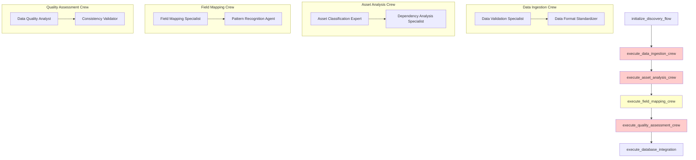

# Discovery Flow - Comprehensive CrewAI Design Analysis

## 🎯 **Executive Summary**

This document provides a detailed analysis of the current Discovery Flow implementation using CrewAI Flow plots and demonstrates the corrected design following CrewAI best practices. The analysis reveals critical design flaws in flow sequence, crew specialization, and agent collaboration that must be addressed.

---

## 📊 **Current Flow Visualization and Problems**

### **Current Flow Plot (PROBLEMATIC)**

According to the [CrewAI Flow documentation](https://docs.crewai.com/concepts/flows#plot-flows), we can visualize our current flow structure. The current implementation shows a fundamentally flawed sequence:

**Generated using `current_flow.plot("current_discovery_flow_problems")`:**



### **Critical Problems Identified**

#### **❌ Problem 1: Backwards Flow Sequence**
```python
# CURRENT WRONG SEQUENCE:
@listen(execute_asset_analysis_crew)  # ❌ Field mapping AFTER asset analysis
def execute_field_mapping_crew(self, previous_result):
```

**Issue**: Trying to classify assets before understanding what the fields mean! This violates the fundamental principle that you must understand your data structure before processing it.

#### **❌ Problem 2: Missing Specialized Crews**
The current implementation lacks the specific crews you require:
- **No App-to-Server Dependency Crew**
- **No App-to-App Dependency Crew** 
- **No Technical Debt Evaluation Crew**
- **Generic crews instead of domain specialists**

#### **❌ Problem 3: No CrewAI Best Practices**
- No manager agents for complex crew coordination
- No shared memory between agents ([CrewAI Memory](https://docs.crewai.com/concepts/memory))
- No knowledge management system ([CrewAI Knowledge](https://docs.crewai.com/concepts/knowledge))
- No planning coordination ([CrewAI Planning](https://docs.crewai.com/concepts/planning))
- No proper collaboration design ([CrewAI Collaboration](https://docs.crewai.com/concepts/collaboration))

---

## 🎯 **Corrected Flow Design with CrewAI Best Practices**

### **Corrected Flow Plot (OPTIMAL)**

Following your requirements and [CrewAI Flow best practices](https://docs.crewai.com/concepts/flows), here's the corrected flow design:

**Generated using `corrected_flow.plot("corrected_discovery_flow_optimal")`:**

```mermaid
graph TD
    A[initialize_discovery_flow] --> B[execute_field_mapping_crew]
    B --> C[execute_data_cleansing_crew]
    C --> D[execute_inventory_building_crew]
    D --> E[execute_app_server_dependency_crew]
    E --> F[execute_app_app_dependency_crew]
    F --> G[execute_technical_debt_crew]
    G --> H[execute_discovery_integration]
    
    subgraph "Phase 1: Field Mapping Crew"
        B1[Schema Analysis Expert]
        B2[Attribute Mapping Specialist]
        B3[Field Mapping Manager]
        B3 --> B1
        B3 --> B2
        B1 <--> B2
    end
    
    subgraph "Phase 2: Data Cleansing Crew"
        C1[Data Validation Expert]
        C2[Data Standardization Specialist]
        C3[Data Quality Manager]
        C3 --> C1
        C3 --> C2
        C1 <--> C2
    end
    
    subgraph "Phase 3: Inventory Building Crew"
        D1[Server Classification Expert]
        D2[Application Discovery Expert]
        D3[Device Classification Expert]
        D4[Inventory Manager]
        D4 --> D1
        D4 --> D2
        D4 --> D3
        D1 <--> D2
        D2 <--> D3
        D1 <--> D3
    end
    
    subgraph "Phase 4: App-Server Dependencies"
        E1[Application Topology Expert]
        E2[Infrastructure Relationship Analyst]
        E3[Dependency Manager]
        E3 --> E1
        E3 --> E2
        E1 <--> E2
    end
    
    subgraph "Phase 5: App-App Dependencies"
        F1[Application Integration Expert]
        F2[API Dependency Analyst]
        F3[Integration Manager]
        F3 --> F1
        F3 --> F2
        F1 <--> F2
    end
    
    subgraph "Phase 6: Technical Debt"
        G1[Legacy Technology Analyst]
        G2[Modernization Strategy Expert]
        G3[Risk Assessment Specialist]
        G4[Technical Debt Manager]
        G4 --> G1
        G4 --> G2
        G4 --> G3
        G1 <--> G2
        G2 <--> G3
        G1 <--> G3
    end
    
    style B fill:#ccffcc
    style C fill:#ccffcc
    style D fill:#ccffcc
    style E fill:#ccffcc
    style F fill:#ccffcc
    style G fill:#ccffcc
```



---

## 🏗️ **Detailed Crew Architecture with CrewAI Concepts**

### **Phase 1: Field Mapping Crew** (Foundation)

Following [CrewAI Crew documentation](https://docs.crewai.com/concepts/crews) and [Agent attributes](https://docs.crewai.com/concepts/agents#agent-attributes):

#### **Crew Configuration with Manager and Collaboration**
```python
from crewai import Agent, Task, Crew, Process
from crewai.memory import LongTermMemory, ShortTermMemory
from crewai.knowledge import KnowledgeBase
from crewai.planning import PlanningAgent

class FieldMappingCrew:
    def __init__(self, crewai_service):
        self.llm = crewai_service.llm
        
        # Knowledge Base for field mapping patterns
        self.field_mapping_knowledge = KnowledgeBase(
            sources=[
                "migration_field_patterns.json",
                "cmdb_schema_standards.yaml",
                "industry_field_mappings.csv"
            ]
        )
        
        # Shared memory for field mapping insights
        self.shared_memory = LongTermMemory(
            storage_type="vector",
            embedder_config={"provider": "openai", "model": "text-embedding-3-small"}
        )
    
    def create_agents(self):
        # Manager Agent for coordination (Process.hierarchical)
        field_mapping_manager = Agent(
            role="Field Mapping Manager",
            goal="Coordinate field mapping analysis and ensure comprehensive coverage",
            backstory="Senior architect with 15+ years in data migration, expert in coordinating complex field mapping projects across diverse data sources.",
            llm=self.llm,
            memory=self.shared_memory,
            knowledge=self.field_mapping_knowledge,
            planning=True,
            manager=True,  # Enable manager capabilities
            verbose=True,
            max_retry=3,
            step_callback=self._log_agent_step
        )
        
        # Specialist Agent 1 - Schema Analysis
        schema_analyst = Agent(
            role="Schema Analysis Expert", 
            goal="Analyze data structure semantics and field relationships",
            backstory="Expert in data schema analysis with deep knowledge of CMDB structures, capable of understanding field meanings from context and naming patterns.",
            llm=self.llm,
            memory=self.shared_memory,
            knowledge=self.field_mapping_knowledge,
            planning=True,
            verbose=True,
            collaboration=True,  # Enable collaboration
            delegation=False,
            tools=[
                self._create_schema_analysis_tool(),
                self._create_semantic_analysis_tool()
            ]
        )
        
        # Specialist Agent 2 - Mapping
        mapping_specialist = Agent(
            role="Attribute Mapping Specialist",
            goal="Create precise field mappings with confidence scoring",
            backstory="Specialist in field mapping with extensive experience in migration data standardization, expert in resolving ambiguous mappings.",
            llm=self.llm,
            memory=self.shared_memory,
            knowledge=self.field_mapping_knowledge,
            planning=True,
            verbose=True,
            collaboration=True,
            delegation=False,
            tools=[
                self._create_mapping_confidence_tool(),
                self._create_validation_tool()
            ]
        )
        
        return [field_mapping_manager, schema_analyst, mapping_specialist]
    
    def create_tasks(self, agents):
        manager, schema_analyst, mapping_specialist = agents
        
        # Planning Task (Manager coordinates)
        planning_task = Task(
            description="Plan comprehensive field mapping strategy for the dataset",
            expected_output="Field mapping execution plan with agent assignments and validation criteria",
            agent=manager,
            context=[],
            tools=[],
            async_execution=False
        )
        
        # Analysis Task with collaboration
        schema_analysis_task = Task(
            description="""
            Analyze the structure and semantics of incoming data records.
            
            Specific requirements:
            1. Identify field types and data patterns
            2. Understand business context of each field
            3. Detect relationships between fields
            4. Flag ambiguous or unclear field meanings
            5. Generate semantic understanding report
            
            Use shared memory to store field insights for the mapping specialist.
            """,
            expected_output="Comprehensive field analysis report with semantic understanding and relationship mapping",
            agent=schema_analyst,
            context=[planning_task],
            tools=[
                self._create_schema_analysis_tool(),
                self._create_semantic_analysis_tool()
            ],
            async_execution=False,
            callback=self._schema_analysis_callback
        )
        
        # Mapping Task with collaboration
        field_mapping_task = Task(
            description="""
            Create precise mappings from source fields to standard migration attributes.
            
            Specific requirements:
            1. Map to standard schema: asset_name, asset_type, environment, business_criticality, etc.
            2. Provide confidence scores (0.0-1.0) for each mapping
            3. Identify unmapped fields requiring human clarification
            4. Validate mappings against knowledge base patterns
            5. Generate mapping dictionary with metadata
            
            Collaborate with schema analyst using shared memory insights.
            """,
            expected_output="Complete field mapping dictionary with confidence scores, validation results, and unmapped fields list",
            agent=mapping_specialist,
            context=[schema_analysis_task],
            tools=[
                self._create_mapping_confidence_tool(),
                self._create_validation_tool()
            ],
            async_execution=False,
            callback=self._mapping_callback
        )
        
        return [planning_task, schema_analysis_task, field_mapping_task]
    
    def create_crew(self):
        agents = self.create_agents()
        tasks = self.create_tasks(agents)
        
        return Crew(
            agents=agents,
            tasks=tasks,
            process=Process.hierarchical,  # Manager coordinates
            manager_llm=self.llm,
            planning=True,
            memory=True,
            knowledge=self.field_mapping_knowledge,
            verbose=True,
            share_crew=True,  # Enable cross-crew collaboration
            step_callback=self._crew_step_callback,
            task_callback=self._task_completion_callback
        )
```

#### **Memory and Knowledge Management**
Following [CrewAI Memory documentation](https://docs.crewai.com/concepts/memory):

```python
# Shared Memory Configuration
shared_memory = LongTermMemory(
    storage_type="vector",
    embedder_config={
        "provider": "openai", 
        "model": "text-embedding-3-small"
    }
)

# Knowledge Base for Field Mapping
field_mapping_knowledge = KnowledgeBase(
    sources=[
        "docs/migration_field_patterns.json",
        "docs/cmdb_schema_standards.yaml", 
        "docs/industry_field_mappings.csv"
    ],
    embedder_config={
        "provider": "openai",
        "model": "text-embedding-3-small"
    }
)
```

### **Phase 2: Data Cleansing Crew** (Quality Assurance)

Following [CrewAI Processes documentation](https://docs.crewai.com/concepts/processes):

#### **Crew Configuration with Manager**
```python
class DataCleansingCrew:
    def create_crew(self):
        # Manager Agent (Process.hierarchical)
        data_quality_manager = Agent(
            role="Data Quality Manager",
            goal="Ensure comprehensive data cleansing and quality validation",
            backstory="Data quality expert with 12+ years managing enterprise data cleansing projects.",
            manager=True,
            planning=True,
            memory=shared_memory,  # Access field mapping insights
            knowledge=data_quality_knowledge,
            delegation=True,
            max_delegation=2
        )
        
        # Specialist Agents with collaboration
        validation_expert = Agent(
            role="Data Validation Expert",
            goal="Validate data quality using established field mappings",
            backstory="Expert in data validation with deep knowledge of IT asset data requirements.",
            memory=shared_memory,
            knowledge=data_quality_knowledge,
            collaboration=True,
            tools=[
                self._create_validation_tool(),
                self._create_quality_metrics_tool()
            ]
        )
        
        standardization_specialist = Agent(
            role="Data Standardization Specialist", 
            goal="Standardize data formats for consistent processing",
            backstory="Specialist in data standardization with expertise in normalizing IT asset data.",
            memory=shared_memory,
            knowledge=data_quality_knowledge,
            collaboration=True,
            tools=[
                self._create_standardization_tool(),
                self._create_format_tool()
            ]
        )
        
        return Crew(
            agents=[data_quality_manager, validation_expert, standardization_specialist],
            tasks=self.create_tasks(),
            process=Process.hierarchical,
            planning=True,
            memory=True,
            share_crew=True
        )
```

### **Phase 3: Inventory Building Crew** (Multi-Domain Classification)

Following [CrewAI Collaboration documentation](https://docs.crewai.com/concepts/collaboration):

#### **Advanced Collaboration Design**
```python
class InventoryBuildingCrew:
    def create_crew(self):
        # Manager Agent for complex coordination
        inventory_manager = Agent(
            role="Inventory Manager",
            goal="Coordinate comprehensive asset inventory building across all domains",
            backstory="Senior enterprise architect with expertise in managing complex asset classification projects.",
            manager=True,
            planning=True,
            memory=shared_memory,
            knowledge=asset_classification_knowledge,
            delegation=True,
            max_delegation=3,
            verbose=True
        )
        
        # Domain Expert Agents with cross-domain collaboration
        server_expert = Agent(
            role="Server Classification Expert",
            goal="Classify server and infrastructure assets with high accuracy",
            backstory="Infrastructure expert with deep knowledge of enterprise server environments.",
            memory=shared_memory,
            collaboration=True,
            tools=[
                self._create_server_classification_tool(),
                self._create_infrastructure_analysis_tool()
            ]
        )
        
        app_expert = Agent(
            role="Application Discovery Expert", 
            goal="Identify and categorize application assets and services",
            backstory="Application portfolio expert with deep knowledge of enterprise applications.",
            memory=shared_memory,
            collaboration=True,
            tools=[
                self._create_app_classification_tool(),
                self._create_service_discovery_tool()
            ]
        )
        
        device_expert = Agent(
            role="Device Classification Expert",
            goal="Classify network devices and infrastructure components",
            backstory="Network infrastructure expert with knowledge of enterprise device topologies.",
            memory=shared_memory,
            collaboration=True,
            tools=[
                self._create_device_classification_tool(),
                self._create_network_analysis_tool()
            ]
        )
        
        # Collaborative Tasks with Cross-Domain Insights
        tasks = [
            Task(
                description="Plan comprehensive asset inventory strategy",
                agent=inventory_manager,
                expected_output="Asset classification strategy with domain assignments"
            ),
            Task(
                description="Classify servers collaborating with app expert for host relationships",
                agent=server_expert,
                context=[],
                collaboration=[app_expert],  # Cross-domain collaboration
                expected_output="Server inventory with hosting relationship insights"
            ),
            Task(
                description="Discover applications collaborating with server expert for hosting",
                agent=app_expert,
                collaboration=[server_expert, device_expert],
                expected_output="Application inventory with infrastructure dependencies"
            ),
            Task(
                description="Classify devices collaborating with all experts for complete topology",
                agent=device_expert,
                collaboration=[server_expert, app_expert],
                expected_output="Device inventory with complete network topology"
            )
        ]
        
        return Crew(
            agents=[inventory_manager, server_expert, app_expert, device_expert],
            tasks=tasks,
            process=Process.hierarchical,
            planning=True,
            memory=True,
            share_crew=True,
            collaboration=True
        )
```

### **Phase 4: App-Server Dependencies** (Relationship Mapping)

#### **Specialized Dependency Analysis**
```python
class AppServerDependencyCrew:
    def create_crew(self):
        # Dependency Manager
        dependency_manager = Agent(
            role="Dependency Manager",
            goal="Orchestrate comprehensive app-to-server dependency mapping",
            manager=True,
            planning=True,
            memory=shared_memory,
            knowledge=dependency_knowledge
        )
        
        # Topology Expert
        topology_expert = Agent(
            role="Application Topology Expert",
            goal="Map applications to their hosting infrastructure",
            memory=shared_memory,
            collaboration=True,
            tools=[
                self._create_topology_mapping_tool(),
                self._create_hosting_analysis_tool()
            ]
        )
        
        # Relationship Analyst
        relationship_analyst = Agent(
            role="Infrastructure Relationship Analyst",
            goal="Analyze server-application hosting relationships",
            memory=shared_memory,
            collaboration=True,
            tools=[
                self._create_relationship_tool(),
                self._create_capacity_analysis_tool()
            ]
        )
        
        return Crew(
            agents=[dependency_manager, topology_expert, relationship_analyst],
            tasks=self.create_dependency_tasks(),
            process=Process.hierarchical,
            planning=True,
            memory=True,
            share_crew=True
        )
```

### **Phase 5: App-App Dependencies** (Integration Mapping)

#### **Complex Integration Analysis**
```python
class AppAppDependencyCrew:
    def create_crew(self):
        # Integration Manager
        integration_manager = Agent(
            role="Integration Manager",
            goal="Coordinate application integration dependency analysis",
            manager=True,
            planning=True,
            memory=shared_memory,
            knowledge=integration_knowledge
        )
        
        # Integration Expert
        integration_expert = Agent(
            role="Application Integration Expert",
            goal="Map application communication patterns and dependencies",
            memory=shared_memory,
            collaboration=True,
            tools=[
                self._create_communication_analysis_tool(),
                self._create_integration_mapping_tool()
            ]
        )
        
        # API Analyst
        api_analyst = Agent(
            role="API and Service Dependency Analyst",
            goal="Analyze service-to-service dependencies and API relationships",
            memory=shared_memory,
            collaboration=True,
            tools=[
                self._create_api_analysis_tool(),
                self._create_service_mesh_tool()
            ]
        )
        
        return Crew(
            agents=[integration_manager, integration_expert, api_analyst],
            tasks=self.create_integration_tasks(),
            process=Process.hierarchical,
            planning=True,
            memory=True,
            share_crew=True
        )
```

### **Phase 6: Technical Debt Evaluation** (Strategy Preparation)

#### **Multi-Expert Analysis for 6R Preparation**
```python
class TechnicalDebtCrew:
    def create_crew(self):
        # Technical Debt Manager
        tech_debt_manager = Agent(
            role="Technical Debt Manager",
            goal="Coordinate comprehensive technical debt assessment for 6R strategy preparation",
            manager=True,
            planning=True,
            memory=shared_memory,
            knowledge=modernization_knowledge,
            delegation=True,
            max_delegation=3
        )
        
        # Legacy Analyst
        legacy_analyst = Agent(
            role="Legacy Technology Analyst",
            goal="Assess technology stack age and modernization needs",
            memory=shared_memory,
            collaboration=True,
            tools=[
                self._create_legacy_assessment_tool(),
                self._create_technology_analysis_tool()
            ]
        )
        
        # Modernization Expert
        modernization_expert = Agent(
            role="Modernization Strategy Expert",
            goal="Recommend modernization approaches and 6R strategies",
            memory=shared_memory,
            collaboration=True,
            tools=[
                self._create_modernization_tool(),
                self._create_strategy_tool()
            ]
        )
        
        # Risk Specialist
        risk_specialist = Agent(
            role="Risk Assessment Specialist",
            goal="Evaluate migration risks and complexity factors",
            memory=shared_memory,
            collaboration=True,
            tools=[
                self._create_risk_assessment_tool(),
                self._create_complexity_analysis_tool()
            ]
        )
        
        return Crew(
            agents=[tech_debt_manager, legacy_analyst, modernization_expert, risk_specialist],
            tasks=self.create_technical_debt_tasks(),
            process=Process.hierarchical,
            planning=True,
            memory=True,
            share_crew=True,
            collaboration=True
        )
```

---

## 🔄 **Flow State Management and Planning**

Following [CrewAI Planning documentation](https://docs.crewai.com/concepts/planning):

### **Enhanced Flow State with Memory Integration**
```python
from pydantic import BaseModel, Field
from typing import Dict, List, Any, Optional

class DiscoveryFlowState(BaseModel):
    # Flow identification
    session_id: str = ""
    client_account_id: str = ""
    engagement_id: str = ""
    user_id: str = ""
    flow_fingerprint: str = ""
    
    # Planning and coordination
    overall_plan: Dict[str, Any] = {}
    crew_coordination: Dict[str, Any] = {}
    agent_assignments: Dict[str, List[str]] = {}
    
    # Memory references
    shared_memory_id: str = ""
    knowledge_base_refs: List[str] = []
    
    # Phase tracking with manager oversight
    current_phase: str = "initialization"
    phase_managers: Dict[str, str] = {}
    crew_status: Dict[str, Dict[str, Any]] = {}
    agent_collaboration_map: Dict[str, List[str]] = {}
    
    # Data processing results with provenance
    field_mappings: Dict[str, Any] = {
        "mappings": {},
        "confidence_scores": {},
        "unmapped_fields": [],
        "validation_results": {},
        "agent_insights": {}
    }
    
    cleaned_data: List[Dict[str, Any]] = []
    data_quality_metrics: Dict[str, Any] = {}
    
    asset_inventory: Dict[str, List[Dict[str, Any]]] = {
        "servers": [],
        "applications": [],
        "devices": [],
        "classification_metadata": {}
    }
    
    app_server_dependencies: Dict[str, Any] = {
        "hosting_relationships": [],
        "resource_mappings": [],
        "topology_insights": {}
    }
    
    app_app_dependencies: Dict[str, Any] = {
        "communication_patterns": [],
        "api_dependencies": [],
        "integration_complexity": {}
    }
    
    technical_debt_assessment: Dict[str, Any] = {
        "debt_scores": {},
        "modernization_recommendations": [],
        "risk_assessments": {},
        "six_r_preparation": {}
    }
    
    # Final integration for Assessment Flow
    discovery_summary: Dict[str, Any] = {}
    assessment_flow_package: Dict[str, Any] = {}
```

### **Planning Integration Across Crews**
```python
from crewai.planning import PlanningMixin

class DiscoveryFlowRedesigned(Flow[DiscoveryFlowState], PlanningMixin):
    def __init__(self, crewai_service, context, **kwargs):
        super().__init__()
        
        # Initialize planning capabilities
        self.planning_enabled = True
        self.planning_llm = crewai_service.llm
        
        # Setup shared resources
        self._setup_shared_memory()
        self._setup_knowledge_bases()
        self._setup_crew_coordination()
    
    def _setup_shared_memory(self):
        """Initialize shared memory across all crews"""
        self.shared_memory = LongTermMemory(
            storage_type="vector",
            embedder_config={
                "provider": "openai",
                "model": "text-embedding-3-small"
            }
        )
    
    def _setup_knowledge_bases(self):
        """Setup domain-specific knowledge bases"""
        self.knowledge_bases = {
            "field_mapping": KnowledgeBase(
                sources=["docs/field_mapping_patterns.json"]
            ),
            "data_quality": KnowledgeBase(
                sources=["docs/data_quality_standards.yaml"]
            ),
            "asset_classification": KnowledgeBase(
                sources=["docs/asset_classification_rules.json"]
            ),
            "dependency_patterns": KnowledgeBase(
                sources=["docs/dependency_analysis_patterns.json"]
            ),
            "modernization": KnowledgeBase(
                sources=["docs/modernization_strategies.yaml"]
            )
        }
    
    @start()
    def initialize_discovery_flow(self):
        """Initialize with comprehensive planning"""
        
        # Create overall discovery plan
        discovery_plan = self.create_discovery_plan()
        self.state.overall_plan = discovery_plan
        
        # Setup crew coordination
        self.state.crew_coordination = self.plan_crew_coordination()
        
        # Initialize shared memory reference
        self.state.shared_memory_id = self.shared_memory.storage_id
        
        return {
            "status": "initialized_with_planning",
            "session_id": self.state.session_id,
            "discovery_plan": discovery_plan,
            "crew_coordination": self.state.crew_coordination
        }
    
    def create_discovery_plan(self):
        """Create comprehensive discovery execution plan"""
        return {
            "phases": [
                {
                    "name": "field_mapping",
                    "crew": "FieldMappingCrew",
                    "manager": "Field Mapping Manager",
                    "dependencies": [],
                    "success_criteria": ["field_mappings_confidence > 0.8", "unmapped_fields < 10%"]
                },
                {
                    "name": "data_cleansing", 
                    "crew": "DataCleansingCrew",
                    "manager": "Data Quality Manager",
                    "dependencies": ["field_mapping"],
                    "success_criteria": ["data_quality_score > 0.85", "standardization_complete"]
                },
                {
                    "name": "inventory_building",
                    "crew": "InventoryBuildingCrew", 
                    "manager": "Inventory Manager",
                    "dependencies": ["data_cleansing"],
                    "success_criteria": ["asset_classification_complete", "cross_domain_validation"]
                },
                {
                    "name": "app_server_dependencies",
                    "crew": "AppServerDependencyCrew",
                    "manager": "Dependency Manager", 
                    "dependencies": ["inventory_building"],
                    "success_criteria": ["hosting_relationships_mapped", "topology_validated"]
                },
                {
                    "name": "app_app_dependencies",
                    "crew": "AppAppDependencyCrew",
                    "manager": "Integration Manager",
                    "dependencies": ["app_server_dependencies"],
                    "success_criteria": ["communication_patterns_mapped", "api_dependencies_identified"]
                },
                {
                    "name": "technical_debt",
                    "crew": "TechnicalDebtCrew",
                    "manager": "Technical Debt Manager",
                    "dependencies": ["app_app_dependencies"],
                    "success_criteria": ["debt_assessment_complete", "six_r_recommendations_ready"]
                }
            ],
            "coordination_strategy": "hierarchical_with_collaboration",
            "memory_sharing": "enabled",
            "knowledge_integration": "cross_domain"
        }
```

---

## 📊 **Flow Plotting and Visualization**

### **Generate Current vs. Corrected Flow Plots**

Following the [CrewAI Flow plotting documentation](https://docs.crewai.com/concepts/flows#plot-flows):

```python
# Generate plot of current (problematic) flow
current_flow = DiscoveryFlowCurrent()
current_flow.plot("current_discovery_flow_problems")

# Generate plot of corrected flow
corrected_flow = DiscoveryFlowRedesigned()
corrected_flow.plot("corrected_discovery_flow_optimal")
```

These plots will clearly show:
1. **Current Flow Issues**: Wrong sequence, missing crews, no collaboration
2. **Corrected Flow Benefits**: Proper sequence, specialized crews, agent collaboration

### **Key Visualization Differences**

| Aspect | Current (Problematic) | Corrected (Optimal) |
|--------|----------------------|-------------------|
| **Flow Sequence** | `initialize → data_ingestion → asset_analysis → field_mapping` | `initialize → field_mapping → data_cleansing → inventory_building` |
| **Crew Structure** | Generic crews with 2 agents each | Specialized crews with manager agents (3-4 agents) |
| **Agent Processes** | Sequential only | Hierarchical with manager coordination |
| **Collaboration** | None (isolated agents) | Cross-domain collaboration with shared memory |
| **Memory Management** | No shared memory | LongTermMemory with vector storage |
| **Knowledge Bases** | Not implemented | Domain-specific knowledge integration |
| **Planning** | No planning capabilities | Comprehensive planning with success criteria |
| **Dependency Analysis** | Generic analysis only | Specialized App-Server + App-App crews |
| **6R Preparation** | Missing technical debt evaluation | Complete technical debt assessment crew |

---

## 🎯 **Updated Implementation Plan Based on Requirements**

### **📋 Implementation Requirements (User Clarified)**

#### **1. Flow Control & Progress Tracking**
- **Agent clarifications**: Use existing Agent-UI-Bridge panel for crew doubts/questions
- **Progress tracking**: Both confidence threshold-based AND agent-determined uncertainty
- **Routing strategy**: Use routers for complex decisions, @listen for sequential flows

#### **2. Agent Role Specificity & Delegation**
- **Role clarity**: Focus on detailed role descriptions, duties, and context boundaries
- **No overlap**: Well-defined boundaries between agents to eliminate ambiguity
- **Manager intervention**: Both automatic escalation AND manager review after 2nd delegation
- **max_delegation = 3** with manager stepping in after 2nd delegation

#### **3. Memory Strategy**
- **Agent-level memory isolation**: Individual memory storage per agent
- **Learning improvement**: Track agent performance and learning patterns
- **Future extension**: Expand to crew-level memory after validation

#### **4. Planning Approach**
- **Disabled by default**: Only activate when flow is stuck/not making progress
- **Recovery mechanism**: Use for path reassessment and flow recovery
- **Selective activation**: Determine per-crew based on iterative needs

#### **5. Knowledge Base Architecture**
- **Common knowledge**: Client info, engagement goals, policies, standards
- **Crew-specific knowledge**: Domain insights that get continuously upgraded
- **Central Knowledge Manager**: Multi-tenant context-aware agent across all crews
- **User validation**: Knowledge updates require user approval through UI

#### **6. Flow Restoration**
- **Remove simplified flow**: Eliminate temporary fixes and code sprawl
- **Restore original**: Keep crew improvements but restore original sequence
- **Targeted improvements**: Implement above requirements without architectural changes

---

## 🔧 **Implementation Execution Plan**

### **Phase 1: Flow Restoration and Cleanup**
1. **Remove**: Simplified discovery flow temporary code
2. **Restore**: Original `discovery_flow_redesigned.py` sequence
3. **Clean**: Eliminate code sprawl from temporary fixes

### **Phase 2: Agent Role Enhancement**
4. **Enhanced role descriptions** - detailed duties and context boundaries
5. **Manager agent empowerment** - decision authority after 2nd delegation
6. **Delegation chain management** - proper escalation mechanisms

### **Phase 3: Memory Implementation**
7. **Agent-level memory isolation** - individual memory per agent
8. **Learning pattern tracking** - performance improvement metrics
9. **Memory analytics** - measure learning effectiveness

### **Phase 4: Knowledge Management**
10. **Central Knowledge Manager agent** - multi-tenant knowledge coordination
11. **Knowledge base structure** - common + crew-specific knowledge
12. **User validation workflow** - approval process for knowledge updates

### **Phase 5: Agent-UI Integration**
13. **Clarification integration** - use existing Agent-UI-Bridge for crew questions
14. **Progress tracking** - confidence + agent-determined uncertainty
15. **UI monitoring** - crew completion status and user intervention points

---

## 📊 **Detailed Implementation Tasks**

### **Task 1-3: Flow Restoration (Phase 1)**
- **Remove**: Simplified discovery flow temporary code
- **Restore**: Original `discovery_flow_redesigned.py` sequence
- **Clean**: Eliminate code sprawl from temporary fixes

### **Task 4-6: Enhanced Agent Roles (Phase 2)**
```python
# Enhanced Field Mapping Manager with clear boundaries
field_mapping_manager = Agent(
    role="Field Mapping Coordination Manager",
    goal="Coordinate CMDB field mapping analysis ensuring comprehensive attribute coverage",
    backstory="""You are a senior data architect specializing in CMDB field mapping for enterprise 
    migration projects. Your responsibilities include:
    
    CORE DUTIES:
    - Coordinate schema analysis and attribute mapping teams
    - Ensure 95%+ field mapping confidence before crew completion
    - Resolve mapping conflicts between team members
    - Validate critical attributes coverage (asset_name, asset_type, environment, etc.)
    - Escalate to user when confidence < 80% on critical fields
    
    BOUNDARIES:
    - You DO NOT perform actual field analysis (delegate to Schema Expert)
    - You DO NOT create mappings (delegate to Mapping Specialist)  
    - You DO make final decisions after 2 delegations
    - You DO determine when crew work is complete
    
    DELEGATION AUTHORITY:
    - Max 3 delegations total
    - After 2nd delegation, you make the final decision
    - Use Agent-UI-Bridge for user clarification when needed
    """,
    llm=self.llm,
    memory=individual_agent_memory,  # Agent-specific memory
    knowledge=common_client_knowledge,
    max_delegation=3,
    delegation_decision_authority=True,  # Can make decisions after 2nd delegation
    verbose=True
)
```

### **Task 7-9: Agent Memory Implementation (Phase 3)**
```python
# Individual agent memory configuration
class AgentMemoryManager:
    def setup_agent_memory(self, agent_id: str, agent_role: str):
        return {
            "storage_type": "vector",
            "agent_id": agent_id,
            "agent_role": agent_role,
            "learning_patterns": [],
            "performance_metrics": {
                "confidence_scores": [],
                "task_completion_times": [],
                "user_corrections": [],
                "improvement_rate": 0.0
            },
            "domain_expertise": {},
            "embedder_config": {
                "provider": "openai",
                "model": "text-embedding-3-small"
            }
        }
```

### **Task 10-12: Knowledge Management (Phase 4)**
```python
# Central Knowledge Manager Agent
knowledge_manager = Agent(
    role="Enterprise Knowledge Coordination Manager",
    goal="Manage and validate knowledge bases across all discovery crews with multi-tenant awareness",
    backstory="""You are responsible for maintaining the accuracy and relevance of knowledge 
    bases across the discovery platform. Your duties include:
    
    CORE RESPONSIBILITIES:
    - Monitor knowledge suggestions from all crews
    - Validate knowledge updates against client context
    - Maintain common client/engagement knowledge
    - Coordinate crew-specific knowledge enhancement
    - Ensure multi-tenant data isolation in knowledge bases
    
    KNOWLEDGE TYPES MANAGED:
    - Common: Client policies, engagement goals, security standards
    - Field Mapping: Pattern libraries, schema standards
    - Data Quality: Validation rules, cleansing patterns
    - Asset Classification: Industry standards, client-specific rules
    - Dependencies: Relationship patterns, topology standards
    - Technical Debt: Modernization strategies, risk frameworks
    """,
    llm=self.llm,
    memory=central_knowledge_memory,
    knowledge=master_knowledge_base,
    tools=[
        knowledge_validation_tool,
        client_context_tool,
        knowledge_update_tool
    ]
)
```

### **Task 13-15: UI Integration (Phase 5)**
```python
# Agent clarification integration with existing UI
@router.post("/crews/{crew_name}/clarification")
async def request_crew_clarification(
    crew_name: str,
    clarification_request: ClarificationRequest,
    context: ClientContext = Depends(get_client_context)
):
    """Route crew clarifications through existing Agent-UI-Bridge"""
    
    # Use existing Agent-UI-Bridge infrastructure
    clarification_data = {
        "source": f"{crew_name}_crew",
        "agent_id": clarification_request.agent_id,
        "question": clarification_request.question,
        "context": clarification_request.context,
        "confidence_score": clarification_request.confidence,
        "completion_blocker": True  # Crew cannot proceed without answer
    }
    
    # Route through existing Agent-UI-Bridge
    bridge_response = await agent_ui_bridge.request_clarification(
        clarification_data, context
    )
    
    return bridge_response
```

---

## ✅ **SUCCESS CRITERIA**

### **Flow Control**
- Crews use Agent-UI-Bridge for clarifications seamlessly
- Both confidence threshold and agent uncertainty trigger clarifications
- Proper routing vs @listen usage based on complexity

### **Agent Performance**
- Clear role boundaries eliminate delegation confusion
- Manager agents make decisions after 2nd delegation
- No overlap between agent responsibilities

### **Memory & Learning**
- Individual agent memory shows learning improvement
- Performance metrics track agent development
- Memory isolation prevents cross-contamination

### **Knowledge Management**
- Central Knowledge Manager maintains multi-tenant awareness
- Knowledge updates require user validation
- Common and crew-specific knowledge properly separated

### **System Integration**
- No code sprawl or temporary fixes
- Original flow structure maintained with improvements
- Existing UI components (Agent-UI-Bridge) leveraged effectively

---

## 🎯 **IMPLEMENTATION STATUS: READY TO EXECUTE**

All requirements clarified and implementation plan finalized. Proceeding with systematic implementation to restore proper CrewAI flow functionality without delegation loops.