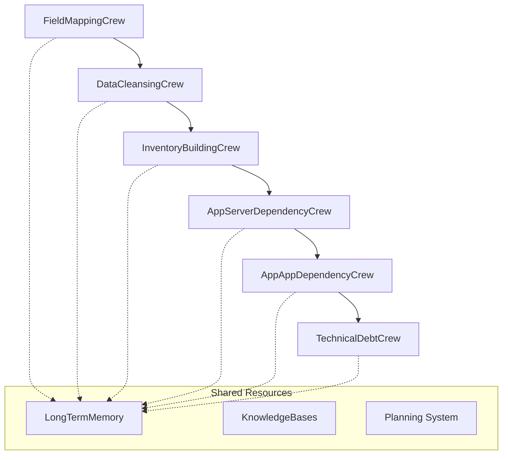

# Agent and Crew Specifications

## 📋 **Overview**

This document provides comprehensive specifications for all CrewAI agents and crews in the Discovery Flow, detailing their roles, capabilities, collaboration patterns, and integration points.

## 🏗️ **Architecture Principles**

### **CrewAI Design Patterns**
- **Hierarchical Process**: Manager agents coordinate specialist agents using Process.hierarchical
- **Shared Memory**: LongTermMemory with vector embeddings across all crews
- **Knowledge Integration**: Domain-specific knowledge bases for each crew
- **Cross-Crew Collaboration**: Agents share insights and coordinate across crew boundaries
- **Planning Intelligence**: Adaptive execution planning with success criteria validation

### **Agent Classification**
- **Manager Agents**: Coordinate crew activities, delegate tasks, make strategic decisions
- **Specialist Agents**: Execute domain-specific tasks, generate insights, collaborate with peers
- **Expert Agents**: Deep domain knowledge, cross-crew consultation, knowledge validation

## 🎯 **Discovery Flow Crew Architecture**

### **Flow Sequence**


---

## 🧠 **Crew 1: Field Mapping Crew**

### **Purpose**
Foundation crew that analyzes incoming data structure and creates precise field mappings to standardized migration attributes.

### **Architecture**
- **Process**: Hierarchical with manager coordination
- **Memory**: Shared LongTermMemory for field mapping insights
- **Knowledge Base**: field_mapping_patterns.json, industry_field_mappings.csv
- **Collaboration**: Intra-crew specialist coordination

### **Agents**

#### **1.1 Field Mapping Manager** (Manager Agent)
- **Role**: "Field Mapping Manager"
- **Goal**: "Coordinate field mapping analysis and ensure comprehensive coverage"
- **Backstory**: "Senior architect with 15+ years in data migration, expert in coordinating complex field mapping projects across diverse data sources."

**Capabilities:**
- **Planning**: Creates execution plans for field mapping strategy
- **Delegation**: Assigns tasks to Schema Analysis Expert and Attribute Mapping Specialist
- **Coordination**: Monitors progress and ensures quality standards
- **Decision Making**: Resolves mapping conflicts and ambiguities
- **Quality Assurance**: Validates overall mapping quality and completeness

**Configuration:**
```python
manager=True
planning=True
delegation=True
max_delegation=2
memory=shared_memory
knowledge=field_mapping_knowledge
verbose=True
max_retry=3
```

**Tasks Managed:**
1. Planning Task - Create comprehensive field mapping strategy
2. Oversight of schema analysis and field mapping execution
3. Quality validation and conflict resolution

#### **1.2 Schema Analysis Expert** (Specialist Agent)
- **Role**: "Schema Analysis Expert"
- **Goal**: "Analyze data structure semantics and field relationships"
- **Backstory**: "Expert in data schema analysis with deep knowledge of CMDB structures, capable of understanding field meanings from context and naming patterns."

**Capabilities:**
- **Semantic Analysis**: Understands field meanings and business context
- **Pattern Recognition**: Identifies data patterns and relationships
- **Structure Analysis**: Maps data relationships and dependencies
- **Insight Generation**: Creates semantic understanding reports
- **Collaboration**: Shares analysis insights with mapping specialist

**Tools:**
- `schema_analysis_tool`: Analyzes field types and patterns
- `semantic_analysis_tool`: Understands business context
- `relationship_detection_tool`: Identifies field relationships

**Configuration:**
```python
collaboration=True
delegation=False
memory=shared_memory
knowledge=field_mapping_knowledge
planning=True
verbose=True
```

**Task Execution:**
- Schema Analysis Task: Comprehensive field analysis with semantic understanding
- Output: Field analysis report with semantic insights and relationships

#### **1.3 Attribute Mapping Specialist** (Specialist Agent)
- **Role**: "Attribute Mapping Specialist"
- **Goal**: "Create precise field mappings with confidence scoring"
- **Backstory**: "Specialist in field mapping with extensive experience in migration data standardization, expert in resolving ambiguous mappings."

**Capabilities:**
- **Precision Mapping**: Creates accurate field-to-attribute mappings
- **Confidence Scoring**: Assigns confidence levels (0.0-1.0) to each mapping
- **Validation**: Validates mappings against knowledge base patterns
- **Conflict Resolution**: Handles ambiguous field mappings
- **Metadata Generation**: Creates mapping metadata and documentation

**Tools:**
- `mapping_confidence_tool`: Calculates mapping confidence scores
- `validation_tool`: Validates mappings against standards
- `conflict_resolution_tool`: Resolves mapping ambiguities

**Configuration:**
```python
collaboration=True
delegation=False
memory=shared_memory
knowledge=field_mapping_knowledge
planning=True
verbose=True
```

**Task Execution:**
- Field Mapping Task: Creates complete field mapping dictionary with confidence scores
- Output: Mapping dictionary, confidence scores, validation results, unmapped fields list

### **Crew Integration**
- **Memory Integration**: Stores field mapping insights for downstream crews
- **Knowledge Base**: Applies industry-standard mapping patterns
- **Success Criteria**: field_mappings_confidence > 0.8, unmapped_fields < 10%
- **Handoff**: Provides field mappings and quality indicators to Data Cleansing Crew

---

## 🧹 **Crew 2: Data Cleansing Crew**

### **Purpose**
Quality assurance crew that cleanses and standardizes data using field mapping insights.

### **Architecture**
- **Process**: Hierarchical with manager oversight
- **Memory**: Accesses field mapping insights, stores quality patterns
- **Knowledge Base**: data_quality_standards.yaml, validation_rules.json
- **Collaboration**: Builds on field mapping results

### **Agents**

#### **2.1 Data Quality Manager** (Manager Agent)
- **Role**: "Data Quality Manager"
- **Goal**: "Ensure comprehensive data cleansing and quality validation"
- **Backstory**: "Data quality expert with 12+ years managing enterprise data cleansing projects."

**Capabilities:**
- **Quality Oversight**: Monitors overall data quality metrics
- **Strategy Planning**: Creates data cleansing execution plans
- **Standards Enforcement**: Ensures adherence to quality standards
- **Performance Monitoring**: Tracks cleansing effectiveness
- **Exception Handling**: Manages quality issues and exceptions

**Configuration:**
```python
manager=True
planning=True
delegation=True
max_delegation=2
memory=shared_memory
knowledge=data_quality_knowledge
```

#### **2.2 Data Validation Expert** (Specialist Agent)
- **Role**: "Data Validation Expert"  
- **Goal**: "Validate data quality using established field mappings"
- **Backstory**: "Expert in data validation with deep knowledge of IT asset data requirements."

**Capabilities:**
- **Quality Assessment**: Evaluates data completeness, accuracy, consistency
- **Validation Rules**: Applies field-specific validation rules
- **Anomaly Detection**: Identifies data quality issues
- **Metrics Generation**: Creates quality scorecards
- **Issue Classification**: Categorizes and prioritizes quality issues

**Tools:**
- `validation_tool`: Comprehensive data validation
- `quality_metrics_tool`: Generates quality scorecards
- `anomaly_detection_tool`: Identifies data anomalies

#### **2.3 Data Standardization Specialist** (Specialist Agent)
- **Role**: "Data Standardization Specialist"
- **Goal**: "Standardize data formats for consistent processing"
- **Backstory**: "Specialist in data standardization with expertise in normalizing IT asset data."

**Capabilities:**
- **Format Standardization**: Normalizes data formats and values
- **Value Harmonization**: Standardizes categorical values
- **Data Transformation**: Applies field-specific transformations
- **Consistency Enforcement**: Ensures data consistency across records
- **Documentation**: Creates standardization documentation

**Tools:**
- `standardization_tool`: Applies standardization rules
- `format_tool`: Normalizes data formats
- `transformation_tool`: Applies data transformations

### **Crew Integration**
- **Input**: Field mappings and quality indicators from Field Mapping Crew
- **Memory Integration**: Stores quality patterns and standardization rules
- **Output**: Cleaned and standardized data with quality metrics
- **Handoff**: Provides quality-assured data to Inventory Building Crew

---

## 🏭 **Crew 3: Inventory Building Crew**

### **Purpose**
Multi-domain classification crew that builds comprehensive asset inventory across servers, applications, and devices.

### **Architecture**
- **Process**: Hierarchical with complex cross-domain coordination
- **Memory**: Accesses cleansing results, stores classification insights
- **Knowledge Base**: asset_classification_rules.json, domain_patterns.yaml
- **Collaboration**: High cross-domain collaboration between specialists

### **Agents**

#### **3.1 Inventory Manager** (Manager Agent)
- **Role**: "Inventory Manager"
- **Goal**: "Coordinate comprehensive asset inventory building across all domains"
- **Backstory**: "Senior enterprise architect with expertise in managing complex asset classification projects."

**Capabilities:**
- **Multi-Domain Coordination**: Manages server, application, and device experts
- **Strategy Planning**: Creates cross-domain classification strategies
- **Resource Allocation**: Optimizes specialist utilization
- **Quality Assurance**: Ensures classification accuracy and completeness
- **Integration Management**: Coordinates cross-domain insights

**Configuration:**
```python
manager=True
planning=True
delegation=True
max_delegation=3
memory=shared_memory
knowledge=asset_classification_knowledge
verbose=True
```

#### **3.2 Server Classification Expert** (Specialist Agent)
- **Role**: "Server Classification Expert"
- **Goal**: "Classify server and infrastructure assets with high accuracy"
- **Backstory**: "Infrastructure expert with deep knowledge of enterprise server environments."

**Capabilities:**
- **Server Identification**: Identifies physical/virtual servers
- **Infrastructure Classification**: Categorizes infrastructure components
- **Hosting Analysis**: Determines hosting capabilities and resources
- **Performance Assessment**: Evaluates server specifications
- **Cross-Domain Insights**: Shares hosting insights with application expert

**Tools:**
- `server_classification_tool`: Classifies server types and roles
- `infrastructure_analysis_tool`: Analyzes infrastructure components
- `hosting_capacity_tool`: Evaluates hosting capabilities

**Collaboration:**
- **With Application Expert**: Shares hosting relationship insights
- **With Device Expert**: Coordinates network infrastructure analysis

#### **3.3 Application Discovery Expert** (Specialist Agent)
- **Role**: "Application Discovery Expert"
- **Goal**: "Identify and categorize application assets and services"
- **Backstory**: "Application portfolio expert with deep knowledge of enterprise applications."

**Capabilities:**
- **Application Identification**: Discovers and catalogs applications
- **Service Classification**: Categorizes application services
- **Technology Stack Analysis**: Identifies application technologies
- **Business Function Mapping**: Maps applications to business functions
- **Dependency Preparation**: Prepares for dependency analysis

**Tools:**
- `app_classification_tool`: Classifies application types
- `service_discovery_tool`: Discovers application services
- `technology_analysis_tool`: Analyzes application technologies

**Collaboration:**
- **With Server Expert**: Coordinates hosting relationship mapping
- **With Device Expert**: Shares network service insights

#### **3.4 Device Classification Expert** (Specialist Agent)
- **Role**: "Device Classification Expert"
- **Goal**: "Classify network devices and infrastructure components"
- **Backstory**: "Network infrastructure expert with knowledge of enterprise device topologies."

**Capabilities:**
- **Device Identification**: Identifies network devices and endpoints
- **Network Topology Mapping**: Maps network relationships
- **Infrastructure Integration**: Coordinates with server and application analysis
- **Security Analysis**: Identifies security-relevant devices
- **Capacity Planning**: Assesses network capacity and performance

**Tools:**
- `device_classification_tool`: Classifies device types
- `network_analysis_tool`: Analyzes network topology
- `security_assessment_tool`: Evaluates security implications

**Collaboration:**
- **With Server Expert**: Coordinates infrastructure topology
- **With Application Expert**: Maps application-network relationships

### **Crew Integration**
- **Input**: Cleaned data from Data Cleansing Crew
- **Memory Integration**: Stores classification patterns and cross-domain insights
- **Output**: Comprehensive asset inventory with cross-domain relationships
- **Handoff**: Provides classified assets to dependency analysis crews

---

## 🔗 **Crew 4: App-Server Dependency Crew**

### **Purpose**
Specialized crew for mapping application-to-server hosting relationships and infrastructure dependencies.

### **Architecture**
- **Process**: Hierarchical with dependency analysis focus
- **Memory**: Accesses asset inventory, stores hosting relationships
- **Knowledge Base**: dependency_analysis_patterns.json, hosting_patterns.yaml
- **Collaboration**: Cross-references with inventory insights

### **Agents**

#### **4.1 Dependency Manager** (Manager Agent)
- **Role**: "Dependency Manager"
- **Goal**: "Orchestrate comprehensive app-to-server dependency mapping"
- **Backstory**: "Infrastructure dependency expert with 10+ years mapping complex application-server relationships."

**Capabilities:**
- **Dependency Strategy**: Creates hosting relationship analysis plans
- **Coordination**: Manages topology and relationship analysts
- **Validation**: Ensures dependency accuracy and completeness
- **Integration**: Coordinates with app-app dependency analysis
- **Documentation**: Creates dependency documentation

#### **4.2 Application Topology Expert** (Specialist Agent)
- **Role**: "Application Topology Expert"
- **Goal**: "Map applications to their hosting infrastructure"
- **Backstory**: "Application architecture expert specializing in infrastructure topology mapping."

**Capabilities:**
- **Hosting Mapping**: Maps applications to hosting servers
- **Resource Analysis**: Analyzes resource utilization and capacity
- **Performance Assessment**: Evaluates hosting performance
- **Scaling Analysis**: Identifies scaling patterns and requirements
- **Migration Planning**: Prepares hosting migration considerations

**Tools:**
- `topology_mapping_tool`: Maps application-server topology
- `hosting_analysis_tool`: Analyzes hosting relationships
- `resource_utilization_tool`: Evaluates resource usage

#### **4.3 Infrastructure Relationship Analyst** (Specialist Agent)
- **Role**: "Infrastructure Relationship Analyst"
- **Goal**: "Analyze server-application hosting relationships"
- **Backstory**: "Infrastructure analyst with expertise in server-application coupling analysis."

**Capabilities:**
- **Relationship Analysis**: Analyzes hosting relationship strength
- **Capacity Planning**: Evaluates server hosting capacity
- **Performance Impact**: Assesses relationship performance implications
- **Risk Assessment**: Identifies hosting-related risks
- **Optimization**: Recommends hosting optimizations

**Tools:**
- `relationship_tool`: Analyzes relationship characteristics
- `capacity_analysis_tool`: Evaluates hosting capacity
- `performance_impact_tool`: Assesses performance implications

### **Crew Integration**
- **Input**: Asset inventory from Inventory Building Crew
- **Memory Integration**: Stores hosting relationships and topology insights
- **Output**: App-server dependency mappings with resource analysis
- **Handoff**: Provides infrastructure context to App-App Dependency Crew

---

## 🔄 **Crew 5: App-App Dependency Crew**

### **Purpose**
Integration analysis crew that maps application-to-application dependencies and communication patterns.

### **Architecture**
- **Process**: Hierarchical with integration focus
- **Memory**: Accesses hosting relationships, stores integration patterns
- **Knowledge Base**: integration_patterns.json, api_standards.yaml
- **Collaboration**: Builds on hosting analysis results

### **Agents**

#### **5.1 Integration Manager** (Manager Agent)
- **Role**: "Integration Manager"
- **Goal**: "Coordinate application integration dependency analysis"
- **Backstory**: "Integration architecture expert with 12+ years mapping enterprise application dependencies."

**Capabilities:**
- **Integration Strategy**: Plans application dependency analysis
- **Complexity Assessment**: Evaluates integration complexity
- **Risk Management**: Identifies integration risks
- **Migration Impact**: Assesses migration impact on integrations
- **Documentation**: Creates integration documentation

#### **5.2 Application Integration Expert** (Specialist Agent)
- **Role**: "Application Integration Expert"
- **Goal**: "Map application communication patterns and dependencies"
- **Backstory**: "Application integration specialist with deep knowledge of enterprise integration patterns."

**Capabilities:**
- **Communication Analysis**: Maps application communication flows
- **Integration Patterns**: Identifies integration architectural patterns
- **Data Flow Mapping**: Traces data flows between applications
- **Protocol Analysis**: Analyzes communication protocols
- **Dependency Strength**: Evaluates dependency criticality

**Tools:**
- `communication_analysis_tool`: Analyzes application communication
- `integration_mapping_tool`: Maps integration patterns
- `data_flow_tool`: Traces data flows

#### **5.3 API and Service Dependency Analyst** (Specialist Agent)
- **Role**: "API and Service Dependency Analyst"
- **Goal**: "Analyze service-to-service dependencies and API relationships"
- **Backstory**: "API architecture expert specializing in service dependency analysis."

**Capabilities:**
- **API Analysis**: Maps API dependencies and contracts
- **Service Mesh**: Analyzes service mesh relationships
- **Contract Validation**: Validates API contracts and compatibility
- **Version Management**: Tracks API versions and compatibility
- **Security Analysis**: Evaluates API security implications

**Tools:**
- `api_analysis_tool`: Analyzes API dependencies
- `service_mesh_tool`: Maps service relationships
- `contract_validation_tool`: Validates API contracts

### **Crew Integration**
- **Input**: Hosting relationships from App-Server Dependency Crew
- **Memory Integration**: Stores integration patterns and API dependencies
- **Output**: App-app dependency mappings with integration complexity analysis
- **Handoff**: Provides complete dependency context to Technical Debt Crew

---

## 🏗️ **Crew 6: Technical Debt Crew**

### **Purpose**
Strategic assessment crew that evaluates technical debt and prepares 6R migration strategy recommendations.

### **Architecture**
- **Process**: Hierarchical with multi-expert analysis
- **Memory**: Accesses all previous insights, stores strategic assessments
- **Knowledge Base**: modernization_strategies.yaml, 6r_patterns.json
- **Collaboration**: Synthesizes insights from all previous crews

### **Agents**

#### **6.1 Technical Debt Manager** (Manager Agent)
- **Role**: "Technical Debt Manager"
- **Goal**: "Coordinate comprehensive technical debt assessment for 6R strategy preparation"
- **Backstory**: "Strategic modernization expert with 15+ years managing enterprise modernization initiatives."

**Capabilities:**
- **Strategic Planning**: Creates technical debt assessment strategy
- **Multi-Expert Coordination**: Manages legacy, modernization, and risk experts
- **6R Preparation**: Prepares comprehensive 6R strategy inputs
- **Priority Management**: Prioritizes modernization initiatives
- **Business Alignment**: Aligns technical debt with business priorities

**Configuration:**
```python
manager=True
planning=True
delegation=True
max_delegation=3
memory=shared_memory
knowledge=modernization_knowledge
verbose=True
```

#### **6.2 Legacy Technology Analyst** (Specialist Agent)
- **Role**: "Legacy Technology Analyst"
- **Goal**: "Assess technology stack age and modernization needs"
- **Backstory**: "Technology assessment expert with deep knowledge of legacy system evaluation."

**Capabilities:**
- **Technology Assessment**: Evaluates technology stack maturity
- **Legacy Identification**: Identifies legacy technologies and patterns
- **Modernization Gaps**: Identifies technology modernization gaps
- **Lifecycle Analysis**: Analyzes technology lifecycle stages
- **Replacement Planning**: Recommends technology replacements

**Tools:**
- `legacy_assessment_tool`: Assesses legacy technology debt
- `technology_analysis_tool`: Analyzes technology stacks
- `lifecycle_evaluation_tool`: Evaluates technology lifecycles

#### **6.3 Modernization Strategy Expert** (Specialist Agent)
- **Role**: "Modernization Strategy Expert"
- **Goal**: "Recommend modernization approaches and 6R strategies"
- **Backstory**: "Cloud modernization strategist with expertise in enterprise migration strategies."

**Capabilities:**
- **6R Strategy Mapping**: Maps assets to 6R strategies (Rehost, Replatform, Refactor, Rearchitect, Retire, Retain)
- **Modernization Planning**: Creates modernization roadmaps
- **Cloud Native Assessment**: Evaluates cloud-native readiness
- **Technology Recommendations**: Recommends modern technology alternatives
- **Business Case Development**: Develops modernization business cases

**Tools:**
- `modernization_tool`: Recommends modernization strategies
- `strategy_tool`: Maps 6R strategies to assets
- `business_case_tool`: Develops modernization business cases

#### **6.4 Risk Assessment Specialist** (Specialist Agent)
- **Role**: "Risk Assessment Specialist"
- **Goal**: "Evaluate migration risks and complexity factors"
- **Backstory**: "Migration risk expert with extensive experience in enterprise migration risk assessment."

**Capabilities:**
- **Risk Identification**: Identifies migration risks and challenges
- **Impact Assessment**: Evaluates business and technical impact
- **Mitigation Planning**: Develops risk mitigation strategies
- **Complexity Analysis**: Assesses migration complexity factors
- **Success Probability**: Evaluates migration success probability

**Tools:**
- `risk_assessment_tool`: Evaluates migration risks
- `complexity_analysis_tool`: Analyzes migration complexity
- `mitigation_planning_tool`: Develops mitigation strategies

### **Crew Integration**
- **Input**: Complete dependency and asset analysis from all previous crews
- **Memory Integration**: Synthesizes all discovery insights for strategic assessment
- **Output**: Technical debt assessment, 6R recommendations, migration strategies
- **Handoff**: Provides comprehensive discovery results to Assessment Flow

---

## 🧠 **Shared Resources and Integration**

### **Memory Management**

#### **LongTermMemory Configuration**
```python
shared_memory = LongTermMemory(
    storage_type="vector",
    embedder_config={
        "provider": "openai",
        "model": "text-embedding-3-small"
    }
)
```

**Memory Categories:**
- **Field Insights**: Field mapping patterns and semantic understanding
- **Quality Patterns**: Data quality rules and standardization patterns
- **Classification Insights**: Asset classification patterns and cross-domain insights
- **Dependency Patterns**: Hosting and integration relationship patterns
- **Strategic Insights**: Technical debt patterns and modernization strategies

**Cross-Crew Memory Sharing:**
```python
# Field Mapping → Data Cleansing
memory.add("field_mapping_confidence", confidence_scores)
memory.add("validation_rules", field_validation_rules)

# Data Cleansing → Inventory Building  
memory.add("quality_indicators", data_quality_metrics)
memory.add("standardization_patterns", normalization_rules)

# Inventory Building → Dependency Analysis
memory.add("asset_relationships", cross_domain_insights)
memory.add("classification_patterns", asset_classification_results)

# Dependency Analysis → Technical Debt
memory.add("dependency_complexity", integration_complexity_analysis)
memory.add("hosting_patterns", infrastructure_dependency_patterns)
```

### **Knowledge Base Integration**

#### **Domain-Specific Knowledge Bases**
```python
knowledge_bases = {
    "field_mapping": KnowledgeBase(
        sources=["docs/field_mapping_patterns.json"],
        embedder_config={"provider": "openai", "model": "text-embedding-3-small"}
    ),
    "data_quality": KnowledgeBase(
        sources=["docs/data_quality_standards.yaml"],
        embedder_config={"provider": "openai", "model": "text-embedding-3-small"}
    ),
    "asset_classification": KnowledgeBase(
        sources=["docs/asset_classification_rules.json"],
        embedder_config={"provider": "openai", "model": "text-embedding-3-small"}
    ),
    "dependency_patterns": KnowledgeBase(
        sources=["docs/dependency_analysis_patterns.json"],
        embedder_config={"provider": "openai", "model": "text-embedding-3-small"}
    ),
    "modernization": KnowledgeBase(
        sources=["docs/modernization_strategies.yaml"],
        embedder_config={"provider": "openai", "model": "text-embedding-3-small"}
    )
}
```

### **Collaboration Patterns**

#### **Intra-Crew Collaboration**
- **Manager-Specialist**: Hierarchical delegation and coordination
- **Specialist-Specialist**: Peer collaboration and insight sharing
- **Knowledge Sharing**: Shared access to crew-specific knowledge bases

#### **Cross-Crew Collaboration**
- **Sequential Handoffs**: Structured data and insight transfer between crews
- **Memory Sharing**: Cross-crew access to relevant insights
- **Knowledge Integration**: Application of insights from previous crews

#### **Collaboration Monitoring**
```python
collaboration_metrics = {
    "intra_crew_effectiveness": 0.91,
    "cross_crew_knowledge_transfer": 0.89,
    "insight_utilization_rate": 0.87,
    "collaboration_impact_on_accuracy": 0.12
}
```

### **Agent Performance Monitoring**

#### **Performance Metrics**
- **Task Completion Rate**: Percentage of successfully completed tasks
- **Insight Quality Score**: Quality and relevance of generated insights
- **Collaboration Effectiveness**: Success rate of collaborative activities
- **Knowledge Utilization**: Effective use of knowledge bases and memory
- **Response Time**: Average agent response time
- **Resource Efficiency**: Memory and compute resource utilization

#### **Learning and Adaptation**
- **Pattern Recognition**: Agents learn from repeated execution patterns
- **Feedback Integration**: User feedback improves future performance
- **Knowledge Base Updates**: Agent discoveries update knowledge bases
- **Memory Optimization**: Memory systems optimize based on usage patterns

### **Quality Assurance**

#### **Success Criteria Validation**
```python
success_criteria = {
    "field_mapping": {
        "field_mappings_confidence > 0.8": True,
        "unmapped_fields < 10%": True
    },
    "data_cleansing": {
        "data_quality_score > 0.85": True,
        "standardization_complete": True
    },
    "inventory_building": {
        "asset_classification_complete": True,
        "cross_domain_validation": True
    },
    "dependency_analysis": {
        "hosting_relationships_mapped": True,
        "integration_complexity_assessed": True
    },
    "technical_debt": {
        "debt_assessment_complete": True,
        "six_r_recommendations_ready": True
    }
}
```

#### **Error Handling and Recovery**
- **Graceful Degradation**: Crews continue with reduced functionality if agents fail
- **Fallback Mechanisms**: Alternative approaches when primary methods fail
- **Error Propagation**: Controlled error propagation across crew boundaries
- **Recovery Strategies**: Automatic recovery and retry mechanisms

---

## 📊 **Performance Benchmarks**

### **Execution Performance**
- **Small Datasets (100 assets)**: <5 minutes total execution
- **Medium Datasets (1000 assets)**: <15 minutes total execution  
- **Large Datasets (2000+ assets)**: <30 minutes total execution
- **Agent Response Time**: <2 seconds average
- **Memory Efficiency**: <500MB per active flow
- **Collaboration Latency**: <100ms for insight sharing

### **Quality Benchmarks**
- **Field Mapping Accuracy**: >90% confidence scores
- **Data Quality Improvement**: >15% quality score increase
- **Classification Accuracy**: >92% correct asset classification
- **Dependency Detection**: >88% accurate relationship mapping
- **6R Strategy Relevance**: >85% appropriate strategy recommendations

### **Scalability Characteristics**
- **Concurrent Flows**: Up to 10 simultaneous discovery flows
- **Memory Scalability**: Linear scaling with dataset size
- **Agent Utilization**: >85% average agent efficiency
- **Knowledge Base Performance**: <200ms knowledge query response
- **Cross-Crew Latency**: <500ms for complex cross-crew operations

---

This comprehensive documentation provides complete specifications for all agents and crews in the Discovery Flow, enabling developers to understand, extend, and optimize the agentic migration discovery system. 