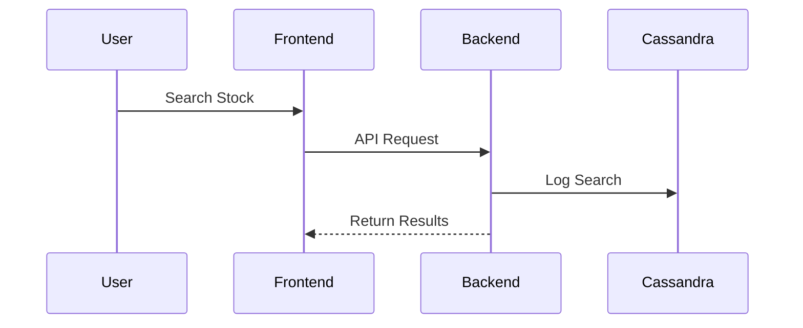
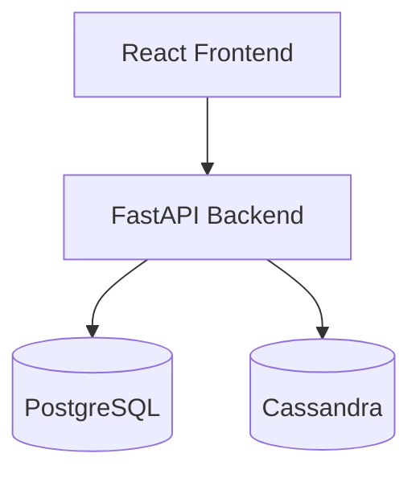
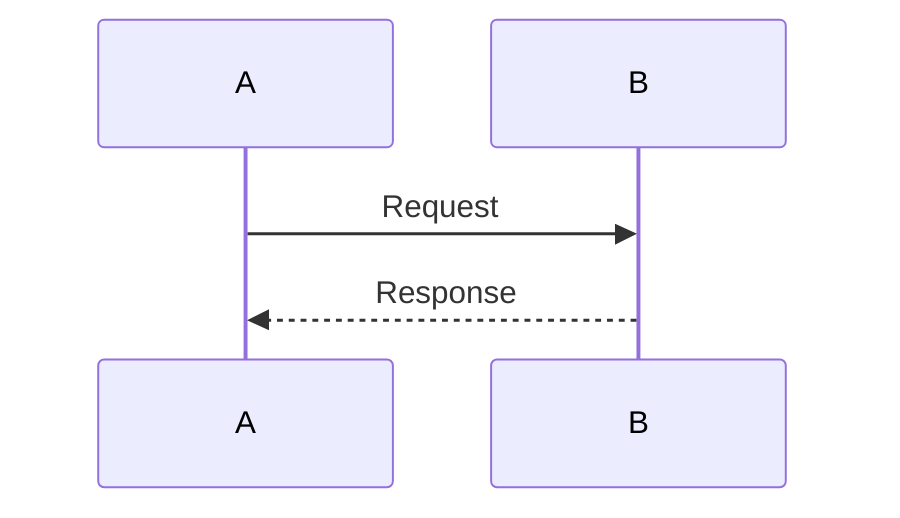
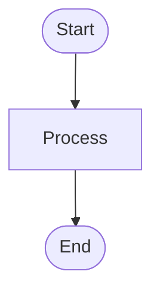
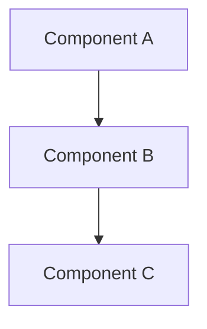

# Quick Start: Using Architecture Diagrams in PRs

## Step 1: Add Diagrams to Your PR Description

When creating a pull request, use the PR template (`.github/PULL_REQUEST_TEMPLATE.md`) which includes sections for architecture diagrams.

### Example PR Description:

```markdown
## Architecture Overview

### Sequence Diagram


### Architecture Diagram

```

## Step 2: Create New Diagrams

1. Create a `.mmd` file in `docs/architecture/`:

```bash
touch docs/architecture/my-feature-sequence.mmd
```

2. Write your Mermaid diagram:



3. Reference it in your PR or documentation.

## Step 3: Automatic Generation

The GitHub Action (`.github/workflows/generate-diagrams.yml`) will:
- ✅ Automatically generate PNG/SVG images from `.mmd` files
- ✅ Post diagrams as comments on your PR
- ✅ Commit generated images to the repository

## Step 4: View Diagrams

- **On GitHub**: Diagrams render automatically in markdown
- **In VS Code**: Install "Markdown Preview Mermaid Support" extension
- **Online**: Use [Mermaid Live Editor](https://mermaid.live/) to test

## Common Diagram Types

### Sequence Diagram


### Flowchart


### Architecture Diagram


## Tips

1. **Keep it simple**: Focus on the key interactions
2. **Use colors**: Style important components
3. **Add notes**: Use `Note over` for explanations
4. **Update diagrams**: Keep them in sync with code changes

## Need Help?

- [Mermaid Documentation](https://mermaid.js.org/)
- [Mermaid Live Editor](https://mermaid.live/)
- See `docs/architecture/README.md` for more details

