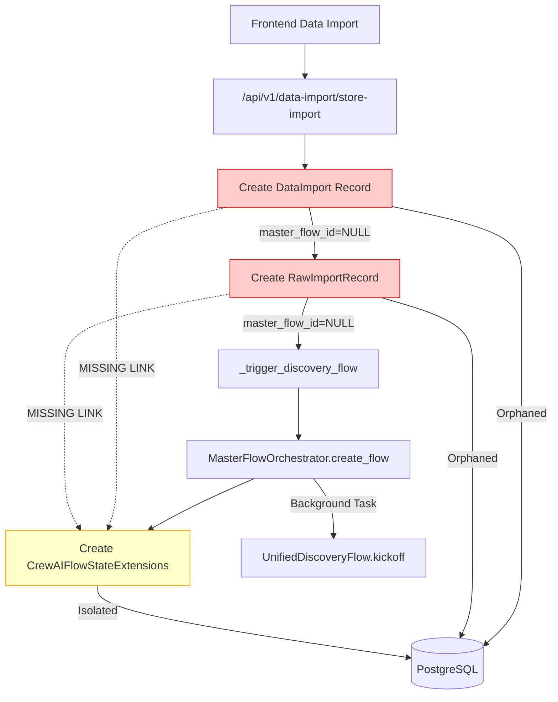
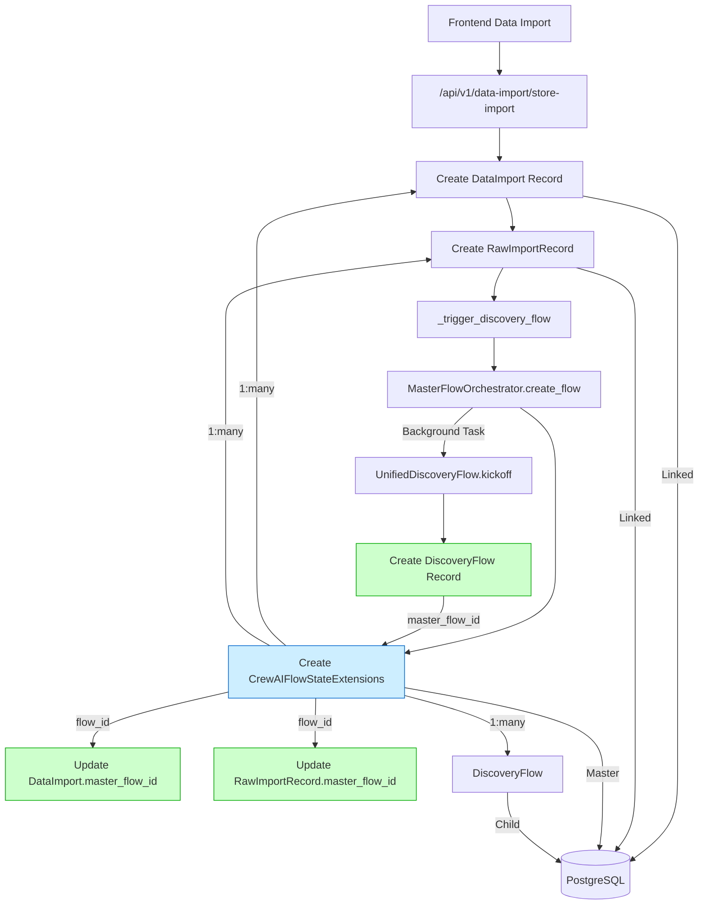

# Discovery Flow Data Architecture Analysis - Database Data Integrity Issues

## Executive Summary

**Critical Finding**: The existing Data Flow Diagram (DFD) documentation claims "100% Accuracy" but does NOT match the actual database state. There are serious data integrity issues with missing master_flow_id foreign key relationships across multiple tables.

**Database Evidence**: 
- `data_imports` table: ALL master_flow_id values are NULL
- `raw_import_records` table: ALL master_flow_id values are NULL  
- `discovery_flows` table: Many master_flow_id values are NULL
- `crewai_flow_state_extensions` table: Has the best data consistency but is not properly linked to child tables

## Root Cause Analysis

### 1. **Missing Foreign Key Population in Data Import Flow**

The data import process creates `DataImport` records but fails to set the `master_flow_id` field:

```python
# In DataImport model (data_import/core.py:38)
master_flow_id = Column(UUID(as_uuid=True), ForeignKey("crewai_flow_state_extensions.id", ondelete="CASCADE"), nullable=True)

# In RawImportRecord model (data_import/core.py:96)  
master_flow_id = Column(UUID(as_uuid=True), ForeignKey("crewai_flow_state_extensions.id"), nullable=True)
```

**Problem**: These fields are defined but never populated during the data import process.

### 2. **Disconnected Flow Creation Process**

The `_trigger_discovery_flow` function in `import_storage_handler.py` creates a master flow via `MasterFlowOrchestrator` but doesn't link the originating `DataImport` record back to it:

```python
# Creates master flow record in crewai_flow_state_extensions
flow_result = await orchestrator.create_flow(
    flow_type="discovery",
    flow_name=f"Discovery Import {data_import_id}",
    # ... but master_flow_id not set on DataImport
)
```

### 3. **Inconsistent Child Flow Registration**

The `DiscoveryFlow` model has a `master_flow_id` field but it's not consistently populated:

```python
# In DiscoveryFlow model (discovery_flow.py:26)
master_flow_id = Column(UUID(as_uuid=True), nullable=True, index=True)
```

## Current vs Intended Data Flow

### Current Reality (Broken)



### Intended Data Flow (Fixed)



## Detailed Database Model Issues

### 1. **DataImport Model Issues**

**File**: `backend/app/models/data_import/core.py`

**Problems**:
- `master_flow_id` field exists but is never populated
- No relationship mapping to `CrewAIFlowStateExtensions`
- Import process creates orphaned records

**Current Code**:
```python
class DataImport(Base):
    master_flow_id = Column(UUID(as_uuid=True), ForeignKey("crewai_flow_state_extensions.id", ondelete="CASCADE"), nullable=True)
    # No relationship defined to CrewAIFlowStateExtensions
```

**Required Fix**:
```python
class DataImport(Base):
    master_flow_id = Column(UUID(as_uuid=True), ForeignKey("crewai_flow_state_extensions.flow_id", ondelete="CASCADE"), nullable=True)
    
    # Add relationship
    master_flow = relationship("CrewAIFlowStateExtensions", foreign_keys=[master_flow_id])
```

### 2. **RawImportRecord Model Issues**

**File**: `backend/app/models/data_import/core.py`

**Problems**:
- `master_flow_id` field exists but is never populated  
- No relationship mapping to master flow
- Records become orphaned

**Current Code**:
```python
class RawImportRecord(Base):
    master_flow_id = Column(UUID(as_uuid=True), ForeignKey("crewai_flow_state_extensions.id"), nullable=True)
    # No relationship defined
```

**Required Fix**:
```python
class RawImportRecord(Base):
    master_flow_id = Column(UUID(as_uuid=True), ForeignKey("crewai_flow_state_extensions.flow_id"), nullable=True)
    
    # Add relationship
    master_flow = relationship("CrewAIFlowStateExtensions", foreign_keys=[master_flow_id])
```

### 3. **DiscoveryFlow Model Issues**

**File**: `backend/app/models/discovery_flow.py`

**Problems**:
- `master_flow_id` field exists but inconsistently populated
- No clear relationship to master flow orchestration

**Current Code**:
```python
class DiscoveryFlow(Base):
    master_flow_id = Column(UUID(as_uuid=True), nullable=True, index=True)
    # No explicit relationship to CrewAIFlowStateExtensions
```

**Required Fix**:
```python
class DiscoveryFlow(Base):
    master_flow_id = Column(UUID(as_uuid=True), ForeignKey("crewai_flow_state_extensions.flow_id"), nullable=False, index=True)
    
    # Add relationship
    master_flow = relationship("CrewAIFlowStateExtensions", foreign_keys=[master_flow_id])
```

## Process Flow Issues

### 1. **Data Import Handler Gap**

**File**: `backend/app/api/v1/endpoints/data_import/handlers/import_storage_handler.py`

**Problem**: The `_trigger_discovery_flow` function creates a master flow but doesn't link the data import back to it.

**Current Code**:
```python
async def _trigger_discovery_flow(...) -> Optional[str]:
    # Creates master flow
    flow_result = await orchestrator.create_flow(
        flow_type="discovery",
        flow_name=f"Discovery Import {data_import_id}",
        # ... configuration
    )
    
    # Returns flow_id but doesn't update DataImport.master_flow_id
    return flow_id
```

**Required Fix**:
```python
async def _trigger_discovery_flow(...) -> Optional[str]:
    # Create master flow
    flow_id, flow_details = await orchestrator.create_flow(...)
    
    # UPDATE: Link data import to master flow
    from app.models.data_import.core import DataImport
    data_import_uuid = uuid.UUID(data_import_id)
    
    async with AsyncSessionLocal() as db:
        # Update data import with master flow ID
        await db.execute(
            update(DataImport)
            .where(DataImport.id == data_import_uuid)
            .values(master_flow_id=uuid.UUID(flow_id))
        )
        
        # Update all raw import records with master flow ID  
        await db.execute(
            update(RawImportRecord)
            .where(RawImportRecord.data_import_id == data_import_uuid)
            .values(master_flow_id=uuid.UUID(flow_id))
        )
        
        await db.commit()
    
    return flow_id
```

### 2. **Master Flow Orchestrator Gap**

**File**: `backend/app/services/master_flow_orchestrator.py`

**Problem**: The orchestrator creates flows but doesn't ensure child table relationships are established.

**Current Issue**: Discovery flows are created via background tasks without proper linkage to the master flow record.

## Database Relationship Mapping

### Current Broken State

```sql
-- crewai_flow_state_extensions (Master table)
SELECT flow_id, flow_type, flow_status FROM crewai_flow_state_extensions;
-- ✅ Has data with proper flow_id values

-- data_imports (Child table) 
SELECT id, master_flow_id, import_name FROM data_imports;
-- ❌ ALL master_flow_id values are NULL

-- raw_import_records (Child table)
SELECT id, master_flow_id, data_import_id FROM raw_import_records;  
-- ❌ ALL master_flow_id values are NULL

-- discovery_flows (Child table)
SELECT flow_id, master_flow_id, flow_name FROM discovery_flows;
-- ⚠️ MIXED - Some master_flow_id values are NULL
```

### Intended Fixed State

```sql
-- Proper foreign key relationships
SELECT 
    cfe.flow_id,
    cfe.flow_type,
    di.import_name,
    df.flow_name
FROM crewai_flow_state_extensions cfe
LEFT JOIN data_imports di ON di.master_flow_id = cfe.flow_id
LEFT JOIN discovery_flows df ON df.master_flow_id = cfe.flow_id
WHERE cfe.flow_type = 'discovery';

-- Should show linked records across all tables
```

## Implementation Plan

### Priority 1: Database Schema Fixes (Critical)

1. **Add Proper Foreign Key Constraints**
   ```sql
   -- Fix foreign key references to point to flow_id not id
   ALTER TABLE data_imports 
   DROP CONSTRAINT IF EXISTS data_imports_master_flow_id_fkey;
   
   ALTER TABLE data_imports 
   ADD CONSTRAINT data_imports_master_flow_id_fkey 
   FOREIGN KEY (master_flow_id) REFERENCES crewai_flow_state_extensions(flow_id);
   ```

2. **Add Missing Relationships in Models**
   - Update `DataImport` model with master flow relationship
   - Update `RawImportRecord` model with master flow relationship  
   - Update `DiscoveryFlow` model with proper master flow constraint

### Priority 2: Process Flow Fixes (High)

1. **Fix Data Import Handler**
   - Update `_trigger_discovery_flow` to link data import records back to master flow
   - Add transaction safety for multi-table updates

2. **Fix Master Flow Orchestrator**
   - Ensure discovery flow creation properly links to master flow
   - Add validation for required foreign key relationships

### Priority 3: Data Migration (Medium)

1. **Backfill Missing Relationships**
   ```sql
   -- Find orphaned data imports and try to link them to existing flows
   UPDATE data_imports 
   SET master_flow_id = (
       SELECT flow_id FROM crewai_flow_state_extensions 
       WHERE flow_type = 'discovery' 
       AND created_at >= data_imports.created_at - INTERVAL '1 hour'
       AND created_at <= data_imports.created_at + INTERVAL '1 hour'
       LIMIT 1
   )
   WHERE master_flow_id IS NULL;
   ```

### Priority 4: API Consistency (Low)

1. **Update API Responses**
   - Ensure all flow status APIs return proper master flow relationships
   - Add master flow context to data import APIs

## Testing Strategy

### 1. **End-to-End Data Flow Test**

```python
async def test_data_import_flow_linkage():
    # 1. Upload data file
    response = await client.post("/api/v1/data-import/store-import", ...)
    
    # 2. Verify DataImport created with master_flow_id
    data_import = await db.get(DataImport, response.data_import_id)
    assert data_import.master_flow_id is not None
    
    # 3. Verify RawImportRecord linked to same master flow
    raw_records = await db.execute(
        select(RawImportRecord).where(RawImportRecord.data_import_id == data_import.id)
    )
    for record in raw_records.scalars():
        assert record.master_flow_id == data_import.master_flow_id
    
    # 4. Verify DiscoveryFlow created and linked
    discovery_flow = await db.execute(
        select(DiscoveryFlow).where(DiscoveryFlow.master_flow_id == data_import.master_flow_id)
    )
    assert discovery_flow.scalar_one_or_none() is not None
```

### 2. **Database Constraint Test**

```sql
-- Test foreign key constraints work
INSERT INTO data_imports (master_flow_id) VALUES ('invalid-uuid');
-- Should fail with foreign key violation
```

## Success Criteria

1. **✅ Zero NULL master_flow_id values** in production database
2. **✅ All foreign key constraints** properly enforced
3. **✅ End-to-end data flow** from import to discovery completion
4. **✅ Proper CASCADE deletion** when master flows are deleted
5. **✅ API consistency** showing linked data across all endpoints

## Impact Assessment

### Immediate Impact
- **Data Integrity**: Fixes orphaned records and broken relationships
- **Flow Management**: Enables proper flow deletion and status tracking
- **User Experience**: Resolves flow state inconsistencies

### Long-term Benefits  
- **Scalability**: Proper relationships enable efficient queries
- **Maintainability**: Clear data model reduces confusion
- **Reliability**: Foreign key constraints prevent data corruption

## Conclusion

The current "100% accurate" DFD claim is **false**. The database reveals significant data integrity issues with missing foreign key relationships. The fixes outlined above will establish proper data flow from import → master flow → discovery flow with full referential integrity.

**Estimated Fix Time**: 1-2 weeks
- Schema fixes: 2-3 days
- Process fixes: 3-5 days  
- Data migration: 2-3 days
- Testing: 2-4 days

This analysis reveals why users experience flow state inconsistencies and why flow management operations fail - the underlying data relationships are broken and need systematic repair.