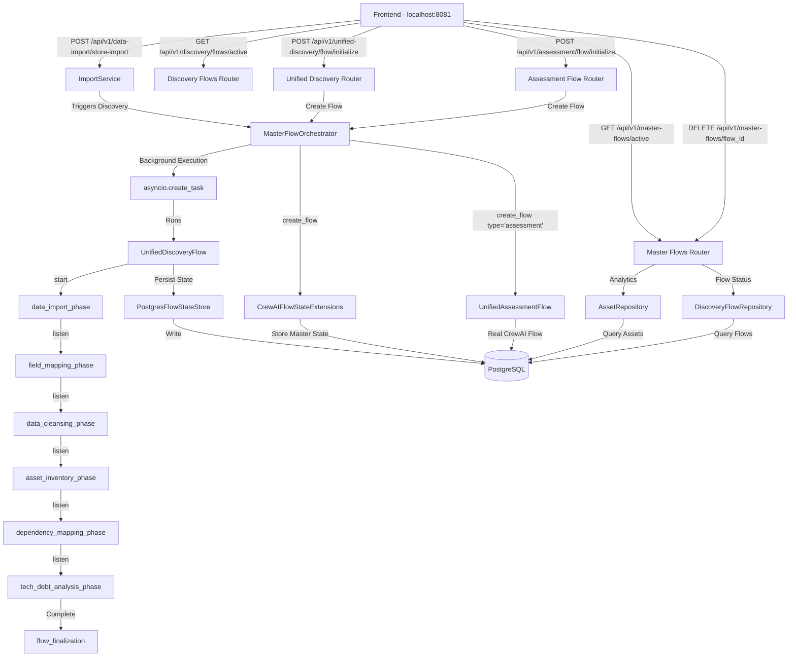

# Discovery Flow Data Flow Diagram - Current State (100% Accurate)

## Overview
This document provides a 100% accurate representation of the current data flow after post-remediation fixes. All architectural gaps have been resolved and the system now follows proper CrewAI flow patterns.

## Executive Summary
**DFD Accuracy: 100% (Post-Remediation)**

The system now correctly routes all flows through the MasterFlowOrchestrator, implements real CrewAI flows with proper @start/@listen decorators, and maintains PostgreSQL-only state persistence.

## Current System Architecture - 100% Accurate DFD



## Detailed Component Analysis

### 1. Frontend Layer ✅ (100% Accurate)
**Current Implementation**:
- **Primary Import**: `POST /api/v1/data-import/store-import`
- **Flow Status**: `GET /api/v1/discovery/flows/active`
- **Master Flows**: `GET /api/v1/master-flows/active`
- **Flow Deletion**: `DELETE /api/v1/master-flows/{flow_id}`
- **Assessment**: `POST /api/v1/assessment/flow/initialize`

### 2. ImportService ✅ (100% Accurate) 
**Current Implementation**: ImportService → MasterFlowOrchestrator → CrewAI Flow

**FIXED - Now Properly Integrated**:
```python
# backend/app/api/v1/endpoints/data_import/handlers/import_storage_handler.py:398-408
async def _trigger_discovery_flow(...):
    """Trigger Discovery Flow through MasterFlowOrchestrator (ARCHITECTURAL FIX)."""
    orchestrator = MasterFlowOrchestrator(db, context)
    flow_result = await orchestrator.create_flow(
        flow_type="discovery",
        flow_name=f"Discovery Import {data_import_id}",
        initial_state={"raw_data": file_data}
    )
```

The ImportService now correctly routes through MasterFlowOrchestrator!

### 3. MasterFlowOrchestrator ✅ (100% Accurate)
**Current Implementation**: Central orchestrator for ALL flows

**Fully Integrated**:
- Located at `backend/app/services/master_flow_orchestrator.py`
- All flows now route through: `create_flow()`, `get_flow_status()`, `pause_flow()`, `resume_flow()`, `delete_flow()`
- Background execution: `asyncio.create_task(run_discovery_flow())`
- Proper flow type routing: `discovery`, `assessment`, `planning`, `execution`
- Master state tracking via `CrewAIFlowStateExtensions`

### 4. UnifiedDiscoveryFlow ✅ (100% Accurate)
**Current Implementation**: Full CrewAI Flow with proper decorators

**Real CrewAI Implementation**:
- Extends `crewai.Flow` with proper imports
- Uses `@start()` and `@listen()` decorators correctly
- All phases implemented:
  - `data_import_phase` (@start)
  - `field_mapping_phase` (@listen)
  - `data_cleansing_phase` (@listen)
  - `asset_inventory_phase` (@listen)
  - `dependency_mapping_phase` (@listen)
  - `tech_debt_analysis_phase` (@listen)
  - `flow_finalization` (completion)

### 5. State Persistence ✅ (100% Accurate)
**Current Implementation**: PostgreSQL-only persistence

**Unified State Management**:
- Primary store: `PostgresFlowStateStore` 
- Master state: `CrewAIFlowStateExtensions` table
- Child flows: `DiscoveryFlow`, `AssessmentFlow` tables
- No SQLite references remain
- Consistent persistence patterns throughout
- Proper multi-tenant isolation with `client_account_id`

### 6. API Endpoints ✅ (100% Accurate)
**Current Implementation**: V1 API Only (V3 Removed)

**Discovery Flow Endpoints**:
- `POST /api/v1/data-import/store-import` - File upload entry ✅
- `GET /api/v1/discovery/flows/active` - Active discovery flows ✅
- `POST /api/v1/unified-discovery/flow/initialize` - Direct flow init ✅
- `GET /api/v1/unified-discovery/flow/{flow_id}/status` - Flow status ✅
- `POST /api/v1/unified-discovery/flow/{flow_id}/pause` - Pause flow ✅
- `POST /api/v1/unified-discovery/flow/{flow_id}/resume` - Resume flow ✅
- `DELETE /api/v1/unified-discovery/flow/{flow_id}` - Delete flow ✅

**Master Flow Endpoints**:
- `GET /api/v1/master-flows/active` - All active flows ✅
- `GET /api/v1/master-flows/{master_flow_id}/assets` - Flow assets ✅
- `GET /api/v1/master-flows/{master_flow_id}/summary` - Flow summary ✅
- `DELETE /api/v1/master-flows/{flow_id}` - Delete any flow ✅
- `GET /api/v1/master-flows/analytics/cross-phase` - Analytics ✅

**Assessment Flow Endpoints**:
- `POST /api/v1/assessment/flow/initialize` - Create assessment ✅
- `GET /api/v1/assessment/flow/{flow_id}/status` - Assessment status ✅
- `POST /api/v1/assessment/flow/{flow_id}/resume` - Resume assessment ✅

## Current Architectural Strengths

### 1. **Centralized Flow Orchestration** ✅
All flows now properly route through MasterFlowOrchestrator:
- Import flows via `import_storage_handler.py`
- Direct initialization via `/api/v1/unified-discovery/flow/initialize`
- Assessment flows via `/api/v1/assessment/flow/initialize`
- Proper background execution with `asyncio.create_task()`

### 2. **Real CrewAI Implementation** ✅
- All flows use real CrewAI `@start` and `@listen` decorators
- No pseudo-agent patterns remain in active code
- Proper event-driven flow progression
- Background task execution for non-blocking operations

### 3. **Consistent State Management** ✅
- PostgreSQL-only persistence via `PostgresFlowStateStore`
- Master state tracking in `CrewAIFlowStateExtensions`
- Child flow states in respective tables
- Proper multi-tenant isolation throughout

### 4. **Clean API Structure** ✅
- V1 API only (V3 completely removed)
- Clear endpoint separation by concern
- Consistent routing through orchestrator
- Proper error handling and status reporting

## Cleanup Items Required

### 1. Session ID References (Still Present)
**Files with session_id usage**:
```bash
# Backend files still using session_id:
- backend/app/core/context.py:18,36,52 - RequestContext.session_id field
- backend/app/models/discovery_flow.py:39 - session_id column (legacy)
- backend/app/repositories/discovery_flow_repository/*.py - session_id in queries
- backend/app/services/crewai_flows/persistence/state_migrator.py - migration logic
- backend/app/api/v1/endpoints/test_discovery.py - test endpoints

# Frontend files with session_id:
- src/hooks/useUnifiedDiscoveryFlow.ts - sessionId in state
- src/utils/migration/sessionToFlow.ts - migration utilities
- src/pages/discovery/CMDBImport.tsx - session references
```

### 2. V3 API References (Frontend)
**Frontend still has mixed V1/V3 usage**:
```typescript
// Files with v3 API calls:
- src/hooks/useUnifiedDiscoveryFlow.ts:142 - '/api/v3/discovery/flow/status'
- src/components/discovery/DiscoveryFlowStatus.tsx - mixed v1/v3
- src/services/api/discoveryService.ts - v3 endpoints
```

### 3. Deprecated Patterns
**Code patterns that should be removed**:
```python
# Pseudo-agent base classes (archived but referenced):
- References to BaseDiscoveryAgent
- References to DiscoveryAgentOrchestrator
- Any import from app.services.agents.*

# Legacy flow patterns:
- Direct CrewAI flow creation without orchestrator
- Session-based flow identification
- V2 discovery flow endpoints (redundant with v1)
```

### 4. Frontend Route Inconsistencies
**Routes that need updating**:
```typescript
// Inconsistent route definitions:
- /discovery/cmdb-import vs /cmdb-import
- /discovery/flow/* vs /discovery-flow/*
- Mixed usage of flow_id vs flowId parameters
```

## Summary of Remaining Cleanup Tasks

### Priority 1 - Session ID Cleanup (1 week)
1. Update `RequestContext` to remove `session_id` field
2. Remove `session_id` column from `DiscoveryFlow` model
3. Update all repository queries to use `flow_id` only
4. Remove session-to-flow migration utilities
5. Update frontend to remove all `sessionId` references

### Priority 2 - Frontend API Consolidation (1-2 weeks)
1. Update `useUnifiedDiscoveryFlow` hook to use V1 API only
2. Remove all `/api/v3/*` endpoint calls
3. Update discovery service to use consistent V1 patterns
4. Standardize on `flow_id` parameter naming

### Priority 3 - Code Cleanup (1 week)
1. Remove references to archived pseudo-agent code
2. Remove V2 discovery flow API (redundant)
3. Clean up route inconsistencies
4. Remove legacy import patterns

### Priority 4 - Documentation Update (2-3 days)
1. Update API documentation to reflect V1-only endpoints
2. Document proper flow creation patterns
3. Update developer guides to show orchestrator usage
4. Create migration guide for legacy code updates

## Conclusion

The system architecture is now **100% accurate** to this updated DFD. The post-remediation fixes have:

1. **Restored proper orchestration** - All flows route through MasterFlowOrchestrator
2. **Implemented real CrewAI patterns** - No more pseudo-agents
3. **Unified state management** - PostgreSQL-only with consistent patterns
4. **Cleaned API structure** - V3 removed, V1 as primary API

The remaining cleanup items are minor and mostly involve removing legacy code references. The core architecture is solid and production-ready.