# Discovery Flow Data Architecture Diagram

## Overview
This document illustrates the complete data flow from file upload to asset inventory with dependencies, showing how the Master Flow Orchestrator coordinates with various components.

## Data Flow Diagram

```mermaid
graph TB
    %% User Interface Layer
    subgraph "Frontend (React)"
        UI[User Interface]
        Upload[CMDBImport Component]
        Blocker[UploadBlocker]
        Mapping[AttributeMapping Page]
        Cleansing[DataCleansing Page]
        Inventory[AssetInventory Page]
        Dependencies[DependencyAnalysis Page]
    end

    %% API Gateway Layer
    subgraph "API Layer (FastAPI)"
        Gateway[API Gateway]
        Auth[Auth Middleware]
        Context[Context Middleware]
        CORS[CORS Middleware]
    end

    %% Master Flow Orchestrator
    subgraph "Master Flow Orchestrator"
        MFO[MasterFlowOrchestrator]
        Registry[FlowTypeRegistry]
        StateManager[StateManager]
        PhaseValidator[PhaseValidator]
        
        MFO --> Registry
        MFO --> StateManager
        MFO --> PhaseValidator
    end

    %% Discovery Flow Components
    subgraph "Discovery Flow Layer"
        UDF[UnifiedDiscoveryFlow]
        FlowBridge[FlowStateBridge]
        
        subgraph "Phase Executors"
            ImportExec[DataImportExecutor]
            MappingExec[FieldMappingExecutor]
            CleansingExec[DataCleansingExecutor]
            InventoryExec[AssetInventoryExecutor]
            DependencyExec[DependencyAnalysisExecutor]
            TechDebtExec[TechDebtExecutor]
        end
    end

    %% CrewAI Integration
    subgraph "CrewAI Layer"
        CrewAI[CrewAI Flow Engine]
        
        subgraph "Agents (Future)"
            ImportAgent[Data Import Agent]
            MappingAgent[Field Mapping Agent]
            CleansingAgent[Data Cleansing Agent]
            InventoryAgent[Asset Inventory Agent]
            DependencyAgent[Dependency Agent]
        end
    end

    %% Data Storage
    subgraph "Data Persistence"
        subgraph "PostgreSQL"
            DiscoveryFlows[discovery_flows table]
            CrewAIExt[crewai_flow_state_extensions]
            DataImports[data_imports table]
            Assets[assets table]
            AppDeps[application_dependencies]
        end
        
        subgraph "State Storage"
            PostgresStore[PostgresFlowStore]
            StateRecovery[StateRecovery]
        end
    end

    %% Services Layer
    subgraph "Service Layer"
        FlowService[CrewAIFlowService]
        ImportService[DataImportService]
        AssetService[AssetService]
        DependencyService[DependencyAnalysisService]
    end

    %% Data Flow Paths
    UI -->|1. Upload File| Upload
    Upload -->|2. Check Incomplete Flows| Blocker
    Blocker -->|3. If Clear| Gateway
    
    Gateway --> Auth
    Auth --> Context
    Context --> CORS
    
    CORS -->|4. /api/v1/data-import/upload| ImportService
    ImportService -->|5. Store File| DataImports
    
    ImportService -->|6. Create Flow| MFO
    MFO -->|7. Initialize| UDF
    UDF -->|8. Create State| FlowBridge
    FlowBridge -->|9. Persist| PostgresStore
    PostgresStore --> DiscoveryFlows
    PostgresStore --> CrewAIExt
    
    %% Phase 1: Data Import
    MFO -->|10. Execute Phase| ImportExec
    ImportExec -->|11. Validate Data| ImportAgent
    ImportExec -->|12. Update State| StateManager
    StateManager -->|13. Persist| PostgresStore
    
    %% Phase 2: Field Mapping
    UI -->|14. Navigate to Mapping| Mapping
    Mapping -->|15. Get Mappings| MFO
    MFO -->|16. Execute| MappingExec
    MappingExec -->|17. Generate Mappings| MappingAgent
    MappingExec -->|18. Await Approval| StateManager
    
    %% Phase 3: Data Cleansing
    UI -->|19. Approve & Continue| Cleansing
    Cleansing -->|20. Get Quality Issues| MFO
    MFO -->|21. Execute| CleansingExec
    CleansingExec -->|22. Clean Data| CleansingAgent
    CleansingExec -->|23. Store Clean Data| Assets
    
    %% Phase 4: Asset Inventory
    UI -->|24. Continue| Inventory
    Inventory -->|25. Get Assets| MFO
    MFO -->|26. Execute| InventoryExec
    InventoryExec -->|27. Build Inventory| InventoryAgent
    InventoryExec -->|28. Categorize Assets| AssetService
    AssetService -->|29. Store| Assets
    
    %% Phase 5: Dependency Analysis
    UI -->|30. Continue| Dependencies
    Dependencies -->|31. Get Dependencies| MFO
    MFO -->|32. Execute| DependencyExec
    DependencyExec -->|33. Analyze| DependencyAgent
    DependencyExec -->|34. Map Dependencies| DependencyService
    DependencyService -->|35. Store| AppDeps
    
    %% Phase 6: Tech Debt (Final)
    MFO -->|36. Execute Final| TechDebtExec
    TechDebtExec -->|37. Complete Flow| StateManager
    StateManager -->|38. Mark Complete| PostgresStore
    
    %% Assessment Flow Transition
    MFO -->|39. Ready for Assessment| Registry
    Registry -->|40. Create Assessment Flow| MFO

    %% Style
    classDef frontend fill:#e1f5fe,stroke:#01579b,stroke-width:2px
    classDef api fill:#fff3e0,stroke:#e65100,stroke-width:2px
    classDef orchestrator fill:#f3e5f5,stroke:#4a148c,stroke-width:3px
    classDef flow fill:#e8f5e9,stroke:#1b5e20,stroke-width:2px
    classDef crewai fill:#fce4ec,stroke:#880e4f,stroke-width:2px
    classDef storage fill:#f5f5f5,stroke:#424242,stroke-width:2px
    classDef service fill:#e3f2fd,stroke:#0d47a1,stroke-width:2px
    
    class UI,Upload,Blocker,Mapping,Cleansing,Inventory,Dependencies frontend
    class Gateway,Auth,Context,CORS api
    class MFO,Registry,StateManager,PhaseValidator orchestrator
    class UDF,FlowBridge,ImportExec,MappingExec,CleansingExec,InventoryExec,DependencyExec,TechDebtExec flow
    class CrewAI,ImportAgent,MappingAgent,CleansingAgent,InventoryAgent,DependencyAgent crewai
    class DiscoveryFlows,CrewAIExt,DataImports,Assets,AppDeps,PostgresStore,StateRecovery storage
    class FlowService,ImportService,AssetService,DependencyService service
```

## Component Responsibilities

### 1. Frontend Layer
- **CMDBImport**: Handles file upload UI
- **UploadBlocker**: Prevents concurrent flows
- **Phase Pages**: Display phase-specific UI (Mapping, Cleansing, Inventory, Dependencies)

### 2. API Gateway Layer
- **Auth Middleware**: Validates user authentication
- **Context Middleware**: Enforces multi-tenant isolation
- **CORS Middleware**: Handles cross-origin requests

### 3. Master Flow Orchestrator (THE Controller)
- **MasterFlowOrchestrator**: Single source of truth for all flow orchestration
- **FlowTypeRegistry**: Manages flow type configurations
- **StateManager**: Handles flow state transitions
- **PhaseValidator**: Validates phase prerequisites

### 4. Discovery Flow Components
- **UnifiedDiscoveryFlow**: CrewAI Flow implementation
- **FlowStateBridge**: Bridges CrewAI state with our state model
- **Phase Executors**: Handle phase-specific logic

### 5. CrewAI Integration
- **CrewAI Flow Engine**: Manages @start/@listen decorators
- **Agents**: Future implementation for intelligent processing

### 6. Data Persistence
- **PostgreSQL Tables**:
  - `discovery_flows`: Flow metadata and status
  - `crewai_flow_state_extensions`: Master flow coordination
  - `data_imports`: Uploaded file storage
  - `assets`: Cleaned and processed assets
  - `application_dependencies`: Dependency mappings

### 7. Service Layer
- **CrewAIFlowService**: Flow-specific operations
- **DataImportService**: File handling
- **AssetService**: Asset management
- **DependencyAnalysisService**: Dependency detection

## Data Flow Steps

### Upload Phase (Steps 1-9)
1. User uploads file through UI
2. UploadBlocker checks for incomplete flows
3. If clear, request goes through API gateway
4. Middlewares validate auth, context, and CORS
5. DataImportService stores file
6. MFO creates new discovery flow
7. UnifiedDiscoveryFlow initializes
8. FlowStateBridge creates state
9. PostgresStore persists to both tables

### Processing Phases (Steps 10-38)
Each phase follows similar pattern:
- MFO executes phase through executor
- Executor uses agent (future) or logic
- State updates are persisted
- UI navigates to next phase
- User interactions update flow state

### Completion (Steps 39-40)
- Flow marked complete in both tables
- Assets and dependencies ready
- MFO can create Assessment flow

## Key Design Decisions

### 1. Master Flow Orchestrator as Single Controller
- Eliminates competing controllers
- Provides consistent state management
- Enables cross-flow coordination

### 2. Dual Table State Storage
- `discovery_flows`: Discovery-specific data
- `crewai_flow_state_extensions`: Master coordination

### 3. Phase-Based Execution
- Each phase has dedicated executor
- Clear separation of concerns
- Enables partial completion

### 4. Multi-Tenant Isolation
- Context middleware enforces boundaries
- All queries filtered by tenant IDs
- No cross-tenant data leakage

## Current Issues & Solutions

### Issue: Navigation Loop
- **Cause**: State mismatch between tables
- **Solution**: Synchronize state updates

### Issue: Competing Controllers
- **Cause**: Multiple flow managers
- **Solution**: MFO as single orchestrator

### Issue: Phase Prerequisites
- **Cause**: No validation before phase execution
- **Solution**: PhaseValidator component

## Future Enhancements

### 1. Real CrewAI Agents
Replace executors with intelligent agents:
- Data quality assessment
- Automatic field mapping
- Intelligent data cleansing
- Smart dependency detection

### 2. Event-Driven Architecture
- Publish phase completion events
- Enable real-time UI updates
- Support webhooks

### 3. Parallel Processing
- Process large files in chunks
- Parallel dependency analysis
- Concurrent asset categorization

### 4. Enhanced State Management
- State snapshots for rollback
- Audit trail for all changes
- Performance metrics tracking