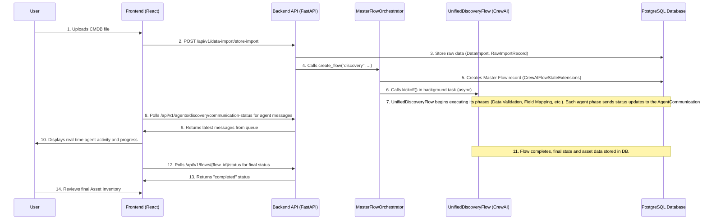

# Discovery Flow Deep Dive: From UI Click to Asset Inventory

This document provides a comprehensive, low-level walkthrough of the entire Discovery Flow, tracing the journey from a user's file upload in the UI to the final, agent-analyzed asset inventory. It details the interactions between the frontend, the backend API, the Master Flow Orchestrator, and the individual CrewAI agents.

## High-Level Data Flow Diagram (DFD)

**Architectural Note on Real-Time Communication:** The original design for this flow utilized WebSockets for real-time communication. However, due to deployment constraints and to ensure maximum compatibility with Vercel and Railway hosting environments, the system was intentionally refactored to use a more resilient HTTP polling architecture. Agents publish status messages to an in-memory queue on the backend, and the frontend polls a dedicated endpoint (`/api/v1/agents/discovery/communication-status`) to retrieve these messages.

## Detailed Step-by-Step Walkthrough

### Part 1: Flow Initiation (Frontend to API)

1.  **UI File Upload**: The user navigates to the CMDB Import page (`src/pages/discovery/CMDBImport/index.tsx`). They select a CSV file and a category. The `handleFileUpload` function within the `useFileUpload.ts` hook is triggered.

2.  **API Call to Store Data**:
    *   The `handleFileUpload` function calls `storeImportData`.
    *   `storeImportData` makes a `POST` request to the `/api/v1/data-import/store-import` endpoint.
    *   **File:** `src/pages/discovery/CMDBImport/hooks/useFileUpload.ts`
    *   **Payload:** The request body contains the parsed CSV data (`file_data`), file metadata, and the current user context (client and engagement IDs).

### Part 2: Backend Data Ingestion and Flow Creation

3.  **API Endpoint Handling**:
    *   The request is handled by the `store_import_data` function in the backend.
    *   **File:** `backend/app/api/v1/endpoints/data_import/handlers/import_storage_handler.py`
    *   **Action:** This function saves the uploaded data into the `DataImport` and `RawImportRecord` tables in the PostgreSQL database.

4.  **Triggering the Orchestrator**:
    *   After successfully saving the data, `store_import_data` calls the internal function `_trigger_discovery_flow`.
    *   `_trigger_discovery_flow` is the bridge to the agentic system. It calls `MasterFlowOrchestrator.create_flow`.
    *   **File:** `backend/app/api/v1/endpoints/data_import/handlers/import_storage_handler.py`

5.  **Master Flow Orchestrator Creates the Flow**:
    *   The `create_flow` method in the `MasterFlowOrchestrator` is executed.
    *   **File:** `backend/app/services/master_flow_orchestrator.py`
    *   **Actions**:
        1.  It creates a master record for the flow in the `crewai_flow_state_extensions` table, acting as the single source of truth for this flow's existence and high-level state.
        2.  It identifies the `flow_type` as "discovery".

6.  **Background Execution Kickoff**:
    *   Inside `create_flow`, because the type is "discovery", it immediately proceeds to instantiate the `UnifiedDiscoveryFlow`.
    *   It wraps the call to the flow's `kickoff()` method in a local async function (`run_discovery_flow`).
    *   It uses `asyncio.create_task()` to start `run_discovery_flow` as a non-blocking background task.
    *   The `create_flow` method then returns the new `flow_id` to the frontend, which begins polling for status updates.

### Part 3: The Agentic Discovery Flow (CrewAI)

The `kickoff()` method starts the `UnifiedDiscoveryFlow`, which is a sequence of methods connected by `@start` and `@listen` decorators.

**File:** `backend/app/services/crewai_flows/unified_discovery_flow/base_flow.py`

7.  **`@start` -> `initialize_discovery`**: The flow begins. It loads its state, associating the raw data from the initial upload with this flow instance.

8.  **`@listen` -> `execute_data_import_validation_agent`**: The `DataValidationPhase` runs, using the **Data Validation Agent** to check the quality and completeness of the imported data.

9.  **`@listen` -> `generate_field_mapping_suggestions`**: The `FieldMappingPhase` runs, using the **Attribute Mapping Agent** to generate suggested mappings between the source file's columns and the platform's standard attributes.

10. **`@listen` -> `pause_for_field_mapping_approval`**: **The flow intentionally pauses.** It updates its status in the database to `waiting_for_approval` and waits for external input from the user.

### Part 4: User Interaction and Flow Resumption

11. **Frontend Polling**: The React UI, which has been polling the `GET /api/v1/flows/{flow_id}/status` endpoint, receives the `waiting_for_approval` status.

12. **UI Prompt**: The frontend displays the suggested field mappings to the user and prompts for approval.

13. **User Approval**: The user reviews, possibly modifies, and approves the mappings. This triggers a `handleContinueFlow` or similar function in the UI.

14. **Resume API Call**: The frontend makes a `POST` request to a resume endpoint (e.g., `/api/v1/flows/{flow_id}/resume`). This call is handled by the `MasterFlowOrchestrator`.

15. **Orchestrator Resumes Flow**: The `MFO.resume_flow()` method finds the correct `UnifiedDiscoveryFlow` instance and calls its internal `resume()` method, which unpauses the `crewai.Flow`.

### Part 5: Asset Creation and Analysis (CrewAI Continued)

16. **`@listen` -> `apply_approved_field_mappings`**: Now that the flow is resumed, this function runs, applying the user-approved mappings to the dataset.

17. **`@listen` -> `execute_data_cleansing_agent`**: The `DataCleansingPhase` runs, using the **Data Cleansing Agent** to normalize and clean the data according to the new mappings.

18. **`@listen` -> `promote_discovery_assets_to_assets`**: The `AssetInventoryPhase` runs. The **Asset Inventory Agent** takes the cleansed data and creates final, permanent records in the `Asset` table.

19. **`@listen` -> `execute_parallel_analysis_agents`**: This is the final analysis stage. Two agentic phases run concurrently:
    *   **Dependency Analysis Agent**: The `DependencyAnalysisPhase` runs to identify relationships between the newly created assets.
    *   **Tech Debt Analysis Agent**: The `TechDebtAssessmentPhase` runs to analyze the assets for potential technical debt.

20. **`@listen` -> `check_user_approval_needed`**: The flow enters its final step, updates its status to `completed` in the database, and finishes execution.

### Part 6: Reviewing the Results

21. **User Navigates to Inventory**: The user, seeing the flow is complete, navigates to the Asset Inventory page in the UI.

22. **Frontend Fetches Data**: The frontend makes a `GET` request to an endpoint like `/api/v1/assets` to fetch the results of the discovery.

23. **API Responds**: The backend API queries the `Asset` table (and related dependency tables), serializes the data, and returns it to the frontend.

24. **Display**: The UI renders the complete list of assets, their attributes, and their discovered dependencies for the user to review.

## Identified Gaps and Disconnections

Based on this deep dive, the core architectural flow is sound and follows the intended `MasterFlowOrchestrator` pattern. The "competing controller" problem mentioned in the architectural summary is the primary source of issues. The DFD in the previous document was mostly accurate but lacked the agent-level detail and the explicit `kickoff()` mechanism via `asyncio.create_task`. This new document and DFD provide that missing layer of detail. The flow is designed to be fully automated after the initial upload, with a single, explicit pause point for user validation of field mappings. 