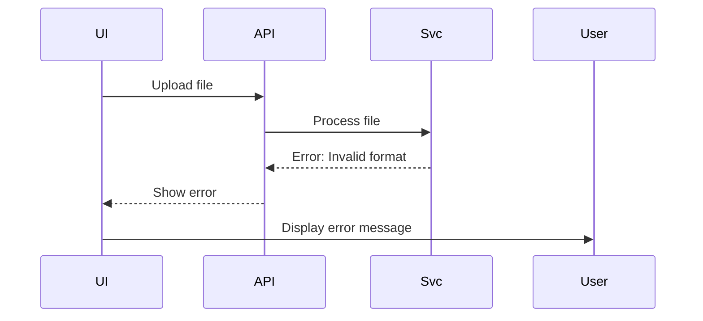
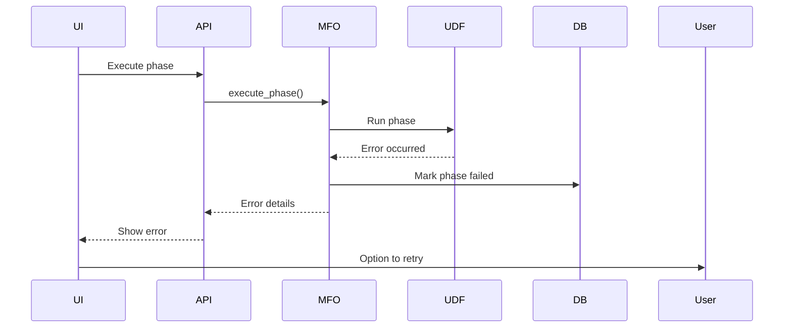
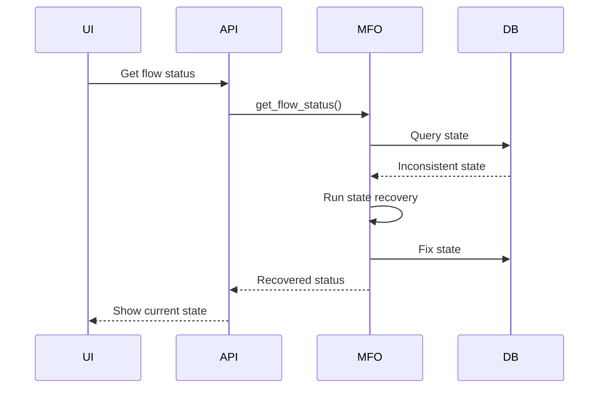

# Discovery Flow Sequence Diagram

## Complete User Journey: File Upload to Assessment Ready

This sequence diagram shows the detailed interactions between components as a user progresses through the entire discovery flow.

```mermaid
sequenceDiagram
    participant User
    participant UI as Frontend UI
    participant API as API Gateway
    participant MFO as Master Flow Orchestrator
    participant UDF as UnifiedDiscoveryFlow
    participant DB as PostgreSQL
    participant Svc as Services Layer
    participant CrewAI as CrewAI Engine

    %% Initial Upload
    User->>UI: Upload CMDB file
    UI->>UI: Check for incomplete flows
    
    alt Incomplete flows exist
        UI->>User: Show UploadBlocker
        User->>UI: Delete/Resume existing flow
    end

    %% File Upload & Flow Creation
    UI->>API: POST /api/v1/data-import/upload
    API->>API: Validate auth & context
    API->>Svc: Store uploaded file
    Svc->>DB: Insert into data_imports
    
    API->>MFO: create_flow("discovery", config)
    MFO->>MFO: Validate flow type
    MFO->>UDF: Initialize flow
    UDF->>CrewAI: Create CrewAI Flow
    CrewAI->>DB: Create flow records
    
    Note over DB: Creates records in:<br/>- discovery_flows<br/>- crewai_flow_state_extensions
    
    MFO-->>API: Return flow_id
    API-->>UI: Flow created response

    %% Phase 1: Data Import Validation
    UI->>API: POST /api/v1/flows/{flow_id}/execute
    API->>MFO: execute_phase(flow_id)
    MFO->>UDF: Execute data_import phase
    
    UDF->>Svc: Validate file format
    Svc->>Svc: Parse CMDB data
    Svc->>DB: Store raw data
    
    UDF->>MFO: Phase complete
    MFO->>DB: Update flow state
    DB-->>MFO: State updated
    MFO-->>API: Phase response
    API-->>UI: Import complete

    %% Phase 2: Field Mapping
    UI->>UI: Navigate to AttributeMapping
    UI->>API: GET /api/v1/discovery/flows/{flow_id}/status
    API->>MFO: get_flow_status(flow_id)
    MFO->>DB: Query flow state
    DB-->>MFO: Current state
    MFO-->>API: Status with field mappings
    API-->>UI: Display mappings

    User->>UI: Review field mappings
    UI->>UI: Show mapping suggestions
    
    User->>UI: Approve mappings
    UI->>API: POST /api/v1/flows/{flow_id}/execute
    API->>MFO: execute_phase(flow_id, "field_mapping")
    MFO->>UDF: Apply field mappings
    UDF->>DB: Store approved mappings
    MFO->>DB: Update phase completion
    MFO-->>API: Mapping complete
    API-->>UI: Navigate to cleansing

    %% Phase 3: Data Cleansing
    UI->>UI: Navigate to DataCleansing
    UI->>API: GET /api/v1/discovery/flows/{flow_id}/status
    API->>MFO: get_flow_status(flow_id)
    MFO->>UDF: Execute data_cleansing
    
    UDF->>Svc: Analyze data quality
    Svc->>Svc: Identify issues
    Svc->>Svc: Apply cleansing rules
    Svc->>DB: Store cleaned data
    
    UDF->>MFO: Cleansing complete
    MFO->>DB: Update state
    MFO-->>API: Quality report
    API-->>UI: Display results

    %% Phase 4: Asset Inventory
    User->>UI: Continue to Inventory
    UI->>API: POST /api/v1/flows/{flow_id}/execute
    API->>MFO: execute_phase(flow_id, "asset_inventory")
    MFO->>UDF: Build inventory
    
    UDF->>Svc: Process cleaned data
    Svc->>Svc: Categorize assets
    Svc->>Svc: Enrich metadata
    Svc->>DB: Insert into assets table
    
    UDF->>MFO: Inventory complete
    MFO->>DB: Update progress
    MFO-->>API: Asset summary
    API-->>UI: Display inventory

    %% Phase 5: Dependency Analysis
    User->>UI: Continue to Dependencies
    UI->>API: POST /api/v1/flows/{flow_id}/execute
    API->>MFO: execute_phase(flow_id, "dependency_analysis")
    MFO->>UDF: Analyze dependencies
    
    UDF->>Svc: Scan relationships
    Svc->>Svc: Map app-to-app deps
    Svc->>Svc: Map app-to-server deps
    Svc->>DB: Store in app_dependencies
    
    UDF->>MFO: Analysis complete
    MFO->>DB: Update state
    MFO-->>API: Dependency graph
    API-->>UI: Display dependencies

    %% Phase 6: Tech Debt Assessment
    UI->>API: POST /api/v1/flows/{flow_id}/execute
    API->>MFO: execute_phase(flow_id, "tech_debt")
    MFO->>UDF: Assess tech debt
    
    UDF->>Svc: Analyze patterns
    Svc->>Svc: Calculate metrics
    Svc->>DB: Store assessment
    
    UDF->>MFO: Assessment complete
    MFO->>DB: Mark flow complete
    MFO-->>API: Tech debt report
    API-->>UI: Show completion

    %% Ready for Assessment Flow
    UI->>User: Discovery Complete!
    User->>UI: Start Assessment
    UI->>API: POST /api/v1/flows
    API->>MFO: create_flow("assessment", {discovery_flow_id})
    MFO->>MFO: Link to discovery data
    MFO->>DB: Create assessment flow
    MFO-->>API: Assessment flow created
    API-->>UI: Navigate to assessment

    Note over User,DB: Discovery flow complete.<br/>Assets and dependencies ready<br/>for assessment phase.
```



## Key Interaction Patterns

### 1. Flow Creation Pattern
```
UI → API → MFO → UDF → CrewAI → DB
```
- Always goes through Master Flow Orchestrator
- UnifiedDiscoveryFlow handles CrewAI integration
- Dual table storage for state

### 2. Phase Execution Pattern
```
UI → API → MFO → UDF → Services → DB
```
- Each phase follows same pattern
- Services layer handles business logic
- State updates after each phase

### 3. Status Query Pattern
```
UI → API → MFO → DB → MFO → API → UI
```
- MFO centralizes all status queries
- Combines data from both tables
- Returns unified view

### 4. State Synchronization
- Every state change updates both:
  - `discovery_flows` table
  - `crewai_flow_state_extensions` table
- MFO ensures consistency

## Critical Control Points

### 1. Master Flow Orchestrator
- **Single point of control** for all flow operations
- No direct flow manipulation outside MFO
- Enforces phase prerequisites
- Manages state transitions

### 2. Context Middleware
- Enforces multi-tenant boundaries
- Validates every request
- Injects tenant context

### 3. Phase Validators
- Ensure prerequisites met
- Prevent invalid transitions
- Maintain data integrity

## Error Handling Flows

### Upload Failure


### Phase Execution Failure


### State Recovery


## Performance Considerations

### 1. Polling vs WebSockets
- Currently using polling for status updates
- WebSockets disabled for Vercel compatibility
- 3-second poll interval during active processing

### 2. Database Queries
- Batch queries where possible
- Use indexes on flow_id, tenant IDs
- Minimize JSON operations

### 3. State Caching
- Frontend caches flow status
- Invalidate on phase transitions
- Refresh on user actions

## Security Boundaries

### 1. Authentication
- Every request validated
- JWT tokens required
- No anonymous access

### 2. Multi-Tenancy
- Tenant IDs in every query
- No cross-tenant visibility
- Isolated data storage

### 3. Input Validation
- File size limits
- Format validation
- SQL injection prevention