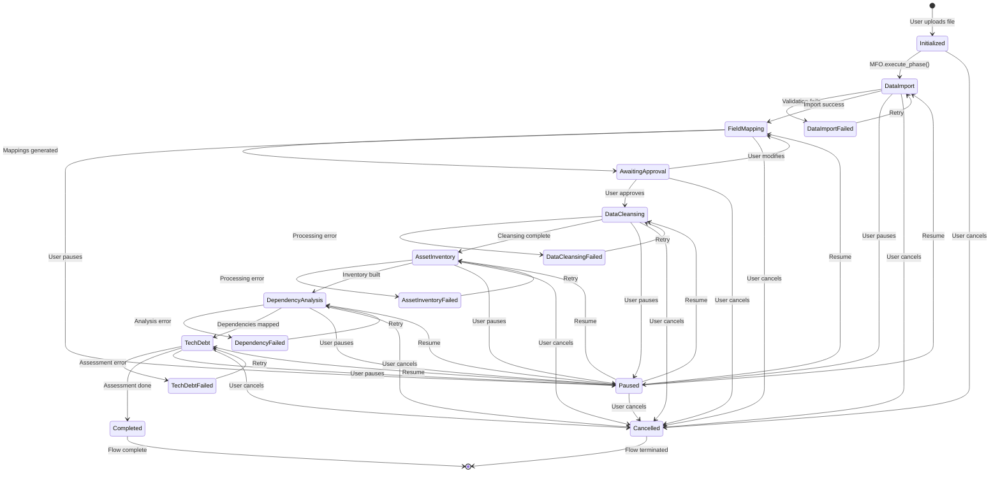
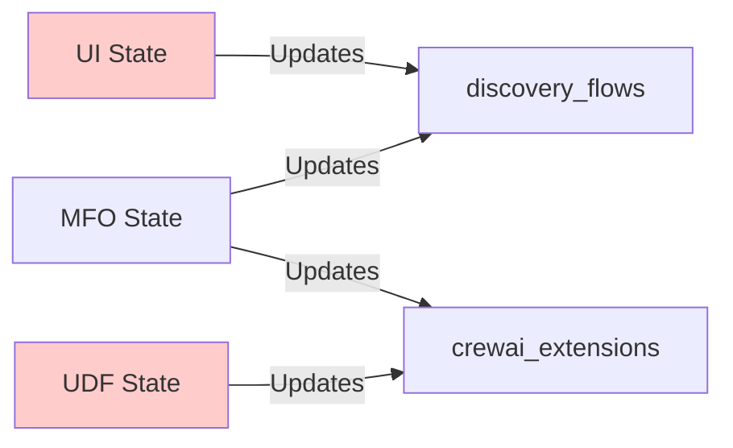
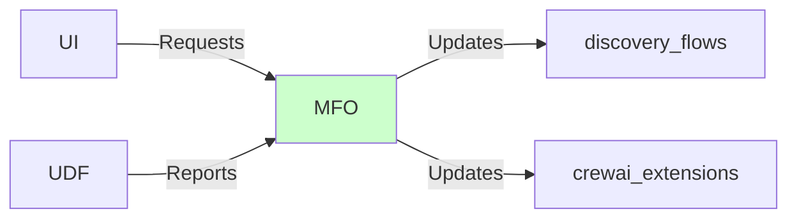
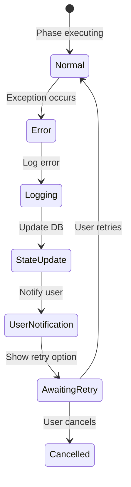

# Discovery Flow State Machine

## Overview
This document describes the state machine that governs the Discovery Flow, showing all possible states, transitions, and the competing controllers that can affect state.

## State Machine Diagram



## State Definitions

### Core States

| State | Description | Controllers | Next States |
|-------|-------------|-------------|-------------|
| **Initialized** | Flow created, no processing started | MFO | DataImport, Cancelled |
| **DataImport** | Processing uploaded file | MFO, ImportExecutor | FieldMapping, Paused, Failed, Cancelled |
| **FieldMapping** | Generating field mappings | MFO, MappingExecutor | AwaitingApproval, Paused, Cancelled |
| **AwaitingApproval** | Waiting for user approval | MFO, UI | DataCleansing, FieldMapping, Cancelled |
| **DataCleansing** | Cleaning and validating data | MFO, CleansingExecutor | AssetInventory, Paused, Failed, Cancelled |
| **AssetInventory** | Building asset catalog | MFO, InventoryExecutor | DependencyAnalysis, Paused, Failed, Cancelled |
| **DependencyAnalysis** | Mapping dependencies | MFO, DependencyExecutor | TechDebt, Paused, Failed, Cancelled |
| **TechDebt** | Assessing technical debt | MFO, TechDebtExecutor | Completed, Paused, Failed, Cancelled |
| **Completed** | Flow successfully finished | MFO | Terminal state |

### Meta States

| State | Description | Controllers | Next States |
|-------|-------------|-------------|-------------|
| **Paused** | Flow temporarily suspended | MFO, UI | Any previous state |
| **Cancelled** | Flow terminated by user | MFO, UI | Terminal state |
| **Failed** | Error occurred in phase | MFO, Executors | Retry to same phase |

## Controllers and Their Influence

### 1. Master Flow Orchestrator (MFO)
**Primary Controller** - Should be the only controller
- Controls all state transitions
- Validates prerequisites
- Persists state changes
- Handles error recovery

### 2. UnifiedDiscoveryFlow (UDF)
**CrewAI Integration** - Subordinate to MFO
- Implements CrewAI Flow pattern
- Uses @start/@listen decorators
- Reports state to MFO

### 3. Phase Executors
**Business Logic** - Subordinate to MFO
- DataImportExecutor
- FieldMappingExecutor
- DataCleansingExecutor
- AssetInventoryExecutor
- DependencyAnalysisExecutor
- TechDebtExecutor

### 4. UI Components
**User Interactions** - Trigger MFO actions
- UploadBlocker: Prevents concurrent flows
- Phase Pages: Display current state
- Navigation: Request state transitions

### 5. Service Layer
**Data Operations** - Called by executors
- DataImportService
- AssetService
- DependencyAnalysisService

## State Transition Rules

### Valid Transitions

```typescript
const VALID_TRANSITIONS = {
  initialized: ['data_import', 'cancelled'],
  data_import: ['field_mapping', 'paused', 'failed', 'cancelled'],
  field_mapping: ['awaiting_approval', 'paused', 'cancelled'],
  awaiting_approval: ['data_cleansing', 'field_mapping', 'cancelled'],
  data_cleansing: ['asset_inventory', 'paused', 'failed', 'cancelled'],
  asset_inventory: ['dependency_analysis', 'paused', 'failed', 'cancelled'],
  dependency_analysis: ['tech_debt', 'paused', 'failed', 'cancelled'],
  tech_debt: ['completed', 'paused', 'failed', 'cancelled'],
  paused: ['data_import', 'field_mapping', 'data_cleansing', 'asset_inventory', 'dependency_analysis', 'tech_debt', 'cancelled'],
  failed: ['data_import', 'field_mapping', 'data_cleansing', 'asset_inventory', 'dependency_analysis', 'tech_debt'],
  completed: [],
  cancelled: []
};
```

### Transition Guards

1. **Phase Prerequisites**
   - Cannot skip phases
   - Must complete in order
   - Previous phase data required

2. **State Consistency**
   - Both DB tables must agree
   - No partial state updates
   - Atomic transitions only

3. **User Permissions**
   - Must own the flow
   - Correct tenant context
   - Valid authentication

## Competing Controller Issues

### Problem: Multiple State Sources



**Issues:**
- UI directly updating DB
- UDF updating state independently
- State synchronization problems

### Solution: Single Controller



**Benefits:**
- Single source of truth
- Consistent state updates
- Clear responsibility

## State Persistence

### Database Schema

```sql
-- discovery_flows table
CREATE TABLE discovery_flows (
    flow_id UUID PRIMARY KEY,
    status VARCHAR(50),  -- active, paused, completed, cancelled, failed
    current_phase VARCHAR(50),  -- data_import, field_mapping, etc.
    progress_percentage FLOAT,
    -- Phase completion flags
    data_import_completed BOOLEAN,
    field_mapping_completed BOOLEAN,
    data_cleansing_completed BOOLEAN,
    asset_inventory_completed BOOLEAN,
    dependency_analysis_completed BOOLEAN,
    tech_debt_assessment_completed BOOLEAN,
    -- State data
    crewai_state_data JSONB
);

-- crewai_flow_state_extensions table
CREATE TABLE crewai_flow_state_extensions (
    flow_id UUID PRIMARY KEY,
    flow_status VARCHAR(50),
    flow_persistence_data JSONB,
    phase_transitions JSONB,
    error_history JSONB
);
```

### State Storage Pattern

1. **On State Change**:
   ```python
   async def transition_state(flow_id, new_state):
       # Update discovery_flows
       await update_discovery_flow(flow_id, new_state)
       
       # Update crewai_extensions
       await update_crewai_extensions(flow_id, new_state)
       
       # Add transition record
       await add_phase_transition(flow_id, new_state)
   ```

2. **State Recovery**:
   ```python
   async def recover_state(flow_id):
       # Get both states
       discovery_state = await get_discovery_state(flow_id)
       crewai_state = await get_crewai_state(flow_id)
       
       # Reconcile differences
       true_state = reconcile_states(discovery_state, crewai_state)
       
       # Update both to match
       await sync_states(flow_id, true_state)
   ```

## Error Handling State Machine



## Best Practices

### 1. State Transition Implementation
```python
@MFO.transition_handler
async def execute_transition(flow_id, target_state):
    # Validate transition
    if not is_valid_transition(current_state, target_state):
        raise InvalidTransition()
    
    # Check prerequisites
    if not check_prerequisites(flow_id, target_state):
        raise PrerequisiteNotMet()
    
    # Execute transition
    async with transaction():
        update_state(flow_id, target_state)
        log_transition(flow_id, current_state, target_state)
        emit_event(flow_id, f"transitioned_to_{target_state}")
```

### 2. State Query Pattern
```python
@MFO.query_handler
async def get_flow_state(flow_id):
    # Always query both tables
    discovery = await get_discovery_flow(flow_id)
    extensions = await get_extensions(flow_id)
    
    # Return reconciled state
    return reconcile_flow_state(discovery, extensions)
```

### 3. Error Recovery Pattern
```python
@MFO.error_handler
async def handle_phase_error(flow_id, phase, error):
    # Log error
    await log_error(flow_id, phase, error)
    
    # Update state
    await mark_phase_failed(flow_id, phase)
    
    # Preserve progress
    await save_partial_results(flow_id, phase)
    
    # Enable retry
    await enable_retry_option(flow_id, phase)
```

## Common State Issues and Solutions

### Issue 1: Stuck in Wrong State
**Symptom**: Flow shows wrong phase
**Cause**: State not updated after phase completion
**Solution**: Use MFO.sync_state() to reconcile

### Issue 2: Can't Resume Flow
**Symptom**: Resume button disabled
**Cause**: Flow in 'paused' status vs 'active'
**Solution**: Ensure proper status on pause/resume

### Issue 3: Navigation Loop
**Symptom**: Redirected to wrong page
**Cause**: current_phase doesn't match actual progress
**Solution**: Validate phase before navigation

### Issue 4: Lost Progress
**Symptom**: Phase shows incomplete after completion
**Cause**: State update failed
**Solution**: Implement idempotent state updates