# 🔗 **LEGACY CODE DEPENDENCY GRAPH ANALYSIS**

*AI Force Migration Platform - Discovery Flow Remediation*

**Analysis Date:** January 2025  
**Scope:** Backend legacy code dependencies and cleanup sequence  

---

## **📊 OVERVIEW**

This document provides visual dependency graphs and analysis for legacy code cleanup in the Discovery flow. Understanding these dependencies is critical for determining the safe order of removal and migration operations.

---

## **🎯 CRITICAL PATH ANALYSIS**

### **Primary Dependency Chain**


### **Cleanup Sequence Priority**
1. **🔴 Database Foundation** - Remove schema dependencies first
2. **🟡 Import Chain Repair** - Fix broken references  
3. **🟢 Service Layer Migration** - Update business logic
4. **🔵 API Consolidation** - Standardize endpoints
5. **🟣 Documentation Cleanup** - Remove legacy references

---

## **📋 SESSION ID DEPENDENCY MAP**

### **Database Level Dependencies**


### **Service Layer Dependencies**


### **API Endpoint Dependencies**
```mermaid
graph LR
    subgraph "V1 API Endpoints"
        V1A[/unified-discovery/*]
        V1B[/session-comparison/*]
        V1C[/data-import handlers]
    end
    
    subgraph "V3 API Endpoints"
        V3A[/discovery-flow/*]
        V3B[/data-import/*]
        V3C[/field-mapping/*]
    end
    
    subgraph "Frontend Usage"
        FE[React Components]
    end
    
    V1A -.-> |Legacy| FE
    V1B -.-> |Legacy| FE
    V1C -.-> |Legacy| FE
    V3A --> |Current| FE
    V3B --> |Current| FE
    V3C --> |Current| FE
    
    style V1A fill:#ffeb3b
    style V1B fill:#ff5722
    style V1C fill:#ffeb3b
    style V3A fill:#4caf50
    style V3B fill:#4caf50
    style V3C fill:#4caf50
```

---

## **🤖 AGENT ARCHITECTURE DEPENDENCIES**

### **Agent Implementation Hierarchy**


### **Agent Conversion Dependencies**


---

## **💔 BROKEN IMPORT CHAIN ANALYSIS**

### **Missing Model Impact**


### **Import Resolution Options**


---

## **🔄 API VERSION DEPENDENCIES**

### **API Usage Patterns**
```mermaid
graph TD
    subgraph "Frontend Components"
        FC1[Discovery Flow UI]
        FC2[Field Mapping UI]
        FC3[Asset Inventory UI]
        FC4[Admin Panels]
    end
    
    subgraph "API v1 Endpoints"
        V1_1[/unified-discovery/*]
        V1_2[/data-import/*]
        V1_3[/assets/*]
        V1_4[/admin/*]
    end
    
    subgraph "API v3 Endpoints"
        V3_1[/discovery-flow/*]
        V3_2[/data-import/*]
        V3_3[/field-mapping/*]
        V3_4[/admin/*]
    end
    
    FC1 --> V1_1
    FC1 -.-> V3_1
    FC2 --> V1_2
    FC2 -.-> V3_2
    FC3 --> V1_3
    FC4 --> V1_4
    FC4 -.-> V3_4
    
    style V1_1 fill:#ffeb3b
    style V1_2 fill:#ffeb3b
    style V1_3 fill:#ffeb3b
    style V1_4 fill:#ffeb3b
    style V3_1 fill:#4caf50
    style V3_2 fill:#4caf50
    style V3_3 fill:#4caf50
    style V3_4 fill:#4caf50
```

### **Migration Path**


---

## **📊 CLEANUP SEQUENCE MATRIX**

### **Safe Operations (No Dependencies)**


### **Dependency-Ordered Operations**

```mermaid
graph TD
    A[Database Migration<br/>session_id columns] --> B[Service Layer Updates<br/>session→flow logic]
    B --> C[API Endpoint Updates<br/>Parameter changes]
    C --> D[Frontend Integration<br/>API client updates]
    
    E[Import Chain Repair<br/>Missing models] --> F[Service Restoration<br/>Vector utils, learning]
    F --> G[Feature Re-enabling<br/>Pattern storage]
    
    H[Agent Base Consolidation<br/>Remove old base class] --> I[Agent Conversions<br/>Pseudo→CrewAI]
    I --> J[Flow Integration<br/>Updated coordination]
    
    style A fill:#ff5722
    style E fill:#ff5722
    style H fill:#ff5722
```


---

## **⚠️ RISK ASSESSMENT BY DEPENDENCY**

### **High Risk Dependencies**
| Component | Dependency Risk | Impact | Mitigation |
|-----------|----------------|---------|------------|
| Database Migration | 🔴 Very High | Critical system functions | Full backup + staging test |
| Service Layer Logic | 🔴 High | Active flow executions | Compatibility layer |
| Agent Business Logic | 🔴 High | AI accuracy | Parallel testing |
| API Endpoint Changes | 🟡 Medium | Frontend integration | Deprecation period |

### **Medium Risk Dependencies**
| Component | Dependency Risk | Impact | Mitigation |
|-----------|----------------|---------|------------|
| Import Chain Repair | 🟡 Medium | Feature availability | Graceful degradation |
| Model Removal | 🟡 Medium | Vector search | Alternative implementation |
| Base Class Changes | 🟡 Medium | Agent inheritance | Gradual migration |

### **Low Risk Dependencies**
| Component | Dependency Risk | Impact | Mitigation |
|-----------|----------------|---------|------------|
| Documentation | 🟢 Low | Developer experience | Version control |
| Legacy Files | 🟢 Low | Code maintenance | Automated testing |
| Comments | 🟢 Low | Code clarity | Review process |

---

## **🛠️ IMPLEMENTATION STRATEGY**

### **Phase 1: Foundation (Week 1-2)**


### **Phase 2: Core Changes (Week 3-4)**


### **Phase 3: Final Cleanup (Week 5-6)**


---

## **📈 DEPENDENCY VALIDATION**

### **Pre-Change Validation**
```bash
# Dependency analysis commands
find . -name "*.py" -exec grep -l "session_id" {} \;
find . -name "*.py" -exec grep -l "MappingLearningPattern" {} \;
find . -name "*.py" -exec grep -l "BaseDiscoveryAgent" {} \;
```

### **Post-Change Validation**
```bash
# Verification commands
python -m py_compile $(find . -name "*.py")
pytest --import-mode=importlib
python -c "import app; print('All imports successful')"
```

### **Dependency Health Metrics**
- **Import Success Rate**: 100% (no broken imports)
- **Test Pass Rate**: 95%+ (no regression)
- **Service Availability**: 99.9% (no downtime)
- **Performance Baseline**: ±5% (no degradation)

---

## **🔗 CROSS-REFERENCES**

- [Comprehensive Legacy Analysis](./COMPREHENSIVE_LEGACY_ANALYSIS.md) - Main analysis report
- [Session ID Migration Details](./SESSION_ID_MIGRATION.md) - Database and service migration
- [Agent Conversion Plan](./AGENT_CONVERSION_PLAN.md) - Pseudo-agent to CrewAI migration
- [Cleanup Manifest](./CLEANUP_MANIFEST.md) - File-by-file action plan
- [Execution Phases](./EXECUTION_PHASES.md) - Implementation timeline

---

*This dependency analysis ensures safe and systematic legacy code removal while maintaining system stability and functionality.*

**Last Updated:** January 2025  
**Next Review:** After each major dependency change