# ⚡ **LEGACY CLEANUP EXECUTION PHASES**

*AI Force Migration Platform - Discovery Flow Remediation*

**Execution Plan Date:** January 2025  
**Total Duration:** 6 weeks  
**Implementation Strategy:** Phased rollout with risk mitigation  

---

## **📊 EXECUTION OVERVIEW**

### **Implementation Strategy**
- **Staged Approach**: Low-risk → High-risk operations
- **Dependency-Ordered**: Foundation → Core → Integration → Validation
- **Risk Mitigation**: Backup → Test → Deploy → Monitor
- **Rollback Ready**: Feature flags and compatibility layers

### **Success Framework**

```mermaid
graph TD
    A[Week 1: Foundation<br/>Database + File Cleanup] --> B[Week 2: Service Layer<br/>Session→Flow Migration]
    B --> C[Week 3: Agent Conversion<br/>Pseudo→CrewAI]
    C --> D[Week 4: API Consolidation<br/>v1/v3 Cleanup]
    D --> E[Week 5: Integration<br/>Testing & Validation]
    E --> F[Week 6: Production<br/>Deployment & Monitoring]
    
    style A fill:#4caf50
    style B fill:#ff9800
    style C fill:#ff5722
    style D fill:#9c27b0
    style E fill:#2196f3
    style F fill:#4caf50
```


---

## **📅 PHASE 1: FOUNDATION (WEEK 1)**
*Risk Level: Medium | Impact: Critical*

### **Objective**
Establish clean foundation by executing database migration and removing obviously unused legacy files.

### **Key Deliverables**
- Database schema migrated (session_id columns removed)
- 4,022 lines of legacy code deleted
- Broken import chains identified and resolved
- Monitoring baseline established

### **Daily Breakdown**

#### **Monday: Database Migration Preparation**
**Morning (2-4 hours)**
- [ ] Create full database backup in staging
- [ ] Validate current schema state
- [ ] Test migration script in staging environment
- [ ] Prepare rollback procedures

**Afternoon (2-3 hours)**
- [ ] Execute migration in staging: `alembic upgrade remove_session_id_cleanup`
- [ ] Validate schema changes
- [ ] Test basic application functionality
- [ ] Document any issues found

**Risk Mitigation**:
```bash
# Pre-migration backup
pg_dump production_db > backup_$(date +%Y%m%d_%H%M%S).sql

# Staging validation
export DATABASE_URL=staging_connection
alembic upgrade remove_session_id_cleanup
pytest tests/database/ -v
```

#### **Tuesday: Production Database Migration**
**Morning (1-2 hours)**
- [ ] Schedule maintenance window
- [ ] Execute production database backup
- [ ] Run migration in production
- [ ] Validate migration success

**Afternoon (2-3 hours)**
- [ ] Monitor application health
- [ ] Test critical user flows
- [ ] Update monitoring dashboards
- [ ] Document migration completion

**Success Criteria**:
- Zero foreign key constraint violations
- All application tests passing
- No increase in error rates
- Flow creation success rate >95%

#### **Wednesday: Legacy File Cleanup**
**All Day (6-8 hours)**
- [ ] Delete confirmed unused files:
  ```bash
  rm app/api/v1/admin/session_comparison_original.py     # 713 lines
  rm app/utils/vector_utils_old.py                       # 317 lines  
  rm app/api/v1/endpoints/data_import/field_mapping_legacy.py      # 1,702 lines
  rm app/api/v1/endpoints/data_import/agentic_critical_attributes_legacy.py  # 1,290 lines
  ```
- [ ] Verify no references to deleted files
- [ ] Run comprehensive test suite
- [ ] Update imports if needed

**Validation Commands**:
```bash
# Verify no broken imports after deletion
python -m py_compile $(find app/ -name "*.py")
grep -r "session_comparison_original" app/ --include="*.py"
grep -r "vector_utils_old" app/ --include="*.py"
grep -r "field_mapping_legacy" app/ --include="*.py"
```

#### **Thursday: Import Chain Repair**
**Morning (3-4 hours)**
- [ ] Resolve MappingLearningPattern model issue:
  - Decision: Remove all references (recommended)
  - Update agent_learning_system.py
  - Update embedding_service.py
  - Keep vector_utils.py stubbed

**Afternoon (2-3 hours)**
- [ ] Fix AsyncSessionLocal import in agent_learning_system.py
- [ ] Resolve User model references in context management
- [ ] Test all import chains
- [ ] Validate no broken dependencies

#### **Friday: Monitoring & Validation**
**All Day (6-8 hours)**
- [ ] Set up comprehensive monitoring dashboard
- [ ] Establish performance baselines
- [ ] Document all changes made
- [ ] Prepare for Phase 2

**Week 1 Success Metrics**:
- [ ] Database migration: ✅ Completed successfully
- [ ] Legacy files removed: 4,022 lines deleted
- [ ] Broken imports: 0 remaining
- [ ] Test suite: 100% passing
- [ ] Performance: Within 5% of baseline

---

## **📅 PHASE 2: SERVICE LAYER MIGRATION (WEEK 2)**
*Risk Level: High | Impact: Critical*

### **Objective**
Convert core services from session_id to flow_id patterns while maintaining compatibility.

### **Key Deliverables**
- Session manager converted/removed
- Data import validation service updated
- API handlers migrated to flow_id
- Schema files updated

### **Daily Breakdown**

#### **Monday: Session Manager Decision & Implementation**
**Morning (3-4 hours)**
- [ ] **Decision**: Remove session_manager.py entirely
- [ ] Identify all references to SessionManager
- [ ] Update services to use direct flow_id patterns
- [ ] Test service integrations

**Afternoon (3-4 hours)**
- [ ] Update import statements across codebase
- [ ] Remove session_manager.py file
- [ ] Test all affected services
- [ ] Update documentation

#### **Tuesday: Data Import Validation Service**
**All Day (7-8 hours)**
- [ ] Update validation service method signatures:
  ```python
  # BEFORE:
  def validate_import(self, session_id: str, file_path: str)
  # AFTER:  
  def validate_import(self, flow_id: str, file_path: str)
  ```
- [ ] Update file storage paths:
  ```python
  # BEFORE: /tmp/validation_sessions/{session_id}/
  # AFTER:  /tmp/validation_flows/{flow_id}/
  ```
- [ ] Update database queries to use flow_id
- [ ] Test validation functionality end-to-end

#### **Wednesday: API Handler Updates**
**Morning (3-4 hours)**
- [ ] Update import_storage_handler.py:
  - Change `validation_session_id` to `validation_flow_id`
  - Update storage key formats
  - Update error messages

**Afternoon (3-4 hours)**
- [ ] Update schema files:
  - data_import_schemas.py
  - auth_schemas.py
- [ ] Test API endpoints
- [ ] Update API documentation

#### **Thursday: Event Listener Cleanup**
**Morning (3-4 hours)**
- [ ] Remove session_id fallback logic from discovery_flow_listener.py
- [ ] Update to use flow_id exclusively
- [ ] Test CrewAI flow events
- [ ] Validate event handling

**Afternoon (3-4 hours)**
- [ ] Update other event listeners and handlers
- [ ] Test flow coordination
- [ ] Validate state synchronization

#### **Friday: Integration Testing**
**All Day (7-8 hours)**
- [ ] End-to-end testing of updated services
- [ ] Performance testing
- [ ] Load testing with flow_id patterns
- [ ] Prepare for Phase 3

**Week 2 Success Metrics**:
- [ ] Session manager: ✅ Removed successfully
- [ ] Service migration: 100% flow_id usage
- [ ] API compatibility: All endpoints working
- [ ] Performance: Within 10% of baseline
- [ ] Error rates: <5% increase (temporary)

---

## **📅 PHASE 3: AGENT CONVERSION (WEEK 3)**
*Risk Level: Very High | Impact: Critical*

### **Objective**
Convert pseudo-agents to true CrewAI agents while preserving business logic accuracy.

### **Key Deliverables**
- 4 pseudo-agents converted to CrewAI
- 2 duplicate agent implementations removed
- Agent base class consolidated
- Business logic preserved with >90% accuracy

### **Daily Breakdown**

#### **Monday: Preparation & Framework**
**Morning (3-4 hours)**
- [ ] Set up parallel testing framework
- [ ] Extract business logic from pseudo-agents
- [ ] Create knowledge base files
- [ ] Prepare tool libraries

**Afternoon (3-4 hours)**
- [ ] Delete duplicate pseudo implementations:
  ```bash
  rm app/services/agents/data_cleansing_agent.py
  rm app/services/agents/asset_inventory_agent.py
  ```
- [ ] Update imports to use CrewAI versions
- [ ] Test existing CrewAI agents

#### **Tuesday: Data Import Validation Agent**
**All Day (7-8 hours)**
- [ ] Convert to CrewAI pattern
- [ ] Implement validation tools
- [ ] Extract validation rules to knowledge base
- [ ] Parallel test against pseudo-agent
- [ ] Validate accuracy requirements

**Agent Conversion Template**:
```python
class DataImportValidationAgent(BaseAgent):
    def __init__(self):
        super().__init__(
            role="Data Import Validation Specialist",
            goal="Validate imported data for migration readiness",
            tools=[
                self.file_format_analyzer_tool,
                self.schema_detection_tool,
                self.data_quality_scorer_tool
            ]
        )
```

#### **Wednesday: Attribute Mapping Agent**
**All Day (7-8 hours)**
- [ ] Convert to CrewAI pattern
- [ ] Implement field mapping tools
- [ ] Extract mapping patterns to knowledge base
- [ ] Test field mapping accuracy
- [ ] Validate UI integration

#### **Thursday: Technical Debt Analysis Agent**
**All Day (7-8 hours)**
- [ ] Convert to CrewAI pattern
- [ ] Implement scoring tools
- [ ] Extract debt calculation models
- [ ] Test 6R recommendations
- [ ] Validate scoring accuracy

#### **Friday: Dependency Analysis Agent**
**All Day (7-8 hours)**
- [ ] Convert to CrewAI pattern
- [ ] Implement topology analysis tools
- [ ] Extract relationship algorithms
- [ ] Test dependency mapping
- [ ] Validate network topology accuracy

**Week 3 Success Metrics**:
- [ ] Agent conversions: 4/4 completed
- [ ] Accuracy preservation: <10% variance
- [ ] Performance: <3x execution time
- [ ] Integration: All agents working in flow
- [ ] Business logic: 100% preserved

---

## **📅 PHASE 4: API CONSOLIDATION (WEEK 4)**
*Risk Level: Medium | Impact: Medium*

### **Objective**
Clean up API versioning confusion and consolidate to v3 where possible.

### **Key Deliverables**
- Empty v2 directory removed
- v1 endpoints marked deprecated where v3 exists
- Frontend API usage clarified
- API documentation updated

### **Daily Breakdown**

#### **Monday: V2 Cleanup**
**Morning (2-3 hours)**
- [ ] Remove empty `/app/api/v2/` directory
- [ ] Clean v2 references from deprecation middleware
- [ ] Update router configurations
- [ ] Test API routing

**Afternoon (3-4 hours)**
- [ ] Clean v2 references in comments and documentation
- [ ] Update test files
- [ ] Remove v2 import attempts

#### **Tuesday: V1 Deprecation Strategy**
**All Day (6-7 hours)**
- [ ] Identify v1 endpoints with v3 equivalents
- [ ] Add deprecation warnings to v1 endpoints
- [ ] Update API documentation
- [ ] Coordinate with frontend team on migration timeline

#### **Wednesday: Agent Base Class Cleanup**
**Morning (3-4 hours)**
- [ ] Verify all agents converted
- [ ] Delete old BaseDiscoveryAgent class
- [ ] Update all imports to use new base class
- [ ] Test agent inheritance

**Afternoon (3-4 hours)**
- [ ] Clean up agent-related imports
- [ ] Test flow integration
- [ ] Validate agent performance

#### **Thursday: Documentation Updates**
**All Day (6-7 hours)**
- [ ] Update API documentation
- [ ] Clean Phase 2/3 references in comments
- [ ] Update session_id examples to flow_id
- [ ] Create migration guide for developers

#### **Friday: Comprehensive Testing**
**All Day (7-8 hours)**
- [ ] Full regression testing
- [ ] API endpoint testing
- [ ] Agent integration testing
- [ ] Performance benchmarking

**Week 4 Success Metrics**:
- [ ] V2 cleanup: ✅ Complete removal
- [ ] V1 deprecation: Clear migration path
- [ ] Agent base class: Single inheritance
- [ ] Documentation: Up-to-date and accurate
- [ ] Test coverage: >90% passing

---

## **📅 PHASE 5: INTEGRATION & VALIDATION (WEEK 5)**
*Risk Level: Medium | Impact: High*

### **Objective**
Comprehensive integration testing and performance validation of all changes.

### **Key Deliverables**
- Complete system integration testing
- Performance benchmarking
- Security validation
- User acceptance testing

### **Daily Breakdown**

#### **Monday: End-to-End Testing**
**All Day (7-8 hours)**
- [ ] Complete discovery flow testing
- [ ] Data import to completion testing
- [ ] Field mapping accuracy testing
- [ ] Asset creation validation
- [ ] Dependency analysis testing

#### **Tuesday: Performance Testing**
**All Day (7-8 hours)**
- [ ] Load testing with realistic data volumes
- [ ] Memory usage analysis
- [ ] Database performance validation
- [ ] API response time benchmarking
- [ ] Agent execution time analysis

#### **Wednesday: Security & Multi-Tenancy**
**All Day (7-8 hours)**
- [ ] Multi-tenant isolation testing
- [ ] Data security validation
- [ ] Authentication flow testing
- [ ] Authorization boundary testing
- [ ] Audit trail verification

#### **Thursday: Bug Fixes & Optimization**
**All Day (7-8 hours)**
- [ ] Address any issues found in testing
- [ ] Performance optimizations
- [ ] Error handling improvements
- [ ] User experience enhancements

#### **Friday: Deployment Preparation**
**All Day (7-8 hours)**
- [ ] Prepare production deployment
- [ ] Create deployment runbook
- [ ] Set up monitoring alerts
- [ ] Prepare rollback procedures

**Week 5 Success Metrics**:
- [ ] Integration tests: 100% passing
- [ ] Performance: Within 5% of baseline
- [ ] Security: No vulnerabilities introduced
- [ ] Multi-tenancy: 100% isolation maintained
- [ ] User flows: All working correctly

---

## **📅 PHASE 6: PRODUCTION DEPLOYMENT (WEEK 6)**
*Risk Level: High | Impact: Critical*

### **Objective**
Deploy all changes to production with careful monitoring and validation.

### **Key Deliverables**
- Production deployment completed
- Real-time monitoring active
- Performance validation
- User acceptance confirmed

### **Daily Breakdown**

#### **Monday: Staging Final Validation**
**All Day (7-8 hours)**
- [ ] Complete staging environment testing
- [ ] Validate all functionality
- [ ] Performance final validation
- [ ] Security final check
- [ ] Prepare production deployment

#### **Tuesday: Production Deployment**
**Morning (3-4 hours)**
- [ ] Deploy to production with feature flags
- [ ] Monitor deployment health
- [ ] Validate core functionality
- [ ] Check error rates

**Afternoon (3-4 hours)**
- [ ] Gradual feature flag rollout
- [ ] Monitor user activity
- [ ] Validate business metrics
- [ ] Address any immediate issues

#### **Wednesday: Monitoring & Optimization**
**All Day (7-8 hours)**
- [ ] 24-hour stability monitoring
- [ ] Performance optimization
- [ ] User feedback collection
- [ ] Bug fix deployment if needed

#### **Thursday: Full Rollout**
**All Day (7-8 hours)**
- [ ] Complete feature flag enablement
- [ ] Monitor full system load
- [ ] Validate all user flows
- [ ] Performance final validation

#### **Friday: Documentation & Cleanup**
**All Day (6-7 hours)**
- [ ] Complete final documentation
- [ ] Clean up temporary code
- [ ] Remove feature flags
- [ ] Project completion report

**Week 6 Success Metrics**:
- [ ] Production deployment: ✅ Successful
- [ ] System stability: 99.9% uptime
- [ ] Performance: Baseline maintained
- [ ] User satisfaction: No degradation
- [ ] Error rates: <1% increase

---

## **🎯 OVERALL SUCCESS CRITERIA**

### **Technical Achievements**
- [ ] **Zero session_id references** in active code
- [ ] **100% CrewAI agents** (no pseudo-agents)
- [ ] **Single API version** per endpoint function
- [ ] **No broken imports** or disabled functionality
- [ ] **Unified architecture** patterns throughout

### **Business Achievements**
- [ ] **Discovery flow success rate**: >95%
- [ ] **Agent accuracy**: Within 10% of baseline
- [ ] **User experience**: No degradation
- [ ] **Performance**: Within 5% of baseline
- [ ] **Data integrity**: 100% maintained

### **Quality Achievements**
- [ ] **Code reduction**: ~34,000 lines removed
- [ ] **Test coverage**: >90% for modified code
- [ ] **Documentation**: Complete and accurate
- [ ] **Monitoring**: Comprehensive coverage
- [ ] **Maintainability**: Significantly improved

---

## **📊 MONITORING & ALERTING**

### **Real-Time Dashboards**
```yaml
monitoring_dashboards:
  system_health:
    - flow_execution_success_rate
    - api_response_times  
    - database_performance
    - error_rates_by_component
    
  business_metrics:
    - discovery_flow_completion_rate
    - agent_confidence_scores
    - field_mapping_accuracy
    - user_satisfaction_metrics
    
  performance_metrics:
    - memory_usage_trends
    - cpu_utilization
    - database_query_times
    - agent_execution_times
```

### **Alert Configuration**
```yaml
critical_alerts:
  - name: FlowFailureRate
    threshold: flow_failure_rate > 5%
    action: immediate_page
    
  - name: DatabaseError
    threshold: database_errors > 0
    action: immediate_page
    
  - name: AgentAccuracy
    threshold: agent_accuracy < 90%
    action: page_within_15_minutes

warning_alerts:
  - name: PerformanceDegradation
    threshold: response_time > 2x_baseline
    action: slack_notification
    
  - name: MemoryUsage
    threshold: memory_usage > 80%
    action: email_notification
```

---

## **🚨 EMERGENCY PROCEDURES**

### **Immediate Rollback**
```bash
# Emergency feature flag rollback
export LEGACY_CLEANUP_ENABLED=false
export USE_PSEUDO_AGENTS=true
export SESSION_COMPATIBILITY_MODE=true

# Container rollback
docker-compose down
git checkout legacy-cleanup-rollback
docker-compose up -d --build
```

### **Partial Rollback**
```bash
# Selective component rollback
export CREWAI_AGENTS_ENABLED=false  # Use pseudo-agents
export FLOW_ID_MIGRATION_ENABLED=false  # Use session compatibility
export API_V3_ONLY=false  # Enable v1 fallbacks
```

### **Database Recovery**
```bash
# Database restoration
pg_restore --clean --if-exists backup_pre_cleanup.sql
alembic downgrade -1
```

---

## **📋 FINAL CHECKLIST**

### **Pre-Production Validation**
- [ ] All 147 legacy files addressed
- [ ] Database migration successful
- [ ] Service layer fully migrated
- [ ] Agents 100% CrewAI-based
- [ ] API consolidation complete
- [ ] Documentation updated
- [ ] Monitoring configured
- [ ] Rollback procedures tested

### **Production Readiness**
- [ ] Staging environment validated
- [ ] Performance benchmarks met
- [ ] Security review passed
- [ ] User acceptance testing complete
- [ ] Deployment runbook prepared
- [ ] Team training completed
- [ ] Support procedures documented

### **Post-Deployment**
- [ ] System stability confirmed
- [ ] Performance validated
- [ ] User feedback collected
- [ ] Issues documented and resolved
- [ ] Team retrospective completed
- [ ] Lessons learned documented

---

*This execution plan provides a systematic approach to complete legacy code removal while maintaining system stability and business continuity throughout the 6-week implementation period.*

**Last Updated:** January 2025  
**Implementation Team:** Development, DevOps, QA  
**Next Review:** Weekly during execution phases