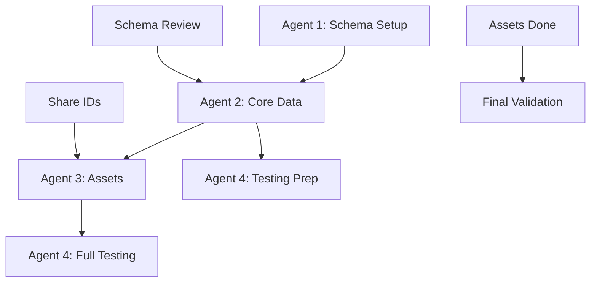

# Database Reset - Agent Execution Plan

## Overview
This plan enables 3-4 agents to work in parallel with clear dependencies and handoff points. Each agent has specific tasks that can be completed independently once prerequisites are met.

## Agent Roles & Responsibilities

### Agent 1: Database Schema Specialist
**Primary Focus**: Database reset, schema alignment, and migration creation
**Skills Required**: PostgreSQL, SQLAlchemy, Alembic migrations
**Estimated Time**: 4-5 hours

### Agent 2: Core Data Engineer
**Primary Focus**: User accounts, RBAC, discovery flows, and imports
**Skills Required**: Python, multi-tenant systems, RBAC patterns
**Estimated Time**: 3-4 hours (can start after Agent 1 completes)

### Agent 3: Asset Data Specialist
**Primary Focus**: Assets, dependencies, and migration planning data
**Skills Required**: Asset relationships, data modeling
**Estimated Time**: 3-4 hours (can start after Agent 2 begins)

### Agent 4: QA & Validation Engineer (Optional)
**Primary Focus**: Testing, validation, and documentation
**Skills Required**: Testing, SQL queries, documentation
**Estimated Time**: 2-3 hours (can start after Agent 3 begins)

---

## Task Sequencing & Dependencies



---

## Agent 1: Database Schema Specialist Tasks

### Prerequisites
- Docker environment running
- Access to codebase
- PostgreSQL admin access

### Task Sequence

#### TASK 1.1: Environment Backup (30 min)
```bash
# Create backup directory
mkdir -p backend/backups/pre_reset_$(date +%Y%m%d)

# Export current data
docker exec migration_postgres pg_dump -U postgres -d migration_db > backend/backups/pre_reset_$(date +%Y%m%d)/full_backup.sql

# Save migration history
docker exec migration_backend alembic history > backend/backups/pre_reset_$(date +%Y%m%d)/migration_history.txt

# Document current schema
docker exec migration_postgres pg_dump -U postgres -d migration_db --schema-only > backend/backups/pre_reset_$(date +%Y%m%d)/schema_only.sql
```

#### TASK 1.2: Database Reset (20 min)
```bash
# Stop services
docker-compose down

# Drop and recreate database
docker-compose up -d postgres
sleep 10
docker exec migration_postgres psql -U postgres -c "DROP DATABASE IF EXISTS migration_db;"
docker exec migration_postgres psql -U postgres -c "CREATE DATABASE migration_db;"

# Archive old migrations
mkdir -p backend/alembic/versions/archived_$(date +%Y%m%d)
mv backend/alembic/versions/*.py backend/alembic/versions/archived_$(date +%Y%m%d)/
```

#### TASK 1.3: Model Alignment (1 hour)
Review and ensure models match intended schema:
- ✓ DiscoveryFlow has learning_scope, memory_isolation_level, assessment_ready
- ✓ DataImport has source_system, error_message, error_details
- ✓ No is_mock fields remain
- ✓ All models in `backend/app/models/` are correct

#### TASK 1.4: Create Clean Migration (1.5 hours)
```bash
# Generate new migration
docker exec migration_backend alembic revision -m "initial_clean_schema"
```

Create comprehensive migration with:
- All enum types
- Core tables (client_accounts, engagements, users)
- Discovery flow tables with correct fields
- Asset tables with migration planning fields
- Proper indexes and foreign keys

#### TASK 1.5: Apply & Validate Migration (30 min)
```bash
# Apply migration
docker exec migration_backend alembic upgrade head

# Validate all tables exist
docker exec migration_postgres psql -U postgres -d migration_db -c "\dt"

# Verify schema matches models
docker exec migration_backend python -c "
from app.models import *
from app.core.database import engine
# This will error if schema doesn't match
Base.metadata.create_all(bind=engine, checkfirst=True)
print('Schema validation passed!')
"
```

#### TASK 1.6: Create Handoff Document (30 min)
Create `backend/seeding/SCHEMA_READY.md` with:
- Confirmation all tables created
- List of tables and key columns
- Any special notes for seeders
- Timestamp of completion

### Deliverables
- Clean database with correct schema
- Working Alembic migration
- Schema documentation
- SCHEMA_READY.md flag file

---

## Agent 2: Core Data Engineer Tasks

### Prerequisites
- Wait for Agent 1's SCHEMA_READY.md
- Python environment set up
- Understanding of RBAC model

### Task Sequence

#### TASK 2.1: Create Seeding Infrastructure (45 min)
```bash
# Create seeding directory structure
mkdir -p backend/scripts/seed_demo_data
cd backend/scripts/seed_demo_data

# Create base files
touch __init__.py
touch constants.py
touch utils.py
```

Create `constants.py`:
```python
# Demo IDs - Share these with all agents
DEMO_CLIENT_ID = "11111111-1111-1111-1111-111111111111"
DEMO_ENGAGEMENT_ID = "22222222-2222-2222-2222-222222222222"

# User IDs
DEMO_USER_ID = "33333333-3333-3333-3333-333333333333"
ANALYST_USER_ID = "44444444-4444-4444-4444-444444444444"
VIEWER_USER_ID = "55555555-5555-5555-5555-555555555555"
CLIENT_ADMIN_USER_ID = "66666666-6666-6666-6666-666666666666"

# Share this file with Agent 3
```

#### TASK 2.2: Seed Core Entities (1 hour)
Create `01_core_entities.py`:
- Demo client account
- Demo engagement
- 4 users with proper RBAC roles
- User profiles with access levels
- User-account associations

#### TASK 2.3: Seed Discovery Flows (1 hour)
Create `02_discovery_flows.py`:
- Flow 1: Complete (all phases done, assessment_ready=True)
- Flow 2: In-progress (at field mapping)
- Flow 3: At asset inventory phase
- Flow 4: Failed at import
- Flow 5: Just started

Include proper:
- learning_scope = 'engagement'
- memory_isolation_level = 'strict'
- CrewAI state data

#### TASK 2.4: Seed Data Imports (45 min)
Create `03_data_imports.py`:
- Import 1: CMDB CSV (completed, linked to Flow 1)
- Import 2: Cloud inventory JSON (completed, linked to Flow 3)
- Import 3: Manual Excel (in-progress, linked to Flow 2)

Include realistic:
- File sizes
- Processing metrics
- Error handling for failed import

#### TASK 2.5: Create ID Reference (15 min)
Create `SEEDED_IDS.json`:
```json
{
  "flows": {
    "complete": "flow_id_1",
    "in_progress": "flow_id_2",
    "inventory": "flow_id_3",
    "failed": "flow_id_4",
    "started": "flow_id_5"
  },
  "imports": {
    "cmdb_csv": "import_id_1",
    "cloud_json": "import_id_2",
    "manual_excel": "import_id_3"
  }
}
```

### Deliverables
- Core entities seeded
- 5 discovery flows in various states
- 3 data imports
- SEEDED_IDS.json for Agent 3
- constants.py shared file

---

## Agent 3: Asset Data Specialist Tasks

### Prerequisites
- Wait for Agent 2's SEEDED_IDS.json
- Import constants.py from Agent 2
- Understanding of asset relationships

### Task Sequence

#### TASK 3.1: Create Raw Import Records (45 min)
Create `04_raw_import_records.py`:
- 60-70 records for CMDB import
- 50-60 records for Cloud import  
- 30-40 records for Manual import
- Mix of valid/invalid records
- Proper cleansed_data for valid records

#### TASK 3.2: Create Field Mappings (30 min)
Create `05_field_mappings.py`:
- 10-12 mappings per import
- Mix of approved/pending/rejected
- Confidence scores varying from 0.7 to 0.95
- Transformation rules for complex mappings

#### TASK 3.3: Create Assets (1 hour)
Create `06_assets.py`:
- 10 Applications (with proper metadata)
- 35 Servers (20 Linux, 15 Windows)
- 10 Databases (Oracle, SQL Server, PostgreSQL)
- 5 Network devices
- Assign to appropriate discovery flows
- Set migration readiness fields

#### TASK 3.4: Create Dependencies (45 min)
Create `07_dependencies.py`:
- Application-to-server mappings
- Database dependencies
- Network topology
- At least 2 circular dependencies
- Clear dependency chains for each app

#### TASK 3.5: Create Migration Planning (30 min)
Create `08_migration_planning.py`:
- Assign 6R strategies to assets
- Create 4 migration waves
- Assign assets to waves
- Set readiness indicators

### Deliverables
- 60 fully populated assets
- Complete dependency mappings
- Migration wave assignments
- Field mappings for all imports

---

## Agent 4: QA & Validation Engineer Tasks (Optional)

### Prerequisites
- Can start test prep after Agent 2 begins
- Full testing after Agent 3 completes

### Task Sequence

#### TASK 4.1: Create Validation Scripts (1 hour)
Create `validate_seeding.py`:
- Check record counts per table
- Verify foreign key integrity
- Ensure no orphaned records
- Validate multi-tenant isolation

#### TASK 4.2: Create Test Queries (30 min)
Create `test_queries.sql`:
- Discovery flow status queries
- Asset inventory queries
- Dependency graph queries
- Migration readiness queries

#### TASK 4.3: UI Validation Checklist (30 min)
Create `UI_VALIDATION.md`:
- Login test for each user role
- Page-by-page validation checklist
- Expected data on each page
- Screenshot requirements

#### TASK 4.4: Run Full Validation (1 hour)
- Execute validation scripts
- Run test queries
- Document any issues
- Create final report

### Deliverables
- Validation report
- Test query results
- UI validation checklist
- Issue log (if any)

---

## Execution Instructions

### For Project Manager

1. **Assign agents based on expertise**:
   - Agent 1: Strongest database/migration skills
   - Agent 2: Best understanding of multi-tenant/RBAC
   - Agent 3: Domain knowledge of assets/migrations
   - Agent 4: QA/testing experience

2. **Set up communication**:
   ```bash
   # Create shared directory
   mkdir -p backend/seeding/shared
   
   # Create status file
   echo "STATUS: Agent 1 starting" > backend/seeding/shared/STATUS.txt
   ```

3. **Monitor progress**:
   - Check STATUS.txt every hour
   - Ensure handoff files are created
   - Resolve any blockers quickly

### For Each Agent

#### Starting Your Tasks
1. Pull latest code
2. Check prerequisites are met
3. Create your working branch:
   ```bash
   git checkout -b db-reset/agent-N-description
   ```

4. Update STATUS.txt when starting:
   ```bash
   echo "STATUS: Agent N - Starting TASK X.X" >> backend/seeding/shared/STATUS.txt
   ```

#### During Work
1. Commit after each task completion
2. Update STATUS.txt with progress
3. Create required handoff files
4. Alert next agent when ready

#### Completing Work
1. Run your validation checks
2. Create pull request
3. Update STATUS.txt:
   ```bash
   echo "STATUS: Agent N - COMPLETE. PR #XXX" >> backend/seeding/shared/STATUS.txt
   ```

### Parallel Execution Command Set

```bash
# Terminal 1 - Agent 1
cd /path/to/project
git checkout -b db-reset/schema-setup
# Begin Task 1.1

# Terminal 2 - Agent 2 (waits for Agent 1)
cd /path/to/project
git checkout -b db-reset/core-seeding
# Monitor for SCHEMA_READY.md
watch -n 30 "ls -la backend/seeding/"

# Terminal 3 - Agent 3 (waits for Agent 2)
cd /path/to/project  
git checkout -b db-reset/asset-seeding
# Monitor for SEEDED_IDS.json
watch -n 30 "ls -la backend/scripts/seed_demo_data/"

# Terminal 4 - Agent 4 (can start early)
cd /path/to/project
git checkout -b db-reset/validation
# Start creating validation scripts immediately
```

---

## Success Metrics

1. **Time to Completion**: Target 8-10 hours total
2. **Zero Errors**: All scripts run without errors
3. **Data Integrity**: No orphaned records, all FKs valid
4. **UI Ready**: All pages show appropriate demo data
5. **Documentation**: Complete handoff files and validation reports

## Emergency Contacts

- **Database Issues**: Check Docker logs, ensure PostgreSQL is running
- **Migration Failures**: Review Alembic output, check model alignment
- **Seeding Errors**: Verify IDs match, check foreign key order
- **Merge Conflicts**: Coordinate through STATUS.txt, merge carefully