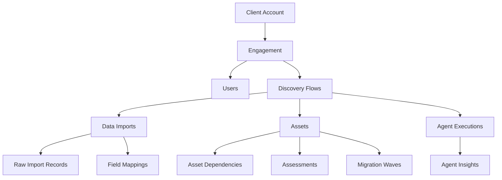

# Database Reset and Comprehensive Seeding Plan

## Executive Summary

This plan outlines the complete database reset strategy to fix schema mismatches and establish a comprehensive demo data environment. The goal is to create a clean database with proper migrations and seed ALL tables with realistic demo data for the demo user (demo@democorp.com) using demo client (11111111-1111-1111-1111-111111111111) and demo engagement (22222222-2222-2222-2222-222222222222).

## Current Issues

1. **Schema Mismatch**: Database contains deprecated columns (`learning_scope`, `memory_isolation_level`, `assessment_ready`) that shouldn't exist
2. **Missing Columns**: Model expects columns (`flow_type`, `crew_outputs`, etc.) that don't exist in database
3. **Incomplete Seeding**: Current seeding only populates a few tables, leaving most pages without demo data
4. **Migration Conflicts**: Multiple migrations creating conflicting schema states

## Objectives

1. **Clean Schema**: Create a single, correct initial migration matching the intended consolidation plan
2. **Comprehensive Demo Data**: Seed ALL tables with realistic, interconnected demo data
3. **Full App Coverage**: Ensure every page/feature has demo data to display
4. **Proper Relationships**: Maintain referential integrity across all seeded data
5. **Realistic Scenarios**: Create data that demonstrates real migration workflows

## Implementation Strategy

### Phase 1: Database Cleanup (Day 1 Morning)

1. **Backup Current Data**
   - Export any valuable test data
   - Document current schema state
   - Save migration history

2. **Complete Reset**
   - Drop all tables
   - Clear alembic version history
   - Remove all migration files

3. **Model Alignment**
   - Review and fix all SQLAlchemy models
   - Ensure models match consolidation plan
   - Remove any deprecated field references

### Phase 2: Clean Migration Creation (Day 1 Afternoon)

1. **Single Initial Migration**
   - Create one comprehensive migration
   - Include all tables with correct schema
   - No deprecated columns
   - All required columns present

2. **Migration Features**
   - Proper indexes for performance
   - Foreign key constraints
   - Default values where appropriate
   - Multi-tenant isolation setup

### Phase 3: Comprehensive Seeding Scripts (Day 2)

1. **Core Identity Data**
   ```
   - Demo Client Account (11111111-1111-1111-1111-111111111111)
   - Demo Engagement (22222222-2222-2222-2222-222222222222)
   - Demo User (demo@democorp.com)
   - Additional team users (analyst@democorp.com, manager@democorp.com)
   ```

2. **Discovery Flow Data**
   ```
   - 3 Complete discovery flows (different stages)
   - 1 In-progress discovery flow
   - 1 Failed discovery flow
   - Associated CrewAI state data
   ```

3. **Data Import Records**
   ```
   - 5 Data imports (various formats: CSV, JSON, Excel)
   - 1000+ raw import records
   - Field mappings for each import
   - Processing history
   ```

4. **Asset Inventory**
   ```
   - 500 discovered assets across categories:
     - 150 Applications
     - 200 Servers (Linux/Windows)
     - 100 Databases
     - 50 Network devices
   - Realistic metadata (IPs, hostnames, specs)
   - Business ownership assignments
   - Technical specifications
   ```

5. **Migration Planning Data**
   ```
   - 6R strategy assignments
   - 5 Migration waves
   - Dependencies between assets
   - Risk assessments
   - Cost estimates
   ```

6. **Assessment Data**
   ```
   - Application assessments
   - Technical debt analysis
   - Performance metrics
   - Security findings
   ```

7. **Agent Activity Data**
   ```
   - Agent execution history
   - Learning patterns
   - Performance metrics
   - Agent insights/recommendations
   ```

## Demo Data Scenarios

### Scenario 1: Complete Discovery Journey
- CMDB import completed
- All phases executed successfully
- 100 assets discovered and analyzed
- Ready for migration planning

### Scenario 2: In-Progress Analysis
- Data imported, field mapping pending
- Shows active workflow state
- Demonstrates approval process

### Scenario 3: Complex Enterprise Environment
- Multiple data sources imported
- Cross-dependencies mapped
- Technical debt identified
- Wave planning in progress

### Scenario 4: Failed Import Recovery
- Import with errors
- Validation issues displayed
- Recovery options available

## Seeding Script Structure

```
backend/scripts/seed_demo_data/
├── __init__.py
├── 01_core_entities.py      # Client, engagement, users
├── 02_discovery_flows.py     # Flows and states
├── 03_data_imports.py        # Import sessions and raw data
├── 04_field_mappings.py      # Mapping configurations
├── 05_assets.py              # Asset inventory
├── 06_dependencies.py        # Asset relationships
├── 07_assessments.py         # Assessment data
├── 08_migration_planning.py  # Waves and strategies
├── 09_agent_data.py          # Agent execution history
├── 10_analytics.py           # Metrics and insights
└── run_all_seeds.py          # Master seeding script
```

## Data Relationships



## Implementation Timeline

### Day 1: Reset and Migration (8 hours)
- Morning: Database cleanup and model fixes (4 hours)
- Afternoon: Create clean migration (4 hours)

### Day 2: Seeding Scripts (8 hours)
- Morning: Core entities and flows (4 hours)
- Afternoon: Assets and relationships (4 hours)

### Day 3: Testing and Validation (8 hours)
- Morning: Run full seeding, verify data (4 hours)
- Afternoon: Test all UI pages with demo data (4 hours)

## Success Criteria

1. **Schema Correctness**
   - All models match database exactly
   - No deprecated columns exist
   - All required columns present

2. **Data Completeness**
   - Every table has demo data
   - All relationships properly linked
   - No orphaned records

3. **UI Coverage**
   - Every page displays data when logged in as demo user
   - All workflows can be demonstrated
   - No empty states except where intentional

4. **Performance**
   - Seeding completes in under 5 minutes
   - Queries perform well with seeded data volume
   - No timeout issues

## Risk Mitigation

1. **Backup Strategy**
   - Export current data before reset
   - Version control all migrations
   - Document rollback procedures

2. **Testing Approach**
   - Test migrations locally first
   - Verify seeding in stages
   - Automated validation scripts

3. **Production Safety**
   - Clear separation of demo vs real data
   - Demo client ID hardcoded and documented
   - Prevent accidental demo data in production

## Post-Implementation

1. **Documentation**
   - Update all setup guides
   - Document demo scenarios
   - Create demo walkthrough guide

2. **Maintenance**
   - Seeding script versioning
   - Easy re-run capability
   - Extensibility for new features

3. **Team Training**
   - Demo data structure overview
   - How to extend seeding scripts
   - Troubleshooting guide

## Appendix: Demo Data Specifications

### Demo Client Account
- ID: 11111111-1111-1111-1111-111111111111
- Name: Demo Corporation
- Industry: Technology
- Size: Enterprise (10,000+ employees)

### Demo Engagement
- ID: 22222222-2222-2222-2222-222222222222
- Name: Cloud Migration Initiative 2024
- Type: Full cloud transformation
- Duration: 18 months

### Demo Users
1. **demo@democorp.com** (Primary)
   - Role: Migration Architect
   - Full access
   
2. **analyst@democorp.com**
   - Role: Data Analyst
   - Read/write access
   
3. **manager@democorp.com**
   - Role: Program Manager
   - Admin access

This comprehensive seeding will ensure the platform demonstrates its full capabilities with realistic enterprise migration scenarios.