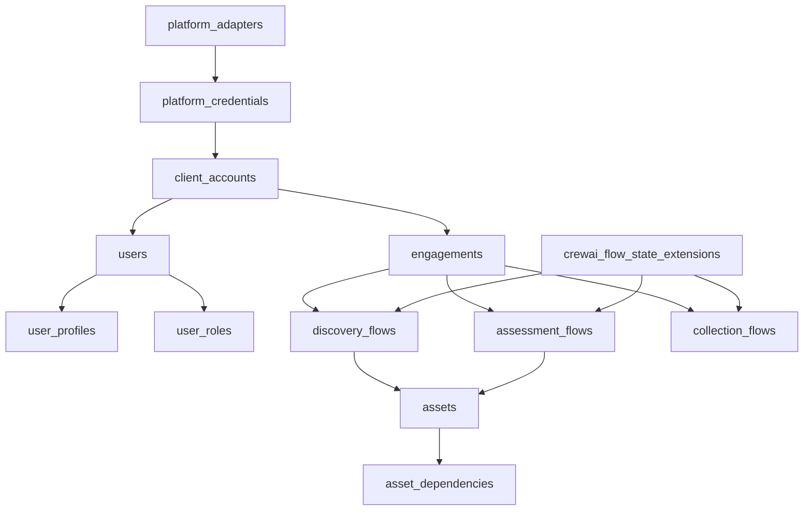

# Database Schema Design - AI Modernize Migration Platform

## Table of Contents
1. [Overview](#overview)
2. [Architecture Principles](#architecture-principles)
3. [Schema Organization](#schema-organization)
4. [Core Domain Models](#core-domain-models)
5. [Business Logic Models](#business-logic-models)
6. [Analytics and Tracking Models](#analytics-and-tracking-models)
7. [Relationships and Constraints](#relationships-and-constraints)
8. [PostgreSQL Specific Features](#postgresql-specific-features)
9. [Performance Considerations](#performance-considerations)
10. [Multi-Tenancy Design](#multi-tenancy-design)

## Overview

The AI Modernize Migration Platform uses PostgreSQL with the pgvector extension to manage enterprise application migration workflows. The database is designed with multi-tenancy, scalability, and AI-powered features in mind.

### Key Statistics
- **Total Tables**: 44 (including agent_learning_patterns)
- **Schema**: All tables reside in the `migration` schema
- **Primary Key Strategy**: UUID for all tables
- **Time Tracking**: Consistent `created_at`/`updated_at` timestamps
- **Special Features**: pgvector for embeddings, JSONB for flexible data, CHECK constraints for enums

## Architecture Principles

### 1. Single Schema Isolation
All tables exist in the `migration` schema to provide:
- Clean namespace separation
- Easier backup/restore operations
- Simplified permissions management
- Future multi-database support

### 2. Multi-Phase Orchestration
The platform supports multi-phase migration workflows:
```
Master Flow (Orchestrator)
    ├── Discovery Phase
    ├── Assessment Phase
    ├── Planning Phase
    └── Execution Phase
```

### 3. Multi-Tenancy
Every table includes tenant isolation via:
- `client_account_id` - Organization level
- `engagement_id` - Project level
- Row-level security potential

### 4. Audit Trail
Comprehensive tracking via:
- Timestamp columns on all tables
- Dedicated audit log tables
- User action tracking

## Schema Organization

### Naming Conventions
- **Tables**: `snake_case` plural (e.g., `client_accounts`, `users`)
- **Columns**: `snake_case` (e.g., `created_at`, `is_active`)
- **Indexes**: `ix_tablename_columnname`
- **Foreign Keys**: `fk_tablename_columnname_reftable`
- **Constraints**: `ck_tablename_description`

### Data Types
- **IDs**: UUID (PostgreSQL native)
- **Text**: VARCHAR with limits for constrained data, TEXT for unlimited
- **JSON**: JSONB for structured flexible data
- **Timestamps**: TIMESTAMP WITH TIME ZONE
- **Enums**: PostgreSQL ENUM types for fixed value sets

## Core Domain Models

### 1. Client and User Management

#### client_accounts
Central tenant table for multi-organization support.

```sql
CREATE TABLE migration.client_accounts (
    id UUID PRIMARY KEY DEFAULT gen_random_uuid(),
    name VARCHAR(255) NOT NULL,
    slug VARCHAR(100) NOT NULL UNIQUE,
    description TEXT,
    
    -- Organization Details
    industry VARCHAR(100),
    company_size VARCHAR(50),
    headquarters_location VARCHAR(255),
    
    -- Contact Information
    primary_contact_name VARCHAR(255),
    primary_contact_email VARCHAR(255),
    primary_contact_phone VARCHAR(50),
    
    -- Subscription and Limits
    subscription_tier VARCHAR(50) DEFAULT 'standard',
    max_users INTEGER,
    max_engagements INTEGER,
    storage_quota_gb INTEGER,
    api_quota_monthly INTEGER,
    
    -- Configuration
    settings JSONB DEFAULT '{}',
    branding JSONB DEFAULT '{}',
    agent_preferences JSONB DEFAULT '{
        "discovery_depth": "comprehensive",
        "automation_level": "assisted",
        "risk_tolerance": "moderate"
    }',
    
    -- Metadata
    created_at TIMESTAMP WITH TIME ZONE DEFAULT NOW(),
    updated_at TIMESTAMP WITH TIME ZONE,
    is_active BOOLEAN DEFAULT true
);
```

#### users
User accounts with Auth0 integration.

```sql
CREATE TABLE migration.users (
    id UUID PRIMARY KEY DEFAULT gen_random_uuid(),
    auth0_user_id VARCHAR(255) UNIQUE NOT NULL,
    email VARCHAR(255) UNIQUE NOT NULL,
    full_name VARCHAR(255),
    avatar_url VARCHAR(500),
    
    -- Status
    is_active BOOLEAN DEFAULT true,
    last_login_at TIMESTAMP WITH TIME ZONE,
    
    -- Metadata
    created_at TIMESTAMP WITH TIME ZONE DEFAULT NOW(),
    updated_at TIMESTAMP WITH TIME ZONE
);
```

#### engagements
Project-level containers for migration efforts.

```sql
CREATE TABLE migration.engagements (
    id UUID PRIMARY KEY DEFAULT gen_random_uuid(),
    client_account_id UUID NOT NULL REFERENCES client_accounts(id),
    
    -- Basic Information
    name VARCHAR(255) NOT NULL,
    description TEXT,
    engagement_type VARCHAR(50), -- 'assessment', 'migration', 'modernization'
    
    -- Timeline
    start_date DATE,
    end_date DATE,
    status VARCHAR(50) DEFAULT 'planning',
    
    -- Scope
    target_applications INTEGER,
    target_infrastructure_units INTEGER,
    estimated_complexity VARCHAR(20), -- 'low', 'medium', 'high', 'very_high'
    
    -- Metadata
    created_at TIMESTAMP WITH TIME ZONE DEFAULT NOW(),
    updated_at TIMESTAMP WITH TIME ZONE,
    created_by UUID REFERENCES users(id)
);
```

### 2. Access Control

#### user_profiles
Extended user information for RBAC.

```sql
CREATE TABLE migration.user_profiles (
    user_id UUID PRIMARY KEY REFERENCES users(id),
    
    -- Profile Information
    department VARCHAR(100),
    job_title VARCHAR(100),
    phone VARCHAR(50),
    timezone VARCHAR(50) DEFAULT 'UTC',
    
    -- Preferences
    notification_preferences JSONB DEFAULT '{
        "email": true,
        "in_app": true,
        "discovery_complete": true,
        "assessment_ready": true
    }',
    ui_preferences JSONB DEFAULT '{}',
    
    -- Security
    mfa_enabled BOOLEAN DEFAULT false,
    password_changed_at TIMESTAMP WITH TIME ZONE,
    security_questions JSONB,
    
    -- Metadata
    created_at TIMESTAMP WITH TIME ZONE DEFAULT NOW(),
    updated_at TIMESTAMP WITH TIME ZONE
);
```

#### user_roles
Role assignments with scope support.

```sql
CREATE TABLE migration.user_roles (
    id UUID PRIMARY KEY DEFAULT gen_random_uuid(),
    user_id UUID NOT NULL REFERENCES users(id),
    role VARCHAR(50) NOT NULL, -- 'admin', 'analyst', 'viewer'
    
    -- Scope (nullable for different levels)
    client_account_id UUID REFERENCES client_accounts(id),
    engagement_id UUID REFERENCES engagements(id),
    
    -- Status
    is_active BOOLEAN DEFAULT true,
    granted_at TIMESTAMP WITH TIME ZONE DEFAULT NOW(),
    granted_by UUID REFERENCES users(id),
    expires_at TIMESTAMP WITH TIME ZONE,
    
    -- Ensure proper scoping
    CONSTRAINT ck_role_scope CHECK (
        (client_account_id IS NOT NULL AND engagement_id IS NULL) OR
        (engagement_id IS NOT NULL) OR
        (client_account_id IS NULL AND engagement_id IS NULL AND role = 'admin')
    )
);
```

## Business Logic Models

### 1. Flow Management

#### crewai_flow_state_extensions
Master orchestrator for multi-phase workflows.

```sql
CREATE TABLE migration.crewai_flow_state_extensions (
    flow_id UUID PRIMARY KEY, -- CrewAI Flow ID
    flow_type VARCHAR(50) NOT NULL, -- 'discovery', 'assessment', 'planning', 'execution'
    
    -- Associations
    client_account_id UUID NOT NULL REFERENCES client_accounts(id),
    engagement_id UUID NOT NULL REFERENCES engagements(id),
    
    -- Flow Metadata
    display_name VARCHAR(255),
    description TEXT,
    config JSONB DEFAULT '{}',
    
    -- State Management
    crew_ai_state JSONB,
    current_phase VARCHAR(100),
    phase_history JSONB DEFAULT '[]',
    execution_metrics JSONB DEFAULT '{}',
    
    -- Child Flow Tracking
    child_flows JSONB DEFAULT '{}', -- {discovery: uuid, assessment: uuid, ...}
    
    -- Timestamps
    created_at TIMESTAMP WITH TIME ZONE DEFAULT NOW(),
    updated_at TIMESTAMP WITH TIME ZONE,
    completed_at TIMESTAMP WITH TIME ZONE
);
```

#### discovery_flows
Discovery phase workflow tracking.

```sql
CREATE TABLE migration.discovery_flows (
    id UUID PRIMARY KEY DEFAULT gen_random_uuid(),
    flow_id UUID UNIQUE NOT NULL, -- CrewAI Flow ID
    master_flow_id UUID REFERENCES crewai_flow_state_extensions(flow_id),
    
    -- Associations
    client_account_id UUID NOT NULL REFERENCES client_accounts(id),
    engagement_id UUID NOT NULL REFERENCES engagements(id),
    user_id UUID NOT NULL REFERENCES users(id),
    
    -- Discovery Configuration
    discovery_type VARCHAR(50) DEFAULT 'automated',
    target_platforms JSONB DEFAULT '[]',
    discovery_scope JSONB DEFAULT '{}',
    
    -- State Management
    status VARCHAR(50) DEFAULT 'initialized',
    phases JSONB DEFAULT '{
        "initialization": {"status": "pending"},
        "agent_loading": {"status": "pending"},
        "environment_scanning": {"status": "pending"},
        "data_collection": {"status": "pending"},
        "analysis": {"status": "pending"},
        "reporting": {"status": "pending"}
    }',
    
    -- Results
    discovered_assets_count INTEGER DEFAULT 0,
    discovered_patterns JSONB DEFAULT '[]',
    recommendations JSONB DEFAULT '[]',
    
    -- Metadata
    created_at TIMESTAMP WITH TIME ZONE DEFAULT NOW(),
    updated_at TIMESTAMP WITH TIME ZONE,
    completed_at TIMESTAMP WITH TIME ZONE
);
```

#### assessment_flows
Assessment phase workflow tracking.

```sql
CREATE TABLE migration.assessment_flows (
    id UUID PRIMARY KEY DEFAULT gen_random_uuid(),
    flow_id UUID UNIQUE NOT NULL,
    master_flow_id UUID REFERENCES crewai_flow_state_extensions(flow_id),
    
    -- Associations
    client_account_id UUID NOT NULL REFERENCES client_accounts(id),
    engagement_id UUID NOT NULL REFERENCES engagements(id),
    discovery_flow_id UUID REFERENCES discovery_flows(id),
    
    -- Assessment Configuration
    assessment_type VARCHAR(50), -- 'technical', 'business', 'security'
    assessment_framework VARCHAR(50), -- '6R', 'custom'
    
    -- State Management
    status VARCHAR(50) DEFAULT 'pending',
    current_stage VARCHAR(100),
    stages_completed JSONB DEFAULT '[]',
    
    -- Results
    technical_debt_score FLOAT,
    complexity_score FLOAT,
    risk_score FLOAT,
    readiness_score FLOAT,
    recommendations JSONB DEFAULT '[]',
    
    -- Metadata
    created_at TIMESTAMP WITH TIME ZONE DEFAULT NOW(),
    updated_at TIMESTAMP WITH TIME ZONE,
    completed_at TIMESTAMP WITH TIME ZONE
);
```

### 2. Asset Management

#### assets
Central asset repository with cross-phase tracking.

```sql
CREATE TABLE migration.assets (
    id UUID PRIMARY KEY DEFAULT gen_random_uuid(),
    
    -- Flow Associations (for cross-phase tracking)
    master_flow_id UUID REFERENCES crewai_flow_state_extensions(flow_id),
    discovery_flow_id UUID REFERENCES discovery_flows(id),
    assessment_flow_id UUID REFERENCES assessment_flows(id),
    
    -- Tenant Associations
    client_account_id UUID NOT NULL REFERENCES client_accounts(id),
    engagement_id UUID NOT NULL REFERENCES engagements(id),
    
    -- Asset Identification
    asset_name VARCHAR(255) NOT NULL,
    asset_type VARCHAR(100), -- 'server', 'application', 'database', 'service'
    asset_subtype VARCHAR(100),
    
    -- Technical Details
    hostname VARCHAR(255),
    fqdn VARCHAR(255),
    ip_address VARCHAR(45),
    mac_address VARCHAR(17),
    os_type VARCHAR(50),
    os_version VARCHAR(50),
    
    -- Infrastructure Details
    environment VARCHAR(50), -- 'production', 'staging', 'development'
    datacenter VARCHAR(100),
    region VARCHAR(50),
    availability_zone VARCHAR(50),
    rack_location VARCHAR(50),
    
    -- Application Details
    application_name VARCHAR(255),
    application_version VARCHAR(50),
    technology_stack JSONB DEFAULT '[]',
    dependencies JSONB DEFAULT '[]',
    
    -- Business Context
    business_unit VARCHAR(100),
    business_owner VARCHAR(255),
    technical_owner VARCHAR(255),
    business_criticality VARCHAR(20), -- 'low', 'medium', 'high', 'critical'
    
    -- Performance Metrics
    cpu_cores INTEGER,
    memory_gb FLOAT,
    storage_gb FLOAT,
    cpu_utilization_percent FLOAT,
    memory_utilization_percent FLOAT,
    
    -- Migration Analysis
    six_r_strategy VARCHAR(20), -- 'rehost', 'replatform', 'refactor', 'repurchase', 'retire', 'retain'
    migration_complexity VARCHAR(20),
    migration_priority INTEGER,
    migration_wave INTEGER,
    blockers JSONB DEFAULT '[]',
    
    -- Data Quality
    completeness_score FLOAT,
    confidence_score FLOAT,
    last_validated_at TIMESTAMP WITH TIME ZONE,
    
    -- Import Tracking
    source_system VARCHAR(100),
    source_id VARCHAR(255),
    import_session_id UUID,
    raw_data JSONB,
    
    -- Metadata
    created_at TIMESTAMP WITH TIME ZONE DEFAULT NOW(),
    updated_at TIMESTAMP WITH TIME ZONE,
    created_by UUID REFERENCES users(id),
    
    -- Indexes for performance
    INDEX ix_assets_master_flow_id (master_flow_id),
    INDEX ix_assets_asset_type (asset_type),
    INDEX ix_assets_environment (environment),
    INDEX ix_assets_six_r_strategy (six_r_strategy)
);
```

#### asset_dependencies
Relationships between assets.

```sql
CREATE TABLE migration.asset_dependencies (
    id UUID PRIMARY KEY DEFAULT gen_random_uuid(),
    source_asset_id UUID NOT NULL REFERENCES assets(id) ON DELETE CASCADE,
    target_asset_id UUID NOT NULL REFERENCES assets(id) ON DELETE CASCADE,
    
    -- Dependency Details
    dependency_type VARCHAR(50), -- 'runtime', 'compile', 'network', 'data'
    direction VARCHAR(20) DEFAULT 'outbound', -- 'inbound', 'outbound', 'bidirectional'
    strength VARCHAR(20) DEFAULT 'strong', -- 'weak', 'strong', 'critical'
    
    -- Discovery
    discovered_by VARCHAR(50), -- 'agent', 'manual', 'import'
    confidence_score FLOAT DEFAULT 1.0,
    evidence JSONB DEFAULT '{}',
    
    -- Metadata
    created_at TIMESTAMP WITH TIME ZONE DEFAULT NOW(),
    validated_at TIMESTAMP WITH TIME ZONE,
    
    -- Prevent duplicate dependencies
    UNIQUE(source_asset_id, target_asset_id, dependency_type)
);
```

### 3. Data Collection

#### collection_flows
Data collection workflow management.

```sql
CREATE TABLE migration.collection_flows (
    id UUID PRIMARY KEY DEFAULT gen_random_uuid(),
    flow_id UUID UNIQUE NOT NULL,
    master_flow_id UUID REFERENCES crewai_flow_state_extensions(flow_id),
    
    -- Associations
    client_account_id UUID NOT NULL REFERENCES client_accounts(id),
    engagement_id UUID NOT NULL REFERENCES engagements(id),
    discovery_flow_id UUID REFERENCES discovery_flows(id),
    
    -- Collection Configuration
    automation_tier VARCHAR(20), -- 'tier_1' through 'tier_4'
    collection_methods JSONB DEFAULT '[]',
    target_systems JSONB DEFAULT '[]',
    
    -- Progress Tracking
    status VARCHAR(50) DEFAULT 'initialized',
    current_phase VARCHAR(100),
    progress_percentage FLOAT DEFAULT 0.0,
    
    -- Quality Metrics
    data_quality_score FLOAT,
    completeness_percentage FLOAT,
    validation_errors_count INTEGER DEFAULT 0,
    
    -- Results
    total_items_collected INTEGER DEFAULT 0,
    items_processed INTEGER DEFAULT 0,
    items_failed INTEGER DEFAULT 0,
    
    -- Metadata
    created_at TIMESTAMP WITH TIME ZONE DEFAULT NOW(),
    updated_at TIMESTAMP WITH TIME ZONE,
    completed_at TIMESTAMP WITH TIME ZONE
);
```

#### platform_adapters
Integration adapters for various platforms.

```sql
CREATE TABLE migration.platform_adapters (
    id UUID PRIMARY KEY DEFAULT gen_random_uuid(),
    
    -- Adapter Information
    adapter_name VARCHAR(100) NOT NULL,
    adapter_type VARCHAR(50) NOT NULL, -- 'discovery', 'assessment', 'migration'
    version VARCHAR(20) NOT NULL,
    
    -- Capabilities
    supported_platforms JSONB DEFAULT '[]',
    capabilities JSONB DEFAULT '[]',
    configuration_schema JSONB DEFAULT '{}',
    
    -- Status
    status VARCHAR(20) DEFAULT 'active',
    health_check_url VARCHAR(500),
    last_health_check_at TIMESTAMP WITH TIME ZONE,
    
    -- Metadata
    created_at TIMESTAMP WITH TIME ZONE DEFAULT NOW(),
    updated_at TIMESTAMP WITH TIME ZONE,
    
    UNIQUE(adapter_name, version)
);
```

#### platform_credentials
Secure credential storage for platform access.

```sql
CREATE TABLE migration.platform_credentials (
    id UUID PRIMARY KEY DEFAULT gen_random_uuid(),
    
    -- Associations
    client_account_id UUID NOT NULL REFERENCES client_accounts(id),
    platform_adapter_id UUID NOT NULL REFERENCES platform_adapters(id),
    
    -- Credential Information
    credential_name VARCHAR(255) NOT NULL,
    credential_type VARCHAR(50), -- 'api_key', 'oauth2', 'basic_auth'
    
    -- Secure Storage
    encrypted_credentials BYTEA NOT NULL, -- Encrypted with KMS
    encryption_key_id VARCHAR(255),
    vault_path VARCHAR(500),
    
    -- Status
    status VARCHAR(50) DEFAULT 'active',
    expires_at TIMESTAMP WITH TIME ZONE,
    last_rotated_at TIMESTAMP WITH TIME ZONE,
    
    -- Metadata
    created_at TIMESTAMP WITH TIME ZONE DEFAULT NOW(),
    created_by UUID REFERENCES users(id),
    updated_at TIMESTAMP WITH TIME ZONE,
    
    UNIQUE(client_account_id, platform_adapter_id, credential_name)
);
```

## Analytics and Tracking Models

### 1. AI Agent Tracking

#### agent_task_history
Comprehensive tracking of AI agent activities.

```sql
CREATE TABLE migration.agent_task_history (
    id UUID PRIMARY KEY DEFAULT gen_random_uuid(),
    
    -- Task Identification
    task_id VARCHAR(255) UNIQUE NOT NULL,
    parent_task_id VARCHAR(255),
    
    -- Flow Association
    flow_id UUID,
    flow_type VARCHAR(50),
    master_flow_id UUID REFERENCES crewai_flow_state_extensions(flow_id),
    
    -- Agent Information
    agent_name VARCHAR(100) NOT NULL,
    agent_type VARCHAR(50),
    agent_version VARCHAR(20),
    
    -- Task Details
    task_type VARCHAR(100),
    task_description TEXT,
    input_data JSONB DEFAULT '{}',
    
    -- Execution
    status VARCHAR(50) DEFAULT 'pending',
    started_at TIMESTAMP WITH TIME ZONE,
    completed_at TIMESTAMP WITH TIME ZONE,
    duration_seconds FLOAT,
    
    -- Results
    output_data JSONB DEFAULT '{}',
    error_message TEXT,
    error_details JSONB,
    
    -- Performance
    tokens_used INTEGER,
    api_calls_made INTEGER,
    memory_used_mb FLOAT,
    
    -- Metadata
    created_at TIMESTAMP WITH TIME ZONE DEFAULT NOW(),
    
    INDEX ix_agent_task_history_flow_id (flow_id),
    INDEX ix_agent_task_history_agent_name (agent_name),
    INDEX ix_agent_task_history_status (status)
);
```

#### agent_performance_daily
Daily aggregated agent performance metrics.

```sql
CREATE TABLE migration.agent_performance_daily (
    id UUID PRIMARY KEY DEFAULT gen_random_uuid(),
    
    -- Dimensions
    date DATE NOT NULL,
    agent_name VARCHAR(100) NOT NULL,
    flow_type VARCHAR(50),
    
    -- Task Metrics
    total_tasks INTEGER DEFAULT 0,
    successful_tasks INTEGER DEFAULT 0,
    failed_tasks INTEGER DEFAULT 0,
    
    -- Performance Metrics
    avg_duration_seconds FLOAT,
    p50_duration_seconds FLOAT,
    p95_duration_seconds FLOAT,
    p99_duration_seconds FLOAT,
    
    -- Resource Usage
    total_tokens_used INTEGER DEFAULT 0,
    total_api_calls INTEGER DEFAULT 0,
    total_cost DECIMAL(10, 4) DEFAULT 0,
    
    -- Quality Metrics
    error_rate FLOAT,
    retry_rate FLOAT,
    
    -- Metadata
    created_at TIMESTAMP WITH TIME ZONE DEFAULT NOW(),
    
    UNIQUE(date, agent_name, flow_type)
);
```

### 2. Usage Tracking

#### llm_usage_log
Detailed LLM usage tracking for cost management.

```sql
CREATE TABLE migration.llm_usage_log (
    id UUID PRIMARY KEY DEFAULT gen_random_uuid(),
    
    -- Request Context
    flow_id UUID,
    task_id VARCHAR(255),
    user_id UUID REFERENCES users(id),
    
    -- LLM Details
    provider VARCHAR(50) NOT NULL, -- 'openai', 'anthropic', 'deepinfra'
    model VARCHAR(100) NOT NULL,
    
    -- Usage Metrics
    prompt_tokens INTEGER NOT NULL,
    completion_tokens INTEGER NOT NULL,
    total_tokens INTEGER NOT NULL,
    
    -- Cost Tracking
    prompt_cost DECIMAL(10, 6),
    completion_cost DECIMAL(10, 6),
    total_cost DECIMAL(10, 6),
    
    -- Request/Response
    request_payload JSONB,
    response_payload JSONB,
    
    -- Performance
    latency_ms INTEGER,
    status_code INTEGER,
    error_message TEXT,
    
    -- Metadata
    created_at TIMESTAMP WITH TIME ZONE DEFAULT NOW(),
    
    INDEX ix_llm_usage_log_provider_model (provider, model),
    INDEX ix_llm_usage_log_created_at (created_at)
);
```

### 3. Agent Learning and Knowledge Base

#### agent_learning_patterns
Storage for AI-discovered patterns and insights.

```sql
CREATE TABLE migration.agent_learning_patterns (
    id UUID PRIMARY KEY DEFAULT gen_random_uuid(),
    
    -- Multi-tenant context
    client_account_id UUID NOT NULL REFERENCES client_accounts(id),
    engagement_id UUID REFERENCES engagements(id),
    master_flow_id UUID REFERENCES crewai_flow_state_extensions(flow_id),
    
    -- Learning metadata
    insight_type VARCHAR(50) NOT NULL CHECK (insight_type IN (
        'field_mapping_suggestion',
        'risk_pattern',
        'optimization_opportunity',
        'anomaly_detection',
        'workflow_improvement'
    )),
    
    -- AI content
    embedding vector(1536) NOT NULL,  -- OpenAI embedding dimension
    raw_evidence JSONB NOT NULL,      -- Original data/context
    confidence_score FLOAT CHECK (confidence_score BETWEEN 0 AND 1),
    
    -- Usage tracking
    discovered_by VARCHAR(100),       -- Which agent found this
    validated BOOLEAN DEFAULT false,
    applied_count INTEGER DEFAULT 0,  -- Times this pattern was used
    success_rate FLOAT,              -- Success when applied
    
    -- Metadata
    created_at TIMESTAMP WITH TIME ZONE DEFAULT NOW(),
    last_applied_at TIMESTAMP WITH TIME ZONE,
    expires_at TIMESTAMP WITH TIME ZONE  -- For time-bound insights
);
```

### 4. Audit Logging

#### security_audit_logs
Security-sensitive operation tracking.

```sql
CREATE TABLE migration.security_audit_logs (
    id UUID PRIMARY KEY DEFAULT gen_random_uuid(),
    
    -- Event Information
    event_type VARCHAR(100) NOT NULL,
    event_category VARCHAR(50) NOT NULL, -- 'auth', 'access', 'data', 'config'
    severity VARCHAR(20) DEFAULT 'INFO', -- 'INFO', 'WARNING', 'ERROR', 'CRITICAL'
    
    -- Actor Information
    actor_user_id VARCHAR(36) NOT NULL,
    actor_email VARCHAR(255),
    actor_role VARCHAR(50),
    
    -- Target Information
    target_type VARCHAR(50), -- 'user', 'engagement', 'asset', etc.
    target_id VARCHAR(36),
    target_details JSONB DEFAULT '{}',
    
    -- Request Context
    ip_address VARCHAR(45),
    user_agent TEXT,
    request_id VARCHAR(255),
    session_id VARCHAR(255),
    
    -- Event Details
    action VARCHAR(100) NOT NULL,
    result VARCHAR(20) NOT NULL, -- 'success', 'failure', 'error'
    error_code VARCHAR(50),
    details JSONB DEFAULT '{}',
    
    -- Compliance
    requires_review BOOLEAN DEFAULT false,
    reviewed_at TIMESTAMP WITH TIME ZONE,
    reviewed_by VARCHAR(36),
    
    -- Metadata
    created_at TIMESTAMP WITH TIME ZONE DEFAULT NOW(),
    
    INDEX ix_security_audit_logs_event_type (event_type),
    INDEX ix_security_audit_logs_actor_user_id (actor_user_id),
    INDEX ix_security_audit_logs_created_at (created_at)
);
```

## Relationships and Constraints

### Foreign Key Strategy
- **CASCADE**: Used for tightly coupled entities (e.g., asset → asset_dependencies)
- **SET NULL**: Used for optional relationships that should persist
- **RESTRICT**: Used for critical relationships that must be explicitly handled

### Key Relationships



## PostgreSQL Specific Features

### 1. CHECK Constraints for Enums
Instead of PostgreSQL ENUM types, we use CHECK constraints for flexibility:

```sql
-- Example: Asset table with CHECK constraints
CREATE TABLE migration.assets (
    -- ... other columns ...
    
    asset_type VARCHAR(20) CHECK (asset_type IN (
        'server', 'application', 'database', 'network', 'storage'
    )),
    
    six_r_strategy VARCHAR(20) CHECK (six_r_strategy IN (
        'rehost', 'replatform', 'refactor', 'repurchase', 'retire', 'retain'
    )),
    
    environment VARCHAR(50) CHECK (environment IN (
        'production', 'staging', 'development', 'test', 'dr'
    )),
    
    business_criticality VARCHAR(20) CHECK (business_criticality IN (
        'critical', 'high', 'medium', 'low'
    ))
);

-- Easy to modify when new values are needed
ALTER TABLE assets DROP CONSTRAINT assets_six_r_strategy_check;
ALTER TABLE assets ADD CONSTRAINT assets_six_r_strategy_check 
    CHECK (six_r_strategy IN ('rehost', 'replatform', 'refactor', 'repurchase', 'retire', 'retain', 'rewrite'));
```

### 2. JSONB Usage
- **Flexible Configuration**: settings, preferences, config fields
- **Structured Arrays**: dependencies, recommendations, phases
- **Audit Details**: Complex event data, evidence
- **State Management**: Flow states, metrics, history

### 3. pgvector Integration
```sql
-- For AI-powered similarity search
CREATE EXTENSION IF NOT EXISTS vector;

-- Example: Asset embeddings for similarity
ALTER TABLE migration.assets 
ADD COLUMN embedding vector(1536); -- OpenAI embedding dimension

-- Create index for similarity search
CREATE INDEX ON migration.assets 
USING ivfflat (embedding vector_cosine_ops)
WITH (lists = 100);
```

## Performance Considerations

### 1. Indexing Strategy
- **Primary Keys**: All UUID with default gen_random_uuid()
- **Foreign Keys**: Indexed by default in PostgreSQL
- **Search Fields**: Explicit indexes on commonly queried fields
- **Composite Indexes**: For multi-column queries
- **Partial Indexes**: For filtered queries (e.g., active records only)

### 2. Partitioning Strategy
Tables that may benefit from partitioning:
- `llm_usage_log` - By created_at (monthly)
- `security_audit_logs` - By created_at (monthly)
- `agent_task_history` - By created_at (weekly)

### 3. Query Optimization
- Use JSONB GIN indexes for frequent JSON queries
- Implement materialized views for complex reports
- Use EXPLAIN ANALYZE for query tuning
- Monitor pg_stat_statements for slow queries

## Multi-Tenancy Design

### 1. Row-Level Security
Every table includes tenant isolation:
- `client_account_id` for organization isolation
- `engagement_id` for project isolation

### 2. Query Patterns
```sql
-- Always filter by tenant
SELECT * FROM migration.assets 
WHERE client_account_id = ? 
  AND engagement_id = ?;

-- Use CTEs for complex tenant queries
WITH tenant_assets AS (
    SELECT * FROM migration.assets
    WHERE client_account_id = ?
)
SELECT ... FROM tenant_assets;
```

### 3. Data Isolation Guarantees
- Application-level filtering (current)
- Database-level RLS policies (future)
- Separate schemas per tenant (enterprise option)

## Maintenance and Operations

### 1. Regular Maintenance
- VACUUM ANALYZE daily
- REINDEX monthly for high-write tables
- Archive old audit logs quarterly
- Monitor table and index bloat

### 2. Backup Strategy
- Full backups daily
- WAL archiving for point-in-time recovery
- Separate backup retention for audit tables
- Test restore procedures monthly

### 3. Monitoring
Key metrics to track:
- Connection pool usage
- Long-running queries
- Table sizes and growth
- Index usage statistics
- JSONB query performance

---

This document serves as the authoritative source for database schema design. All changes should be reflected here first, then implemented through proper migration procedures.