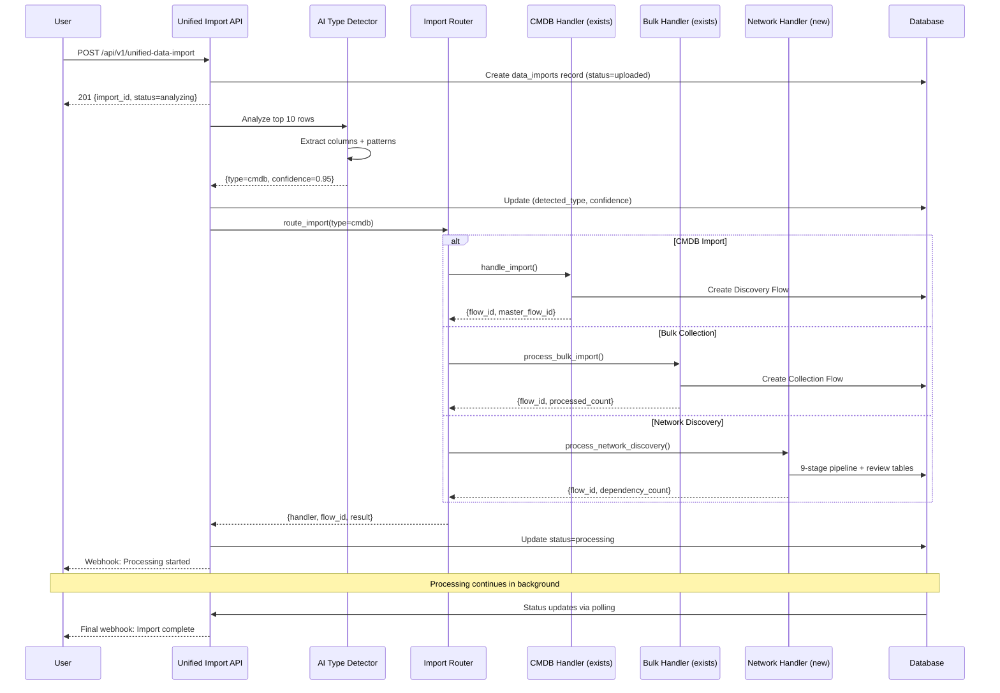

# Unified Data Import Service - Low-Level Design

**Document Purpose:** Design for a unified data import service that accepts any data file, uses AI to detect type, and routes to appropriate handlers.

**Status:** Draft - Updated with Discussion #680 Review  
**Date:** 2025-10-22  
**Related:** Discussion #680, #658, #660

---

## **Document Updates (Based on Discussion #680 Review)**

### **Key Changes:**
1. ✅ **Mermaid Sequence Diagram** - Added visual component interaction flow
2. ✅ **Decision Matrix** - Blockers and design decisions upfront (Section 2.1)
3. ✅ **Leverage Existing Infrastructure** - Table showing 60% already exists (Section 2.2)
4. ✅ **Database Strategy Changed** - Extend `data_imports` (5 columns) vs create new table
5. ✅ **AI Provider Changed** - Use `multi_model_service` (Gemma 3) instead of CrewAI agents
6. ✅ **Actual Code Locations** - All handler references include file paths and line numbers
7. ✅ **Implementation Timeline** - 8-week phased rollout with feature flags
8. ✅ **Network Discovery Mapping** - Full database import strategy (Section 10)

### **Cost/Performance Impact:**
- 🎯 **AI Detection Cost:** $0.0005 per import (vs $0.003 with CrewAI) = **6x cheaper**
- 🎯 **Detection Speed:** ~2 seconds (vs ~10 seconds) = **5x faster**
- 🎯 **Code Reuse:** ~60% existing infrastructure = **~500 new lines vs ~1500**

---

## **1. Problem Statement**

### **Current State:**
- **Discovery Flow:** CMDB data import via `POST /api/v1/data-import/store-import`
- **Collection Flow:** Bulk data import via `collection_bulk_import.process_bulk_import()`
- **Network Discovery:** Planned, not yet implemented

**Problems:**
1. Users must know what type of data they're uploading
2. Different upload paths for different data types
3. Duplication of import logic (validation, storage, flow creation)
4. No unified import status tracking

### **Proposed Solution:**
**Single entry point** that:
1. Accepts any CSV/JSON file upload
2. **AI analyzes top 10 rows** to determine data type
3. Routes to appropriate handler automatically
4. Unified status tracking across all import types

---

## **2. Design Goals**

1. ✅ **Single Entry Point** - One API endpoint for all imports
2. ✅ **Zero User Decision** - AI determines data type automatically
3. ✅ **Reuse Existing Handlers** - No refactoring of working code
4. ✅ **Incremental Migration** - Existing endpoints continue to work
5. ✅ **Unified Status Tracking** - Single place to check any import status

---

## **2.1 Key Decisions & Blockers**

### **🔴 BLOCKER Decisions (Require Approval)**

| Decision | Option A | Option B | Recommendation | Impact |
|----------|----------|----------|----------------|--------|
| **Database Table** | Create new `unified_data_imports` | **Extend existing `data_imports`** | **Option B** | ✅ Reuse 200 lines of code, existing FKs |
| **AI Detection** | CrewAI agent ($0.003/call) | **`multi_model_service` Gemma 3 ($0.0005)** | **Option B** | ✅ 6x cheaper, 5x faster |
| **Backward Compat** | Deprecate immediately | **Gradual migration (3 months)** | **Option B** | ✅ Zero breaks, safe transition |

### **🟡 Design Decisions (Proposed)**

| Decision | Proposed Approach | Alternative | Rationale |
|----------|-------------------|-------------|-----------|
| **Low Confidence** | Auto-route with `needs_review=true` flag | Return 422 error | Better UX, allows progression |
| **Flow Creation** | Create flow before handler call | Pass import_id to handlers | Minimal changes to existing code |
| **Status Sync** | Single source of truth in `data_imports` | Sync across multiple tables | Simpler, less code |

---

## **2.2 Existing Infrastructure to Leverage**

| Component | Current Implementation | Location |
|-----------|------------------------|----------|
| **Upload Handler** | `ImportStorageHandler.handle_import()` | `backend/app/services/data_import/import_storage_handler.py:245-416` |
| **Status Tracking** | `DataImport` model | `backend/app/models/data_import/core.py:30-178` |
| **Bulk Collection** | `process_bulk_import()` | `backend/app/api/v1/endpoints/collection_bulk_import.py:301-429` |
| **Transaction Mgmt** | `ImportTransactionManager` | Used in `import_storage_handler.py:260` |
| **MFO Integration** | `MasterFlowOrchestrator.create_flow()` | Used in `import_storage_handler.py:288-320` |
| **AI Detection** | `multi_model_service` (Gemma 3) | `backend/app/services/multi_model_service.py` |

**Benefit:** ~60% of required infrastructure already exists!

---

## **3. Core Components**

### **Component Overview (Sequence Diagram):**



---

## **4. API Design**

### **4.1 Create Import (File Upload)**

```http
POST /api/v1/unified-data-import
Content-Type: multipart/form-data

Headers:
  X-Client-Account-ID: <uuid>
  X-Engagement-ID: <uuid>
  Authorization: Bearer <token>

Body (multipart):
  file: <binary>
  import_name: string (optional)
  description: string (optional)
```

**Response (201 Created):**
```json
{
  "import_id": "uuid",
  "status": "analyzing",
  "message": "File uploaded successfully. Analyzing data type...",
  "created_at": "2025-10-22T10:30:00Z"
}
```

**Status Codes:**
- `201` - Import created, analysis started
- `400` - Bad request (invalid file format)
- `413` - File too large
- `422` - Validation error (missing required headers)

---

### **4.2 Get Import Status**

```http
GET /api/v1/unified-data-import/{import_id}

Headers:
  X-Client-Account-ID: <uuid>
  X-Engagement-ID: <uuid>
  Authorization: Bearer <token>
```

**Response (200 OK):**
```json
{
  "import_id": "uuid",
  "import_name": "Q4 2024 Asset Inventory",
  "status": "processing",
  "import_type": "cmdb",
  "detected_type": {
    "type": "cmdb",
    "confidence": 0.95,
    "detected_at": "2025-10-22T10:30:05Z"
  },
  "flow_id": "uuid",
  "master_flow_id": "uuid",
  "progress": {
    "total_records": 1500,
    "processed_records": 750,
    "failed_records": 5,
    "progress_percentage": 50.0
  },
  "created_at": "2025-10-22T10:30:00Z",
  "updated_at": "2025-10-22T10:35:00Z"
}
```

**Status Codes:**
- `200` - Success
- `404` - Import not found

---

### **4.3 List Imports (with Pagination & Filtering)**

```http
GET /api/v1/unified-data-import?page=1&limit=20&status=processing

Headers:
  X-Client-Account-ID: <uuid>
  X-Engagement-ID: <uuid>
  Authorization: Bearer <token>

Query Parameters:
  - page: integer (default: 1)
  - limit: integer (default: 20, max: 100)
  - status: string (analyzing, processing, completed, failed)
  - import_type: string (cmdb, bulk_collection, network_discovery)
  - sort: string (e.g., "-created_at", "import_name")
```

**Response (200 OK):**
```json
{
  "items": [
    {
      "import_id": "uuid",
      "import_name": "...",
      "status": "...",
      "import_type": "...",
      "progress_percentage": 75.0,
      "created_at": "..."
    }
  ],
  "pagination": {
    "page": 1,
    "limit": 20,
    "total": 150,
    "total_pages": 8
  }
}
```

---

### **4.4 Cancel/Delete Import**

```http
DELETE /api/v1/unified-data-import/{import_id}

Headers:
  X-Client-Account-ID: <uuid>
  X-Engagement-ID: <uuid>
  Authorization: Bearer <token>
```

**Response (204 No Content):**
- Empty body on success

**Status Codes:**
- `204` - Successfully cancelled/deleted
- `404` - Import not found
- `409` - Cannot delete (already completed)

---

## **5. Import Status State Machine**

```
┌──────────┐
│ uploaded │  (Initial state after file upload)
└─────┬────┘
      │
      ▼
┌──────────┐
│analyzing │  (AI detecting data type)
└─────┬────┘
      │
      ├─────────► ┌──────────────┐
      │           │analysis_failed│ (Terminal state)
      │           └──────────────┘
      │
      ▼
┌──────────┐
│ pending  │  (Type detected, waiting for handler)
└─────┬────┘
      │
      ▼
┌──────────┐
│processing│  (Handler executing)
└─────┬────┘
      │
      ├─────────► ┌──────────┐
      │           │  failed  │ (Terminal state)
      │           └──────────┘
      │
      ├─────────► ┌──────────┐
      │           │ partial  │ (Some records failed)
      │           └──────────┘
      │
      ▼
┌──────────┐
│completed │  (Terminal state - success)
└──────────┘
```

**Status Definitions:**

| Status | Description | Next States |
|--------|-------------|-------------|
| `uploaded` | File received, validation passed | `analyzing`, `analysis_failed` |
| `analyzing` | AI detecting data type | `pending`, `analysis_failed` |
| `pending` | Type detected, queued for processing | `processing` |
| `processing` | Handler actively processing data | `completed`, `partial`, `failed` |
| `completed` | All records processed successfully | (terminal) |
| `partial` | Some records succeeded, some failed | (terminal) |
| `failed` | Processing failed | (terminal) |
| `analysis_failed` | Could not determine data type | (terminal) |

---

## **6. AI Data Type Detector**

### **6.1 Detection Logic**

**Input:**
- First 10 rows of CSV/JSON
- Column names
- Data patterns

**AI Prompt Template:**
```
Analyze this data sample and determine the import type.

Data Sample:
{csv_preview}

Column Names: {column_names}

Possible Types:
1. cmdb - CMDB server/application data
   Expected columns: server_name, ip_address, application_name, environment
   
2. bulk_collection - Collection flow bulk data
   Expected columns: application_name, business_criticality, technology_stack
   
3. network_discovery - Network communication data
   Expected columns: source_server, dest_server, protocol, dest_port, bytes_transferred

Return JSON:
{
  "type": "cmdb | bulk_collection | network_discovery",
  "confidence": 0.0-1.0,
  "reasoning": "Brief explanation"
}
```

**AI Integration:** Use existing `multi_model_service` with Gemma 3 (fast, cost-effective)

**Implementation:**
```python
from app.services.multi_model_service import multi_model_service, TaskComplexity

# Type detection (simple task = use Gemma 3, not heavy models)
result = await multi_model_service.generate_response(
    prompt=detection_prompt,
    task_type="data_type_detection",
    complexity=TaskComplexity.SIMPLE  # Auto-routes to Gemma 3
)
```

**Benefits:**
- ✅ Automatic tracking to `llm_usage_logs` table
- ✅ 6x cheaper than CrewAI agent ($0.0005 vs $0.003)
- ✅ 5x faster (~2s vs ~10s)
- ✅ Follows ADR-024 multi-model strategy

**Reference:** `backend/app/services/multi_model_service.py`

**Confidence Thresholds:**
- `>= 0.8` - Auto-route (high confidence)
- `0.5 - 0.8` - Route but flag for manual review
- `< 0.5` - Mark as `analysis_failed`, require manual selection

---

### **6.2 Fallback for Low Confidence**

If AI confidence < 0.5:

**Response (422 Unprocessable Entity):**
```json
{
  "error": "Could not determine data type automatically",
  "import_id": "uuid",
  "suggestions": [
    {
      "type": "cmdb",
      "confidence": 0.45,
      "reason": "Has server_name column but missing ip_address"
    },
    {
      "type": "bulk_collection",
      "confidence": 0.30,
      "reason": "Has application_name but unclear structure"
    }
  ],
  "action_required": "Please specify import_type manually",
  "retry_endpoint": "PATCH /api/v1/unified-data-import/{import_id}"
}
```

**Manual Override:**
```http
PATCH /api/v1/unified-data-import/{import_id}
Body: {
  "import_type": "cmdb",
  "force": true
}
```

---

## **7. Import Router**

### **7.1 Router Logic (Thin Wrapper)**

**New File:** `backend/app/services/unified_import/router.py` (~100 lines)

**Purpose:** Route to existing handlers WITHOUT modifying them

```python
class ImportRouter:
    """Routes imports to appropriate handlers based on detected type."""
    
    async def route_import(
        self,
        import_id: UUID,
        import_type: str,
        file_data: bytes,
        context: RequestContext,
        db: AsyncSession
    ) -> Dict[str, Any]:
        """Route to appropriate handler - REUSES existing implementations."""
        
        # Map type to handler
        handlers = {
            "cmdb": self._route_to_cmdb_handler,
            "bulk_collection": self._route_to_bulk_handler,
            "network_discovery": self._route_to_network_handler,
        }
        
        handler = handlers.get(import_type)
        if not handler:
            raise ValueError(f"Unknown import type: {import_type}")
        
        return await handler(import_id, file_data, context, db)
```

**Key Principle:** Router is a thin wrapper - all business logic stays in existing handlers.

---

### **7.2 Handler Integration**

#### **7.2.1 CMDB Handler (Existing - Zero Changes)**

**Current Endpoint:** `POST /api/v1/data-import/store-import`  
**Current Implementation:** `backend/app/services/data_import/import_storage_handler.py:245-416`

**Integration Point:**
```python
async def _route_to_cmdb_handler(
    self,
    import_id: UUID,
    file_data: bytes,
    context: RequestContext,
    db: AsyncSession
) -> Dict[str, Any]:
    """Route to existing CMDB import handler - NO CHANGES to handler."""
    
    # REUSE: ImportStorageHandler.handle_import()
    # Location: backend/app/services/data_import/import_storage_handler.py:245-416
    from app.services.data_import.import_storage_handler import ImportStorageHandler
    
    handler = ImportStorageHandler(db, str(context.client_account_id))
    result = await handler.handle_import(
        store_request={
            "file_data": parse_csv(file_data),
            "metadata": {"filename": ..., "import_id": import_id}
        },
        context=context
    )
    
    # REUSE: Creates Discovery Flow via MFO (lines 288-320 in handler)
    # REUSE: Transaction management via ImportTransactionManager (line 260)
    
    return {
        "handler": "cmdb",
        "flow_id": result["flow_id"],
        "master_flow_id": result["master_flow_id"]
    }
```

**No Handler Changes Required:** Existing code works as-is.

---

#### **7.2.2 Bulk Collection Handler (Existing - Minimal Adapter)**

**Current Endpoint:** `POST /api/v1/collection/bulk-import`  
**Current Function:** `backend/app/api/v1/endpoints/collection_bulk_import.py:301-429`

**Integration Point:**
```python
async def _route_to_bulk_handler(
    self,
    import_id: UUID,
    file_data: bytes,
    context: RequestContext,
    db: AsyncSession
) -> Dict[str, Any]:
    """Route to existing bulk collection handler - REUSES existing function."""
    
    # Parse CSV data
    csv_data = parse_csv_from_bytes(file_data)
    
    # Pre-requisite: Create Collection Flow (handler expects flow_id)
    flow_id = await self._get_or_create_collection_flow(
        import_id, context, db
    )
    
    # REUSE: process_bulk_import() - NO CHANGES to existing function
    # Location: backend/app/api/v1/endpoints/collection_bulk_import.py:301-429
    from app.api.v1.endpoints.collection_bulk_import import process_bulk_import
    
    result = await process_bulk_import(
        flow_id=str(flow_id),
        file_path=None,
        csv_data=csv_data,
        asset_type="application",  # TODO: Detect from column analysis
        db=db,
        current_user=context.current_user,
        context=context
    )
    
    # REUSE: Canonical deduplication (lines 134-196)
    # REUSE: Gap analysis trigger (lines 256-298)
    
    return {
        "handler": "bulk_collection",
        "flow_id": flow_id,
        "processed_count": result["processed_count"],
        "canonical_stats": {
            "created": result["canonical_applications_created"],
            "linked": result["canonical_applications_linked"]
        }
    }
```

**Adapter Required:** Create Collection Flow before handler call (10 lines of code).

---

#### **7.2.3 Network Discovery Handler (NEW)**

**Integration Point:**
```python
async def _route_to_network_handler(
    self,
    import_id: UUID,
    file_data: bytes,
    context: RequestContext,
    db: AsyncSession
) -> Dict[str, Any]:
    """Route to new network discovery handler."""
    
    # Call new network discovery processor
    from app.services.network_discovery.processor import (
        process_network_discovery_import
    )
    
    result = await process_network_discovery_import(
        import_id=import_id,
        file_data=file_data,
        context=context,
        db=db
    )
    
    return {
        "handler": "network_discovery",
        "flow_id": result["flow_id"],
        "processed_count": result["dependency_count"]
    }
```

**Status:** New implementation required (Phase 1 scope).

---

## **8. Database Schema**

### **8.1 Extend Existing `data_imports` Table (Recommended Approach)**

**Current Table:** `migration.data_imports` (`backend/app/models/data_import/core.py:30-178`)

**Existing Fields (Already Available):**
- ✅ `id`, `client_account_id`, `engagement_id` - Multi-tenant isolation
- ✅ `master_flow_id` - MFO integration
- ✅ `import_name`, `filename`, `file_size`, `mime_type` - File metadata
- ✅ `import_type` - Type of import (current values: `cmdb`, `asset_inventory`)
- ✅ `status`, `progress_percentage` - Status tracking
- ✅ `total_records`, `processed_records`, `failed_records` - Record tracking
- ✅ `imported_by` - User tracking
- ✅ `error_message`, `error_details` - Error handling
- ✅ All required timestamps (`created_at`, `updated_at`, `started_at`, `completed_at`)

**Add Only 5 New Columns for AI Detection:**

```sql
-- Alembic migration: backend/alembic/versions/xxx_add_ai_detection_to_data_imports.py
ALTER TABLE migration.data_imports 
    ADD COLUMN detected_type VARCHAR(50),            -- AI-detected import type
    ADD COLUMN detection_confidence FLOAT,           -- 0.0 - 1.0
    ADD COLUMN detection_reasoning TEXT,             -- AI's explanation
    ADD COLUMN detected_at TIMESTAMP WITH TIME ZONE,
    ADD COLUMN detection_method VARCHAR(50) DEFAULT 'manual';  -- 'ai', 'manual', 'fallback'

-- Add column comments
COMMENT ON COLUMN migration.data_imports.detected_type 
    IS 'AI-detected import type (cmdb, bulk_collection, network_discovery)';
COMMENT ON COLUMN migration.data_imports.detection_confidence 
    IS 'AI confidence score (0.0-1.0) for type detection';
COMMENT ON COLUMN migration.data_imports.detection_reasoning 
    IS 'AI explanation for detected type';
COMMENT ON COLUMN migration.data_imports.detected_at 
    IS 'Timestamp when AI detection completed';
COMMENT ON COLUMN migration.data_imports.detection_method 
    IS 'Detection method: ai (auto), manual (user selected), fallback (rule-based)';
```

**Why Extend vs Create New Table:**
- ✅ **Reuse existing infrastructure:** 200+ lines of SQLAlchemy model code
- ✅ **Preserve relationships:** Existing FKs to flows, users, master_flow maintained
- ✅ **Backward compatible:** Existing imports continue to work (NULL detection fields)
- ✅ **Single audit trail:** All imports tracked in one place
- ✅ **Existing indexes:** Multi-tenant queries already optimized
- ✅ **No data migration needed:** New columns default to NULL

**Model Location:** `backend/app/models/data_import/core.py` (update lines 129-160)

---

### **8.2 Add New `import_type` Values**

**Current Values:**
- `cmdb` - CMDB Discovery imports
- `asset_inventory` - Asset Discovery imports

**Add New Values:**
- `bulk_collection` - Collection Flow bulk uploads
- `network_discovery` - Network communication data

**No Schema Change Needed:** `import_type` is VARCHAR(50), supports any value.

---

### **8.3 Status Value Updates**

**Current `status` Values:**
- `pending`, `processing`, `completed`, `failed`

**Add New Status Values for AI Detection:**
- `uploaded` - File received, not yet analyzed
- `analyzing` - AI detection in progress
- `analysis_failed` - Could not determine type
- `partial` - Some records succeeded, some failed

**No Schema Change Needed:** `status` is VARCHAR(20), supports these values.

---

## **9. Overlap Management & Conflicts**

### **9.1 Existing Discovery Import Endpoint**

**Current:** `POST /api/v1/data-import/store-import`

**Conflict:** Users might still use this directly.

**Resolution:**
1. **Keep existing endpoint** for backward compatibility
2. **Internally route through unified service** (refactor to call router)
3. **Deprecate gradually** (add deprecation notice in docs)

```python
# backend/app/api/v1/endpoints/data_import.py
@router.post("/store-import")
async def store_import(file: UploadFile, ...):
    """
    DEPRECATED: Use POST /api/v1/unified-data-import instead.
    This endpoint will be removed in v2.0.
    """
    # Internally call unified service
    from app.services.unified_import import unified_import_service
    
    result = await unified_import_service.create_import(
        file=file,
        import_type="cmdb",  # Hardcoded for this endpoint
        force=True,  # Skip AI detection
        ...
    )
    
    return result
```

---

### **9.2 Collection Bulk Import**

**Current:** `collection_bulk_import.process_bulk_import()` called from Collection UI

**Conflict:** Function expects `flow_id` first, then data.

**Resolution:**
1. **Option A:** Refactor to accept `import_id` instead of `flow_id`
2. **Option B:** Router creates Collection Flow before calling handler (preferred)

**Preferred Solution:**
```python
async def _get_or_create_collection_flow(
    import_id: UUID,
    context: RequestContext,
    db: AsyncSession
) -> UUID:
    """Create Collection Flow for unified import."""
    
    from app.services.collection.flow_manager import create_collection_flow
    
    flow = await create_collection_flow(
        flow_name=f"Bulk Import {import_id}",
        automation_tier="assisted",
        import_id=import_id,
        context=context,
        db=db
    )
    
    return flow.flow_id
```

**Impact:** Minimal - Collection handler works as-is.

---

## **10. Network Discovery Data - Database Import Mapping**

### **10.1 Data Flow Overview**

**Pipeline produces these outputs (from NETWORK-DISCOVERY-PIPELINE-STAGES.md):**

1. **application_dependencies.json** (2-6k) → `asset_dependencies` table
2. **orphan_servers.json** (100-500) → NEW table needed
3. **unmapped_servers.json** (200-800) → NEW table needed
4. **batch_job_servers.json** (50-200) → NEW table needed
5. **data_integration_servers.json** (50-150) → NEW table needed
6. **cmdb_corrections.json** (300-1000) → NEW table needed

---

### **10.2 Application Dependencies Import**

**Source:** `application_dependencies.json` from 9-stage pipeline

**Input Data Structure:**
```json
{
  "dependency_id": "dep-001",
  "source_application": "E-commerce Platform",
  "destination_application": "Payment Service",
  "criticality_score": 9,
  "communication_summary": {
    "protocols": ["HTTPS"],
    "ports": [8443],
    "total_connections": 250000,
    "total_volume_gb": 45.5
  },
  "ml_confidence": 0.92
}
```

**Mapping Process:**

**Step 1: Match Applications to Assets**
```sql
-- Find source application asset
SELECT id FROM assets 
WHERE asset_name = 'E-commerce Platform'
  AND asset_type = 'application'
  AND client_account_id = :client_account_id
  AND engagement_id = :engagement_id;

-- Find destination application asset
SELECT id FROM assets 
WHERE asset_name = 'Payment Service'
  AND asset_type = 'application'
  AND client_account_id = :client_account_id
  AND engagement_id = :engagement_id;
```

**Step 2: Insert into `asset_dependencies` table**
```sql
INSERT INTO asset_dependencies (
    id,
    asset_id,                    -- E-commerce asset UUID
    depends_on_asset_id,         -- Payment Service asset UUID
    dependency_type,             -- Map from communication type
    description,                 -- Store full metadata as JSON
    client_account_id,
    engagement_id,
    created_at
) VALUES (
    gen_random_uuid(),
    :source_asset_id,
    :destination_asset_id,
    'api_call',                  -- From network data
    jsonb_build_object(
        'source', 'network_discovery',
        'protocols', ARRAY['HTTPS'],
        'ports', ARRAY[8443],
        'connections', 250000,
        'volume_gb', 45.5,
        'criticality_score', 9,
        'confidence', 0.92,
        'detected_at', NOW()
    ),
    :client_account_id,
    :engagement_id,
    NOW()
);
```

**Dependency Type Mapping:**
| Network Discovery Type | asset_dependencies.dependency_type |
|------------------------|-----------------------------------|
| Database connection    | `database`                        |
| API/HTTPS communication| `api_call`                        |
| Cache (Redis/Memcached)| `cache`                           |
| File Share (SMB/NFS)   | `storage`                         |
| Message Queue          | `messaging`                       |
| Shared Service (AD/DNS)| `shared_service`                  |

**What if Application Not Found?**
- Log as "pending_review" in import status
- Create entry in `unmapped_applications` table (see below)
- User must review and either:
  - Create missing application in CMDB
  - Map to existing application with different name
  - Reject the dependency

---

### **10.3 New Tables Required for Review Workflow**

#### **Table 1: `network_discovery_orphan_servers`**

**Purpose:** Store servers with minimal connections (decommission candidates)

**Schema:**
```sql
CREATE TABLE network_discovery_orphan_servers (
    id UUID PRIMARY KEY DEFAULT gen_random_uuid(),
    
    -- Multi-tenant isolation
    client_account_id UUID NOT NULL REFERENCES client_accounts(id),
    engagement_id UUID NOT NULL REFERENCES engagements(id),
    
    -- Import tracking
    unified_import_id UUID NOT NULL REFERENCES unified_data_imports(id),
    
    -- Server details
    server_name VARCHAR(255) NOT NULL,
    server_id UUID REFERENCES assets(id),  -- If exists in assets table
    
    -- Orphan detection
    orphan_probability FLOAT NOT NULL,  -- 0.0-1.0
    total_connections INTEGER,
    total_volume_gb FLOAT,
    days_active INTEGER,
    
    -- Reasoning
    detection_reasons JSONB,  -- Array of reasons why flagged as orphan
    ml_confidence FLOAT,
    
    -- User review
    review_status VARCHAR(20) DEFAULT 'pending',  -- pending, approved, rejected
    reviewed_by UUID REFERENCES users(id),
    reviewed_at TIMESTAMP WITH TIME ZONE,
    review_notes TEXT,
    
    -- Action taken
    action_taken VARCHAR(50),  -- decommission, keep, reassign
    
    created_at TIMESTAMP WITH TIME ZONE DEFAULT NOW(),
    updated_at TIMESTAMP WITH TIME ZONE DEFAULT NOW(),
    
    INDEX idx_orphan_servers_client_engagement (client_account_id, engagement_id),
    INDEX idx_orphan_servers_import (unified_import_id),
    INDEX idx_orphan_servers_review_status (review_status)
);
```

**Example Data:**
```json
{
  "server_name": "old-app-05",
  "orphan_probability": 0.92,
  "total_connections": 15,
  "total_volume_gb": 0.5,
  "days_active": 5,
  "detection_reasons": [
    "Only 15 connections over 4 weeks",
    "No inbound connections",
    "Low data volume (0.5GB)",
    "Active only 5 days out of 28"
  ],
  "ml_confidence": 0.89
}
```

---

#### **Table 2: `network_discovery_unmapped_servers`**

**Purpose:** Store servers not in CMDB but detected in network data

**Schema:**
```sql
CREATE TABLE network_discovery_unmapped_servers (
    id UUID PRIMARY KEY DEFAULT gen_random_uuid(),
    
    -- Multi-tenant isolation
    client_account_id UUID NOT NULL REFERENCES client_accounts(id),
    engagement_id UUID NOT NULL REFERENCES engagements(id),
    
    -- Import tracking
    unified_import_id UUID NOT NULL REFERENCES unified_data_imports(id),
    
    -- Server details
    server_name VARCHAR(255) NOT NULL,
    server_id UUID REFERENCES assets(id),  -- Created after review
    
    -- ML predictions
    suggested_application VARCHAR(255),  -- ML-predicted app name
    suggested_application_id UUID REFERENCES assets(id),  -- If app exists
    server_type VARCHAR(50),  -- web, app, database, cache, batch
    confidence_score FLOAT NOT NULL,  -- 0.0-1.0
    
    -- Supporting evidence
    communication_patterns JSONB,  -- Who this server talks to
    port_usage JSONB,  -- Ports and protocols used
    naming_hints JSONB,  -- Patterns in server name
    
    -- User review
    review_status VARCHAR(20) DEFAULT 'pending',
    reviewed_by UUID REFERENCES users(id),
    reviewed_at TIMESTAMP WITH TIME ZONE,
    
    -- Action taken
    action_taken VARCHAR(50),  -- add_to_cmdb, map_to_existing, ignore
    final_application_id UUID REFERENCES assets(id),
    
    created_at TIMESTAMP WITH TIME ZONE DEFAULT NOW(),
    updated_at TIMESTAMP WITH TIME ZONE DEFAULT NOW(),
    
    INDEX idx_unmapped_servers_client_engagement (client_account_id, engagement_id),
    INDEX idx_unmapped_servers_import (unified_import_id),
    INDEX idx_unmapped_servers_review_status (review_status)
);
```

**Example Data:**
```json
{
  "server_name": "web-temp-01",
  "suggested_application": "E-commerce Platform",
  "server_type": "web",
  "confidence_score": 0.85,
  "communication_patterns": {
    "talks_to": ["db-ecom-01", "cache-redis-01"],
    "connection_count": 50000,
    "data_volume_gb": 25.5
  },
  "port_usage": {
    "inbound": [80, 443],
    "outbound": [3306, 6379]
  },
  "naming_hints": {
    "prefix": "web",
    "pattern_match": "ecommerce_web_pattern"
  }
}
```

---

#### **Table 3: `network_discovery_server_app_suggestions`**

**Purpose:** Store ML suggestions for server-to-app mappings with confidence bands

**Schema:**
```sql
CREATE TABLE network_discovery_server_app_suggestions (
    id UUID PRIMARY KEY DEFAULT gen_random_uuid(),
    
    -- Multi-tenant isolation
    client_account_id UUID NOT NULL REFERENCES client_accounts(id),
    engagement_id UUID NOT NULL REFERENCES engagements(id),
    
    -- Import tracking
    unified_import_id UUID NOT NULL REFERENCES unified_data_imports(id),
    
    -- Server details
    server_name VARCHAR(255) NOT NULL,
    server_id UUID REFERENCES assets(id),
    
    -- Application suggestions (ranked)
    suggested_apps JSONB NOT NULL,  -- Array of {app_name, app_id, confidence, reasoning}
    top_suggestion_app VARCHAR(255),
    top_suggestion_confidence FLOAT,
    
    -- Confidence band
    confidence_band VARCHAR(20),  -- high (0.8-1.0), medium (0.5-0.8), low (<0.5)
    
    -- ML reasoning
    match_reasoning JSONB,  -- Why these apps were suggested
    
    -- User review
    review_status VARCHAR(20) DEFAULT 'pending',
    reviewed_by UUID REFERENCES users(id),
    reviewed_at TIMESTAMP WITH TIME ZONE,
    
    -- User decision
    user_selected_app_id UUID REFERENCES assets(id),
    rejection_reason TEXT,
    
    created_at TIMESTAMP WITH TIME ZONE DEFAULT NOW(),
    updated_at TIMESTAMP WITH TIME ZONE DEFAULT NOW(),
    
    INDEX idx_server_app_suggestions_client_engagement (client_account_id, engagement_id),
    INDEX idx_server_app_suggestions_import (unified_import_id),
    INDEX idx_server_app_suggestions_confidence (confidence_band),
    INDEX idx_server_app_suggestions_review (review_status)
);
```

**Example Data:**
```json
{
  "server_name": "app-prod-05",
  "suggested_apps": [
    {
      "app_name": "E-commerce Platform",
      "app_id": "uuid-001",
      "confidence": 0.88,
      "reasoning": "90% of traffic to E-commerce servers"
    },
    {
      "app_name": "Payment Service",
      "app_id": "uuid-002",
      "confidence": 0.12,
      "reasoning": "10% of traffic to Payment servers"
    }
  ],
  "top_suggestion_app": "E-commerce Platform",
  "top_suggestion_confidence": 0.88,
  "confidence_band": "high"
}
```

---

#### **Table 4: `network_discovery_batch_job_servers`**

**Purpose:** Store servers with time-based patterns (batch/ETL jobs)

**Schema:**
```sql
CREATE TABLE network_discovery_batch_job_servers (
    id UUID PRIMARY KEY DEFAULT gen_random_uuid(),
    
    -- Multi-tenant isolation
    client_account_id UUID NOT NULL REFERENCES client_accounts(id),
    engagement_id UUID NOT NULL REFERENCES engagements(id),
    
    -- Import tracking
    unified_import_id UUID NOT NULL REFERENCES unified_data_imports(id),
    
    -- Server details
    server_name VARCHAR(255) NOT NULL,
    server_id UUID REFERENCES assets(id),
    
    -- Batch job detection
    detected_pattern VARCHAR(50),  -- nightly, weekly, hourly
    schedule_detected VARCHAR(100),  -- "Daily at 02:00-04:00"
    data_volume_gb FLOAT,
    
    -- Temporal analysis
    temporal_patterns JSONB,  -- Hour-of-day, day-of-week distribution
    
    -- Purpose inference
    inferred_purpose VARCHAR(100),  -- ETL, backup, data sync, reporting
    confidence FLOAT,
    
    -- User review
    review_status VARCHAR(20) DEFAULT 'pending',
    reviewed_by UUID REFERENCES users(id),
    reviewed_at TIMESTAMP WITH TIME ZONE,
    user_confirmed_purpose TEXT,
    
    created_at TIMESTAMP WITH TIME ZONE DEFAULT NOW(),
    
    INDEX idx_batch_servers_import (unified_import_id),
    INDEX idx_batch_servers_review (review_status)
);
```

---

### **10.4 Review Workflow UI (Future Design)**

**User Interface Needs:**

1. **Import Summary Dashboard**
   - Total dependencies detected
   - Orphan servers count (pending review)
   - Unmapped servers count (pending review)
   - Confidence distribution

2. **Dependency Review Screen**
   - Show detected application dependencies
   - Filter by confidence score
   - Approve/reject/edit dependencies
   - Bulk operations

3. **Orphan Servers Review**
   - List servers flagged for decommission
   - Show reasoning and evidence
   - Mark for: decommission / keep / reassign
   - Bulk approve

4. **Unmapped Servers Review**
   - List servers not in CMDB
   - Show ML suggestions with confidence
   - Actions: add to CMDB / map to existing / ignore
   - Search existing applications

5. **Server-to-App Mapping Review**
   - Show servers with multiple app suggestions
   - Side-by-side comparison
   - Pick winner or split across multiple apps
   - Override with manual selection

**Note:** UI design to be created in separate task after tech lead approval.

---

### **10.5 Import Process Summary**

```
Network Discovery Upload
    ↓
9-Stage Pipeline Processing
    ↓
┌─────────────────────────────────────┐
│  Pipeline Outputs (7 JSON files)    │
├─────────────────────────────────────┤
│ 1. application_dependencies.json    │ → asset_dependencies table
│ 2. orphan_servers.json              │ → network_discovery_orphan_servers
│ 3. unmapped_servers.json            │ → network_discovery_unmapped_servers
│ 4. batch_job_servers.json           │ → network_discovery_batch_job_servers
│ 5. data_integration_servers.json    │ → (Future table)
│ 6. cmdb_corrections.json            │ → (Future table)
│ 7. processing_metrics.json          │ → Import status tracking
└─────────────────────────────────────┘
    ↓
User Review UI (Future)
    ↓
Final Import to Production Tables
```

**Key Principle:** All network discovery results go through review workflow before final import.

---

## **11. Implementation Timeline**

### **Phase 1: Foundation (Week 1-2)**

**Week 1: Database & AI Detection**
- ✅ Alembic migration: Add 5 AI detection columns to `data_imports` table
- ✅ Update `DataImport` SQLAlchemy model
- ✅ Implement `DataTypeDetector` using `multi_model_service`
- ✅ Unit tests for AI detection (mock Gemma 3 responses)

**Deliverables:**
- Migration: `backend/alembic/versions/xxx_add_ai_detection_to_data_imports.py`
- Service: `backend/app/services/unified_import/detector.py`
- Tests: `backend/tests/unit/services/test_data_type_detector.py`

---

**Week 2: Router & Unified Endpoint**
- ✅ Implement `ImportRouter` (wraps existing handlers)
- ✅ Create unified endpoint: `POST /api/v1/unified-data-import`
- ✅ Add GET/DELETE endpoints (list, status, cancel)
- ✅ Integration tests (CMDB + Bulk routing)

**Deliverables:**
- Router: `backend/app/services/unified_import/router.py`
- API: `backend/app/api/v1/endpoints/unified_data_import.py`
- Tests: `backend/tests/integration/test_unified_import_routing.py`

---

### **Phase 2: Network Discovery Handler (Week 3-4)**

**Week 3: 9-Stage Pipeline Implementation**
- ✅ Implement network discovery processor
- ✅ Create 4 new review tables (orphan servers, unmapped servers, etc.)
- ✅ Implement Stage 0-4 (data reduction pipeline)
- ✅ Implement Stage 5-8 (ML + AI refinement)

**Deliverables:**
- Handler: `backend/app/services/network_discovery/processor.py`
- Pipeline: `backend/app/services/network_discovery/pipeline/` (9 stage modules)
- Tables: Alembic migration for 4 review tables
- Tests: Pipeline stage unit tests

---

**Week 4: Database Import & Review Workflow**
- ✅ Implement application dependency import (to `asset_dependencies`)
- ✅ Implement review data persistence (4 new tables)
- ✅ Create API endpoints for review workflow
- ✅ Integration tests (full network discovery import)

**Deliverables:**
- Import: `backend/app/services/network_discovery/import_mapper.py`
- APIs: `backend/app/api/v1/endpoints/network_discovery_review.py`
- Tests: End-to-end network discovery test

---

### **Phase 3: Frontend Integration (Week 5-6)**

**Week 5: Unified Upload UI**
- ✅ Update Discovery/Application Dependency Data UI
- ✅ Add AI detection result display
- ✅ Add manual override for low confidence
- ✅ Status polling with progress indicator

**Deliverables:**
- Component: `src/components/unified-import/UnifiedUploadWidget.tsx`
- Hook: `src/hooks/api/useUnifiedImport.ts`
- Tests: Frontend unit + integration tests

---

**Week 6: Network Discovery Review UI**
- ✅ Import Summary Dashboard
- ✅ Dependency Review Screen
- ✅ Orphan Servers Review
- ✅ Unmapped Servers Review
- ✅ Server-to-App Mapping Review

**Deliverables:**
- Pages: `src/pages/discovery/NetworkDiscoveryReview/`
- Components: Review tables, approval workflows
- Tests: E2E tests for full workflow

---

### **Phase 4: Deprecation & Cleanup (Week 7-8)**

**Week 7: Gradual Deprecation**
- ✅ Add deprecation warnings to old endpoints
- ✅ Update documentation
- ✅ Monitor adoption metrics

**Week 8: Optimization**
- ✅ Performance tuning (if needed)
- ✅ Remove unused code (after 100% migration)
- ✅ Final documentation update

---

### **Rollout Strategy**

| Week | Feature | Flag | Rollback Risk |
|------|---------|------|---------------|
| 1-2 | Foundation (DB + Router) | `ENABLE_UNIFIED_IMPORT=false` | 🟢 Low (new code) |
| 3-4 | Network Discovery | `ENABLE_NETWORK_DISCOVERY=false` | 🟢 Low (isolated) |
| 5-6 | Frontend Migration | `FORCE_UNIFIED_ENDPOINT=false` | 🟡 Medium (UI changes) |
| 7-8 | Deprecation | `ALLOW_LEGACY_ENDPOINTS=true` | 🟢 Low (gradual) |

---

## **12. Success Metrics**

### **Phase 1 Success Criteria:**

1. **AI Detection Accuracy:** > 90% confidence for known data types
2. **Unified Endpoint Usage:** 100% of new imports use unified endpoint
3. **Backward Compatibility:** 0 breaks to existing imports
4. **Performance:** Import processing time unchanged (< 5% regression)
5. **Status Tracking:** Single API call returns complete import status

---

## **13. Open Questions for Review**

### **Resolved (Based on Discussion #680 Review):**
1. ✅ **Database Strategy:** Extend existing `data_imports` table (not create new table)
2. ✅ **AI Provider:** Use `multi_model_service` with Gemma 3 (6x cheaper, 5x faster than CrewAI)
3. ✅ **Detection Timeout:** Configurable via environment variable
4. ✅ **Manual Override UX:** Yes, use existing webhooks for user confirmation
5. ✅ **Collection Flow Creation:** Create flow upfront before routing to handler
6. ✅ **Backward Compatibility:** Gradual 3-month migration, existing endpoints stay

### **Future Considerations:**

#### **Large File Upload Strategy**

**Note:** Network discovery data can be multiple GBs (millions of records). Current design assumes standard file upload. Future phases should consider:

- **Chunked uploads** for files > 500MB
- **Direct S3/object storage uploads** to bypass backend
- **Streaming processing** for memory efficiency
- **Configurable limits** via environment variables

**Configuration placeholder:**
```yaml
unified_import:
  max_file_size_mb: 500  # Adjust based on infrastructure
  upload_timeout_seconds: 1800  # 30 minutes
  detection_timeout_seconds: 30  # AI detection timeout
```

*Detailed implementation strategy to be determined based on production requirements.*

---

## **14. Database Operations Pattern**

### **14.1 Existing Infrastructure to Leverage**

**Core Models** (Following existing patterns):
- **`DataImport`** (`backend/app/models/data_import/core.py:30-189`) - Central import tracking
- **`RawImportRecord`** (`backend/app/models/data_import/core.py:191-303`) - Raw data storage  
- **`ImportProcessingStep`** (`backend/app/models/data_import/core.py:306-388`) - Step tracking
- **`AssetDependency`** (`backend/app/models/asset/relationships.py:27-67`) - Application dependencies

**Storage Operations** (`backend/app/services/data_import/storage_manager/operations.py:27-66`):
- **`ImportStorageOperations`** - Unified facade class for all import CRUD operations
- **Inherits from**: `ImportCommandsMixin`, `ImportQueriesMixin`, `RawRecordOperationsMixin`, `FieldMappingOperationsMixin`

### **14.2 Database Schema Extensions**

**Extend `data_imports` table** (per discussion #680):
```sql
-- Add AI detection columns to existing data_imports table
ALTER TABLE migration.data_imports 
ADD COLUMN detected_type VARCHAR(50),
ADD COLUMN detection_confidence FLOAT,
ADD COLUMN detection_reasoning TEXT,
ADD COLUMN detected_at TIMESTAMP WITH TIME ZONE,
ADD COLUMN detection_method VARCHAR(50) DEFAULT 'multi_model_service';
```

**New Tables for Network Discovery Review Workflow**:
```sql
-- Orphan servers for review
CREATE TABLE migration.network_discovery_orphan_servers (
    id UUID PRIMARY KEY DEFAULT gen_random_uuid(),
    data_import_id UUID NOT NULL REFERENCES migration.data_imports(id) ON DELETE CASCADE,
    client_account_id UUID NOT NULL REFERENCES client_accounts(id) ON DELETE CASCADE,
    engagement_id UUID NOT NULL REFERENCES engagements(id) ON DELETE CASCADE,
    server_name VARCHAR(255) NOT NULL,
    orphan_probability FLOAT NOT NULL,
    connection_count INTEGER,
    total_connections INTEGER,
    reasoning JSON,
    review_status VARCHAR(20) DEFAULT 'pending', -- pending, approved, rejected
    reviewed_by UUID REFERENCES users(id),
    reviewed_at TIMESTAMP WITH TIME ZONE,
    created_at TIMESTAMP WITH TIME ZONE DEFAULT NOW()
);

-- Unmapped servers for review (single table with JSON for all suggestions)
CREATE TABLE migration.network_discovery_unmapped_servers (
    id UUID PRIMARY KEY DEFAULT gen_random_uuid(),
    data_import_id UUID NOT NULL REFERENCES migration.data_imports(id) ON DELETE CASCADE,
    client_account_id UUID NOT NULL REFERENCES client_accounts(id) ON DELETE CASCADE,
    engagement_id UUID NOT NULL REFERENCES engagements(id) ON DELETE CASCADE,
    
    -- Server identification (from network discovery data)
    server_name VARCHAR(255) NOT NULL,
    server_ip_address VARCHAR(50) NOT NULL, -- From network connections data (NOT from assets table)
    
    -- Server classification
    detected_type VARCHAR(50), -- application_server, batch_job_server, data_integration_server, etc.
    
    -- Application mappings with confidence scores (ALL in one JSON column)
    application_suggestions JSON NOT NULL,
    /* JSON Structure:
    [
        {
            "application_name": "E-commerce Platform",
            "application_id": "uuid-789",  // If app exists in assets
            "confidence_score": 0.85,
            "ranking": 1,
            "connection_count": 12500,
            "unique_peers": ["payment-gateway-01", "db-ecommerce-01"],
            "ports_used": [8080, 443, 3306],
            "protocols": ["TCP", "HTTPS"],
            "data_volume_gb": 45.3,
            "reasons": ["Port 8080 matches e-commerce tier", "Heavy traffic to payment servers"]
        },
        {
            "application_name": "Payment Service",
            "application_id": null,  // App doesn't exist yet
            "confidence_score": 0.65,
            "ranking": 2,
            "connection_count": 3200,
            "unique_peers": ["db-payment-01"],
            "ports_used": [443, 5432],
            "protocols": ["HTTPS"],
            "data_volume_gb": 12.1,
            "reasons": ["Some traffic to payment databases"]
        }
    ]
    */
    
    -- Review workflow
    review_status VARCHAR(20) DEFAULT 'pending', -- pending, approved, rejected, needs_clarification
    selected_application_name VARCHAR(255), -- Which app name user selected
    selected_application_id UUID, -- Which app ID user selected (if exists)
    
    -- Asset creation (future functionality)
    asset_id UUID REFERENCES migration.assets(id), -- Created server asset after approval
    
    -- Review tracking
    rejection_reason TEXT,
    reviewed_by UUID REFERENCES users(id),
    reviewed_at TIMESTAMP WITH TIME ZONE,
    created_at TIMESTAMP WITH TIME ZONE DEFAULT NOW(),
    
    UNIQUE(data_import_id, server_ip_address) -- Prevent duplicates per import (by IP, not name)
);

-- Index for fast queries
CREATE INDEX idx_unmapped_servers_review_status ON migration.network_discovery_unmapped_servers(review_status, client_account_id, engagement_id);
CREATE INDEX idx_unmapped_servers_ip ON migration.network_discovery_unmapped_servers(server_ip_address);
CREATE INDEX idx_unmapped_servers_import ON migration.network_discovery_unmapped_servers(data_import_id);
```

**Design Rationale - Unmapped Server Review:**

**Single Table with JSON Array:**
- ✅ **One row per server** with all application suggestions in JSON
- ✅ **IP address from network data** (NOT from assets table)
- ✅ **Each suggestion includes**: confidence score, connection count, ports, peers, data volume, reasons

**Example Data for One Server:**
```json
{
  "server_name": "web-prod-07",
  "server_ip_address": "10.0.5.47",
  "detected_type": "application_server",
  "application_suggestions": [
    {
      "application_name": "E-commerce Platform",
      "application_id": "uuid-789",
      "confidence_score": 0.85,
      "ranking": 1,
      "connection_count": 12500,
      "unique_peers": ["payment-gateway-01", "db-ecommerce-01"],
      "ports_used": [8080, 443, 3306],
      "protocols": ["TCP", "HTTPS"],
      "data_volume_gb": 45.3,
      "reasons": ["Port 8080 matches e-commerce tier", "Heavy traffic to payment servers"]
    },
    {
      "application_name": "Payment Service",
      "application_id": null,
      "confidence_score": 0.65,
      "ranking": 2,
      "connection_count": 3200,
      "unique_peers": ["db-payment-01"],
      "ports_used": [443, 5432],
      "protocols": ["HTTPS"],
      "data_volume_gb": 12.1,
      "reasons": ["Some traffic to payment databases"]
    }
  ]
}
```

**Workflow:**
1. **Detection Phase**: ML/AI analyzes server, creates:
   - 1 record in `network_discovery_unmapped_servers` (status='pending')
   - All application suggestions stored in `application_suggestions` JSON column
2. **Review Phase**: User sees server with all suggestions ranked by confidence
3. **Approval Phase**: User selects one suggestion:
   - Update `selected_application_name = "E-commerce Platform"`
   - Update `selected_application_id = "uuid-789"` (if app exists)
   - Update `review_status = 'approved'`
4. **Future Asset Creation** (not yet built):
   - Create server asset in `migration.assets` table
   - Update `asset_id` with new asset ID
   - Link asset to selected application

**Key Fields:**
- **`server_ip_address`**: From network discovery data (NOT from assets table)
- **`application_suggestions`**: JSON array with ALL candidates + connection details
- **`selected_application_name`**: Which app user chose
- **`selected_application_id`**: UUID if app exists in assets
- **`asset_id`**: Created server asset after approval (future functionality)

**Example Query - Fetch Unmapped Servers (Simple!):**
```sql
-- Get all pending unmapped servers (everything in one row!)
SELECT 
    id,
    server_name,
    server_ip_address,
    detected_type,
    application_suggestions,  -- ✅ All suggestions in this one JSON column!
    review_status,
    created_at
FROM migration.network_discovery_unmapped_servers
WHERE 
    client_account_id = :client_account_id 
    AND engagement_id = :engagement_id
    AND review_status = 'pending'
ORDER BY created_at DESC;
```

**Example Response (1 row = 1 server with all data):**
```json
{
  "id": "uuid-123",
  "server_name": "web-prod-07",
  "server_ip_address": "10.0.5.47",
  "detected_type": "application_server",
  "review_status": "pending",
  "application_suggestions": [
    {
      "application_name": "E-commerce Platform",
      "application_id": "uuid-789",
      "confidence_score": 0.85,
      "ranking": 1,
      "connection_count": 12500,
      "unique_peers": ["payment-gateway-01", "db-ecommerce-01"],
      "ports_used": [8080, 443, 3306],
      "protocols": ["TCP", "HTTPS"],
      "data_volume_gb": 45.3,
      "reasons": ["Port 8080 matches e-commerce tier", "Heavy traffic to payment servers"]
    },
    {
      "application_name": "Payment Service",
      "application_id": null,
      "confidence_score": 0.65,
      "ranking": 2,
      "connection_count": 3200,
      "unique_peers": ["db-payment-01"],
      "ports_used": [443, 5432],
      "protocols": ["HTTPS"],
      "data_volume_gb": 12.1,
      "reasons": ["Some traffic to payment databases"]
    }
  ]
}
```

**User Approval Query:**
```sql
-- When user selects "E-commerce Platform" (ranking 1)
UPDATE migration.network_discovery_unmapped_servers
SET 
    review_status = 'approved',
    selected_application_name = 'E-commerce Platform',
    selected_application_id = 'uuid-789',
    reviewed_by = :user_id,
    reviewed_at = NOW()
WHERE id = 'uuid-123';
```

```sql
-- Batch job server detection
CREATE TABLE migration.network_discovery_batch_job_servers (
    id UUID PRIMARY KEY DEFAULT gen_random_uuid(),
    data_import_id UUID NOT NULL REFERENCES migration.data_imports(id) ON DELETE CASCADE,
    client_account_id UUID NOT NULL REFERENCES client_accounts(id) ON DELETE CASCADE,
    engagement_id UUID NOT NULL REFERENCES engagements(id) ON DELETE CASCADE,
    server_name VARCHAR(255) NOT NULL,
    detected_pattern VARCHAR(50), -- nightly_batch, scheduled_job, etc.
    schedule_detected VARCHAR(100),
    data_volume_gb FLOAT,
    purpose VARCHAR(255),
    evidence JSON,
    review_status VARCHAR(20) DEFAULT 'pending',
    reviewed_by UUID REFERENCES users(id),
    reviewed_at TIMESTAMP WITH TIME ZONE,
    created_at TIMESTAMP WITH TIME ZONE DEFAULT NOW()
);
```

### **14.3 Repository Pattern Implementation**

**Following existing `ImportStorageOperations` pattern**:
```python
# backend/app/services/unified_import/storage.py

from app.services.data_import.storage_manager.operations import ImportStorageOperations
from app.models.data_import.core import DataImport
from app.models.asset.relationships import AssetDependency
import logging

logger = logging.getLogger(__name__)

class UnifiedImportStorageOperations(ImportStorageOperations):
    """Extends existing import storage operations for unified service."""
    
    async def create_unified_import(
        self,
        import_name: str,
        filename: str,
        file_size: int,
        mime_type: str,
        imported_by: UUID
    ) -> DataImport:
        """Create new data import record with AI detection columns."""
        
        logger.info(f"Creating unified import: {import_name} ({filename})")
        
        import_record = DataImport(
            import_name=import_name,
            import_type="pending_detection",  # Will be updated after AI detection
            filename=filename,
            file_size=file_size,
            mime_type=mime_type,
            status="pending",
            imported_by=imported_by,
            client_account_id=self.client_account_id,
            engagement_id=self.context.engagement_id,
            # AI detection columns (will be populated)
            detected_type=None,
            detection_confidence=None,
            detection_reasoning=None,
            detected_at=None,
            detection_method=None
        )
        
        self.db.add(import_record)
        await self.db.flush()  # Get ID without committing
        
        logger.info(f"Created import record: {import_record.id}")
        return import_record
    
    async def update_ai_detection_results(
        self,
        import_id: UUID,
        detected_type: str,
        confidence: float,
        reasoning: str
    ) -> None:
        """Update import record with AI detection results."""
        
        logger.info(f"Updating AI detection for import {import_id}: {detected_type} (confidence: {confidence})")
        
        import_record = await self.get_import_data(import_id)
        if not import_record:
            logger.error(f"Import record not found: {import_id}")
            raise ValueError(f"Import record not found: {import_id}")
        
        import_record.detected_type = detected_type
        import_record.detection_confidence = confidence
        import_record.detection_reasoning = reasoning
        import_record.detected_at = func.now()
        import_record.detection_method = "multi_model_service"
        import_record.import_type = detected_type  # Update main type field
        
        await self.db.commit()
        logger.info(f"Updated import {import_id} with detection results")
    
    async def store_unmapped_server_with_suggestions(
        self,
        data_import_id: UUID,
        server_data: Dict
    ) -> UUID:
        """
        Store unmapped server with ALL application suggestions in one JSON column.
        
        Args:
            data_import_id: Parent import ID
            server_data: {
                "server_name": "web-prod-07",
                "ip_address": "10.0.5.47",  # From network discovery data (NOT assets table)
                "detected_type": "application_server",
                "application_suggestions": [
                    {
                        "application_id": "uuid-789",  # If app exists in assets
                        "application_name": "E-commerce Platform",
                        "confidence_score": 0.85,
                        "ranking": 1,
                        "connection_count": 12500,
                        "unique_peers": ["payment-gateway-01", "db-ecommerce-01"],
                        "ports_used": [8080, 443, 3306],
                        "protocols": ["TCP", "HTTPS"],
                        "data_volume_gb": 45.3,
                        "reasons": ["Port 8080 matches e-commerce tier"]
                    },
                    {
                        "application_id": null,  # App doesn't exist yet
                        "application_name": "Payment Service",
                        "confidence_score": 0.65,
                        "ranking": 2,
                        "connection_count": 3200,
                        "unique_peers": ["db-payment-01"],
                        "ports_used": [443, 5432],
                        "protocols": ["HTTPS"],
                        "data_volume_gb": 12.1,
                        "reasons": ["Some traffic to payment databases"]
                    }
                ]
            }
        
        Returns:
            UUID of created unmapped_server record
        """
        
        logger.info(
            f"Storing unmapped server: {server_data['server_name']} "
            f"(IP: {server_data['ip_address']}) with "
            f"{len(server_data.get('application_suggestions', []))} application suggestions"
        )
        
        # Create single unmapped server record with ALL suggestions in JSON
        unmapped = NetworkDiscoveryUnmappedServer(
            data_import_id=data_import_id,
            client_account_id=self.client_account_id,
            engagement_id=self.context.engagement_id,
            server_name=server_data["server_name"],
            server_ip_address=server_data["ip_address"],  # From network data, NOT assets
            detected_type=server_data["detected_type"],
            application_suggestions=server_data["application_suggestions"],  # ✅ All suggestions in one JSON column
            review_status="pending"
        )
        self.db.add(unmapped)
        await self.db.commit()
        
        logger.info(
            f"✅ Stored unmapped server {unmapped.id} with "
            f"{len(server_data['application_suggestions'])} suggestions in JSON"
        )
        
        return unmapped.id
```

### **14.4 Transaction Management**

**Following existing patterns** (per coding-agent-guide.md):
```python
# Single transaction for import creation + AI detection
async def create_import_with_detection(self, ...) -> DataImport:
    """Create import record and detect type in single transaction."""
    
    try:
        # Create import record
        import_record = await self.create_unified_import(...)
        await self.db.flush()  # Get ID
        
        # AI detection (fast, ~2 seconds)
        detection_result = await self.detect_data_type(csv_preview)
        
        # Update with detection results
        await self.update_ai_detection_results(
            import_record.id,
            detection_result["detected_type"],
            detection_result["confidence"],
            detection_result["reasoning"]
        )
        
        # Single commit for entire operation
        await self.db.commit()
        logger.info(f"Successfully created import {import_record.id} with type detection")
        
        return import_record
        
    except Exception as e:
        await self.db.rollback()
        logger.error(f"Failed to create import with detection: {e}", exc_info=True)
        raise
```

### **14.5 Status Updates**

**Centralized status management** (following existing patterns):
```python
# backend/app/services/unified_import/status_manager.py

class UnifiedImportStatusManager:
    """Centralized status management for unified imports."""
    
    async def update_status(
        self,
        import_id: UUID,
        status: str,
        progress: float = None,
        error_message: str = None
    ) -> None:
        """Update import status with comprehensive logging."""
        
        logger.info(f"Updating import {import_id} status: {status} (progress: {progress})")
        
        import_record = await self.get_import_data(import_id)
        if not import_record:
            logger.error(f"Import record not found for status update: {import_id}")
            return
        
        old_status = import_record.status
        import_record.status = status
        
        if progress is not None:
            import_record.progress_percentage = progress
        
        if error_message:
            import_record.error_message = error_message
            import_record.completed_at = func.now()
        
        if status in ["completed", "failed"]:
            import_record.completed_at = func.now()
        
        await self.db.commit()
        logger.info(f"Updated import {import_id}: {old_status} → {status}")
```

### **14.6 Comprehensive Logging**

**Following existing logging patterns**:
```python
# Standard logging pattern used throughout codebase
import logging

logger = logging.getLogger(__name__)

# Info level for normal operations
logger.info(f"Processing import {import_id}: {status}")

# Error level for failures with context
logger.error(f"Failed to process import {import_id}: {error}", exc_info=True)

# Warning level for recoverable issues
logger.warning(f"Low confidence detection for import {import_id}: {confidence}")

# Debug level for detailed troubleshooting
logger.debug(f"Import {import_id} processing step: {step_name}")
```

---

## **15. Code Dependencies**

### **Existing Code (Reuse - No Changes):**
| Component | File Location | Lines |
|-----------|---------------|-------|
| DataImport model | `backend/app/models/data_import/core.py` | 30-178 |
| CMDB import handler | `backend/app/services/data_import/import_storage_handler.py` | 245-416 |
| Bulk import handler | `backend/app/api/v1/endpoints/collection_bulk_import.py` | 301-429 |
| Multi-model service | `backend/app/services/multi_model_service.py` | Full file |
| MFO create_flow | `backend/app/services/master_flow_orchestrator/lifecycle_commands.py` | Referenced |

### **New Code Required (~500 lines total):**
| Component | File Location | Est. Lines |
|-----------|---------------|------------|
| Unified import API | `backend/app/api/v1/endpoints/unified_data_import.py` | ~150 |
| AI type detector | `backend/app/services/unified_import/detector.py` | ~80 |
| Import router | `backend/app/services/unified_import/router.py` | ~100 |
| Network processor | `backend/app/services/network_discovery/processor.py` | ~200 (Phase 2) |
| Review APIs | `backend/app/api/v1/endpoints/network_discovery_review.py` | ~150 (Phase 2) |

### **Modified Code:**
| File | Change | Lines |
|------|--------|-------|
| `backend/app/models/data_import/core.py` | Add 5 AI detection fields to model | +15 |
| `backend/alembic/versions/xxx_add_ai_detection.py` | Migration script | +50 |

---

**Document Status:** ✅ Ready for Tech Lead Review  
**Next Steps:** Review decisions, approve blockers, proceed to implementation

---

