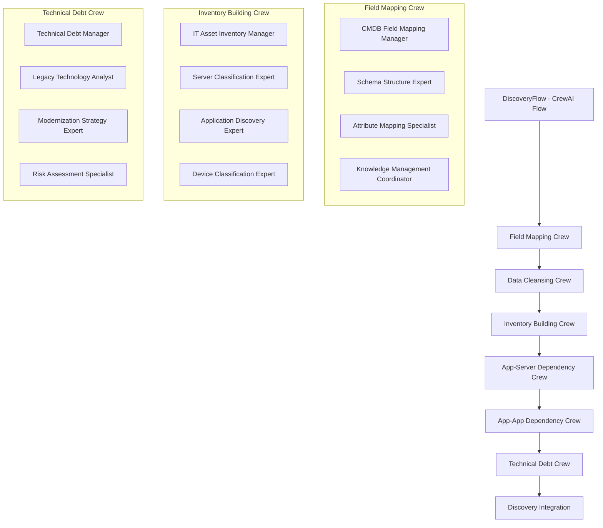

# AI Force Migration Platform - Current Architecture Summary for Coding Agents

## 🎯 **CRITICAL: Current Architecture State (January 2025)**

**This platform has undergone THREE major architectural pivots. You MUST follow the current CrewAI Flow-based architecture and AVOID legacy patterns.**

### **❌ AVOID: Legacy Patterns from Previous Pivots**

#### **Pivot 1: Heuristic-Based Design (DEPRECATED)**
- ❌ Hard-coded rules and static logic
- ❌ Simple AI elements without agent intelligence
- ❌ Manual data processing workflows
- ❌ Static field mapping configurations

#### **Pivot 2: Individual Agent Architecture (SUPERSEDED)**
- ❌ 17 standalone individual agents without crews
- ❌ Direct agent-to-agent communication
- ❌ Simple agent orchestration without flows
- ❌ Basic task distribution patterns

#### **✅ CURRENT: CrewAI Flow-Based Architecture (ACTIVE)**
- ✅ **CrewAI Flows** with @start/@listen decorators
- ✅ **Specialized Crews** with manager agents and hierarchical coordination
- ✅ **Agent Collaboration** within crews using shared memory and knowledge bases
- ✅ **Flow State Management** with proper persistence and phase tracking
- ✅ **Enterprise Features**: Multi-tenancy, learning, and knowledge management

---

## 🏗️ **Current Architecture Overview**

### **CrewAI Flow Architecture (v0.19.1+)**



### **Key Architecture Principles**

1. **CrewAI Flow-First**: All workflows use native CrewAI Flow patterns
2. **Crew-Based Organization**: Specialized crews with manager agents
3. **Hierarchical Coordination**: Manager agents coordinate specialist agents
4. **Shared Memory & Knowledge**: Cross-crew intelligence sharing
5. **Phase-Based Execution**: Sequential crew activation with state validation

---

## 🧠 **CrewAI Implementation Patterns**

### **1. Flow Definition Pattern**
```python
from crewai import Flow
from crewai.flow.flow import listen, start

class DiscoveryFlow(Flow[DiscoveryFlowState]):
    @start()
    def initialize_discovery_flow(self):
        """Initialize flow with comprehensive planning"""
        return {"status": "initialized", "session_id": self.state.session_id}
    
    @listen(initialize_discovery_flow)
    def execute_field_mapping_crew(self, previous_result):
        """Execute field mapping crew with manager coordination"""
        crew = FieldMappingCrew(self.crewai_service, self.context)
        result = crew.kickoff()
        return self._process_crew_result("field_mapping", result)
    
    @listen(execute_field_mapping_crew)
    def execute_data_cleansing_crew(self, previous_result):
        """Execute data cleansing crew using field mapping insights"""
        crew = DataCleansingCrew(self.crewai_service, self.context)
        result = crew.kickoff()
        return self._process_crew_result("data_cleansing", result)
```

### **2. Crew Definition Pattern**
```python
from crewai import Agent, Task, Crew, Process

class FieldMappingCrew:
    def __init__(self, crewai_service, context):
        self.llm = crewai_service.llm
        self.context = context
        
    def create_crew(self):
        # Manager Agent with delegation authority
        manager = Agent(
            role="CMDB Field Mapping Coordination Manager",
            goal="Coordinate comprehensive CMDB field mapping analysis",
            backstory="Senior data architect with 15+ years in enterprise migrations",
            llm=self.llm,
            allow_delegation=True,
            max_delegation=3,
            collaboration=True,
            verbose=True
        )
        
        # Specialist Agents with specific domains
        schema_expert = Agent(
            role="CMDB Schema Structure Analysis Expert",
            goal="Analyze data structure semantics and field relationships",
            backstory="Expert in CMDB schema analysis with deep technical knowledge",
            llm=self.llm,
            collaboration=True,
            tools=self._create_schema_analysis_tools()
        )
        
        return Crew(
            agents=[manager, schema_expert, mapping_specialist],
            tasks=self._create_tasks(),
            process=Process.hierarchical,
            manager_llm=self.llm,
            verbose=True
        )
```

### **3. State Management Pattern**
```python
from pydantic import BaseModel
from typing import Dict, List, Any

class DiscoveryFlowState(BaseModel):
    # Flow identification
    session_id: str = ""
    client_account_id: str = ""
    engagement_id: str = ""
    user_id: str = ""
    
    # Current execution state
    current_phase: str = "initialization"
    crew_status: Dict[str, Dict[str, Any]] = {}
    
    # Results from each crew
    field_mappings: Dict[str, Any] = {}
    cleaned_data: List[Dict[str, Any]] = []
    asset_inventory: Dict[str, List[Dict[str, Any]]] = {}
    app_server_dependencies: Dict[str, Any] = {}
    app_app_dependencies: Dict[str, Any] = {}
    technical_debt_assessment: Dict[str, Any] = {}
    
    # Final integration results
    discovery_summary: Dict[str, Any] = {}
```

---

## 📁 **Current File Structure (What to Use)**

### **✅ ACTIVE: Unified CrewAI Flow Implementation (CONSOLIDATED)**
```
backend/app/services/crewai_flows/
├── unified_discovery_flow.py          # ✅ MAIN: Unified CrewAI Flow (732 lines)
├── crews/                             # ✅ Specialized crew implementations
│   ├── field_mapping_crew.py         # ✅ Field mapping with manager coordination
│   ├── data_cleansing_crew.py         # ✅ Data quality and standardization
│   ├── inventory_building_crew.py     # ✅ Multi-domain asset classification
│   ├── app_server_dependency_crew.py  # ✅ Hosting relationship analysis
│   ├── app_app_dependency_crew.py     # ✅ Application integration mapping
│   └── technical_debt_crew.py         # ✅ Technical debt and 6R preparation
├── tools/                             # ✅ Specialized agent tools
│   ├── schema_analysis_tool.py
│   ├── mapping_confidence_tool.py
│   ├── asset_classification_tool.py
│   └── dependency_analysis_tool.py
└── knowledge_bases/                   # ✅ Domain-specific knowledge
    ├── field_mapping_patterns.json
    ├── asset_classification_rules.json
    └── modernization_strategies.yaml

backend/app/models/
├── unified_discovery_flow_state.py    # ✅ MAIN: Unified state model (477 lines)
└── workflow_state.py                  # ✅ Enhanced database model (238 lines)

backend/app/api/v1/
└── unified_discovery.py               # ✅ MAIN: Unified API endpoints (162 lines)

src/hooks/
└── useUnifiedDiscoveryFlow.ts         # ✅ MAIN: Single frontend hook (302 lines)
```

### **❌ DEPRECATED: Legacy Individual Agents & Competing Implementations**
```
backend/app/services/discovery_agents/      # ❌ DO NOT USE - Individual agents
backend/app/services/sixr_agents_handlers/  # ❌ DO NOT USE - Old agent handlers
backend/app/services/analysis_handlers/     # ❌ DO NOT USE - Heuristic handlers

# REMOVED: Competing implementations (2025-01-21 consolidation)
backend/app/api/v1/discovery/discovery_flow.py     # ❌ REMOVED - 2,206 lines
backend/app/services/crewai_flows/models/flow_state.py  # ❌ REMOVED - 442 lines
backend/app/schemas/flow_schemas.py             # ❌ REMOVED - 63 lines
backend/app/schemas/flow_schemas_new.py         # ❌ REMOVED - 63 lines

# LEGACY: Old discovery flow files (superseded by unified flow)
backend/app/services/crewai_flows/discovery_flow_modular.py  # ❌ SUPERSEDED
backend/app/services/crewai_flows/discovery_flow_state_manager.py  # ❌ SUPERSEDED
```

---

## 🛠️ **Development Guidelines**

### **✅ DO: Current Best Practices**

#### **1. Use Unified CrewAI Flow Patterns**
```python
# ✅ Correct: Unified CrewAI Flow with proper decorators
from app.services.crewai_flows.unified_discovery_flow import UnifiedDiscoveryFlow

class UnifiedDiscoveryFlow(Flow[UnifiedDiscoveryFlowState]):
    @start()
    def initialize_discovery_flow(self):
        return {"status": "initialized", "session_id": self.state.session_id}

    @listen(initialize_discovery_flow)
    def execute_field_mapping_crew(self, previous_result):
        crew = FieldMappingCrew(self.crewai_service, self.context)
        result = crew.kickoff()
        return self._process_crew_result("field_mapping", result)
```

#### **2. Implement Crew-Based Architecture**
```python
# ✅ Correct: Crew with manager and specialists
class FieldMappingCrew:
    def create_crew(self):
        manager = Agent(role="Manager", allow_delegation=True, max_delegation=3)
        specialist1 = Agent(role="Schema Expert", collaboration=True)
        specialist2 = Agent(role="Mapping Specialist", collaboration=True)
        
        return Crew(
            agents=[manager, specialist1, specialist2],
            process=Process.hierarchical,
            manager_llm=self.llm
        )
```

#### **3. Use Unified State Management**
```python
# ✅ Correct: Unified flow state with persistence
from app.models.unified_discovery_flow_state import UnifiedDiscoveryFlowState
from app.models.workflow_state import UnifiedFlowStateRepository

async def _process_crew_result(self, phase: str, result: Any):
    # Update unified flow state
    self.state.crew_status[phase] = {"status": "completed", "result": result}
    self.state.phase_completion[phase] = True
    self.state.progress_percentage = self._calculate_progress()
    
    # Persist to enhanced database model
    repo = UnifiedFlowStateRepository(self.db, self.state.client_account_id)
    await repo.update_workflow_state(self.state.session_id, self.state)
    
    return result
```

### **❌ DON'T: Legacy Patterns to Avoid**

#### **1. Individual Agent Orchestration**
```python
# ❌ Wrong: Direct individual agent calls
agent1 = CMDBAnalystAgent()
result1 = agent1.analyze(data)
agent2 = FieldMappingAgent()
result2 = agent2.map_fields(result1)
```

#### **2. Hard-Coded Heuristics**
```python
# ❌ Wrong: Static rules and heuristics
if field_name.lower() in ['hostname', 'server_name']:
    mapping = 'asset_name'
elif field_name.lower() in ['env', 'environment']:
    mapping = 'environment'
```

#### **3. Simple Service Classes**
```python
# ❌ Wrong: Basic service without CrewAI
class DiscoveryService:
    def analyze_data(self, data):
        # Simple processing without agents
        return processed_data
```

---

## 🔧 **API Integration Patterns**

### **✅ Current Unified API Endpoints**
```python
# Unified Discovery Flow API (ACTIVE) - backend/app/api/v1/unified_discovery.py
@router.post("/api/v1/unified-discovery/flow/initialize")
async def initialize_discovery_flow(request: InitializeFlowRequest):
    """Initialize a new unified discovery flow"""
    flow = create_unified_discovery_flow(
        session_id=session_id,
        client_account_id=request.client_account_id,
        engagement_id=request.engagement_id,
        user_id=request.user_id,
        raw_data=request.raw_data,
        crewai_service=crewai_service,
        context=context
    )
    return await flow.kickoff()

@router.get("/api/v1/unified-discovery/flow/status/{session_id}")
async def get_flow_status(session_id: str):
    """Get current unified flow execution status"""
    # Returns unified flow state with phase completion, crew status, progress
    
@router.post("/api/v1/unified-discovery/flow/execute/{phase}")
async def execute_flow_phase(phase: str, request: Dict[str, Any]):
    """Execute a specific phase of the discovery flow"""
    
@router.get("/api/v1/unified-discovery/flow/health")
async def get_flow_health():
    """Get health status of the unified discovery flow system"""
```

### **❌ Legacy Endpoints to Avoid**
```python
# ❌ DO NOT USE: Individual agent endpoints
@router.post("/api/v1/discovery/agents/cmdb-analyst")  # DEPRECATED
@router.post("/api/v1/discovery/agents/field-mapper")  # DEPRECATED

# ❌ REMOVED: Competing discovery flow endpoints (2025-01-21)
@router.post("/api/v1/discovery/flow/run")              # REMOVED
@router.get("/api/v1/discovery/flow/status/{flow_id}")  # REMOVED
@router.get("/api/v1/discovery/flow/active")            # REMOVED
# ... and 44 other endpoints from discovery_flow.py     # REMOVED

# ❌ DO NOT CREATE: New competing endpoints
# Always use the unified discovery endpoints instead
```

---

## 🧪 **Testing Patterns**

### **✅ Current Unified Testing Approach**
```python
# Test Unified CrewAI Flow execution
async def test_unified_discovery_flow_execution():
    from app.services.crewai_flows.unified_discovery_flow import UnifiedDiscoveryFlow
    
    flow = UnifiedDiscoveryFlow(mock_crewai_service, test_context)
    result = await flow.kickoff()
    
    assert result["status"] == "completed"
    assert flow.state.phase_completion["field_mapping"] == True
    assert flow.state.phase_completion["asset_inventory"] == True
    assert flow.state.progress_percentage == 100.0

# Test crew coordination with unified state
async def test_field_mapping_crew_unified():
    crew = FieldMappingCrew(mock_service, test_context)
    result = crew.kickoff()
    
    assert result["confidence_score"] > 0.8
    assert len(result["unmapped_fields"]) < 5
    assert result["crew_coordination"]["manager_delegations"] > 0

# Test unified frontend hook
def test_useUnifiedDiscoveryFlow():
    from src.hooks.useUnifiedDiscoveryFlow import useUnifiedDiscoveryFlow
    # Test hook integration with unified API endpoints
```

---

## 📊 **Frontend Integration**

### **✅ Current Unified Frontend Patterns**
```typescript
// Use Unified Discovery Flow hook (SINGLE SOURCE OF TRUTH)
import { useUnifiedDiscoveryFlow } from '../../hooks/useUnifiedDiscoveryFlow';

const {
  flowState,
  isLoading,
  error,
  isHealthy,
  initializeFlow,
  executeFlowPhase,
  getPhaseData,
  isPhaseComplete,
  canProceedToPhase,
  refreshFlow
} = useUnifiedDiscoveryFlow();

// Monitor unified flow progress
const UnifiedFlowStatusCard = () => {
  return (
    <Card className="border-l-4 border-l-blue-500">
      <CardHeader>
        <CardTitle>Current Unified Discovery Flow</CardTitle>
        <CardDescription>Session: {flowState.session_id}</CardDescription>
      </CardHeader>
      <CardContent>
        <Progress value={flowState.progress_percentage} />
        <p>Phase: {flowState.current_phase}</p>
        <p>Completed: {Object.values(flowState.phase_completion).filter(Boolean).length}/6</p>
      </CardContent>
    </Card>
  );
};

// All discovery pages use the same unified hook
const AssetInventoryPage = () => {
  const { flowState, executeFlowPhase, getPhaseData } = useUnifiedDiscoveryFlow();
  const inventoryData = getPhaseData('asset_inventory');
  // ...
};
```

### **❌ Legacy Frontend Patterns to Avoid**
```typescript
// ❌ DO NOT USE: Individual agent monitoring
const AgentCard = ({ agentName }) => { /* DEPRECATED */ };

// ❌ DO NOT USE: Heuristic-based displays
const HeuristicResults = ({ rules }) => { /* DEPRECATED */ };

// ❌ REMOVED: Competing discovery hooks (2025-01-21)
import { useDiscoveryFlowState } from '...';     // REMOVED
import { useDataCleansingLogic } from '...';     // REMOVED
import { DiscoveryFlowContext } from '...';      // REMOVED

// ❌ DO NOT CREATE: Multiple discovery state hooks
// Always use useUnifiedDiscoveryFlow for ALL discovery pages
```

---

## 🎯 **Key Success Metrics**

### **Current Architecture Achievements**
- ✅ **CrewAI Flow Integration**: 100% native implementation
- ✅ **Unified Flow Consolidation**: Single source of truth achieved (2025-01-21)
- ✅ **Code Sprawl Elimination**: ~2,774 lines of competing code removed
- ✅ **Crew Coordination**: Manager agents with delegation control
- ✅ **Agent Collaboration**: Cross-crew knowledge sharing
- ✅ **State Management**: Unified flow state with enhanced persistence
- ✅ **Enterprise Features**: Multi-tenancy, learning, knowledge management
- ✅ **Frontend Unification**: All 7 discovery pages use single unified hook

### **Performance Targets**
- **Field Mapping Accuracy**: 95%+ with confidence scoring
- **Processing Speed**: 1-2 seconds for CMDB data analysis
- **Crew Coordination**: < 5 seconds for manager delegation
- **Memory Efficiency**: Agent-level memory with shared knowledge

---

## 🚨 **CRITICAL REMINDERS**

1. **NEVER use individual agent patterns** - Always use CrewAI Crews
2. **NEVER implement hard-coded heuristics** - Use agent intelligence
3. **NEVER create competing implementations** - Use unified discovery flow only
4. **ALWAYS use unified discovery endpoints** - `/api/v1/unified-discovery/flow/*`
5. **ALWAYS use useUnifiedDiscoveryFlow hook** - Single frontend hook for all pages
6. **ALWAYS use CrewAI Flow decorators** - @start/@listen for proper sequencing
7. **ALWAYS implement manager agents** - Hierarchical coordination required
8. **ALWAYS use shared memory and knowledge** - Cross-crew intelligence sharing
9. **ALWAYS persist unified flow state** - Enhanced database model with multi-tenancy
10. **ALWAYS test crew coordination** - Verify manager delegation and agent collaboration

---

## 📋 **Quick Reference Commands**

### **Start Development**
```bash
# Always use Docker containers
docker-compose up -d --build

# Access backend for debugging unified flow
docker exec -it migration_backend python -c "
from app.services.crewai_flows.unified_discovery_flow import UnifiedDiscoveryFlow
from app.models.unified_discovery_flow_state import UnifiedDiscoveryFlowState
print('Unified CrewAI Flow implementation active')
print('Single source of truth architecture confirmed')
"
```

### **Test Unified Architecture**
```bash
# Test Unified CrewAI Flow
docker exec -it migration_backend python -m pytest tests/backend/flows/test_unified_discovery_flow.py

# Test crew coordination
docker exec -it migration_backend python -m pytest tests/crews/test_field_mapping_crew.py

# Test unified frontend hook
npm test -- useUnifiedDiscoveryFlow
```

### **Verify Unified Implementation**
```bash
# Check for legacy patterns (should return empty)
docker exec -it migration_backend find . -name "*individual_agent*" -o -name "*heuristic*"

# Verify competing implementations removed (should return empty)
docker exec -it migration_backend find . -name "*discovery_flow.py" -path "*/api/v1/discovery/*"

# Verify unified CrewAI Flow files exist
docker exec -it migration_backend ls -la app/services/crewai_flows/unified_discovery_flow.py
docker exec -it migration_backend ls -la app/models/unified_discovery_flow_state.py
docker exec -it migration_backend ls -la app/api/v1/unified_discovery.py
```

---

## 🎪 **Final Architecture State**

**The AI Force Migration Platform is now a mature, UNIFIED CrewAI Flow-based system with:**

- **Single Unified Discovery Flow** - All code sprawl eliminated (2025-01-21)
- **Native CrewAI Flows** for workflow orchestration
- **Specialized Crews** with manager coordination
- **Agent Collaboration** within and across crews
- **Shared Memory & Knowledge** for intelligence continuity
- **Enterprise Multi-Tenancy** with proper isolation
- **Learning Capabilities** that improve over time
- **Unified State Management** with enhanced database persistence
- **Single Frontend Hook** for all discovery pages
- **Consolidated API Endpoints** with no competing implementations

## 🌟 **CONSOLIDATION ACHIEVEMENT (2025-01-21)**

**✅ COMPLETED: Unified Discovery Flow Consolidation Plan**
- **Eliminated**: ~2,774 lines of competing/duplicate code
- **Unified**: Single source of truth for all discovery operations
- **Connected**: All 7 discovery pages to unified flow
- **Simplified**: Architecture following CrewAI best practices
- **Enhanced**: Real-time flow state across all pages

**Any coding agent working on this platform MUST use the UNIFIED CrewAI Flow-based architecture and avoid all legacy patterns from previous pivots and competing implementations.**