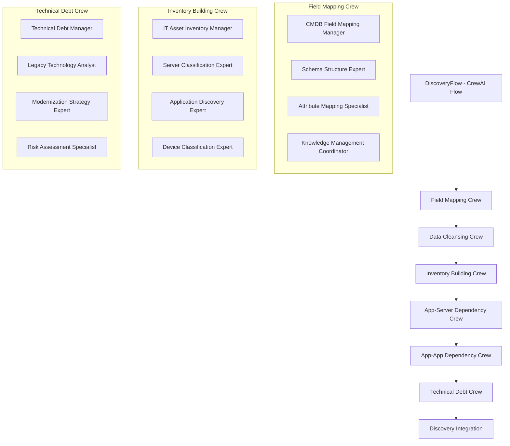

# AI Force Migration Platform - Current Architecture Summary for Coding Agents

## 🎯 **CRITICAL: Current Architecture State (January 2025)**

**This platform has undergone THREE major architectural pivots. You MUST follow the current CrewAI Flow-based architecture and AVOID legacy patterns.**

### **❌ AVOID: Legacy Patterns from Previous Pivots**

#### **Pivot 1: Heuristic-Based Design (DEPRECATED)**
- ❌ Hard-coded rules and static logic
- ❌ Simple AI elements without agent intelligence
- ❌ Manual data processing workflows
- ❌ Static field mapping configurations

#### **Pivot 2: Individual Agent Architecture (SUPERSEDED)**
- ❌ 17 standalone individual agents without crews
- ❌ Direct agent-to-agent communication
- ❌ Simple agent orchestration without flows
- ❌ Basic task distribution patterns

#### **✅ CURRENT: CrewAI Flow-Based Architecture (ACTIVE)**
- ✅ **CrewAI Flows** with @start/@listen decorators
- ✅ **Specialized Crews** with manager agents and hierarchical coordination
- ✅ **Agent Collaboration** within crews using shared memory and knowledge bases
- ✅ **Flow State Management** with proper persistence and phase tracking
- ✅ **Enterprise Features**: Multi-tenancy, learning, and knowledge management

---

## 🏗️ **Current Architecture Overview**

### **CrewAI Flow Architecture (v0.19.1+)**



### **Key Architecture Principles**

1. **CrewAI Flow-First**: All workflows use native CrewAI Flow patterns
2. **Crew-Based Organization**: Specialized crews with manager agents
3. **Hierarchical Coordination**: Manager agents coordinate specialist agents
4. **Shared Memory & Knowledge**: Cross-crew intelligence sharing
5. **Phase-Based Execution**: Sequential crew activation with state validation

---

## 🧠 **CrewAI Implementation Patterns**

### **1. Flow Definition Pattern**
```python
from crewai import Flow
from crewai.flow.flow import listen, start

class DiscoveryFlow(Flow[DiscoveryFlowState]):
    @start()
    def initialize_discovery_flow(self):
        """Initialize flow with comprehensive planning"""
        return {"status": "initialized", "session_id": self.state.session_id}
    
    @listen(initialize_discovery_flow)
    def execute_field_mapping_crew(self, previous_result):
        """Execute field mapping crew with manager coordination"""
        crew = FieldMappingCrew(self.crewai_service, self.context)
        result = crew.kickoff()
        return self._process_crew_result("field_mapping", result)
    
    @listen(execute_field_mapping_crew)
    def execute_data_cleansing_crew(self, previous_result):
        """Execute data cleansing crew using field mapping insights"""
        crew = DataCleansingCrew(self.crewai_service, self.context)
        result = crew.kickoff()
        return self._process_crew_result("data_cleansing", result)
```

### **2. Crew Definition Pattern**
```python
from crewai import Agent, Task, Crew, Process

class FieldMappingCrew:
    def __init__(self, crewai_service, context):
        self.llm = crewai_service.llm
        self.context = context
        
    def create_crew(self):
        # Manager Agent with delegation authority
        manager = Agent(
            role="CMDB Field Mapping Coordination Manager",
            goal="Coordinate comprehensive CMDB field mapping analysis",
            backstory="Senior data architect with 15+ years in enterprise migrations",
            llm=self.llm,
            allow_delegation=True,
            max_delegation=3,
            collaboration=True,
            verbose=True
        )
        
        # Specialist Agents with specific domains
        schema_expert = Agent(
            role="CMDB Schema Structure Analysis Expert",
            goal="Analyze data structure semantics and field relationships",
            backstory="Expert in CMDB schema analysis with deep technical knowledge",
            llm=self.llm,
            collaboration=True,
            tools=self._create_schema_analysis_tools()
        )
        
        return Crew(
            agents=[manager, schema_expert, mapping_specialist],
            tasks=self._create_tasks(),
            process=Process.hierarchical,
            manager_llm=self.llm,
            verbose=True
        )
```

### **3. State Management Pattern**
```python
from pydantic import BaseModel
from typing import Dict, List, Any

class DiscoveryFlowState(BaseModel):
    # Flow identification
    session_id: str = ""
    client_account_id: str = ""
    engagement_id: str = ""
    user_id: str = ""
    
    # Current execution state
    current_phase: str = "initialization"
    crew_status: Dict[str, Dict[str, Any]] = {}
    
    # Results from each crew
    field_mappings: Dict[str, Any] = {}
    cleaned_data: List[Dict[str, Any]] = []
    asset_inventory: Dict[str, List[Dict[str, Any]]] = {}
    app_server_dependencies: Dict[str, Any] = {}
    app_app_dependencies: Dict[str, Any] = {}
    technical_debt_assessment: Dict[str, Any] = {}
    
    # Final integration results
    discovery_summary: Dict[str, Any] = {}
```

---

## 📁 **Current File Structure (What to Use)**

### **✅ ACTIVE: CrewAI Flow Implementation**
```
backend/app/services/crewai_flows/
├── discovery_flow_modular.py          # ✅ Main CrewAI Flow implementation
├── discovery_flow_state_manager.py    # ✅ State persistence and management
├── crews/                             # ✅ Specialized crew implementations
│   ├── field_mapping_crew.py         # ✅ Field mapping with manager coordination
│   ├── data_cleansing_crew.py         # ✅ Data quality and standardization
│   ├── inventory_building_crew.py     # ✅ Multi-domain asset classification
│   ├── app_server_dependency_crew.py  # ✅ Hosting relationship analysis
│   ├── app_app_dependency_crew.py     # ✅ Application integration mapping
│   └── technical_debt_crew.py         # ✅ Technical debt and 6R preparation
├── tools/                             # ✅ Specialized agent tools
│   ├── schema_analysis_tool.py
│   ├── mapping_confidence_tool.py
│   ├── asset_classification_tool.py
│   └── dependency_analysis_tool.py
└── knowledge_bases/                   # ✅ Domain-specific knowledge
    ├── field_mapping_patterns.json
    ├── asset_classification_rules.json
    └── modernization_strategies.yaml
```

### **❌ DEPRECATED: Legacy Individual Agents**
```
backend/app/services/discovery_agents/  # ❌ DO NOT USE - Individual agents
backend/app/services/sixr_agents_handlers/  # ❌ DO NOT USE - Old agent handlers
backend/app/services/analysis_handlers/     # ❌ DO NOT USE - Heuristic handlers
```

---

## 🛠️ **Development Guidelines**

### **✅ DO: Current Best Practices**

#### **1. Use CrewAI Flow Patterns**
```python
# ✅ Correct: CrewAI Flow with proper decorators
@start()
def initialize_discovery_flow(self):
    return {"status": "initialized"}

@listen(initialize_discovery_flow)
def execute_field_mapping_crew(self, previous_result):
    crew = FieldMappingCrew(self.crewai_service, self.context)
    return crew.kickoff()
```

#### **2. Implement Crew-Based Architecture**
```python
# ✅ Correct: Crew with manager and specialists
class FieldMappingCrew:
    def create_crew(self):
        manager = Agent(role="Manager", allow_delegation=True, max_delegation=3)
        specialist1 = Agent(role="Schema Expert", collaboration=True)
        specialist2 = Agent(role="Mapping Specialist", collaboration=True)
        
        return Crew(
            agents=[manager, specialist1, specialist2],
            process=Process.hierarchical,
            manager_llm=self.llm
        )
```

#### **3. Use Proper State Management**
```python
# ✅ Correct: Flow state with persistence
async def _process_crew_result(self, phase: str, result: Any):
    # Update flow state
    self.state.crew_status[phase] = {"status": "completed", "result": result}
    
    # Persist state
    await self.state_manager.update_workflow_state(
        self.state.session_id, 
        self.state
    )
    
    return result
```

### **❌ DON'T: Legacy Patterns to Avoid**

#### **1. Individual Agent Orchestration**
```python
# ❌ Wrong: Direct individual agent calls
agent1 = CMDBAnalystAgent()
result1 = agent1.analyze(data)
agent2 = FieldMappingAgent()
result2 = agent2.map_fields(result1)
```

#### **2. Hard-Coded Heuristics**
```python
# ❌ Wrong: Static rules and heuristics
if field_name.lower() in ['hostname', 'server_name']:
    mapping = 'asset_name'
elif field_name.lower() in ['env', 'environment']:
    mapping = 'environment'
```

#### **3. Simple Service Classes**
```python
# ❌ Wrong: Basic service without CrewAI
class DiscoveryService:
    def analyze_data(self, data):
        # Simple processing without agents
        return processed_data
```

---

## 🔧 **API Integration Patterns**

### **✅ Current API Endpoints**
```python
# Discovery Flow API (ACTIVE)
@router.post("/api/v1/discovery/flow/run")
async def run_discovery_flow(request: DiscoveryFlowRequest):
    """Initialize and run CrewAI Discovery Flow"""
    flow = DiscoveryFlow(crewai_service, context)
    return await flow.kickoff()

@router.get("/api/v1/discovery/flow/status")
async def get_flow_status(session_id: str):
    """Get current flow execution status"""
    return await flow_state_manager.get_workflow_state(session_id)
```

### **❌ Legacy Endpoints to Avoid**
```python
# ❌ DO NOT USE: Individual agent endpoints
@router.post("/api/v1/discovery/agents/cmdb-analyst")  # DEPRECATED
@router.post("/api/v1/discovery/agents/field-mapper")  # DEPRECATED
```

---

## 🧪 **Testing Patterns**

### **✅ Current Testing Approach**
```python
# Test CrewAI Flow execution
async def test_discovery_flow_execution():
    flow = DiscoveryFlow(mock_crewai_service, test_context)
    result = await flow.kickoff()
    
    assert result["status"] == "completed"
    assert "field_mappings" in result
    assert "asset_inventory" in result

# Test crew coordination
async def test_field_mapping_crew():
    crew = FieldMappingCrew(mock_service, test_context)
    result = crew.kickoff()
    
    assert result["confidence_score"] > 0.8
    assert len(result["unmapped_fields"]) < 5
```

---

## 📊 **Frontend Integration**

### **✅ Current Frontend Patterns**
```typescript
// Use Discovery Flow hooks
const { flowState, initializeFlow, executePhase } = useDiscoveryFlowState();

// Monitor crew progress
const CrewStatusCard = ({ crewName, status }) => {
  return (
    <Card>
      <CardHeader>{crewName} Crew</CardHeader>
      <CardContent>
        <Progress value={status.progress} />
        <p>Manager: {status.manager_status}</p>
        <p>Agents: {status.agent_count}</p>
      </CardContent>
    </Card>
  );
};
```

### **❌ Legacy Frontend Patterns to Avoid**
```typescript
// ❌ DO NOT USE: Individual agent monitoring
const AgentCard = ({ agentName }) => { /* DEPRECATED */ };

// ❌ DO NOT USE: Heuristic-based displays
const HeuristicResults = ({ rules }) => { /* DEPRECATED */ };
```

---

## 🎯 **Key Success Metrics**

### **Current Architecture Achievements**
- ✅ **CrewAI Flow Integration**: 100% native implementation
- ✅ **Crew Coordination**: Manager agents with delegation control
- ✅ **Agent Collaboration**: Cross-crew knowledge sharing
- ✅ **State Management**: Persistent flow state with phase tracking
- ✅ **Enterprise Features**: Multi-tenancy, learning, knowledge management

### **Performance Targets**
- **Field Mapping Accuracy**: 95%+ with confidence scoring
- **Processing Speed**: 1-2 seconds for CMDB data analysis
- **Crew Coordination**: < 5 seconds for manager delegation
- **Memory Efficiency**: Agent-level memory with shared knowledge

---

## 🚨 **CRITICAL REMINDERS**

1. **NEVER use individual agent patterns** - Always use CrewAI Crews
2. **NEVER implement hard-coded heuristics** - Use agent intelligence
3. **ALWAYS use CrewAI Flow decorators** - @start/@listen for proper sequencing
4. **ALWAYS implement manager agents** - Hierarchical coordination required
5. **ALWAYS use shared memory and knowledge** - Cross-crew intelligence sharing
6. **ALWAYS persist flow state** - Proper state management for enterprise use
7. **ALWAYS test crew coordination** - Verify manager delegation and agent collaboration

---

## 📋 **Quick Reference Commands**

### **Start Development**
```bash
# Always use Docker containers
docker-compose up -d --build

# Access backend for debugging
docker exec -it migration_backend python -c "
from app.services.crewai_flows.discovery_flow_modular import DiscoveryFlow
print('CrewAI Flow implementation active')
"
```

### **Test Current Architecture**
```bash
# Test CrewAI Flow
docker exec -it migration_backend python -m pytest tests/flows/test_discovery_flow_sequence.py

# Test crew coordination
docker exec -it migration_backend python -m pytest tests/crews/test_field_mapping_crew.py
```

### **Verify Current Implementation**
```bash
# Check for legacy patterns (should return empty)
docker exec -it migration_backend find . -name "*individual_agent*" -o -name "*heuristic*"

# Verify CrewAI Flow files exist
docker exec -it migration_backend ls -la app/services/crewai_flows/
```

---

## 🎪 **Final Architecture State**

**The AI Force Migration Platform is now a mature CrewAI Flow-based system with:**

- **Native CrewAI Flows** for workflow orchestration
- **Specialized Crews** with manager coordination
- **Agent Collaboration** within and across crews
- **Shared Memory & Knowledge** for intelligence continuity
- **Enterprise Multi-Tenancy** with proper isolation
- **Learning Capabilities** that improve over time
- **Comprehensive State Management** for enterprise reliability

**Any coding agent working on this platform MUST use the current CrewAI Flow-based architecture and avoid all legacy patterns from the previous two pivots.**