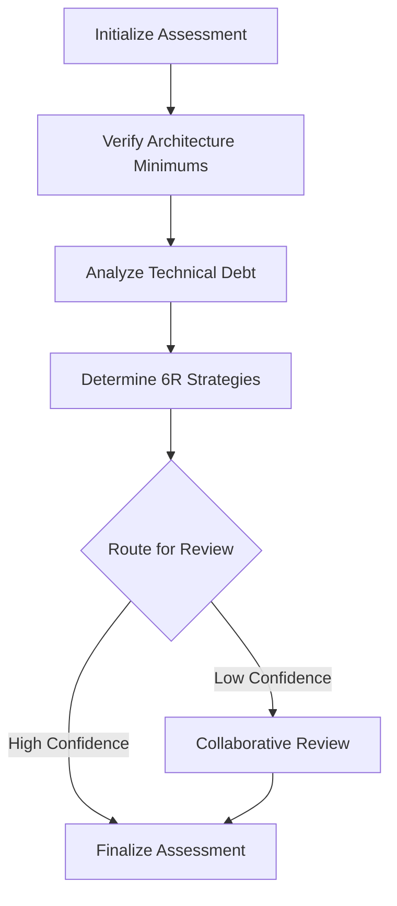

# Assessment Flow Design Document

## Executive Summary

The Assessment Flow is the second major CrewAI flow in the AI Modernize Migration Platform, following the Discovery Flow. It takes selected applications from the inventory page and performs comprehensive assessment to determine the optimal 6R migration strategy for each application and its components. The flow operates independently from Discovery, consuming the curated application inventory marked as "ready for assessment".

## Flow Overview

### Purpose
- Accept selected applications marked "ready for assessment" from the curated inventory
- Capture and verify architecture minimums at engagement and application levels
- Analyze technical debt based on discovered metadata and patterns
- Determine optimal 6R strategy for each application component (frontend, middleware, backend, etc.)
- Enable user review and refinement at each flow node
- Generate comprehensive "App on a page" view for each application

### 6R Strategy Hierarchy
The platform uses an enhanced 6R model with the following modernization hierarchy:
- **Rewrite** > **ReArchitect** > **Refactor** > **Replatform** > **Rehost** > **Retain/Retire/Repurchase**

Note: Repurchase and Retain fall outside the platform's modernization scope, while Retire is handled by the Decommission module.

### Flow Boundaries
- **Starts**: Application selection from inventory page (apps marked "ready for assessment")
- **Ends**: Finalized 6R treatment decisions with apps marked "ready for planning"
- **Next Flow**: Planning Flow will consume 6R decisions for move group formation and wave planning

## Architecture Design

### Flow Structure



### CrewAI Flow Implementation

```python
class UnifiedAssessmentFlow(Flow[AssessmentFlowState]):
    """
    Unified CrewAI Flow for assessing applications and determining component-level 6R strategies.
    Follows the same patterns as UnifiedDiscoveryFlow with PostgreSQL-only persistence.
    """
    
    def __init__(self, crewai_service: CrewAIService, context: FlowContext):
        super().__init__()
        self.crewai_service = crewai_service
        self.context = context
        self.state_manager = FlowStateManager(context.flow_id)
        self.postgres_store = PostgresStore(context.flow_id)
    
    @start()
    def initialize_assessment(self):
        """
        Initialize flow with selected applications from inventory
        - Load selected applications marked "ready for assessment"
        - Create assessment flow record with multi-tenant context
        - Initialize PostgreSQL-based state tracking
        - Set up flow pause points for user interaction
        """
        
    @listen(initialize_assessment)
    def capture_architecture_minimums(self, init_result):
        """
        Capture and verify architecture requirements at multiple levels
        - Capture engagement-level architecture minimums with RBAC controls
        - Allow app-specific modifications based on technology stack
        - Calculate tech debt based on supported versions
        - Flag exceptions that will be shown on "App on a page"
        - PAUSE for user input and review
        """
        
    @listen(capture_architecture_minimums)
    def analyze_technical_debt(self, arch_result):
        """
        Analyze tech debt for selected applications and identify components
        - Component identification (flexible beyond 3-tier architecture)
        - Tech debt analysis based on discovered metadata
        - Security and compliance gap assessment
        - Dependency and coupling analysis
        - Performance and scalability evaluation
        - PAUSE for user clarification and input
        """
        
    @listen(analyze_technical_debt)
    def determine_component_sixr_strategies(self, tech_debt_result):
        """
        Determine 6R treatment for each application component
        - Analyze component-level characteristics (frontend, middleware, backend, etc.)
        - Consider technical debt impact and architecture exceptions
        - Validate component treatment compatibility
        - Calculate app-level strategy (highest modernization component)
        - Generate detailed rationale for each recommendation
        - PAUSE for user review
        """
        
    @listen(determine_component_sixr_strategies)
    def generate_app_on_page(self, strategies_result):
        """
        Generate comprehensive "App on a page" view
        - Consolidate all application details and assessments
        - Include tech debt analysis and scores
        - Show architectural insights and exceptions
        - Display component-level 6R treatments
        - Include dependencies and ownership information
        - Present rationale for recommendations
        - PAUSE for final user review and modifications
        """
        
    @listen(generate_app_on_page)
    def finalize_assessment(self, review_result):
        """
        Finalize and persist 6R decisions
        - Save all decisions and modifications to PostgreSQL
        - Update application attributes with assessment results
        - Mark applications as "ready for planning"
        - Persist all user inputs and overrides
        - Generate assessment summary report
        - Enable flow completion or re-assessment capability
        """
```

## Data Models

### AssessmentFlowState

```python
from pydantic import BaseModel
from typing import List, Dict, Optional, Any
from datetime import datetime
from enum import Enum

class SixRStrategy(str, Enum):
    REWRITE = "rewrite"
    REARCHITECT = "rearchitect"
    REFACTOR = "refactor"
    REPLATFORM = "replatform"
    REHOST = "rehost"
    REPURCHASE = "repurchase"
    RETIRE = "retire"
    RETAIN = "retain"

class ArchitectureRequirement(BaseModel):
    requirement_type: str  # security, compliance, patterns, etc.
    description: str
    level: str  # engagement or application
    mandatory: bool
    supported_versions: Optional[Dict[str, str]]  # For tech stack versioning
    exceptions: Optional[List[str]]  # App-specific exceptions
    verification_status: Optional[str]
    verified_at: Optional[datetime]
    modified_by: Optional[str]  # RBAC tracking

class TechDebtItem(BaseModel):
    category: str  # security, performance, maintainability, etc.
    severity: str  # critical, high, medium, low
    description: str
    remediation_effort_hours: int
    impact_on_migration: str

class ComponentTreatment(BaseModel):
    component_name: str  # frontend, middleware, backend, or custom
    component_type: str  # UI, API, DB, service, etc.
    recommended_strategy: SixRStrategy
    rationale: str
    compatibility_validated: bool

class SixRDecision(BaseModel):
    application_id: str
    application_name: str
    component_treatments: List[ComponentTreatment]
    overall_strategy: SixRStrategy  # Highest modernization from components
    confidence_score: float
    rationale: str
    architecture_exceptions: List[str]
    tech_debt_score: float
    risk_factors: List[str]
    estimated_effort: int
    estimated_cost: float
    move_group_hints: List[str]  # Technology proximity, dependencies
    user_modifications: Optional[Dict[str, Any]]
    modified_by: Optional[str]
    modified_at: Optional[datetime]

class AssessmentFlowState(BaseModel):
    flow_id: str
    client_account_id: int
    engagement_id: int
    selected_application_ids: List[str]
    
    # Architecture requirements
    engagement_architecture_standards: List[ArchitectureRequirement]
    application_architecture_overrides: Dict[str, List[ArchitectureRequirement]]
    architecture_captured: bool = False
    
    # Component identification
    application_components: Dict[str, List[ComponentTreatment]]
    
    # Tech debt analysis
    tech_debt_analysis: Dict[str, List[TechDebtItem]]
    component_tech_debt: Dict[str, Dict[str, float]]  # app_id -> component -> score
    
    # 6R decisions
    sixr_decisions: Dict[str, SixRDecision]
    
    # User interaction tracking
    pause_points: List[str]  # Nodes where flow paused for input
    user_inputs: Dict[str, Any]  # Captured user inputs at each node
    
    # Flow metadata
    status: str  # initialized, in_progress, paused, completed
    progress: int = 0
    current_phase: str
    next_phase: Optional[str]  # Auto-adjusted based on navigation
    phase_results: Dict[str, Any]
    agent_insights: List[Dict[str, Any]]
    
    # Readiness tracking
    apps_ready_for_planning: List[str]
    
    # Timestamps
    created_at: datetime
    updated_at: datetime
    last_user_interaction: Optional[datetime]
    completed_at: Optional[datetime]
```

## Database Schema

### Core Tables

```sql
-- Assessment flow tracking (PostgreSQL-only, no SQLite)
CREATE TABLE assessment_flows (
    id UUID PRIMARY KEY DEFAULT gen_random_uuid(),
    client_account_id INTEGER NOT NULL,
    engagement_id INTEGER NOT NULL,
    selected_application_ids JSONB NOT NULL,
    architecture_captured BOOLEAN DEFAULT FALSE,
    status VARCHAR(50) NOT NULL DEFAULT 'initialized',
    progress INTEGER DEFAULT 0,
    current_phase VARCHAR(100),
    next_phase VARCHAR(100),
    pause_points JSONB DEFAULT '[]',
    user_inputs JSONB DEFAULT '{}',
    phase_results JSONB DEFAULT '{}',
    agent_insights JSONB DEFAULT '[]',
    apps_ready_for_planning JSONB DEFAULT '[]',
    last_user_interaction TIMESTAMP,
    created_at TIMESTAMP DEFAULT NOW(),
    updated_at TIMESTAMP DEFAULT NOW(),
    completed_at TIMESTAMP,
    CONSTRAINT valid_progress CHECK (progress >= 0 AND progress <= 100)
);

-- Engagement-level architecture standards
CREATE TABLE engagement_architecture_standards (
    id UUID PRIMARY KEY DEFAULT gen_random_uuid(),
    engagement_id INTEGER NOT NULL,
    requirement_type VARCHAR(100) NOT NULL,
    description TEXT,
    mandatory BOOLEAN DEFAULT TRUE,
    supported_versions JSONB,  -- {"java": "11+", "python": "3.8+"}
    requirement_details JSONB,
    created_by VARCHAR(100),
    created_at TIMESTAMP DEFAULT NOW(),
    updated_at TIMESTAMP DEFAULT NOW(),
    CONSTRAINT unique_engagement_requirement UNIQUE (engagement_id, requirement_type)
);

-- Application-specific architecture overrides
CREATE TABLE application_architecture_overrides (
    id UUID PRIMARY KEY DEFAULT gen_random_uuid(),
    assessment_flow_id UUID REFERENCES assessment_flows(id) ON DELETE CASCADE,
    application_id UUID NOT NULL,
    standard_id UUID REFERENCES engagement_architecture_standards(id),
    override_type VARCHAR(100) NOT NULL,  -- exception, modification, addition
    override_details JSONB,
    rationale TEXT,
    approved_by VARCHAR(100),
    created_at TIMESTAMP DEFAULT NOW()
);

-- Application components identification
CREATE TABLE application_components (
    id UUID PRIMARY KEY DEFAULT gen_random_uuid(),
    assessment_flow_id UUID REFERENCES assessment_flows(id) ON DELETE CASCADE,
    application_id UUID NOT NULL,
    component_name VARCHAR(255) NOT NULL,
    component_type VARCHAR(100) NOT NULL,  -- frontend, middleware, backend, service, etc.
    technology_stack JSONB,
    dependencies JSONB,  -- Other components this depends on
    created_at TIMESTAMP DEFAULT NOW(),
    CONSTRAINT unique_app_component UNIQUE (assessment_flow_id, application_id, component_name)
);

-- Tech debt analysis results (component-aware)
CREATE TABLE tech_debt_analysis (
    id UUID PRIMARY KEY DEFAULT gen_random_uuid(),
    assessment_flow_id UUID REFERENCES assessment_flows(id) ON DELETE CASCADE,
    application_id UUID NOT NULL,
    component_id UUID REFERENCES application_components(id),
    debt_category VARCHAR(100) NOT NULL,
    severity VARCHAR(20) NOT NULL CHECK (severity IN ('critical', 'high', 'medium', 'low')),
    description TEXT NOT NULL,
    remediation_effort_hours INTEGER,
    impact_on_migration TEXT,
    tech_debt_score FLOAT,
    detected_by_agent VARCHAR(100),
    agent_confidence FLOAT CHECK (agent_confidence >= 0 AND agent_confidence <= 1),
    created_at TIMESTAMP DEFAULT NOW()
);

-- Component-level 6R treatments
CREATE TABLE component_treatments (
    id UUID PRIMARY KEY DEFAULT gen_random_uuid(),
    assessment_flow_id UUID REFERENCES assessment_flows(id) ON DELETE CASCADE,
    application_id UUID NOT NULL,
    component_id UUID REFERENCES application_components(id),
    recommended_strategy VARCHAR(20) NOT NULL CHECK (recommended_strategy IN ('rewrite', 'rearchitect', 'refactor', 'replatform', 'rehost', 'repurchase', 'retire', 'retain')),
    rationale TEXT,
    compatibility_validated BOOLEAN DEFAULT FALSE,
    compatibility_issues JSONB,
    created_at TIMESTAMP DEFAULT NOW(),
    CONSTRAINT unique_component_treatment UNIQUE (assessment_flow_id, component_id)
);

-- Application-level 6R decisions (with component rollup)
CREATE TABLE sixr_decisions (
    id UUID PRIMARY KEY DEFAULT gen_random_uuid(),
    assessment_flow_id UUID REFERENCES assessment_flows(id) ON DELETE CASCADE,
    application_id UUID NOT NULL,
    application_name VARCHAR(255) NOT NULL,
    overall_strategy VARCHAR(20) NOT NULL CHECK (overall_strategy IN ('rewrite', 'rearchitect', 'refactor', 'replatform', 'rehost', 'repurchase', 'retire', 'retain')),
    confidence_score FLOAT CHECK (confidence_score >= 0 AND confidence_score <= 1),
    rationale TEXT,
    architecture_exceptions JSONB DEFAULT '[]',
    tech_debt_score FLOAT,
    risk_factors JSONB DEFAULT '[]',
    move_group_hints JSONB DEFAULT '[]',  -- Technology proximity, dependencies
    estimated_effort_hours INTEGER,
    estimated_cost DECIMAL(12, 2),
    
    -- User modifications tracking
    user_modifications JSONB,
    modified_by VARCHAR(100),
    modified_at TIMESTAMP,
    
    -- App on a page data
    app_on_page_data JSONB,  -- Complete consolidated view
    
    -- Metadata
    decision_factors JSONB,
    ready_for_planning BOOLEAN DEFAULT FALSE,
    created_at TIMESTAMP DEFAULT NOW(),
    updated_at TIMESTAMP DEFAULT NOW(),
    
    -- Ensure unique decision per application per flow
    CONSTRAINT unique_app_decision UNIQUE (assessment_flow_id, application_id)
);

-- Learning feedback table
CREATE TABLE assessment_learning_feedback (
    id UUID PRIMARY KEY DEFAULT gen_random_uuid(),
    assessment_flow_id UUID REFERENCES assessment_flows(id) ON DELETE CASCADE,
    decision_id UUID REFERENCES sixr_decisions(id) ON DELETE CASCADE,
    original_strategy VARCHAR(20) NOT NULL,
    override_strategy VARCHAR(20) NOT NULL,
    feedback_reason TEXT,
    agent_id VARCHAR(100),
    learned_pattern JSONB,
    created_at TIMESTAMP DEFAULT NOW()
);

-- Indexes for performance
CREATE INDEX idx_assessment_flows_status ON assessment_flows(status);
CREATE INDEX idx_assessment_flows_client ON assessment_flows(client_account_id, engagement_id);
CREATE INDEX idx_assessment_flows_phase ON assessment_flows(current_phase, next_phase);
CREATE INDEX idx_eng_arch_standards ON engagement_architecture_standards(engagement_id);
CREATE INDEX idx_app_components ON application_components(application_id);
CREATE INDEX idx_component_treatments ON component_treatments(application_id, recommended_strategy);
CREATE INDEX idx_sixr_decisions_app ON sixr_decisions(application_id);
CREATE INDEX idx_sixr_ready_planning ON sixr_decisions(ready_for_planning);
CREATE INDEX idx_tech_debt_severity ON tech_debt_analysis(severity);
CREATE INDEX idx_tech_debt_component ON tech_debt_analysis(component_id);
```

## Crew Architecture

### 1. Architecture Standards Crew

```python
class ArchitectureStandardsCrew:
    """Captures and evaluates architecture requirements with user collaboration"""
    
    agents = [
        {
            "role": "Architecture Standards Agent",
            "goal": "Define and evaluate engagement-level architecture minimums",
            "backstory": "Expert in cloud architecture patterns and version lifecycle management"
        },
        {
            "role": "Technology Stack Analyst",
            "goal": "Assess application technology stacks against supported versions",
            "backstory": "Specialist in technology lifecycle and version compatibility"
        },
        {
            "role": "Exception Handler Agent",
            "goal": "Identify and document valid architecture exceptions",
            "backstory": "Expert in evaluating business constraints and technical trade-offs"
        }
    ]
    
    tasks = [
        "Capture engagement-level architecture minimums from user input",
        "Analyze each application's technology stack",
        "Calculate version-based technical debt",
        "Identify and document architecture exceptions",
        "Generate architecture compliance summary"
    ]
```

### 2. Component Analysis and Tech Debt Crew

```python
class ComponentAnalysisCrew:
    """Identifies components and analyzes technical debt based on discovered metadata"""
    
    agents = [
        {
            "role": "Component Discovery Agent",
            "goal": "Identify application components beyond traditional 3-tier",
            "backstory": "Expert in modern application architectures and microservices"
        },
        {
            "role": "Metadata Analyst",
            "goal": "Analyze technical debt from discovered application metadata",
            "backstory": "Specialist in pattern recognition and metadata analysis"
        },
        {
            "role": "Dependency Mapper",
            "goal": "Map component dependencies and coupling patterns",
            "backstory": "Expert in dependency analysis and architectural coupling"
        }
    ]
    
    tasks = [
        "Identify all application components (UI, API, services, data layers)",
        "Analyze technical debt from Discovery metadata",
        "Map inter-component dependencies",
        "Calculate component-level tech debt scores",
        "Identify coupling and affinity patterns for move groups"
    ]
```

### 3. Six R Strategy Crew

```python
class SixRStrategyCrew:
    """Determines component-level 6R strategies with validation"""
    
    agents = [
        {
            "role": "Component Strategy Expert",
            "goal": "Recommend optimal 6R strategy for each component",
            "backstory": "Expert in component-level modernization strategies"
        },
        {
            "role": "Compatibility Validator",
            "goal": "Validate treatment compatibility between dependent components",
            "backstory": "Specialist in architectural compatibility and integration patterns"
        },
        {
            "role": "Move Group Advisor",
            "goal": "Identify move group hints based on technology and dependencies",
            "backstory": "Expert in migration wave planning and application grouping"
        }
    ]
    
    tasks = [
        "Analyze each component's characteristics and constraints",
        "Determine optimal 6R strategy per component",
        "Validate compatibility between component treatments",
        "Calculate overall application strategy (highest modernization)",
        "Generate move group hints for Planning Flow",
        "Create comprehensive rationale with architecture exceptions"
    ]
```

## API Endpoints

### API v3 Assessment Flow Endpoints

```yaml
# Initialize Assessment Flow
POST /api/v1/assessment-flow/initialize
Request:
  {
    "selected_application_ids": ["uuid1", "uuid2", ...]
  }
Headers:
  X-Client-Account-ID: 123
  X-Engagement-ID: 456
Response:
  {
    "flow_id": "uuid",
    "status": "initialized",
    "current_phase": "architecture_minimums",
    "next_phase": "architecture_minimums"
  }

# Get Assessment Flow Status
GET /api/v1/assessment-flow/{flow_id}/status
Response:
  {
    "flow_id": "uuid",
    "status": "paused",
    "progress": 45,
    "current_phase": "tech_debt_analysis",
    "next_phase": "component_sixr_strategies",
    "pause_points": ["architecture_minimums", "tech_debt_analysis"],
    "user_inputs_captured": true,
    "phase_results": {...}
  }

# Resume Flow at Phase (with user input)
POST /api/v1/assessment-flow/{flow_id}/resume
Request:
  {
    "user_input": {...},  # User-provided input for current phase
    "save_progress": true
  }
Response:
  {
    "current_phase": "tech_debt_analysis",
    "status": "processing",
    "next_pause_point": "component_sixr_strategies"
  }

# Get/Update Architecture Minimums
GET /api/v1/assessment-flow/{flow_id}/architecture-minimums
Response:
  {
    "engagement_standards": [
      {
        "id": "uuid",
        "type": "technology_versions",
        "description": "Minimum supported versions",
        "supported_versions": {"java": "11+", "python": "3.8+"},
        "mandatory": true
      }
    ],
    "application_overrides": {
      "app_uuid_1": [
        {
          "type": "exception",
          "rationale": "Extended vendor support until 2025"
        }
      ]
    }
  }

PUT /api/v1/assessment-flow/{flow_id}/architecture-minimums
Request:
  {
    "engagement_standards": [...],
    "application_overrides": {...}
  }

# Update Architecture Verification
PUT /api/v3/assessment-flow/{flow_id}/architecture-requirements/{req_id}
Request:
  {
    "verification_status": "verified",
    "notes": "Compliant with all requirements"
  }

# Get Component Tech Debt Analysis
GET /api/v1/assessment-flow/{flow_id}/tech-debt
Response:
  {
    "applications": {
      "app_id_1": {
        "components": [
          {
            "component_name": "frontend",
            "component_type": "UI",
            "tech_debt_score": 7.5,
            "items": [
              {
                "category": "version_obsolescence",
                "severity": "high",
                "description": "React 16.x is 2 major versions behind"
              }
            ]
          }
        ],
        "overall_score": 7.5
      }
    }
  }

# Get Component 6R Decisions
GET /api/v1/assessment-flow/{flow_id}/sixr-decisions
Response:
  {
    "decisions": [
      {
        "application_id": "uuid",
        "application_name": "Customer Portal",
        "component_treatments": [
          {
            "component_name": "frontend",
            "recommended_strategy": "refactor",
            "rationale": "Needs modernization to React 18+"
          },
          {
            "component_name": "backend",
            "recommended_strategy": "replatform",
            "rationale": "Container-ready with minimal changes"
          }
        ],
        "overall_strategy": "refactor",
        "confidence_score": 0.85,
        "architecture_exceptions": ["Using Java 8 due to vendor dependency"],
        "move_group_hints": ["Group with other Java services", "Shares database with Order Service"]
      }
    ]
  }

# Update Application Assessment (including 6R modifications)
PUT /api/v1/assessment-flow/{flow_id}/applications/{app_id}
Request:
  {
    "component_treatments": [
      {
        "component_name": "frontend",
        "strategy": "rearchitect",
        "user_note": "Moving to micro-frontends"
      }
    ],
    "architecture_overrides": [...],
    "additional_notes": "Requires coordination with Platform team"
  }

# Finalize Assessment
POST /api/v1/assessment-flow/{flow_id}/finalize
Response:
  {
    "status": "completed",
    "apps_ready_for_planning": ["uuid1", "uuid2", ...],
    "summary": {
      "total_applications": 25,
      "strategy_distribution": {
        "rewrite": 2,
        "rearchitect": 3,
        "refactor": 5,
        "replatform": 8,
        "rehost": 5,
        "retire": 1,
        "retain": 1
      },
      "user_modifications": 7,
      "architecture_exceptions": 4
    }
  }

# Get App on a Page Report
GET /api/v1/assessment-flow/{flow_id}/app-on-page/{app_id}
Response:
  {
    "application_id": "uuid",
    "application_name": "Customer Portal",
    "owner": "Digital Team",
    "department": "Customer Experience",
    "components": [...],
    "tech_debt_summary": {...},
    "dependencies": [...],
    "sixr_treatment": {
      "overall": "refactor",
      "components": [...],
      "rationale": "..."
    },
    "architecture_insights": [...],
    "exceptions": [...],
    "move_group_recommendations": [...],
    "generated_at": "2024-01-15T14:30:00Z"
  }

# Get Full Assessment Report
GET /api/v1/assessment-flow/{flow_id}/report
Response:
  {
    "flow_id": "uuid",
    "total_apps_assessed": 25,
    "apps_ready_for_planning": 23,
    "executive_summary": "...",
    "strategy_summary": {...},
    "tech_debt_overview": {...},
    "architecture_compliance": {...},
    "move_group_suggestions": [...]
  }
```

## Frontend Integration

### Pages Structure

```
/assessment/
├── initialize/          # Application selection (filtered by ready_for_assessment)
├── architecture/        # Architecture minimums capture and review
├── tech-debt/          # Component identification and tech debt analysis
├── sixr-review/        # Component-level 6R strategy review
├── app-on-page/        # Comprehensive application view
└── summary/            # Assessment completion with planning readiness
```

### useAssessmentFlow Hook

```typescript
interface UseAssessmentFlowReturn {
  // Flow state
  flowId: string | null;
  status: AssessmentFlowStatus;
  progress: number;
  currentPhase: AssessmentPhase;
  nextPhase: AssessmentPhase | null;
  pausePoints: string[];
  
  // Flow control
  initializeFlow: (selectedAppIds: string[]) => Promise<void>;
  resumeFlow: (userInput: any) => Promise<void>;
  navigateToPhase: (phase: AssessmentPhase) => Promise<void>;
  
  // Data access
  engagementStandards: ArchitectureStandard[];
  applicationOverrides: ApplicationOverride[];
  applicationComponents: ApplicationComponent[];
  techDebtAnalysis: ComponentTechDebt | null;
  sixrDecisions: ComponentSixRDecision[];
  appOnPageData: AppOnPage | null;
  
  // User actions
  updateArchitectureMinimums: (standards: any, overrides: any) => Promise<void>;
  updateApplicationAssessment: (appId: string, updates: any) => Promise<void>;
  markAppsReadyForPlanning: (appIds: string[]) => Promise<void>;
  finalizeAssessment: () => Promise<void>;
  
  // Real-time updates (HTTP/2 events)
  subscribeToAgentUpdates: () => void;
  unsubscribeFromAgentUpdates: () => void;
}
```

## Integration Points

### With Discovery Flow
- Consumes applications marked "ready for assessment" from inventory
- Uses discovered metadata for tech debt analysis
- Operates independently with no direct flow dependency

### With Planning Flow
- Produces applications marked "ready for planning"
- Provides component-level 6R decisions
- Supplies move group hints based on technology proximity and dependencies
- Supports bidirectional flow for re-assessment requests

### With Application Inventory
- Updates application attributes with assessment results
- Maintains readiness status for flow transitions
- Persists all assessment data at application level

## Risk Mitigation

### Technical Risks
1. **Flow State Management**: Use proven PostgreSQL persistence patterns from Discovery
2. **Multi-Browser Sessions**: Implement robust state synchronization
3. **Component Compatibility**: Validate treatment dependencies before finalization
4. **Navigation Complexity**: Clear phase-to-page mapping with automatic next_phase updates

### Business Risks
1. **Architecture Exception Management**: Clear documentation on "App on a page"
2. **User Input Fatigue**: Pause points at each node with progress preservation
3. **Planning Integration**: Readiness criteria ensures smooth transitions

## Success Metrics

### Quantitative Metrics
- Assessment completion time per application
- Component identification accuracy
- 6R decision confidence scores (target: >80%)
- User modification rate (baseline for learning)
- Apps marked ready for planning (target: >90%)

### Qualitative Metrics
- "App on a page" completeness and usefulness
- Architecture exception handling effectiveness
- Move group hint quality for Planning Flow
- User satisfaction with pause/resume experience

## Future Enhancements

### Phase 2 Features
- Deep code quality assessment integration
- Automated component discovery from code repositories
- Real-time collaboration during review phases
- Advanced move group optimization algorithms

### Phase 3 Features
- ML-based learning from user modifications
- Automated architecture standard recommendations
- Integration with CI/CD for continuous assessment
- Predictive tech debt evolution modeling

## Appendix

### 6R Strategy Definitions (Enhanced)

1. **Rewrite**: Complete application rebuild with new technology stack
2. **ReArchitect**: Fundamental architecture changes (e.g., monolith to microservices)
3. **Refactor**: Significant code restructuring for cloud-native capabilities
4. **Replatform**: Optimize for cloud with minimal architecture changes
5. **Rehost** (Lift & Shift): Move to cloud with minimal changes
6. **Repurchase**: Replace with SaaS solution (out of platform scope)
7. **Retire**: Decommission the application (handled by Decommission module)
8. **Retain**: Keep in current environment (out of platform scope)

### Tech Debt Categories

- **Version Obsolescence**: Outdated framework/language versions vs. supported minimums
- **Security**: Known vulnerabilities, weak authentication patterns
- **Architecture Patterns**: Anti-patterns, tight coupling, monolithic design
- **Dependency Risk**: Outdated or abandoned dependencies
- **Performance**: Resource inefficiency, scalability limitations
- **Maintainability**: Code complexity, documentation gaps
- **Compliance**: Gaps against engagement architecture standards

### Implementation Notes

1. **State Persistence**: All user inputs and flow progress must be persisted to PostgreSQL immediately
2. **Navigation Flexibility**: Users can navigate to any previous phase, automatically adjusting next_phase
3. **Multi-Tenant Context**: All operations must include proper client_account_id and engagement_id headers
4. **Readiness Gates**: Applications must meet criteria before appearing in Assessment or Planning flows
5. **Component Flexibility**: Support arbitrary component structures beyond traditional 3-tier architecture