# Assessment Flow Call Stack Documentation

## Overview

This document provides a comprehensive trace of the Assessment Flow execution path from API entry point through the Master Flow Orchestrator to the actual CrewAI agent execution. The Assessment Flow follows a **hybrid MFO pattern** - it registers with the Master Flow system but uses direct database operations rather than the full MFO create_flow method.

## Architecture Summary

The Assessment Flow implements a **hybrid architecture**:
- **Master Flow**: `crewai_flow_state_extensions` - Registration with MFO for coordination
- **Child Flow**: `assessment_flows` - Primary operational state and Assessment-specific data
- **6R Analysis System** integration for migration strategy decisions

**IMPORTANT**: Assessment flows are currently **accessed via Master Flow endpoints only** - direct assessment endpoints are disabled in the router registry as per MFO-first architecture principles.

## Complete Data Flow Architecture

```mermaid
graph TD
    A[📊 Collection Results] --> B[🎯 Application Selection]
    B --> C[🏗️ Assessment Flow Creation]
    C --> D[⚡ MFO Registration]
    D --> E[🏗️ Architecture Validation]
    E --> F[🤖 Component Analysis]
    F --> G[📊 Technical Debt Assessment]
    G --> H[🎯 6R Decision Engine]
    H --> I[✅ Strategy Validation]
    I --> J[📦 Assessment Report]

    style A fill:#e8f5e8
    style B fill:#f3e5f5
    style C fill:#fff3e0
    style D fill:#e1f5fe
    style E fill:#fce4ec
    style F fill:#e0f2f1
    style G fill:#fff8e1
    style H fill:#ffebee
    style I fill:#f1f8e9
    style J fill:#e8eaf6
```



## Sequential Call Stack Chain

```
1. transition_to_assessment_phase()                                 # API Entry Point
   └── validate_discovery_completion()                             # Discovery Validation
       └── extract_applications()                                   # Application Extraction
           └── FlowCommands.create_assessment_flow()                # Direct Flow Creation
               └── AssessmentFlow() record creation                  # Child Record Creation
                   └── CrewAIFlowStateExtensionsRepository.create_master_flow() # MFO Registration
                       └── AssessmentPhaseExecutor.execute_phase()     # Phase Execution
                           └── TenantScopedAgentPool.get_agent()       # Persistent Agents
                               └── execute_architecture_minimums()    # PHASE 1: Architecture
                               └── execute_component_analysis()      # PHASE 2: Components
                               └── execute_tech_debt_analysis()      # PHASE 3: Tech Debt
                               └── execute_sixr_decision()           # PHASE 4: 6R Strategy
                               └── execute_finalization()            # PHASE 5: Report Generation
```

## Call Stack Explanation

### Level 1: API Entry Point (MFO Access Only)
**transition_to_assessment_phase()** is accessed ONLY through Master Flow endpoints (`/api/v1/master-flows/{discovery_flow_id}/transition-to-assessment`). Direct assessment endpoints are disabled per MFO-first architecture.

### Level 2: Discovery Validation
**validate_discovery_completion()** ensures the Discovery flow is complete and ready for Assessment, with all required data available for analysis.

### Level 3: Application Extraction
**extract_applications()** retrieves the discovered applications that will be assessed, providing the foundation for migration strategy decisions.

### Level 4: Direct Flow Creation (Hybrid Pattern)
**FlowCommands.create_assessment_flow()** creates the Assessment flow using direct database operations rather than the full MFO create_flow method, representing the hybrid MFO pattern.

### Level 5: Child Record Creation
**AssessmentFlow() record creation** establishes the primary operational record in the `assessment_flows` table with comprehensive phase tracking and 6R decision storage.

### Level 6: MFO Registration (Graceful Fallback)
**CrewAIFlowStateExtensionsRepository.create_master_flow()** registers with the master flow system, but includes graceful fallback if registration fails - the Assessment continues with core functionality intact.

### Level 7: Phase Execution
**AssessmentPhaseExecutor.execute_phase()** manages the Assessment-specific phase execution pattern, with progress calculated based on the five-phase sequence.

### Level 8: Persistent Agents
**TenantScopedAgentPool.get_agent()** provides access to specialized Assessment agents:
- **Architecture Assessment Agent**: Validates minimum architecture requirements
- **Component Analysis Agent**: Analyzes individual application components
- **Technical Debt Agent**: Assesses maintenance burden and remediation costs
- **6R Strategy Agent**: Makes migration strategy recommendations
- **Assessment Validation Agent**: Ensures completeness and accuracy

### Level 9: Sequential Phase Execution
The five Assessment phases execute sequentially, building a comprehensive migration strategy:
1. **Architecture Minimums**: Validate baseline requirements
2. **Component Analysis**: Deep dive into application structure
3. **Technical Debt**: Quantify maintenance burden
4. **6R Decision**: Strategic migration path selection
5. **Finalization**: Comprehensive assessment report generation

## Complete Call Stack Trace

### 1. API Entry Point (Master Flow Only)

**CRITICAL**: Assessment flows are accessed through Master Flow endpoints, NOT direct endpoints.

**Endpoint**: `/api/v1/master-flows/{flow_id}/assessment-status`

**File**: `backend/app/api/v1/master_flows/master_flows_assessment.py`

**Method**: `get_assessment_flow_status_via_master()`

```python
@router.get("/{flow_id}/assessment-status")
async def get_assessment_flow_status_via_master(
    flow_id: str,
    db: AsyncSession = Depends(get_db),
    context: RequestContext = Depends(get_current_context_dependency),
) -> Dict[str, Any]:
```

**Purpose**: Get Assessment flow status via Master Flow Orchestrator pattern

**Additional Endpoints**:
- `GET /api/v1/master-flows/{flow_id}/assessment-applications` - Get selected applications
- `POST /api/v1/master-flows/{discovery_flow_id}/transition-to-assessment` - Create from Discovery

---

### 2. Assessment Flow Creation Chain

**NOTE**: Unlike Discovery and Collection flows, Assessment creation bypasses the MFO create_flow method but still registers with the master flow system.

**File**: `backend/app/repositories/assessment_flow_repository/commands/flow_commands.py`

**Method**: `FlowCommands.create_assessment_flow()`

**Creation Flow**:
1. **Direct Database Creation** - Create `AssessmentFlow` record
2. **Master Flow Registration** - Register with `CrewAIFlowStateExtensions`
3. **Configuration Setup** - Set up 6R analysis parameters

```python
async def create_assessment_flow(
    self,
    engagement_id: str,
    selected_application_ids: List[str],
    created_by: Optional[str] = None,
) -> str:
```

---

### 3. Assessment Flow Record Creation

**Model**: `AssessmentFlow`

**File**: `backend/app/models/assessment_flow.py`

**Record Structure**:
```python
flow_record = AssessmentFlow(
    client_account_id=self.client_account_id,
    engagement_id=engagement_id,
    flow_name=f"Assessment Flow - {len(selected_application_ids)} Applications",
    configuration={
        "selected_application_ids": selected_application_ids,
    },
    selected_application_ids=app_ids_jsonb,  # JSONB column
    status=AssessmentFlowStatus.INITIALIZED.value,
    current_phase=AssessmentPhase.INITIALIZATION.value,
    progress=0.0,
    phase_progress={},
    created_at=datetime.utcnow(),
    updated_at=datetime.utcnow(),
)
```

---

### 4. Master Flow System Registration

**Location**: Within `create_assessment_flow()` after record creation

**File**: `backend/app/repositories/assessment_flow_repository/commands/flow_commands.py`

**Registration Process**:
```python
from app.repositories.crewai_flow_state_extensions_repository import (
    CrewAIFlowStateExtensionsRepository,
)

extensions_repo = CrewAIFlowStateExtensionsRepository(
    self.db,
    str(self.client_account_id),
    str(engagement_id),
    user_id=created_by,
)

await extensions_repo.create_master_flow(
    flow_id=str(flow_record.id),
    flow_type="assessment",
    user_id=created_by or "system",
    flow_name=f"Assessment Flow - {len(selected_application_ids)} Applications",
    flow_configuration={
        "selected_applications": selected_application_ids,
        "assessment_type": "sixr_analysis",
        "created_by": created_by,
        "engagement_id": str(engagement_id),
    },
    initial_state={
        "phase": AssessmentPhase.INITIALIZATION.value,
        "applications_count": len(selected_application_ids),
    },
)
```

**Purpose**: Registers with master flow system for coordination while maintaining Assessment-specific logic

---

### 5. Assessment Flow Repository Architecture

**File**: `backend/app/repositories/assessment_flow_repository/base_repository.py`

**Modular Structure**: The repository is highly modularized with delegation pattern:

**Command Handlers**:
- `FlowCommands` - Core flow operations
- `ArchitectureCommands` - Architecture minimums handling
- `ComponentCommands` - Component analysis operations
- `DecisionCommands` - 6R decision management
- `FeedbackCommands` - Learning feedback processing

**Query Handlers**:
- `FlowQueries` - Flow state retrieval
- `AnalyticsQueries` - Progress and analytics
- `StateQueries` - Comprehensive state construction

**Specifications**:
- `FlowSpecifications` - Business logic and validation

---

### 6. Assessment Flow Phases & Execution Pattern


**Assessment Phase Execution Pattern**:
Unlike traditional @flow/@listen patterns, Assessment uses **direct phase progression**:

```python
# Assessment phase progression
phase_order = [
    AssessmentPhase.ARCHITECTURE_MINIMUMS,    # 20% - Validate minimum requirements
    AssessmentPhase.COMPONENT_ANALYSIS,      # 40% - Analyze application components
    AssessmentPhase.TECH_DEBT_ANALYSIS,      # 60% - Assess technical debt
    AssessmentPhase.SIX_R_DECISION,          # 80% - Make 6R migration decisions
    AssessmentPhase.FINALIZATION,            # 100% - Finalize assessment results
]

# Progress calculation based on current phase
progress_percentage = int(((current_index + 1) / len(phase_order)) * 100)
```

**CRITICAL ARCHITECTURE NOTE**: Assessment flows use a **hybrid MFO pattern** - they create database records directly but register with the master flow system for coordination, with graceful degradation if MFO registration fails.

---

### 7. Agent Pool Integration

**Integration Point**: Assessment flows use `TenantScopedAgentPool` for consistency

**File**: `backend/app/services/persistent_agents/tenant_scoped_agent_pool.py`

**Specialized Agents**:
- **Architecture Assessment Agent** - Validates architecture minimums
- **Component Analysis Agent** - Analyzes application components
- **Technical Debt Agent** - Assesses debt impact and remediation
- **6R Strategy Agent** - Makes migration strategy recommendations
- **Assessment Validation Agent** - Ensures completeness and accuracy

---

### 8. Database Integration Points

**Tables Involved**:

1. **crewai_flow_state_extensions** (Master Registration)
   - Flow coordination and lifecycle tracking
   - Registered with `flow_type="assessment"`
   - Configuration storage
   - Created by: `CrewAIFlowStateExtensionsRepository.create_master_flow()`

2. **assessment_flows** (Primary Data)
   - Assessment-specific phases and results
   - Selected applications and configurations
   - Phase progress and user inputs
   - 6R decisions and recommendations
   - Created by: `FlowCommands.create_assessment_flow()`

3. **assessment_flow_states** (Supporting Data)
   - Architecture requirements tracking
   - Component analysis results
   - Technical debt assessments
   - 6R decision details

---

### 9. Discovery → Assessment Transition

**Endpoint**: `POST /api/v1/master-flows/{discovery_flow_id}/transition-to-assessment`

**File**: `backend/app/api/v1/master_flows/master_flows_crud.py`

**Method**: `transition_to_assessment_phase()`

**Transition Flow**:
1. **Validate Discovery Completion** - Ensure Discovery flow is ready
2. **Extract Applications** - Get discovered applications for assessment
3. **Create Assessment Flow** - Use applications as selected_application_ids
4. **Link Flows** - Maintain relationship between Discovery and Assessment
5. **Initialize Assessment** - Start with architecture minimums phase

```python
@router.post("/{discovery_flow_id}/transition-to-assessment")
async def transition_to_assessment_phase(
    discovery_flow_id: str,
    assessment_flow_id: str,
    db: AsyncSession = Depends(get_db),
    context: RequestContext = Depends(get_current_context_dependency),
    current_user: User = Depends(get_current_user),
) -> Dict[str, Any]:
```

---

### 10. Status Reporting Integration

**Status Query Chain**:

1. **Master Flow Endpoint** - `/api/v1/master-flows/{flow_id}/assessment-status`
2. **Assessment Repository** - `get_assessment_flow_state()`
3. **Progress Calculation** - Based on current phase in phase_order
4. **Response Formatting** - Standardized status response

**Status Response Structure**:
```python
{
    "flow_id": flow_id,
    "status": flow_state.status.value,
    "progress_percentage": progress_percentage,  # Calculated from phase
    "current_phase": flow_state.current_phase.value,
    "next_phase": None,  # Calculated by frontend
    "phase_data": flow_state.phase_results or {},
    "selected_applications": len(flow_state.selected_application_ids or []),
    "assessment_complete": (flow_state.status == AssessmentFlowStatus.COMPLETED),
    "created_at": flow_state.created_at.isoformat(),
    "updated_at": flow_state.updated_at.isoformat(),
}
```

---

### 11. Error Handling and Recovery

**Unique Error Handling**: Assessment flows have graceful fallback for master flow registration

```python
try:
    # Register with master flow system
    await extensions_repo.create_master_flow(...)
    logger.info(f"Registered assessment flow {flow_record.id} with master flow system")
except Exception as e:
    logger.error(f"Failed to register assessment flow {flow_record.id} with master flow: {e}")
    # Don't fail the entire creation if master flow registration fails
    # The flow still exists and can function, just without master coordination
```

**Error Recovery**:
- **Assessment flow continues** even if master registration fails
- **Partial coordination** - Some master flow features may be unavailable
- **Degraded mode** - Core assessment functionality remains intact

---

### 12. 6R Analysis Integration


**6R Strategies Supported**:
- **Rehost** - Lift and shift migration (IaaS focus)
- **Replatform** - Lift, tinker, and shift (PaaS optimization)
- **Rearchitect** - Modify architecture for cloud-native patterns
- **Rebuild** - Complete application rewrite from scratch
- **Replace** - Replace with SaaS/PaaS solution
- **Retire** - Decommission application (end-of-life)

**AI-Driven Decision Making Process**:
1. **Architecture Assessment Agent** - Evaluates current architecture patterns and cloud readiness
2. **Component Analysis Agent** - Assesses individual components for migration compatibility
3. **Technical Debt Agent** - Quantifies maintenance burden and refactor vs rebuild costs
4. **Business Impact Agent** - Considers strategic value and business requirements
5. **6R Strategy Agent** - Synthesizes all factors into optimal migration recommendation
6. **Validation Agent** - Reviews decisions for consistency and business alignment

---

### 13. Phase Progress Tracking

**Progress Calculation**:
```python
phase_order = [
    AssessmentPhase.ARCHITECTURE_MINIMUMS,
    AssessmentPhase.COMPONENT_ANALYSIS,
    AssessmentPhase.TECH_DEBT_ANALYSIS,
    AssessmentPhase.SIX_R_DECISION,
    AssessmentPhase.FINALIZATION,
]

if flow_state.status == AssessmentFlowStatus.COMPLETED:
    progress_percentage = 100
else:
    current_index = phase_order.index(flow_state.current_phase)
    progress_percentage = int(((current_index + 1) / len(phase_order)) * 100)
```

**Phase Data Tracking**:
- Each phase stores results in `phase_results` JSONB field
- User inputs captured in `user_inputs` field
- Progress tracked per phase in `phase_progress` field

---

## Key Architectural Differences

### 1. Hybrid MFO Pattern
- **Assessment**: Direct database creation + MFO registration
- **Discovery/Collection**: Full MFO create_flow method
- **Rationale**: Assessment flows need more complex state management

### 2. Master Flow Access Only
- **No Direct Endpoints** - All access via `/api/v1/master-flows/*`
- **Architecture Compliance** - Enforces MFO-first pattern
- **Consistent Interface** - Same access pattern as other flows

### 3. Modular Repository Pattern
- **Highly Modularized** - Commands, Queries, Specifications
- **Delegation Pattern** - Base repository delegates to specialists
- **Backward Compatibility** - Existing imports continue to work

### 4. Graceful Degradation
- **Master Flow Optional** - Assessment can function without full MFO
- **Fallback Behavior** - Continues operation on registration failure
- **Partial Features** - Core functionality always available

## Critical Implementation Notes

### 1. Router Registry Enforcement
- **Direct endpoints DISABLED** - Router registry blocks direct access
- **MFO-first architecture** - All access must go through master flows
- **Consistent patterns** - Same access pattern across all flow types

### 2. Multi-Tenant Security
- **Tenant scoping** - All operations scoped by client_account_id
- **Repository pattern** - Context-aware data access
- **Security boundaries** - Enforced at multiple layers

### 3. Transaction Management
- **Database-first** - Assessment record created first
- **Registration separate** - MFO registration in try/catch
- **Graceful handling** - No failure cascade on registration issues

## Verification Steps

To verify Assessment flow creation and operation:

1. **Check Assessment Flow Record**:
```sql
SELECT * FROM migration.assessment_flows
WHERE id = 'your-flow-id';
```

2. **Check Master Flow Registration**:
```sql
SELECT * FROM migration.crewai_flow_state_extensions
WHERE flow_id = 'your-flow-id' AND flow_type = 'assessment';
```

3. **Verify Phase Progression**:
```sql
SELECT id, current_phase, status, progress, phase_progress
FROM migration.assessment_flows
WHERE id = 'your-flow-id';
```

4. **Check 6R Decisions**:
```sql
SELECT * FROM migration.assessment_flow_states
WHERE flow_id = 'your-flow-id'
AND state_type = 'sixr_decision';
```

## Related Documentation

- **Discovery Flow Call Stack** - Similar MFO integration patterns
- **Collection Flow Call Stack** - Full MFO pattern comparison
- **ADR-006**: Master Flow Orchestrator architecture
- **6R Framework Documentation** - Migration strategy details
- **coding-agent-guide.md**: Implementation patterns and compliance

Last Updated: January 2025
Status: Current hybrid implementation with MFO registration