# Collection Flow Call Stack Documentation

## Overview

This document provides a comprehensive trace of the Collection Flow execution path from API entry point through the Master Flow Orchestrator to the actual CrewAI agent execution. The Collection Flow follows the Master Flow Orchestrator (MFO) pattern for consistency with the overall system architecture.

## Architecture Summary

The Collection Flow implements a **hybrid architecture**:
- **Master Flow**: `crewai_flow_state_extensions` - Lifecycle management via MFO
- **Child Flow**: `collection_flows` - Operational state and Collection-specific data
- **Adaptive Data Collection System (ADCS)** integration for intelligent questionnaire generation

Collection flows can be created either from Discovery results or as standalone flows.

## Complete Data Flow Architecture

```mermaid
graph TD
    A[📊 Discovery Results] --> B[🎯 Application Selection]
    B --> C[🏗️ Collection Flow Creation]
    C --> D[⚡ MFO Registration]
    D --> E[🎪 ADCS Integration]
    E --> F[🤖 Gap Analysis Agent]
    F --> G[📝 Questionnaire Generator]
    G --> H[💾 Data Collection]
    H --> I[✅ Validation Agent]
    I --> J[📦 Assessment Prep]

    style A fill:#e3f2fd
    style B fill:#f3e5f5
    style C fill:#fff3e0
    style D fill:#e8f5e8
    style E fill:#fce4ec
    style F fill:#e0f2f1
    style G fill:#fff8e1
    style H fill:#e1f5fe
    style I fill:#f1f8e9
    style J fill:#e8eaf6
```



## Sequential Call Stack Chain

```
1. create_collection_from_discovery()                               # API Entry Point
   └── validate_discovery_flow_exists()                             # Validation Chain
       └── validate_applications_exist()
           └── build_collection_config_from_discovery()             # Configuration Building
               └── CollectionFlow() creation                        # Child Record Creation
                   └── MasterFlowOrchestrator.create_flow()         # MFO Integration
                       └── FlowCreationOperations.create_flow()    # Master Record Creation
                           └── FlowExecutionEngine.execute_phase() # Phase Execution Begins
                               └── execute_collection_phase()      # Collection-Specific Logic
                                   └── TenantScopedAgentPool.get_agent() # Persistent Agents
                                       └── execute_gap_analysis()   # PHASE 1: Gap Analysis
                                       └── generate_questionnaires() # PHASE 2: Form Generation
                                       └── collect_data()           # PHASE 3: Data Collection
                                       └── validate_completeness()  # PHASE 4: Validation
                                       └── prepare_for_assessment() # PHASE 5: Assessment Prep
```

## Call Stack Explanation

### Level 1: API Entry Point
**create_collection_from_discovery()** initiates Collection flows from completed Discovery results. This is the seamless transition point where users select specific applications for detailed data collection.

### Level 2: Validation Chain
Multiple validation steps ensure data integrity:
- **validate_discovery_flow_exists()**: Confirms the Discovery flow is complete and ready
- **validate_applications_exist()**: Verifies selected applications are valid assets
- **validate_tenant_context()**: Ensures proper multi-tenant isolation

### Level 3: Configuration Building
**build_collection_config_from_discovery()** constructs the Collection configuration by extracting metadata from Discovery results, including automation tier selection and gap analysis parameters.

### Level 4: Child Record Creation
**CollectionFlow() creation** establishes the child flow record in the two-table architecture, linking back to the Discovery flow and storing Collection-specific operational data.

### Level 5: MFO Integration
**MasterFlowOrchestrator.create_flow()** registers the Collection flow with the master orchestrator, maintaining consistency with the overall flow management pattern.

### Level 6: Master Record Creation
**FlowCreationOperations.create_flow()** creates the master flow record with error handling, Redis registration, and audit logging for the Collection flow type.

### Level 7: Phase Execution Begins
**FlowExecutionEngine.execute_phase()** initiates the Collection-specific phase execution pattern, routing to Collection phase handlers.

### Level 8: Collection-Specific Logic
**execute_collection_phase()** routes to appropriate Collection phase methods based on the current phase (gap_analysis, questionnaire_generation, data_collection, etc.).

### Level 9: Persistent Agents
**TenantScopedAgentPool.get_agent()** provides access to specialized Collection agents:
- **Gap Analysis Agent**: Identifies missing data points
- **Questionnaire Generator Agent**: Creates adaptive forms
- **Data Collection Agent**: Manages user responses
- **Validation Agent**: Ensures data completeness
- **Assessment Prep Agent**: Packages data for next flow

### Level 10: Sequential Phase Execution
The five Collection phases execute in sequence, each building on the previous phase's results to progressively enhance data quality and completeness.

## Complete Call Stack Trace

### 1. API Entry Points

Collection flows have multiple entry points depending on the use case:

#### A. Creation from Discovery Results

**Endpoint**: `POST /api/v1/collection/flows/from-discovery`

**File**: `backend/app/api/v1/endpoints/collection.py`

**Method**: `create_collection_from_discovery()`

```python
@router.post("/flows/from-discovery", response_model=CollectionFlowResponse)
async def create_collection_from_discovery(
    discovery_flow_id: str,
    selected_application_ids: List[str],
    collection_strategy: Optional[Dict[str, Any]] = None,
    db: AsyncSession = Depends(get_db),
    current_user: User = Depends(get_current_user),
    context=Depends(get_request_context),
):
```

**Purpose**: Seamless transition from Discovery to Collection with selected applications

#### B. Ensure Collection Flow

**Endpoint**: `POST /api/v1/collection/flows/ensure`

**File**: `backend/app/api/v1/endpoints/collection.py`

**Method**: `ensure_collection_flow()`

**Purpose**: Returns active Collection flow or creates one via MFO

---

### 2. Collection CRUD Operation Chain

**File**: `backend/app/api/v1/endpoints/collection_crud_create_commands.py`

**Method**: `create_collection_from_discovery()`

**Flow Chain**:
1. **RBAC Validation** - `require_role(current_user, COLLECTION_CREATE_ROLES)`
2. **Discovery Flow Validation** - `validate_discovery_flow_exists()`
3. **Application Validation** - `validate_applications_exist()`
4. **Configuration Building** - `build_collection_config_from_discovery()`
5. **Flow Record Creation**
6. **MFO Integration**

```python
# Create collection flow record
collection_flow = CollectionFlow(
    flow_id=flow_id,
    flow_name=flow_name,
    client_account_id=context.client_account_id,
    engagement_id=context.engagement_id,
    user_id=current_user.id,
    status=CollectionFlowStatus.INITIALIZED.value,
    current_phase=CollectionPhase.GAP_ANALYSIS.value,
    discovery_flow_id=uuid.UUID(discovery_flow_id),  # Link to Discovery
)
```

---

### 3. Master Flow Orchestrator Integration

**File**: `backend/app/api/v1/endpoints/collection_crud_create_commands.py`

**Integration Point**: After child flow creation

```python
# Create the flow through MFO with atomic=True to prevent internal commits
from app.services.master_flow_orchestrator import MasterFlowOrchestrator

orchestrator = MasterFlowOrchestrator(db, context)

master_flow_id, master_flow_data = await orchestrator.create_flow(
    flow_type="collection",
    flow_name=flow_name,
    initial_state=flow_input,
    atomic=False,
)
```

**Flow Input Structure**:
```python
flow_input = {
    "flow_id": str(collection_flow.flow_id),
    "automation_tier": collection_flow.automation_tier,
    "collection_config": collection_flow.collection_config,
    "start_phase": "gap_analysis",
}
```

---

### 4. Master Flow Orchestrator Execution

**File**: `backend/app/services/master_flow_orchestrator/core.py`

**Flow Path**: Same as Discovery flow through MFO components:

1. **Flow Creation Operations**
   - **File**: `backend/app/services/master_flow_orchestrator/operations/flow_creation_operations.py`
   - **Method**: `FlowCreationOperations.create_flow()`
   - **Purpose**: Creates master flow record with error handling and cleanup

2. **Database Record Creation**
   - **Method**: `_create_database_record()`
   - **Model**: `CrewAIFlowStateExtensions`
   - **Purpose**: Creates master flow record

3. **Flow Registry Integration**
   - **Registry lookup**: `flow_registry.get_flow_config("collection")`
   - **Purpose**: Gets Collection flow configuration and CrewAI class

4. **Flow Instance Creation**
   - **Method**: `_execute_flow_creation()`
   - **Purpose**: Creates Collection CrewAI flow instance

---

### 5. Collection-Specific Validation Chain

**File**: `backend/app/api/v1/endpoints/collection_validators.py`

**Validation Steps**:

1. **Discovery Flow Validation**
   ```python
   async def validate_discovery_flow_exists(
       db: AsyncSession, discovery_flow_id: str, engagement_id: UUID
   ) -> DiscoveryFlow:
   ```

2. **Application Validation**
   ```python
   async def validate_applications_exist(
       db: AsyncSession, application_ids: List[str], engagement_id: UUID
   ) -> List[Asset]:
   ```

3. **Tenant Context Validation**
   ```python
   def validate_tenant_context(context: RequestContext) -> None:
   ```

---

### 6. Configuration Building

**File**: `backend/app/api/v1/endpoints/collection_serializers.py`

**Method**: `build_collection_config_from_discovery()`

**Configuration Structure**:
```python
{
    "automation_tier": "tier_2",  # Based on application count
    "selected_applications": application_ids,
    "discovery_metadata": {
        "discovery_flow_id": discovery_flow_id,
        "discovery_status": discovery_flow.status,
        "asset_count": len(applications)
    },
    "collection_strategy": collection_strategy or {},
    "gap_analysis_config": {
        "automated_scoring": True,
        "manual_review_threshold": 0.7
    }
}
```

---

### 7. CrewAI Flow Execution (Collection-Specific)

The Collection flow uses a different CrewAI pattern focused on data collection and gap analysis:

**Flow Registry Entry**: `"collection"` type registered with Collection CrewAI class

**Execution Pattern**:
```
MFO creates flow → Collection CrewAI Flow → @start decorator → Phase progression
```

**Collection Phases**:
1. **Gap Analysis** - Identify missing data points
2. **Questionnaire Generation** - Create adaptive questionnaires
3. **Data Collection** - Gather responses and additional data
4. **Validation** - Verify collected data completeness
5. **Assessment Preparation** - Package data for Assessment flow

---

### 8. Agent Pool Integration

**Integration Point**: Collection flows use the same `TenantScopedAgentPool` pattern

**File**: `backend/app/services/persistent_agents/tenant_scoped_agent_pool.py`

**Agent Types Used**:
- **Gap Analysis Agent** - Identifies missing data
- **Questionnaire Generator Agent** - Creates adaptive forms
- **Data Validation Agent** - Verifies data quality
- **Assessment Preparation Agent** - Packages data for next phase

---

### 9. Database Integration Points

**Tables Involved**:

1. **crewai_flow_state_extensions** (Master)
   - Flow lifecycle management
   - Status tracking (running/paused/completed)
   - Configuration storage
   - Created by: `MasterFlowOrchestrator`

2. **collection_flows** (Child)
   - Collection-specific phases and status
   - Automation tier configuration
   - Link to Discovery flow (if applicable)
   - Selected applications and collection strategy
   - Created by: `create_collection_from_discovery()`

3. **collection_questionnaire_responses** (Supporting)
   - User responses to adaptive questionnaires
   - Gap analysis results
   - Data validation status

---

### 10. Ensure Flow Pattern

**File**: `backend/app/api/v1/endpoints/collection_crud_execution/queries.py`

**Method**: `ensure_collection_flow()`

**Logic Flow**:
1. **Search for Active Flow** - Query existing non-completed flows
2. **Return Existing** - If found, serialize and return
3. **Create New Flow** - If none found, delegate to `create_collection_flow()`
4. **MFO Integration** - New flows go through MFO pattern

```python
# Try to find an active collection flow
result = await db.execute(
    select(CollectionFlow)
    .where(
        CollectionFlow.client_account_id == context.client_account_id,
        CollectionFlow.engagement_id == context.engagement_id,
        CollectionFlow.status.notin_([
            CollectionFlowStatus.COMPLETED.value,
            CollectionFlowStatus.CANCELLED.value,
        ])
    )
    .order_by(CollectionFlow.created_at.desc())
    .limit(1)
)
```

---

### 11. Error Handling and Rollback

**Error Handling Pattern**: Same comprehensive cleanup as Discovery flows

**Cleanup Components**:
1. **Database Record Removal** - Both master and child flows
2. **Redis Cache Cleanup** - Clear flow registration
3. **Configuration Rollback** - Revert any partial configurations
4. **Audit Logging** - Record failure details

---

### 12. Status Polling and UI Integration

**Frontend Polling**: Collection flows use standard MFO status polling

**Endpoint**: `GET /api/v1/collection/flows/{flow_id}/status`

**Status Sources**:
- **Master Flow**: Overall lifecycle status
- **Child Flow**: Collection-specific phase and progress
- **Questionnaire Status**: Response completion tracking

---

### 13. Discovery → Collection Transition Flow

**Complete Transition Chain**:

1. **Discovery Completion** - Discovery flow reaches completion
2. **Asset Selection** - User selects applications for Collection
3. **Transition Trigger** - Call to `create_collection_from_discovery`
4. **Validation Chain** - Verify Discovery results and selected applications
5. **Configuration Building** - Build Collection config from Discovery data
6. **Child Flow Creation** - Create Collection flow record
7. **MFO Integration** - Register with Master Flow Orchestrator
8. **CrewAI Initialization** - Start Collection CrewAI flow
9. **Gap Analysis** - Begin with gap analysis phase

---

## Collection Phase Execution Pattern

Unlike traditional @flow/@listen patterns, Collection uses **direct phase method mapping**:

```python
# Collection phase execution in CollectionPhaseRunner
class CollectionPhaseRunner:
    async def execute_collection_phase(self, phase_name: str, phase_input: Dict[str, Any]):
        phase_methods = {
            "gap_analysis": self._execute_gap_analysis,
            "questionnaire_generation": self._execute_questionnaire_generation,
            "data_collection": self._execute_data_collection,
            "validation": self._execute_validation,
            "assessment_preparation": self._execute_assessment_preparation,
        }

        execution_method = phase_methods.get(phase_name)
        if execution_method:
            return await execution_method(phase_input)
```

## Adaptive Data Collection System (ADCS) Integration


**CRITICAL ARCHITECTURE NOTE**: Collection flows use the **Adaptive Data Collection System (ADCS)** which intelligently generates questionnaires based on gaps identified in Discovery data, rather than using static @flow decorators.

## Key Architectural Patterns

### 1. Master Flow Orchestrator Integration
- **ALWAYS** use MFO for flow creation
- Consistent with Discovery flow pattern
- Centralized lifecycle management

### 2. Two-Table Architecture
- **Master**: `crewai_flow_state_extensions` for lifecycle
- **Child**: `collection_flows` for operational data
- Consistent with system-wide patterns

### 3. Discovery Integration
- **Seamless Transition** - Direct link from Discovery results
- **Application Selection** - User chooses which apps to collect for
- **Configuration Inheritance** - Build on Discovery findings

### 4. Adaptive Data Collection System (ADCS)
- **Intelligent Questionnaires** - Generated based on gaps
- **Automation Tiers** - Different levels of automation
- **Progressive Enhancement** - Improve data quality iteratively

## Collection-Specific Features

### 1. Automation Tiers
- **Tier 1**: Fully automated data collection
- **Tier 2**: Semi-automated with human validation
- **Tier 3**: Manual data collection with agent assistance

### 2. Gap Analysis
- **Missing Data Identification** - Compare against requirements
- **Priority Scoring** - Rank gaps by importance
- **Questionnaire Targeting** - Focus on critical gaps

### 3. Assessment Preparation
- **Data Packaging** - Format for Assessment flow consumption
- **Completeness Validation** - Ensure readiness for next phase
- **Handoff Coordination** - Seamless transition to Assessment

## Critical Implementation Notes

### 1. RBAC Integration
- **Role-Based Access** - `COLLECTION_CREATE_ROLES` enforcement
- **Tenant Isolation** - Multi-tenant security throughout
- **User Context** - Proper user attribution

### 2. Transaction Management
- **Child Flow First** - Create Collection flow record
- **MFO Integration** - Register with master orchestrator
- **Atomic Operations** - Either both succeed or both fail

### 3. Configuration Validation
- **Discovery Linkage** - Validate Discovery flow exists and is complete
- **Application Selection** - Verify selected applications exist
- **Tenant Scoping** - Ensure all data belongs to correct tenant

## Verification Steps

To verify Collection flow creation:

1. **Check Child Flow Record**:
```sql
SELECT * FROM migration.collection_flows
WHERE flow_id = 'your-flow-id';
```

2. **Check Master Flow Record**:
```sql
SELECT * FROM migration.crewai_flow_state_extensions
WHERE flow_id = 'your-flow-id' AND flow_type = 'collection';
```

3. **Verify Discovery Link** (if applicable):
```sql
SELECT cf.*, df.status as discovery_status
FROM migration.collection_flows cf
JOIN migration.discovery_flows df ON cf.discovery_flow_id = df.flow_id
WHERE cf.flow_id = 'your-flow-id';
```

4. **Check Questionnaire Generation**:
```sql
SELECT * FROM migration.collection_questionnaire_responses
WHERE collection_flow_id = 'your-flow-id';
```

## Related Documentation

- **Discovery Flow Call Stack** - Similar pattern and integration points
- **ADR-006**: Master Flow Orchestrator architecture
- **ADR-016**: Collection Flow Intelligent Data Enrichment
- **ADR-023**: Collection Flow Phase Redesign
- **coding-agent-guide.md**: Implementation patterns and compliance requirements

Last Updated: January 2025
Status: Current implementation with MFO integration