# Discovery Flow Call Stack Documentation

## Overview

This document provides a comprehensive trace of the Discovery Flow execution path from API entry point through the Master Flow Orchestrator to the actual CrewAI agent execution. The Discovery Flow follows the Master Flow Orchestrator (MFO) pattern as mandated by ADR-006.

## Architecture Summary

The Discovery Flow implements the **Two-Table Architecture**:
- **Master Flow**: `crewai_flow_state_extensions` - Lifecycle management via MFO
- **Child Flow**: `discovery_flows` - Operational state and UI-specific data

All Discovery flows MUST go through the Master Flow Orchestrator, never directly instantiate CrewAI flows.

## Complete Data Flow Architecture

```mermaid
graph TD
    A[📁 Data Import] --> B[🏗️ Master Flow Creation]
    B --> C[🔍 Discovery Flow Creation]
    C --> D[⚡ Background Execution]
    D --> E[🎯 Flow Execution Engine]
    E --> F[🤖 Persistent Agents]
    F --> G[📡 Phase Executors]
    G --> H[🔗 Agent Chain Execution]
    H --> I[💾 Database Integration]
    I --> J[📊 Results Processing]

    style A fill:#e1f5fe
    style B fill:#fff3e0
    style C fill:#f3e5f5
    style D fill:#e8f5e8
    style E fill:#fff8e1
    style F fill:#fce4ec
    style G fill:#e0f2f1
    style H fill:#f1f8e9
    style I fill:#e8eaf6
    style J fill:#e0f7fa
```



## Sequential Call Stack Chain

```
1. initialize_discovery_flow()                                    # API Entry Point
   └── MasterFlowOrchestrator.create_flow()                        # Master Flow Creation
       └── FlowCreationOperations.create_flow()                    # Flow Registration
           └── _create_database_record()                           # Master Record Creation
           └── _execute_flow_creation()                           # Flow Instance Creation
               └── FlowExecutionEngine.initialize_flow_execution() # Engine Initialization
                   └── _initialize_discovery_flow()              # Discovery-Specific Setup
                       └── PhaseOrchestrationMixin.execute_discovery_phase() # Phase Routing
                           └── _execute_discovery_data_cleansing()   # PHASE 1: Data Cleansing
                           └── _execute_discovery_asset_inventory()  # PHASE 2: Asset Creation
                           └── _execute_discovery_dependency_analysis() # PHASE 3: Dependencies
                               └── TenantScopedAgentPool.get_agent()  # Persistent Agent Access
                                   └── [Agent Execution & Results]    # AI Processing
```

## Call Stack Explanation

### Level 1: API Entry Point
**initialize_discovery_flow()** is the main entry point that receives the user request. This is where the flow begins - it validates the request, processes any raw data, and initiates the Master Flow Orchestrator pattern.

### Level 2: Master Flow Orchestrator
**MasterFlowOrchestrator.create_flow()** is the central orchestration point mandated by ADR-006. This ensures ALL flows go through a single orchestrator for consistency, monitoring, and lifecycle management.

### Level 3: Flow Creation Operations
**FlowCreationOperations.create_flow()** handles the actual flow creation with error handling, cleanup, and registry operations. This includes Redis registration and audit logging.

### Level 4: Database Record Creation
**_create_database_record()** creates the master flow record in the `crewai_flow_state_extensions` table, establishing the foundation for the two-table architecture.

### Level 5: Flow Instance Creation
**_execute_flow_creation()** creates the actual flow instance through the flow registry, connecting to the appropriate CrewAI flow class.

### Level 6: Engine Initialization
**FlowExecutionEngine.initialize_flow_execution()** initializes the execution engine with the proper configuration for the discovery flow type.

### Level 7: Discovery-Specific Setup
**_initialize_discovery_flow()** handles discovery-specific initialization, including raw data processing and field mapping generation.

### Level 8: Phase Orchestration
**PhaseOrchestrationMixin.execute_discovery_phase()** routes to the appropriate phase execution method based on the current phase name. This is where the sequential agent chain begins.

### Level 9: Agent Chain Execution
The three main phases execute sequentially:
- **_execute_discovery_data_cleansing()**: First agent - cleanses and validates raw data
- **_execute_discovery_asset_inventory()**: Second agent - creates assets from cleansed data
- **_execute_discovery_dependency_analysis()**: Third agent - analyzes dependencies between assets

### Level 10: Persistent Agent Access
**TenantScopedAgentPool.get_agent()** provides access to persistent, tenant-scoped agents rather than creating new crews per execution (94% performance improvement per ADR-015).

### Level 11: AI Processing
The actual agent execution happens here, with results flowing back through the chain to update database records and trigger the next phase.

## Complete Call Stack Trace

### 1. API Entry Point

**Endpoint**: `POST /api/v1/unified-discovery/flows/initialize`

**File**: `backend/app/api/v1/endpoints/unified_discovery/flow_initialization_handlers.py`

**Method**: `initialize_discovery_flow()`

```python
@router.post("/flows/initialize", response_model=FlowInitializationResponse)
async def initialize_discovery_flow(
    request: FlowInitializationRequest,
    db: AsyncSession = Depends(get_db),
    context: RequestContext = Depends(get_current_context),
):
```

**Purpose**: Main entry point for Discovery flow initialization through MFO

---

### 2. Master Flow Orchestrator Integration

**File**: `backend/app/services/master_flow_orchestrator/core.py`

**Class**: `MasterFlowOrchestrator`

**Method**: `create_flow()`

```python
flow_id, flow_details = await orchestrator.create_flow(
    flow_type="discovery",
    flow_name=flow_name,
    configuration=configuration,
    initial_state=initial_data,
    atomic=False,
)
```

**Flow Creation Chain**:

1. **Flow Creation Operations**
   - **File**: `backend/app/services/master_flow_orchestrator/operations/flow_creation_operations.py`
   - **Method**: `FlowCreationOperations.create_flow()`
   - **Purpose**: Handles flow creation with error handling, cleanup, and Redis registration

2. **Database Record Creation**
   - **Method**: `_create_database_record()`
   - **Model**: `CrewAIFlowStateExtensions`
   - **Purpose**: Creates master flow record in database

3. **Flow Execution**
   - **Method**: `_execute_flow_creation()`
   - **Purpose**: Creates flow instance through registry, handles crew class instantiation

---

### 3. Child Flow Record Creation

**Location**: In `initialize_discovery_flow()` after MFO call

**File**: `backend/app/api/v1/endpoints/unified_discovery/flow_initialization_handlers.py`

```python
# CRITICAL: Create child DiscoveryFlow record (required by two-table architecture)
child_flow = DiscoveryFlow(
    flow_id=uuid.UUID(flow_id),
    master_flow_id=uuid.UUID(flow_id),
    client_account_id=context.client_account_id,
    engagement_id=context.engagement_id,
    user_id=context.user_id,
    status="running",
    current_phase="data_ingestion",
    # ... additional fields
)
```

**Purpose**: Creates child flow record for operational state and UI display

---

### 4. Flow Registry Integration

**File**: `backend/app/services/flow_type_registry.py` (referenced from MFO)

**Purpose**:
- Flow type validation
- Flow configuration retrieval
- CrewAI class instantiation management

**Flow**: `MasterFlowOrchestrator` → `flow_registry.get_flow_config(flow_type)` → Flow instance creation

---

### 5. CrewAI Flow Execution (Deferred)

For Discovery flows, actual CrewAI instantiation is **deferred** and handled by flow initializers:

**File**: `backend/app/services/flow_configs.py`

**Function**: `initialize_all_flows()`

**Purpose**:
- Initializes flow configurations
- Registers flow types with the registry
- Sets up CrewAI flow patterns

**CRITICAL ARCHITECTURE NOTE**: This system does NOT use traditional CrewAI @flow decorators with @start/@listen patterns. Instead, it uses:

```
Flow Initialization → MFO Orchestration → Phase Executors → Persistent Agents → Sequential Execution
```

The "UnifiedDiscoveryFlow" referenced in legacy documentation is actually implemented through **PhaseOrchestrationMixin** and **persistent agent pools**, not through @flow/@start/@listen decorators.

## Persistent Agent Architecture Benefits

1. **94% Performance Improvement**: Reusing agents instead of creating new Crew() instances
2. **Memory Persistence**: Agents maintain context and learning across phases
3. **Tenant Isolation**: Each tenant gets their own agent pool for security
4. **Resource Efficiency**: No overhead from repeated agent initialization

---

### 6. Agent Pool Integration

**File**: `backend/app/services/persistent_agents/tenant_scoped_agent_pool.py`

**Class**: `TenantScopedAgentPool`

**Integration Point**: CrewAI flows use persistent agent pools rather than creating crews per execution

**Flow**: `UnifiedDiscoveryFlow` → `TenantScopedAgentPool.get_agent()` → Agent execution

---

### 7. Database Integration Points

**Tables Involved**:

1. **crewai_flow_state_extensions** (Master)
   - Flow lifecycle management
   - Status tracking (running/paused/completed)
   - Configuration storage
   - Created by: `MasterFlowOrchestrator`

2. **discovery_flows** (Child)
   - Operational phases (data_ingestion, field_mapping, etc.)
   - UI-specific state
   - Progress tracking
   - Created by: `initialize_discovery_flow()`

3. **import_field_mappings** (Supporting)
   - Auto-generated field mappings
   - Created by: `_generate_field_mappings_from_raw_data()`

---

### 8. Background Task Flow

After initialization, the flow continues with background processing:

**Execution Pattern**:
```
MFO creates flow → Background service picks up → CrewAI Flow execution → @start decorator → Phase chain via @listen
```

**CrewAI Flow Pattern** (Referenced but not directly in call stack):
```python
@flow
class UnifiedDiscoveryFlow:
    @start
    def initialize_flow(self):
        # Initialize flow state

    @listen(initialize_flow)
    def data_import_phase(self):
        # Execute data import

    @listen(data_import_phase)
    def field_mapping_phase(self):
        # Execute field mapping
        # Continue through phases...
```

---

### 9. Error Handling and Cleanup

**File**: `backend/app/services/master_flow_orchestrator/operations/flow_creation_operations.py`

**Method**: `_cleanup_failed_creation()`

**Cleanup Components**:
1. Database record removal
2. Redis cache cleanup
3. Cache invalidation
4. Audit logging

---

### 10. Status Polling Integration

**Frontend Polling**: `GET /api/v1/unified-discovery/flows/{flow_id}/status`

**File**: `backend/app/api/v1/endpoints/unified_discovery/flow_status_handlers.py`

**Flow**: Frontend polls → Status endpoint → Queries both master and child flow tables → Returns unified status

---

## Agent Execution Sequence


## Phase Execution Pattern

Unlike traditional @listen decorators, this system uses **direct phase method mapping**:

```python
# Phase-to-method mapping in PhaseOrchestrationMixin
phase_methods = {
    "data_cleansing": self._execute_discovery_data_cleansing,
    "asset_inventory": self._execute_discovery_asset_inventory,
    "dependency_analysis": self._execute_discovery_dependency_analysis,
}

# Direct execution without decorators
execution_method = phase_methods.get(phase_name)
if execution_method:
    return await execution_method(None, phase_input)
```

## Key Architectural Patterns

### 1. Master Flow Orchestrator Pattern (ADR-006)
- **NEVER** bypass MFO for flow creation
- All flows must register with `crewai_flow_state_extensions`
- Centralized lifecycle management

### 2. Two-Table Architecture (ADR-012)
- **Master**: High-level lifecycle (`running`, `paused`, `completed`)
- **Child**: Operational decisions (phases, validations, UI state)

### 3. Tenant Isolation
- All operations scoped by `client_account_id` and `engagement_id`
- Enforced at middleware and repository levels

### 4. Performance Optimization
- Persistent agent pools (TenantScopedAgentPool)
- Redis caching with atomic operations
- Comprehensive error handling and cleanup

## Critical Implementation Notes

### 1. Field Name Conventions
- **ALWAYS** use `snake_case` (e.g., `flow_id`, `client_account_id`)
- **NEVER** use `camelCase` in new API types

### 2. Multi-Tenant Headers Required
All API calls must include:
```typescript
{
  'X-Client-Account-ID': clientAccountId,  // Required
  'X-Engagement-ID': engagementId,        // Required
  'X-User-ID': userId                     // Optional
}
```

### 3. Transaction Management
- MFO handles master flow creation atomically
- Child flow creation uses separate transaction with flush/commit
- Comprehensive rollback on any failure

### 4. Error Recovery
- Redis registration with cleanup and retry
- Database rollback with comprehensive cleanup
- Audit logging for all operations

## Verification Steps

To verify the call stack is working correctly:

1. **Check Master Flow Record**:
```sql
SELECT * FROM migration.crewai_flow_state_extensions
WHERE flow_id = 'your-flow-id';
```

2. **Check Child Flow Record**:
```sql
SELECT * FROM migration.discovery_flows
WHERE flow_id = 'your-flow-id';
```

3. **Check Field Mappings (if raw data provided)**:
```sql
SELECT * FROM migration.import_field_mappings
WHERE data_import_id = 'your-import-id';
```

4. **Monitor Background Processing**:
Check logs for CrewAI flow execution and phase transitions

## Related Documentation

- **ADR-006**: Master Flow Orchestrator architecture
- **ADR-012**: Flow Status Management Separation
- **ADR-015**: Persistent Multi-Tenant Agent Architecture
- **coding-agent-guide.md**: Implementation patterns and banned practices
- **CLAUDE.md**: Project-specific architectural guidelines

Last Updated: January 2025
Status: Current implementation (post-cleanup, 95% complete)