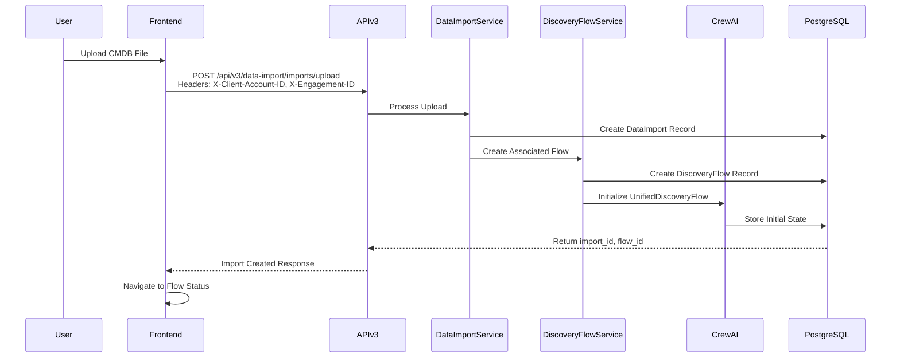
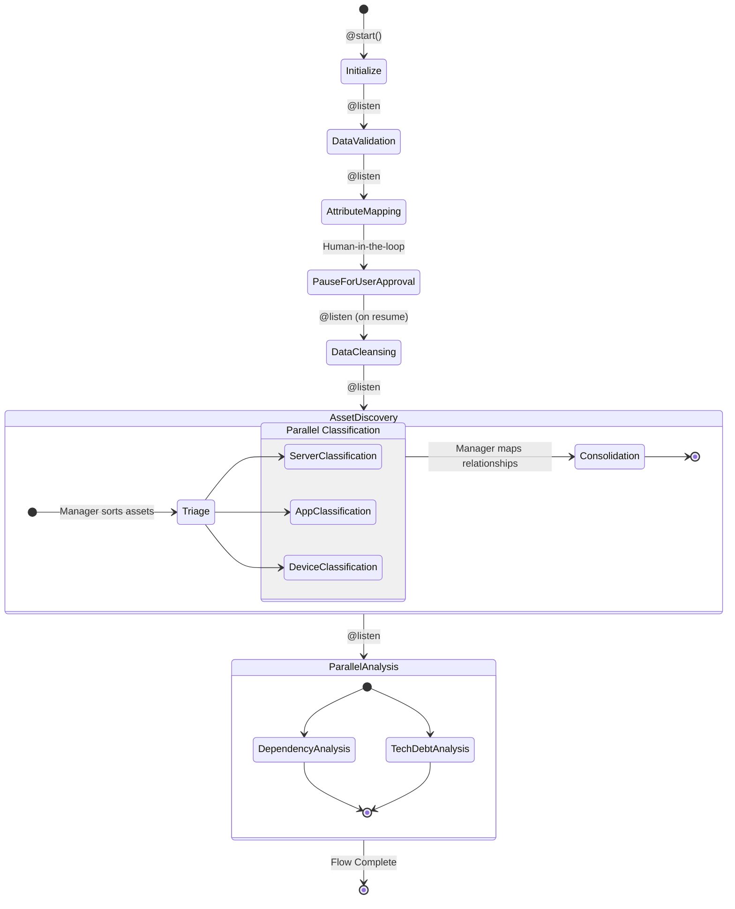
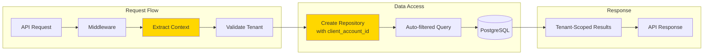
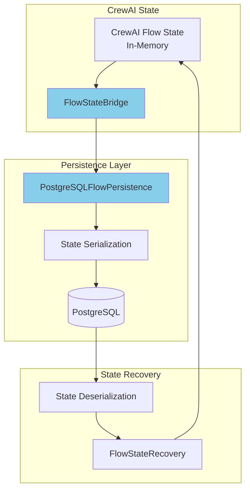
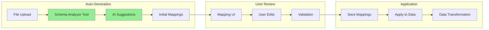
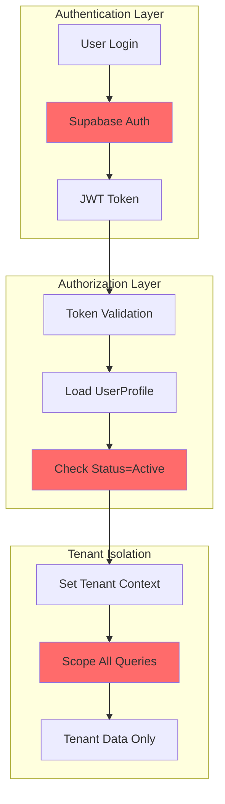

# AI Modernize Migration Platform - Data Flow Diagram

## Overview
This document provides a comprehensive data flow diagram for the AI Modernize Migration Platform, showing how data moves through the system from user interaction to final processing.

## High-Level Data Flow

```mermaid
graph TB
    subgraph "Frontend (Vercel)"
        UI[React UI]
        Hooks[useUnifiedDiscoveryFlow Hook]
        UI --> Hooks
    end

    subgraph "API Gateway"
        APIv1[API v1 Endpoints<br/><strong>Primary Entry Point (Current)</strong>]
        APIv3[API v3 Endpoints<br/>Future Target]
        Hooks --> APIv1
        Hooks -.-> APIv3
    end

    subgraph "Multi-Tenant Context Layer"
        Auth[Authentication]
        Context[Context Extraction<br/>X-Client-Account-ID<br/>X-Engagement-ID<br/>X-User-ID]
        APIv3 --> Auth
        APIv1 --> Auth
        Auth --> Context
    end

    subgraph "Service Layer"
        DFS[V3DiscoveryFlowService]
        DIS[V3DataImportService]
        FMS[V3FieldMappingService]
        Context --> DFS
        Context --> DIS
        Context --> FMS
    end

    subgraph "CrewAI Flow Orchestration"
        UDF[UnifiedDiscoveryFlow]
        FSB[FlowStateBridge]
        DFS --> UDF
        UDF --> FSB
    end

    subgraph "Repository Layer"
        CAR[ContextAwareRepository]
        DFR[DiscoveryFlowRepository]
        DIR[DataImportRepository]
        FMR[FieldMappingRepository]
        DFS --> CAR
        DIS --> CAR
        FMS --> CAR
        CAR --> DFR
        CAR --> DIR
        CAR --> FMR
    end

    subgraph "PostgreSQL Database"
        DF[DiscoveryFlow Table]
        DI[DataImport Table]
        FM[FieldMapping Table]
        AS[Asset Table]
        DFR --> DF
        DIR --> DI
        FMR --> FM
        FSB --> DF
    end

    subgraph "CrewAI Agents"
        DVA[Data Validation Agent]
        AMA[Attribute Mapping Agent]
        DCA[Data Cleansing Agent]
        ADA[Asset Discovery Agent]
        DIA[Dependency Intelligence Agent]
        UDF --> DVA
        UDF --> AMA
        UDF --> DCA
        UDF --> ADA
        UDF --> DIA
    end

    style APIv1 fill:#90EE90
    style APIv3 fill:#FFE4B5
    style UDF fill:#87CEEB
    style FSB fill:#87CEEB
```

## Detailed Flow Sequences

### 1. Data Import Flow



### 2. CrewAI Flow Execution



### 3. Multi-Tenant Data Access Pattern



### 4. State Management Flow



### 5. Field Mapping Flow



## Key Data Flow Characteristics

### 1. **Multi-Tenant Isolation**
- Every request includes tenant context headers
- All database queries automatically filtered by client_account_id
- No cross-tenant data access possible

### 2. **Event-Driven Architecture**
- CrewAI Flow uses @start/@listen decorators
- Asynchronous phase execution
- Real-time status updates via polling

### 3. **State Management**
- PostgreSQL as single source of truth
- CrewAI state persisted after each phase
- Automatic recovery on failure

### 4. **API Transition**
- v3 API is target architecture
- v1 API still in use during remediation
- Frontend uses mixed API calls

### 5. **Agent Intelligence**
- Business logic in CrewAI agents
- No hard-coded rules
- Learning from user feedback

## Data Security Flow



## Performance Considerations

1. **Caching Strategy**
   - 15-minute cache for web fetches
   - React Query caching for API responses
   - PostgreSQL query optimization

2. **Async Processing**
   - All CrewAI phases run asynchronously
   - Background job processing for heavy operations
   - Event-driven updates reduce polling

3. **Database Optimization**
   - Indexed on client_account_id for all tables
   - JSON fields for flexible agent data
   - Connection pooling via AsyncSessionLocal

## Current Remediation Impact

### Active Issues Affecting Data Flow:
1. **Flow Context Sync**: Sometimes data written to wrong tables
2. **Session ID References**: 132+ files still use legacy identifiers
3. **API Version Mix**: Frontend confusion between v1/v3
4. **Field Mapping UI**: Shows "0 active flows" incorrectly

### Mitigation Strategies:
- Always include all context headers
- Verify flow_id in responses
- Test both API versions
- Use flow debugging tools

---

*Last Updated: January 2025*  
*Platform State: Phase 5 + Remediation Phase 1 (75% complete)*