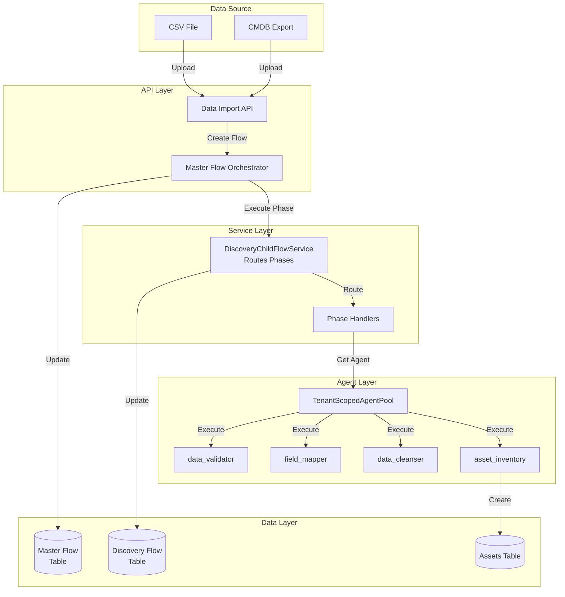
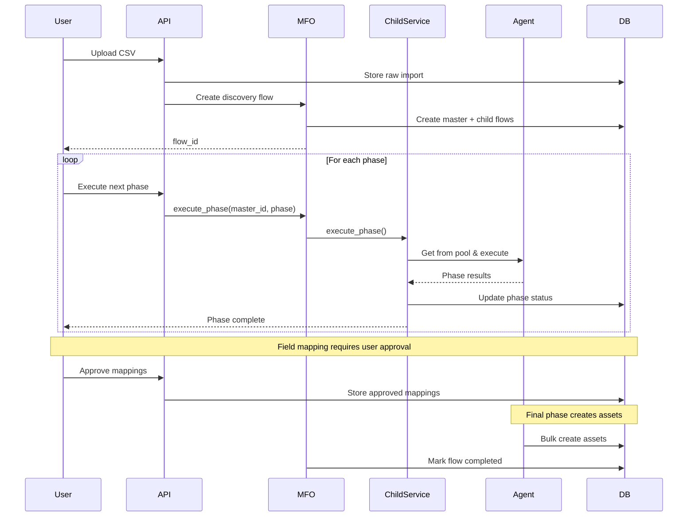
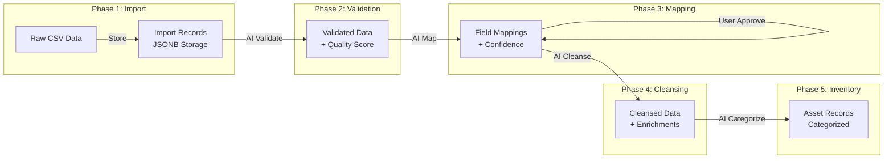

# Discovery Flow - Complete Implementation Guide

**Last Updated:** 2025-11-19
**Version:** 3.2.0
**Pattern:** Child Service (DiscoveryChildFlowService)
**Status:** ✅ PRODUCTION READY

## 1. Quick Reference Card

- **Pattern**: Child Service Pattern (ADR-025)
- **Primary Entry**: `/api/v1/unified-discovery/*` and `/api/v1/master-flows/*`
- **Master Table**: `crewai_flow_state_extensions`
- **Child Table**: `discovery_flows`
- **Key Files**:
  - `backend/app/services/child_flow_services/discovery.py`
  - `backend/app/api/v1/endpoints/unified_discovery/`
  - `backend/app/services/flow_orchestration/discovery_phase_handlers.py`
  - `backend/app/models/discovery_flows.py`
  - `backend/app/services/flow_configs/discovery_flow_config.py`
- **Critical ADRs**:
  - ADR-006 (Master Flow Orchestrator)
  - ADR-012 (Flow Status Separation)
  - ADR-015 (Persistent Agents)
  - ADR-024 (TenantMemoryManager)
  - ADR-025 (Child Service Pattern)
  - ADR-027 (5 Active Phases)

## 2. Architecture Layers Map

### API Layer (Request Handling)
```python
# Location: backend/app/api/v1/endpoints/unified_discovery/
# MFO endpoints: backend/app/api/v1/endpoints/master_flows/
```

**Endpoints:**
- `POST /api/v1/data-import/store-import` - Upload CSV/CMDB data
- `POST /api/v1/master-flows/create` - Create discovery flow via MFO
- `GET /api/v1/unified-discovery/flows/{flow_id}/status` - Get flow status
- `POST /api/v1/unified-discovery/flows/{flow_id}/execute-phase` - Execute next phase
- `GET /api/v1/unified-discovery/flows/{flow_id}/field-mappings` - Get mapping suggestions
- `PUT /api/v1/unified-discovery/flows/{flow_id}/field-mappings` - Approve mappings
- `GET /api/v1/unified-discovery/flows/{flow_id}/assets` - Get discovered assets

**Request/Response Schemas:**
```python
# backend/app/models/schemas/discovery_flow_schema.py
class DataImportRequest(BaseModel):
    file_content: str  # Base64 encoded CSV
    file_name: str
    import_source: str = "csv"
    client_account_id: int
    engagement_id: int

class DiscoveryFlowResponse(BaseModel):
    flow_id: UUID  # Child flow ID
    master_flow_id: UUID  # Master flow ID for MFO
    status: str
    current_phase: str
    progress_percentage: int
    phase_statuses: Dict[str, bool]
    data_import_id: Optional[UUID]
```

### Service Layer (Business Logic)
```python
# Location: backend/app/services/child_flow_services/discovery.py
# Phase handlers: backend/app/services/flow_orchestration/discovery_phase_handlers.py
```

**Core Classes:**
- `DiscoveryChildFlowService` - Routes phase execution (Child Service Pattern)
- `DiscoveryFlowService` - Business logic coordination
- `DiscoveryPhaseHandlers` - Individual phase implementations
- `DataImportService` - CSV/CMDB import logic

**Phase Routing (Child Service Pattern):**
```python
# backend/app/services/child_flow_services/discovery.py
class DiscoveryChildFlowService(BaseChildFlowService):
    async def execute_phase(
        self,
        flow_id: str,
        phase_name: str,
        phase_input: Optional[Dict] = None
    ) -> Dict[str, Any]:
        """Route phase execution to appropriate handler"""

        if phase_name == "data_validation":
            return await self._execute_data_validation(flow_id, phase_input)
        elif phase_name == "field_mapping":
            return await self._execute_field_mapping(flow_id, phase_input)
        elif phase_name == "data_cleansing":
            return await self._execute_data_cleansing(flow_id, phase_input)
        elif phase_name == "asset_inventory":
            return await self._execute_asset_inventory(flow_id, phase_input)
        else:
            raise ValueError(f"Unknown phase: {phase_name}")
```

### Repository Layer (Data Access)
```python
# Location: backend/app/repositories/discovery_flow_repository.py
```

**Repository Classes:**
```python
class DiscoveryFlowRepository(ContextAwareRepository):
    async def create(self, discovery_flow: DiscoveryFlowCreate) -> DiscoveryFlow
    async def get_by_id(self, flow_id: UUID) -> Optional[DiscoveryFlow]
    async def get_by_master_flow_id(self, master_flow_id: UUID) -> Optional[DiscoveryFlow]
    async def update_phase_status(self, flow_id: UUID, phase: str, completed: bool)
    async def update_current_phase(self, flow_id: UUID, phase: str)
```

**Transaction Patterns:**
```python
# Atomic flow creation with data import
async with db.begin():  # Start transaction
    # Create master flow
    master_flow = await mfo.create_flow(...)

    # Create child flow
    discovery_flow = DiscoveryFlow(
        master_flow_id=master_flow.flow_id,
        data_import_id=import_id,
        ...
    )
    db.add(discovery_flow)

    # Create import records
    for record in csv_records:
        import_record = RawImportRecord(
            data_import_id=import_id,
            record_data=record
        )
        db.add(import_record)

    await db.flush()  # Make available for FKs
    # Transaction commits on context exit
```

### Model Layer (Data Structures)

**SQLAlchemy Models:**
```python
# backend/app/models/discovery_flows.py
class DiscoveryFlow(Base):
    __tablename__ = "discovery_flows"
    __table_args__ = {"schema": "migration"}

    id = Column(UUID, primary_key=True, default=uuid4)
    master_flow_id = Column(UUID, ForeignKey("migration.crewai_flow_state_extensions.flow_id"))
    data_import_id = Column(UUID, ForeignKey("migration.data_imports.id"))

    # Phase tracking (5 active phases per ADR-027)
    current_phase = Column(String)
    data_import_completed = Column(Boolean, default=False)
    data_validation_completed = Column(Boolean, default=False)
    field_mapping_completed = Column(Boolean, default=False)
    data_cleansing_completed = Column(Boolean, default=False)
    asset_inventory_completed = Column(Boolean, default=False)

    # Deprecated phases (kept for compatibility)
    dependency_analysis_completed = Column(Boolean, default=False)  # Moved to Assessment
    tech_debt_assessment_completed = Column(Boolean, default=False)  # Moved to Assessment

    # Phase results storage
    phase_state = Column(JSONB)
    progress_percentage = Column(Integer, default=0)

    # Multi-tenant scoping
    client_account_id = Column(Integer, nullable=False)
    engagement_id = Column(Integer, nullable=False)
```

**Data Import Model:**
```python
# backend/app/models/data_imports.py
class DataImport(Base):
    __tablename__ = "data_imports"

    id = Column(UUID, primary_key=True)
    master_flow_id = Column(UUID)
    file_name = Column(String)
    import_source = Column(String)  # csv, servicenow, etc.
    record_count = Column(Integer)
    status = Column(String)  # pending, processing, completed, failed

    # Relationships
    raw_records = relationship("RawImportRecord", back_populates="data_import")
    field_mappings = relationship("FieldMapping", back_populates="data_import")
```

### Cache Layer (Performance)
```python
# Location: backend/app/core/cache/
```

**Redis Keys:**
```python
# Discovery flow caching
f"discovery:{flow_id}:status" - TTL: 60s
f"discovery:{flow_id}:field_mappings" - TTL: 300s
f"discovery:{import_id}:raw_records" - TTL: 1800s
f"discovery:{engagement_id}:assets" - TTL: 600s
```

**Caching Pattern:**
```python
@cache_key("discovery:{flow_id}:mappings")
async def get_field_mappings(flow_id: UUID):
    # Cache AI-generated mappings
    return await generate_mappings_with_ai(flow_id)
```

### Queue Layer (Async Processing)
```python
# Location: backend/app/services/background_tasks/
```

**Background Tasks:**
```python
# Large CSV processing
@background_task
async def process_large_import(import_id: UUID, file_path: str):
    # Process CSV in chunks
    async for chunk in read_csv_chunks(file_path, chunk_size=1000):
        await process_chunk(import_id, chunk)

# Asset creation from cleansed data
@background_task
async def create_assets_from_import(flow_id: UUID):
    # Batch create assets
    await batch_create_assets(flow_id)
```

### Integration Layer (External Services)

**CrewAI Agents (Persistent via TenantScopedAgentPool):**
```python
# Location: backend/app/services/persistent_agents/agent_pool_constants.py

DISCOVERY_AGENTS = {
    "data_validator": {
        "role": "Data Validation Agent",
        "goal": "Validate data structure and quality",
        "tools": ["data_structure_analyzer", "field_suggestion_generator"],
        "memory": False  # Per ADR-024
    },
    "field_mapper": {
        "role": "Field Mapping Agent",
        "goal": "Map source fields to target schema",
        "tools": ["mapping_confidence_calculator", "critical_attributes_assessor"],
        "memory": False
    },
    "data_cleanser": {
        "role": "Data Cleansing Agent",
        "goal": "Cleanse and enrich data",
        "tools": ["data_enrichment_tool", "standardization_tool"],
        "memory": False
    },
    "asset_inventory": {
        "role": "Asset Inventory Agent",
        "goal": "Categorize and deduplicate assets",
        "tools": ["asset_categorization_tool", "deduplication_engine"],
        "memory": False
    }
}
```

**Agent Activation Pattern:**
```python
from app.services.persistent_agents import TenantScopedAgentPool

# Get persistent agent from pool
agent = await TenantScopedAgentPool.get_or_create_agent(
    agent_type="data_validator",
    client_id=context.client_account_id,
    engagement_id=context.engagement_id
)

# Execute with context
result = await agent.execute(
    inputs={
        "import_data": raw_records,
        "validation_rules": rules
    }
)
```

## 3. Phase Execution Details

### Phase 1: Data Import
**Purpose**: Upload and store CSV/CMDB data

**Entry Point**:
```python
# API: POST /api/v1/data-import/store-import
# Service: DataImportService.store_import()
```

**Database Operations**:
```sql
-- Atomic transaction for import
BEGIN;
INSERT INTO migration.data_imports (id, file_name, status, master_flow_id)
VALUES (%(import_id)s, %(file_name)s, 'processing', %(master_flow_id)s);

INSERT INTO migration.raw_import_records (data_import_id, record_data)
VALUES (%(import_id)s, %(record_json)s);
-- Bulk insert for all records

COMMIT;
```

**State Transitions**:
- Creates `data_imports` record
- Bulk inserts `raw_import_records`
- Triggers MFO flow creation
- Sets `data_import_completed = true`

### Phase 2: Data Validation (AI-Powered)
**Purpose**: Validate structure and data quality

**Entry Point**:
```python
# Via MFO: execute_phase(master_flow_id, "data_validation")
# Service: DiscoveryChildFlowService._execute_data_validation()
```

**CrewAI Agent**: `data_validator`

**Agent Analysis**:
```python
# Agent performs:
- Field type inference
- Pattern detection
- Completeness check
- Quality scoring

result = {
    "validation_score": 0.85,
    "issues": [
        {"field": "cpu_cores", "issue": "non_numeric_values", "count": 5},
        {"field": "memory_gb", "issue": "missing_values", "count": 12}
    ],
    "suggestions": [
        {"field": "os_version", "suggested_type": "enum", "values": ["Windows", "Linux"]}
    ]
}
```

### Phase 3: Field Mapping (User Approval Required)
**Purpose**: Map source fields to 22 critical attributes

**Entry Point**:
```python
# Get suggestions: GET /api/v1/unified-discovery/flows/{flow_id}/field-mappings
# Approve: PUT /api/v1/unified-discovery/flows/{flow_id}/field-mappings
```

**CrewAI Agent**: `field_mapper`

**Critical Attributes Mapping:**
```python
CRITICAL_ATTRIBUTES = {
    "infrastructure": [
        "operating_system", "cpu_cores", "memory_gb",
        "storage_gb", "network_bandwidth", "virtualization_type"
    ],
    "application": [
        "technology_stack", "architecture_pattern",
        "integration_points", "data_volume", "application_type"
    ],
    "business": [
        "business_criticality", "change_tolerance",
        "compliance_requirements", "stakeholder_impact"
    ],
    "technical_debt": [
        "code_quality_score", "security_vulnerabilities",
        "eol_technology", "documentation_quality"
    ]
}
```

**Mapping Confidence Scoring:**
```python
# Agent generates confidence scores
mappings = [
    {
        "source_field": "OS",
        "target_field": "operating_system",
        "confidence": 0.95,
        "rationale": "Exact semantic match"
    },
    {
        "source_field": "RAM",
        "target_field": "memory_gb",
        "confidence": 0.88,
        "rationale": "Common abbreviation for memory"
    }
]
```

### Phase 4: Data Cleansing (November 2025 Fix)
**Purpose**: Cleanse and enrich data with AI

**Entry Point**:
```python
# Via MFO: execute_phase(master_flow_id, "data_cleansing")
# Service: DiscoveryChildFlowService._execute_data_cleansing()
```

**CrewAI Agent**: `data_cleanser`

**Critical Bug Fix (Nov 2025):**
```python
# FIXED: Phase progression not updating current_phase
async def complete_data_cleansing(flow_id: UUID):
    # Update phase status
    await db.execute(
        update(DiscoveryFlow)
        .where(DiscoveryFlow.id == flow_id)
        .values(
            data_cleansing_completed=True,
            current_phase="asset_inventory",  # ✅ FIXED: Was missing
            progress_percentage=80
        )
    )
```

### Phase 5: Asset Inventory
**Purpose**: Create and categorize assets

**Entry Point**:
```python
# Via MFO: execute_phase(master_flow_id, "asset_inventory")
# Service: DiscoveryChildFlowService._execute_asset_inventory()
```

**CrewAI Agent**: `asset_inventory`

**Asset Creation:**
```python
# Categorization and deduplication
async def create_assets_from_cleansed_data(flow_id: UUID):
    # Get cleansed records
    cleansed_data = await get_cleansed_records(flow_id)

    # Agent categorizes
    categories = await agent.categorize(cleansed_data)

    # Bulk create assets
    assets = []
    for record in cleansed_data:
        asset = Asset(
            name=record["name"],
            asset_type=categories[record["id"]],
            operating_system=record.get("operating_system"),
            environment=record.get("environment", "production"),
            discovery_flow_id=flow_id,
            client_account_id=context.client_account_id,
            engagement_id=context.engagement_id
        )
        assets.append(asset)

    # Bulk insert
    await db.bulk_insert_mappings(Asset, assets)
```

## 4. Critical Code Patterns

### Child Service Pattern (ADR-025)
```python
# CORRECT: Child service routes phases to handlers
class DiscoveryChildFlowService(BaseChildFlowService):
    async def execute_phase(self, flow_id: str, phase_name: str, phase_input: Dict):
        # Get child flow by master ID
        child_flow = await self.repository.get_by_master_flow_id(UUID(flow_id))

        # Route to phase handler
        handler = self._get_phase_handler(phase_name)
        result = await handler.execute(child_flow, phase_input)

        # Update phase status
        await self.repository.update_phase_status(
            child_flow.id, phase_name, completed=True
        )

        return result
```

### Persistent Agent Pattern (ADR-015)
```python
# CORRECT: Use TenantScopedAgentPool for persistent agents
from app.services.persistent_agents import TenantScopedAgentPool

# DO NOT create new crew per execution
# ❌ WRONG
crew = Crew(agents=[Agent(...)], tasks=[...])

# ✅ CORRECT - Get from pool
agent = await TenantScopedAgentPool.get_or_create_agent(
    agent_type="data_validator",
    client_id=context.client_account_id,
    engagement_id=context.engagement_id
)
```

### TenantMemoryManager Integration (ADR-024)
```python
# Store patterns after field mapping
async def store_mapping_patterns(context, mappings):
    memory_manager = TenantMemoryManager(
        crewai_service=crewai_service,
        database_session=db
    )

    for mapping in mappings:
        await memory_manager.store_learning(
            client_account_id=context.client_account_id,
            engagement_id=context.engagement_id,
            scope=LearningScope.ENGAGEMENT,
            pattern_type="field_mapping",
            pattern_data={
                "source": mapping["source_field"],
                "target": mapping["target_field"],
                "confidence": mapping["confidence"]
            }
        )
```

## 5. Visual Flow Diagrams

### Overall Architecture


### Phase Progression Sequence


### Data Flow Through Phases


## 6. Common Pitfalls & Solutions

### Pitfall 1: Creating Crews Instead of Using Pool
```python
# ❌ WRONG - Creates new crew each time
def execute_validation():
    crew = Crew(
        agents=[Agent(role="validator")],
        tasks=[Task(description="validate")]
    )
    return crew.kickoff()

# ✅ CORRECT - Use persistent agent from pool
async def execute_validation():
    agent = await TenantScopedAgentPool.get_or_create_agent(
        agent_type="data_validator",
        client_id=context.client_account_id,
        engagement_id=context.engagement_id
    )
    return await agent.execute(inputs)
```

### Pitfall 2: Not Updating current_phase (Nov 2025 Bug)
```python
# ❌ WRONG - Only updates boolean
await db.execute(
    update(DiscoveryFlow)
    .where(DiscoveryFlow.id == flow_id)
    .values(data_cleansing_completed=True)
)

# ✅ CORRECT - Updates phase and boolean
await db.execute(
    update(DiscoveryFlow)
    .where(DiscoveryFlow.id == flow_id)
    .values(
        data_cleansing_completed=True,
        current_phase="asset_inventory",  # Next phase
        progress_percentage=80
    )
)
```

### Pitfall 3: Wrong Flow ID Usage
```python
# ❌ WRONG - Using child ID for MFO
await orchestrator.execute_phase(child_flow.id, "phase_name")

# ✅ CORRECT - Use master_flow_id for MFO
await orchestrator.execute_phase(child_flow.master_flow_id, "phase_name")
```

## 7. Testing Guide

### Unit Tests
```bash
# Test discovery components
pytest backend/tests/unit/services/discovery_flow_test.py -v
pytest backend/tests/unit/services/child_flow_services/discovery_test.py -v
```

**Example Unit Test:**
```python
# backend/tests/unit/services/discovery_flow_test.py
@pytest.mark.asyncio
async def test_field_mapping_generation():
    # Arrange
    service = DiscoveryChildFlowService(db=mock_db, context=mock_context)
    mock_agent = AsyncMock()
    mock_agent.execute.return_value = {
        "mappings": [
            {"source": "OS", "target": "operating_system", "confidence": 0.95}
        ]
    }

    with patch("app.services.persistent_agents.TenantScopedAgentPool.get_or_create_agent", return_value=mock_agent):
        # Act
        result = await service._execute_field_mapping(flow_id, {})

        # Assert
        assert result["mappings"][0]["confidence"] == 0.95
        mock_agent.execute.assert_called_once()
```

### Integration Tests
```bash
# Test full discovery flow
pytest backend/tests/integration/discovery_flow_integration_test.py -v
```

**Example Integration Test:**
```python
# backend/tests/integration/discovery_flow_integration_test.py
@pytest.mark.integration
async def test_complete_discovery_flow(test_client, test_db, sample_csv):
    # Upload CSV
    response = await test_client.post(
        "/api/v1/data-import/store-import",
        files={"file": ("test.csv", sample_csv, "text/csv")},
        data={"client_account_id": 1, "engagement_id": 1}
    )
    assert response.status_code == 201
    flow_id = response.json()["flow_id"]

    # Execute validation phase
    response = await test_client.post(
        f"/api/v1/unified-discovery/flows/{flow_id}/execute-phase",
        json={"phase": "data_validation"}
    )
    assert response.status_code == 200

    # Get field mappings
    response = await test_client.get(
        f"/api/v1/unified-discovery/flows/{flow_id}/field-mappings"
    )
    mappings = response.json()["mappings"]
    assert len(mappings) > 0

    # Approve mappings
    response = await test_client.put(
        f"/api/v1/unified-discovery/flows/{flow_id}/field-mappings",
        json={"approved_mappings": mappings}
    )
    assert response.status_code == 200

    # Complete remaining phases
    for phase in ["data_cleansing", "asset_inventory"]:
        response = await test_client.post(
            f"/api/v1/unified-discovery/flows/{flow_id}/execute-phase",
            json={"phase": phase}
        )
        assert response.status_code == 200

    # Verify assets created
    assets = await test_db.execute(
        select(Asset).where(Asset.discovery_flow_id == flow_id)
    )
    assert len(assets.scalars().all()) > 0
```

### E2E Playwright Tests
```typescript
// tests/e2e/discovery-flow.spec.ts
import { test, expect } from '@playwright/test';

test.describe('Discovery Flow E2E', () => {
  test('Complete discovery workflow', async ({ page }) => {
    // Navigate to discovery
    await page.goto('http://localhost:8081/discovery');

    // Upload CSV
    await page.click('[data-testid="upload-button"]');
    const fileInput = await page.locator('input[type="file"]');
    await fileInput.setInputFiles('tests/fixtures/sample-assets.csv');

    // Wait for import
    await expect(page.locator('[data-testid="import-status"]')).toContainText('Complete');

    // Start discovery flow
    await page.click('[data-testid="start-discovery"]');

    // Execute validation phase
    await page.click('[data-testid="execute-validation"]');
    await expect(page.locator('[data-testid="validation-status"]')).toContainText('Complete');

    // Review field mappings
    await page.click('[data-testid="review-mappings"]');
    await expect(page.locator('[data-testid="mapping-table"]')).toBeVisible();

    // Approve mappings
    await page.click('[data-testid="approve-mappings"]');

    // Execute cleansing
    await page.click('[data-testid="execute-cleansing"]');
    await expect(page.locator('[data-testid="cleansing-status"]')).toContainText('Complete');

    // Execute inventory
    await page.click('[data-testid="execute-inventory"]');
    await expect(page.locator('[data-testid="inventory-status"]')).toContainText('Complete');

    // Verify assets created
    await page.click('[data-testid="view-assets"]');
    const assetCount = await page.locator('[data-testid="asset-row"]').count();
    expect(assetCount).toBeGreaterThan(0);
  });

  test('Handle large CSV upload', async ({ page }) => {
    await page.goto('http://localhost:8081/discovery');

    // Upload large CSV
    const fileInput = await page.locator('input[type="file"]');
    await fileInput.setInputFiles('tests/fixtures/large-assets-5000.csv');

    // Should show progress bar
    await expect(page.locator('[data-testid="upload-progress"]')).toBeVisible();

    // Wait for completion (extended timeout)
    await expect(page.locator('[data-testid="import-status"]')).toContainText('Complete', { timeout: 60000 });
  });
});
```

## 8. Quick Code Navigation

### Find phase handlers:
```bash
grep -r "execute_data_validation" backend/app/services/
grep -r "execute_field_mapping" backend/app/services/
grep -r "execute_data_cleansing" backend/app/services/
grep -r "execute_asset_inventory" backend/app/services/
```

### Find agent usage:
```bash
grep -r "TenantScopedAgentPool.*data_validator" backend/
grep -r "get_or_create_agent.*field_mapper" backend/
```

### Find child service implementation:
```bash
grep -r "class DiscoveryChildFlowService" backend/
grep -r "execute_phase.*discovery" backend/
```

### Find database operations:
```bash
grep -r "update(DiscoveryFlow" backend/
grep -r "raw_import_records" backend/
grep -r "field_mappings.*confidence" backend/
```

## 9. Version History

| Date | Version | Changes | ADRs | Issues |
|------|---------|---------|------|--------|
| 2025-11-19 | 3.2.0 | Comprehensive documentation update | - | - |
| 2025-11-10 | 3.1.0 | Fixed phase progression bug | - | Bug fix |
| 2025-10-27 | 3.0.0 | 5 active phases (removed 2) | ADR-027 | - |
| 2025-10-15 | 2.5.0 | Child service pattern | ADR-025 | - |
| 2025-10-02 | 2.0.0 | TenantMemoryManager integration | ADR-024 | - |
| 2025-09-20 | 1.5.0 | Persistent agents | ADR-015 | - |
| 2025-09-01 | 1.0.0 | Initial discovery flow | ADR-006 | - |

## 10. Deprecated Features

### Removed in v3.0.0 (ADR-027)
- **Dependency Analysis Phase** → Moved to Assessment Flow
- **Technical Debt Phase** → Moved to Assessment Flow
- Phase booleans kept in model for backward compatibility

### Deprecated Patterns
- **crew_class pattern** → Use child_flow_service
- **Per-execution crews** → Use TenantScopedAgentPool
- **CrewAI memory=True** → Use TenantMemoryManager

## 11. Monitoring & Observability

### Key Metrics
```python
# Grafana Dashboard: /d/discovery-flow/
```

**Flow Metrics:**
- Import size: `discovery_import_records_total`
- Phase duration: `discovery_phase_duration_seconds{phase="validation"}`
- Mapping confidence: `discovery_mapping_confidence_histogram`
- Assets created: `discovery_assets_created_total`

**Agent Metrics:**
- Agent pool size: `agent_pool_size{tenant="..."}`
- Agent execution time: `agent_execution_duration_seconds{agent="data_validator"}`
- Agent memory usage: `agent_memory_bytes{agent="field_mapper"}`

**Data Quality Metrics:**
- Validation score: `discovery_validation_score`
- Cleansing improvements: `discovery_data_quality_improvement`
- Duplicate rate: `discovery_duplicate_rate`

### Logging Patterns
```python
import structlog
logger = structlog.get_logger(__name__)

# Phase execution logging
logger.info(
    "discovery_phase_executed",
    flow_id=flow_id,
    phase=phase_name,
    duration=execution_time,
    record_count=record_count,
    client_account_id=context.client_account_id,
    engagement_id=context.engagement_id
)

# Agent execution logging
logger.info(
    "agent_executed",
    agent_type="data_validator",
    input_size=len(records),
    validation_score=result["score"],
    issues_found=len(result["issues"])
)
```

## 12. Performance Optimization

### Batch Processing
```python
# Process large CSV in chunks
async def process_large_csv(file_path: str, import_id: UUID):
    CHUNK_SIZE = 1000

    async with aiofiles.open(file_path, mode='r') as f:
        reader = csv.DictReader(f)
        chunk = []

        for row in reader:
            chunk.append(row)

            if len(chunk) >= CHUNK_SIZE:
                await process_chunk(import_id, chunk)
                chunk = []

        # Process remaining
        if chunk:
            await process_chunk(import_id, chunk)
```

### Connection Pooling
```python
# Optimize database connections
engine = create_async_engine(
    DATABASE_URL,
    pool_size=20,
    max_overflow=10,
    pool_pre_ping=True,
    pool_recycle=3600
)
```

### Caching Strategy
```python
# Cache expensive AI operations
@cache.memoize(timeout=300)
async def get_mapping_suggestions(import_id: UUID):
    # Expensive AI field mapping
    agent = await get_agent("field_mapper")
    return await agent.execute({"import_id": import_id})

# Invalidate on approval
@cache.delete_memoized(get_mapping_suggestions)
async def approve_mappings(import_id: UUID, approved: List):
    pass
```

## 13. Security Considerations

### File Upload Security
```python
# Validate file uploads
ALLOWED_EXTENSIONS = {'.csv', '.xlsx', '.json'}
MAX_FILE_SIZE = 100 * 1024 * 1024  # 100MB

def validate_upload(file: UploadFile):
    # Check extension
    ext = Path(file.filename).suffix.lower()
    if ext not in ALLOWED_EXTENSIONS:
        raise ValueError(f"Unsupported file type: {ext}")

    # Check size
    if file.size > MAX_FILE_SIZE:
        raise ValueError(f"File too large: {file.size} bytes")

    # Scan for malicious content
    scan_for_malware(file)
```

### SQL Injection Prevention
```python
# Always use parameterized queries
# ❌ WRONG
query = f"SELECT * FROM assets WHERE name = '{user_input}'"

# ✅ CORRECT
stmt = select(Asset).where(Asset.name == user_input)
```

### Multi-Tenant Isolation
```python
# Always include tenant context
@require_tenant_context
async def get_discovery_flow(flow_id: UUID, context: RequestContext):
    flow = await db.execute(
        select(DiscoveryFlow).where(
            and_(
                DiscoveryFlow.id == flow_id,
                DiscoveryFlow.client_account_id == context.client_account_id,
                DiscoveryFlow.engagement_id == context.engagement_id
            )
        )
    )
    if not flow:
        raise HTTPException(403, "Access denied")
    return flow
```

---

**End of Discovery Flow Documentation**

*For architectural decisions, consult the ADRs. For implementation patterns, check Serena memories.*