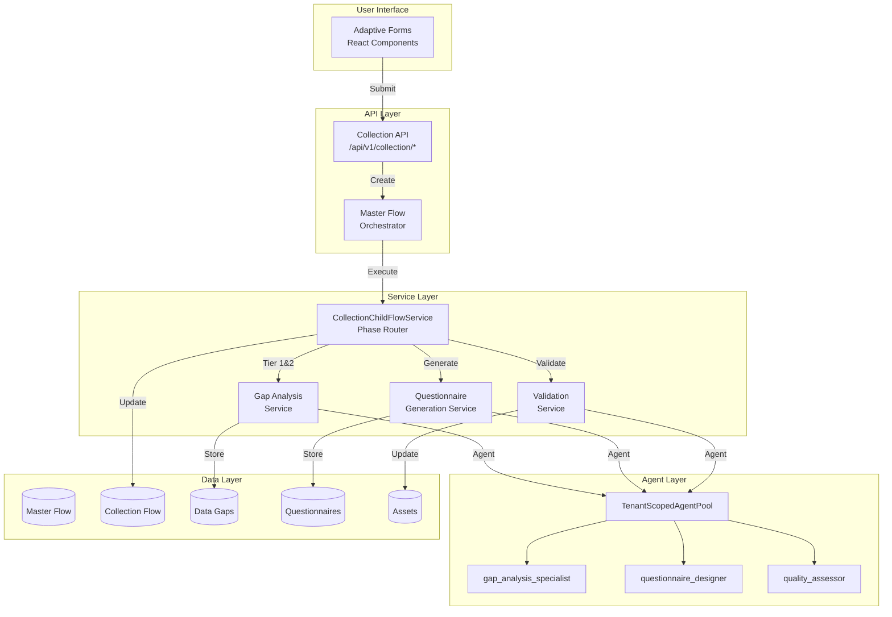
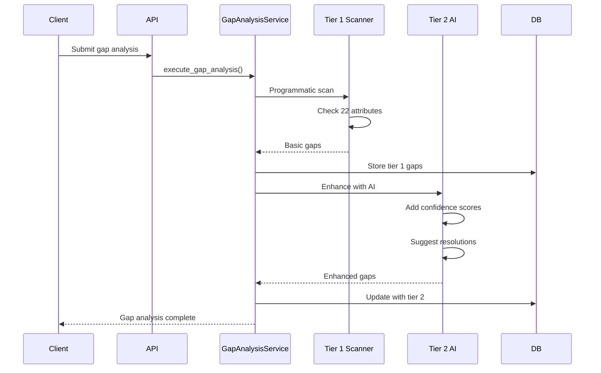
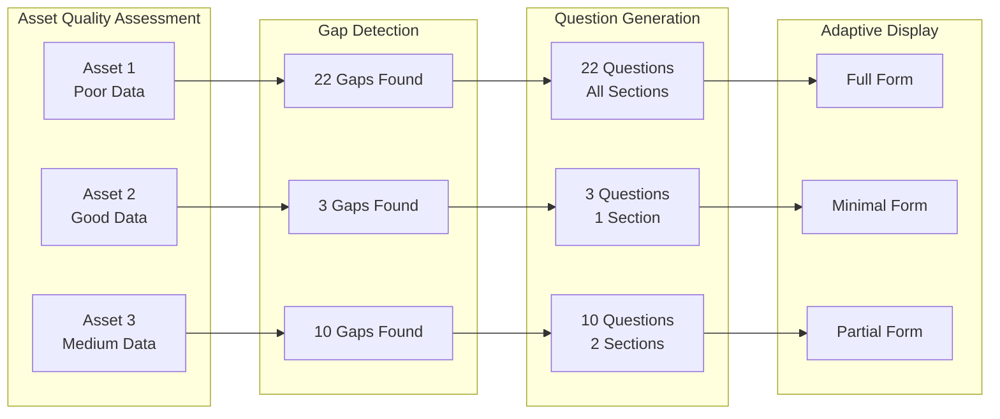

# Collection Flow - Complete Implementation Guide

**Last Updated:** 2025-11-19
**Version:** 4.0.0
**Pattern:** Child Service (CollectionChildFlowService)
**Status:** ✅ PRODUCTION READY

## 1. Quick Reference Card

- **Pattern**: Child Service Pattern (ADR-025)
- **Primary Entry**: `/api/v1/collection/*` and `/api/v1/master-flows/*`
- **Master Table**: `crewai_flow_state_extensions`
- **Child Table**: `collection_flows`
- **Key Files**:
  - `backend/app/services/child_flow_services/collection/service.py`
  - `backend/app/api/v1/endpoints/collection_flow/`
  - `backend/app/services/collection/gap_analysis/`
  - `backend/app/services/collection/questionnaire_generation/`
  - `backend/app/models/collection_flows.py`
- **Critical ADRs**:
  - ADR-025 (Child Service Pattern)
  - ADR-030 (Adaptive Questionnaires)
  - ADR-034 (Asset-Centric Deduplication)
  - ADR-035 (Per-Asset Generation)
  - ADR-036 (Canonical Junction)

## 2. Architecture Layers Map

### API Layer (Request Handling)
```python
# Location: backend/app/api/v1/endpoints/collection_flow/
# Additional: backend/app/api/v1/endpoints/collection_crud_*/
```

**Endpoints:**
- `POST /api/v1/master-flows/create` - Create collection flow
- `GET /api/v1/collection/{flow_id}/status` - Get flow status
- `POST /api/v1/collection/{flow_id}/submit-gaps` - Submit gap analysis
- `GET /api/v1/collection/{flow_id}/questionnaires` - Get questionnaires
- `POST /api/v1/collection/{flow_id}/submit-responses` - Submit answers
- `GET /api/v1/collection/{flow_id}/validation-results` - Get validation
- `POST /api/v1/collection/{flow_id}/transition-assessment` - Handoff to assessment

**Request/Response Schemas:**
```python
# backend/app/models/schemas/collection_flow_schema.py
class CollectionFlowCreate(BaseModel):
    flow_name: str
    selected_asset_ids: List[UUID]
    collection_type: str = "comprehensive"
    client_account_id: int
    engagement_id: int

class GapSubmissionRequest(BaseModel):
    flow_id: UUID
    gaps: List[DataGap]
    tier: str = "tier_1"  # or "tier_2"

class QuestionnaireResponse(BaseModel):
    questionnaire_id: UUID
    asset_id: UUID
    section: str
    responses: Dict[str, Any]
```

### Service Layer (Business Logic)
```python
# Location: backend/app/services/child_flow_services/collection/
# Gap Analysis: backend/app/services/collection/gap_analysis/
# Questionnaires: backend/app/services/collection/questionnaire_generation/
```

**Core Classes:**
- `CollectionChildFlowService` - Routes phase execution (Child Service Pattern)
- `GapAnalysisService` - Two-phase gap detection (Tier 1 & 2)
- `QuestionnaireGenerationService` - Intelligent MCQ generation (Issue #980)
- `CollectionFlowStateService` - State management
- `ValidationService` - Response validation

**Phase Routing:**
```python
# backend/app/services/child_flow_services/collection/service.py
class CollectionChildFlowService(CollectionChildFlowServiceBase):
    async def execute_phase(
        self,
        flow_id: str,
        phase_name: str,
        phase_input: Optional[Dict] = None
    ) -> Dict[str, Any]:
        """Route to phase handlers using persistent agents"""

        if phase_name == "gap_analysis":
            return await self._execute_gap_analysis(flow_id, phase_input)
        elif phase_name == "questionnaire_generation":
            return await self._execute_questionnaire_generation(flow_id, phase_input)
        elif phase_name == "manual_collection":
            return await self._handle_manual_collection(flow_id, phase_input)
        elif phase_name == "data_validation":
            return await self._execute_validation(flow_id, phase_input)
        elif phase_name == "finalization":
            return await self._finalize_collection(flow_id, phase_input)
```

### Repository Layer (Data Access)
```python
# Location: backend/app/repositories/collection_flow_repository.py
```

**Repository Pattern:**
```python
class CollectionFlowRepository(ContextAwareRepository):
    """Repository with tenant scoping per ADR-025"""

    def __init__(self, db: AsyncSession, client_account_id: int, engagement_id: int):
        self.db = db
        self.client_account_id = client_account_id
        self.engagement_id = engagement_id

    async def get_by_master_flow_id(self, master_flow_id: UUID) -> Optional[CollectionFlow]:
        stmt = select(CollectionFlow).where(
            and_(
                CollectionFlow.master_flow_id == master_flow_id,
                CollectionFlow.client_account_id == self.client_account_id,
                CollectionFlow.engagement_id == self.engagement_id
            )
        )
        result = await self.db.execute(stmt)
        return result.scalar_one_or_none()
```

### Model Layer (Data Structures)

**SQLAlchemy Models:**
```python
# backend/app/models/collection_flows.py
class CollectionFlow(Base):
    __tablename__ = "collection_flows"
    __table_args__ = {"schema": "migration"}

    id = Column(UUID, primary_key=True)  # Internal ID
    flow_id = Column(UUID, unique=True)  # Legacy external ID
    master_flow_id = Column(UUID, ForeignKey("migration.crewai_flow_state_extensions.flow_id"))

    # 7 Phases (migration 076 consolidated from 8)
    current_phase = Column(String)
    initialization_completed = Column(Boolean, default=False)
    asset_selection_completed = Column(Boolean, default=False)
    gap_analysis_completed = Column(Boolean, default=False)
    questionnaire_generation_completed = Column(Boolean, default=False)
    manual_collection_completed = Column(Boolean, default=False)
    data_validation_completed = Column(Boolean, default=False)
    finalization_completed = Column(Boolean, default=False)

    # Phase results
    phase_results = Column(JSONB)
    selected_asset_ids = Column(JSONB)

    # Multi-tenant
    client_account_id = Column(Integer, nullable=False)
    engagement_id = Column(Integer, nullable=False)
```

**Gap Analysis Model:**
```python
# backend/app/models/collection_data_gaps.py
class CollectionDataGap(Base):
    __tablename__ = "collection_data_gaps"

    id = Column(UUID, primary_key=True)
    collection_flow_id = Column(UUID, ForeignKey("migration.collection_flows.id"))
    asset_id = Column(UUID, ForeignKey("migration.assets.id"))

    field_name = Column(String)  # e.g., "operating_system"
    gap_type = Column(String)  # missing_field, incomplete, invalid
    priority = Column(Integer)  # 1 (critical) to 3 (nice-to-have)
    category = Column(String)  # infrastructure, application, business, tech_debt

    # Tier 2 AI enhancements
    confidence_score = Column(Float)
    suggested_resolution = Column(String)
    ai_insights = Column(JSONB)
```

**Questionnaire Model (Asset-Centric per ADR-034):**
```python
# backend/app/models/collection_questionnaires.py
class CollectionQuestionnaire(Base):
    __tablename__ = "collection_questionnaires"

    id = Column(UUID, primary_key=True)
    # Asset-centric (not flow-centric)
    engagement_id = Column(Integer, nullable=False)
    asset_id = Column(UUID, ForeignKey("migration.assets.id"))
    section = Column(String)  # infrastructure, application, etc.

    questions = Column(JSONB)  # MCQ format per Issue #980
    status = Column(String)  # draft, published, completed

    # Unique per asset-section within engagement
    __table_args__ = (
        UniqueConstraint('engagement_id', 'asset_id', 'section',
                        name='uq_collection_quest_asset_section'),
    )
```

### Cache Layer (Performance)
```python
# Location: backend/app/core/cache/
```

**Redis Caching (ADR-035):**
```python
# Per-asset questionnaire caching
f"collection:{engagement_id}:{asset_id}:{section}:questions" - TTL: 1800s
f"collection:{flow_id}:gaps:tier1" - TTL: 600s
f"collection:{flow_id}:gaps:tier2" - TTL: 300s
f"collection:{flow_id}:validation" - TTL: 120s
```

### Queue Layer (Async Processing)
```python
# Location: backend/app/services/background_tasks/
```

**Background Tasks:**
```python
# Questionnaire generation (chunked per ADR-035)
@background_task
async def generate_questionnaires_chunked(flow_id: UUID):
    """Generate per-asset, per-section to avoid 16KB limit"""
    for asset_id in selected_assets:
        for section in CRITICAL_SECTIONS:
            await generate_single_questionnaire(
                flow_id, asset_id, section
            )
            await cache_questionnaire(engagement_id, asset_id, section)
```

### Integration Layer (External Services)

**CrewAI Agents:**
```python
# Location: backend/app/services/persistent_agents/agent_pool_constants.py

COLLECTION_AGENTS = {
    "gap_analysis_specialist": {
        "role": "Gap Analysis Specialist",
        "goal": "Identify missing critical attributes",
        "tools": ["critical_attributes_assessor", "gap_detector"],
        "memory": False  # Per ADR-024
    },
    "questionnaire_designer": {
        "role": "Intelligent Questionnaire Designer",
        "goal": "Generate context-aware MCQ questions",
        "tools": ["question_generator", "option_builder"],
        "memory": False
    },
    "quality_assessor": {
        "role": "Data Quality Assessment Agent",
        "goal": "Validate responses and identify conflicts",
        "tools": ["validation_tool", "conflict_resolver"],
        "memory": False
    }
}
```

## 3. Phase Execution Details

### Phase 1: Initialization
**Purpose**: Setup flow state and configuration

**Entry Point**:
```python
# Automatic on flow creation
# Service: CollectionChildFlowService._initialize_flow()
```

**Operations**:
- Create flow records in master and child tables
- Initialize phase tracking
- Set up tenant context

### Phase 2: Asset Selection
**Purpose**: Identify assets for data collection

**Entry Point**:
```python
# API: POST /api/v1/collection/{flow_id}/select-assets
# Service: CollectionChildFlowService._execute_asset_selection()
```

**Agent**: Platform Detection Agent + Data Collection Agent

**Asset Selection Logic**:
```python
# Can select from:
- Discovery flow assets
- Manually specified assets
- Filtered by criteria (environment, type, criticality)
```

### Phase 3: Gap Analysis (Two-Phase)
**Purpose**: Detect missing/incomplete data

**Entry Point**:
```python
# API: POST /api/v1/collection/{flow_id}/submit-gaps
# Service: GapAnalysisService.execute_gap_analysis()
```

#### Tier 1: Programmatic Scanning
```python
# backend/app/services/collection/gap_analysis/tier_processors.py
async def execute_tier_1(assets: List[Asset]) -> List[DataGap]:
    """Fast, deterministic gap detection"""
    gaps = []

    for asset in assets:
        # Check 22 critical attributes
        for attribute in CRITICAL_ATTRIBUTES:
            value = getattr(asset, attribute, None)
            if not value or is_incomplete(value):
                gaps.append(DataGap(
                    asset_id=asset.id,
                    field_name=attribute,
                    gap_type="missing" if not value else "incomplete",
                    priority=get_priority(attribute),
                    category=get_category(attribute)
                ))

    return gaps
```

#### Tier 2: AI Enhancement
```python
# Agent: gap_analysis_specialist
async def execute_tier_2(tier1_gaps: List[DataGap]) -> List[EnhancedGap]:
    """Add AI insights to gaps"""
    agent = await get_agent("gap_analysis_specialist")

    enhanced = await agent.execute({
        "gaps": tier1_gaps,
        "context": asset_context
    })

    # Returns confidence scores and suggested resolutions
    return [
        EnhancedGap(
            **gap,
            confidence_score=enhanced["confidence"],
            suggested_resolution=enhanced["resolution"],
            ai_insights=enhanced["insights"]
        )
        for gap in tier1_gaps
    ]
```

### Phase 4: Questionnaire Generation (Intelligent MCQ)
**Purpose**: Generate context-aware questions

**Entry Point**:
```python
# Automatic after gap analysis
# Service: QuestionnaireGenerationService.generate_questionnaires()
```

**Agent**: `questionnaire_designer`

**Intelligent Generation (Issue #980):**
```python
async def generate_intelligent_questions(
    asset_id: UUID,
    section: str,
    gaps: List[DataGap]
) -> Dict:
    """Generate MCQ questions based on gaps"""

    agent = await get_agent("questionnaire_designer")

    # Context-aware generation
    result = await agent.execute({
        "asset": asset_details,
        "gaps": section_gaps,
        "context": {
            "eol_status": check_eol(asset),
            "criticality": asset.business_criticality,
            "environment": asset.environment
        }
    })

    # Example output (90.9% MCQ format achieved)
    return {
        "questions": [
            {
                "field": "operating_system",
                "question": "Select the operating system version",
                "type": "mcq",
                "options": [
                    {"value": "aix_7.3", "label": "IBM AIX 7.3"},
                    {"value": "aix_7.2", "label": "IBM AIX 7.2"},
                    {"value": "rhel_8", "label": "Red Hat Enterprise Linux 8"}
                ],
                "required": True
            }
        ]
    }
```

**Per-Asset, Per-Section Generation (ADR-035):**
```python
# Avoid 16KB JSON limit by chunking
async def generate_chunked(flow_id: UUID):
    for asset in selected_assets:
        for section in ["infrastructure", "application", "business", "technical_debt"]:
            questionnaire = await generate_for_section(
                asset.id, section, gaps_for_asset_section
            )

            # Store with deduplication
            await store_with_deduplication(
                engagement_id=context.engagement_id,
                asset_id=asset.id,
                section=section,
                questions=questionnaire
            )

            # Cache in Redis
            await cache.set(
                f"collection:{engagement_id}:{asset.id}:{section}",
                questionnaire,
                ttl=1800
            )
```

### Phase 5: Manual Collection (Adaptive Forms)
**Purpose**: User completes questionnaires

**Entry Point**:
```python
# UI: Adaptive form display
# API: POST /api/v1/collection/{flow_id}/submit-responses
```

**Adaptive Behavior (Issue #795 - FEATURE not bug):**
```python
# Fewer questions = better data quality
def get_questions_for_asset(asset_id: UUID) -> List[Question]:
    """Show only questions for actual gaps"""

    gaps = get_gaps_for_asset(asset_id)

    # Asset with good data = fewer questions
    # Asset with poor data = more questions
    questions = []
    for gap in gaps:
        if gap.priority <= 2:  # Only critical and important
            questions.append(
                get_question_for_gap(gap)
            )

    return questions  # Could be 3 or 30 depending on gaps
```

### Phase 6: Data Validation
**Purpose**: Validate responses and resolve conflicts

**Entry Point**:
```python
# API: GET /api/v1/collection/{flow_id}/validation-results
# Service: ValidationService.validate_responses()
```

**Agent**: `quality_assessor`

**Validation Logic**:
```python
async def validate_responses(flow_id: UUID):
    agent = await get_agent("quality_assessor")

    result = await agent.execute({
        "responses": user_responses,
        "original_data": asset_data,
        "validation_rules": rules
    })

    return {
        "validation_score": result["score"],
        "conflicts": result["conflicts"],
        "recommendations": result["recommendations"]
    }
```

### Phase 7: Finalization
**Purpose**: Prepare for assessment handoff

**Entry Point**:
```python
# API: POST /api/v1/collection/{flow_id}/transition-assessment
# Service: CollectionChildFlowService._finalize_collection()
```

**Handoff Operations**:
```python
async def transition_to_assessment(flow_id: UUID):
    # Update assets with collected data
    await update_assets_from_responses(flow_id)

    # Create canonical applications (ADR-036)
    await create_canonical_applications(flow_id)

    # Mark collection complete
    await mark_flow_completed(flow_id)

    # Trigger assessment flow creation
    assessment_flow_id = await create_assessment_flow(
        selected_assets=get_collected_assets(flow_id)
    )

    return {"assessment_flow_id": assessment_flow_id}
```

## 4. Critical Code Patterns

### Asset-Centric Questionnaire Pattern (ADR-034)
```python
# CORRECT: Link to asset, not flow
class CollectionQuestionnaire(Base):
    # Unique per (engagement, asset, section)
    engagement_id = Column(Integer)
    asset_id = Column(UUID)
    section = Column(String)

    __table_args__ = (
        UniqueConstraint('engagement_id', 'asset_id', 'section'),
    )

# Reuse across flows
async def get_or_create_questionnaire(
    engagement_id: int,
    asset_id: UUID,
    section: str
):
    existing = await db.execute(
        select(CollectionQuestionnaire).where(
            and_(
                CollectionQuestionnaire.engagement_id == engagement_id,
                CollectionQuestionnaire.asset_id == asset_id,
                CollectionQuestionnaire.section == section
            )
        )
    ).scalar_one_or_none()

    if existing:
        return existing  # Reuse from previous flow

    # Generate new only if needed
    return await generate_new_questionnaire(...)
```

### Canonical Application Junction (ADR-036)
```python
# CORRECT: Use junction table for canonical mapping
async def create_canonical_mapping(asset: Asset):
    if asset.application_name:
        # Find or create canonical app
        canonical_app = await CanonicalApplication.find_or_create_canonical(
            db=db,
            application_name=asset.application_name,
            client_account_id=context.client_account_id,
            engagement_id=context.engagement_id
        )

        # Create junction record
        junction = CollectionFlowApplication(
            collection_flow_id=flow.id,
            asset_id=asset.id,
            canonical_application_id=canonical_app.id,
            deduplication_method="collection_auto",
            match_confidence=canonical_app.confidence_score
        )
        db.add(junction)
```

### TenantMemoryManager Pattern (ADR-024)
```python
# Store collection patterns
async def store_collection_patterns(context, patterns):
    memory_manager = TenantMemoryManager(
        crewai_service=crewai_service,
        database_session=db
    )

    await memory_manager.store_learning(
        client_account_id=context.client_account_id,
        engagement_id=context.engagement_id,
        scope=LearningScope.ENGAGEMENT,
        pattern_type="collection_patterns",
        pattern_data={
            "gap_patterns": patterns["gaps"],
            "question_effectiveness": patterns["effectiveness"],
            "response_patterns": patterns["responses"]
        }
    )
```

## 5. Visual Flow Diagrams

### Overall Architecture


### Two-Phase Gap Analysis Flow


### Adaptive Questionnaire Flow


## 6. Common Pitfalls & Solutions

### Pitfall 1: Treating Fewer Questions as Bug
```python
# ❌ WRONG (Issue #795 misunderstanding)
# Trying to "fix" adaptive behavior
def get_all_questions():
    return ALL_POSSIBLE_QUESTIONS  # Shows unnecessary questions

# ✅ CORRECT - Adaptive is a FEATURE
def get_relevant_questions(asset_id):
    gaps = get_gaps_for_asset(asset_id)
    return generate_questions_for_gaps(gaps)  # Only what's needed
```

### Pitfall 2: Flow-Centric Questionnaires
```python
# ❌ WRONG - Creates duplicates
class Questionnaire:
    collection_flow_id = Column(UUID)  # Tied to flow

# ✅ CORRECT (ADR-034) - Asset-centric
class Questionnaire:
    engagement_id = Column(Integer)
    asset_id = Column(UUID)
    section = Column(String)
    # Reusable across flows
```

### Pitfall 3: Single Large JSON Generation
```python
# ❌ WRONG - Hits 16KB limit (Bug #996-998)
async def generate_all_questionnaires():
    all_questions = await agent.generate_for_all_assets_and_sections()
    # Returns 16KB+ JSON that gets truncated

# ✅ CORRECT (ADR-035) - Chunked generation
async def generate_chunked():
    for asset in assets:
        for section in sections:
            questions = await agent.generate_single(asset, section)
            await store_and_cache(questions)
```

## 7. Testing Guide

### Unit Tests
```bash
pytest backend/tests/unit/services/collection_flow_test.py -v
pytest backend/tests/unit/services/gap_analysis_test.py -v
pytest backend/tests/unit/services/questionnaire_generation_test.py -v
```

**Example Unit Test:**
```python
# backend/tests/unit/services/gap_analysis_test.py
@pytest.mark.asyncio
async def test_two_phase_gap_analysis():
    # Arrange
    service = GapAnalysisService(db=mock_db, context=mock_context)
    assets = [create_test_asset(missing_fields=5)]

    # Act - Tier 1
    tier1_gaps = await service.execute_tier_1(assets)
    assert len(tier1_gaps) == 5

    # Act - Tier 2
    mock_agent = AsyncMock()
    mock_agent.execute.return_value = {
        "confidence": 0.85,
        "resolution": "Collect from CMDB"
    }

    with patch("get_agent", return_value=mock_agent):
        tier2_gaps = await service.execute_tier_2(tier1_gaps)

        # Assert
        assert tier2_gaps[0].confidence_score == 0.85
        assert tier2_gaps[0].suggested_resolution == "Collect from CMDB"
```

### Integration Tests
```bash
pytest backend/tests/integration/collection_flow_integration_test.py -v
```

**Example Integration Test:**
```python
@pytest.mark.integration
async def test_adaptive_questionnaire_generation(test_client, test_db):
    # Create assets with different data quality
    asset_good = await create_asset(complete_data=True)
    asset_poor = await create_asset(complete_data=False)

    # Create collection flow
    response = await test_client.post(
        "/api/v1/master-flows/create",
        json={
            "flow_type": "collection",
            "selected_asset_ids": [str(asset_good.id), str(asset_poor.id)]
        }
    )
    flow_id = response.json()["flow_id"]

    # Execute gap analysis
    response = await test_client.post(
        f"/api/v1/collection/{flow_id}/submit-gaps",
        json={"tier": "tier_1"}
    )

    # Get questionnaires
    response = await test_client.get(
        f"/api/v1/collection/{flow_id}/questionnaires"
    )
    questionnaires = response.json()["questionnaires"]

    # Assert adaptive behavior
    good_asset_questions = [
        q for q in questionnaires
        if q["asset_id"] == str(asset_good.id)
    ]
    poor_asset_questions = [
        q for q in questionnaires
        if q["asset_id"] == str(asset_poor.id)
    ]

    # Good asset has fewer questions (FEATURE!)
    assert len(good_asset_questions) < len(poor_asset_questions)
```

### E2E Playwright Tests
```typescript
// tests/e2e/collection-flow.spec.ts
import { test, expect } from '@playwright/test';

test.describe('Collection Flow E2E', () => {
  test('Adaptive forms show different questions per asset', async ({ page }) => {
    // Navigate to collection
    await page.goto('http://localhost:8081/collection/create');

    // Select assets
    await page.click('[data-testid="asset-selector"]');
    await page.click('[data-testid="asset-1"]'); // Good data
    await page.click('[data-testid="asset-2"]'); // Poor data

    // Start collection
    await page.click('[data-testid="start-collection"]');

    // Execute gap analysis
    await page.click('[data-testid="run-gap-analysis"]');
    await expect(page.locator('[data-testid="gaps-found"]')).toBeVisible();

    // Navigate to forms
    await page.click('[data-testid="view-questionnaires"]');

    // Check Asset 1 (good data) - fewer questions
    await page.click('[data-testid="asset-1-form"]');
    const asset1Questions = await page.locator('[data-testid="question"]').count();

    // Check Asset 2 (poor data) - more questions
    await page.click('[data-testid="asset-2-form"]');
    const asset2Questions = await page.locator('[data-testid="question"]').count();

    // This is the CORRECT behavior (Issue #795)
    expect(asset1Questions).toBeLessThan(asset2Questions);
  });

  test('MCQ questions have context-aware options', async ({ page }) => {
    await page.goto('http://localhost:8081/collection/questionnaire/asset-123');

    // Find OS question
    const osQuestion = page.locator('[data-testid="question-operating_system"]');

    // Check for intelligent options (Issue #980)
    await expect(osQuestion.locator('option[value="aix_7.3"]')).toBeVisible();
    await expect(osQuestion.locator('option[value="aix_7.2"]')).toBeVisible();

    // Should not have generic options
    await expect(osQuestion.locator('option[value="other"]')).not.toBeVisible();
  });
});
```

## 8. Quick Code Navigation

### Find gap analysis:
```bash
grep -r "execute_tier_1\|execute_tier_2" backend/app/services/collection/
grep -r "GapAnalysisService" backend/app/services/
```

### Find questionnaire generation:
```bash
grep -r "generate_intelligent_questions" backend/
grep -r "per_asset.*per_section" backend/
```

### Find adaptive form logic:
```bash
grep -r "get_questions_for_asset" backend/
grep -r "adaptive.*form" backend/
```

### Find canonical junction:
```bash
grep -r "CollectionFlowApplication" backend/
grep -r "find_or_create_canonical" backend/
```

## 9. Version History

| Date | Version | Changes | ADRs | Issues |
|------|---------|---------|------|--------|
| 2025-11-19 | 4.0.0 | Complete documentation overhaul | - | - |
| 2025-11-11 | 3.5.0 | Per-asset questionnaire generation | ADR-035 | #996-998 |
| 2025-11-08 | 3.4.0 | Asset-centric deduplication | ADR-034 | - |
| 2025-11-05 | 3.3.0 | Intelligent MCQ generation | - | #980 |
| 2025-10-30 | 3.2.0 | Adaptive forms (not a bug!) | ADR-030 | #795 |
| 2025-10-25 | 3.1.0 | Two-phase gap analysis | - | - |
| 2025-10-15 | 3.0.0 | Child service pattern | ADR-025 | - |
| 2025-10-07 | 2.5.0 | 7 phases (consolidated from 8) | - | Migration 076 |
| 2025-10-02 | 2.0.0 | TenantMemoryManager | ADR-024 | - |

## 10. Deprecated Features

### Removed in v3.0.0
- **platform_detection phase** → Merged into asset_selection
- **automated_collection phase** → Merged into asset_selection
- **8 phases** → Consolidated to 7 phases

### Deprecated Patterns
- **Flow-centric questionnaires** → Asset-centric (ADR-034)
- **Single JSON generation** → Chunked per-asset (ADR-035)
- **Generic questions** → Context-aware MCQ (Issue #980)

## 11. Monitoring & Observability

### Key Metrics
```python
# Grafana Dashboard: /d/collection-flow/
```

**Flow Metrics:**
- Gap detection rate: `collection_gaps_found_total`
- Question generation: `collection_questions_generated_total`
- MCQ percentage: `collection_mcq_percentage` (target: >80%)
- Response rate: `collection_response_rate`

**Quality Metrics:**
- Data completeness before: `collection_completeness_before`
- Data completeness after: `collection_completeness_after`
- Validation score: `collection_validation_score`

**Performance Metrics:**
- Gap analysis duration: `gap_analysis_duration_seconds`
- Question generation time: `question_generation_duration_seconds`
- Per-asset processing: `per_asset_processing_seconds`

### Logging
```python
logger.info(
    "collection_phase_executed",
    flow_id=flow_id,
    phase=phase_name,
    asset_count=len(assets),
    gaps_found=len(gaps),
    mcq_percentage=mcq_rate,
    client_account_id=context.client_account_id,
    engagement_id=context.engagement_id
)
```

## 12. Performance Optimization

### Chunked Processing (ADR-035)
```python
# Process assets in parallel chunks
async def process_assets_chunked(assets: List[Asset]):
    CHUNK_SIZE = 10

    chunks = [
        assets[i:i + CHUNK_SIZE]
        for i in range(0, len(assets), CHUNK_SIZE)
    ]

    tasks = []
    for chunk in chunks:
        tasks.append(process_chunk(chunk))

    results = await asyncio.gather(*tasks)
    return flatten(results)
```

### Redis Caching
```python
# Cache questionnaires to avoid regeneration
@cache_key("collection:{engagement_id}:{asset_id}:{section}")
async def get_cached_questionnaire(
    engagement_id: int,
    asset_id: UUID,
    section: str
):
    # Check cache first
    cached = await redis.get(cache_key)
    if cached:
        return json.loads(cached)

    # Generate if not cached
    questions = await generate_questionnaire(...)
    await redis.setex(cache_key, 1800, json.dumps(questions))
    return questions
```

## 13. Security Considerations

### Input Validation
```python
# Validate gap submission
class GapSubmissionValidator:
    def validate(self, gaps: List[DataGap]):
        for gap in gaps:
            # Prevent injection
            if not gap.field_name.isidentifier():
                raise ValueError(f"Invalid field name: {gap.field_name}")

            # Validate priority
            if gap.priority not in [1, 2, 3]:
                raise ValueError(f"Invalid priority: {gap.priority}")

            # Validate category
            if gap.category not in VALID_CATEGORIES:
                raise ValueError(f"Invalid category: {gap.category}")
```

### Response Sanitization
```python
# Sanitize user responses
def sanitize_response(response: str) -> str:
    # Remove potential XSS
    response = bleach.clean(response)

    # Validate against allowed values
    if response not in ALLOWED_VALUES:
        raise ValueError(f"Invalid response: {response}")

    return response
```

### Multi-Tenant Isolation
```python
# Always scope by tenant
async def get_collection_flow(flow_id: UUID, context: RequestContext):
    flow = await db.execute(
        select(CollectionFlow).where(
            and_(
                CollectionFlow.id == flow_id,
                CollectionFlow.client_account_id == context.client_account_id,
                CollectionFlow.engagement_id == context.engagement_id
            )
        )
    ).scalar_one_or_none()

    if not flow:
        raise HTTPException(403, "Access denied")

    return flow
```

---

**End of Collection Flow Documentation**

*For questions about adaptive behavior, see Issue #795. For MCQ generation, see Issue #980.*