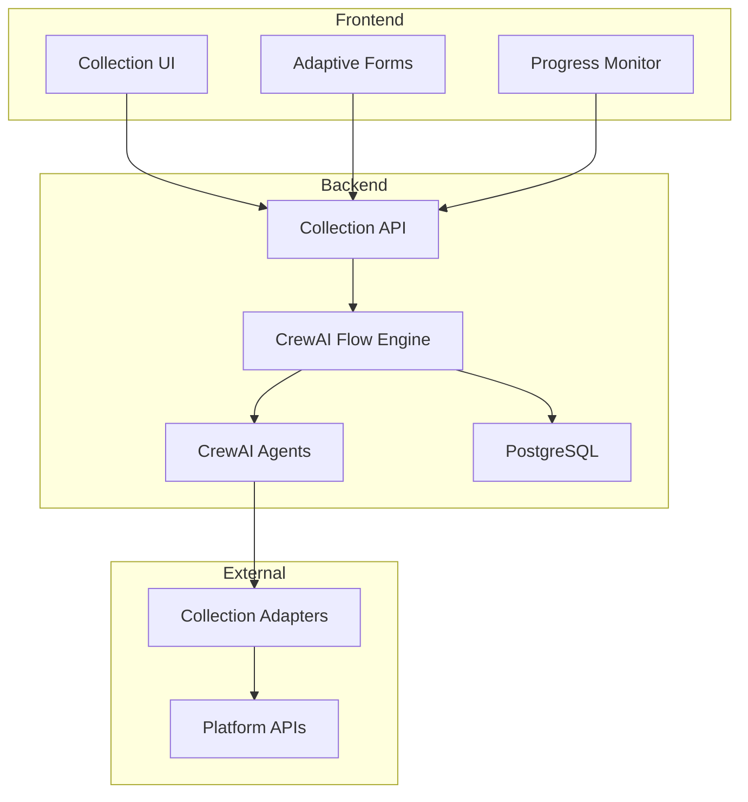

# Collection Flow Documentation

## Overview

The Collection Flow is a sophisticated, multi-phase data gathering system designed to comprehensively collect information about applications and infrastructure for cloud migration assessment. It bridges the gap between automated discovery and manual data enrichment, using intelligent CrewAI agents to adapt questionnaires based on detected gaps in collected data.

## Purpose and Goals

### Primary Purpose
The Collection Flow serves as the critical data acquisition layer in the migration assessment pipeline, ensuring complete and accurate information gathering through:

1. **Automated Platform Detection** - Identifies and inventories platforms in the environment
2. **Intelligent Data Collection** - Uses platform-specific adapters for automated extraction
3. **Gap Analysis** - Identifies missing or incomplete data points
4. **Adaptive Questionnaire Generation** - Creates targeted questionnaires for manual data collection
5. **Data Synthesis and Validation** - Ensures data quality and completeness

### Key Objectives
- **Maximize Automation** - Collect as much data as possible through automated means
- **Minimize Manual Effort** - Generate focused questionnaires only for critical gaps
- **Ensure Data Quality** - Validate and cross-reference all collected information
- **Enable Scalability** - Support multiple automation tiers for different environments
- **Maintain Flexibility** - Adapt to various platform types and data sources

## Architecture

### System Components



### Data Model

The Collection Flow uses a multi-table architecture:

1. **collection_flows** - Main flow tracking table
   - flow_id (UUID) - Unique identifier (ALWAYS use this in APIs, not id)
   - status - Current flow status
   - current_phase - Active collection phase
   - automation_tier - Level of automation (tier_1, tier_2, tier_3)
   - collection_config - Platform and strategy configuration
   - client_account_id (UUID) - Multi-tenant isolation (REQUIRED)
   - engagement_id (UUID) - Engagement scope (REQUIRED)

2. **collection_questionnaires** - Adaptive questionnaires
   - Linked to collection_flow_id
   - Generated by CrewAI agents based on gaps
   - Contains questions, validation rules, and metadata

3. **collection_questionnaire_responses** - User responses
   - Stores all manual data collection inputs
   - Linked to both flow and optional asset

## Flow Phases

### Phase 1: Initialization
**Purpose**: Setup flow state and load configuration

**Activities**:
- Initialize flow context with multi-tenant identifiers
- Load client requirements and environment configuration
- Set automation tier based on discovery results
- Prepare state management and persistence

**Key Components**:
- `InitializationHandler` - Manages flow setup
- `FlowStateManager` - Handles state persistence
- `ServiceInitializer` - Initializes required services

### Phase 2: Platform Detection
**Purpose**: Detect and identify platforms in the environment

**Activities**:
- Scan environment for known platform signatures
- Identify platform types (cloud, on-premise, hybrid)
- Catalog platform versions and configurations
- Build platform inventory for collection

**CrewAI Agents**:
- Platform Detection Agent - Scans and identifies platforms
- Configuration Analyzer - Extracts platform settings

**Output**: List of detected platforms with metadata

### Phase 3: Automated Collection
**Purpose**: Automated data collection via platform adapters

**Activities**:
- Connect to identified platforms using adapters
- Extract application metadata and configurations
- Collect performance metrics and dependencies
- Gather security and compliance information

**Collection Methods**:
- API integrations for cloud platforms
- Agent-based collection for on-premise
- Configuration file parsing
- Database queries for metadata

**Output**: Raw collected data per platform

### Phase 4: Gap Analysis
**Purpose**: Analyze data completeness and quality gaps

**Activities**:
- Compare collected data against requirements
- Identify missing critical attributes
- Assess data quality and confidence levels
- Prioritize gaps by business impact

**CrewAI Agents**:
- Gap Analysis Agent - Identifies missing data
- Quality Assessment Agent - Evaluates data confidence

**Gap Categories**:
- Technical gaps (missing configurations)
- Business gaps (ownership, criticality)
- Compliance gaps (regulatory requirements)
- Migration readiness gaps

### Phase 5: Questionnaire Generation
**Purpose**: Generate adaptive questionnaires for gap filling

**Activities**:
- Analyze gap patterns and priorities
- Generate targeted question sets
- Create validation rules and dependencies
- Build user-friendly form structures

**Questionnaire Types**:
- Bootstrap questionnaires (initial fallback)
- Adaptive questionnaires (agent-generated)
- Follow-up questionnaires (based on responses)

**CrewAI Intelligence**:
- Questions adapt based on previous responses
- Validation rules ensure data quality
- Skip logic minimizes user effort

### Phase 6: Manual Collection
**Purpose**: Collect data through manual processes

**Activities**:
- Present adaptive forms to users
- Validate responses in real-time
- Save partial progress incrementally
- Handle multi-session data entry

**User Experience**:
- Progressive disclosure of questions
- Real-time validation feedback
- Auto-save functionality
- Context-sensitive help

### Phase 7: Data Validation
**Purpose**: Validate all collected data

**Activities**:
- Cross-reference automated and manual data
- Resolve conflicts and duplicates
- Validate business rules and constraints
- Calculate confidence scores

**Validation Checks**:
- Completeness validation
- Consistency checks
- Business rule validation
- Dependency verification

### Phase 8: Finalization
**Purpose**: Prepare data for Discovery Flow handoff

**Activities**:
- Synthesize all collected data
- Generate collection summary report
- Update flow status and metrics
- Prepare handoff to Discovery Flow

**Deliverables**:
- Complete application inventory
- Validated configuration data
- Gap resolution status
- Readiness assessment scores

## Automation Tiers

### Tier 1: Basic Automation
- Manual questionnaire completion
- Minimal automated collection
- Suitable for restricted environments

### Tier 2: Standard Automation (Default)
- Balanced automated and manual collection
- Platform API integrations
- Adaptive questionnaires for gaps

### Tier 3: Advanced Automation
- Maximum automated collection
- Advanced agent deployments
- Minimal manual intervention

## Progress Monitoring

The Collection Flow provides real-time progress monitoring through:

### Metrics Tracked
- Overall flow progress percentage
- Applications discovered vs. assessed
- Data quality scores
- Gap resolution status
- Phase completion milestones

### Monitoring Features
- Real-time status updates
- Milestone tracking
- Auto-refresh capability
- Progress export functionality

## Error Handling and Recovery

### Pause/Resume Capability
- Flows can be paused at any phase
- State is persisted to PostgreSQL
- Resume continues from last checkpoint

### Error Recovery
- Automatic retry for transient failures
- Graceful degradation for platform issues
- Manual intervention options for critical errors

### Data Integrity
- Atomic transaction boundaries
- Rollback capability for failed operations
- Audit trail for all data modifications

## Integration Points

### Discovery Flow Integration
- Collection Flow feeds into Discovery Flow
- Provides complete application inventory
- Shares multi-tenant context
- Enables seamless phase transition

### Platform Adapters
- Extensible adapter architecture
- Support for multiple platform types
- Version-specific collection strategies

### User Interface
- Adaptive form rendering
- Progress monitoring dashboard
- Error and warning notifications
- Export capabilities

## Security and Compliance

### Multi-Tenant Isolation
- All data scoped by client_account_id
- Engagement-level isolation
- User-specific access controls

### Data Protection
- Sensitive data encryption
- Secure credential management
- Audit logging for compliance

### Access Control
- Role-based permissions
- Flow-level authorization
- API authentication via JWT

## Best Practices

### For Developers
1. **CRITICAL**: Always use flow_id (UUID) for API calls, never database id
2. **MANDATORY**: Include tenant headers (X-Client-Account-ID, X-Engagement-ID) in ALL requests
3. **DATABASE**: Always include client_account_id and engagement_id in queries
4. **ASYNC**: Use async/await patterns for all database operations
5. **JSON SAFETY**: Handle NaN/Infinity values before JSON serialization
6. **NAVIGATION**: Use navigate() instead of window.location.href
7. **DOCKER**: Use Docker containers only for development (localhost:8081)
8. **INDEXES**: Ensure composite indexes exist for multi-tenant queries
9. Maintain atomic transaction boundaries
10. Use CrewAI agents for intelligent processing

### For Users
1. Complete bootstrap questionnaires first
2. Provide accurate business context
3. Review and validate automated data
4. Use pause/resume for long collection processes
5. Export progress reports regularly

## Troubleshooting

### Common Issues

#### Empty Progress Page After Redirect
**Cause**: Using database id instead of flow_id UUID
**Solution**: 
```javascript
// WRONG - using database id
const response = await api.submitResponse(...);
navigate(`/collection/progress/${response.id}`);

// CORRECT - using flow_id UUID
const response = await api.submitResponse(...);
navigate(`/collection/progress/${response.flow_id}`);
```

#### Infinite Bootstrap Questionnaire Generation
**Cause**: Questionnaires regenerating for completed flows
**Solution**: Check flow status before generation

#### Data Not Persisting
**Cause**: Transaction rollback or validation failures
**Solution**: Check validation rules and error logs

#### Platform Detection Failures
**Cause**: Network issues or authentication problems
**Solution**: Verify credentials and network connectivity

## API Endpoints

### Core Endpoints (All require tenant headers)
- `GET /api/v1/collection/status` - Get collection status
- `POST /api/v1/collection/flows` - Create new flow
- `GET /api/v1/collection/flows/{flow_id}` - Get flow details
- `GET /api/v1/collection/flows/{flow_id}/questionnaires` - Get questionnaires
- `POST /api/v1/collection/flows/{flow_id}/questionnaires/{questionnaire_id}/submit` - Submit responses
- `GET /api/v1/collection/flows/{flow_id}/readiness` - Get readiness assessment

**Required Headers for ALL endpoints:**
```http
X-Client-Account-ID: 12345678-1234-1234-1234-123456789012
X-Engagement-ID: 87654321-4321-4321-4321-210987654321
```

### Management Endpoints
- `POST /api/v1/collection/flows/{flow_id}/continue` - Resume paused flow
- `DELETE /api/v1/collection/flows/{flow_id}` - Delete flow
- `GET /api/v1/collection/incomplete` - List incomplete flows
- `POST /api/v1/collection/cleanup` - Clean up stale flows

## Development Environment Setup

### Docker-First Development (MANDATORY)

**CRITICAL**: All Collection Flow development MUST use Docker containers.

```bash
# Start development environment
docker-compose up -d

# Access application:
# - Frontend: http://localhost:8081 (NOT port 3000)
# - Backend: http://localhost:8000
# - Database: localhost:5432

# NEVER run 'npm run dev' locally - always use Docker!
```

### Database Schema Requirements

Ensure these composite indexes exist for multi-tenant performance:

```sql
-- CRITICAL: Multi-tenant composite indexes
CREATE INDEX idx_collection_flows_tenant_flow 
  ON collection_flows(client_account_id, engagement_id, flow_id);
CREATE INDEX idx_collection_flows_tenant_status 
  ON collection_flows(client_account_id, engagement_id, status);
CREATE INDEX idx_collection_questionnaire_responses_tenant 
  ON collection_questionnaire_responses(collection_flow_id, responded_by);
```

### JSON Safety Pattern

Always handle NaN/Infinity values:

```python
import math
import json
from decimal import Decimal
from typing import Any

def sanitize_for_json(obj: Any):
    if isinstance(obj, float):
        if math.isnan(obj) or math.isinf(obj):
            return None
        return obj
    if isinstance(obj, Decimal):
        if obj.is_nan() or obj.is_infinite():
            return None
        return float(obj)
    if isinstance(obj, dict):
        return {k: sanitize_for_json(v) for k, v in obj.items()}
    if isinstance(obj, (list, tuple, set)):
        return [sanitize_for_json(v) for v in obj]
    return obj

def safe_json_dumps(data: Any) -> str:
    sanitized = sanitize_for_json(data)
    return json.dumps(sanitized, allow_nan=False)

# Example usage for metrics serialization
def safe_serialize_metrics(data):
    return {
        "quality_score": None if math.isnan(data.quality_score) else data.quality_score,
        "confidence_score": None if math.isnan(data.confidence_score) else data.confidence_score,
        "progress": max(0, min(100, data.progress or 0))
    }
```

## Future Enhancements

1. **Machine Learning Integration**
   - Predictive gap analysis
   - Smart question ordering
   - Response quality scoring

2. **Enhanced Platform Support**
   - Additional platform adapters
   - Custom platform definitions
   - Legacy system connectors

3. **Advanced Analytics**
   - Collection efficiency metrics
   - User behavior analysis
   - Data quality trends

4. **Improved User Experience**
   - Conversational questionnaires
   - Mobile-responsive forms
   - Bulk data import capabilities

## Related Documentation

- [Master Flow Overview](../01_Master/README.md)
- [Discovery Flow](../03_Discovery/README.md)
- [Assessment Flow](../04_Assessment/README.md)
- [Architecture Decision Records](../../adr/)