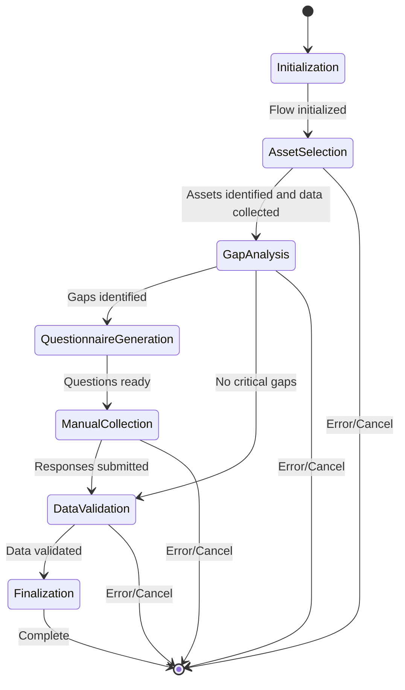

# Collection Flow Phase-by-Phase Walkthrough

## Executive Summary

This document provides a detailed walkthrough of each phase in the Collection Flow, explaining what happens at each step, the decisions made, and the outcomes produced. The Collection Flow is designed to be intelligent, adaptive, and resilient, collecting comprehensive data about applications and infrastructure for migration assessment.

## Phase Flow Diagram



## Phase 1: Initialization (5-10% of total time)

### What Happens
When a Collection Flow starts, the system performs essential setup:

1. **Flow Creation**
   - Generate unique flow_id (UUID)
   - Set initial status to 'initialized'
   - Configure automation tier based on environment

2. **Context Setup**
   - Load client_account_id and engagement_id
   - Establish user permissions
   - Set up audit logging

3. **Service Initialization**
   - Initialize CrewAI service connection
   - Set up database session
   - Configure platform adapters

4. **State Preparation**
   - Create CollectionFlowState object
   - Initialize phase tracking
   - Set up error handling

### Decision Points
- **Automation Tier Selection**: Based on discovery results or user preference
- **Platform Scope**: Which platforms to include in collection
- **Collection Strategy**: Depth vs. breadth of data collection

### Example Scenario
```python
# User initiates collection for a discovered engagement
POST /api/v1/collection/flows
X-Client-Account-ID: 12345678-1234-1234-1234-123456789012
X-Engagement-ID: 87654321-4321-4321-4321-210987654321
Content-Type: application/json

{
  "automation_tier": "tier_2",
  "discovery_flow_id": "disc-123",
  "selected_application_ids": ["app-1", "app-2", "app-3"]
}

# System response
{
  "flow_id": "550e8400-e29b-41d4-a716-446655440000",
  "status": "initialized",
  "current_phase": "initialization",
  "message": "Collection flow initialized successfully"
}
```

### Outcomes
- Flow record created in database
- Initial configuration stored
- Ready for platform detection

## Phase 2: Asset Selection (25-40% of total time)

### What Happens
The system identifies assets and automatically collects comprehensive data from selected platforms and systems. This consolidated phase combines platform detection with automated data collection for improved efficiency.

1. **Environment Scanning & Platform Detection**
   - Query cloud provider APIs (AWS, Azure, GCP)
   - Detect on-premise platforms
   - Identify containerized environments
   - Match platform signatures
   - Determine platform versions
   - Assess API accessibility

2. **Capability Assessment & Connection Setup**
   - Check available APIs
   - Verify authentication methods
   - Determine data extraction capabilities
   - Initialize platform-specific adapters
   - Establish secure connections
   - Verify access permissions

3. **Automated Data Collection**
   ```python
   # For each identified platform, collect:
   - Application metadata (names, versions, dependencies)
   - Configuration details (settings, parameters)
   - Performance metrics (CPU, memory, I/O)
   - Network topology (connections, ports, protocols)
   - Security settings (IAM, firewall rules)
   - Compliance data (tags, labels, policies)
   ```

4. **Data Processing & Storage**
   - Normalize data formats
   - Resolve entity references
   - Calculate derived metrics
   - Store raw data in collection_data table
   - Update application inventory
   - Link data to assets

### CrewAI Agent Actions
```python
# Integrated Asset Selection Agent workflow
asset_selection_result = {
    "detected_platforms": [
        {
            "type": "aws",
            "region": "us-east-1",
            "services": ["EC2", "RDS", "S3"],
            "api_version": "2023-01-01",
            "accessibility": "full"
        },
        {
            "type": "kubernetes",
            "cluster": "prod-cluster",
            "version": "1.28",
            "accessibility": "read-only"
        },
        {
            "type": "vmware",
            "datacenter": "DC1",
            "version": "7.0",
            "accessibility": "limited"
        }
    ],
    "collected_data": {
        "applications": 42,
        "instances": 38,
        "databases": 12,
        "network_connections": 156
    }
}
```

### Platform-Specific Collection Examples

#### AWS Collection
```python
# EC2 Instance Collection
instances = aws_adapter.describe_instances()
for instance in instances:
    asset_data = {
        "instance_id": instance.id,
        "instance_type": instance.type,
        "state": instance.state,
        "tags": instance.tags,
        "network": extract_network_config(instance),
        "storage": extract_storage_config(instance),
        "monitoring": extract_metrics(instance)
    }
    store_asset_data(asset_data)
```

#### Kubernetes Collection
```python
# Pod and Service Collection
pods = k8s_adapter.list_pods()
services = k8s_adapter.list_services()
for pod in pods:
    container_data = {
        "pod_name": pod.metadata.name,
        "containers": pod.spec.containers,
        "resources": pod.spec.resources,
        "service_connections": map_services(pod, services)
    }
    store_container_data(container_data)
```

### Decision Points
- **Platform Priority**: Which platforms to collect from first
- **Authentication Strategy**: How to securely access each platform
- **Collection Depth**: How much detail to gather per platform
- **Data Quality Threshold**: Minimum acceptable data completeness

### Error Handling
- **Connection Failures**: Retry with exponential backoff
- **Rate Limiting**: Implement throttling and queuing
- **Partial Failures**: Continue with available platforms
- **Data Corruption**: Validate and quarantine bad data

### Outcomes
- Complete platform inventory with connection strategies
- Raw data collected from all accessible platforms
- Initial application inventory populated
- Metrics and configurations stored
- Asset relationships mapped
- Ready for gap analysis

**Note**: This consolidated phase replaces the former "Platform Detection" and "Automated Collection" phases, reducing overall flow complexity while maintaining full functionality.

## Phase 3: Gap Analysis (10-15% of total time)

### What Happens
CrewAI agents analyze collected data to identify gaps:

1. **Completeness Assessment**
   - Compare collected attributes against requirements
   - Identify missing critical fields
   - Calculate data coverage percentages

2. **Quality Evaluation**
   - Assess data accuracy
   - Check for inconsistencies
   - Validate business rules

3. **Gap Categorization**
   ```python
   gaps = [
       {
           "attribute": "application_owner",
           "category": "business",
           "impact": "high",
           "priority": "critical",
           "reason": "Required for migration approval"
       },
       {
           "attribute": "data_classification",
           "category": "compliance",
           "impact": "high",
           "priority": "critical",
           "reason": "Required for security assessment"
       },
       {
           "attribute": "peak_load_metrics",
           "category": "technical",
           "impact": "medium",
           "priority": "important",
           "reason": "Needed for capacity planning"
       }
   ]
   ```

4. **Resolution Planning**
   - Determine collection methods for each gap
   - Prioritize gaps by business impact
   - Group related gaps for efficiency

### CrewAI Intelligence
The Gap Analysis Agent uses sophisticated logic:

```python
class GapAnalysisAgent:
    def analyze_gaps(self, collected_data, requirements):
        gaps = []
        
        # Check each requirement
        for req in requirements:
            if not self.is_satisfied(req, collected_data):
                gap = self.create_gap(req, collected_data)
                gap.priority = self.calculate_priority(gap)
                gaps.append(gap)
        
        # Identify implicit gaps
        implicit_gaps = self.find_implicit_gaps(collected_data)
        gaps.extend(implicit_gaps)
        
        # Group and prioritize
        return self.prioritize_gaps(gaps)
```

### Decision Points
- **Gap Threshold**: What percentage of gaps triggers manual collection
- **Priority Cutoff**: Which gaps are critical vs. nice-to-have
- **Collection Method**: Automated retry vs. manual questionnaire

### Outcomes
- Comprehensive gap analysis report
- Prioritized list of missing data
- Collection strategy for each gap

## Phase 4: Questionnaire Generation (5-10% of total time)

### What Happens
CrewAI agents generate adaptive questionnaires based on gaps:

1. **Question Creation**
   ```python
   # For each critical gap, generate targeted questions
   questions = []
   for gap in critical_gaps:
       question = {
           "id": f"q_{gap.attribute}",
           "text": generate_question_text(gap),
           "type": determine_field_type(gap),
           "validation": create_validation_rules(gap),
           "help_text": generate_context_help(gap),
           "required": gap.priority == "critical"
       }
       questions.append(question)
   ```

2. **Adaptive Logic**
   - Create conditional questions based on responses
   - Build skip logic to minimize user effort
   - Generate follow-up questions for clarification

3. **Validation Rules**
   ```javascript
   // Example validation rules
   {
     "application_owner": {
       "type": "email",
       "required": true,
       "pattern": "^[a-z]+@company.com$",
       "message": "Must be a valid company email"
     },
     "monthly_users": {
       "type": "number",
       "min": 0,
       "max": 1000000,
       "required": true
     },
     "criticality": {
       "type": "select",
       "options": ["low", "medium", "high", "critical"],
       "required": true
     }
   }
   ```

4. **Form Structuring**
   - Group related questions into sections
   - Order questions logically
   - Add progress indicators

### Bootstrap vs. Adaptive Questionnaires

#### Bootstrap Questionnaires (Fallback)
Generated when CrewAI agents are unavailable:
```python
def generate_bootstrap_questionnaire():
    return {
        "id": "bootstrap_basic_001",
        "title": "Application Information",
        "questions": [
            basic_application_questions(),
            basic_technical_questions(),
            basic_business_questions()
        ]
    }
```

#### Adaptive Questionnaires (Intelligent)
Generated by CrewAI based on specific gaps:
```python
def generate_adaptive_questionnaire(gaps, context):
    agent_prompt = f"""
    Generate questions to fill these data gaps:
    {gaps}
    
    Context: {context}
    
    Requirements:
    - Questions must be clear and specific
    - Include helpful context
    - Minimize user effort
    - Ensure data quality
    """
    
    return crewai_agent.generate_questionnaire(agent_prompt)
```

### Outcomes
- One or more questionnaires generated
- Questions mapped to specific gaps
- Validation rules configured

## Phase 5: Manual Collection (15-25% of total time)

### What Happens
Users complete adaptive questionnaires:

1. **Form Presentation**
   - Load questionnaire in UI
   - Pre-fill any known values
   - Display context and help

2. **User Interaction**
   ```typescript
   // User fills out form
   const formData = {
     application_owner: "john.doe@company.com",
     criticality: "high",
     monthly_users: 50000,
     data_classification: "confidential",
     compliance_requirements: ["GDPR", "SOC2"],
     migration_timeline: "Q3 2025"
   };
   ```

3. **Real-time Validation**
   - Validate on field blur
   - Show inline error messages
   - Calculate completion percentage

4. **Progressive Save**
   - Auto-save every 30 seconds
   - Save on page navigation
   - Preserve partial responses

5. **Submission Processing**
   ```python
   # Backend processes submission
   async def process_submission(flow_id, questionnaire_id, responses, context: RequestContext):
       # Validate all responses
       validation_result = await validate_responses(responses)
       
       # Store in database with multi-tenant context
       async with db.begin():
           for field_id, value in responses.items():
               await save_response(flow_id, field_id, value, context)
       
       # Update progress
       await update_flow_progress(flow_id, context)
       
       # Check for follow-up questions
       if await needs_follow_up(responses):
           await generate_follow_up_questionnaire(flow_id, context)
   ```

### User Experience Features
- **Smart Defaults**: Suggest likely values
- **Bulk Operations**: Apply values to multiple items
- **Import Capability**: Upload CSV/Excel data
- **Collaborative Editing**: Multiple users can contribute

### Outcomes
- User responses collected and stored
- Gaps filled with manual data
- Progress updated in real-time

## Phase 6: Data Validation (10-15% of total time)

### What Happens
All collected data is validated and synthesized:

1. **Cross-Reference Validation**
   ```python
   # Compare automated and manual data
   def validate_consistency(automated_data, manual_data):
       conflicts = []
       for attribute in common_attributes:
           if automated_data[attribute] != manual_data[attribute]:
               conflict = analyze_conflict(attribute, automated_data, manual_data)
               conflicts.append(conflict)
       return resolve_conflicts(conflicts)
   ```

2. **Business Rule Validation**
   - Check dependency relationships
   - Validate business constraints
   - Ensure regulatory compliance

3. **Data Quality Scoring**
   ```python
   async def calculate_quality_score(data):
       scores = {
           'completeness': await measure_completeness(data),
           'accuracy': await measure_accuracy(data),
           'consistency': await measure_consistency(data),
           'timeliness': await measure_timeliness(data)
       }
       quality_score = weighted_average(scores)
       
       # JSON Safety: Handle NaN/Infinity values
       if math.isnan(quality_score) or math.isinf(quality_score):
           return None  # Return None for invalid scores
       return max(0.0, min(1.0, quality_score))  # Clamp between 0 and 1
   ```

4. **Conflict Resolution**
   - Identify data conflicts
   - Apply resolution strategies
   - Log resolution decisions

### Validation Rules Engine
```python
class ValidationEngine:
    def validate(self, data):
        results = []
        
        # Technical validations
        results.extend(self.validate_technical_constraints(data))
        
        # Business validations
        results.extend(self.validate_business_rules(data))
        
        # Compliance validations
        results.extend(self.validate_compliance_requirements(data))
        
        # Calculate overall status
        return {
            'is_valid': all(r.passed for r in results),
            'confidence_score': self.calculate_confidence(results),
            'issues': [r for r in results if not r.passed]
        }
```

### Outcomes
- All data validated and conflicts resolved
- Quality scores calculated
- Ready for finalization

## Phase 7: Finalization (5-10% of total time)

### What Happens
The flow prepares data for handoff to Discovery Flow:

1. **Data Synthesis**
   ```python
   # Combine all collected data
   final_dataset = {
       'applications': synthesize_application_data(),
       'infrastructure': synthesize_infrastructure_data(),
       'dependencies': map_dependencies(),
       'metrics': aggregate_metrics(),
       'metadata': {
           'collection_completed': datetime.utcnow(),
           'quality_score': 0.92,
           'coverage': 0.95,
           'confidence': 0.88
       }
   }
   ```

2. **Report Generation**
   - Create collection summary
   - Generate quality report
   - Document gap resolution

3. **Handoff Preparation**
   - Package data for Discovery Flow
   - Update flow relationships
   - Set completion status

4. **Cleanup Operations**
   - Archive raw data
   - Clear temporary storage
   - Update audit logs

### Final Deliverables
```json
{
  "flow_id": "550e8400-e29b-41d4-a716-446655440000",
  "status": "completed",
  "summary": {
    "applications_collected": 45,
    "platforms_scanned": 3,
    "gaps_identified": 23,
    "gaps_resolved": 20,
    "quality_score": 0.92,  // Always check for NaN before JSON serialization
    "completion_time": "2 hours 15 minutes"
  },
  "readiness": {
    "ready_for_discovery": true,
    "blocking_issues": [],
    "recommendations": [
      "Review application dependencies",
      "Validate peak load metrics"
    ]
  }
}
```

### Outcomes
- Collection flow completed successfully
- Data ready for Discovery Flow
- Comprehensive audit trail maintained

## Pause and Resume Capability

At any phase, the flow can be paused and resumed:

### Pausing a Flow
```python
from app.db.sessions import AsyncSessionLocal

async def pause_flow(flow_id: UUID, context: RequestContext):
    async with AsyncSessionLocal() as session:
        flow = await get_scoped_flow(session, flow_id, context)
        flow.status = "paused"
        flow.pause_checkpoint = {
            "phase": flow.current_phase,
            "progress": flow.progress_percentage,
            "partial_results": await get_partial_results(session, flow_id, context),
        }
        await session.commit()
```

### Resuming a Flow
```python
from app.db.sessions import AsyncSessionLocal

async def resume_flow(flow_id: UUID, context: RequestContext, user_inputs=None):
    async with AsyncSessionLocal() as session:
        flow = await get_scoped_flow(session, flow_id, context)
        
        # Restore state
        flow.status = "running"
        if user_inputs:
            flow.user_inputs.update(user_inputs)
        
        # Resume from checkpoint with proper async handling
        phase_handler = await get_phase_handler(flow.current_phase)
        await session.commit()
        return await phase_handler.resume(flow, flow.pause_checkpoint)
```

## Error Scenarios and Recovery

### Common Error Scenarios

1. **Platform Connection Failure**
   - Automatic retry with backoff
   - Fall back to manual collection
   - Continue with other platforms

2. **Rate Limiting**
   - Implement request queuing
   - Throttle collection rate
   - Resume when limit resets

3. **Data Validation Failure**
   - Quarantine invalid data
   - Generate correction questionnaire
   - Request user clarification

4. **Agent Failure**
   - Fall back to bootstrap questionnaires
   - Use cached agent responses
   - Continue with reduced intelligence

### Recovery Strategies
```python
class ErrorRecoveryHandler:
    async def handle_error(self, error, flow_state):
        if isinstance(error, ConnectionError):
            return await self.handle_connection_error(error, flow_state)
        elif isinstance(error, ValidationError):
            return await self.handle_validation_error(error, flow_state)
        elif isinstance(error, AgentError):
            return await self.handle_agent_error(error, flow_state)
        else:
            return await self.handle_generic_error(error, flow_state)
```

## Performance Metrics

### Phase Timing Breakdown
- **Initialization**: 1-2 minutes
- **Asset Selection**: 15-35 minutes (consolidates platform detection and data collection)
- **Gap Analysis**: 2-5 minutes
- **Questionnaire Generation**: 1-3 minutes
- **Manual Collection**: 10-60 minutes (depends on user)
- **Data Validation**: 3-10 minutes
- **Finalization**: 1-3 minutes

**Total Estimated Time**: 32-116 minutes (reduced from previous 8-phase structure)

### Success Metrics
- **Coverage Rate**: Percentage of required data collected
- **Quality Score**: Data accuracy and completeness
- **Time to Complete**: Total elapsed time
- **User Effort**: Time spent on manual tasks
- **Error Rate**: Percentage of failed operations

## Development Environment Requirements

### Docker-First Development (MANDATORY)

**IMPORTANT**: All Collection Flow development and testing MUST use Docker.

```bash
# Start the complete development stack
docker-compose up -d

# Access points:
# - Frontend: http://localhost:8081 (NOT 3000)
# - Backend API: http://localhost:8000
# - Database: localhost:5432

# NEVER run npm run dev locally - Docker only!
```

### CrewAI Configuration Source and Injection

CrewAI flows receive configuration through dependency injection from multiple sources:

```python
# Configuration priority order:
# 1. Environment variables (CREWAI_*)
# 2. Database configuration (client_account_configs)
# 3. Default configuration (crewai_default_config.yaml)

class UnifiedCollectionFlow(Flow[CollectionFlowState]):
    def __init__(self, config: CrewAIFlowConfig):
        super().__init__()
        self.config = config  # Injected by FlowConfigService
        
    async def any_phase_handler(self):
        # Config is available throughout the flow lifecycle
        agent_config = self.config.get_agent_config("gap_analysis")
        return await self.handler.process(self.state, self.config)
```

### Testing Collection Flow Phases

```bash
# Test complete flow end-to-end
docker-compose exec backend python -m pytest tests/e2e/test_collection_flow.py

# Test specific phase handlers
docker-compose exec backend python -m pytest tests/unit/collection/test_gap_analysis.py

# Check browser console at http://localhost:8081 for 404 errors
```

## Conclusion

The Collection Flow represents a sophisticated orchestration of automated and manual processes, leveraging CrewAI intelligence to minimize user effort while maximizing data quality. Each phase builds upon the previous, creating a comprehensive dataset ready for the Discovery Flow to analyze and assess migration readiness.

### Key Architectural Principles
1. **Docker-First Development** - All development done in containers
2. **Multi-Tenant Isolation** - Always include client_account_id and engagement_id
3. **Async-First Database Operations** - Use async/await for all I/O
4. **JSON Safety** - Handle NaN/Infinity values in serialization
5. **Config Injection** - CrewAI configs injected through dependency injection
6. **Router Navigation** - Use navigate() instead of window.location.href
7. **Phase Consolidation** - Optimized 7-phase structure for improved efficiency
8. **Backward Compatibility** - Automatic migration from legacy 8-phase structure