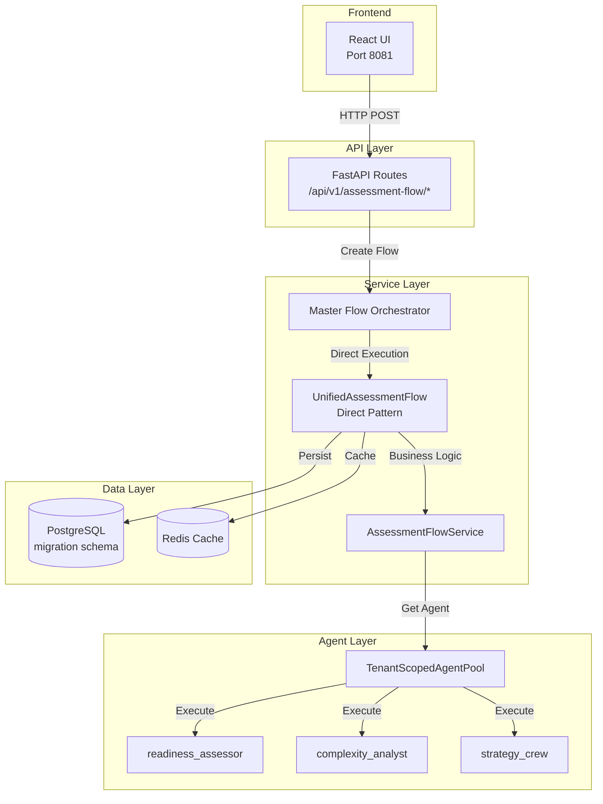
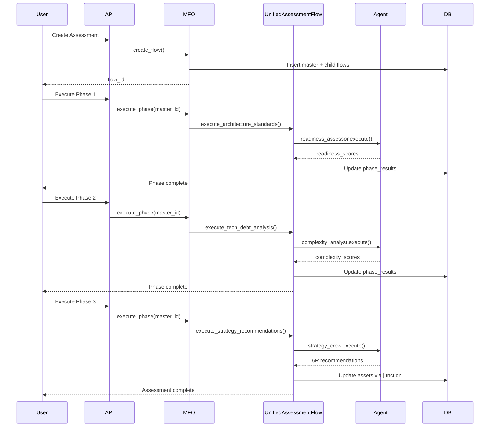

# Assessment Flow - Complete Implementation Guide

**Last Updated:** 2025-12-08
**Version:** 3.1.0
**Pattern:** Direct Flow (UnifiedAssessmentFlow)
**Status:** ✅ PRODUCTION READY

## 🎯 Overview

The Assessment flow is an AI-powered analysis workflow that evaluates cloud readiness and generates 6R migration recommendations for collected assets. It uses the Direct Flow pattern (UnifiedAssessmentFlow) with CrewAI agents to analyze architecture standards, technical debt, dependencies, and generate migration strategies with confidence scores.

**Key Capabilities:**
- Cloud architecture standards assessment with readiness scores against target cloud patterns
- Technical debt analysis identifying complexity hotspots and modernization priorities
- Dependency mapping for inter-application relationships and migration wave sequencing
- 6R strategy recommendations (Rehost/Replatform/Refactor/Repurchase/Retire/Retain) with confidence scores
- Two-phase completion: Agent completes analysis → User reviews → User confirms (prevents auto-completion)
- Junction table persistence for 6R strategies via canonical application linkage (ADR-036)
- Dual state architecture: Pydantic models for API/DB, In-Memory models for CrewAI execution

## 1. Quick Reference Card

- **Pattern**: Direct Flow (not Child Service pattern)
- **Primary Entry**: `/api/v1/assessment-flow/*`
- **Master Table**: `crewai_flow_state_extensions`
- **Child Table**: `assessment_flows`
- **Key Files**:
  - `backend/app/services/crewai_flows/unified_assessment_flow.py`
  - `backend/app/api/v1/endpoints/assessment_flow/`
  - `backend/app/services/assessment_flow_service/`
  - `backend/app/models/assessment_flows.py`
  - `backend/app/services/flow_configs/assessment_flow_config.py`
- **Critical ADRs**:
  - ADR-006 (Master Flow Orchestrator)
  - ADR-012 (Flow Status Separation)
  - ADR-024 (TenantMemoryManager)
  - ADR-025 (Direct Flow Pattern)
  - ADR-036 (Canonical Application Junction)

## 2. Architecture Layers Map

### API Layer (Request Handling)
```python
# Location: backend/app/api/v1/endpoints/assessment_flow/
```

**Endpoints:**
- `POST /api/v1/assessment-flow/create` - Create new assessment
- `GET /api/v1/assessment-flow/{flow_id}/status` - Get flow status
- `PUT /api/v1/assessment-flow/{master_flow_id}/architecture-standards` - Execute Phase 1
- `PUT /api/v1/assessment-flow/{master_flow_id}/tech-debt-analysis` - Execute Phase 2
- `PUT /api/v1/assessment-flow/{master_flow_id}/strategy-recommendations` - Execute Phase 3
- `POST /api/v1/assessment-flow/{flow_id}/accept-recommendations` - Accept 6R strategies
- `GET /api/v1/assessment-flow/{flow_id}/export` - Export results (PDF/Excel/JSON)

**Request/Response Schemas:**
```python
# backend/app/models/schemas/assessment_flow_schema.py
class AssessmentFlowCreate(BaseModel):
    flow_name: str
    selected_application_ids: List[UUID]
    assessment_type: str = "comprehensive"
    client_account_id: int
    engagement_id: int

class AssessmentFlowResponse(BaseModel):
    flow_id: UUID  # Child flow ID
    master_flow_id: UUID  # Master flow ID for MFO
    status: str
    current_phase: str
    phase_results: Dict[str, Any]
```

### Service Layer (Business Logic)
```python
# Location: backend/app/services/assessment_flow_service/
# Main service: backend/app/services/crewai_flows/unified_assessment_flow.py
```

**Core Classes:**
- `UnifiedAssessmentFlow` - Main flow orchestrator (Direct pattern)
- `AssessmentFlowService` - Business logic coordination
- `AssessmentManager` - Phase management
- `FlowCoordinator` - MFO integration

**Phase Handlers:**
```python
# backend/app/services/crewai_flows/assessment_flow/phase_handlers.py
class AssessmentPhaseHandlers:
    async def execute_architecture_standards(self, context: AssessmentContext)
    async def execute_tech_debt_analysis(self, context: AssessmentContext)
    async def execute_strategy_recommendations(self, context: AssessmentContext)
```

### Repository Layer (Data Access)
```python
# Location: backend/app/repositories/assessment_flow_repository.py
```

**Repository Classes:**
```python
class AssessmentFlowRepository:
    async def create(self, assessment_flow: AssessmentFlowCreate) -> AssessmentFlow
    async def get_by_id(self, flow_id: UUID) -> Optional[AssessmentFlow]
    async def get_by_master_flow_id(self, master_flow_id: UUID) -> Optional[AssessmentFlow]
    async def update_phase_results(self, flow_id: UUID, phase_name: str, results: Dict)
    async def update_status(self, flow_id: UUID, status: str)
```

**Query Patterns:**
```python
# Always include tenant scoping
stmt = select(AssessmentFlow).where(
    AssessmentFlow.id == flow_id,
    AssessmentFlow.client_account_id == context.client_account_id,
    AssessmentFlow.engagement_id == context.engagement_id
)
```

### Model Layer (Data Structures)

**SQLAlchemy Models:**
```python
# backend/app/models/assessment_flows.py
class AssessmentFlow(Base):
    __tablename__ = "assessment_flows"
    __table_args__ = {"schema": "migration"}

    id = Column(UUID, primary_key=True)  # Child flow ID
    master_flow_id = Column(UUID, ForeignKey("migration.crewai_flow_state_extensions.flow_id"))
    flow_name = Column(String)
    status = Column(String)  # initialized, running, completed
    current_phase = Column(String)
    phase_results = Column(JSONB)  # Stores all phase outputs
    selected_application_ids = Column(JSONB)  # List of canonical_application IDs

    # Multi-tenant scoping
    client_account_id = Column(Integer)
    engagement_id = Column(Integer)
```

**JSONB Structure for phase_results:**
```json
{
  "architecture_standards": {
    "readiness_scores": {"app1": 0.85, "app2": 0.72},
    "standards": {...},
    "compliance_gaps": [...],
    "timestamp": "2025-11-19T10:00:00Z"
  },
  "tech_debt_analysis": {
    "complexity_scores": {...},
    "debt_items": [...],
    "modernization_opportunities": [...],
    "timestamp": "2025-11-19T10:30:00Z"
  },
  "strategy_recommendations": {
    "applications": [
      {
        "application_id": "uuid",
        "six_r_strategy": "rehost",
        "confidence": 0.88,
        "rationale": "..."
      }
    ],
    "timestamp": "2025-11-19T11:00:00Z"
  }
}
```

### Cache Layer (Performance)
```python
# Location: backend/app/core/cache/
```

**Redis Keys:**
```python
# Assessment results caching
f"assessment:{flow_id}:phase_results" - TTL: 3600s
f"assessment:{flow_id}:recommendations" - TTL: 7200s
f"assessment:{engagement_id}:canonical_apps" - TTL: 1800s
```

**Caching Strategy:**
```python
# Cache expensive agent results
@cache_result(key="assessment:{flow_id}:readiness", ttl=3600)
async def get_readiness_assessment(flow_id: UUID):
    # Expensive CrewAI agent execution
    pass
```

### Queue Layer (Async Processing)
```python
# Location: backend/app/services/background_tasks/
```

**Background Tasks:**
```python
# Assessment report generation
@background_task
async def generate_assessment_report(flow_id: UUID, format: str):
    # Long-running PDF/Excel generation
    pass

# 6R recommendation persistence
@background_task
async def persist_recommendations_to_assets(flow_id: UUID):
    # Update assets table with 6R strategies
    pass
```

### Integration Layer (External Services)

**CrewAI Agents:**
```python
# Location: backend/app/services/persistent_agents/
# Agent definitions: backend/app/services/persistent_agents/agent_pool_constants.py

ASSESSMENT_AGENTS = {
    "readiness_assessor": {
        "role": "Migration Readiness Assessment Agent",
        "tools": ["asset_intelligence", "critical_attributes"],
        "memory": False  # Per ADR-024
    },
    "complexity_analyst": {
        "role": "Migration Complexity Analysis Agent",
        "tools": ["dependency_analysis", "tech_debt_scanner"],
        "memory": False
    },
    "strategy_crew": {
        "agents": ["risk_assessor", "recommendation_generator"],
        "memory": False
    }
}
```

**LLM Integration:**
```python
# Always use multi_model_service for tracking
from app.services.multi_model_service import multi_model_service

response = await multi_model_service.generate_response(
    prompt=assessment_prompt,
    task_type="assessment_analysis",
    complexity=TaskComplexity.AGENTIC,
    client_account_id=context.client_account_id,
    engagement_id=context.engagement_id
)
```

## 3. Phase Execution Details

### Phase 1: Architecture Standards Assessment

**Purpose**: Establish cloud architecture baseline and compliance requirements

**Entry Point**:
```python
# API: PUT /api/v1/assessment-flow/{master_flow_id}/architecture-standards
# Service: UnifiedAssessmentFlow.execute_architecture_standards()
```

**CrewAI Agent**: `readiness_assessor`
```python
# Agent activation from TenantScopedAgentPool
agent = await agent_pool.get_or_create_agent(
    agent_type="readiness_assessor",
    client_id=context.client_account_id,
    engagement_id=context.engagement_id
)
```

**Database Updates**:
```sql
UPDATE migration.assessment_flows
SET
    current_phase = 'architecture_standards',
    phase_results = jsonb_set(
        phase_results,
        '{architecture_standards}',
        %(results)s
    ),
    status = 'running'
WHERE id = %(flow_id)s;
```

**State Transitions**:
- `initialized` → `running` (on phase start)
- Updates `current_phase` to `architecture_standards`
- Stores results in `phase_results.architecture_standards`

**Error Scenarios**:
- Missing canonical applications → HTTP 400
- Agent execution timeout → Retry with exponential backoff
- Invalid compliance requirements → Validation error

**Retry Logic**:
```python
@retry(
    stop=stop_after_attempt(3),
    wait=wait_exponential(multiplier=1, min=4, max=10),
    retry=retry_if_exception_type(AgentExecutionError)
)
async def execute_with_retry(agent, context):
    return await agent.execute(context)
```

### Phase 2: Technical Debt Analysis

**Purpose**: Identify technical debt and modernization priorities

**Entry Point**:
```python
# API: PUT /api/v1/assessment-flow/{master_flow_id}/tech-debt-analysis
# Service: UnifiedAssessmentFlow.execute_tech_debt_analysis()
```

**CrewAI Agent**: `complexity_analyst`

**Database Updates**:
- Updates `current_phase` to `tech_debt_analysis`
- Stores complexity scores and debt items in JSONB
- Links to dependency analysis results

**State Transitions**:
- Requires `architecture_standards` phase completed
- Can run in parallel with dependency analysis
- Updates progress percentage: 33% → 66%

### Phase 3: 6R Strategy Recommendations

**Purpose**: Generate migration strategy recommendations

**Entry Point**:
```python
# API: PUT /api/v1/assessment-flow/{master_flow_id}/strategy-recommendations
# Service: UnifiedAssessmentFlow.execute_strategy_recommendations()
```

**CrewAI Agents**: `risk_assessor` + `recommendation_generator` (crew pattern)

**Critical Implementation (ADR-036)**:
```python
# Use canonical application junction table for persistence
async def persist_recommendations(recommendations: List[Dict]):
    for rec in recommendations:
        # Get asset IDs via junction table
        stmt = select(CollectionFlowApplication.asset_id).where(
            CollectionFlowApplication.canonical_application_id == rec["application_id"],
            CollectionFlowApplication.client_account_id == context.client_account_id
        )
        asset_ids = await db.execute(stmt).scalars().all()

        # Update assets with 6R strategy
        await db.execute(
            update(Asset)
            .where(Asset.id.in_(asset_ids))
            .values(
                six_r_strategy=rec["six_r_strategy"],
                confidence_score=rec["confidence"],
                assessment_flow_id=flow_id
            )
        )
```

## 4. Critical Code Patterns

### Master Flow ID Resolution Pattern (CRITICAL)
```python
# ALWAYS resolve master_flow_id before calling MFO
@router.put("/execute/{flow_id}")
async def execute_phase(
    flow_id: str,  # Child flow ID from URL
    db: AsyncSession = Depends(get_db),
    context: RequestContext = Depends(get_current_context)
):
    # Step 1: Get child flow
    child_flow = await db.execute(
        select(AssessmentFlow).where(
            AssessmentFlow.id == UUID(flow_id),
            AssessmentFlow.client_account_id == context.client_account_id,
            AssessmentFlow.engagement_id == context.engagement_id
        )
    ).scalar_one_or_none()

    if not child_flow or not child_flow.master_flow_id:
        raise HTTPException(404, "Flow not found")

    # Step 2: Use master_flow_id for MFO
    orchestrator = MasterFlowOrchestrator(db, context)
    result = await orchestrator.execute_phase(
        str(child_flow.master_flow_id),  # MASTER ID
        "architecture_standards",
        {"flow_id": flow_id}  # Child ID in context
    )
```

### TenantMemoryManager Integration (ADR-024)
```python
# Store agent learning after task completion
from app.services.crewai_flows.memory.tenant_memory_manager import (
    TenantMemoryManager,
    LearningScope
)

async def store_assessment_patterns(context, results):
    memory_manager = TenantMemoryManager(
        crewai_service=crewai_service,
        database_session=db
    )

    await memory_manager.store_learning(
        client_account_id=context.client_account_id,
        engagement_id=context.engagement_id,
        scope=LearningScope.ENGAGEMENT,
        pattern_type="readiness_assessment",
        pattern_data={
            "compliance_patterns": results["compliance_gaps"],
            "architecture_standards": results["standards"],
            "confidence": results["confidence"]
        }
    )
```

### Observability Pattern
```python
from app.services.crewai_flows.handlers.callback_handler_integration import (
    CallbackHandlerIntegration
)

# Create callback handler for tracking
callback_handler = CallbackHandlerIntegration.create_callback_handler(
    flow_id=str(master_flow.flow_id),
    context={
        "client_account_id": str(context.client_account_id),
        "engagement_id": str(context.engagement_id),
        "flow_type": "assessment",
        "phase": "architecture_standards"
    }
)
callback_handler.setup_callbacks()
```

## 5. Visual Flow Diagrams

### Overall Architecture


### Phase Progression Flow


## 6. Common Pitfalls & Solutions

### Pitfall 1: Using Child ID for MFO Calls
```python
# ❌ WRONG
await orchestrator.execute_phase(flow_id, "phase_name", {})

# ✅ CORRECT
await orchestrator.execute_phase(master_flow_id, "phase_name", {"flow_id": flow_id})
```

### Pitfall 2: Direct CrewAI Memory Usage
```python
# ❌ WRONG
crew = Crew(agents=[agent], memory=True)

# ✅ CORRECT (ADR-024)
crew = create_crew(agents=[agent], memory=False)
# Use TenantMemoryManager for learning
```

### Pitfall 3: Missing Tenant Scoping
```python
# ❌ WRONG
flows = await db.execute(select(AssessmentFlow))

# ✅ CORRECT
flows = await db.execute(
    select(AssessmentFlow).where(
        AssessmentFlow.client_account_id == context.client_account_id,
        AssessmentFlow.engagement_id == context.engagement_id
    )
)
```

### Pitfall 4: Not Using Junction Table for 6R Updates
```python
# ❌ WRONG (Bug #999)
await db.execute(
    update(Asset).where(Asset.application_name == app_name)
)

# ✅ CORRECT (ADR-036)
# Use canonical_application_id via junction table
asset_ids = await get_asset_ids_via_junction(canonical_app_id)
await db.execute(
    update(Asset).where(Asset.id.in_(asset_ids))
)
```

## 7. Testing Guide

### Unit Tests
```bash
# Test individual components
pytest backend/tests/unit/services/assessment_flow_service_test.py -v
pytest backend/tests/unit/models/assessment_flow_test.py -v
```

**Example Unit Test:**
```python
# backend/tests/unit/services/assessment_flow_service_test.py
import pytest
from unittest.mock import AsyncMock, patch

@pytest.mark.asyncio
async def test_execute_architecture_standards():
    # Arrange
    service = AssessmentFlowService(db=mock_db, context=mock_context)
    mock_agent = AsyncMock()
    mock_agent.execute.return_value = {
        "readiness_scores": {"app1": 0.85},
        "confidence": 0.88
    }

    with patch("app.services.persistent_agents.TenantScopedAgentPool.get_or_create_agent", return_value=mock_agent):
        # Act
        result = await service.execute_architecture_standards(flow_id)

        # Assert
        assert result["readiness_scores"]["app1"] == 0.85
        assert mock_agent.execute.called
```

### Integration Tests
```bash
# Test full flow execution
pytest backend/tests/integration/assessment_flow_test.py -v
```

**Example Integration Test:**
```python
# backend/tests/integration/assessment_flow_test.py
@pytest.mark.integration
async def test_full_assessment_flow(test_client, test_db):
    # Create flow
    response = await test_client.post(
        "/api/v1/assessment-flow/create",
        json={
            "flow_name": "Test Assessment",
            "selected_application_ids": [str(uuid4())],
            "client_account_id": 1,
            "engagement_id": 1
        }
    )
    assert response.status_code == 201
    flow_id = response.json()["flow_id"]

    # Execute Phase 1
    response = await test_client.put(
        f"/api/v1/assessment-flow/{flow_id}/architecture-standards"
    )
    assert response.status_code == 200

    # Verify database update
    flow = await test_db.execute(
        select(AssessmentFlow).where(AssessmentFlow.id == flow_id)
    ).scalar_one()
    assert flow.current_phase == "architecture_standards"
    assert "architecture_standards" in flow.phase_results
```

### E2E Playwright Tests
```typescript
// tests/e2e/assessment-flow.spec.ts
import { test, expect } from '@playwright/test';

test.describe('Assessment Flow E2E', () => {
  test('Complete assessment workflow', async ({ page }) => {
    // Navigate to assessment creation
    await page.goto('http://localhost:8081/assessment/create');

    // Fill form
    await page.fill('[data-testid="flow-name"]', 'E2E Test Assessment');

    // Select applications
    await page.click('[data-testid="app-selector"]');
    await page.click('[data-testid="app-1"]');
    await page.click('[data-testid="app-2"]');

    // Create flow
    await page.click('[data-testid="create-button"]');

    // Wait for redirect to assessment page
    await expect(page).toHaveURL(/\/assessment\/[a-f0-9-]+$/);

    // Execute Phase 1
    await page.click('[data-testid="execute-phase-1"]');
    await expect(page.locator('[data-testid="phase-1-status"]')).toContainText('running');

    // Wait for completion
    await page.waitForSelector('[data-testid="phase-1-complete"]', { timeout: 30000 });

    // Verify results displayed
    await expect(page.locator('[data-testid="readiness-scores"]')).toBeVisible();

    // Execute Phase 2
    await page.click('[data-testid="execute-phase-2"]');
    await page.waitForSelector('[data-testid="phase-2-complete"]', { timeout: 30000 });

    // Execute Phase 3
    await page.click('[data-testid="execute-phase-3"]');
    await page.waitForSelector('[data-testid="phase-3-complete"]', { timeout: 30000 });

    // Accept recommendations
    await page.click('[data-testid="accept-recommendations"]');
    await expect(page.locator('[data-testid="success-message"]')).toContainText('Recommendations accepted');

    // Export report
    await page.click('[data-testid="export-pdf"]');
    const download = await page.waitForEvent('download');
    expect(download.suggestedFilename()).toContain('assessment-report');
  });

  test('Handle assessment errors gracefully', async ({ page }) => {
    await page.goto('http://localhost:8081/assessment/create');

    // Try to create without selecting apps
    await page.fill('[data-testid="flow-name"]', 'Error Test');
    await page.click('[data-testid="create-button"]');

    // Should show validation error
    await expect(page.locator('[data-testid="error-message"]')).toContainText('Select at least one application');
  });
});
```

### Load Testing
```python
# tests/load/assessment_flow_load_test.py
import asyncio
from locust import HttpUser, task, between

class AssessmentFlowUser(HttpUser):
    wait_time = between(1, 3)

    @task
    def create_and_execute_assessment(self):
        # Create flow
        response = self.client.post(
            "/api/v1/assessment-flow/create",
            json={
                "flow_name": f"Load Test {self.user_id}",
                "selected_application_ids": ["uuid1", "uuid2"]
            }
        )
        flow_id = response.json()["flow_id"]

        # Execute phases
        for phase in ["architecture-standards", "tech-debt-analysis", "strategy-recommendations"]:
            self.client.put(f"/api/v1/assessment-flow/{flow_id}/{phase}")
            time.sleep(2)  # Simulate user think time
```

## 8. Quick Code Navigation

### Find phase execution:
```bash
grep -r "execute_architecture_standards" backend/app/services/
grep -r "execute_tech_debt" backend/app/services/
grep -r "execute_strategy" backend/app/services/
```

### Find agent activation:
```bash
grep -r "TenantScopedAgentPool.*readiness" backend/app/services/
grep -r "get_or_create_agent.*complexity" backend/app/services/
```

### Find API endpoints:
```bash
grep -r "@router\.\(post\|put\|get\).*assessment" backend/app/api/
```

### Find database updates:
```bash
grep -r "update(AssessmentFlow" backend/app/
grep -r "phase_results.*jsonb_set" backend/app/
```

### Find junction table usage:
```bash
grep -r "CollectionFlowApplication.*canonical" backend/app/
grep -r "canonical_application_id.*asset" backend/app/
```

## 9. Version History

| Date | Version | Changes | ADRs | Issues |
|------|---------|---------|------|--------|
| 2025-11-19 | 3.1.0 | Added comprehensive documentation | - | - |
| 2025-11-12 | 3.0.0 | Junction table for 6R persistence | ADR-036 | #999 |
| 2025-10-25 | 2.5.0 | Removed 6R Analysis endpoints | ADR-025 | #840 |
| 2025-10-15 | 2.0.0 | MFO integration complete | ADR-006, ADR-012 | - |
| 2025-10-02 | 1.5.0 | TenantMemoryManager integration | ADR-024 | - |
| 2025-09-15 | 1.0.0 | Initial assessment flow | - | - |

## 10. Deprecated Features

### Removed in v3.0.0
- **6R Analysis endpoints** (`/api/v1/6r/*`) → Use Assessment Flow
- **sixr_tools module** → Integrated into assessment tools
- **SixRStrategyCrew** → Renamed to AssessmentStrategyCrew

### Deprecated Patterns
- **crew_class pattern** → Use Direct Flow (UnifiedAssessmentFlow)
- **CrewAI memory=True** → Use TenantMemoryManager (ADR-024)
- **Direct asset updates by name** → Use junction table (ADR-036)

## 11. Monitoring & Observability

### Key Metrics
```python
# Grafana Dashboard: /d/assessment-flow/
```

- **Flow Metrics**:
  - Creation rate: `assessment_flows_created_total`
  - Completion rate: `assessment_flows_completed_total`
  - Phase duration: `assessment_phase_duration_seconds`
  - Error rate: `assessment_errors_total`

- **Agent Metrics**:
  - Agent execution time: `agent_execution_duration_seconds{agent="readiness_assessor"}`
  - Agent success rate: `agent_success_rate{flow="assessment"}`
  - Memory patterns stored: `tenant_memory_patterns_total`

- **LLM Metrics**:
  - Tokens used: `llm_tokens_total{flow="assessment"}`
  - Cost per flow: `llm_cost_dollars{flow="assessment"}`
  - Response time: `llm_response_duration_seconds`

### Logging
```python
import structlog
logger = structlog.get_logger(__name__)

# Structured logging pattern
logger.info(
    "assessment_phase_executed",
    flow_id=flow_id,
    phase=phase_name,
    duration=execution_time,
    agent=agent_type,
    client_account_id=context.client_account_id,
    engagement_id=context.engagement_id
)
```

### Tracing
```python
# OpenTelemetry integration
from opentelemetry import trace

tracer = trace.get_tracer(__name__)

with tracer.start_as_current_span("assessment_flow_execution") as span:
    span.set_attribute("flow.id", flow_id)
    span.set_attribute("flow.phase", phase_name)
    # Execute phase
```

## 12. Security Considerations

### Multi-Tenant Isolation
- All queries include `client_account_id` and `engagement_id`
- Row-level security via composite indexes
- Tenant context propagated through all layers

### Input Validation
```python
# Pydantic models for all inputs
class AssessmentFlowCreate(BaseModel):
    flow_name: str = Field(..., min_length=1, max_length=255)
    selected_application_ids: List[UUID] = Field(..., min_items=1)

    @validator('flow_name')
    def validate_flow_name(cls, v):
        if not v.strip():
            raise ValueError("Flow name cannot be empty")
        return v.strip()
```

### Authorization
```python
# Check user permissions
@require_permission("assessment:create")
async def create_assessment_flow(
    request: AssessmentFlowCreate,
    current_user: User = Depends(get_current_user)
):
    # Verify user has access to engagement
    if not await user_has_engagement_access(current_user, request.engagement_id):
        raise HTTPException(403, "Access denied")
```

## 13. Performance Optimization

### Database Indexes
```sql
-- Critical indexes for assessment flow
CREATE INDEX idx_assessment_flows_master_flow_id
    ON migration.assessment_flows(master_flow_id);
CREATE INDEX idx_assessment_flows_tenant
    ON migration.assessment_flows(client_account_id, engagement_id);
CREATE INDEX idx_assessment_flows_status
    ON migration.assessment_flows(status) WHERE status != 'completed';
```

### Query Optimization
```python
# Use select specific columns
stmt = select(
    AssessmentFlow.id,
    AssessmentFlow.status,
    AssessmentFlow.current_phase
).where(...)  # Don't fetch JSONB unless needed

# Batch operations
await db.execute(
    update(Asset)
    .where(Asset.id.in_(asset_ids))
    .values(six_r_strategy=case(
        (Asset.id == id1, "rehost"),
        (Asset.id == id2, "replatform"),
        else_="retain"
    ))
)
```

### Caching Strategy
```python
# Cache expensive computations
@cache.memoize(timeout=3600)
async def get_canonical_applications(engagement_id: int):
    # Expensive query with joins
    pass

# Invalidate on updates
@cache.delete_memoized(get_canonical_applications)
async def update_canonical_application(app_id: UUID):
    pass
```

---

**End of Assessment Flow Documentation**

*For questions or updates, consult the ADRs referenced above or check Serena memories for architectural context.*