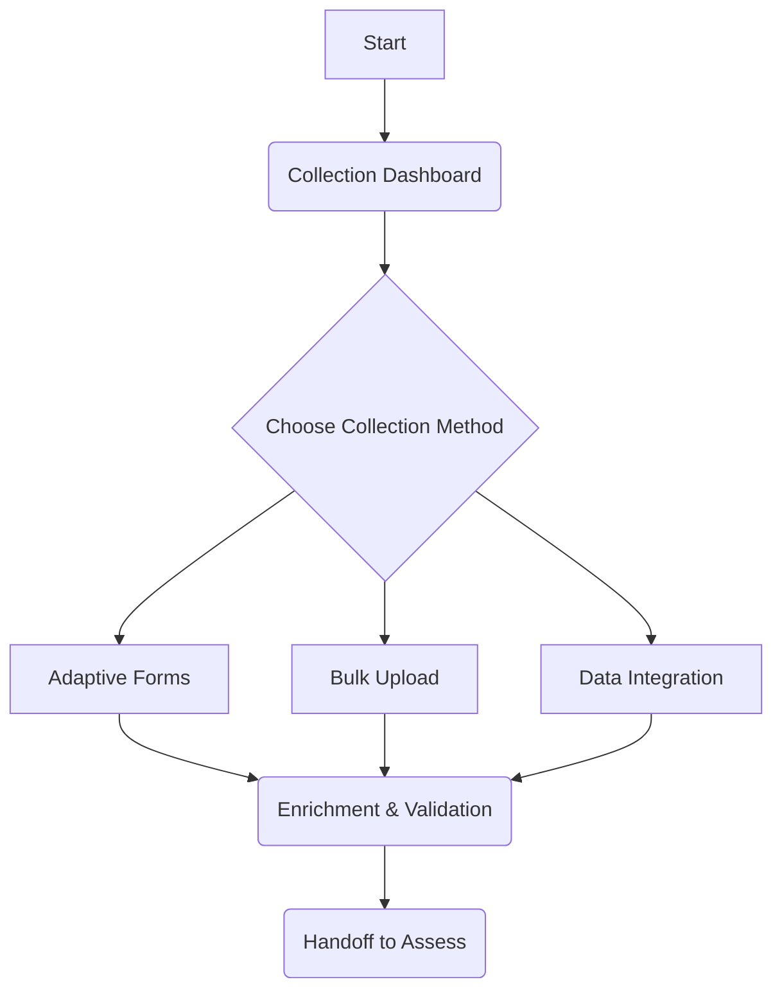

# E2E Flow: 04 - Collection

This document outlines the end-to-end user and data flow for the **Collection** phase of the migration process.

## 1. Objective

The primary objective of the Collection flow is to gather detailed information about the assets identified during the **Discovery** phase. This involves a combination of automated data collection, manual data entry through adaptive forms, and bulk data uploads. The goal is to enrich the asset inventory with the necessary details to perform a comprehensive assessment.

## 2. Flow Summary

The Collection flow is initiated from the main Collection dashboard. Users can choose from several collection methods depending on their environment and the data they need to collect.

## 3. Key Features & Components

- **Adaptive Data Collection**: The system intelligently determines the data collection method based on the environment and user input.
- **Multiple Collection Methods**: Supports adaptive forms, bulk uploads, and direct data integrations.
- **CrewAI-Powered Orchestration**: The entire flow is orchestrated by CrewAI agents, ensuring a flexible and intelligent data collection process.
- **Data Validation & Enrichment**: Collected data is validated and enriched before being handed off to the Assessment phase.

## 4. Directory Structure

The documentation for the Collection flow is organized as follows:

- **`00_Collection_Flow_Summary.md`**: This file.
- **`01_Overview_Page.md`**: Describes the main Collection dashboard and how users initiate the flow.
- **`02_Adaptive_Forms.md`**: Details the process of collecting data using dynamically generated forms.
- **`03_Bulk_Upload.md`**: Explains how to upload data in bulk using spreadsheets.
- **`04_Data_Integration.md`**: Covers direct integration with data sources for automated collection.
- **`05_Data_Validation.md`**: Describes the data validation and enrichment process.
- **`06_Handoff_to_Assess.md`**: Explains how the collected data is handed off to the Assessment flow.
