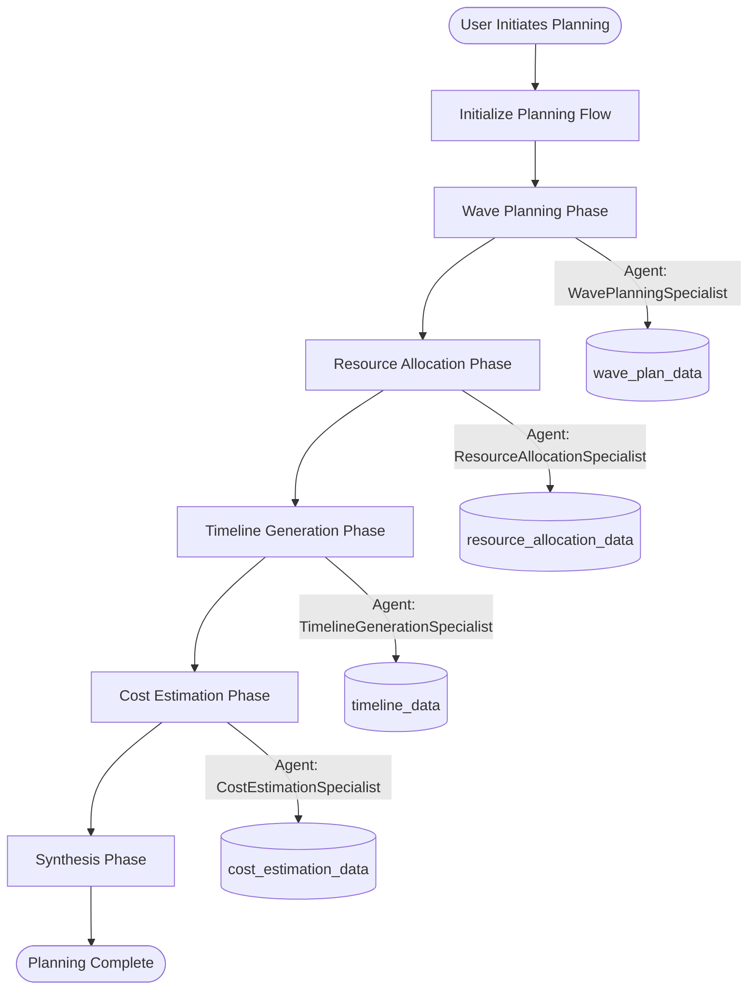
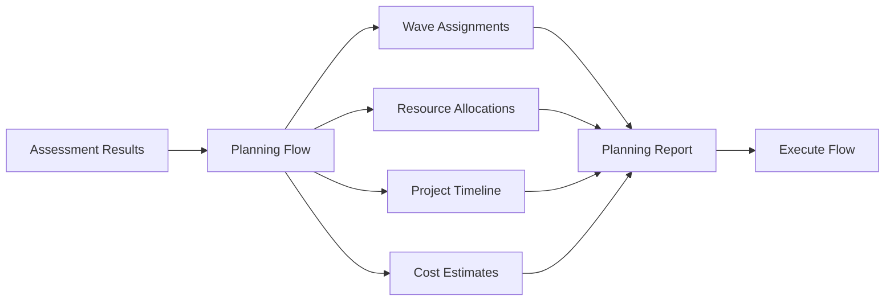

# Planning Flow Complete Implementation Guide

## Quick Reference Card

| Aspect | Details |
|--------|---------|
| **Flow Type** | Planning (Migration Strategy) |
| **Pattern** | Child Service Pattern (planned - not yet implemented) |
| **Database Tables** | `planning_flows`, `project_timelines`, `timeline_phases`, `timeline_milestones`, `resource_pools`, `resource_allocations`, `resource_skills` |
| **Entry Point** | `/api/v1/master-flows/planning/*` |
| **Key Files** | `planning_service.py`, `planning_flow_repository.py`, `planning_crew.py` |
| **Phases** | 6 phases: Wave Planning → Resource Allocation → Timeline → Cost Estimation → Synthesis → Completed |
| **CrewAI Agents** | WavePlanningSpecialist, ResourceAllocationSpecialist, TimelineGenerationSpecialist, CostEstimationSpecialist |
| **Status** | Database ✅, Service ✅, Agents ✅, Frontend ⚠️ (partial), API ✅ |

## Table of Contents
1. [Flow Architecture](#1-flow-architecture)
2. [7-Layer Architecture Mapping](#2-7-layer-architecture-mapping)
3. [Database Schema](#3-database-schema)
4. [Phase Execution Details](#4-phase-execution-details)
5. [API Endpoints](#5-api-endpoints)
6. [Frontend Implementation](#6-frontend-implementation)
7. [Critical Code Patterns](#7-critical-code-patterns)
8. [Visual Diagrams](#8-visual-diagrams)
9. [Testing Guide](#9-testing-guide)
10. [Common Issues & Solutions](#10-common-issues--solutions)
11. [Security Considerations](#11-security-considerations)
12. [Performance Optimization](#12-performance-optimization)
13. [Version History](#13-version-history)

## 1. Flow Architecture

### Overview
The Planning Flow translates assessment results into actionable migration plans with wave planning, resource allocation, timeline generation, and cost estimation.

### Key Characteristics
- **Sequential Phases**: Strict phase progression (wave → resource → timeline → cost → synthesis)
- **AI-Driven Recommendations**: 4 specialized agents provide intelligent planning
- **Manual Override**: Users can modify AI suggestions at any phase
- **Hybrid Storage**: JSONB for flexibility + relational for queries
- **Auto-Progression**: Phases transition automatically on completion

### Pattern Selection
Currently uses direct service pattern but should migrate to Child Service Pattern for consistency with Collection/Discovery flows.

## 2. 7-Layer Architecture Mapping

### Layer 1: API Layer
```python
# backend/app/api/v1/master_flows/planning/initialize.py
@router.post("/initialize", response_model=PlanningFlowResponse)
async def initialize_planning_flow(
    request: InitializePlanningFlowRequest,
    db: AsyncSession = Depends(get_db),
    context: RequestContext = Depends(get_current_context),
):
    """Entry point for planning flow initialization"""
    service = PlanningFlowService(db, context)
    result = await service.initialize_planning_flow(
        engagement_id=request.engagement_id,
        selected_application_ids=request.selected_application_ids,
        planning_config=request.planning_config.dict(),
        created_by=context.user_id,
    )
    return result
```

### Layer 2: Service Layer
```python
# backend/app/services/planning_service.py:81-190
class PlanningFlowService:
    async def initialize_planning_flow(
        self,
        engagement_id: int,
        selected_application_ids: List[str],
        planning_config: Dict,
        created_by: str,
    ) -> Dict:
        """Orchestrates planning flow creation and initial phase execution"""
        # Validate configuration
        await self.validate_planning_config(planning_config)

        # Create planning flow
        planning_flow = await self.repository.create(
            PlanningFlow(
                client_account_id=self.context.client_account_id,
                engagement_id=engagement_id,
                current_phase="wave_planning",
                phase_status="ready",
                planning_config=planning_config,
                selected_applications=selected_application_ids,
            )
        )

        # Auto-execute wave planning
        if planning_config.get("auto_execute_wave_planning", True):
            await self.execute_wave_planning_phase(str(planning_flow.id))

        return planning_flow
```

### Layer 3: Repository Layer
```python
# backend/app/repositories/planning_flow_repository.py:82-324
class PlanningFlowRepository(ContextAwareRepository[PlanningFlow]):
    """Multi-tenant aware repository for planning flows"""

    async def create(self, planning_flow: PlanningFlow) -> PlanningFlow:
        """Creates planning flow with tenant scoping"""
        planning_flow.client_account_id = self.client_account_id
        planning_flow.engagement_id = self.engagement_id

        self.session.add(planning_flow)
        await self.session.commit()
        await self.session.refresh(planning_flow)
        return planning_flow

    async def save_wave_plan_data(
        self, planning_flow_id: UUID, wave_plan_data: Dict
    ) -> None:
        """Saves wave planning results to JSONB column"""
        stmt = (
            update(PlanningFlow)
            .where(
                PlanningFlow.id == planning_flow_id,
                PlanningFlow.client_account_id == self.client_account_id,
                PlanningFlow.engagement_id == self.engagement_id,
            )
            .values(wave_plan_data=wave_plan_data)
        )
        await self.session.execute(stmt)
        await self.session.commit()
```

### Layer 4: Model Layer
```python
# backend/app/models/planning_flow.py
class PlanningFlow(Base):
    """SQLAlchemy model for planning flows"""
    __tablename__ = "planning_flows"
    __table_args__ = {"schema": "migration"}

    id = Column(UUID(as_uuid=True), primary_key=True, default=uuid.uuid4)
    planning_flow_id = Column(UUID(as_uuid=True), unique=True, nullable=False)
    master_flow_id = Column(UUID(as_uuid=True), ForeignKey("migration.crewai_flow_state_extensions.flow_id"))

    # Multi-tenant scoping
    client_account_id = Column(Integer, nullable=False)
    engagement_id = Column(Integer, nullable=False)

    # Phase tracking
    current_phase = Column(String(50), nullable=False)
    phase_status = Column(String(20), nullable=False)

    # JSONB columns for flexible data
    planning_config = Column(JSONB)
    wave_plan_data = Column(JSONB)
    resource_allocation_data = Column(JSONB)
    timeline_data = Column(JSONB)
    cost_estimation_data = Column(JSONB)

    # Timestamps
    created_at = Column(DateTime(timezone=True), default=func.now())
    updated_at = Column(DateTime(timezone=True), onupdate=func.now())
    planning_completed_at = Column(DateTime(timezone=True))
```

### Layer 5: Cache Layer
```python
# Currently not implemented for Planning Flow
# TODO: Add Redis caching for frequently accessed planning data
```

### Layer 6: Queue Layer
```python
# Planning phases execute synchronously (no background tasks)
# Future enhancement: Move agent execution to background queue
```

### Layer 7: Integration Layer
```python
# backend/app/services/crewai_flows/crews/planning_crew.py:102-192
class PlanningCrew:
    """CrewAI integration for planning agents"""

    async def execute_wave_planning(
        self,
        selected_applications: List[Dict],
        planning_config: Dict,
    ) -> Dict:
        """Executes wave planning with WavePlanningSpecialist agent"""
        # Get agent from pool
        agent = await TenantScopedAgentPool.get_or_create_agent(
            agent_type="wave_planning_specialist",
            client_id=self.client_account_id,
            engagement_id=self.engagement_id,
        )

        # Create task
        task = Task(
            description=f"""
            Analyze {len(selected_applications)} applications and create migration waves.
            Constraints:
            - Max {planning_config['max_apps_per_wave']} applications per wave
            - Wave duration limit: {planning_config['wave_duration_limit_days']} days

            Consider dependencies, complexity, and 6R strategies.
            """,
            expected_output="Wave plan with assignments and metadata",
            agent=agent,
        )

        # Execute with tenant context
        result = await task.execute_async(
            context={
                "applications": selected_applications,
                "config": planning_config,
            }
        )

        return self._parse_wave_plan(result)
```

## 3. Database Schema

### Core Tables (Migrations 112-114)

#### planning_flows
```sql
CREATE TABLE migration.planning_flows (
    id UUID PRIMARY KEY DEFAULT gen_random_uuid(),
    planning_flow_id UUID UNIQUE NOT NULL,
    master_flow_id UUID REFERENCES migration.crewai_flow_state_extensions(flow_id),

    -- Multi-tenant scoping
    client_account_id INTEGER NOT NULL,
    engagement_id INTEGER NOT NULL,

    -- Phase management
    current_phase VARCHAR(50) NOT NULL,
    phase_status VARCHAR(20) NOT NULL,

    -- JSONB columns for flexible data
    planning_config JSONB,
    wave_plan_data JSONB,
    resource_allocation_data JSONB,
    timeline_data JSONB,
    cost_estimation_data JSONB,
    agent_execution_log JSONB,
    ui_state JSONB,
    validation_errors JSONB,
    warnings JSONB,
    selected_applications JSONB,

    -- Timestamps
    created_at TIMESTAMPTZ DEFAULT NOW(),
    updated_at TIMESTAMPTZ DEFAULT NOW(),
    planning_completed_at TIMESTAMPTZ,

    -- Indexes
    CONSTRAINT uk_planning_flow_master UNIQUE (master_flow_id)
);

-- Performance indexes
CREATE INDEX idx_planning_tenant ON migration.planning_flows (client_account_id, engagement_id);
CREATE INDEX idx_planning_phase ON migration.planning_flows (current_phase, phase_status);
CREATE INDEX idx_wave_plan_gin ON migration.planning_flows USING GIN (wave_plan_data);
CREATE INDEX idx_resource_gin ON migration.planning_flows USING GIN (resource_allocation_data);
```

#### project_timelines
```sql
CREATE TABLE migration.project_timelines (
    id UUID PRIMARY KEY DEFAULT gen_random_uuid(),
    planning_flow_id UUID REFERENCES migration.planning_flows(id),

    timeline_name VARCHAR(255) NOT NULL,
    overall_start_date TIMESTAMPTZ NOT NULL,
    overall_end_date TIMESTAMPTZ NOT NULL,
    timeline_status VARCHAR(20) NOT NULL,

    -- Multi-tenant scoping
    client_account_id INTEGER NOT NULL,
    engagement_id INTEGER NOT NULL,

    created_at TIMESTAMPTZ DEFAULT NOW(),
    updated_at TIMESTAMPTZ DEFAULT NOW()
);
```

#### resource_pools
```sql
CREATE TABLE migration.resource_pools (
    id UUID PRIMARY KEY DEFAULT gen_random_uuid(),

    pool_name VARCHAR(100) NOT NULL,
    role_name VARCHAR(100) NOT NULL,  -- Per #690: role-based resources

    total_capacity_hours NUMERIC(10,2) NOT NULL,
    available_capacity_hours NUMERIC(10,2) NOT NULL,
    allocated_capacity_hours NUMERIC(10,2) NOT NULL DEFAULT 0,
    hourly_rate NUMERIC(10,2) NOT NULL,
    utilization_percentage NUMERIC(5,2) GENERATED ALWAYS AS
        (allocated_capacity_hours / NULLIF(total_capacity_hours, 0) * 100) STORED,

    skills JSONB,  -- Array of skill strings

    -- Multi-tenant scoping
    client_account_id INTEGER NOT NULL,
    engagement_id INTEGER NOT NULL,

    created_at TIMESTAMPTZ DEFAULT NOW(),
    updated_at TIMESTAMPTZ DEFAULT NOW()
);
```

## 4. Phase Execution Details

### Phase 1: Wave Planning
```python
# backend/app/services/planning_service.py:196-300
async def execute_wave_planning_phase(self, planning_flow_id: str) -> Dict:
    """Groups applications into sequential migration waves"""

    # Validate phase
    planning_flow = await self.repository.get_by_id(UUID(planning_flow_id))
    if planning_flow.current_phase != "wave_planning":
        raise HTTPException(400, "Invalid phase transition")

    # Update status
    await self.repository.update_phase_status(
        planning_flow.id, "wave_planning", "running"
    )

    # Execute agent
    planning_crew = PlanningCrew(self.db, self.context)
    wave_plan = await planning_crew.execute_wave_planning(
        selected_applications=planning_flow.selected_applications,
        planning_config=planning_flow.planning_config,
    )

    # Save results
    await self.repository.save_wave_plan_data(
        planning_flow.id, wave_plan
    )

    # Log execution
    await self._log_agent_execution(
        planning_flow.id,
        "wave_planning_specialist",
        wave_plan,
    )

    # Auto-progress to resource allocation
    await self.repository.update_phase_status(
        planning_flow.id, "resource_allocation", "ready"
    )

    return wave_plan
```

### Phase 2: Resource Allocation
```python
# backend/app/services/planning_service.py:302-447
async def execute_resource_allocation_phase(self, planning_flow_id: str) -> Dict:
    """Allocates role-based resources to waves with AI recommendations"""

    planning_flow = await self.repository.get_by_id(UUID(planning_flow_id))

    # Validate prerequisites
    if not planning_flow.wave_plan_data:
        raise HTTPException(400, "Wave plan required before resource allocation")

    # Execute agent
    planning_crew = PlanningCrew(self.db, self.context)
    resource_allocation = await planning_crew.execute_resource_allocation(
        wave_plan=planning_flow.wave_plan_data,
        planning_config=planning_flow.planning_config,
    )

    # Create resource pool entries
    for allocation in resource_allocation["allocations"]:
        await self._create_resource_allocation(
            planning_flow_id=planning_flow.id,
            wave_id=allocation["wave_id"],
            resource_pool_id=allocation["resource_pool_id"],
            allocated_hours=allocation["allocated_hours"],
            is_ai_suggested=True,
            ai_confidence_score=allocation["confidence_score"],
        )

    # Identify skill gaps
    skill_gaps = await self._analyze_skill_gaps(
        resource_allocation["allocations"]
    )

    # Add warnings (non-blocking)
    if skill_gaps:
        await self.repository.add_warnings(
            planning_flow.id,
            {"skill_gaps": skill_gaps}
        )

    # Save and progress
    await self.repository.save_resource_allocation_data(
        planning_flow.id, resource_allocation
    )
    await self.repository.update_phase_status(
        planning_flow.id, "timeline_generation", "ready"
    )

    return resource_allocation
```

### Phase 3: Timeline Generation
```python
# backend/app/services/planning_service.py:449-539
async def execute_timeline_generation_phase(self, planning_flow_id: str) -> Dict:
    """Generates project timeline with CPM and Gantt visualization"""

    planning_flow = await self.repository.get_by_id(UUID(planning_flow_id))

    # Execute agent
    planning_crew = PlanningCrew(self.db, self.context)
    timeline = await planning_crew.execute_timeline_generation(
        wave_plan=planning_flow.wave_plan_data,
        resource_allocation=planning_flow.resource_allocation_data,
        planning_config=planning_flow.planning_config,
    )

    # Create timeline structure
    project_timeline = await self.repository.create_timeline(
        ProjectTimeline(
            planning_flow_id=planning_flow.id,
            timeline_name=timeline["timeline_name"],
            overall_start_date=timeline["start_date"],
            overall_end_date=timeline["end_date"],
            timeline_status="active",
        )
    )

    # Create phases
    for phase in timeline["phases"]:
        await self.repository.create_timeline_phase(
            TimelinePhase(
                timeline_id=project_timeline.id,
                phase_number=phase["number"],
                phase_name=phase["name"],
                planned_start_date=phase["start_date"],
                planned_end_date=phase["end_date"],
                wave_number=phase["wave_number"],
            )
        )

    # Create milestones
    for milestone in timeline["milestones"]:
        await self.repository.create_milestone(
            TimelineMilestone(
                timeline_id=project_timeline.id,
                milestone_number=milestone["number"],
                milestone_name=milestone["name"],
                target_date=milestone["date"],
                description=milestone["description"],
            )
        )

    # Save and progress
    await self.repository.save_timeline_data(
        planning_flow.id, timeline
    )
    await self.repository.update_phase_status(
        planning_flow.id, "cost_estimation", "ready"
    )

    return timeline
```

### Phase 4: Cost Estimation
```python
# backend/app/services/planning_service.py:541-626
async def execute_cost_estimation_phase(self, planning_flow_id: str) -> Dict:
    """Calculates comprehensive migration costs"""

    planning_flow = await self.repository.get_by_id(UUID(planning_flow_id))

    # Execute agent
    planning_crew = PlanningCrew(self.db, self.context)
    cost_estimation = await planning_crew.execute_cost_estimation(
        wave_plan=planning_flow.wave_plan_data,
        resource_allocation=planning_flow.resource_allocation_data,
        timeline=planning_flow.timeline_data,
        planning_config=planning_flow.planning_config,
    )

    # Apply contingency
    contingency_pct = planning_flow.planning_config.get("contingency_percentage", 15)
    cost_estimation["contingency"] = (
        cost_estimation["subtotal"] * contingency_pct / 100
    )
    cost_estimation["total"] = (
        cost_estimation["subtotal"] + cost_estimation["contingency"]
    )

    # Save and progress
    await self.repository.save_cost_estimation_data(
        planning_flow.id, cost_estimation
    )
    await self.repository.update_phase_status(
        planning_flow.id, "synthesis", "ready"
    )

    return cost_estimation
```

### Phase 5: Synthesis
```python
# backend/app/services/planning_service.py:628-767
async def execute_synthesis_phase(self, planning_flow_id: str) -> Dict:
    """Consolidates all planning results"""

    planning_flow = await self.repository.get_by_id(UUID(planning_flow_id))

    # Validate all phases completed
    required_data = [
        planning_flow.wave_plan_data,
        planning_flow.resource_allocation_data,
        planning_flow.timeline_data,
        planning_flow.cost_estimation_data,
    ]
    if not all(required_data):
        raise HTTPException(400, "All phases must complete before synthesis")

    # Generate executive summary
    executive_summary = {
        "total_applications": len(planning_flow.selected_applications),
        "total_waves": len(planning_flow.wave_plan_data["waves"]),
        "total_duration_days": self._calculate_duration(
            planning_flow.timeline_data["start_date"],
            planning_flow.timeline_data["end_date"],
        ),
        "total_cost": planning_flow.cost_estimation_data["total"],
        "skill_gaps_identified": len(
            planning_flow.warnings.get("skill_gaps", [])
        ),
    }

    # Generate recommendations
    recommendations = await self._generate_recommendations(planning_flow)

    # Mark completed
    await self.repository.update_phase_status(
        planning_flow.id, "completed", "completed"
    )
    planning_flow.planning_completed_at = datetime.utcnow()
    await self.repository.update(planning_flow)

    return {
        "executive_summary": executive_summary,
        "recommendations": recommendations,
        "wave_plan": planning_flow.wave_plan_data,
        "resource_allocation": planning_flow.resource_allocation_data,
        "timeline": planning_flow.timeline_data,
        "cost_estimation": planning_flow.cost_estimation_data,
    }
```

## 5. API Endpoints

### MFO-Integrated Endpoints (IMPLEMENTED)
```python
# All in backend/app/api/v1/master_flows/planning/

# Initialize planning flow
POST /api/v1/master-flows/planning/initialize
{
    "engagement_id": 1,
    "selected_application_ids": ["uuid1", "uuid2"],
    "planning_config": {
        "max_apps_per_wave": 5,
        "wave_duration_limit_days": 90,
        "contingency_percentage": 15
    }
}

# Execute specific phase
POST /api/v1/master-flows/planning/execute-phase
{
    "planning_flow_id": "uuid",
    "phase": "wave_planning"
}

# Get planning status
GET /api/v1/master-flows/planning/status/{flow_id}

# Update wave plan (manual override)
PUT /api/v1/master-flows/planning/update
{
    "planning_flow_id": "uuid",
    "wave_plan_data": {...}
}

# Export planning data
GET /api/v1/master-flows/planning/export/{flow_id}?format=pdf
```

## 6. Frontend Implementation

### Key Components
```typescript
// src/components/plan/PlanningInitializationWizard.tsx
export const PlanningInitializationWizard: React.FC = () => {
    const [step, setStep] = useState(1);
    const [selectedApps, setSelectedApps] = useState<string[]>([]);
    const [config, setConfig] = useState({
        max_apps_per_wave: 5,
        wave_duration_limit_days: 90,
        contingency_percentage: 15,
    });

    const { mutate: initializePlanning } = useMutation({
        mutationFn: planningFlowApi.initializePlanningFlow,
        onSuccess: (data) => {
            navigate(`/plan/waves?planning_flow_id=${data.planning_flow_id}`);
        },
    });

    const handleSubmit = () => {
        initializePlanning({
            engagement_id: currentEngagement.id,
            selected_application_ids: selectedApps,
            planning_config: config,
        });
    };

    return (
        <MultiStepWizard>
            <ApplicationSelectionStep />
            <ConfigurationStep />
            <ReviewStep onSubmit={handleSubmit} />
        </MultiStepWizard>
    );
};
```

### Wave Dashboard
```typescript
// src/components/plan/WaveDashboard.tsx
export const WaveDashboard: React.FC = () => {
    const { planning_flow_id } = useParams();

    const { data: status, isLoading } = useQuery({
        queryKey: ['planning-status', planning_flow_id],
        queryFn: () => planningFlowApi.getPlanningStatus(planning_flow_id),
        refetchInterval: status?.phase_status === 'running' ? 5000 : false,
    });

    if (isLoading) return <LoadingSpinner />;

    const waves = status?.wave_plan_data?.waves || [];

    return (
        <div className="grid grid-cols-1 md:grid-cols-2 lg:grid-cols-3 gap-4">
            {waves.map((wave) => (
                <WaveCard key={wave.wave_number} wave={wave} />
            ))}
            <AddWaveCard onClick={() => setShowModal(true)} />
        </div>
    );
};
```

## 7. Critical Code Patterns

### Pattern 1: Master Flow ID Resolution
```python
# CRITICAL - Two different UUIDs!
planning_flow = await db.execute(
    select(PlanningFlow).where(
        PlanningFlow.id == UUID(flow_id),  # Child ID from URL
        PlanningFlow.client_account_id == context.client_account_id,
        PlanningFlow.engagement_id == context.engagement_id,
    )
).scalar_one_or_none()

master_flow_id = planning_flow.master_flow_id  # Master ID for MFO

# Call MFO with master ID, pass child ID in phase_input
result = await orchestrator.execute_phase(
    str(master_flow_id),  # MFO routing
    "wave_planning",
    {"flow_id": flow_id}  # Persistence
)
```

### Pattern 2: JSONB Data Updates
```python
# Atomic JSONB updates with proper locking
async def save_wave_plan_data(self, planning_flow_id: UUID, data: Dict):
    async with self.session.begin():
        # Lock row for update
        stmt = (
            select(PlanningFlow)
            .where(PlanningFlow.id == planning_flow_id)
            .with_for_update()
        )
        planning_flow = await self.session.execute(stmt).scalar_one()

        # Update JSONB
        planning_flow.wave_plan_data = data
        planning_flow.updated_at = datetime.utcnow()

        await self.session.commit()
```

### Pattern 3: Agent Memory Integration
```python
# Per ADR-024 - NO CrewAI memory, use TenantMemoryManager
from app.services.crewai_flows.memory.tenant_memory_manager import (
    TenantMemoryManager, LearningScope
)

# Before agent execution - retrieve patterns
memory_manager = TenantMemoryManager(crewai_service, db)
patterns = await memory_manager.retrieve_similar_patterns(
    client_account_id=context.client_account_id,
    engagement_id=context.engagement_id,
    scope=LearningScope.ENGAGEMENT,
    pattern_type="wave_planning",
    query_context={"applications": len(selected_apps)}
)

# After agent completion - store learnings
await memory_manager.store_learning(
    client_account_id=context.client_account_id,
    engagement_id=context.engagement_id,
    scope=LearningScope.ENGAGEMENT,
    pattern_type="wave_planning",
    pattern_data={
        "optimal_wave_size": result["avg_apps_per_wave"],
        "wave_count": result["total_waves"],
        "dependency_complexity": result["complexity"],
    }
)
```

## 8. Visual Diagrams

### Phase Flow Diagram


### Data Flow Diagram


## 9. Testing Guide

### Unit Tests
```python
# backend/tests/unit/services/test_planning_service.py
@pytest.mark.asyncio
async def test_wave_planning_phase():
    """Test wave planning phase execution"""
    service = PlanningFlowService(db, context)

    # Create planning flow
    flow = await service.initialize_planning_flow(
        engagement_id=1,
        selected_application_ids=["app1", "app2", "app3"],
        planning_config={
            "max_apps_per_wave": 2,
            "wave_duration_limit_days": 90,
        },
        created_by="test_user",
    )

    # Execute wave planning
    result = await service.execute_wave_planning_phase(str(flow.id))

    assert result["waves"]
    assert len(result["waves"]) == 2  # 3 apps, max 2 per wave
    assert flow.current_phase == "resource_allocation"
```

### Integration Tests
```python
# backend/tests/integration/test_planning_flow_e2e.py
@pytest.mark.asyncio
async def test_complete_planning_flow():
    """Test complete planning flow from init to synthesis"""
    async with AsyncClient(app=app) as client:
        # Initialize
        response = await client.post(
            "/api/v1/master-flows/planning/initialize",
            json={
                "engagement_id": 1,
                "selected_application_ids": ["app1", "app2"],
                "planning_config": {...},
            },
        )
        assert response.status_code == 200
        planning_flow_id = response.json()["planning_flow_id"]

        # Execute phases
        for phase in ["wave_planning", "resource_allocation",
                     "timeline_generation", "cost_estimation", "synthesis"]:
            response = await client.post(
                "/api/v1/master-flows/planning/execute-phase",
                json={
                    "planning_flow_id": planning_flow_id,
                    "phase": phase,
                },
            )
            assert response.status_code == 200

        # Verify completion
        response = await client.get(
            f"/api/v1/master-flows/planning/status/{planning_flow_id}"
        )
        assert response.json()["current_phase"] == "completed"
```

### E2E Playwright Tests
```typescript
// tests/e2e/planning-flow.spec.ts
test('Complete planning flow', async ({ page }) => {
    // Navigate to planning
    await page.goto('/plan');

    // Start initialization wizard
    await page.click('button:text("Start Planning")');

    // Select applications
    await page.waitForSelector('[data-testid="app-selection"]');
    await page.check('[data-testid="app-checkbox-1"]');
    await page.check('[data-testid="app-checkbox-2"]');
    await page.click('button:text("Next")');

    // Configure planning
    await page.fill('[name="max_apps_per_wave"]', '5');
    await page.fill('[name="wave_duration_limit_days"]', '90');
    await page.fill('[name="contingency_percentage"]', '15');
    await page.click('button:text("Next")');

    // Submit
    await page.click('button:text("Create Planning Flow")');

    // Wait for wave planning to complete
    await page.waitForSelector('[data-testid="wave-dashboard"]', {
        timeout: 30000
    });

    // Verify waves created
    const waves = await page.$$('[data-testid="wave-card"]');
    expect(waves.length).toBeGreaterThan(0);

    // Export report
    await page.click('button:text("Export Report")');
    const download = await page.waitForEvent('download');
    expect(download.suggestedFilename()).toContain('planning-report');
});
```

## 10. Common Issues & Solutions

### Issue 1: Planning Flow Not Found
```python
# Problem: 404 when accessing planning flow
# Solution: Ensure tenant scoping in query

# ❌ WRONG
planning_flow = await db.get(PlanningFlow, flow_id)

# ✅ CORRECT
planning_flow = await db.execute(
    select(PlanningFlow).where(
        PlanningFlow.id == flow_id,
        PlanningFlow.client_account_id == context.client_account_id,
        PlanningFlow.engagement_id == context.engagement_id,
    )
).scalar_one_or_none()
```

### Issue 2: Phase Transition Failures
```python
# Problem: Cannot progress to next phase
# Solution: Validate prerequisites

if planning_flow.current_phase != expected_phase:
    raise HTTPException(
        400,
        f"Invalid phase transition from {planning_flow.current_phase}"
    )

if not planning_flow.wave_plan_data and phase == "resource_allocation":
    raise HTTPException(400, "Wave plan required before resource allocation")
```

### Issue 3: JSONB Update Race Conditions
```python
# Problem: Concurrent updates to JSONB columns
# Solution: Use row-level locking

async with self.session.begin():
    stmt = (
        select(PlanningFlow)
        .where(PlanningFlow.id == planning_flow_id)
        .with_for_update()  # Lock row
    )
    planning_flow = await self.session.execute(stmt).scalar_one()
    planning_flow.wave_plan_data = updated_data
    await self.session.commit()
```

## 11. Security Considerations

### Multi-Tenant Isolation
- All queries filtered by `client_account_id` and `engagement_id`
- Repository pattern enforces tenant scoping automatically
- No cross-tenant data leakage possible

### Input Validation
```python
# Validate planning configuration
def validate_planning_config(config: Dict):
    if config.get("max_apps_per_wave", 0) < 1:
        raise ValueError("max_apps_per_wave must be >= 1")

    if config.get("wave_duration_limit_days", 0) < 30:
        raise ValueError("wave_duration_limit_days must be >= 30")

    if not 0 <= config.get("contingency_percentage", 0) <= 100:
        raise ValueError("contingency_percentage must be 0-100")
```

### Agent Output Sanitization
```python
# Sanitize agent outputs before storage
def sanitize_agent_output(output: Dict) -> Dict:
    # Remove any potential script injection
    return json.loads(
        json.dumps(output, cls=SafeJSONEncoder)
    )
```

## 12. Performance Optimization

### JSONB Indexing
```sql
-- GIN indexes for fast JSONB queries
CREATE INDEX idx_wave_plan_gin ON migration.planning_flows
    USING GIN (wave_plan_data);
CREATE INDEX idx_resource_gin ON migration.planning_flows
    USING GIN (resource_allocation_data);
CREATE INDEX idx_timeline_gin ON migration.planning_flows
    USING GIN (timeline_data);
```

### Query Optimization
```python
# Use select specific columns instead of full entity
stmt = (
    select(
        PlanningFlow.id,
        PlanningFlow.current_phase,
        PlanningFlow.phase_status,
        PlanningFlow.wave_plan_data,
    )
    .where(PlanningFlow.id == flow_id)
)
```

### Caching Strategy (TODO)
```python
# Add Redis caching for frequently accessed data
@cache.memoize(timeout=300)
async def get_planning_status(planning_flow_id: str):
    # Cache planning status for 5 minutes
    return await repository.get_status(planning_flow_id)
```

## 13. Version History

### v1.0.0 (November 2025)
- Initial implementation with 6 phases
- 4 CrewAI specialist agents
- JSONB + relational hybrid storage
- MFO integration complete

### v1.1.0 (Planned)
- Migrate to Child Service Pattern for consistency
- Add Redis caching layer
- Background task queue for agent execution
- Enhanced export formats (PowerBI, Tableau)

### Migration Notes
- **Migration 112**: Creates planning_flows table with JSONB columns
- **Migration 113**: Creates timeline tables (project_timelines, phases, milestones)
- **Migration 114**: Creates resource tables (pools, allocations, skills)
- **Migration 115**: Updates to UUID tenant IDs (breaking change)

### Breaking Changes
- **v1.1.0**: Will migrate from direct service to Child Service Pattern
- **Migration 115**: Changed tenant IDs from INTEGER to UUID

---

## Appendix: Quick Command Reference

```bash
# Check planning flow status
docker exec -it migration_postgres psql -U postgres -d migration_db -c \
  "SELECT id, current_phase, phase_status FROM migration.planning_flows WHERE engagement_id = 1;"

# View wave plan data
docker exec -it migration_postgres psql -U postgres -d migration_db -c \
  "SELECT wave_plan_data FROM migration.planning_flows WHERE id = 'uuid';"

# Check resource allocations
docker exec -it migration_postgres psql -U postgres -d migration_db -c \
  "SELECT * FROM migration.resource_allocations WHERE planning_flow_id = 'uuid';"

# View timeline
docker exec -it migration_postgres psql -U postgres -d migration_db -c \
  "SELECT * FROM migration.project_timelines pt
   JOIN migration.timeline_phases tp ON pt.id = tp.timeline_id
   WHERE pt.planning_flow_id = 'uuid';"
```