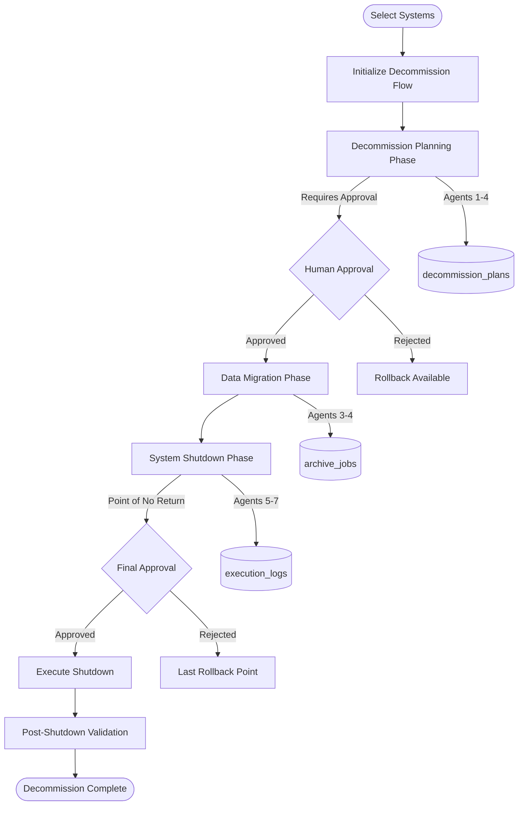
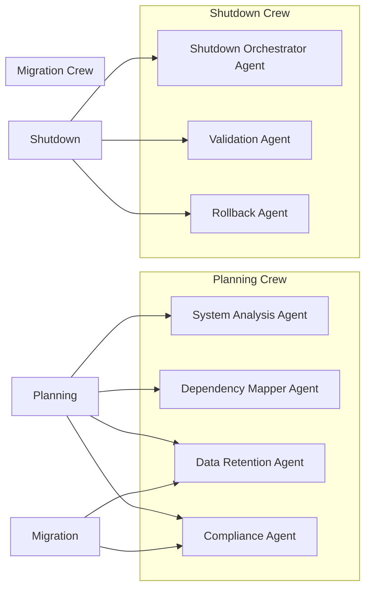

# Decommission Flow Complete Implementation Guide

## Quick Reference Card

| Aspect | Details |
|--------|---------|
| **Flow Type** | Decommission (System Retirement) |
| **Pattern** | Child Service Pattern (DecommissionChildFlowService) |
| **Database Tables** | `decommission_flows`, `decommission_plans`, `data_retention_policies`, `archive_jobs`, `decommission_execution_logs` |
| **Entry Point** | `/api/v1/decommission-flow/*` |
| **Key Files** | `decommission_child_flow_service.py`, `decommission_flow_repository.py`, `agent_configs.py` |
| **Phases** | 3 phases: Decommission Planning → Data Migration → System Shutdown |
| **CrewAI Agents** | 7 specialized agents (System Analysis, Dependency Mapper, Data Retention, Compliance, Shutdown Orchestrator, Validation, Rollback) |
| **Status** | ~40% Complete (Foundation ✅, Agents ⚠️, UI ⚠️, Integration ❌) |

## Table of Contents
1. [Flow Architecture](#1-flow-architecture)
2. [7-Layer Architecture Mapping](#2-7-layer-architecture-mapping)
3. [Database Schema](#3-database-schema)
4. [Phase Execution Details](#4-phase-execution-details)
5. [API Endpoints](#5-api-endpoints)
6. [Frontend Implementation](#6-frontend-implementation)
7. [Critical Code Patterns](#7-critical-code-patterns)
8. [Visual Diagrams](#8-visual-diagrams)
9. [Testing Guide](#9-testing-guide)
10. [Common Issues & Solutions](#10-common-issues--solutions)
11. [Security Considerations](#11-security-considerations)
12. [Performance Optimization](#12-performance-optimization)
13. [Version History](#13-version-history)

## 1. Flow Architecture

### Overview
The Decommission Flow is a **human-in-the-loop** workflow that guides users through structured system retirement while maintaining safety, compliance, and audit trails.

### Key Characteristics
- **NOT Fully Automated**: Requires human decisions at every phase
- **Irreversible After Shutdown**: Rollback only available until system shutdown begins
- **Compliance-Driven**: GDPR, SOX, HIPAA data retention requirements
- **Approval Workflows**: Stakeholder sign-offs required
- **Audit Trail**: Complete history for compliance

### Pattern Selection
Uses **Child Service Pattern** (ADR-025) for:
- Complex multi-phase operations
- Safety-critical decisions
- Approval workflow management
- Rollback capabilities

### Human-in-the-Loop Reality
```
Current Implementation (40%):
✅ Basic flow structure
✅ Database models
✅ API endpoints
✅ UI pages

Missing for Full Human-in-Loop:
❌ Manual input forms for progress
❌ Approval workflow UI
❌ Artifact upload & storage
❌ Cost/ROI input forms
❌ Stakeholder notifications
```

## 2. 7-Layer Architecture Mapping

### Layer 1: API Layer
```python
# backend/app/api/v1/endpoints/decommission_flow/initialize.py
@router.post("/initialize", response_model=DecommissionFlowResponse)
async def initialize_decommission_flow(
    request: InitializeDecommissionFlowRequest,
    db: AsyncSession = Depends(get_db),
    context: RequestContext = Depends(get_current_context),
):
    """Entry point for decommission flow initialization"""
    # CRITICAL: FastAPI's get_db() manages transaction context
    # Do NOT use nested async with db.begin()

    mfo = MasterFlowOrchestrator(db, context)
    master_flow_id = await mfo.create_flow(
        flow_type="decommission",
        configuration={
            "selected_system_ids": request.selected_system_ids,
            "decommission_strategy": request.strategy,
        },
        atomic=True,  # Prevents internal commits
    )

    await db.flush()  # Makes master_flow_id available for FK

    # Create child flow
    child_service = DecommissionChildFlowService(db, context)
    child_flow = await child_service.create_child_flow(
        master_flow_id=master_flow_id,
        selected_system_ids=request.selected_system_ids,
    )

    await db.commit()  # Explicit commit

    return {"master_flow_id": str(master_flow_id)}
```

### Layer 2: Service Layer
```python
# backend/app/services/child_flows/decommission_child_flow_service.py
class DecommissionChildFlowService(BaseChildFlowService):
    """Manages decommission-specific operations per ADR-025"""

    async def execute_phase(
        self,
        flow_id: str,
        phase_name: str,
        phase_input: Dict,
    ) -> Dict:
        """Execute specific decommission phase"""

        # Get child flow by master ID
        child_flow = await self.repository.get_by_master_flow_id(
            UUID(flow_id)
        )

        if phase_name == "decommission_planning":
            return await self._execute_planning_phase(
                child_flow, phase_input
            )
        elif phase_name == "data_migration":
            return await self._execute_data_migration_phase(
                child_flow, phase_input
            )
        elif phase_name == "system_shutdown":
            return await self._execute_shutdown_phase(
                child_flow, phase_input
            )

        raise ValueError(f"Unknown phase: {phase_name}")

    async def _execute_planning_phase(
        self, flow: DecommissionFlow, input: Dict
    ) -> Dict:
        """Execute planning phase with human-in-loop"""
        # Get agent pool
        agent_pool = DecommissionAgentPool(
            self.context.client_account_id,
            self.context.engagement_id,
        )

        # Use planning crew (agents 1-4)
        planning_crew = agent_pool.get_planning_crew()

        # Analyze dependencies
        dependencies = await planning_crew.analyze_dependencies(
            system_ids=flow.selected_system_ids
        )

        # Create decommission plans
        for system_id in flow.selected_system_ids:
            plan = DecommissionPlan(
                flow_id=flow.flow_id,
                system_id=system_id,
                dependencies=dependencies.get(system_id, []),
                risk_assessment=await self._assess_risks(system_id),
                approval_status="pending",  # Requires human approval
            )
            self.db.add(plan)

        # Update phase status
        flow.decommission_planning_status = "requires_approval"
        flow.decommission_planning_completed_at = None  # Not complete until approved

        await self.db.commit()

        return {
            "status": "requires_approval",
            "plans_created": len(flow.selected_system_ids),
            "next_action": "Review and approve decommission plans",
        }
```

### Layer 3: Repository Layer
```python
# backend/app/repositories/decommission_flow_repository.py
class DecommissionFlowRepository(ContextAwareRepository[DecommissionFlow]):
    """Multi-tenant aware repository for decommission flows"""

    async def get_by_master_flow_id(
        self, master_flow_id: UUID
    ) -> Optional[DecommissionFlow]:
        """Get child flow by master flow ID with tenant scoping"""
        stmt = select(DecommissionFlow).where(
            DecommissionFlow.master_flow_id == master_flow_id,
            DecommissionFlow.client_account_id == self.client_account_id,
            DecommissionFlow.engagement_id == self.engagement_id,
        )
        result = await self.session.execute(stmt)
        return result.scalar_one_or_none()

    async def update_phase_status(
        self,
        flow_id: UUID,
        phase_name: str,
        status: str,
        completed_at: Optional[datetime] = None,
    ) -> None:
        """Update phase status columns"""
        # Map phase name to database columns
        status_column = f"{phase_name}_status"
        completed_column = f"{phase_name}_completed_at"

        stmt = (
            update(DecommissionFlow)
            .where(
                DecommissionFlow.flow_id == flow_id,
                DecommissionFlow.client_account_id == self.client_account_id,
                DecommissionFlow.engagement_id == self.engagement_id,
            )
            .values(
                **{
                    status_column: status,
                    completed_column: completed_at,
                }
            )
        )
        await self.session.execute(stmt)
        await self.session.commit()
```

### Layer 4: Model Layer
```python
# backend/app/models/decommission_flow/flow_models.py
class DecommissionFlow(Base):
    """SQLAlchemy model for decommission flows"""
    __tablename__ = "decommission_flows"
    __table_args__ = {"schema": "migration"}

    flow_id = Column(UUID(as_uuid=True), primary_key=True, default=uuid.uuid4)
    master_flow_id = Column(
        UUID(as_uuid=True),
        ForeignKey("migration.crewai_flow_state_extensions.flow_id"),
        nullable=False,
        unique=True,
    )

    # Multi-tenant scoping
    client_account_id = Column(Integer, nullable=False, index=True)
    engagement_id = Column(Integer, nullable=False, index=True)

    # System selection
    selected_system_ids = Column(ARRAY(UUID(as_uuid=True)), nullable=False)
    decommission_strategy = Column(String(50), nullable=False)

    # Phase tracking (matches FlowTypeConfig)
    decommission_planning_status = Column(String(50), default="pending")
    decommission_planning_completed_at = Column(DateTime(timezone=True))

    data_migration_status = Column(String(50), default="pending")
    data_migration_completed_at = Column(DateTime(timezone=True))

    system_shutdown_status = Column(String(50), default="pending")
    system_shutdown_started_at = Column(DateTime(timezone=True))
    system_shutdown_completed_at = Column(DateTime(timezone=True))

    # Metrics
    total_cost_savings = Column(Numeric(15, 2))
    compliance_score = Column(Numeric(5, 2))

    # Timestamps
    created_at = Column(DateTime(timezone=True), default=func.now())
    updated_at = Column(DateTime(timezone=True), onupdate=func.now())

    # Relationships
    plans = relationship("DecommissionPlan", back_populates="flow")
    archive_jobs = relationship("ArchiveJob", back_populates="flow")
    execution_logs = relationship("DecommissionExecutionLog", back_populates="flow")
```

### Layer 5: Cache Layer
```python
# Currently not implemented for Decommission Flow
# TODO: Add Redis caching for approval workflows
```

### Layer 6: Queue Layer
```python
# Phases execute synchronously with human approvals
# Future: Add background queue for archive job execution
```

### Layer 7: Integration Layer
```python
# backend/app/services/agents/decommission/agent_pool/agent_configs.py
class DecommissionAgentPool:
    """Manages persistent decommission agents per ADR-015"""

    def __init__(self, client_account_id: int, engagement_id: int):
        self.client_account_id = client_account_id
        self.engagement_id = engagement_id
        self._agents = {}  # Cached agents

    async def get_planning_crew(self) -> "PlanningCrew":
        """Get crew for planning phase (agents 1-4)"""
        agents = [
            await self._get_or_create_agent("system_analysis"),
            await self._get_or_create_agent("dependency_mapper"),
            await self._get_or_create_agent("data_retention"),
            await self._get_or_create_agent("compliance"),
        ]

        # Per ADR-024: NO CrewAI memory
        return Crew(agents=agents, memory=False)

    async def _get_or_create_agent(self, agent_type: str) -> Agent:
        """Get or create persistent agent"""
        if agent_type not in self._agents:
            config = AGENT_CONFIGS[agent_type]
            self._agents[agent_type] = Agent(
                role=config["role"],
                goal=config["goal"],
                tools=config["tools"],
                memory=False,  # Per ADR-024
                llm=get_crewai_llm(),
            )
        return self._agents[agent_type]

# Agent configurations
AGENT_CONFIGS = {
    "system_analysis": {
        "role": "System Dependency Analysis Specialist",
        "goal": "Identify all system dependencies to prevent cascade failures",
        "tools": ["cmdb_query", "network_discovery", "api_dependency_mapper"],
    },
    "dependency_mapper": {
        "role": "System Relationship Mapping Specialist",
        "goal": "Map complex system relationships and integration points",
        "tools": ["dependency_graph_builder", "integration_analyzer"],
    },
    # ... 5 more agents
}
```

## 3. Database Schema

### Core Tables (Migration 120)

#### decommission_flows
```sql
CREATE TABLE migration.decommission_flows (
    flow_id UUID PRIMARY KEY DEFAULT gen_random_uuid(),
    master_flow_id UUID UNIQUE NOT NULL REFERENCES migration.crewai_flow_state_extensions(flow_id),

    -- Multi-tenant scoping
    client_account_id INTEGER NOT NULL,
    engagement_id INTEGER NOT NULL,

    -- System selection
    selected_system_ids UUID[] NOT NULL,
    decommission_strategy VARCHAR(50) NOT NULL,

    -- Phase tracking (matches FlowTypeConfig exactly)
    decommission_planning_status VARCHAR(50) DEFAULT 'pending',
    decommission_planning_completed_at TIMESTAMPTZ,

    data_migration_status VARCHAR(50) DEFAULT 'pending',
    data_migration_completed_at TIMESTAMPTZ,

    system_shutdown_status VARCHAR(50) DEFAULT 'pending',
    system_shutdown_started_at TIMESTAMPTZ,
    system_shutdown_completed_at TIMESTAMPTZ,

    -- Metrics
    total_cost_savings NUMERIC(15,2),
    compliance_score NUMERIC(5,2),

    -- Timestamps
    created_at TIMESTAMPTZ DEFAULT NOW(),
    updated_at TIMESTAMPTZ DEFAULT NOW(),

    -- Indexes
    CONSTRAINT idx_decommission_tenant UNIQUE (client_account_id, engagement_id, flow_id)
);

CREATE INDEX idx_decommission_master ON migration.decommission_flows(master_flow_id);
CREATE INDEX idx_decommission_systems ON migration.decommission_flows USING GIN(selected_system_ids);
```

#### decommission_plans
```sql
CREATE TABLE migration.decommission_plans (
    plan_id UUID PRIMARY KEY DEFAULT gen_random_uuid(),
    flow_id UUID REFERENCES migration.decommission_flows(flow_id),
    system_id UUID NOT NULL,

    -- Planning details
    dependencies JSONB,
    risk_assessment JSONB,
    estimated_cost_savings NUMERIC(12,2),
    estimated_timeline_days INTEGER,

    -- Approval workflow
    approval_status VARCHAR(20) DEFAULT 'pending',
    approved_by UUID,
    approved_at TIMESTAMPTZ,
    approval_notes TEXT,

    -- Scheduling
    scheduled_date DATE,
    actual_start_date DATE,
    actual_end_date DATE,

    -- Multi-tenant scoping
    client_account_id INTEGER NOT NULL,
    engagement_id INTEGER NOT NULL,

    created_at TIMESTAMPTZ DEFAULT NOW(),
    updated_at TIMESTAMPTZ DEFAULT NOW()
);
```

#### data_retention_policies
```sql
CREATE TABLE migration.data_retention_policies (
    policy_id UUID PRIMARY KEY DEFAULT gen_random_uuid(),
    flow_id UUID REFERENCES migration.decommission_flows(flow_id),

    data_classification VARCHAR(50) NOT NULL,
    retention_period_days INTEGER NOT NULL,
    compliance_requirements TEXT[],
    storage_location VARCHAR(255),
    encryption_required BOOLEAN DEFAULT TRUE,

    -- Multi-tenant scoping
    client_account_id INTEGER NOT NULL,
    engagement_id INTEGER NOT NULL,

    created_at TIMESTAMPTZ DEFAULT NOW()
);
```

#### archive_jobs
```sql
CREATE TABLE migration.archive_jobs (
    job_id UUID PRIMARY KEY DEFAULT gen_random_uuid(),
    flow_id UUID REFERENCES migration.decommission_flows(flow_id),
    system_id UUID NOT NULL,

    job_status VARCHAR(20) DEFAULT 'pending',
    archive_location VARCHAR(500),
    data_size_gb NUMERIC(10,2),
    checksum VARCHAR(64),
    integrity_verified BOOLEAN DEFAULT FALSE,

    started_at TIMESTAMPTZ,
    completed_at TIMESTAMPTZ,
    error_message TEXT,

    -- Multi-tenant scoping
    client_account_id INTEGER NOT NULL,
    engagement_id INTEGER NOT NULL
);
```

## 4. Phase Execution Details

### Phase 1: Decommission Planning (45 minutes)
```python
# backend/app/services/child_flows/decommission_child_flow_service.py
async def _execute_planning_phase(
    self, flow: DecommissionFlow, input: Dict
) -> Dict:
    """
    Analyzes dependencies, assesses risks, calculates savings.
    REQUIRES HUMAN APPROVAL before proceeding.
    """

    # Step 1: Dependency Analysis (Agents 1-2)
    dependencies = await self.planning_crew.analyze_dependencies(
        system_ids=flow.selected_system_ids
    )

    # Step 2: Risk Assessment (Agent 2)
    risks = await self.planning_crew.assess_risks(
        dependencies=dependencies
    )

    # Step 3: Cost Savings Calculation
    savings = await self._calculate_cost_savings(
        flow.selected_system_ids
    )

    # Step 4: Create decommission plans
    plans = []
    for system_id in flow.selected_system_ids:
        plan = DecommissionPlan(
            flow_id=flow.flow_id,
            system_id=system_id,
            dependencies=dependencies[system_id],
            risk_assessment=risks[system_id],
            estimated_cost_savings=savings[system_id],
            approval_status="pending",  # Human approval required
        )
        self.db.add(plan)
        plans.append(plan)

    # Step 5: Update flow status
    flow.decommission_planning_status = "requires_approval"
    await self.db.commit()

    # Step 6: Store learnings (per ADR-024)
    await self.memory_manager.store_learning(
        client_account_id=self.context.client_account_id,
        engagement_id=self.context.engagement_id,
        scope=LearningScope.ENGAGEMENT,
        pattern_type="decommission_dependencies",
        pattern_data={
            "system_count": len(flow.selected_system_ids),
            "dependency_complexity": "high",
            "risk_level": "medium",
        }
    )

    return {
        "phase": "decommission_planning",
        "status": "requires_approval",
        "plans_created": len(plans),
        "total_savings": sum(s.values() for s in savings.values()),
        "high_risk_systems": [
            p.system_id for p in plans
            if p.risk_assessment.get("level") == "high"
        ],
        "next_action": "Review and approve decommission plans",
    }
```

### Phase 2: Data Migration (120 minutes)
```python
async def _execute_data_migration_phase(
    self, flow: DecommissionFlow, input: Dict
) -> Dict:
    """
    Applies retention policies, creates archive jobs, verifies integrity.
    """

    # Step 1: Apply retention policies (Agents 3-4)
    policies = await self.migration_crew.create_retention_policies(
        system_ids=flow.selected_system_ids
    )

    for policy_data in policies:
        policy = DataRetentionPolicy(
            flow_id=flow.flow_id,
            data_classification=policy_data["classification"],
            retention_period_days=policy_data["retention_days"],
            compliance_requirements=policy_data["requirements"],
        )
        self.db.add(policy)

    # Step 2: Create archive jobs
    archive_jobs = []
    for system_id in flow.selected_system_ids:
        job = ArchiveJob(
            flow_id=flow.flow_id,
            system_id=system_id,
            job_status="pending",
            data_size_gb=await self._estimate_data_size(system_id),
        )
        self.db.add(job)
        archive_jobs.append(job)

    # Step 3: Execute archive jobs (would be async in production)
    for job in archive_jobs:
        # In production, this would be queued
        await self._execute_archive_job(job)

    # Step 4: Verify integrity
    for job in archive_jobs:
        job.integrity_verified = await self._verify_archive_integrity(
            job.archive_location,
            job.checksum,
        )

    # Update phase status
    flow.data_migration_status = "completed"
    flow.data_migration_completed_at = datetime.utcnow()
    await self.db.commit()

    return {
        "phase": "data_migration",
        "status": "completed",
        "policies_created": len(policies),
        "archives_created": len(archive_jobs),
        "integrity_verified": all(j.integrity_verified for j in archive_jobs),
        "total_data_archived_gb": sum(j.data_size_gb for j in archive_jobs),
    }
```

### Phase 3: System Shutdown (60 minutes)
```python
async def _execute_shutdown_phase(
    self, flow: DecommissionFlow, input: Dict
) -> Dict:
    """
    POINT OF NO RETURN - Executes system shutdown after final approval.
    """

    # Step 1: Final approval check (CRITICAL)
    if not input.get("final_approval_confirmed"):
        return {
            "phase": "system_shutdown",
            "status": "requires_final_approval",
            "warning": "POINT OF NO RETURN - System shutdown is irreversible",
        }

    flow.system_shutdown_started_at = datetime.utcnow()

    # Step 2: Pre-shutdown validation (Agents 5-6)
    validation = await self.shutdown_crew.validate_pre_shutdown(
        system_ids=flow.selected_system_ids
    )

    if not validation["ready"]:
        # Rollback available here
        return {
            "phase": "system_shutdown",
            "status": "validation_failed",
            "issues": validation["issues"],
            "rollback_available": True,
        }

    # Step 3: Execute shutdown (Agent 5)
    shutdown_results = []
    for system_id in flow.selected_system_ids:
        result = await self.shutdown_crew.execute_shutdown(system_id)

        # Log execution
        log = DecommissionExecutionLog(
            flow_id=flow.flow_id,
            phase="system_shutdown",
            system_id=system_id,
            action="shutdown",
            status=result["status"],
            details=result,
        )
        self.db.add(log)
        shutdown_results.append(result)

    # Step 4: Post-shutdown validation (Agent 6)
    post_validation = await self.shutdown_crew.validate_post_shutdown(
        system_ids=flow.selected_system_ids
    )

    # Step 5: Update flow status
    flow.system_shutdown_status = "completed"
    flow.system_shutdown_completed_at = datetime.utcnow()

    # Calculate metrics
    flow.total_cost_savings = await self._calculate_actual_savings()
    flow.compliance_score = post_validation["compliance_score"]

    await self.db.commit()

    return {
        "phase": "system_shutdown",
        "status": "completed",
        "systems_shutdown": len(shutdown_results),
        "all_successful": all(r["status"] == "success" for r in shutdown_results),
        "cost_savings": flow.total_cost_savings,
        "compliance_score": flow.compliance_score,
        "audit_trail_created": True,
    }
```

## 5. API Endpoints

### Decommission-Specific Endpoints
```python
# All in backend/app/api/v1/endpoints/decommission_flow/

# Initialize decommission flow
POST /api/v1/decommission-flow/initialize
{
    "selected_system_ids": ["uuid1", "uuid2"],
    "decommission_strategy": "immediate",  # or "phased"
    "justification": "Cost reduction initiative"
}

# Update phase status (human-in-loop)
POST /api/v1/decommission-flow/{flow_id}/phases/{phase_name}
{
    "phase_status": "approved",  # or "rejected", "in_progress"
    "phase_data": {
        "approval_notes": "Approved by CTO",
        "approved_by": "user_uuid"
    }
}

# Get decommission status
GET /api/v1/decommission-flow/{flow_id}/status

# Approve decommission plans
POST /api/v1/decommission-flow/{flow_id}/approve-plans
{
    "plan_ids": ["plan1", "plan2"],
    "approval_notes": "Verified dependencies resolved"
}

# Execute rollback (only during planning/migration)
POST /api/v1/decommission-flow/{flow_id}/rollback
{
    "reason": "Critical dependency discovered"
}

# Export decommission report
GET /api/v1/decommission-flow/{flow_id}/export?format=pdf
```

## 6. Frontend Implementation

### Key Components
```typescript
// src/lib/api/decommissionFlowService.ts
export const decommissionFlowApi = {
    async initializeFlow(request: InitializeDecommissionRequest) {
        return apiCall('/api/v1/decommission-flow/initialize', {
            method: 'POST',
            body: JSON.stringify(request),
        });
    },

    async updatePhaseStatus(
        flowId: string,
        phaseName: string,
        status: PhaseStatus,
    ) {
        return apiCall(
            `/api/v1/decommission-flow/${flowId}/phases/${phaseName}`,
            {
                method: 'POST',
                body: JSON.stringify({ phase_status: status }),
            }
        );
    },

    async getStatus(flowId: string) {
        return apiCall(`/api/v1/decommission-flow/${flowId}/status`);
    },
};
```

### Planning Page (Human Approval Required)
```typescript
// src/pages/decommission/Planning.tsx
export const DecommissionPlanning: React.FC = () => {
    const { flow_id } = useParams();
    const [plans, setPlans] = useState<DecommissionPlan[]>([]);

    const { data: status } = useQuery({
        queryKey: ['decommission-status', flow_id],
        queryFn: () => decommissionFlowApi.getStatus(flow_id),
        refetchInterval: 5000,
    });

    const { mutate: approvePlans } = useMutation({
        mutationFn: ({ planIds, notes }) =>
            decommissionFlowApi.approvePlans(flow_id, planIds, notes),
        onSuccess: () => {
            toast.success('Plans approved - proceeding to data migration');
            navigate(`/decommission/data-migration/${flow_id}`);
        },
    });

    return (
        <div>
            <Alert variant="warning">
                <AlertDescription>
                    Review decommission plans carefully. Approval will begin
                    the data migration phase.
                </AlertDescription>
            </Alert>

            {plans.map(plan => (
                <PlanCard
                    key={plan.plan_id}
                    plan={plan}
                    onApprove={() => setSelectedPlans([...selectedPlans, plan.plan_id])}
                />
            ))}

            <Button
                onClick={() => approvePlans({
                    planIds: selectedPlans,
                    notes: approvalNotes,
                })}
                disabled={selectedPlans.length === 0}
            >
                Approve Selected Plans
            </Button>
        </div>
    );
};
```

## 7. Critical Code Patterns

### Pattern 1: Master Flow ID Usage (CRITICAL)
```python
# ✅ CORRECT - Always use master_flow_id
async def get_decommission_status(flow_id: str, db, context):
    # flow_id parameter is actually master_flow_id
    mfo = MasterFlowOrchestrator(db, context)
    master_status = await mfo.get_flow_status(flow_id)

    # Get child flow for operational details
    child_service = DecommissionChildFlowService(db, context)
    child_flow = await child_service.repository.get_by_master_flow_id(
        UUID(flow_id)
    )

    return {
        "master_flow_id": flow_id,  # Primary identifier
        "lifecycle_status": master_status["status"],
        "current_phase": child_flow.current_phase,
        "approvals_pending": child_flow.approvals_pending,
    }

# ❌ WRONG - Never use child flow ID
async def get_decommission_status_wrong(child_flow_id: str):
    flow = await db.get(DecommissionFlow, child_flow_id)  # WRONG!
    return {"decommission_flow_id": child_flow_id}  # WRONG!
```

### Pattern 2: Transaction Management (November 2025 Fix)
```python
# ✅ CORRECT - FastAPI manages transactions
async def create_decommission_flow(
    request: Request,
    db: AsyncSession = Depends(get_db),  # FastAPI manages transaction
):
    # NO nested async with db.begin() - causes 500 errors
    mfo = MasterFlowOrchestrator(db, context)
    master_flow_id = await mfo.create_flow(...)

    await db.flush()  # Makes ID available
    child_flow = await create_child_flow(master_flow_id)

    await db.commit()  # Explicit commit
    return {"master_flow_id": master_flow_id}

# ❌ WRONG - Nested transactions
async def create_flow_wrong(db: AsyncSession):
    async with db.begin():  # WRONG! FastAPI already manages this
        # ... operations ...
```

### Pattern 3: Agent Memory (Per ADR-024)
```python
# ✅ CORRECT - TenantMemoryManager for learning
from app.services.crewai_flows.memory.tenant_memory_manager import (
    TenantMemoryManager, LearningScope
)

# Create agents with memory=False
agent = Agent(
    role="System Analysis Specialist",
    goal="Identify dependencies",
    memory=False,  # REQUIRED per ADR-024
    llm=get_crewai_llm(),
)

# Store learnings after task
memory_manager = TenantMemoryManager(crewai_service, db)
await memory_manager.store_learning(
    client_account_id=context.client_account_id,
    engagement_id=context.engagement_id,
    scope=LearningScope.ENGAGEMENT,
    pattern_type="decommission_dependencies",
    pattern_data={
        "system_id": system_id,
        "dependency_count": len(dependencies),
        "risk_level": "high",
    }
)

# ❌ WRONG - CrewAI memory
agent = Agent(memory=True)  # WRONG! Violates ADR-024
```

### Pattern 4: Phase Name Alignment (ADR-027)
```python
# ✅ CORRECT - Phase names match FlowTypeConfig exactly
VALID_PHASES = [
    "decommission_planning",  # NOT "planning"
    "data_migration",        # NOT "migration"
    "system_shutdown",       # NOT "shutdown"
]

# Database columns must match
flow.decommission_planning_status = "in_progress"  # CORRECT
flow.decommission_planning_completed_at = datetime.utcnow()

# ❌ WRONG - Phase name mismatch
flow.planning_status = "in_progress"  # WRONG! Column doesn't exist
```

## 8. Visual Diagrams

### Phase Flow Diagram


### Agent Orchestration


## 9. Testing Guide

### Unit Tests
```python
# backend/tests/unit/services/test_decommission_service.py
@pytest.mark.asyncio
async def test_planning_requires_approval():
    """Test that planning phase requires human approval"""
    service = DecommissionChildFlowService(db, context)

    flow = await service.create_child_flow(
        master_flow_id=UUID("..."),
        selected_system_ids=["system1", "system2"],
    )

    result = await service.execute_phase(
        str(flow.master_flow_id),
        "decommission_planning",
        {},
    )

    assert result["status"] == "requires_approval"
    assert flow.decommission_planning_status == "requires_approval"
    assert flow.decommission_planning_completed_at is None
```

### Integration Tests
```python
# backend/tests/integration/test_decommission_e2e.py
@pytest.mark.asyncio
async def test_complete_decommission_flow():
    """Test complete decommission with approvals"""
    async with AsyncClient(app=app) as client:
        # Initialize
        response = await client.post(
            "/api/v1/decommission-flow/initialize",
            json={
                "selected_system_ids": ["system1"],
                "decommission_strategy": "immediate",
            },
        )
        assert response.status_code == 200
        flow_id = response.json()["master_flow_id"]

        # Execute planning
        response = await client.post(
            f"/api/v1/decommission-flow/{flow_id}/phases/decommission_planning",
            json={"phase_status": "in_progress"},
        )
        assert response.status_code == 200

        # Approve plans
        response = await client.post(
            f"/api/v1/decommission-flow/{flow_id}/approve-plans",
            json={
                "plan_ids": ["all"],
                "approval_notes": "Test approval",
            },
        )
        assert response.status_code == 200

        # Verify cannot shutdown without final approval
        response = await client.post(
            f"/api/v1/decommission-flow/{flow_id}/phases/system_shutdown",
            json={"phase_status": "in_progress"},
        )
        result = response.json()
        assert result["status"] == "requires_final_approval"
```

### E2E Playwright Tests
```typescript
// tests/e2e/decommission-flow.spec.ts
test('Decommission flow with approvals', async ({ page }) => {
    // Navigate to decommission
    await page.goto('/decommission');

    // Select systems
    await page.click('button:text("Select Systems")');
    await page.check('[data-testid="system-checkbox-1"]');
    await page.check('[data-testid="system-checkbox-2"]');
    await page.click('button:text("Continue")');

    // Initialize flow
    await page.selectOption('[name="strategy"]', 'immediate');
    await page.fill('[name="justification"]', 'Cost reduction');
    await page.click('button:text("Start Decommission")');

    // Wait for planning phase
    await page.waitForSelector('[data-testid="planning-complete"]', {
        timeout: 60000,
    });

    // Approve plans
    await page.click('[data-testid="select-all-plans"]');
    await page.fill('[name="approval_notes"]', 'Approved for testing');
    await page.click('button:text("Approve Plans")');

    // Verify warning for shutdown
    await page.waitForSelector('.alert:has-text("POINT OF NO RETURN")');

    // Final approval
    await page.check('[name="final_confirmation"]');
    await page.click('button:text("Execute Shutdown")');

    // Verify completion
    await page.waitForSelector('[data-testid="decommission-complete"]', {
        timeout: 180000,  // 3 minutes for shutdown
    });
});
```

## 10. Common Issues & Solutions

### Issue 1: Phase Status Not Updating
```python
# Problem: Phase status columns not found
# Solution: Ensure column names match FlowTypeConfig

# ❌ WRONG
flow.planning_status = "completed"  # Column doesn't exist

# ✅ CORRECT
flow.decommission_planning_status = "completed"
flow.decommission_planning_completed_at = datetime.utcnow()
```

### Issue 2: Transaction Errors (500)
```python
# Problem: Nested transactions with FastAPI
# Solution: Remove nested async with db.begin()

# ❌ WRONG
async def endpoint(db: AsyncSession = Depends(get_db)):
    async with db.begin():  # Causes 500 error
        # operations

# ✅ CORRECT
async def endpoint(db: AsyncSession = Depends(get_db)):
    # operations
    await db.commit()  # Explicit commit if needed
```

### Issue 3: Approval Workflow Stuck
```python
# Problem: Approval not progressing flow
# Solution: Update both status and completed_at

async def approve_plans(flow_id: UUID, plan_ids: List[UUID]):
    # Approve individual plans
    for plan_id in plan_ids:
        stmt = update(DecommissionPlan).where(
            DecommissionPlan.plan_id == plan_id
        ).values(
            approval_status="approved",
            approved_at=datetime.utcnow(),
        )
        await db.execute(stmt)

    # Update flow phase status
    flow = await repository.get_by_flow_id(flow_id)
    flow.decommission_planning_status = "completed"
    flow.decommission_planning_completed_at = datetime.utcnow()

    # Progress to next phase
    flow.data_migration_status = "ready"

    await db.commit()
```

## 11. Security Considerations

### Multi-Tenant Isolation
```python
# All queries MUST include tenant scoping
stmt = select(DecommissionFlow).where(
    DecommissionFlow.flow_id == flow_id,
    DecommissionFlow.client_account_id == context.client_account_id,
    DecommissionFlow.engagement_id == context.engagement_id,
)
```

### Approval Verification
```python
# Verify approver has authority
async def verify_approval_authority(user_id: UUID, action: str) -> bool:
    # Check user roles and permissions
    user = await get_user(user_id)
    if action == "final_shutdown_approval":
        return "DECOMMISSION_ADMIN" in user.roles
    return "DECOMMISSION_APPROVER" in user.roles
```

### Audit Trail
```python
# Log all critical actions
async def log_decommission_action(
    flow_id: UUID,
    action: str,
    user_id: UUID,
    details: Dict,
):
    log = DecommissionExecutionLog(
        flow_id=flow_id,
        action=action,
        performed_by=user_id,
        performed_at=datetime.utcnow(),
        details=details,
        ip_address=request.client.host,
    )
    db.add(log)
    await db.commit()
```

### Point of No Return Protection
```python
# Multiple confirmations for irreversible actions
if phase == "system_shutdown":
    if not input.get("final_approval_confirmed"):
        return {"error": "Final approval required"}

    if not input.get("understand_irreversible"):
        return {"error": "Must acknowledge action is irreversible"}

    if not await verify_approval_authority(user_id, "final_shutdown"):
        return {"error": "Insufficient permissions for shutdown"}
```

## 12. Performance Optimization

### Persistent Agent Pool
```python
# Reuse agents across phases (94% performance improvement)
class DecommissionAgentPool:
    _instances: Dict[Tuple[int, int], "DecommissionAgentPool"] = {}

    @classmethod
    def get_instance(cls, client_id: int, engagement_id: int):
        key = (client_id, engagement_id)
        if key not in cls._instances:
            cls._instances[key] = cls(client_id, engagement_id)
        return cls._instances[key]
```

### Batch Operations
```python
# Process multiple systems in batch
async def create_decommission_plans_batch(
    flow_id: UUID,
    system_data: List[Dict],
):
    plans = [
        DecommissionPlan(
            flow_id=flow_id,
            system_id=data["system_id"],
            **data,
        )
        for data in system_data
    ]
    db.add_all(plans)
    await db.commit()
```

### Query Optimization
```python
# Use joins instead of multiple queries
stmt = (
    select(DecommissionFlow)
    .options(
        joinedload(DecommissionFlow.plans),
        joinedload(DecommissionFlow.archive_jobs),
    )
    .where(DecommissionFlow.flow_id == flow_id)
)
```

## 13. Version History

### v2.5.0 (In Development - April 2025 Target)
- Initial implementation (40% complete)
- Database schema and models ✅
- Basic API endpoints ✅
- Agent definitions ✅
- UI pages (with 2 bugs) ⚠️
- Agent execution stubs ⚠️
- Full integration pending ❌

### Known Issues
- Bug #960: Planning page not displaying selected systems
- Bug #961: Export page flow_id context handling
- Agent crews not fully wired to execution
- Approval workflows incomplete
- Artifact storage not implemented

### Roadmap
**Phase 1 (High Priority):**
- Complete approval workflow UI
- Wire agent execution to phases
- Add artifact upload/storage
- Fix known bugs

**Phase 2 (Medium Priority):**
- Stakeholder notifications
- Timeline adjustments
- Risk scoring forms
- Ticketing integration

**Phase 3 (Future):**
- Email approvals
- Finance integration
- Contract management
- Analytics dashboard

### Migration Notes
- **Migration 120**: Creates all decommission tables
- Phase column names MUST match FlowTypeConfig exactly
- Uses Child Service Pattern (not crew_class)
- Memory disabled for all agents (ADR-024)

---

## Appendix: Quick Command Reference

```bash
# Check decommission flow status
docker exec -it migration_postgres psql -U postgres -d migration_db -c \
  "SELECT flow_id, decommission_planning_status, data_migration_status, system_shutdown_status
   FROM migration.decommission_flows WHERE engagement_id = 1;"

# View pending approvals
docker exec -it migration_postgres psql -U postgres -d migration_db -c \
  "SELECT * FROM migration.decommission_plans WHERE approval_status = 'pending';"

# Check archive jobs
docker exec -it migration_postgres psql -U postgres -d migration_db -c \
  "SELECT job_id, system_id, job_status, integrity_verified
   FROM migration.archive_jobs WHERE flow_id = 'uuid';"

# View audit trail
docker exec -it migration_postgres psql -U postgres -d migration_db -c \
  "SELECT * FROM migration.decommission_execution_logs
   WHERE flow_id = 'uuid' ORDER BY created_at;"
```

## Critical Reminders

⚠️ **HUMAN-IN-THE-LOOP**: This flow is NOT fully automated - requires human decisions at every phase

⚠️ **IRREVERSIBLE**: System shutdown phase cannot be rolled back

⚠️ **MASTER FLOW ID**: Always use master_flow_id for all operations

⚠️ **TRANSACTION MANAGEMENT**: Don't use nested transactions with FastAPI

⚠️ **AGENT MEMORY**: Always set memory=False, use TenantMemoryManager

⚠️ **PHASE NAMES**: Must match FlowTypeConfig exactly