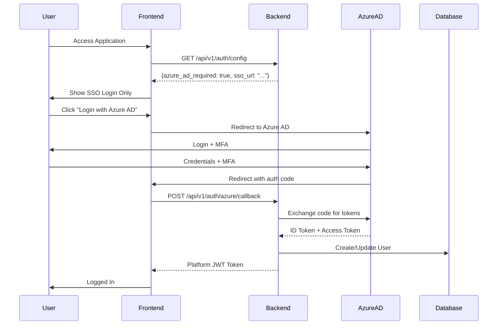
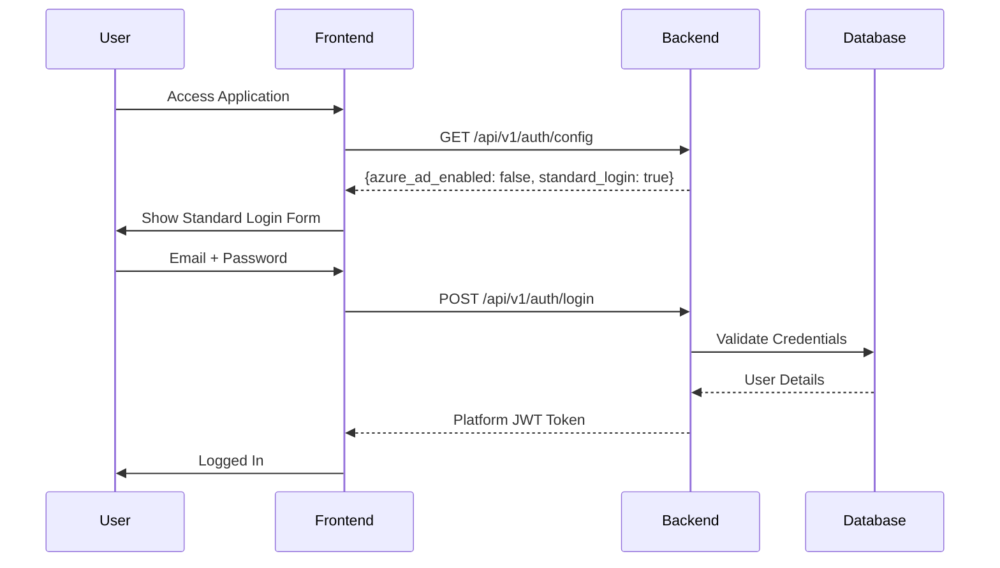

# Azure AD SSO Integration Plan

## Executive Summary

This document outlines the design and implementation plan for integrating Azure Active Directory (Azure AD) Single Sign-On (SSO) with Multi-Factor Authentication (MFA) into the AI Force Migration Platform. The integration is designed to be **environment-specific**, allowing Azure AD SSO to be mandatory for AWS deployments (for security compliance) while remaining optional or disabled for local development and Vercel deployments.

## Business Requirements

### Primary Goals
1. **Security Compliance**: Meet security team requirements for AWS deployments
2. **Flexibility**: Maintain standard authentication for development and non-AWS environments
3. **User Experience**: Seamless SSO experience where required, standard login where preferred
4. **Backward Compatibility**: Existing users and workflows continue to function

### Environment-Specific Requirements

| Environment | Azure AD SSO | Standard Login | MFA | Auto-Provisioning |
|------------|--------------|----------------|-----|-------------------|
| Local Dev  | Optional/Off | Always Available | No | N/A |
| Vercel Prod | Optional/Off | Always Available | No | N/A |
| AWS Prod | Required | Disabled | Yes (via AD) | Yes |

## Technical Architecture

### System Architecture Diagram

```
┌─────────────────────────────────────────────────────────────┐
│                        Frontend (React)                      │
├─────────────────────────────────────────────────────────────┤
│  ┌─────────────────┐  ┌──────────────────┐                 │
│  │ Login Component │  │  Auth Context    │                 │
│  │                 │  │                  │                 │
│  │ - Standard Form │  │ - Auth Config   │                 │
│  │ - SSO Button    │  │ - Token Mgmt    │                 │
│  │ - Conditional   │  │ - User State    │                 │
│  └─────────────────┘  └──────────────────┘                 │
└─────────────────┬───────────────────────────────────────────┘
                  │ API Calls
┌─────────────────┴───────────────────────────────────────────┐
│                     Backend (FastAPI)                        │
├─────────────────────────────────────────────────────────────┤
│  ┌─────────────────────────────────────┐                    │
│  │     Configuration Service           │                    │
│  │  - Environment Detection            │                    │
│  │  - Feature Flags                    │                    │
│  │  - Azure AD Config                  │                    │
│  └────────────┬────────────────────────┘                    │
│               │                                              │
│  ┌────────────┴───────────┐  ┌─────────────────┐          │
│  │ Standard Auth Service   │  │ Azure AD Service│          │
│  │ - Email/Password        │  │ - MSAL Python   │          │
│  │ - JWT Generation        │  │ - Token Valid   │          │
│  │ - Existing RBAC         │  │ - User Provision│          │
│  └────────────────────────┘  └─────────────────┘          │
│               │                        │                     │
│               └───────────┬────────────┘                    │
│                           ▼                                  │
│  ┌─────────────────────────────────────┐                    │
│  │     Unified Auth Handler            │                    │
│  │  - Route Selection                  │                    │
│  │  - Token Management                 │                    │
│  │  - Session Creation                 │                    │
│  └─────────────────────────────────────┘                    │
└──────────────────────────────────────────────────────────────┘
                           │
┌──────────────────────────┴───────────────────────────────────┐
│                    PostgreSQL Database                        │
├───────────────────────────────────────────────────────────────┤
│  UserProfile Table (Enhanced)                                 │
│  - existing fields...                                         │
│  - azure_ad_object_id (nullable)                            │
│  - azure_ad_tenant_id (nullable)                            │
│  - auth_provider (enum: 'standard', 'azure_ad')             │
│  - last_sso_login (timestamp)                               │
└───────────────────────────────────────────────────────────────┘
```

### Authentication Flow

#### AWS Environment (SSO Required)


#### Local/Vercel Environment (Standard Login)


## Implementation Details

### 1. Backend Configuration

#### Environment Variables
```bash
# AWS Production Environment (.env.aws)
AZURE_AD_ENABLED=true
AZURE_AD_REQUIRED=true
AZURE_AD_TENANT_ID=xxxxxxxx-xxxx-xxxx-xxxx-xxxxxxxxxxxx
AZURE_AD_CLIENT_ID=xxxxxxxx-xxxx-xxxx-xxxx-xxxxxxxxxxxx
AZURE_AD_CLIENT_SECRET=xxxxxxxxxxxxxxxxxxxxxxxxxxxxxxxxxx
AZURE_AD_REDIRECT_URI=https://aws-app.example.com/auth/callback
AZURE_AD_AUTO_PROVISION=true
AZURE_AD_DEFAULT_ROLE=VIEWER
AZURE_AD_REQUIRE_APPROVAL=false

# Vercel Production Environment (.env.vercel)
AZURE_AD_ENABLED=false
# No other Azure AD config needed

# Local Development (.env.local)
AZURE_AD_ENABLED=false
# Or set to true with test Azure AD app for development
```

#### Configuration Model
```python
# backend/app/core/config.py

from pydantic import BaseSettings, validator
from typing import Optional

class Settings(BaseSettings):
    # Existing configuration...
    
    # Azure AD Feature Flags
    AZURE_AD_ENABLED: bool = False
    AZURE_AD_REQUIRED: bool = False
    AZURE_AD_OPTIONAL: bool = True
    
    # Azure AD OAuth2 Configuration
    AZURE_AD_TENANT_ID: Optional[str] = None
    AZURE_AD_CLIENT_ID: Optional[str] = None
    AZURE_AD_CLIENT_SECRET: Optional[str] = None
    AZURE_AD_REDIRECT_URI: Optional[str] = None
    AZURE_AD_SCOPES: list[str] = ["openid", "profile", "email", "User.Read"]
    
    # User Provisioning Settings
    AZURE_AD_AUTO_PROVISION: bool = False
    AZURE_AD_DEFAULT_ROLE: str = "VIEWER"
    AZURE_AD_REQUIRE_APPROVAL: bool = True
    AZURE_AD_SYNC_PROFILE: bool = True
    
    # Computed Properties
    @property
    def azure_ad_authority(self) -> Optional[str]:
        if self.AZURE_AD_TENANT_ID:
            return f"https://login.microsoftonline.com/{self.AZURE_AD_TENANT_ID}"
        return None
    
    @property
    def azure_ad_configured(self) -> bool:
        return all([
            self.AZURE_AD_ENABLED,
            self.AZURE_AD_TENANT_ID,
            self.AZURE_AD_CLIENT_ID,
            self.AZURE_AD_CLIENT_SECRET
        ])
    
    @validator('AZURE_AD_REQUIRED')
    def validate_required_flag(cls, v, values):
        if v and not values.get('AZURE_AD_ENABLED'):
            raise ValueError("Cannot require Azure AD if it's not enabled")
        return v

settings = Settings()
```

### 2. Database Schema Updates

```sql
-- Migration: Add Azure AD fields to user_profiles
ALTER TABLE user_profiles 
ADD COLUMN azure_ad_object_id VARCHAR(255) UNIQUE,
ADD COLUMN azure_ad_tenant_id VARCHAR(255),
ADD COLUMN auth_provider VARCHAR(50) NOT NULL DEFAULT 'standard',
ADD COLUMN last_sso_login TIMESTAMP,
ADD COLUMN azure_ad_metadata JSONB;

-- Indexes for performance
CREATE INDEX idx_user_azure_ad_object_id ON user_profiles(azure_ad_object_id);
CREATE INDEX idx_user_auth_provider ON user_profiles(auth_provider);

-- Update existing users to have auth_provider set
UPDATE user_profiles SET auth_provider = 'standard' WHERE auth_provider IS NULL;
```

### 3. Backend Services

#### Azure AD Authentication Service
```python
# backend/app/services/auth_services/azure_ad_service.py

import msal
from typing import Optional, Dict
from app.core.config import settings

class AzureADService:
    def __init__(self):
        self.app = None
        if settings.azure_ad_configured:
            self.app = msal.ConfidentialClientApplication(
                settings.AZURE_AD_CLIENT_ID,
                authority=settings.azure_ad_authority,
                client_credential=settings.AZURE_AD_CLIENT_SECRET
            )
    
    def get_auth_url(self, state: str) -> str:
        """Generate Azure AD authorization URL"""
        return self.app.get_authorization_request_url(
            scopes=settings.AZURE_AD_SCOPES,
            state=state,
            redirect_uri=settings.AZURE_AD_REDIRECT_URI
        )
    
    async def exchange_code_for_token(self, code: str) -> Dict:
        """Exchange authorization code for tokens"""
        result = self.app.acquire_token_by_authorization_code(
            code=code,
            scopes=settings.AZURE_AD_SCOPES,
            redirect_uri=settings.AZURE_AD_REDIRECT_URI
        )
        
        if "error" in result:
            raise ValueError(f"Azure AD error: {result['error_description']}")
        
        return result
    
    async def validate_token(self, token: str) -> Dict:
        """Validate and decode Azure AD token"""
        # Token validation logic
        pass
```

#### User Provisioning Service
```python
# backend/app/services/auth_services/user_provisioning_service.py

from app.models.user import UserProfile
from app.models.rbac import UserRole
from datetime import datetime

class UserProvisioningService:
    async def provision_azure_ad_user(
        self, 
        azure_user_info: Dict,
        db: Session
    ) -> UserProfile:
        """Create or update user from Azure AD"""
        
        # Check if user exists by email or Azure AD ID
        existing_user = await self._find_existing_user(
            email=azure_user_info['email'],
            azure_ad_id=azure_user_info['oid'],
            db=db
        )
        
        if existing_user:
            # Update existing user
            existing_user.azure_ad_object_id = azure_user_info['oid']
            existing_user.azure_ad_tenant_id = azure_user_info.get('tid')
            existing_user.last_sso_login = datetime.utcnow()
            
            if settings.AZURE_AD_SYNC_PROFILE:
                existing_user.name = azure_user_info.get('name', existing_user.name)
                existing_user.azure_ad_metadata = azure_user_info
            
            await db.commit()
            return existing_user
        
        # Auto-provision new user
        if not settings.AZURE_AD_AUTO_PROVISION:
            raise ValueError(
                "User not found and auto-provisioning is disabled. "
                "Please contact an administrator."
            )
        
        # Create new user
        new_user = UserProfile(
            email=azure_user_info['email'],
            name=azure_user_info.get('name', azure_user_info['email']),
            azure_ad_object_id=azure_user_info['oid'],
            azure_ad_tenant_id=azure_user_info.get('tid'),
            auth_provider='azure_ad',
            status='ACTIVE' if not settings.AZURE_AD_REQUIRE_APPROVAL else 'PENDING_APPROVAL',
            organization=azure_user_info.get('company', 'Unknown'),
            created_at=datetime.utcnow(),
            last_sso_login=datetime.utcnow(),
            azure_ad_metadata=azure_user_info
        )
        
        db.add(new_user)
        await db.flush()
        
        # Assign default role
        if settings.AZURE_AD_DEFAULT_ROLE and new_user.status == 'ACTIVE':
            default_role = UserRole(
                user_id=new_user.id,
                role=settings.AZURE_AD_DEFAULT_ROLE,
                scope='GLOBAL',
                created_at=datetime.utcnow()
            )
            db.add(default_role)
        
        await db.commit()
        return new_user
```

### 4. API Endpoints

#### Authentication Configuration Endpoint
```python
# backend/app/api/v1/auth/handlers/authentication_handlers.py

from fastapi import APIRouter, Depends, HTTPException
from app.services.auth_services.azure_ad_service import AzureADService

router = APIRouter()

@router.get("/auth/config")
async def get_auth_configuration():
    """Get authentication configuration for the frontend"""
    config = {
        "azure_ad_enabled": settings.AZURE_AD_ENABLED,
        "azure_ad_required": settings.AZURE_AD_REQUIRED,
        "standard_login_enabled": not settings.AZURE_AD_REQUIRED or not settings.AZURE_AD_ENABLED,
        "sso_login_url": None
    }
    
    if settings.azure_ad_configured:
        # Generate state for CSRF protection
        state = generate_random_state()
        azure_service = AzureADService()
        config["sso_login_url"] = azure_service.get_auth_url(state)
        
        # Store state in cache for validation
        await cache.set(f"auth_state_{state}", True, ttl=600)
    
    return config

@router.post("/auth/login")
async def standard_login(
    credentials: LoginRequest,
    db: Session = Depends(get_db)
):
    """Standard email/password login"""
    if settings.AZURE_AD_REQUIRED:
        raise HTTPException(
            status_code=400,
            detail="Standard login is disabled. Please use SSO."
        )
    
    # Existing login logic...
    user = await authenticate_user(credentials.email, credentials.password, db)
    if not user:
        raise HTTPException(401, "Invalid credentials")
    
    token = create_access_token(user)
    return {"access_token": token, "token_type": "bearer"}

@router.get("/auth/azure/callback")
async def azure_ad_callback(
    code: str,
    state: str,
    db: Session = Depends(get_db)
):
    """Handle Azure AD callback"""
    # Validate state
    state_valid = await cache.get(f"auth_state_{state}")
    if not state_valid:
        raise HTTPException(400, "Invalid state parameter")
    
    # Clean up state
    await cache.delete(f"auth_state_{state}")
    
    # Exchange code for tokens
    azure_service = AzureADService()
    try:
        token_result = await azure_service.exchange_code_for_token(code)
    except Exception as e:
        raise HTTPException(400, f"Failed to authenticate: {str(e)}")
    
    # Extract user info from ID token
    user_info = decode_id_token(token_result['id_token'])
    
    # Provision or update user
    provisioning_service = UserProvisioningService()
    user = await provisioning_service.provision_azure_ad_user(user_info, db)
    
    if user.status != 'ACTIVE':
        raise HTTPException(
            403,
            "Your account is pending approval. Please contact an administrator."
        )
    
    # Create platform token
    platform_token = create_access_token(user)
    
    # Redirect to frontend with token
    frontend_url = f"{settings.FRONTEND_URL}/auth/success?token={platform_token}"
    return RedirectResponse(url=frontend_url)
```

### 5. Frontend Implementation

#### Authentication Configuration Hook
```typescript
// src/hooks/useAuthConfig.ts

import { useState, useEffect } from 'react';
import { apiClient } from '@/utils/api';

interface AuthConfig {
  azureAdEnabled: boolean;
  azureAdRequired: boolean;
  standardLoginEnabled: boolean;
  ssoLoginUrl: string | null;
}

export const useAuthConfig = () => {
  const [config, setConfig] = useState<AuthConfig | null>(null);
  const [loading, setLoading] = useState(true);
  const [error, setError] = useState<Error | null>(null);

  useEffect(() => {
    const fetchConfig = async () => {
      try {
        const response = await apiClient.get('/api/v1/auth/config');
        setConfig(response.data);
      } catch (err) {
        setError(err as Error);
      } finally {
        setLoading(false);
      }
    };

    fetchConfig();
  }, []);

  return { config, loading, error };
};
```

#### Enhanced Login Page
```typescript
// src/pages/Login.tsx

import React from 'react';
import { useAuthConfig } from '@/hooks/useAuthConfig';
import { StandardLoginForm } from '@/components/auth/StandardLoginForm';
import { AzureADLoginButton } from '@/components/auth/AzureADLoginButton';

export const Login: React.FC = () => {
  const { config, loading, error } = useAuthConfig();

  if (loading) {
    return <LoadingSpinner />;
  }

  if (error) {
    return <ErrorMessage message="Failed to load authentication configuration" />;
  }

  return (
    <div className="login-container">
      <h1>AI Force Migration Platform</h1>
      
      {config?.standardLoginEnabled && (
        <StandardLoginForm 
          disabled={config.azureAdRequired}
        />
      )}
      
      {config?.standardLoginEnabled && config?.azureAdEnabled && (
        <div className="divider">
          <span>OR</span>
        </div>
      )}
      
      {config?.azureAdEnabled && (
        <AzureADLoginButton
          loginUrl={config.ssoLoginUrl}
          required={config.azureAdRequired}
        />
      )}
      
      {config?.azureAdRequired && (
        <p className="info-message">
          Single Sign-On is required for this environment. 
          Please use your corporate credentials to login.
        </p>
      )}
    </div>
  );
};
```

#### Azure AD Login Component
```typescript
// src/components/auth/AzureADLoginButton.tsx

interface AzureADLoginButtonProps {
  loginUrl: string | null;
  required: boolean;
}

export const AzureADLoginButton: React.FC<AzureADLoginButtonProps> = ({
  loginUrl,
  required
}) => {
  const handleLogin = () => {
    if (loginUrl) {
      window.location.href = loginUrl;
    }
  };

  return (
    <button
      onClick={handleLogin}
      className={`sso-button ${required ? 'primary' : 'secondary'}`}
      disabled={!loginUrl}
    >
      <MicrosoftIcon />
      Login with Microsoft
    </button>
  );
};
```

#### Auth Success Handler
```typescript
// src/pages/auth/Success.tsx

import { useEffect } from 'react';
import { useSearchParams, useNavigate } from 'react-router-dom';
import { useAuth } from '@/contexts/AuthContext';

export const AuthSuccess: React.FC = () => {
  const [searchParams] = useSearchParams();
  const navigate = useNavigate();
  const { setToken } = useAuth();

  useEffect(() => {
    const token = searchParams.get('token');
    if (token) {
      // Store token and redirect
      setToken(token);
      navigate('/dashboard');
    } else {
      navigate('/login');
    }
  }, [searchParams, navigate, setToken]);

  return <LoadingSpinner message="Completing login..." />;
};
```

## Security Considerations

### 1. Token Security
- Azure AD tokens are validated on the backend
- Platform issues its own JWT tokens after successful Azure AD auth
- Tokens include multi-tenant context (client_account_id, engagement_id)
- Regular token rotation and expiration

### 2. CSRF Protection
- State parameter for OAuth2 flow
- Validation of redirect URIs
- Secure token transmission

### 3. User Data Protection
- Minimal Azure AD data stored
- Sensitive data encrypted at rest
- Audit logs for all authentication events

### 4. MFA Enforcement
- Configured via Azure AD Conditional Access
- No additional code required
- Applies to all Azure AD authenticated users

## Migration Strategy

### Phase 1: Infrastructure Setup (Week 1-2)
1. Azure AD app registration
2. Backend service implementation
3. Database schema updates
4. Configuration management

### Phase 2: Feature Flag Rollout (Week 3-4)
1. Deploy with AZURE_AD_ENABLED=false
2. Test configuration endpoints
3. Verify no impact on existing users
4. Enable in test environment

### Phase 3: AWS Environment Testing (Week 5-6)
1. Enable Azure AD in AWS staging
2. Test auto-provisioning
3. Verify MFA flows
4. Performance testing

### Phase 4: Production Rollout
1. Enable optional SSO in Vercel (if desired)
2. Enable required SSO in AWS production
3. Monitor adoption and issues
4. Document for users

## Rollback Plan

If issues arise, the system can be quickly reverted:

1. **Immediate Rollback**
   - Set `AZURE_AD_ENABLED=false`
   - All users revert to standard login
   - No data loss or user impact

2. **Partial Rollback**
   - Set `AZURE_AD_REQUIRED=false`
   - Keep `AZURE_AD_ENABLED=true`
   - Users can choose login method

3. **Data Preservation**
   - Azure AD fields remain in database
   - User associations preserved
   - Can re-enable without data loss

## Monitoring and Metrics

### Key Metrics to Track
1. **Authentication Success Rate**
   - Standard vs Azure AD
   - By environment
   - Failure reasons

2. **User Provisioning**
   - New users via Azure AD
   - Approval queue length
   - Time to activation

3. **Performance Impact**
   - Login time comparison
   - Token validation overhead
   - API response times

### Logging Requirements
```python
# Structured logging for auth events
logger.info("auth_event", extra={
    "event_type": "azure_ad_login",
    "user_email": user.email,
    "environment": settings.ENVIRONMENT,
    "success": True,
    "provisioned": was_provisioned,
    "auth_time_ms": auth_duration
})
```

## Support and Troubleshooting

### Common Issues and Solutions

1. **"SSO Login Button Disabled"**
   - Check Azure AD configuration in environment
   - Verify all required env variables are set
   - Check backend logs for configuration errors

2. **"User Not Found" After SSO**
   - Verify auto-provisioning is enabled
   - Check user approval status
   - Verify email domain is allowed

3. **"Invalid State Parameter"**
   - State token expired (10 min TTL)
   - User bookmarked callback URL
   - Browser back/forward navigation

4. **MFA Loop**
   - Azure AD Conditional Access misconfigured
   - User needs to complete MFA enrollment
   - Session timeout conflicts

### Support Escalation Path
1. Check application logs
2. Verify Azure AD configuration
3. Review user status in database
4. Escalate to platform team if needed

## Appendix

### A. Azure AD App Registration Checklist
- [ ] Create app registration
- [ ] Configure redirect URIs
- [ ] Set up client secret
- [ ] Configure API permissions
- [ ] Enable ID tokens
- [ ] Configure token lifetime
- [ ] Set up Conditional Access

### B. Environment Variable Reference
```bash
# Required for Azure AD
AZURE_AD_ENABLED=true|false
AZURE_AD_TENANT_ID=xxxxxxxx-xxxx-xxxx-xxxx-xxxxxxxxxxxx
AZURE_AD_CLIENT_ID=xxxxxxxx-xxxx-xxxx-xxxx-xxxxxxxxxxxx
AZURE_AD_CLIENT_SECRET=xxxxxxxxxxxxxxxxxx

# Optional Configuration
AZURE_AD_REQUIRED=true|false
AZURE_AD_AUTO_PROVISION=true|false
AZURE_AD_DEFAULT_ROLE=VIEWER|ANALYST|etc
AZURE_AD_REQUIRE_APPROVAL=true|false
```

### C. Database Migration Script
```python
"""Add Azure AD support to user profiles

Revision ID: xxxx
Revises: yyyy
Create Date: 2024-xx-xx

"""
from alembic import op
import sqlalchemy as sa
from sqlalchemy.dialects import postgresql

def upgrade():
    op.add_column('user_profiles', 
        sa.Column('azure_ad_object_id', sa.String(255), nullable=True))
    op.add_column('user_profiles', 
        sa.Column('azure_ad_tenant_id', sa.String(255), nullable=True))
    op.add_column('user_profiles', 
        sa.Column('auth_provider', sa.String(50), 
                  nullable=False, server_default='standard'))
    op.add_column('user_profiles', 
        sa.Column('last_sso_login', sa.DateTime(), nullable=True))
    op.add_column('user_profiles', 
        sa.Column('azure_ad_metadata', postgresql.JSONB, nullable=True))
    
    op.create_index('idx_user_azure_ad_object_id', 
                    'user_profiles', ['azure_ad_object_id'])

def downgrade():
    op.drop_index('idx_user_azure_ad_object_id')
    op.drop_column('user_profiles', 'azure_ad_metadata')
    op.drop_column('user_profiles', 'last_sso_login')
    op.drop_column('user_profiles', 'auth_provider')
    op.drop_column('user_profiles', 'azure_ad_tenant_id')
    op.drop_column('user_profiles', 'azure_ad_object_id')
```

---

**Document Version**: 1.0  
**Last Updated**: January 2025  
**Author**: Platform Architecture Team  
**Status**: Planning Phase