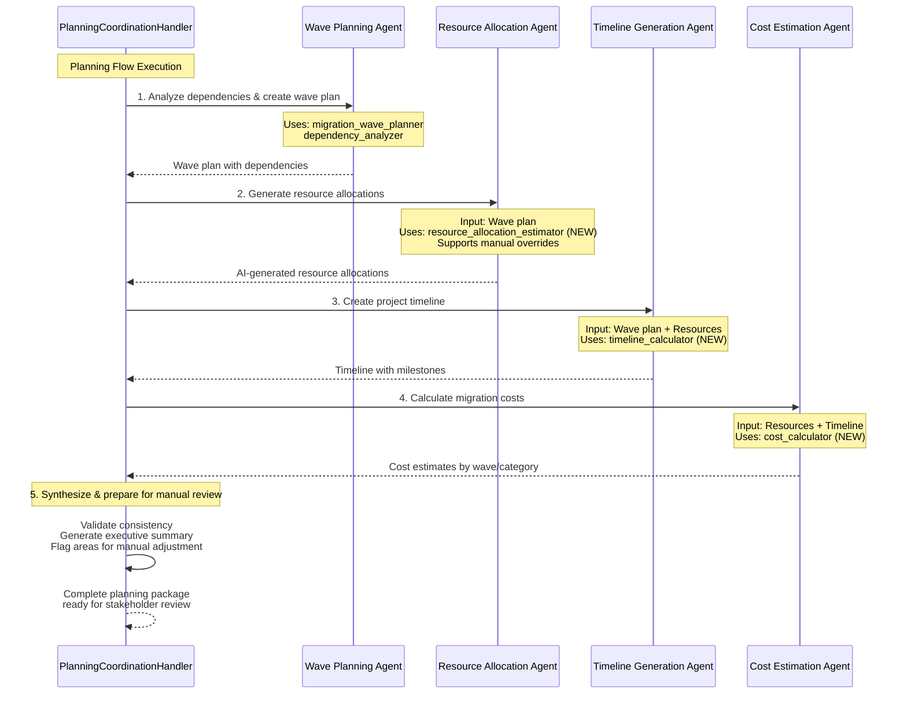

# CrewAI Agent Design for Planning Flow - SPIKE RESULTS

**Issue**: #697
**Parent**: #606 (Plan Flow Complete)
**Date**: 2025-10-22
**Status**: ✅ COMPLETE - Ready for Tech Lead Review

---

## Executive Summary

Designed 4 specialized CrewAI agents for Planning Flow following Discovery/Collection/Assessment patterns. **All agents support AI-generated plans with manual override capability** per #690 requirements.

**Key Findings**:
- ✅ **3 existing tools** can be reused: `migration_wave_planner`, `dependency_analyzer`, `dependency_graph_builder`
- ⚠️ **2 new tools** needed: `resource_allocation_estimator`, `timeline_calculator`, `cost_calculator`
- ✅ YAML configurations completed and ready for implementation
- ✅ Integration approach validated with PlanningCoordinationHandler patterns

---

## 1. Agent Specifications

### Agent 1: Wave Planning Specialist

**Role**: Migration Wave Planning Specialist
**Goal**: Organize applications into optimal migration waves based on dependency analysis

**Responsibilities**:
- Analyze dependency graphs to identify critical paths
- Group applications into waves based on dependencies
- Optimize wave sizes for resource utilization
- Minimize cross-wave dependencies
- Account for business criticality

**Tools Used**:
- ✅ `migration_wave_planner` (EXISTING - `backend/app/services/crewai_flows/tools/dependency_analysis_tool/tools.py:91-100`)
- ✅ `dependency_analyzer` (EXISTING)
- ✅ `dependency_graph_builder` (EXISTING)

**Backstory**: Expert in large-scale portfolio migrations with deep understanding of dependency chains and sequencing optimization.

---

### Agent 2: Resource Allocation Specialist

**Role**: AI Resource Allocation Specialist
**Goal**: Generate optimal AI-driven resource allocations with manual override support

**Responsibilities**:
- Calculate role-based resource requirements per wave
- Estimate effort in person-hours per role
- Optimize resource leveling across parallel waves
- Generate cost estimates based on hourly rates
- Support manual overrides (per #690 requirement)

**Tools Used**:
- ⚠️ `resource_allocation_estimator` (NEW - needs creation)

**Backstory**: Workforce planning expert leveraging AI patterns and historical data while respecting human judgment.

**Per #690 Requirements**:
- ✅ Role-based allocation (not individual-based)
- ✅ AI-generated with manual override capability
- ✅ Cost tracking integrated

---

### Agent 3: Timeline Generation Specialist

**Role**: Migration Timeline Generation Specialist
**Goal**: Create realistic, data-driven migration timelines

**Responsibilities**:
- Calculate wave durations based on workload and capacity
- Sequence waves based on dependencies
- Identify critical path and bottlenecks
- Add risk buffer time
- Define milestones and validation checkpoints

**Tools Used**:
- ⚠️ `timeline_calculator` (NEW - needs creation)

**Backstory**: Project scheduling expert combining AI estimation with industry best practices.

---

### Agent 4: Cost Estimation Specialist

**Role**: Migration Cost Estimation Specialist
**Goal**: Calculate comprehensive migration costs

**Responsibilities**:
- Calculate direct labor costs from resource allocations
- Estimate infrastructure costs (cloud, tooling, licenses)
- Add risk contingency based on complexity
- Provide cost breakdown by wave and category
- Compare against industry benchmarks

**Tools Used**:
- ⚠️ `cost_calculator` (NEW - needs creation)

**Backstory**: IT project economics expert providing accurate, defensible cost estimates.

**Per #690 Requirements**:
- ✅ Track hourly rates
- ✅ Calculate wave costs
- ✅ Option A implemented (full cost tracking)

---

## 2. Tool Requirements

### Existing Tools (Reuse)

| Tool Name | Location | Purpose |
|-----------|----------|---------|
| `migration_wave_planner` | `backend/app/services/crewai_flows/tools/dependency_analysis_tool/tools.py` | Plan migration waves based on dependencies |
| `dependency_analyzer` | Same file | Analyze dependencies between assets |
| `dependency_graph_builder` | Same file | Build visual dependency graphs |

### New Tools Required

#### Tool 1: `resource_allocation_estimator`

**Purpose**: AI-driven resource allocation with workload estimation

**Input**:
```python
{
  "wave_plan": {...},
  "applications": [...],
  "complexity_scores": {...},
  "roles_and_rates": {
    "Solution Architect": {"hourly_rate": 200, "availability": 0.5},
    "Java Developer": {"hourly_rate": 150, "availability": 1.0},
    "QA Engineer": {"hourly_rate": 120, "availability": 1.0}
  },
  "historical_velocity": {...}
}
```

**Output**:
```python
{
  "wave_allocations": {
    "wave_1": {
      "Solution Architect": {"hours": 160, "fte": 0.2, "cost": 32000},
      "Java Developer": {"hours": 640, "fte": 0.8, "cost": 96000}
    }
  },
  "total_cost": 450000,
  "resource_conflicts": [],
  "manual_override_support": true
}
```

**Implementation Location**: `backend/app/services/crewai_flows/tools/resource_allocation_tool.py`

---

#### Tool 2: `timeline_calculator`

**Purpose**: Calculate wave durations and project timeline

**Input**:
```python
{
  "wave_plan": {...},
  "resource_allocations": {...},
  "start_date": "2025-11-01",
  "constraints": {
    "working_days_per_week": 5,
    "hours_per_day": 8,
    "risk_buffer_percentage": 20
  }
}
```

**Output**:
```python
{
  "waves": [
    {
      "wave_id": "wave_1",
      "start_date": "2025-11-01",
      "end_date": "2025-12-15",
      "duration_days": 44,
      "duration_weeks": 6.3,
      "buffer_days": 7
    }
  ],
  "total_duration_months": 8.5,
  "critical_path": ["wave_1", "wave_3", "wave_5"],
  "milestones": [...]
}
```

**Implementation Location**: `backend/app/services/crewai_flows/tools/timeline_tool.py`

---

#### Tool 3: `cost_calculator`

**Purpose**: Calculate comprehensive migration costs

**Input**:
```python
{
  "resource_allocations": {...},
  "infrastructure_requirements": {
    "cloud_compute": {"monthly_cost": 15000},
    "licenses": {"total_cost": 50000}
  },
  "risk_contingency_percentage": 15
}
```

**Output**:
```python
{
  "labor_costs": 450000,
  "infrastructure_costs": 180000,
  "tooling_costs": 50000,
  "risk_contingency": 102000,
  "total_cost": 782000,
  "cost_by_wave": [...],
  "cost_by_category": {...}
}
```

**Implementation Location**: `backend/app/services/crewai_flows/tools/cost_estimation_tool.py`

---

## 3. Execution Sequence Diagram



**Execution Order Rationale**:
1. **Wave planning first**: Dependencies drive everything else
2. **Resources second**: Based on wave composition and complexity
3. **Timeline third**: Constrained by resources and dependencies
4. **Costs last**: Derived from resources and timeline
5. **Synthesis**: Cross-validate and prepare for human review

---

## 4. Integration with PlanningCoordinationHandler

### Current Architecture

**File**: `backend/app/services/crewai_flows/handlers/planning_coordination_handler/handler.py`

```python
class PlanningCoordinationHandler(
    PlanningCoordinationHandlerBase,
    CrewPlanningMixin,           # ← Will add our new crew here
    AdaptiveWorkflowMixin,
    PlanningIntelligenceMixin,   # ← AI planning already integrated
    ResourceAllocationMixin,      # ← Resource allocation patterns exist
    OptimizationComponentsMixin,
):
    pass
```

### Integration Approach

#### Step 1: Create Planning Crew Configuration

**File**: `backend/app/services/crewai_flows/handlers/planning_coordination_handler/crew_planning/planning_crew.py` (NEW)

```python
from crewai import Crew
from app.services.crewai_flows.config.crew_factory import create_crew
from app.services.crewai_flows.crews.config import planning_agents, planning_tasks

class PlanningCrewOrchestrator:
    """Orchestrates Planning Flow CrewAI agents"""

    def __init__(self, context_info: dict):
        self.context = context_info
        self._setup_agents()
        self._setup_tasks()

    def create_planning_crew(self):
        """Create crew with planning agents"""
        return create_crew(
            agents=[
                self.wave_planning_agent,
                self.resource_allocation_agent,
                self.timeline_generation_agent,
                self.cost_estimation_agent
            ],
            tasks=[
                self.wave_planning_task,
                self.resource_allocation_task,
                self.timeline_generation_task,
                self.cost_estimation_task,
                self.planning_synthesis_task
            ],
            memory=False,  # Per ADR-024: Use TenantMemoryManager
            verbose=True
        )
```

#### Step 2: Update CrewPlanningMixin

**File**: `backend/app/services/crewai_flows/handlers/planning_coordination_handler/crew_planning/coordination.py`

Add method:
```python
async def execute_planning_crew(
    self,
    dependency_graph: dict,
    applications: list,
    constraints: dict
) -> dict:
    """Execute planning crew to generate migration plan"""

    # Setup context for agents
    context_info = {
        "dependency_graph": dependency_graph,
        "applications": applications,
        "constraints": constraints,
        "client_account_id": self.context.client_account_id,
        "engagement_id": self.engagement_id
    }

    # Create and execute crew
    orchestrator = PlanningCrewOrchestrator(context_info)
    crew = orchestrator.create_planning_crew()

    result = await crew.kickoff_async()

    return {
        "wave_plan": result.wave_plan,
        "resource_allocations": result.resource_allocations,
        "timeline": result.timeline,
        "cost_estimates": result.cost_estimates,
        "synthesis": result.planning_synthesis,
        "manual_override_ready": True  # Flag for UI
    }
```

#### Step 3: Add Tool Integration

**File**: `backend/app/services/crewai_flows/handlers/planning_coordination_handler/crew_planning/tools.py` (NEW)

```python
from app.services.crewai_flows.tools.dependency_analysis_tool import (
    MigrationWavePlannerTool,
    DependencyAnalysisTool
)
from app.services.crewai_flows.tools.resource_allocation_tool import (
    ResourceAllocationEstimatorTool  # NEW
)
from app.services.crewai_flows.tools.timeline_tool import (
    TimelineCalculatorTool  # NEW
)
from app.services.crewai_flows.tools.cost_estimation_tool import (
    CostCalculatorTool  # NEW
)

def create_planning_tools(context_info: dict):
    """Create all tools needed for planning agents"""
    return {
        "existing": [
            MigrationWavePlannerTool(context_info),
            DependencyAnalysisTool(context_info)
        ],
        "new": [
            ResourceAllocationEstimatorTool(context_info),
            TimelineCalculatorTool(context_info),
            CostCalculatorTool(context_info)
        ]
    }
```

---

## 5. Configuration Files Location

**Created**:
- ✅ `backend/app/services/crewai_flows/crews/config/planning_agents.yaml`
- ✅ `backend/app/services/crewai_flows/crews/config/planning_tasks.yaml`

**Pattern**: Follows existing Discovery/Assessment pattern in same directory.

---

## 6. Manual Override Support (Per #690)

### How Manual Overrides Work

1. **AI generates initial plan**: All 4 agents produce recommendations
2. **Flag areas for review**: Synthesis task identifies low-confidence areas
3. **Present to user**: Frontend displays AI plan with editable fields
4. **User adjusts**: Change resource allocations, wave assignments, timeline, costs
5. **Save overrides**: Store user changes in `plan_flow` database tables
6. **Re-run synthesis**: Optional - recalculate dependent values after manual changes

### Database Support

**Tables** (from existing Planning Flow schema):
- `migration_waves`: Store wave plan (AI + manual)
- `wave_resource_allocations`: Store resource assignments (AI + manual)
- `wave_timeline`: Store timeline (AI + manual)
- `wave_cost_estimates`: Store cost breakdowns (AI + manual)

**New Column** (recommended):
```sql
ALTER TABLE migration_waves ADD COLUMN
    allocation_source VARCHAR(20) DEFAULT 'ai_generated';
    -- Values: 'ai_generated', 'manual_override', 'hybrid'
```

---

## 7. Implementation Effort Estimate

| Component | Effort | Priority |
|-----------|--------|----------|
| YAML configs (agents + tasks) | ✅ 0 days (DONE) | P0 |
| New tools (3 tools) | 2-3 days | P0 |
| PlanningCrewOrchestrator | 1 day | P0 |
| Integration with PlanningCoordinationHandler | 1 day | P1 |
| Manual override UI support | 2 days | P1 |
| Testing & validation | 2 days | P2 |
| **TOTAL** | **8-9 days** | - |

---

## 8. Success Criteria

- [x] All agents designed with clear responsibilities
- [x] YAML configs drafted and validated
- [x] Tool requirements identified (3 existing + 3 new)
- [x] Execution sequence documented with Mermaid diagram
- [x] Integration approach validated with PlanningCoordinationHandler patterns
- [x] Manual override support designed per #690
- [ ] **PENDING**: Tech lead approval of approach

---

## 9. Next Steps

1. **Tech Lead Review**: Validate agent design and tool requirements
2. **Create New Tools**: Implement `resource_allocation_estimator`, `timeline_calculator`, `cost_calculator`
3. **Build Orchestrator**: Create `PlanningCrewOrchestrator` class
4. **Integration**: Wire into `PlanningCoordinationHandler`
5. **Testing**: Unit tests for each agent/tool, integration test for full crew
6. **Frontend**: Add manual override UI for plan adjustments

---

## 10. Open Questions for Tech Lead

1. **Tool Complexity**: Should resource/timeline/cost tools use simple heuristics or ML models?
2. **Historical Data**: Do we have migration velocity data to train resource estimator?
3. **Priority**: Implement all 4 agents in MVP or start with Wave + Resource (defer Timeline/Cost)?
4. **Manual Override UX**: Should users edit in-place or propose changes for approval?

---

## Appendix: References

- **Issue #690**: Resource Management MVP Scope (answers provided)
- **Issue #697**: This spike (CREWAI_AGENT_DESIGN_PLANNING_FLOW)
- **Issue #606**: Parent issue (Plan Flow Complete milestone)
- **Existing Patterns**: `backend/app/services/crewai_flows/crews/config/dependency_analysis_*.yaml`
- **PlanningCoordinationHandler**: `backend/app/services/crewai_flows/handlers/planning_coordination_handler/`
- **ADR-024**: TenantMemoryManager (memory=False for crews)
