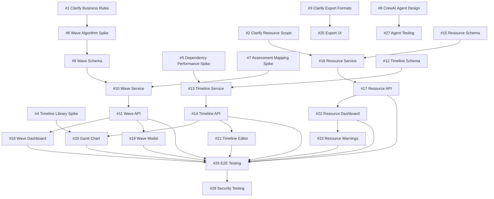

# Plan Flow Complete - Issue Breakdown for GitHub

**Milestone**: Plan Flow complete (#606)
**Due Date**: October 29, 2025 (7 days from now)
**Total Issues**: 28 issues (all 1-3 days each)
**Strategy**: MVP-first with parallel execution tracks

---

## Executive Summary

This document provides a **complete, ready-to-execute** issue breakdown for the Plan Flow milestone. Given the aggressive 7-day timeline, the strategy focuses on:

1. **Leveraging Existing Infrastructure**: `WavePlan` model, `PlanningCoordinationHandler`, and dependency analysis tools already exist
2. **MVP-First Approach**: Prioritize core wave planning, defer advanced features (ML resource optimization, MS Project export)
3. **Parallel Execution**: 3 tracks (Backend/Frontend/Spikes) running concurrently
4. **Pragmatic Scope**: Focus on "working end-to-end flow" over "perfect feature completeness"

---

## Issue Categories & Counts

| Category | Count | Duration | Track |
|----------|-------|----------|-------|
| **Product Clarifications** | 3 | 1 day | Blocking |
| **Spike Investigations** | 5 | 2-3 days each | Parallel |
| **Backend Foundation** | 9 | 1-3 days each | Track A |
| **Frontend Implementation** | 8 | 1-2 days each | Track B |
| **Testing & Integration** | 3 | 1-2 days each | Track C |

**Total**: 28 issues

---

## 🔴 PRIORITY 1: Product Clarifications (Day 1 - BLOCKING)

These **MUST** be answered immediately to unblock execution.

### Issue #1: [CLARIFY] Wave Planning Business Rules - Product Input URGENT
**Labels**: `question`, `product-input-needed`, `plan-flow`, `priority-critical`
**Assignee**: Product Owner
**Time-box**: 4 hours

```markdown
## Context
Plan Flow needs to implement wave assignment logic, but business rules are undefined.

## Questions for Product Team (Answer TODAY)
1. **Max applications per wave?** (e.g., 50 apps max per wave)
2. **Required sequencing?** (e.g., infrastructure → databases → applications)
3. **Geographic/BU constraints?** (e.g., "Europe apps must be in Wave 1-3")
4. **Wave duration limits?** (e.g., max 3 months per wave)

## Decision Impact
- If simple rules → implement in backend validation (1 day)
- If complex → need constraint solver algorithm (3 days + spike)

## Acceptance Criteria
- [ ] All 4 questions answered with examples
- [ ] Answers documented in this issue
- [ ] Backend team notified of decision
```

---

### Issue #2: [CLARIFY] Resource Management MVP Scope - Product Input URGENT
**Labels**: `question`, `product-input-needed`, `plan-flow`, `priority-critical`
**Assignee**: Product Owner
**Time-box**: 4 hours

```markdown
## Context
Resource planning can be simple (manual entry) or complex (AI-driven skill matching).

## Questions for Product Team (Answer TODAY)
1. **MVP Scope**: Manual resource entry OR AI-assisted allocation?
2. **Resource Granularity**: Roles (e.g., "Java Developer") OR individuals?
3. **Cost Tracking**: Required for MVP OR defer to Phase 2?
4. **Skill Matching**: Required OR nice-to-have?

## Recommended MVP (if undecided)
- Manual role-based allocation ("2 Java Developers, 1 DBA")
- No AI optimization (Phase 2 feature)
- Simple cost entry (no complex tracking)

## Acceptance Criteria
- [ ] MVP scope defined
- [ ] Backend/Frontend teams notified
```

---

### Issue #3: [CLARIFY] Export Format Requirements - Product Input URGENT
**Labels**: `question`, `product-input-needed`, `plan-flow`, `priority-critical`
**Assignee**: Product Owner
**Time-box**: 4 hours

```markdown
## Context
Export formats vary in complexity. MS Project integration is high-effort.

## Questions for Product Team (Answer TODAY)
1. **MVP Exports**: PDF + Excel OR add MS Project?
2. **MS Project Format**: XML export OR full .mpp integration?
3. **Excel Requirements**: Data tables OR Gantt chart visualization?

## Recommended MVP (if undecided)
- PDF export with timeline visualization (using existing libs)
- Excel export with data tables (no Gantt charts)
- Defer MS Project to Phase 2

## Acceptance Criteria
- [ ] MVP export formats decided
- [ ] Spike issue created if MS Project required
```

---

## 🔵 PRIORITY 2: Spike Investigations (Day 1-2 - Parallel Track)

Time-boxed research to inform implementation decisions.

### Issue #4: [SPIKE] Timeline Visualization Library Selection - 2 Days
**Labels**: `spike`, `research`, `plan-flow`, `frontend`
**Assignee**: Frontend Lead
**Dependencies**: None (can start immediately)

```markdown
## Objective
Select a timeline/Gantt chart library that meets our needs with minimal integration effort.

## Research Questions
1. Which library best fits our tech stack (React 18, TypeScript)?
2. What's the bundle size impact?
3. Does it support drag-and-drop phase editing?
4. Can it handle 100+ applications without performance issues?

## Libraries to Evaluate
- **vis-timeline** (vis.js) - Mature, feature-rich
- **react-calendar-timeline** - React-native, good docs
- **bryntum-gantt** - Commercial, expensive
- **d3-gantt** - Custom, flexible but high effort

## Deliverables
- [ ] Comparison table (features, bundle size, licensing, maintenance)
- [ ] POC with 50 applications (attach screenshot)
- [ ] Recommendation with rationale
- [ ] Effort estimate for integration (1-3 days)

## Time-box
2 days maximum

## Success Criteria
- [ ] Clear recommendation documented
- [ ] POC demonstrates core features (zoom, dependencies, drag-drop)
- [ ] Follow-up implementation issue created
```

---

### Issue #5: [SPIKE] Dependency Graph Performance Test - 2 Days
**Labels**: `spike`, `research`, `plan-flow`, `backend`
**Assignee**: Backend Lead
**Dependencies**: Existing `dependency_analysis_tool` code

```markdown
## Objective
Test if existing `DependencyGraphBuilder` can scale to 1000+ applications.

## Research Questions
1. Can PostgreSQL recursive CTEs handle 1000+ apps with complex dependencies?
2. What's the query performance (< 5 seconds acceptable)?
3. Do we need to add graph database (Neo4j) OR optimize PostgreSQL?
4. Can we detect circular dependencies efficiently?

## Test Methodology
1. Seed test database with 1000 applications
2. Generate random dependency graph (10% connectivity)
3. Run critical path analysis
4. Measure query time and identify bottlenecks

## Deliverables
- [ ] Performance test results (query times for 100/500/1000 apps)
- [ ] Bottleneck analysis
- [ ] Recommendation: PostgreSQL optimization OR Neo4j
- [ ] SQL optimization scripts (if staying with PostgreSQL)

## Existing Code to Leverage
- `backend/app/services/crewai_flows/tools/dependency_analysis_tool/graph_builders/`
- `backend/app/services/crewai_flows/tools/dependency_analysis_tool/wave_planners/critical_path_analyzer.py`

## Time-box
2 days maximum

## Success Criteria
- [ ] Performance benchmarks documented
- [ ] Clear recommendation on database approach
```

---

### Issue #6: [SPIKE] Wave Planning Algorithm Design - 3 Days
**Labels**: `spike`, `research`, `plan-flow`, `backend`
**Assignee**: Backend Engineer (Senior)
**Dependencies**: Issue #1 (business rules clarification)

```markdown
## Objective
Design the algorithm for automatic wave assignment based on dependencies and constraints.

## Research Questions
1. **Algorithm Type**: Constraint-based (OR-Tools) OR rule-based (custom logic)?
2. **Input Data**: What fields from Assessment Flow feed into planning?
3. **Optimization Goals**: Minimize wave count OR minimize timeline OR balance resources?
4. **Constraint Handling**: How to handle conflicting constraints (e.g., dependencies + max apps)?

## Approach
1. Review business rules from Issue #1
2. Evaluate OR-Tools (Google's constraint solver)
3. Design custom rule-based alternative (simpler, faster)
4. Compare pros/cons

## Deliverables
- [ ] Algorithm pseudo-code (both approaches)
- [ ] Pros/cons comparison table
- [ ] Recommendation with effort estimate
- [ ] Example walkthrough (10 apps → wave assignments)

## Time-box
3 days maximum

## Success Criteria
- [ ] Clear algorithm design documented
- [ ] Implementation complexity assessed (simple/medium/complex)
- [ ] Follow-up implementation issue created
```

---

### Issue #7: [SPIKE] Assessment-to-Planning Data Mapping - 1 Day
**Labels**: `spike`, `research`, `plan-flow`, `backend`
**Assignee**: Backend Engineer
**Dependencies**: Assessment Flow in QA

```markdown
## Objective
Identify which Assessment Flow fields are required for Planning Flow.

## Research Questions
1. What fields from `sixr_analyses` table feed into wave planning?
2. What fields from `canonical_applications` are needed?
3. Are there data transformation requirements?
4. What validation rules determine "ready for planning"?

## Methodology
1. Review Assessment Flow database schema
2. Interview Assessment Flow developers
3. Map fields to Planning Flow requirements
4. Document data flow

## Deliverables
- [ ] Field mapping document (Assessment → Planning)
- [ ] Data transformation logic (if needed)
- [ ] Validation rules for "ready for planning" status
- [ ] SQL query to fetch planning-ready applications

## Time-box
1 day maximum

## Success Criteria
- [ ] All required fields identified
- [ ] Data flow documented
- [ ] Backend team has clear implementation guide
```

---

### Issue #8: [SPIKE] CrewAI Agent Design for Planning - 2 Days
**Labels**: `spike`, `research`, `plan-flow`, `crewai`
**Assignee**: CrewAI Specialist
**Dependencies**: Existing `PlanningCoordinationHandler`

```markdown
## Objective
Design CrewAI agents for Planning Flow following Discovery/Collection/Assessment patterns.

## Research Questions
1. What agents are needed? (e.g., `WavePlanningAgent`, `ResourceAllocationAgent`)
2. What tools do agents need? (existing `dependency_analysis_tool`, new tools?)
3. How do agents integrate with existing `PlanningCoordinationHandler`?
4. What's the agent execution sequence?

## Proposed Agents (validate with team)
1. **Wave Planning Agent**: Assigns applications to waves based on dependencies
2. **Timeline Generation Agent**: Creates project timeline from wave plan
3. **Resource Allocation Agent**: Suggests resource assignments (if AI-assisted)

## Deliverables
- [ ] Agent specifications (role, goal, tools)
- [ ] Tool requirements (new tools to create)
- [ ] Execution sequence diagram
- [ ] YAML configuration files (agents + tasks)
- [ ] Integration plan with `PlanningCoordinationHandler`

## Existing Code to Review
- `backend/app/services/crewai_flows/handlers/planning_coordination_handler/`
- `backend/app/services/crewai_flows/crews/` (for patterns)

## Time-box
2 days maximum

## Success Criteria
- [ ] All agents designed with clear responsibilities
- [ ] YAML configs drafted
- [ ] Integration approach validated with tech lead
```

---

## 🟢 PRIORITY 3: Backend Foundation (Day 2-5 - Track A)

Implement database, services, and APIs. **Leverage existing `WavePlan` model**.

### Issue #9: [BACKEND] Wave Planning Database Schema Enhancement - 1 Day
**Labels**: `backend`, `plan-flow`, `database`
**Assignee**: Backend Engineer
**Dependencies**: None (can start immediately)

```markdown
## Feature Description
Enhance existing `WavePlan` model and create supporting tables for wave assignments.

## Current State
- `WavePlan` model exists in `backend/app/models/assessment.py`
- Has basic fields: `wave_number`, `wave_name`, `target_start_date`, `target_end_date`

## Database Changes
- [ ] **Migration**: `093_enhance_wave_planning_schema.py`
- [ ] **New Table**: `wave_assignments` (links applications to waves)
  ```sql
  CREATE TABLE migration.wave_assignments (
    id UUID PRIMARY KEY,
    wave_plan_id UUID REFERENCES migration.wave_plans(id),
    application_id UUID REFERENCES migration.canonical_applications(id),
    assignment_reason TEXT,  -- Why this wave? (dependencies, criticality, etc.)
    assigned_at TIMESTAMP,
    assigned_by UUID,
    client_account_id INT NOT NULL,
    engagement_id INT NOT NULL,
    created_at TIMESTAMP DEFAULT NOW(),
    updated_at TIMESTAMP DEFAULT NOW(),
    UNIQUE(wave_plan_id, application_id, client_account_id, engagement_id)
  );
  ```
- [ ] **Indexes**:
  ```sql
  CREATE INDEX idx_wave_assignments_tenant ON migration.wave_assignments(client_account_id, engagement_id);
  CREATE INDEX idx_wave_assignments_wave ON migration.wave_assignments(wave_plan_id);
  ```
- [ ] **Update `WavePlan`**: Add `total_applications` (computed field)

## Testing
- [ ] Migration runs successfully in Docker
- [ ] Multi-tenant scoping validated (can't see other tenant's waves)
- [ ] Rollback tested

## Acceptance Criteria
- [ ] Migration file created following `092_*` pattern
- [ ] All indexes created
- [ ] Multi-tenant security validated
- [ ] Pre-commit checks pass

## Files to Modify
- `backend/app/models/assessment.py` (add `WaveAssignment` model)
- `backend/alembic/versions/093_enhance_wave_planning_schema.py` (new migration)
```

---

### Issue #10: [BACKEND] Wave Planning Repository & Service Layer - 2 Days
**Labels**: `backend`, `plan-flow`, `service-layer`
**Assignee**: Backend Engineer
**Dependencies**: Issue #9 (database schema)

```markdown
## Feature Description
Implement repository pattern for wave planning CRUD operations with business logic.

## Service Layer
- [ ] **Repository**: `backend/app/repositories/wave_plan_repository.py`
  - `create_wave_plan(engagement_id, wave_data) → WavePlan`
  - `get_wave_plans(engagement_id) → List[WavePlan]`
  - `assign_application_to_wave(wave_id, app_id, reason) → WaveAssignment`
  - `get_wave_assignments(wave_id) → List[WaveAssignment]`
  - `validate_wave_constraints(wave_id) → ValidationResult`

- [ ] **Service**: `backend/app/services/wave_planning_service.py`
  - `create_wave_with_validation(data) → WavePlan`
  - `auto_assign_applications(engagement_id) → Dict` (calls CrewAI agent)
  - `get_wave_summary(engagement_id) → WaveSummary`
  - Multi-tenant scoping on ALL queries

- [ ] **Models**: `backend/app/models/wave_plan_models.py` (Pydantic)
  - `WavePlanCreate`, `WavePlanUpdate`, `WavePlanResponse`
  - `WaveAssignmentCreate`, `WaveAssignmentResponse`
  - `WaveSummary` (dashboard data)

## Business Logic
- [ ] Constraint validation (max apps per wave, dependency conflicts)
- [ ] Duplicate prevention (app assigned to multiple waves)
- [ ] Status tracking (draft, active, completed)

## Testing
- [ ] Unit tests: 80%+ coverage
- [ ] Integration test with database
- [ ] Multi-tenant security test (can't access other tenant's data)

## Acceptance Criteria
- [ ] All repository methods implemented
- [ ] Service layer orchestrates business logic
- [ ] Pre-commit checks pass
- [ ] Unit tests passing

## Reference Pattern
- `backend/app/repositories/discovery_flow_repository.py`
- `backend/app/services/discovery_flow_service.py`
```

---

### Issue #11: [BACKEND] Wave Planning API Endpoints - 2 Days
**Labels**: `backend`, `plan-flow`, `api`
**Assignee**: Backend Engineer
**Dependencies**: Issue #10 (service layer)

```markdown
## Feature Description
Create FastAPI endpoints for wave planning operations following MFO pattern.

## API Endpoints
- [ ] `GET /api/v1/plan/waves` - List all waves for engagement
  - Query params: `engagement_id` (header: `X-Engagement-ID`)
  - Response: `List[WavePlanResponse]`

- [ ] `POST /api/v1/plan/waves` - Create new wave
  - Request body: `WavePlanCreate`
  - Response: `WavePlanResponse`

- [ ] `PUT /api/v1/plan/waves/{wave_id}` - Update wave
  - Request body: `WavePlanUpdate`
  - Response: `WavePlanResponse`

- [ ] `DELETE /api/v1/plan/waves/{wave_id}` - Delete wave
  - Response: `204 No Content`

- [ ] `POST /api/v1/plan/waves/{wave_id}/assign` - Assign application to wave
  - Request body: `{ application_id: UUID, reason: str }`
  - Response: `WaveAssignmentResponse`

- [ ] `GET /api/v1/plan/waves/{wave_id}/assignments` - Get wave assignments
  - Response: `List[WaveAssignmentResponse]`

- [ ] `POST /api/v1/plan/waves/auto-assign` - Trigger AI-based wave assignment
  - Request body: `{ engagement_id: int }`
  - Response: `{ wave_count: int, assignments: List[WaveAssignmentResponse] }`

## Implementation Details
- [ ] **Router**: `backend/app/api/v1/endpoints/wave_planning.py`
- [ ] **Register**: Add to `backend/app/api/v1/router_registry.py`
- [ ] **Import**: Add to `backend/app/api/v1/router_imports.py`
- [ ] **Auth**: All endpoints require `get_current_user` dependency
- [ ] **Multi-tenant**: All endpoints scoped by `client_account_id` + `engagement_id`
- [ ] **Error Handling**: 400 (validation), 404 (not found), 409 (conflict)

## Testing
- [ ] Manual API test with Postman/curl (attach examples to PR)
- [ ] Docker environment test (localhost:8000/docs)
- [ ] Multi-tenant security test

## Acceptance Criteria
- [ ] All 7 endpoints implemented
- [ ] OpenAPI docs updated (visible at /docs)
- [ ] Pre-commit checks pass
- [ ] Manual test results attached to PR

## Reference Pattern
- `backend/app/api/v1/endpoints/discovery_flow.py`
```

---

### Issue #12: [BACKEND] Timeline Database Schema - 1 Day
**Labels**: `backend`, `plan-flow`, `database`
**Assignee**: Backend Engineer
**Dependencies**: Issue #9 (wave schema)

```markdown
## Feature Description
Create database schema for project timeline, phases, and milestones.

## Database Changes
- [ ] **Migration**: `094_create_timeline_schema.py`
- [ ] **Table**: `project_timelines`
  ```sql
  CREATE TABLE migration.project_timelines (
    id UUID PRIMARY KEY,
    engagement_id INT NOT NULL,
    generated_from_wave_plan_id UUID REFERENCES migration.wave_plans(id),
    start_date DATE NOT NULL,
    end_date DATE NOT NULL,
    critical_path_duration_days INT,
    total_phases INT,
    status VARCHAR(50) CHECK (status IN ('draft', 'published', 'in_progress', 'completed')),
    client_account_id INT NOT NULL,
    created_at TIMESTAMP DEFAULT NOW(),
    updated_at TIMESTAMP DEFAULT NOW()
  );
  ```

- [ ] **Table**: `timeline_phases`
  ```sql
  CREATE TABLE migration.timeline_phases (
    id UUID PRIMARY KEY,
    timeline_id UUID REFERENCES migration.project_timelines(id),
    phase_name VARCHAR(255) NOT NULL,
    phase_order INT NOT NULL,
    start_date DATE NOT NULL,
    end_date DATE NOT NULL,
    duration_days INT,
    predecessor_phase_id UUID REFERENCES migration.timeline_phases(id),
    is_critical_path BOOLEAN DEFAULT FALSE,
    assigned_wave_id UUID REFERENCES migration.wave_plans(id),
    client_account_id INT NOT NULL,
    created_at TIMESTAMP DEFAULT NOW()
  );
  ```

- [ ] **Table**: `timeline_milestones`
  ```sql
  CREATE TABLE migration.timeline_milestones (
    id UUID PRIMARY KEY,
    timeline_id UUID REFERENCES migration.project_timelines(id),
    milestone_name VARCHAR(255) NOT NULL,
    milestone_date DATE NOT NULL,
    milestone_type VARCHAR(50) CHECK (milestone_type IN ('wave_start', 'wave_end', 'dependency_met', 'custom')),
    description TEXT,
    status VARCHAR(50) CHECK (status IN ('pending', 'achieved', 'at_risk')),
    client_account_id INT NOT NULL,
    created_at TIMESTAMP DEFAULT NOW()
  );
  ```

- [ ] **Indexes**: Multi-tenant + foreign keys

## Testing
- [ ] Migration idempotent
- [ ] All foreign keys validated
- [ ] Multi-tenant scoping

## Acceptance Criteria
- [ ] All 3 tables created
- [ ] Migration follows conventions
- [ ] Pre-commit passes
```

---

### Issue #13: [BACKEND] Timeline Generation Service - 3 Days
**Labels**: `backend`, `plan-flow`, `service-layer`, `complex`
**Assignee**: Senior Backend Engineer
**Dependencies**: Issue #12 (timeline schema), Issue #5 (dependency spike)

```markdown
## Feature Description
Implement service to generate project timeline from wave plan with critical path analysis.

## Service Components
- [ ] **Service**: `backend/app/services/timeline_generation_service.py`
  - `generate_timeline_from_waves(engagement_id) → ProjectTimeline`
  - `calculate_critical_path(timeline_id) → List[TimelinePhase]`
  - `detect_scheduling_conflicts(timeline_id) → List[Conflict]`
  - `update_timeline(timeline_id, changes) → ProjectTimeline`

## Algorithm Implementation
- [ ] **Phase Generation**: Convert waves → timeline phases
  - Each wave becomes 1+ phases (prep, execute, validate)
  - Add buffer time between phases (configurable)

- [ ] **Dependency Resolution**: Use existing `DependencyGraphBuilder`
  - Import from `backend/app/services/crewai_flows/tools/dependency_analysis_tool/`
  - Build dependency graph for applications
  - Propagate dependencies to phases

- [ ] **Critical Path Analysis**: Implement longest-path algorithm
  - Identify phases on critical path (no slack time)
  - Calculate total project duration
  - Highlight critical phases for UI

## Business Logic
- [ ] Validate wave dates (no overlaps, start < end)
- [ ] Handle circular dependencies (error or suggest fixes)
- [ ] Add milestone auto-generation (wave starts/ends)

## Testing
- [ ] Unit tests with mock wave data
- [ ] Integration test: Create waves → Generate timeline → Verify phases
- [ ] Performance test: 100 applications across 10 waves

## Acceptance Criteria
- [ ] Timeline generated in < 5 seconds for 100 apps
- [ ] Critical path correctly identified
- [ ] Pre-commit passes
- [ ] Unit tests 80%+ coverage

## Reference Code
- `backend/app/services/crewai_flows/tools/dependency_analysis_tool/wave_planners/critical_path_analyzer.py`
```

---

### Issue #14: [BACKEND] Timeline API Endpoints - 2 Days
**Labels**: `backend`, `plan-flow`, `api`
**Assignee**: Backend Engineer
**Dependencies**: Issue #13 (timeline service)

```markdown
## API Endpoints
- [ ] `GET /api/v1/plan/timeline` - Fetch timeline for engagement
- [ ] `POST /api/v1/plan/timeline/generate` - Generate timeline from waves
- [ ] `PUT /api/v1/plan/timeline/{id}` - Update timeline
- [ ] `GET /api/v1/plan/timeline/{id}/critical-path` - Get critical path

## Implementation
- Router: `backend/app/api/v1/endpoints/timeline.py`
- Register in `router_registry.py`
- Multi-tenant scoping
- OpenAPI docs

## Acceptance Criteria
- All endpoints implemented
- Manual API test successful
- Pre-commit passes
```

---

### Issue #15: [BACKEND] Resource Planning Database Schema - 1 Day
**Labels**: `backend`, `plan-flow`, `database`
**Assignee**: Backend Engineer
**Dependencies**: Issue #9 (wave schema)

```markdown
## Database Changes
- [ ] **Migration**: `095_create_resource_planning_schema.py`
- [ ] **Table**: `resource_pools` (teams, skill sets, availability)
- [ ] **Table**: `resource_allocations` (assigns resources to waves/phases)
- [ ] **Table**: `resource_skills` (skill matrix)

## Schema Design
- Multi-tenant scoping
- Foreign keys to `wave_plans`
- Capacity tracking fields

## Acceptance Criteria
- Migration follows conventions
- All tables created
- Pre-commit passes
```

---

### Issue #16: [BACKEND] Resource Allocation Service - 2 Days
**Labels**: `backend`, `plan-flow`, `service-layer`
**Assignee**: Backend Engineer
**Dependencies**: Issue #15 (resource schema), Issue #2 (product clarification)

```markdown
## Feature Description
Implement resource allocation service based on MVP scope (manual OR AI-assisted).

## Service Components
- [ ] `create_resource_pool(data) → ResourcePool`
- [ ] `allocate_resource_to_wave(resource_id, wave_id) → Allocation`
- [ ] `calculate_utilization(engagement_id) → UtilizationReport`
- [ ] `detect_overallocation(engagement_id) → List[Conflict]`

## Conditional Implementation (based on Issue #2 decision)
- **If Manual**: Simple CRUD operations
- **If AI-Assisted**: Integrate `ResourceAllocationAgent` from Issue #8

## Acceptance Criteria
- Service implements MVP scope
- Unit tests 80%+
- Pre-commit passes
```

---

### Issue #17: [BACKEND] Resource API Endpoints - 1 Day
**Labels**: `backend`, `plan-flow`, `api`
**Assignee**: Backend Engineer
**Dependencies**: Issue #16 (resource service)

```markdown
## API Endpoints
- [ ] `GET /api/v1/plan/resources` - List resource pools
- [ ] `POST /api/v1/plan/resources` - Create resource pool
- [ ] `POST /api/v1/plan/resources/allocate` - Allocate resource to wave
- [ ] `GET /api/v1/plan/resources/utilization` - Get utilization metrics

## Acceptance Criteria
- All endpoints implemented
- Manual API test successful
- Pre-commit passes
```

---

## 🟡 PRIORITY 4: Frontend Implementation (Day 3-6 - Track B)

Build user interfaces that consume backend APIs.

### Issue #18: [FRONTEND] Wave Planning Dashboard Component - 2 Days
**Labels**: `frontend`, `plan-flow`, `ui`
**Assignee**: Frontend Engineer
**Dependencies**: Issue #11 (wave API), Issue #4 (timeline library spike)

```markdown
## Component Description
Build the main wave planning dashboard with wave list and application assignment.

## UI Components
- [ ] **Component**: `src/components/plan/WavePlanningDashboard.tsx`
  - Wave list (cards with summary stats)
  - Unassigned applications pool
  - Drag-and-drop assignment interface
  - Wave summary metrics (app count, duration, progress)

## API Integration
- [ ] **Hook**: `src/hooks/useMasterFlowWaves.ts`
  ```typescript
  export const useWavePlans = (engagementId: number) => {
    return useQuery({
      queryKey: ['wave-plans', engagementId],
      queryFn: () => apiCall('/api/v1/plan/waves', {
        headers: {
          'X-Client-Account-ID': clientAccountId,
          'X-Engagement-ID': engagementId
        }
      }),
      refetchInterval: 15000, // Poll every 15s for updates
    });
  };
  ```

- [ ] **Mutation**: `useAssignApplicationToWave`
  ```typescript
  const assignMutation = useMutation({
    mutationFn: ({ waveId, applicationId }) =>
      apiCall(`/api/v1/plan/waves/${waveId}/assign`, {
        method: 'POST',
        body: JSON.stringify({ application_id: applicationId })
      }),
    onSuccess: () => queryClient.invalidateQueries(['wave-plans'])
  });
  ```

## State Management
- TanStack Query for server state
- Optimistic updates for drag-and-drop
- Error handling with toast notifications

## Styling
- Tailwind CSS
- Responsive design (mobile/tablet/desktop)
- Accessibility (ARIA labels, keyboard navigation)

## Testing
- [ ] Component unit tests (Vitest)
- [ ] Mock API responses
- [ ] E2E test: Drag app to wave, verify assignment

## Acceptance Criteria
- [ ] Drag-and-drop works smoothly
- [ ] API integration successful
- [ ] Linting passes
- [ ] Type-checking passes (tsc)
- [ ] Screenshot attached to PR
```

---

### Issue #19: [FRONTEND] Wave Creation/Edit Modal - 1 Day
**Labels**: `frontend`, `plan-flow`, `ui`
**Assignee**: Frontend Engineer
**Dependencies**: Issue #11 (wave API)

```markdown
## Component Description
Modal dialog for creating/editing wave plans.

## UI Components
- [ ] **Modal**: `src/components/plan/WaveModal.tsx`
  - Form fields: Wave name, description, start date, end date
  - Constraint configuration (max apps, dependencies)
  - Validation with Zod schema

## API Integration
- [ ] `useCreateWave` mutation
- [ ] `useUpdateWave` mutation
- [ ] Form validation (client-side + server-side)

## Acceptance Criteria
- Modal opens/closes smoothly
- Form validation works
- API calls successful
- Linting passes
```

---

### Issue #20: [FRONTEND] Timeline Gantt Chart Visualization - 3 Days
**Labels**: `frontend`, `plan-flow`, `ui`, `complex`
**Assignee**: Senior Frontend Engineer
**Dependencies**: Issue #4 (timeline library spike), Issue #14 (timeline API)

```markdown
## Component Description
Interactive Gantt chart showing project timeline with phases, milestones, and dependencies.

## UI Components
- [ ] **Component**: `src/components/plan/TimelineGantt.tsx`
  - Integrate library selected in Issue #4
  - Display phases as bars
  - Show dependencies as arrows
  - Highlight critical path in red
  - Zoom controls (days/weeks/months view)
  - Hover tooltips (phase details)

## API Integration
- [ ] **Hook**: `useProjectTimeline(engagementId)`
- [ ] **Data Transformation**: API response → library format

## Features
- [ ] Drag-and-drop phase dates (if library supports)
- [ ] Milestone markers
- [ ] Today indicator line
- [ ] Export to PNG/PDF (if library supports)

## Performance
- [ ] Handle 100+ phases without lag
- [ ] Lazy rendering for large timelines
- [ ] Debounced updates on drag

## Testing
- [ ] Component renders with mock data
- [ ] Zoom controls work
- [ ] Dependency lines drawn correctly
- [ ] E2E test: Generate timeline, verify visualization

## Acceptance Criteria
- [ ] Gantt chart renders correctly
- [ ] Critical path highlighted
- [ ] Performance acceptable (< 2s render)
- [ ] Screenshot/video attached to PR
```

---

### Issue #21: [FRONTEND] Timeline Phase/Milestone Editor - 2 Days
**Labels**: `frontend`, `plan-flow`, `ui`
**Assignee**: Frontend Engineer
**Dependencies**: Issue #20 (Gantt chart)

```markdown
## Component Description
Inline editor for timeline phases and milestones.

## UI Components
- [ ] Phase detail panel (shows when phase clicked in Gantt)
- [ ] Inline date editing (start/end dates)
- [ ] Milestone creation/deletion
- [ ] Dependency editor (add/remove predecessors)

## API Integration
- [ ] `useUpdateTimeline` mutation
- [ ] Optimistic updates
- [ ] Validation warnings (date conflicts, circular deps)

## Acceptance Criteria
- Inline editing works
- Changes persist to backend
- Linting passes
```

---

### Issue #22: [FRONTEND] Resource Allocation Dashboard - 2 Days
**Labels**: `frontend`, `plan-flow`, `ui`
**Assignee**: Frontend Engineer
**Dependencies**: Issue #17 (resource API)

```markdown
## Component Description
Dashboard showing resource pools, allocations, and utilization metrics.

## UI Components
- [ ] **Component**: `src/components/plan/ResourceDashboard.tsx`
  - Resource pool table (teams, skills, availability)
  - Allocation editor (assign resources to waves)
  - Utilization charts (bar/pie charts with Recharts)
  - Overallocation warnings (red alerts)

## API Integration
- [ ] `useResourcePools(engagementId)`
- [ ] `useResourceAllocations(engagementId)`
- [ ] `useAllocateResource` mutation

## Charts
- Utilization bar chart (% capacity used per team)
- Skill coverage pie chart (skill availability)

## Acceptance Criteria
- Dashboard renders with data
- Charts visualize utilization correctly
- Allocation flow works
- Linting passes
```

---

### Issue #23: [FRONTEND] Resource Capacity Warnings - 1 Day
**Labels**: `frontend`, `plan-flow`, `ui`
**Assignee**: Frontend Engineer
**Dependencies**: Issue #22 (resource dashboard)

```markdown
## Component Description
Alert system for resource overallocation and skill gaps.

## UI Components
- [ ] Alert banner (top of resource dashboard)
- [ ] Warning badges on overallocated teams
- [ ] Recommendation tooltip ("Add 2 Java developers to Wave 3")

## Logic
- Detect overallocation: allocated hours > available hours
- Detect skill gaps: required skills not in resource pool
- Auto-refresh on allocation changes

## Acceptance Criteria
- Warnings display correctly
- Recommendations helpful
- Linting passes
```

---

### Issue #24: [FRONTEND] Plan Flow Navigation & Layout - 1 Day
**Labels**: `frontend`, `plan-flow`, `ui`
**Assignee**: Frontend Engineer
**Dependencies**: None (can start early)

```markdown
## Component Description
Update plan flow navigation and page layout to integrate new components.

## UI Updates
- [ ] Update `src/pages/plan/Index.tsx` (remove mock data, integrate dashboard)
- [ ] Update `src/pages/plan/Timeline.tsx` (integrate Gantt chart)
- [ ] Update `src/pages/plan/Resource.tsx` (integrate resource dashboard)
- [ ] Navigation tabs (Overview / Timeline / Resources / Export)
- [ ] Breadcrumb (Home / Assessment / Plan)

## State Management
- Share engagement context across tabs
- Persist filter/sort preferences in localStorage

## Acceptance Criteria
- Navigation works smoothly
- All pages integrated
- Linting passes
```

---

### Issue #25: [FRONTEND] Export Functionality - 1 Day
**Labels**: `frontend`, `plan-flow`, `ui`
**Assignee**: Frontend Engineer
**Dependencies**: Issue #3 (export requirements clarification)

```markdown
## Component Description
Export buttons to download plan data in various formats.

## UI Components
- [ ] Export modal (format selection: PDF / Excel)
- [ ] Download progress indicator
- [ ] Error handling (large exports, timeouts)

## API Integration
- [ ] `POST /api/v1/plan/export` (endpoint to create, backend issue)
- [ ] Download file from blob response

## MVP Exports (based on Issue #3 decision)
- **PDF**: Timeline visualization + wave summary
- **Excel**: Wave data table (applications, dates, resources)

## Acceptance Criteria
- Export buttons work
- Files download successfully
- Error handling graceful
- Linting passes
```

---

## 🟣 PRIORITY 5: Testing & Integration (Day 6-7 - Track C)

End-to-end validation and bug fixes.

### Issue #26: [TEST] Plan Flow E2E Validation - 2 Days
**Labels**: `testing`, `e2e`, `plan-flow`
**Assignee**: QA Engineer
**Dependencies**: All backend + frontend issues

```markdown
## Test Scope
Complete user journey: Assessment results → Wave planning → Timeline → Resource allocation → Export

## Test Scenarios
1. **Wave Planning Flow**
   - Navigate to Plan page from Assessment
   - Create 3 waves (Wave 1, 2, 3)
   - Drag 10 applications into waves
   - Validate constraint warnings (max apps, dependencies)
   - Save wave plan

2. **Timeline Generation**
   - Navigate to Timeline tab
   - Click "Generate Timeline" button
   - Verify Gantt chart renders
   - Edit phase dates (drag phase bar)
   - Add milestone
   - Verify critical path highlighted

3. **Resource Allocation**
   - Navigate to Resources tab
   - Create resource pool ("Engineering Team")
   - Allocate 2 Java developers to Wave 1
   - Verify utilization chart updates
   - Check for overallocation warnings

4. **Export**
   - Navigate to Export tab
   - Export PDF (verify file downloads)
   - Export Excel (verify data tables)

## Test Execution
- [ ] **Playwright Test**: `tests/e2e/plan-flow-complete.spec.ts`
- [ ] **Manual Test**: Complete checklist with screenshots
- [ ] **Performance Test**: 100 applications, 10 waves (< 5s page load)

## Bug Tracking
- [ ] All bugs tagged with `plan-flow` label
- [ ] Critical bugs (P0/P1) fixed before milestone close
- [ ] Known issues documented in GitHub

## Acceptance Criteria
- [ ] 100% of critical paths tested
- [ ] No P0/P1 bugs remaining
- [ ] Performance meets targets
- [ ] Test report attached to issue
```

---

### Issue #27: [TEST] CrewAI Agent Execution Validation - 1 Day
**Labels**: `testing`, `crewai`, `plan-flow`
**Assignee**: Backend Engineer
**Dependencies**: Issue #8 (agent design), backend issues

```markdown
## Test Scope
Validate CrewAI agents for Planning Flow execute correctly.

## Test Scenarios
1. **Wave Planning Agent**
   - Input: 20 applications with dependencies
   - Expected: Optimal wave assignments (minimize wave count)
   - Validate: No circular dependencies, all constraints satisfied

2. **Timeline Generation Agent** (if implemented)
   - Input: Wave plan with 3 waves
   - Expected: Project timeline with critical path
   - Validate: Phases sequenced correctly, milestones added

3. **Resource Allocation Agent** (if AI-assisted)
   - Input: Wave plan + resource pools
   - Expected: Resource allocation recommendations
   - Validate: No overallocation, skills matched

## Test Execution
- [ ] Unit tests for each agent
- [ ] Integration test with CrewAI service
- [ ] Mock data sets (10/50/100 applications)
- [ ] Performance test (agent execution time < 30s)

## Acceptance Criteria
- [ ] All agents execute without errors
- [ ] Output quality validated (results make sense)
- [ ] Performance acceptable
```

---

### Issue #28: [TEST] Multi-Tenant Security Validation - 1 Day
**Labels**: `testing`, `security`, `plan-flow`
**Assignee**: QA Engineer
**Dependencies**: All backend issues

```markdown
## Test Scope
Validate multi-tenant data isolation for Planning Flow.

## Test Scenarios
1. **Wave Plans**: Tenant A cannot see Tenant B's waves
2. **Timeline**: Tenant A cannot access Tenant B's timeline
3. **Resources**: Tenant A cannot allocate Tenant B's resources
4. **API Endpoints**: All endpoints enforce tenant scoping

## Test Execution
- [ ] Create 2 test tenants (Tenant A, B)
- [ ] Create wave plans for both
- [ ] Attempt cross-tenant access (should fail with 403/404)
- [ ] Verify database queries include `client_account_id` filter

## Acceptance Criteria
- [ ] All cross-tenant access attempts blocked
- [ ] No data leakage
- [ ] Security audit passed
```

---

## Execution Strategy: 7-Day Plan

### **Day 1 (Oct 22): Clarifications + Spike Kickoff**
- **Morning**: Product Owner answers Issues #1, #2, #3 (4 hours)
- **Afternoon**: Start spikes #4, #5, #6, #7, #8 in parallel

### **Day 2 (Oct 23): Backend Foundation + Spike Completion**
- **Track A (Backend)**: Start Issues #9, #10 (database + service)
- **Track B (Spikes)**: Complete spikes, document recommendations
- **Track C (Frontend)**: Start Issue #24 (navigation/layout)

### **Day 3 (Oct 24): Parallel Development**
- **Track A**: Complete Issues #10, #11 (wave API)
- **Track A**: Start Issues #12, #13 (timeline schema + service)
- **Track B**: Start Issues #18, #19 (wave dashboard + modal)

### **Day 4 (Oct 25): Parallel Development Continues**
- **Track A**: Complete Issues #13, #14 (timeline API)
- **Track A**: Start Issues #15, #16 (resource schema + service)
- **Track B**: Start Issue #20 (Gantt chart - 3 days, runs through Day 6)

### **Day 5 (Oct 26): Feature Completion**
- **Track A**: Complete Issues #16, #17 (resource API)
- **Track B**: Complete Issues #18, #19, #21 (wave UI + timeline editor)
- **Track B**: Start Issues #22, #23 (resource UI)

### **Day 6 (Oct 27): Integration + Testing Start**
- **Track A**: Bug fixes, API polish
- **Track B**: Complete Issues #22, #23, #25 (resource UI + export)
- **Track C**: Start Issue #26 (E2E testing - 2 days)

### **Day 7 (Oct 28): Testing + Bug Fixes**
- **All Tracks**: Complete Issue #26 (E2E testing)
- **All Tracks**: Execute Issues #27, #28 (agent + security testing)
- **All Tracks**: Fix P0/P1 bugs discovered in testing
- **EOD**: Milestone complete, demo ready

### **Day 8 (Oct 29): Milestone Due Date**
- **Buffer day** for last-minute fixes and demo preparation

---

## Risk Mitigation

### **Risk 1: Spikes Take Too Long**
- **Mitigation**: Strict 2-3 day time-boxes, make pragmatic decisions
- **Fallback**: Use simple solutions (rule-based wave assignment, PostgreSQL over Neo4j)

### **Risk 2: CrewAI Agent Delays**
- **Mitigation**: Agents are "enhancement" not blocker. Ship manual flow first, add AI in Phase 2
- **Fallback**: Issue #8 becomes Phase 2 feature if not ready

### **Risk 3: Frontend Library Integration Issues (Gantt)**
- **Mitigation**: Spike #4 validates library early, POC proves feasibility
- **Fallback**: Use simple timeline visualization (CSS grid + bars) if library fails

### **Risk 4: Multi-Tenant Security Bugs**
- **Mitigation**: Use existing patterns from Discovery/Collection flows (proven secure)
- **Fallback**: Daily security reviews, Issue #28 catches issues early

### **Risk 5: Decom Module Confusion**
- **Mitigation**: Issue #15 is explicitly separate milestone (not blocking Plan Flow)
- **Clarification**: Decom planning happens AFTER wave planning (Phase 2)

---

## Dependencies Graph



---

## Success Criteria for Milestone

### **Functional Completeness**
- [ ] User can create wave plans and assign applications
- [ ] User can generate and view project timeline with Gantt chart
- [ ] User can allocate resources to waves (manual OR AI-assisted)
- [ ] User can export plan to PDF and Excel

### **Quality Standards**
- [ ] 80%+ E2E test coverage for Plan Flow
- [ ] All multi-tenant security tests pass
- [ ] Performance: < 5s page load for 100 applications
- [ ] Zero P0/P1 bugs

### **Deployment Readiness**
- [ ] All migrations tested in Docker
- [ ] Pre-commit checks pass on all PRs
- [ ] Railway deployment tested (if applicable)
- [ ] Rollback plan documented

---

## MVP vs Phase 2 Tradeoffs

To meet the 7-day deadline, the following are **Phase 2 features** (not MVP):

### **Deferred to Phase 2**
- MS Project .mpp export (complex integration)
- AI-driven resource optimization (ML model training)
- What-if scenario planning (requires separate UI)
- Wave template library (pre-defined wave strategies)
- Real-time collaboration (WebSocket multi-user editing)
- Advanced constraint solver (OR-Tools integration)
- Cost estimation and budget tracking
- Integration with JIRA/Azure DevOps

### **MVP Scope (Must Have)**
- Wave creation and application assignment
- Timeline visualization (Gantt chart)
- Resource allocation (manual or basic AI)
- Dependency management and critical path
- PDF + Excel export
- Multi-tenant security

---

## GitHub Labels to Create

```bash
# Create labels for Plan Flow issues
gh label create "plan-flow" --description "Issues related to Plan Flow milestone" --color "1d76db"
gh label create "spike" --description "Time-boxed research/investigation" --color "fbca04"
gh label create "priority-critical" --description "Must complete immediately" --color "b60205"
gh label create "product-input-needed" --description "Blocked on product team decision" --color "d93f0b"
```

---

## Next Steps

1. **Immediate (Today - Oct 22)**:
   - Create Issues #1, #2, #3 (product clarifications)
   - Assign to Product Owner with URGENT tag
   - Get answers by EOD

2. **Day 2 (Oct 23)**:
   - Create remaining 25 issues using templates above
   - Assign to engineering teams
   - Start parallel tracks (Backend, Frontend, Spikes)

3. **Daily Standups**:
   - 15-minute check-in at 9 AM
   - Review blockers and dependencies
   - Adjust plan as needed

4. **Final Demo (Oct 28 EOD)**:
   - Record demo video showing complete flow
   - Create demo data set (50 applications across 5 waves)
   - Prepare for milestone review

---

**Document Owner**: [Your Name]
**Last Updated**: October 22, 2025
**Status**: Ready for Execution
**Approval Required**: Product Owner (for clarifications), Tech Lead (for architecture)
