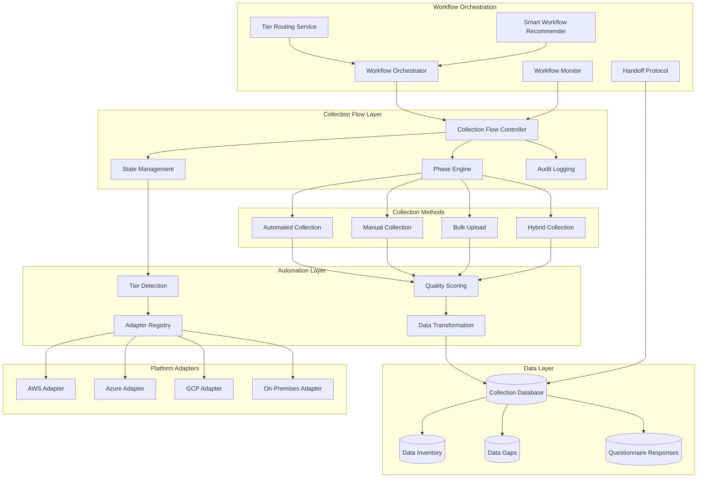
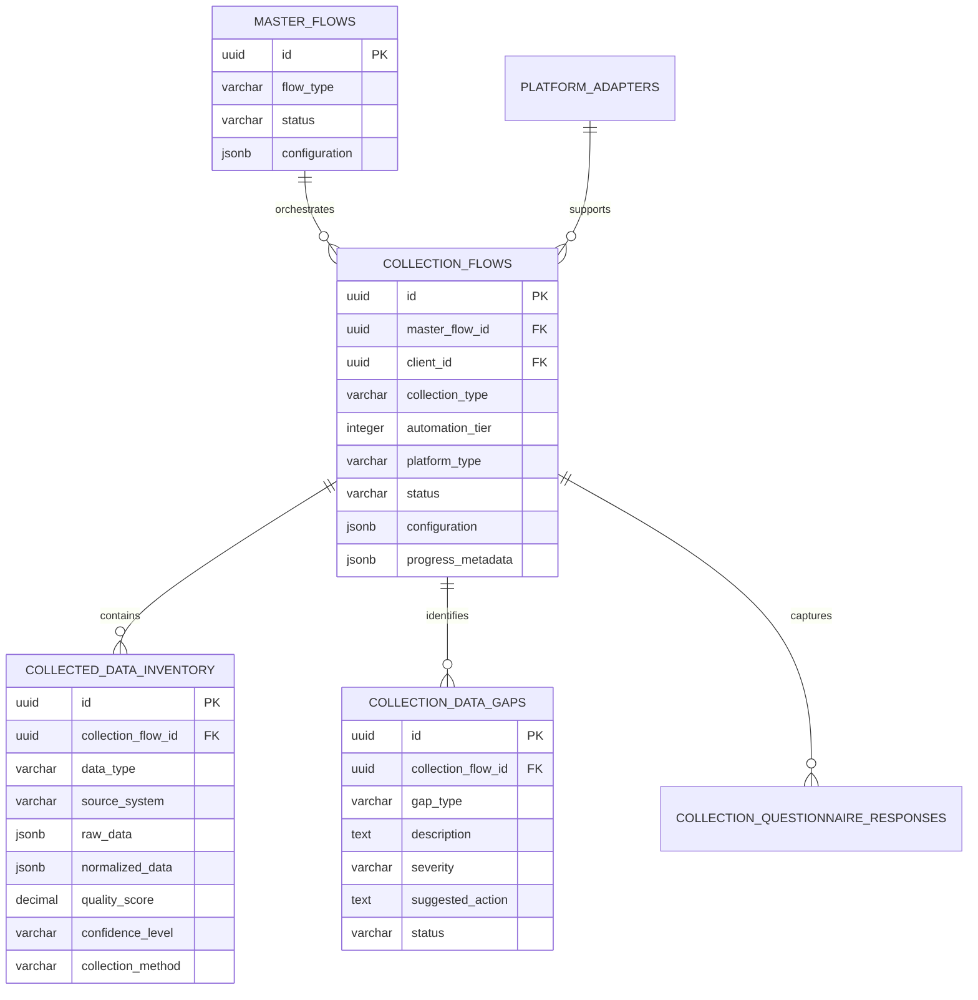

# Collection Flow Architecture - Technical Documentation

## Overview

The Collection Flow system is the foundational component of the Adaptive Data Collection System (ADCS) that intelligently automates asset discovery and data collection across diverse cloud and on-premises environments. It operates as a specialized workflow type within the Master Flow Orchestrator framework.

## System Architecture

### Core Components



### Component Details

#### Collection Flow Controller
- **Location**: `backend/app/services/collection_flow/state_management.py`
- **Purpose**: Central coordination of collection workflows
- **Key Features**:
  - Flow lifecycle management (initialize, execute, pause, resume, complete)
  - Integration with Master Flow Orchestrator
  - Real-time status tracking and updates
  - Error handling and recovery mechanisms

#### Tier Detection Service
- **Location**: `backend/app/services/collection_flow/tier_detection.py`
- **Purpose**: Intelligent assessment of environment automation capabilities
- **Automation Tiers**:
  - **Tier 1 (Modern Cloud)**: 90%+ automation via native APIs
  - **Tier 2 (Mixed Environment)**: 70% automation with hybrid approach
  - **Tier 3 (Restricted Access)**: 40% automation with file-based collection
  - **Tier 4 (Air-Gapped)**: 10% automation with manual data entry

#### Platform Adapter Registry
- **Location**: `backend/app/services/collection_flow/adapters.py`
- **Purpose**: Unified interface for all platform-specific data collection
- **Supported Platforms**:
  - Amazon Web Services (AWS)
  - Microsoft Azure
  - Google Cloud Platform (GCP)
  - On-Premises VMware vSphere
  - Generic CMDB/Asset Management systems

#### Quality Scoring Framework
- **Location**: `backend/app/services/collection_flow/quality_scoring.py`
- **Purpose**: Comprehensive assessment of collected data quality and completeness
- **Scoring Dimensions**:
  - **Completeness**: Percentage of required fields populated
  - **Accuracy**: Validation against known data patterns
  - **Consistency**: Cross-field validation and business rule compliance
  - **Freshness**: Data age and update frequency assessment
  - **Confidence**: Statistical confidence in automation vs manual data

## Data Model

### Core Entities

#### Collection Flows Table
```sql
CREATE TABLE collection_flows (
    id UUID PRIMARY KEY DEFAULT gen_random_uuid(),
    master_flow_id UUID REFERENCES master_flows(id),
    client_id UUID REFERENCES clients(id),
    collection_type VARCHAR(50) NOT NULL, -- 'automated', 'manual', 'hybrid'
    automation_tier INTEGER CHECK (automation_tier BETWEEN 1 AND 4),
    platform_type VARCHAR(50), -- 'aws', 'azure', 'gcp', 'on_premises'
    status VARCHAR(50) DEFAULT 'pending',
    configuration JSONB,
    progress_metadata JSONB,
    created_at TIMESTAMP DEFAULT NOW(),
    updated_at TIMESTAMP DEFAULT NOW()
);
```

#### Collected Data Inventory
```sql
CREATE TABLE collected_data_inventory (
    id UUID PRIMARY KEY DEFAULT gen_random_uuid(),
    collection_flow_id UUID REFERENCES collection_flows(id),
    data_type VARCHAR(100), -- 'application', 'infrastructure', 'dependency'
    source_system VARCHAR(100), -- 'aws_ec2', 'azure_vm', 'manual_entry'
    raw_data JSONB,
    normalized_data JSONB,
    quality_score DECIMAL(3,2),
    confidence_level VARCHAR(20), -- 'high', 'medium', 'low'
    collection_method VARCHAR(50), -- 'api', 'file_upload', 'manual'
    collected_at TIMESTAMP DEFAULT NOW()
);
```

#### Collection Data Gaps
```sql
CREATE TABLE collection_data_gaps (
    id UUID PRIMARY KEY DEFAULT gen_random_uuid(),
    collection_flow_id UUID REFERENCES collection_flows(id),
    gap_type VARCHAR(100), -- 'missing_field', 'low_confidence', 'validation_failure'
    description TEXT,
    severity VARCHAR(20), -- 'critical', 'high', 'medium', 'low'
    suggested_action TEXT,
    status VARCHAR(50) DEFAULT 'open', -- 'open', 'addressed', 'accepted'
    identified_at TIMESTAMP DEFAULT NOW()
);
```

### Data Relationships



## Workflow Orchestration

### Phase Execution Engine

The Collection Flow operates through a structured phase system:

#### Phase 1: Environment Assessment
- Platform detection and capability analysis
- Automation tier classification
- Security posture evaluation
- Connectivity and access validation

#### Phase 2: Collection Strategy Planning
- Workflow type selection (automated/manual/hybrid)
- Platform adapter configuration
- Data collection scope definition
- Quality threshold establishment

#### Phase 3: Data Collection Execution
- Automated discovery via platform APIs
- Manual data entry through adaptive forms
- Bulk data upload and processing
- Real-time progress monitoring and adjustment

#### Phase 4: Quality Assurance and Validation
- Data completeness assessment
- Cross-field validation and consistency checks
- Gap identification and prioritization
- Quality score calculation and reporting

#### Phase 5: Handoff to Discovery Flow
- Data normalization and transformation
- Integration with existing Discovery Flow processes
- Seamless transition to 6R analysis workflows
- Audit trail and metadata preservation

### Smart Workflow Recommendation

The system employs machine learning algorithms to recommend optimal collection strategies:

```python
class SmartWorkflowRecommendationEngine:
    """Intelligent workflow optimization based on historical patterns"""
    
    def analyze_environment_patterns(self, client_context):
        """Analyze client environment for automation opportunities"""
        
    def recommend_collection_strategy(self, environment_analysis):
        """Generate optimal collection workflow recommendations"""
        
    def optimize_adapter_selection(self, platform_capabilities):
        """Select best-performing adapters for the environment"""
        
    def predict_collection_duration(self, scope_assessment):
        """Estimate collection timeline based on historical data"""
```

## Integration Points

### Master Flow Orchestrator Integration

The Collection Flow integrates seamlessly with the existing Master Flow Orchestrator:

- **Flow Registration**: Collection Flows register as specialized workflow types
- **State Synchronization**: Real-time status updates to Master Flow state machine
- **Resource Management**: Shared resource pools and execution queues
- **Error Propagation**: Coordinated error handling and recovery procedures

### Discovery Flow Handoff

Upon completion, Collection Flows hand off normalized data to Discovery Flows:

- **Data Transformation**: Raw collection data normalized to Discovery Flow schema
- **Quality Metadata**: Quality scores and confidence levels preserved
- **Gap Documentation**: Identified data gaps passed for Discovery Flow consideration
- **Audit Trail**: Complete collection history maintained for compliance

## Security Architecture

### Credential Management
- Secure storage of platform API credentials
- Encryption at rest using AES-256
- Role-based access control for credential access
- Automatic credential rotation support

### Data Protection
- End-to-end encryption for data in transit
- Field-level encryption for sensitive data elements
- Audit logging for all data access and modifications
- Compliance with SOC 2 Type II requirements

### Network Security
- Support for air-gapped deployments
- Configurable proxy and firewall traversal
- mTLS for all external platform communications
- Network isolation for multi-tenant environments

## Performance Characteristics

### Scalability Metrics
- **Concurrent Collections**: Support for 100+ simultaneous collection flows
- **Data Throughput**: Process 10,000+ assets per hour in automated mode
- **Storage Efficiency**: Optimized JSONB storage with automatic compression
- **Query Performance**: Sub-second response times for progress monitoring

### Resource Utilization
- **Memory Usage**: Average 512MB per active collection flow
- **CPU Utilization**: Optimized async processing for I/O-bound operations
- **Storage Growth**: Approximately 1KB per collected asset record
- **Network Bandwidth**: Adaptive throttling based on environment constraints

## Monitoring and Observability

### Key Metrics
- Collection success rates by automation tier and platform
- Data quality scores and trend analysis
- Performance metrics (duration, throughput, error rates)
- User adoption patterns and workflow preferences

### Alerting and Notifications
- Real-time collection failure notifications
- Quality threshold breach alerts
- Long-running collection monitoring
- Capacity and resource utilization warnings

## Deployment Considerations

### Infrastructure Requirements
- PostgreSQL 13+ for data persistence
- Redis for caching and session management
- Docker containers for consistent deployment
- Kubernetes support for production scalability

### Configuration Management
- Environment-specific configuration files
- Secure secrets management integration
- Dynamic configuration updates without restart
- A/B testing framework for workflow optimization

This technical documentation provides a comprehensive overview of the Collection Flow architecture, serving as a foundation for development, maintenance, and enhancement activities.