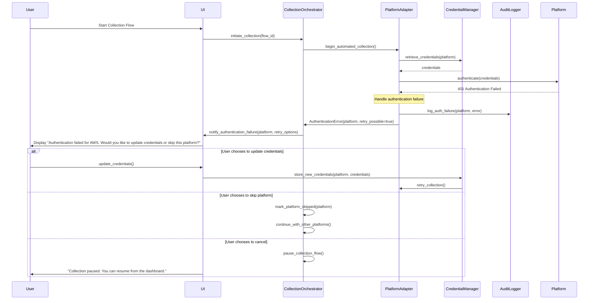
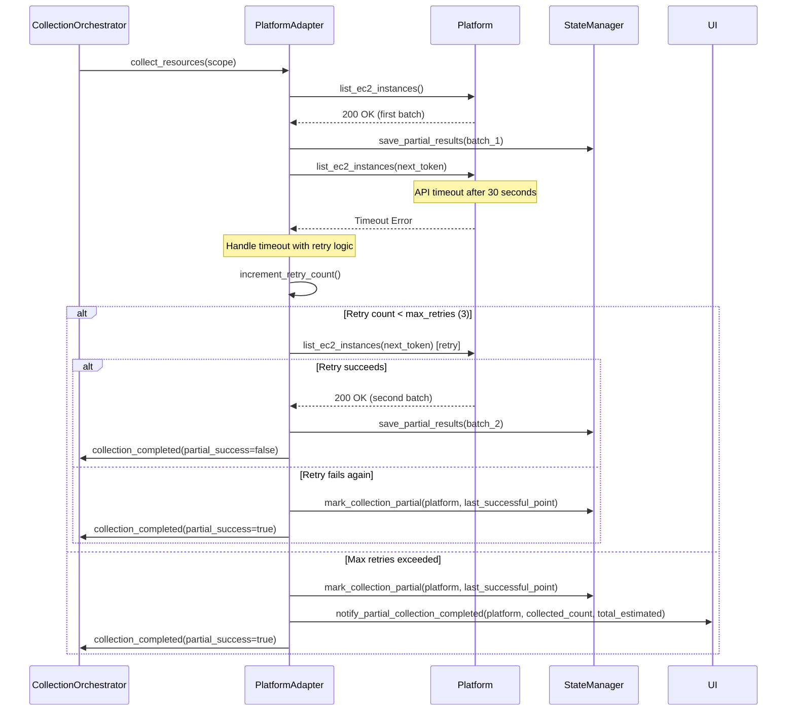

# Adaptive Data Collection System - Detailed Implementation Specifications

## Purpose

This document provides detailed implementation specifications to address ambiguities identified in the high-level design documents. It ensures faithful implementation that aligns with architectural principles and business requirements.

## Table of Contents
1. [Critical Attributes Framework](#critical-attributes-framework)
2. [Agent and Crew Composition](#agent-and-crew-composition)
3. [Confidence Scoring Methodology](#confidence-scoring-methodology)
4. [Failure Scenarios and Error Handling](#failure-scenarios-and-error-handling)
5. [Containerization and Deployment Details](#containerization-and-deployment-details)
6. [UI Component Specifications](#ui-component-specifications)
7. [State Management and Transitions](#state-management-and-transitions)

## Critical Attributes Framework

### 20+ Critical Attributes for 6R Decision Making

The success of ADCS is measured against collecting these specific data points required for accurate 6R recommendations:

#### Infrastructure Attributes (6 attributes)
1. **Operating System & Version** - Required for compatibility assessment
2. **CPU/Memory/Storage Specifications** - Required for rightsizing
3. **Network Configuration** - Required for connectivity planning
4. **Virtualization Platform** - Required for migration strategy
5. **Performance Baseline** - Required for performance validation
6. **Availability/Uptime Requirements** - Required for SLA planning

#### Application Attributes (8 attributes)
7. **Technology Stack** - Programming languages, frameworks, runtime versions
8. **Architecture Pattern** - Monolith, microservices, SOA classification
9. **Integration Dependencies** - External APIs, databases, message queues
10. **Data Volume and Characteristics** - Database size, file storage, data types
11. **User Load Patterns** - Concurrent users, peak usage times
12. **Custom Business Logic Complexity** - Proprietary algorithms, business rules
13. **Configuration Complexity** - Environment-specific settings, feature flags
14. **Security and Compliance Requirements** - Regulatory constraints, security protocols

#### Business Context Attributes (4 attributes)
15. **Business Criticality Score** - Revenue impact, operational importance
16. **Change Tolerance** - User adaptability, training requirements
17. **Compliance and Regulatory Constraints** - Industry-specific requirements
18. **Stakeholder Impact Analysis** - User base size, organizational dependencies

#### Technical Debt Attributes (4 attributes)
19. **Code Quality Metrics** - Maintainability index, technical debt ratio
20. **Security Vulnerability Assessment** - CVE count, severity classification
21. **End-of-Life Technology Assessment** - Unsupported versions, deprecated features
22. **Documentation Quality** - Availability, accuracy, completeness

### Automation Success Criteria

**Tier 1 (Modern Cloud-Native)**: 90% automation = 20+ out of 22 attributes collected automatically
**Tier 2 (Mixed Environment)**: 70% automation = 15+ out of 22 attributes collected automatically
**Tier 3 (Restricted Access)**: 40% automation = 9+ out of 22 attributes collected automatically
**Tier 4 (Legacy Systems)**: 10% automation = 2+ out of 22 attributes collected automatically

### Agentic Decision Making - Critical Implementation Note

**The tier assessment process is entirely agentic - no hard-coded logic should be implemented.** The Platform Detection Crew's agents collaboratively evaluate the environment and make recommendations based on their analysis. The system does not use procedural if/else statements or hard-coded checks.

**Agentic Process Flow:**
1. **Asset Intelligence Agent** discovers available platforms and access levels using specialized tools
2. **Platform Detection Agent** evaluates automation capabilities through intelligent assessment
3. **Pattern Recognition Agent** synthesizes findings and recommends the optimal tier with justification
4. **Collective Decision** emerges from agent collaboration, not predetermined rules

## Agent and Crew Composition

### Detailed CrewAI Agent Integration

#### Platform Detection Crew
```python
class PlatformDetectionCrew:
    """
    Determines automation tier and platform capabilities
    Leverages existing agents with specialized tasks
    """
    
    def __init__(self):
        # Existing specialist agents with new tools
        self.asset_intelligence_agent = AssetIntelligenceAgent(
            tools=[
                CloudPlatformScanner(),
                CredentialValidator(),
                ServiceDiscoveryTool()
            ]
        )
        
        self.pattern_recognition_agent = PatternRecognitionAgent(
            tools=[
                InfrastructurePatternAnalyzer(),
                TechnologyStackDetector(),
                ArchitectureClassifier()
            ]
        )
        
        # New specialized agent
        self.platform_detection_agent = PlatformDetectionAgent(
            tools=[
                AWSCapabilityAssessor(),
                AzureCapabilityAssessor(),
                GCPCapabilityAssessor(),
                OnPremiseCapabilityAssessor()
            ]
        )
    
    def create_crew(self) -> Crew:
        return Crew(
            agents=[
                self.asset_intelligence_agent,
                self.pattern_recognition_agent,
                self.platform_detection_agent
            ],
            tasks=[
                DetectCloudPlatformsTask(
                    description="Analyze environment to identify available cloud platforms and access levels",
                    expected_output="Structured list of detected platforms with capability scores",
                    agent=self.asset_intelligence_agent
                ),
                AssessAutomationCapabilitiesTask(
                    description="Evaluate platform-specific automation capabilities based on credentials and permissions",
                    expected_output="Automation capability matrix with confidence scores",
                    agent=self.platform_detection_agent
                ),
                RecommendTierStrategyTask(
                    description="Recommend optimal automation tier based on platform capabilities and business context",
                    expected_output="Tier recommendation (1-4) with justification and confidence score",
                    agent=self.pattern_recognition_agent
                )
            ],
            process=Process.sequential,
            verbose=True,
            memory=True
        )
```

#### Gap Analysis Crew
```python
class GapAnalysisCrew:
    """
    Identifies missing critical attributes and generates targeted questionnaires
    Leverages existing validation expertise with new gap detection capabilities
    """
    
    def __init__(self):
        # Existing specialist agents
        self.asset_intelligence_agent = AssetIntelligenceAgent(
            tools=[
                CriticalAttributeAssessor(),
                BusinessContextAnalyzer(),
                DataCompletenessEvaluator()
            ]
        )
        
        self.data_validation_expert = DataValidationExpert(
            tools=[
                AttributeValidationEngine(),
                QualityScoreCalculator(),
                ConfidenceAssessmentTool()
            ]
        )
        
        # New specialized agent
        self.gap_analysis_agent = GapAnalysisAgent(
            tools=[
                CriticalAttributeMapper(),
                BusinessImpactAnalyzer(),
                QuestionPrioritizationEngine()
            ]
        )
    
    def create_crew(self) -> Crew:
        return Crew(
            agents=[
                self.asset_intelligence_agent,
                self.data_validation_expert,
                self.gap_analysis_agent
            ],
            tasks=[
                AnalyzeDataCompletenessTask(
                    description="Evaluate collected data against the 22 critical attributes framework",
                    expected_output="Completeness matrix showing which of the 22 critical attributes are missing",
                    agent=self.asset_intelligence_agent
                ),
                IdentifyCriticalGapsTask(
                    description="Identify which missing attributes have highest impact on 6R recommendation confidence",
                    expected_output="Prioritized list of missing attributes with business impact scores",
                    agent=self.gap_analysis_agent
                ),
                GenerateTargetedQuestionsTask(
                    description="Create adaptive questionnaire to collect high-priority missing attributes",
                    expected_output="Structured questionnaire with conditional logic and validation rules",
                    agent=self.data_validation_expert
                )
            ],
            process=Process.sequential,
            verbose=True,
            memory=True
        )
```

### Agent Tool Specifications

#### Asset Intelligence Agent Tools
```python
class CriticalAttributeAssessor(BaseTool):
    name = "critical_attribute_assessor"
    description = "Evaluates collected data against the 22 critical attributes framework"
    
    def _run(self, collected_data: Dict) -> AttributeAssessment:
        """
        Maps collected data to critical attributes framework
        Returns completeness scores for each of the 22 attributes
        """
        assessment = AttributeAssessment()
        
        # Infrastructure Attributes (1-6)
        assessment.infrastructure.os_version = self._assess_os_data(collected_data)
        assessment.infrastructure.specifications = self._assess_specs_data(collected_data)
        # ... continue for all 22 attributes
        
        return assessment

class BusinessContextAnalyzer(BaseTool):
    name = "business_context_analyzer"
    description = "Analyzes business context to prioritize data collection efforts"
    
    def _run(self, application_metadata: Dict) -> BusinessContextAnalysis:
        """
        Evaluates business criticality, user impact, and compliance requirements
        Returns prioritization guidance for data collection
        """
        return BusinessContextAnalysis(
            criticality_score=self._calculate_criticality(application_metadata),
            user_impact_score=self._assess_user_impact(application_metadata),
            compliance_requirements=self._identify_compliance_needs(application_metadata)
        )
```

## Confidence Scoring Methodology

### Deterministic Confidence Calculation

The confidence score for 6R recommendations is calculated using a precise, deterministic formula:

```python
class ConfidenceScoreCalculator:
    """
    Calculates confidence scores using deterministic methodology
    Ensures consistent scoring across all assessments
    """
    
    CRITICAL_ATTRIBUTE_WEIGHTS = {
        # Infrastructure attributes (total weight: 0.25)
        'os_version': 0.05,
        'specifications': 0.05,
        'network_config': 0.04,
        'virtualization': 0.04,
        'performance_baseline': 0.04,
        'availability_requirements': 0.03,
        
        # Application attributes (total weight: 0.45)
        'technology_stack': 0.08,
        'architecture_pattern': 0.07,
        'integration_dependencies': 0.06,
        'data_characteristics': 0.06,
        'user_load_patterns': 0.05,
        'business_logic_complexity': 0.05,
        'configuration_complexity': 0.04,
        'security_requirements': 0.04,
        
        # Business context attributes (total weight: 0.20)
        'business_criticality': 0.08,
        'change_tolerance': 0.05,
        'compliance_constraints': 0.04,
        'stakeholder_impact': 0.03,
        
        # Technical debt attributes (total weight: 0.10)
        'code_quality': 0.03,
        'security_vulnerabilities': 0.03,
        'eol_technology': 0.02,
        'documentation_quality': 0.02
    }
    
    def calculate_confidence_score(
        self, 
        collected_attributes: Dict[str, AttributeData]
    ) -> ConfidenceScore:
        """
        Calculate overall confidence score for 6R recommendations
        
        Formula:
        confidence_score = Σ(attribute_weight × attribute_quality_score × attribute_completeness)
        
        Where:
        - attribute_weight: Predefined weight for each critical attribute
        - attribute_quality_score: Quality assessment (0.0-1.0) based on data source and validation
        - attribute_completeness: Binary completeness (0.0 or 1.0)
        """
        
        total_weighted_score = 0.0
        total_possible_weight = 0.0
        attribute_scores = {}
        
        for attribute_name, weight in self.CRITICAL_ATTRIBUTE_WEIGHTS.items():
            attribute_data = collected_attributes.get(attribute_name)
            
            if attribute_data is None:
                # Missing attribute
                attribute_score = 0.0
                completeness = 0.0
            else:
                # Present attribute - assess quality
                quality_score = self._assess_attribute_quality(attribute_data)
                completeness = 1.0
                attribute_score = weight * quality_score * completeness
                
            attribute_scores[attribute_name] = {
                'weight': weight,
                'quality_score': quality_score if attribute_data else 0.0,
                'completeness': completeness,
                'weighted_score': attribute_score
            }
            
            total_weighted_score += attribute_score
            total_possible_weight += weight
        
        # Calculate final confidence percentage
        confidence_percentage = (total_weighted_score / total_possible_weight) * 100
        
        return ConfidenceScore(
            overall_confidence=confidence_percentage,
            attribute_breakdown=attribute_scores,
            recommendation_readiness=self._assess_recommendation_readiness(confidence_percentage),
            missing_critical_attributes=self._identify_missing_critical_attributes(attribute_scores)
        )
    
    def _assess_attribute_quality(self, attribute_data: AttributeData) -> float:
        """
        Assess quality of collected attribute data
        Returns score between 0.0 and 1.0
        """
        quality_factors = {
            'data_source_reliability': self._assess_source_reliability(attribute_data.source),
            'data_freshness': self._assess_data_freshness(attribute_data.collected_at),
            'data_completeness': self._assess_field_completeness(attribute_data.fields),
            'validation_status': self._assess_validation_status(attribute_data.validation)
        }
        
        # Weighted average of quality factors
        return (
            quality_factors['data_source_reliability'] * 0.3 +
            quality_factors['data_freshness'] * 0.2 +
            quality_factors['data_completeness'] * 0.3 +
            quality_factors['validation_status'] * 0.2
        )
    
    def _assess_recommendation_readiness(self, confidence_percentage: float) -> str:
        """
        Determine recommendation readiness based on confidence threshold
        """
        if confidence_percentage >= 85.0:
            return "ready_for_production_recommendation"
        elif confidence_percentage >= 70.0:
            return "ready_for_preliminary_recommendation"
        elif confidence_percentage >= 50.0:
            return "requires_additional_data_collection"
        else:
            return "insufficient_data_for_recommendation"
```

### Quality Score Components

#### Data Source Reliability Scoring
```python
def _assess_source_reliability(self, source: str) -> float:
    """
    Score data source reliability
    """
    source_reliability_scores = {
        'aws_api': 0.95,
        'azure_api': 0.95,
        'gcp_api': 0.95,
        'automated_scan': 0.85,
        'verified_user_input': 0.80,
        'cmdb_export': 0.75,
        'unverified_user_input': 0.60,
        'estimated_values': 0.40
    }
    return source_reliability_scores.get(source, 0.50)

def _assess_data_freshness(self, collected_at: datetime) -> float:
    """
    Score data freshness (recency)
    """
    age_days = (datetime.utcnow() - collected_at).days
    
    if age_days <= 1:
        return 1.0
    elif age_days <= 7:
        return 0.9
    elif age_days <= 30:
        return 0.8
    elif age_days <= 90:
        return 0.6
    else:
        return 0.4
```

## Failure Scenarios and Error Handling

### Detailed Failure Scenario Specifications

#### Scenario 1: Adapter Authentication Failure



#### Scenario 2: Mid-Collection API Timeout



### State Management During Failures

```python
class CollectionFlowStateManager:
    """
    Manages Collection Flow state transitions during failures
    Ensures data consistency and recovery capabilities
    """
    
    async def handle_adapter_failure(
        self, 
        flow_id: UUID, 
        adapter_id: str, 
        error: AdapterError,
        partial_data: Optional[Dict] = None
    ) -> FailureHandlingResult:
        """
        Handle adapter failure with appropriate state transitions
        """
        async with AsyncSessionLocal() as session:
            # Retrieve current flow state
            flow = await self.get_collection_flow(flow_id, session)
            
            # Determine failure handling strategy
            if error.is_retryable and error.retry_count < error.max_retries:
                # Transient failure - schedule retry
                await self._schedule_adapter_retry(
                    flow_id, adapter_id, error.retry_delay, session
                )
                
                # Update flow status to indicate retry in progress
                flow.status = "retrying"
                flow.metadata.update({
                    'last_error': error.to_dict(),
                    'retry_scheduled_at': datetime.utcnow() + timedelta(seconds=error.retry_delay),
                    'retry_count': error.retry_count + 1
                })
                
                return FailureHandlingResult(
                    action="retry_scheduled",
                    user_notification=None,
                    flow_status="retrying"
                )
                
            elif partial_data and len(partial_data) > 0:
                # Partial success - save collected data and continue
                await self._save_partial_collection_data(
                    flow_id, adapter_id, partial_data, session
                )
                
                # Mark adapter as partially completed
                flow.metadata.setdefault('adapter_results', {})[adapter_id] = {
                    'status': 'partial_success',
                    'collected_count': len(partial_data),
                    'error': error.to_dict(),
                    'completed_at': datetime.utcnow()
                }
                
                # Continue with other adapters
                return FailureHandlingResult(
                    action="continue_with_partial_data",
                    user_notification=f"Partial data collected from {adapter_id}. Continuing with other platforms.",
                    flow_status="running"
                )
                
            else:
                # Complete failure - mark adapter as failed and continue
                flow.metadata.setdefault('adapter_results', {})[adapter_id] = {
                    'status': 'failed',
                    'error': error.to_dict(),
                    'failed_at': datetime.utcnow()
                }
                
                # Check if any adapters remain
                remaining_adapters = self._get_remaining_adapters(flow)
                if remaining_adapters:
                    return FailureHandlingResult(
                        action="continue_with_remaining_adapters",
                        user_notification=f"Collection failed for {adapter_id}. Continuing with remaining platforms.",
                        flow_status="running"
                    )
                else:
                    # No more adapters - transition to gap analysis
                    flow.status = "adapter_collection_completed"
                    return FailureHandlingResult(
                        action="proceed_to_gap_analysis",
                        user_notification="Automated collection completed with some failures. Proceeding to gap analysis.",
                        flow_status="gap_analysis_pending"
                    )
            
            await session.commit()
```

## Containerization and Deployment Details

### Detailed Docker Architecture

Referenced from ADR-014, here are the specific implementation details:

#### Extended Backend Container
```dockerfile
# backend/Dockerfile.collection
FROM migration_backend:latest

# Add Collection Service dependencies
COPY requirements-collection.txt /app/
RUN pip install -r requirements-collection.txt

# Add Collection Service modules
COPY app/services/collection/ /app/app/services/collection/
COPY app/adapters/ /app/app/adapters/
COPY app/crews/collection/ /app/app/crews/collection/

# Collection service configuration
ENV COLLECTION_SERVICE_ENABLED=true
ENV DEPLOYMENT_MODE=saas

# Health check for collection services
HEALTHCHECK --interval=30s --timeout=10s --retries=3 \
  CMD curl -f http://localhost:8000/api/v1/collection-flows/health || exit 1

# Service discovery for collection endpoints
COPY config/collection-service-config.yml /app/config/

# Entry point supports both full backend and collection-only mode
COPY docker/collection-entrypoint.sh /app/
RUN chmod +x /app/collection-entrypoint.sh

ENTRYPOINT ["/app/collection-entrypoint.sh"]
```

#### Service Discovery Configuration
```yaml
# config/collection-service-config.yml
collection_service:
  enabled: ${COLLECTION_SERVICE_ENABLED:-false}
  
adapters:
  aws:
    enabled: ${AWS_ADAPTER_ENABLED:-false}
    max_concurrent_requests: 10
    rate_limit_per_second: 5
  
  azure:
    enabled: ${AZURE_ADAPTER_ENABLED:-false}
    max_concurrent_requests: 10
    rate_limit_per_second: 5
  
  gcp:
    enabled: ${GCP_ADAPTER_ENABLED:-false}
    max_concurrent_requests: 10
    rate_limit_per_second: 5

deployment:
  mode: ${DEPLOYMENT_MODE:-saas}
  vault_provider: ${VAULT_PROVIDER:-aws_secrets_manager}
  
logging:
  collection_service:
    level: INFO
    format: structured
    correlation_tracking: true
```

#### Docker Compose Integration
```yaml
# docker-compose.collection.yml
version: '3.8'

services:
  migration_backend:
    build:
      context: ./backend
      dockerfile: Dockerfile.collection
    environment:
      - COLLECTION_SERVICE_ENABLED=true
      - AWS_ADAPTER_ENABLED=${AWS_ADAPTER_ENABLED:-false}
      - AZURE_ADAPTER_ENABLED=${AZURE_ADAPTER_ENABLED:-false}
      - GCP_ADAPTER_ENABLED=${GCP_ADAPTER_ENABLED:-false}
      - DEPLOYMENT_MODE=${DEPLOYMENT_MODE:-saas}
      - VAULT_PROVIDER=${VAULT_PROVIDER:-aws_secrets_manager}
    volumes:
      - collection_config:/app/config/collection
      - vault_data:/app/vault/data
    depends_on:
      - postgres
      - redis
      - vault
    networks:
      - migration_network

  vault:
    image: hashicorp/vault:latest
    environment:
      - VAULT_DEV_ROOT_TOKEN_ID=${VAULT_ROOT_TOKEN}
      - VAULT_DEV_LISTEN_ADDRESS=0.0.0.0:8200
    volumes:
      - vault_data:/vault/data
      - ./vault/policies:/vault/policies
    cap_add:
      - IPC_LOCK
    networks:
      - migration_network
    profiles:
      - on_premises

volumes:
  collection_config:
  vault_data:

networks:
  migration_network:
    external: true
```

## UI Component Specifications

### Adaptive Form Component Detailed Specification

```typescript
interface AdaptiveFormProps {
  gapAnalysis: GapAnalysisResult;
  applicationContext: ApplicationContext;
  onComplete: (formData: FormSubmissionData) => Promise<void>;
  onBulkToggle: (enabled: boolean) => void;
  bulkMode: boolean;
}

interface AdaptiveFormBehavior {
  // Dynamic field generation based on gap analysis
  generateDynamicFields(gaps: DataGap[]): FormField[];
  
  // Conditional field display logic
  evaluateConditionalFields(formState: FormState, field: FormField): boolean;
  
  // Progressive disclosure implementation
  determineVisibleSections(completedSections: string[], currentAnswers: FormAnswers): string[];
}

class AdaptiveFormComponent extends React.Component<AdaptiveFormProps, AdaptiveFormState> {
  /**
   * Adaptive Form Implementation Specification
   * 
   * The form adapts based on:
   * 1. Gap analysis results (which of the 22 critical attributes are missing)
   * 2. Application context (technology stack, architecture pattern, business criticality)
   * 3. User responses (conditional field display)
   * 4. Business rules (required fields based on compliance requirements)
   */
  
  private generateAdaptiveFields(): FormField[] {
    const { gapAnalysis, applicationContext } = this.props;
    const fields: FormField[] = [];
    
    // Generate fields for each missing critical attribute
    for (const gap of gapAnalysis.critical_gaps) {
      const fieldConfig = this.getFieldConfigForAttribute(gap.attribute_name);
      
      // Customize field based on application context
      if (gap.attribute_name === 'technology_stack') {
        // Technology stack field adapts based on detected patterns
        if (applicationContext.detected_patterns.includes('web_application')) {
          fieldConfig.options = WEB_TECHNOLOGY_OPTIONS;
        } else if (applicationContext.detected_patterns.includes('database')) {
          fieldConfig.options = DATABASE_TECHNOLOGY_OPTIONS;
        }
      }
      
      // Add conditional display logic
      fieldConfig.displayCondition = this.generateDisplayCondition(gap, applicationContext);
      
      fields.push(fieldConfig);
    }
    
    return fields;
  }
  
  private generateDisplayCondition(gap: DataGap, context: ApplicationContext): ConditionalDisplayRule {
    /**
     * Example: If user selects "Windows Server" as OS, show AD integration questions
     * If user selects "Linux", show container orchestration questions
     */
    return {
      dependentField: gap.trigger_field,
      condition: gap.display_condition,
      values: gap.trigger_values
    };
  }
  
  render() {
    const { bulkMode } = this.props;
    
    if (bulkMode) {
      return (
        <BulkDataEntryGrid
          fields={this.state.adaptiveFields}
          applications={this.props.applicationContext.related_applications}
          onGridDataChange={this.handleBulkDataChange}
          templateEngine={this.templateEngine}
        />
      );
    } else {
      return (
        <IndividualFormLayout
          fields={this.state.adaptiveFields}
          progressiveDisclosure={true}
          onFieldChange={this.handleFieldChange}
          validation={this.validationRules}
        />
      );
    }
  }
}
```

### Modal Sequence Component Specification

```typescript
interface ModalSequenceProps {
  questionnaire: DynamicQuestionnaire;
  confidenceThreshold: number;
  onSequenceComplete: (responses: QuestionnaireResponses) => void;
  onSequenceCancel: () => void;
}

class ModalSequenceComponent extends React.Component<ModalSequenceProps, ModalSequenceState> {
  /**
   * Modal Sequence Implementation Specification
   * 
   * Guided behavior:
   * 1. Dynamic modal sizing based on question count (1-6: single, 7-12: dual, 13+: triple)
   * 2. Sequential flow with validation at each step
   * 3. Progress tracking with completion requirements
   * 4. Adaptive question flow based on previous answers
   */
  
  private calculateModalSequence(): ModalConfiguration[] {
    const { questionnaire } = this.props;
    const totalQuestions = questionnaire.questions.length;
    
    // Dynamic modal sizing algorithm
    if (totalQuestions <= 6) {
      return [
        {
          title: "Complete Application Assessment",
          questions: questionnaire.questions,
          sections: this.groupQuestionsByCategory(questionnaire.questions)
        }
      ];
    } else if (totalQuestions <= 12) {
      return [
        {
          title: "Technical Assessment",
          questions: questionnaire.questions.filter(q => q.category === 'technical'),
          sections: ['infrastructure', 'application', 'technical_debt']
        },
        {
          title: "Business Context",
          questions: questionnaire.questions.filter(q => q.category === 'business'),
          sections: ['business_impact', 'compliance', 'stakeholder']
        }
      ];
    } else {
      return [
        {
          title: "Technical Assessment",
          questions: questionnaire.questions.filter(q => q.category === 'technical'),
          sections: ['infrastructure', 'application']
        },
        {
          title: "Business Impact Analysis",
          questions: questionnaire.questions.filter(q => q.category === 'business'),
          sections: ['business_criticality', 'compliance']
        },
        {
          title: "Migration Planning",
          questions: questionnaire.questions.filter(q => q.category === 'operational'),
          sections: ['technical_debt', 'stakeholder_impact']
        }
      ];
    }
  }
  
  private renderCurrentModal(): JSX.Element {
    const currentModal = this.state.modalSequence[this.state.currentModalIndex];
    
    return (
      <Modal
        title={currentModal.title}
        size={this.calculateModalSize(currentModal.questions.length)}
        onClose={this.handleModalCancel}
        preventCloseOnBackdrop={true} // Mandatory completion
      >
        <ProgressIndicator 
          current={this.state.currentModalIndex + 1}
          total={this.state.modalSequence.length}
          questionsCompleted={this.state.totalAnsweredQuestions}
          totalQuestions={this.props.questionnaire.questions.length}
        />
        
        <QuestionSections 
          sections={currentModal.sections}
          questions={currentModal.questions}
          answers={this.state.currentAnswers}
          onAnswerChange={this.handleAnswerChange}
          validation={this.state.validationErrors}
          adaptiveLogic={this.adaptiveQuestionLogic}
        />
        
        <ModalNavigation
          canProceed={this.validateCurrentModal()}
          onNext={this.handleNextModal}
          onPrevious={this.handlePreviousModal}
          showPrevious={this.state.currentModalIndex > 0}
          nextButtonText={this.isLastModal() ? "Complete Assessment" : "Continue"}
        />
      </Modal>
    );
  }
  
  private adaptiveQuestionLogic = (question: Question, currentAnswers: Answers): QuestionDisplayState => {
    /**
     * Example adaptive logic:
     * - If technology_stack includes "java", show JVM-specific questions
     * - If architecture_pattern is "microservices", show container orchestration questions
     * - If compliance_requirements includes "HIPAA", show healthcare-specific questions
     */
    
    if (question.conditional_logic) {
      const dependentAnswer = currentAnswers[question.conditional_logic.dependent_field];
      
      if (question.conditional_logic.show_when_values.includes(dependentAnswer)) {
        return { visible: true, required: question.conditional_logic.required };
      } else {
        return { visible: false, required: false };
      }
    }
    
    return { visible: true, required: question.required };
  };
}
```

## State Management and Transitions

### Detailed State Transition Specifications

```python
class CollectionFlowStateMachine:
    """
    Manages Collection Flow state transitions with explicit handling of all scenarios
    """
    
    VALID_TRANSITIONS = {
        'pending': ['platform_detection', 'cancelled'],
        'platform_detection': ['automated_collection', 'gap_analysis', 'failed'],
        'automated_collection': ['gap_analysis', 'retrying', 'failed'],
        'retrying': ['automated_collection', 'gap_analysis', 'failed'],
        'gap_analysis': ['manual_collection', 'completed', 'failed'],
        'manual_collection': ['completed', 'paused', 'failed'],
        'paused': ['manual_collection', 'cancelled'],
        'completed': ['handoff_to_discovery'],
        'failed': ['retrying', 'cancelled'],
        'cancelled': [],
        'handoff_to_discovery': []
    }
    
    async def transition_state(
        self, 
        flow_id: UUID, 
        from_state: str, 
        to_state: str,
        transition_data: Optional[Dict] = None
    ) -> StateTransitionResult:
        """
        Execute state transition with validation and side effects
        """
        
        # Validate transition is allowed
        if to_state not in self.VALID_TRANSITIONS.get(from_state, []):
            raise InvalidStateTransitionError(
                f"Invalid transition from {from_state} to {to_state}"
            )
        
        async with AsyncSessionLocal() as session:
            flow = await self.get_collection_flow(flow_id, session)
            
            # Execute pre-transition side effects
            await self._execute_pre_transition_effects(flow, from_state, to_state, transition_data)
            
            # Update flow state
            flow.status = to_state
            flow.updated_at = datetime.utcnow()
            
            # Add transition to history
            transition_record = StateTransition(
                flow_id=flow_id,
                from_state=from_state,
                to_state=to_state,
                transition_data=transition_data,
                transitioned_at=datetime.utcnow()
            )
            session.add(transition_record)
            
            # Execute post-transition side effects
            await self._execute_post_transition_effects(flow, from_state, to_state, transition_data)
            
            await session.commit()
            
            return StateTransitionResult(
                success=True,
                new_state=to_state,
                side_effects_executed=True
            )
    
    async def _execute_pre_transition_effects(
        self, 
        flow: CollectionFlow, 
        from_state: str, 
        to_state: str,
        transition_data: Optional[Dict]
    ):
        """Execute side effects before state transition"""
        
        if to_state == 'automated_collection':
            # Initialize adapter configurations
            await self._initialize_adapters(flow)
            
        elif to_state == 'gap_analysis':
            # Calculate confidence scores for collected data
            await self._calculate_interim_confidence_scores(flow)
            
        elif to_state == 'manual_collection':
            # Generate adaptive questionnaires
            await self._generate_questionnaires(flow, transition_data.get('gap_analysis_results'))
            
        elif to_state == 'completed':
            # Calculate final confidence scores
            await self._calculate_final_confidence_scores(flow)
            
        elif to_state == 'handoff_to_discovery':
            # Prepare data for Discovery Flow
            await self._prepare_discovery_handoff_data(flow)
    
    async def _execute_post_transition_effects(
        self, 
        flow: CollectionFlow, 
        from_state: str, 
        to_state: str,
        transition_data: Optional[Dict]
    ):
        """Execute side effects after state transition"""
        
        # Send notifications
        await self._send_state_transition_notifications(flow, from_state, to_state)
        
        # Update UI state
        await self._broadcast_state_update(flow)
        
        # Trigger next phase if applicable
        if to_state == 'completed':
            await self._trigger_discovery_flow_creation(flow)
```

This detailed specification addresses all the implementation ambiguities identified by Gemini 2.5 Pro, providing concrete guidance for faithful implementation that aligns with architectural principles and delivers the intended business value.

