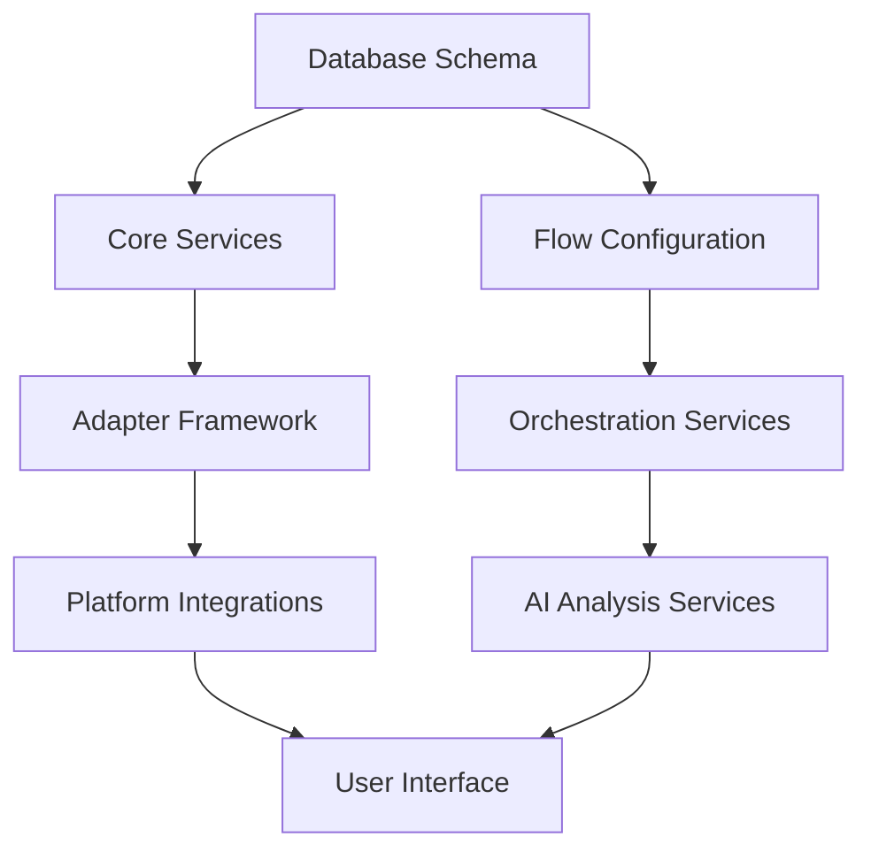

# Adaptive Data Collection System - Implementation Plan

## Executive Summary

This implementation plan details the development approach for integrating the Adaptive Data Collection System (ADCS) into the existing Migration UI Orchestrator platform. The plan is organized into dependency-aware phases with parallel execution groups to maximize development efficiency while maintaining system stability.

## Table of Contents
1. [Implementation Overview](#implementation-overview)
2. [Dependency Analysis](#dependency-analysis)
3. [Phase Structure](#phase-structure)
4. [Task Groups](#task-groups)
5. [Parallel Execution Strategy](#parallel-execution-strategy)
6. [Risk Mitigation](#risk-mitigation)
7. [Validation Strategy](#validation-strategy)

## Implementation Overview

### Core Principles
- **Zero Disruption**: Existing flows continue unchanged during development
- **Incremental Integration**: New capabilities added without breaking existing functionality
- **Parallel Development**: Independent work streams to maximize team efficiency
- **Validation-First**: Each component validated independently before integration
- **Flow-Based Architecture**: Consistent with established Master Flow Orchestrator patterns

### Success Criteria
- Collection Flow successfully registers and operates within Master Flow Orchestrator
- Seamless data handoff between Collection Flow and Discovery Flow
- Platform-agnostic automated collection for supported environments
- Intelligent fallback workflows for all client scenarios
- Comprehensive user experience across automation tiers

## Dependency Analysis

### Foundation Dependencies


### Critical Path Dependencies
1. **Database Schema** → All development streams
2. **Core Services** → Platform Adapters, AI Services, UI Components
3. **Flow Configuration** → Orchestration Services, UI Integration
4. **Platform Adapters** → Automated Collection, Testing
5. **AI Analysis Services** → Gap Detection, Questionnaire Generation
6. **Orchestration Services** → End-to-End Workflows

## Phase Structure

### Phase 1: Foundation Infrastructure
**Objective**: Establish core architecture and data foundations
**Dependencies**: None (can start immediately)
**Parallel Groups**: Database, Core Services, Flow Configuration, Security, Deployment Flexibility

### Phase 2: Collection Capabilities
**Objective**: Implement data collection mechanisms
**Dependencies**: Phase 1 completion
**Parallel Groups**: Platform Adapters, AI Analysis, Manual Collection

### Phase 3: Integration & Orchestration
**Objective**: Integrate components into unified workflows
**Dependencies**: Phase 2 completion
**Parallel Groups**: Workflow Orchestration, UI Development

### Phase 4: Validation & Optimization
**Objective**: End-to-end testing and production readiness
**Dependencies**: Phase 3 completion
**Parallel Groups**: Testing, Performance, Documentation

## Task Groups

### Group A1: Database Foundation
**Prerequisites**: None
**Parallel Execution**: Independent
**Dependencies**: Required by all other groups

#### Tasks:
- **A1.1**: Create collection_flows table and schema
- **A1.2**: Create supporting tables (collected_data_inventory, collection_data_gaps, etc.)
- **A1.3**: Extend master flow state schema for collection metadata
- **A1.4**: Create database indexes and constraints
- **A1.5**: Implement database migration scripts
- **A1.6**: Create database seed data for testing

#### Deliverables:
- Complete database schema supporting Collection Flow
- Migration scripts for production deployment
- Test data sets for development and testing

---

### Group A2: Core Services Infrastructure
**Prerequisites**: Group A1 (Database Foundation)
**Parallel Execution**: Can run parallel with A3, A4
**Dependencies**: Required by B1, B2, B3

#### Tasks:
- **A2.1**: Implement Collection Flow state management service
- **A2.2**: Create base adapter interface and registry
- **A2.3**: Implement environment tier detection service
- **A2.4**: Create data transformation and normalization services
- **A2.5**: Implement quality scoring and confidence assessment
- **A2.6**: Create audit logging and monitoring services

#### Deliverables:
- Core service layer supporting Collection Flow operations
- Standardized adapter interface for platform integrations
- Data quality and confidence scoring framework

---

### Group A3: Flow Configuration & Registration
**Prerequisites**: Group A1 (Database Foundation)
**Parallel Execution**: Can run parallel with A2, A4
**Dependencies**: Required by C1, C2

#### Tasks:
- **A3.1**: Create Collection Flow configuration schema
- **A3.2**: Implement Collection Flow phase definitions
- **A3.3**: Register Collection Flow with Master Flow Orchestrator
- **A3.4**: Create flow capability definitions and metadata
- **A3.5**: Implement flow lifecycle management
- **A3.6**: Create configuration validation and testing

#### Deliverables:
- Collection Flow properly registered in Master Flow Orchestrator
- Phase configuration supporting all automation tiers
- Flow lifecycle management integration

---

### Group A4: Security & Credentials Framework
**Prerequisites**: Group A1 (Database Foundation)
**Parallel Execution**: Can run parallel with A2, A3
**Dependencies**: Required by B1

#### Tasks:
- **A4.1**: Implement secure credential storage system
- **A4.2**: Create platform credential validation
- **A4.3**: Implement encryption for sensitive data
- **A4.4**: Create access control and permission framework
- **A4.5**: Implement audit logging for security events
- **A4.6**: Create credential rotation and lifecycle management

#### Deliverables:
- Secure credential management system
- Platform-specific credential validation
- Security audit trail and monitoring

---

### Group A5: Deployment Flexibility Abstractions
**Prerequisites**: Group A1 (Database Foundation)
**Parallel Execution**: Can run parallel with A2, A3, A4
**Dependencies**: Required by all subsequent phases

#### Tasks:
- **A5.1**: Create CredentialManager interface and CloudKMSCredentialManager implementation
- **A5.2**: Implement placeholder LocalCredentialManager with NotImplementedError
- **A5.3**: Make telemetry conditional with TELEMETRY_ENABLED environment variable
- **A5.4**: Implement deployment mode configuration system (DEPLOYMENT_MODE env var)
- **A5.5**: Abstract service initialization based on deployment mode
- **A5.6**: Update all external monitoring/telemetry calls to be conditional

#### Deliverables:
- CredentialManager abstraction with cloud implementation
- Configurable telemetry system that gracefully handles disabled state
- Deployment mode configuration framework
- Future-proof architecture for on-premises deployment

---

### Group B1: Platform Adapters
**Prerequisites**: Groups A2 (Core Services), A4 (Security Framework), A5 (Deployment Flexibility)
**Parallel Execution**: Can run parallel with B2, B3
**Dependencies**: Required by C1

#### Tasks:
- **B1.1**: Implement AWS adapter with CloudWatch/Config integration
- **B1.2**: Implement Azure adapter with Resource Graph/Monitor integration  
- **B1.3**: Implement GCP adapter with Asset Inventory/Monitoring integration
- **B1.4**: Implement on-premises adapter with network scanning
- **B1.5**: Create adapter orchestration and parallel execution
- **B1.6**: Implement error handling and retry logic for all adapters
- **B1.7**: Create adapter performance monitoring and optimization

#### Deliverables:
- Complete platform adapter suite (AWS, Azure, GCP, on-premises)
- Parallel execution framework for multi-platform collection
- Robust error handling and performance monitoring

---

### Group B2: AI Analysis & Intelligence
**Prerequisites**: Group A2 (Core Services)
**Parallel Execution**: Can run parallel with B1, B3
**Dependencies**: Required by C1, C2

#### Tasks:
- **B2.1**: Implement gap analysis AI agent using CrewAI framework
- **B2.2**: Create adaptive questionnaire generation service
- **B2.3**: Implement confidence scoring algorithms
- **B2.4**: Create business context analysis for questionnaire targeting
- **B2.5**: Implement learning patterns for questionnaire optimization
- **B2.6**: Create AI validation and hallucination protection

#### Deliverables:
- AI-powered gap analysis with CrewAI integration
- Dynamic questionnaire generation system
- Confidence scoring and validation framework

---

### Group B3: Manual Collection Framework
**Prerequisites**: Group A2 (Core Services)
**Parallel Execution**: Can run parallel with B1, B2
**Dependencies**: Required by C2

#### Tasks:
- **B3.1**: Implement adaptive form generation and rendering
- **B3.2**: Create bulk data upload and processing system
- **B3.3**: Implement questionnaire response validation
- **B3.4**: Create template system for similar applications
- **B3.5**: Implement progress tracking for manual collection
- **B3.6**: Create data integration services for manual and automated data

#### Deliverables:
- Adaptive form system with bulk capabilities
- Manual data collection and validation framework
- Data integration services for hybrid collection

---

### Group C1: Workflow Orchestration
**Prerequisites**: Groups A3 (Flow Configuration), B1 (Platform Adapters), B2 (AI Analysis)
**Parallel Execution**: Can run parallel with C2
**Dependencies**: Required by D1

#### Tasks:
- **C1.1**: Implement Collection Flow phase execution engine
- **C1.2**: Create automated collection workflow orchestration
- **C1.3**: Implement tier detection and routing logic
- **C1.4**: Create Collection to Discovery handoff protocol
- **C1.5**: Implement smart workflow recommendation system
- **C1.6**: Create workflow monitoring and progress tracking

#### Deliverables:
- Complete Collection Flow execution engine
- Automated workflow orchestration with tier-based routing
- Seamless handoff to Discovery Flow

---

### Group C2: User Interface Development
**Prerequisites**: Groups A3 (Flow Configuration), B2 (AI Analysis), B3 (Manual Collection)
**Parallel Execution**: Can run parallel with C1
**Dependencies**: Required by D1

#### Tasks:
- **C2.1**: Enhance Discovery dashboard with Collection workflow options
- **C2.2**: Implement Collection Flow monitoring and status pages
- **C2.3**: Create adaptive form interface with bulk toggle
- **C2.4**: Implement modal sequence for gap resolution
- **C2.5**: Create navigation integration between Collection and Discovery
- **C2.6**: Implement responsive design for all Collection interfaces

#### Deliverables:
- Enhanced Discovery dashboard with Collection integration
- Complete user interface for Collection Flow
- Responsive design supporting all device types

---

### Group D1: End-to-End Integration
**Prerequisites**: Groups C1 (Workflow Orchestration), C2 (User Interface)
**Parallel Execution**: Can run parallel with D2, D3
**Dependencies**: None (final integration)

#### Tasks:
- **D1.1**: Implement complete smart workflow (Collection → Discovery → Assessment)
- **D1.2**: Create end-to-end data flow validation
- **D1.3**: Implement cross-flow state synchronization
- **D1.4**: Create comprehensive error handling and recovery
- **D1.5**: Implement user experience optimization
- **D1.6**: Create integration testing framework

#### Deliverables:
- Complete smart workflow implementation
- End-to-end data flow with validation
- Production-ready integration

---

### Group D2: Performance & Scale Testing
**Prerequisites**: Groups C1 (Workflow Orchestration), C2 (User Interface)
**Parallel Execution**: Can run parallel with D1, D3
**Dependencies**: None

#### Tasks:
- **D2.1**: Implement load testing for Collection Flow operations
- **D2.2**: Create performance benchmarking for platform adapters
- **D2.3**: Test large dataset processing and memory optimization
- **D2.4**: Implement concurrent user testing
- **D2.5**: Create scalability testing for multi-tenant scenarios
- **D2.6**: Optimize performance based on testing results

#### Deliverables:
- Performance benchmarks and optimization recommendations
- Scalability validation for production loads
- Performance monitoring and alerting

---

### Group D3: Documentation & Training
**Prerequisites**: Groups C1 (Workflow Orchestration), C2 (User Interface)
**Parallel Execution**: Can run parallel with D1, D2
**Dependencies**: None

#### Tasks:
- **D3.1**: Create technical documentation for Collection Flow architecture
- **D3.2**: Develop user guides for smart workflow and traditional workflow
- **D3.3**: Create API documentation for Collection Flow endpoints
- **D3.4**: Develop troubleshooting guides and FAQ
- **D3.5**: Create training materials for different user types
- **D3.6**: Implement in-application help and onboarding

#### Deliverables:
- Complete technical and user documentation
- Training materials and onboarding workflows
- In-application help system

## Parallel Execution Strategy

### Phase 1: Foundation (3 Parallel Groups)
```
┌─────────────────┐  ┌─────────────────┐  ┌─────────────────┐
│ A1: Database    │  │ A2: Core        │  │ A3: Flow        │
│ Foundation      │  │ Services        │  │ Configuration   │
│                 │  │                 │  │                 │
│ A4: Security &  │  │                 │  │                 │
│ Credentials     │  │                 │  │                 │
└─────────────────┘  └─────────────────┘  └─────────────────┘
```

### Phase 2: Collection Capabilities (3 Parallel Groups)
```
┌─────────────────┐  ┌─────────────────┐  ┌─────────────────┐
│ B1: Platform    │  │ B2: AI Analysis │  │ B3: Manual      │
│ Adapters        │  │ & Intelligence  │  │ Collection      │
│                 │  │                 │  │ Framework       │
└─────────────────┘  └─────────────────┘  └─────────────────┘
```

### Phase 3: Integration & UI (2 Parallel Groups)
```
┌─────────────────┐  ┌─────────────────┐
│ C1: Workflow    │  │ C2: User        │
│ Orchestration   │  │ Interface       │
│                 │  │ Development     │
└─────────────────┘  └─────────────────┘
```

### Phase 4: Validation & Production (3 Parallel Groups)
```
┌─────────────────┐  ┌─────────────────┐  ┌─────────────────┐
│ D1: End-to-End  │  │ D2: Performance │  │ D3:             │
│ Integration     │  │ & Scale Testing │  │ Documentation   │
│                 │  │                 │  │ & Training      │
└─────────────────┘  └─────────────────┘  └─────────────────┘
```

### Team Allocation Strategy
- **Database Team**: Group A1, A4
- **Backend Core Team**: Groups A2, A3, C1
- **Platform Integration Team**: Group B1
- **AI/ML Team**: Group B2
- **Frontend Team**: Groups B3, C2
- **QA/Testing Team**: Group D2
- **Documentation Team**: Group D3
- **Integration Team**: Group D1 (cross-functional)

## Risk Mitigation

### Technical Risks
1. **Platform API Changes**: Implement adapter versioning and compatibility layers
2. **Performance Bottlenecks**: Early performance testing and optimization in each group
3. **Integration Complexity**: Dedicated integration group with cross-functional validation
4. **Data Quality Issues**: Comprehensive validation at each collection and transformation step

### Process Risks
1. **Dependency Delays**: Clear prerequisite definitions and parallel group independence
2. **Team Coordination**: Regular cross-group synchronization and integration testing
3. **Scope Creep**: Well-defined user stories with clear acceptance criteria
4. **Quality Assurance**: Continuous validation throughout development phases

### Business Risks
1. **User Adoption**: Progressive enhancement preserving existing workflows
2. **Client Security Concerns**: Comprehensive security framework and audit capabilities
3. **Competition Timeline**: Parallel development strategy to accelerate delivery
4. **Operational Disruption**: Zero-disruption integration approach with fallback options

## Validation Strategy

### Component-Level Validation
- **Unit Testing**: Each task group includes comprehensive unit test coverage
- **Integration Testing**: Cross-group integration points validated continuously
- **Performance Testing**: Load and stress testing for each major component
- **Security Testing**: Penetration testing and vulnerability assessment

### System-Level Validation
- **End-to-End Testing**: Complete workflow validation across all automation tiers
- **User Acceptance Testing**: Validation with representative user scenarios
- **Production Simulation**: Full-scale testing in production-like environments
- **Rollback Testing**: Validation of fallback and recovery procedures

### Success Criteria Validation
- **Automation Rates**: Measured and validated for each tier
- **Data Quality Scores**: Continuous monitoring and improvement
- **User Experience Metrics**: Usability testing and user feedback integration
- **Performance Benchmarks**: Service level objectives met across all scenarios

## Next Steps

1. **User Stories Document**: Detailed user stories for each task group with acceptance criteria
2. **Technical Architecture Review**: Validation of integration points and dependencies
3. **Team Assignment**: Allocation of development teams to parallel groups
4. **Development Environment Setup**: Infrastructure and tooling for parallel development
5. **Project Kickoff**: Initiation of Phase 1 foundation groups

---

*This implementation plan provides the framework for successful ADCS integration while maintaining system stability and maximizing development efficiency through parallel execution and clear dependency management.*