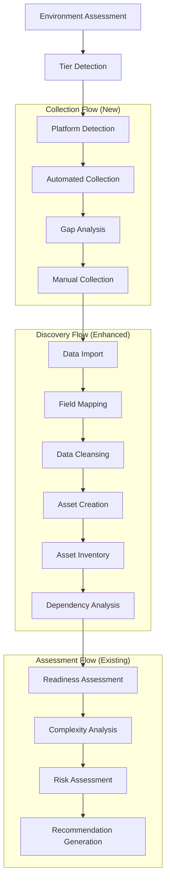
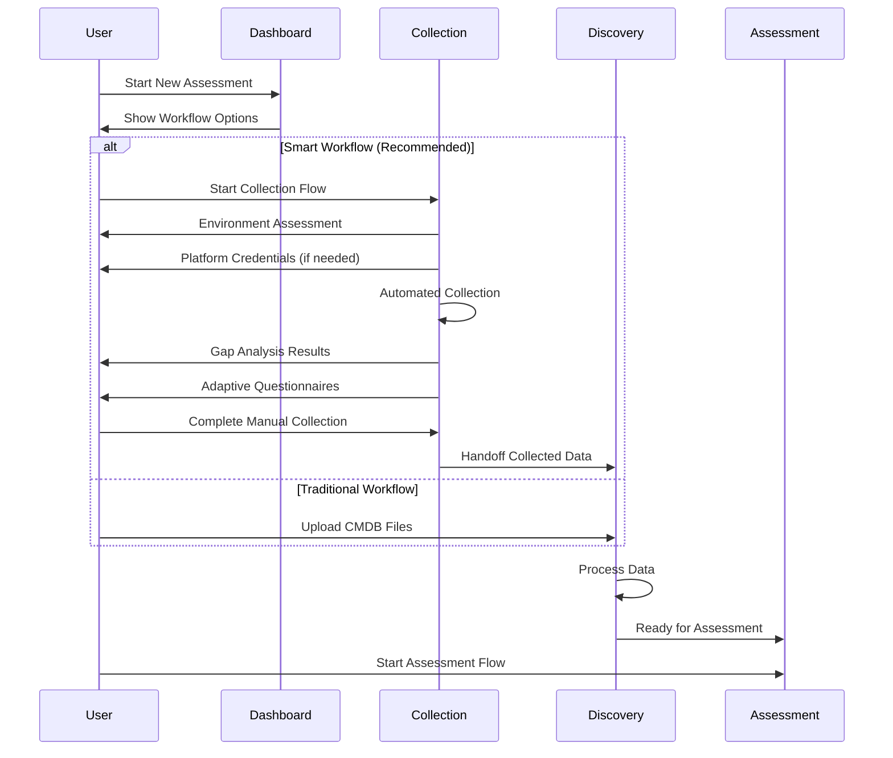

# Adaptive Data Collection System - Integrated Design Document

## Executive Summary

This document details the integration of the Adaptive Data Collection System (ADCS) into the existing Master Flow Orchestrator architecture. The design preserves the current proven patterns while extending capabilities through a new Collection Flow that seamlessly integrates with the existing Discovery flow pipeline.

## Table of Contents
1. [Integration Architecture Overview](#integration-architecture-overview)
2. [Master Flow Orchestrator Integration](#master-flow-orchestrator-integration)
3. [Collection Flow Design](#collection-flow-design)
4. [UI/UX Integration Strategy](#uiux-integration-strategy)
5. [Data Flow and State Management](#data-flow-and-state-management)
6. [API Design](#api-design)
7. [Database Schema Extensions](#database-schema-extensions)
8. [Implementation Roadmap](#implementation-roadmap)

## Integration Architecture Overview

### Architectural Decision: Collection Flow as Phase 0

The ADCS integrates as a **new Collection Flow** that serves as "Phase 0" before the existing Discovery flow, maintaining the proven Master Flow Orchestrator pattern while adding intelligent data collection capabilities.



### Key Integration Principles

1. **Preserve Existing Architecture**: No changes to proven Master Flow Orchestrator patterns
2. **Sequential Integration**: Collection Flow → Discovery Flow → Assessment Flow
3. **Graceful Fallback**: Traditional Discovery flow remains available for manual uploads
4. **Unified Experience**: Single navigation and status management
5. **Data Continuity**: Seamless handoff of collected data to Discovery processing

## Master Flow Orchestrator Integration

### Flow Type Registration

The Collection Flow registers as the 9th flow type in the existing registry:

```python
# /backend/app/services/flow_configs/collection_flow_config.py
def get_collection_flow_config() -> FlowTypeConfig:
    return FlowTypeConfig(
        flow_type="collection",
        display_name="Data Collection",
        description="Intelligent data collection with tiered automation",
        version="1.0.0",
        phases=[
            platform_detection_phase,
            automated_collection_phase,
            gap_analysis_phase,
            manual_collection_phase
        ],
        capabilities=FlowCapabilities(
            supports_pause_resume=True,
            supports_rollback=False,
            supports_iterations=True,
            supports_branching=True,  # For tier routing
            max_concurrent_instances=5,
            requires_engagement_context=True,
            supports_multi_tenant=True
        ),
        dependencies=["engagement_creation"],  # Can run standalone
        next_flow_suggestions=["discovery"],   # Suggests Discovery flow next
        metadata={
            "automation_tiers": ["tier_1", "tier_2", "tier_3", "tier_4"],
            "platform_support": ["aws", "azure", "gcp", "on_prem"],
            "integration_type": "pre_discovery",
            "data_output_format": "discovery_compatible"
        }
    )
```

### Flow Lifecycle Integration

```python
# Enhanced Master Flow Orchestrator - Collection Flow Support
class MasterFlowOrchestrator:
    def __init__(self):
        # Existing initialization
        super().__init__()
        
        # New: Collection Flow Integration
        self.collection_service = CollectionOrchestrationService()
        self.tier_detector = EnvironmentTierDetector()
        
    async def initiate_assessment_workflow(
        self, 
        engagement_id: UUID,
        collection_strategy: Optional[CollectionStrategy] = None
    ) -> AssessmentWorkflowResult:
        """
        Enhanced workflow that optionally starts with Collection Flow
        """
        workflow_result = AssessmentWorkflowResult()
        
        # Step 1: Assess if Collection Flow is beneficial
        if collection_strategy or await self._should_use_collection_flow(engagement_id):
            collection_result = await self.start_collection_flow(
                engagement_id=engagement_id,
                strategy=collection_strategy
            )
            workflow_result.collection_flow_id = collection_result.flow_id
            workflow_result.automation_tier = collection_result.automation_tier
            
            # Step 2: Start Discovery Flow with Collection data
            discovery_result = await self.start_discovery_flow(
                engagement_id=engagement_id,
                collection_data=collection_result.collected_data
            )
        else:
            # Fallback: Traditional Discovery Flow
            discovery_result = await self.start_discovery_flow(
                engagement_id=engagement_id
            )
        
        workflow_result.discovery_flow_id = discovery_result.flow_id
        return workflow_result

    async def _should_use_collection_flow(self, engagement_id: UUID) -> bool:
        """
        Determine if Collection Flow would be beneficial
        """
        engagement = await self.get_engagement(engagement_id)
        
        # Use Collection Flow if:
        # 1. No existing data imports
        # 2. Cloud environment credentials available
        # 3. User prefers automated collection
        # 4. Modern technology stack detected
        
        criteria = [
            not await self._has_existing_imports(engagement_id),
            await self._has_platform_credentials(engagement),
            engagement.preferences.get('prefer_automation', True),
            await self._has_modern_tech_indicators(engagement)
        ]
        
        return sum(criteria) >= 2  # Majority threshold
```

### Flow State Extensions

```python
# Extended Flow State for Collection Flow
collection_flow_state_schema = {
    "collection_metadata": {
        "automation_tier": str,  # tier_1, tier_2, tier_3, tier_4
        "detected_platforms": List[str],  # aws, azure, gcp, on_prem
        "available_adapters": Dict[str, AdapterCapabilities],
        "environment_profile": EnvironmentProfile,
        "collection_strategy": CollectionStrategy
    },
    "platform_detection": {
        "detection_results": Dict[str, PlatformDetectionResult],
        "confidence_scores": Dict[str, float],
        "recommended_adapters": List[str],
        "fallback_plan": FallbackStrategy
    },
    "automated_collection": {
        "adapter_results": Dict[str, CollectionResult],
        "data_quality_scores": Dict[str, float],
        "collection_coverage": float,
        "automation_effectiveness": float
    },
    "gap_analysis": {
        "identified_gaps": List[DataGap],
        "criticality_scores": Dict[str, float],
        "recommended_questions": List[AdaptiveQuestion],
        "confidence_impact": Dict[str, float]
    },
    "manual_collection": {
        "completed_questionnaires": List[CompletedQuestionnaire],
        "bulk_data_uploads": List[BulkDataUpload],
        "user_input_quality": float,
        "manual_effort_score": float
    },
    "output_preparation": {
        "discovery_input_data": DiscoveryInputData,
        "data_transformation_log": List[DataTransformation],
        "quality_validation_results": ValidationResults,
        "handoff_confidence": float
    }
}
```

## Collection Flow Design

### Phase 1: Platform Detection
**Duration**: 5-10 minutes
**Purpose**: Assess environment and determine optimal collection strategy

```python
platform_detection_phase = PhaseConfig(
    name="platform_detection",
    display_name="Platform Detection",
    description="Assess environment capabilities and determine collection strategy",
    required_inputs=["engagement_context"],
    optional_inputs=["platform_credentials", "user_preferences"],
    validators=["platform_validation", "credential_validation"],
    pre_handlers=["environment_preparation"],
    post_handlers=["tier_assignment"],
    crew_config={
        "crew_type": "platform_detection_crew",
        "crew_factory": "create_platform_detection_crew",
        "input_mapping": {
            "engagement_context": "state.engagement_context",
            "platform_credentials": "platform_credentials",
            "user_preferences": "user_preferences.collection_strategy"
        },
        "output_mapping": {
            "environment_profile": "crew_results.environment_assessment",
            "automation_tier": "crew_results.recommended_tier",
            "platform_capabilities": "crew_results.platform_analysis",
            "collection_strategy": "crew_results.optimal_strategy"
        },
        "execution_config": {
            "timeout_seconds": 300,  # 5 minutes
            "temperature": 0.1,
            "conservative_mode": True
        }
    },
    can_pause=True,
    can_skip=False,
    retry_config=RetryConfig(max_attempts=3),
    timeout_seconds=600  # 10 minutes max
)
```

### Phase 2: Automated Collection
**Duration**: 10-30 minutes (varies by tier)
**Purpose**: Execute platform-specific automated data collection

```python
automated_collection_phase = PhaseConfig(
    name="automated_collection",
    display_name="Automated Collection",
    description="Execute automated data collection using platform adapters",
    required_inputs=["environment_profile", "collection_strategy"],
    optional_inputs=["platform_credentials", "collection_scope"],
    validators=["adapter_validation", "data_quality_validation"],
    pre_handlers=["adapter_initialization"],
    post_handlers=["data_normalization"],
    crew_config={
        "crew_type": "collection_execution_crew",
        "crew_factory": "create_collection_execution_crew",
        "input_mapping": {
            "environment_profile": "state.environment_profile",
            "collection_strategy": "state.collection_strategy",
            "platform_credentials": "platform_credentials",
            "collection_scope": "collection_scope.target_resources"
        },
        "output_mapping": {
            "collected_data": "crew_results.normalized_data",
            "collection_coverage": "crew_results.coverage_metrics",
            "quality_scores": "crew_results.quality_assessment",
            "adapter_performance": "crew_results.adapter_metrics"
        },
        "execution_config": {
            "timeout_seconds": 900,  # 15 minutes
            "temperature": 0.0,  # Factual data collection
            "enable_parallel": True,  # Parallel adapter execution
            "conservative_mode": True
        }
    },
    can_pause=True,
    can_skip=True,  # Can skip to manual collection
    retry_config=RetryConfig(max_attempts=2),
    timeout_seconds=1800  # 30 minutes max
)
```

### Phase 3: Gap Analysis
**Duration**: 5-15 minutes
**Purpose**: Identify missing data and generate adaptive questionnaires

```python
gap_analysis_phase = PhaseConfig(
    name="gap_analysis",
    display_name="Gap Analysis",
    description="Identify data gaps and generate adaptive questionnaires",
    required_inputs=["collected_data", "assessment_requirements"],
    optional_inputs=["business_context", "compliance_requirements"],
    validators=["gap_validation", "questionnaire_validation"],
    pre_handlers=["gap_identification"],
    post_handlers=["questionnaire_optimization"],
    crew_config={
        "crew_type": "gap_analysis_crew",
        "crew_factory": "create_gap_analysis_crew",
        "input_mapping": {
            "collected_data": "state.collected_data",
            "assessment_requirements": "assessment_requirements.sixr_criteria",
            "business_context": "business_context",
            "compliance_requirements": "compliance_requirements"
        },
        "output_mapping": {
            "identified_gaps": "crew_results.critical_gaps",
            "adaptive_questionnaires": "crew_results.generated_questionnaires",
            "confidence_impact": "crew_results.confidence_analysis",
            "modal_sequence": "crew_results.ui_workflow"
        },
        "execution_config": {
            "timeout_seconds": 450,  # 7.5 minutes
            "temperature": 0.2,  # Some creativity for questionnaire generation
            "enable_memory": True,  # Learn from past questionnaires
            "conservative_mode": True
        }
    },
    can_pause=True,
    can_skip=False,
    retry_config=RetryConfig(max_attempts=3),
    timeout_seconds=900  # 15 minutes max
)
```

### Phase 4: Manual Collection
**Duration**: 10-60 minutes (user-dependent)
**Purpose**: Collect missing data through adaptive forms and questionnaires

```python
manual_collection_phase = PhaseConfig(
    name="manual_collection",
    display_name="Manual Collection",
    description="Collect missing data through adaptive forms and questionnaires",
    required_inputs=["adaptive_questionnaires"],
    optional_inputs=["bulk_upload_data", "user_input"],
    validators=["completeness_validation", "consistency_validation"],
    pre_handlers=["ui_preparation"],
    post_handlers=["data_integration"],
    crew_config={
        "crew_type": "manual_collection_crew",
        "crew_factory": "create_manual_collection_crew",
        "input_mapping": {
            "questionnaire_responses": "user_input.questionnaire_responses",
            "bulk_upload_data": "bulk_upload_data",
            "automated_data": "state.collected_data",
            "validation_rules": "assessment_requirements.validation_rules"
        },
        "output_mapping": {
            "integrated_data": "crew_results.complete_dataset",
            "data_quality_metrics": "crew_results.quality_scores",
            "user_effort_metrics": "crew_results.effort_analysis",
            "discovery_input": "crew_results.discovery_ready_data"
        },
        "execution_config": {
            "timeout_seconds": 1800,  # 30 minutes
            "temperature": 0.1,
            "enable_caching": True,
            "conservative_mode": True
        }
    },
    can_pause=True,
    can_skip=False,
    retry_config=RetryConfig(max_attempts=1),  # User-driven, minimal retry
    timeout_seconds=3600  # 60 minutes max
)
```

## UI/UX Integration Strategy

### Navigation Structure Enhancement

The ADCS integrates into the existing Discovery section with enhanced navigation:

```typescript
// Enhanced Navigation Structure
interface NavigationStructure {
  discovery: {
    label: "Discovery";
    path: "/discovery";
    children: [
      {
        label: "Collection"; // NEW
        path: "/discovery/collection";
        description: "Automated data collection";
        phases: [
          "Platform Detection",
          "Automated Collection", 
          "Gap Analysis",
          "Manual Collection"
        ];
      },
      {
        label: "Processing"; // ENHANCED (existing Discovery flow)
        path: "/discovery/processing";
        description: "Data processing and enrichment";
        phases: [
          "Data Import",
          "Field Mapping",
          "Data Cleansing",
          "Asset Creation",
          "Asset Inventory",
          "Dependency Analysis"
        ];
      },
      {
        label: "Dashboard"; // EXISTING
        path: "/discovery/dashboard";
        description: "Flow management and monitoring";
      }
    ];
  };
}
```

### Dashboard Integration

```typescript
// Enhanced Discovery Dashboard
interface DiscoveryDashboard {
  workflows: [
    {
      type: "guided_workflow";
      title: "Smart Discovery Workflow";
      description: "AI-guided data collection and processing";
      steps: [
        {
          id: "collection_flow";
          title: "Data Collection";
          status: "pending" | "running" | "completed";
          automation_tier?: "tier_1" | "tier_2" | "tier_3" | "tier_4";
          estimated_duration: "15-45 minutes";
        },
        {
          id: "discovery_flow";
          title: "Data Processing";
          status: "pending" | "running" | "completed";
          dependencies: ["collection_flow"];
          estimated_duration: "30-90 minutes";
        }
      ];
    },
    {
      type: "manual_workflow";
      title: "Traditional Discovery";
      description: "Upload and process existing data";
      fallback_from: "collection_flow";
    }
  ];
  
  active_flows: CollectionFlow[] | DiscoveryFlow[];
  quick_actions: QuickAction[];
}
```

### User Experience Flow



### Form Integration Design

```typescript
// Adaptive Form Component Integration
interface AdaptiveFormProps {
  collectionMode: 'individual' | 'bulk';
  automatedData?: CollectedData;
  missingFields: DataGap[];
  questionnaires: AdaptiveQuestionnaire[];
  
  // Integration with existing patterns
  engagementId: UUID;
  flowId: UUID;
  onComplete: (data: CompletedCollection) => void;
  onBulkToggle: (enabled: boolean) => void;
}

// Modal Sequence Component
interface ModalSequenceProps {
  gaps: DataGap[];
  confidence_threshold: number;
  onSequenceComplete: (responses: QuestionnaireResponses) => void;
  
  // Existing modal patterns
  modalConfig: ModalConfiguration;
  progressTracking: ProgressMetrics;
}
```

## Data Flow and State Management

### Enhanced State Schema

```sql
-- Extended Master Flow State for Collection Flow
ALTER TABLE crewai_flow_state_extensions 
ADD COLUMN collection_metadata JSONB,
ADD COLUMN automation_tier VARCHAR(20),
ADD COLUMN platform_adapters JSONB,
ADD COLUMN collection_quality_score DECIMAL(3,2);

-- Collection Flow Specific State Table
CREATE TABLE collection_flow_state (
    id UUID PRIMARY KEY,
    master_flow_id UUID REFERENCES crewai_flow_state_extensions(id),
    engagement_id UUID REFERENCES engagements(id),
    
    -- Platform Detection Results
    environment_profile JSONB,
    detected_platforms JSONB,
    automation_tier VARCHAR(20),
    
    -- Collection Results
    adapter_configurations JSONB,
    collected_data JSONB,
    collection_coverage DECIMAL(3,2),
    automation_effectiveness DECIMAL(3,2),
    
    -- Gap Analysis
    identified_gaps JSONB,
    adaptive_questionnaires JSONB,
    confidence_impact JSONB,
    
    -- Manual Collection
    questionnaire_responses JSONB,
    bulk_uploads JSONB,
    manual_effort_score DECIMAL(3,2),
    
    -- Output Preparation
    discovery_input_data JSONB,
    handoff_quality_score DECIMAL(3,2),
    
    -- Metadata
    created_at TIMESTAMP DEFAULT NOW(),
    updated_at TIMESTAMP DEFAULT NOW()
);
```

### Data Handoff Protocol

```python
class CollectionToDiscoveryHandoff:
    """Manages seamless data transition from Collection to Discovery Flow"""
    
    async def prepare_discovery_input(
        self, 
        collection_results: CollectionFlowResults
    ) -> DiscoveryFlowInput:
        """
        Transform Collection Flow results into Discovery Flow input format
        """
        return DiscoveryFlowInput(
            # Standard Discovery inputs
            data_imports=[self._create_virtual_import(collection_results)],
            raw_import_records=collection_results.normalized_data,
            
            # Enhanced with Collection metadata
            collection_metadata={
                "automation_tier": collection_results.automation_tier,
                "collection_coverage": collection_results.coverage_score,
                "data_quality_score": collection_results.quality_score,
                "platform_sources": collection_results.platform_sources
            },
            
            # Pre-populated field mappings from automated collection
            suggested_field_mappings=collection_results.field_mappings,
            
            # Quality indicators for Discovery processing
            data_confidence_scores=collection_results.confidence_scores
        )
    
    async def create_virtual_import(
        self, 
        collection_results: CollectionFlowResults
    ) -> DataImport:
        """
        Create virtual data import record for Discovery Flow compatibility
        """
        return DataImport(
            import_type="automated_collection",
            source_description=f"Automated collection via {collection_results.automation_tier}",
            total_records=len(collection_results.normalized_data),
            quality_score=collection_results.quality_score,
            metadata={
                "collection_method": "adaptive_automated",
                "platform_sources": collection_results.platform_sources,
                "automation_effectiveness": collection_results.automation_effectiveness
            }
        )
```

## API Design

### Enhanced Endpoints

```python
# Collection Flow API Endpoints
@router.post("/api/v1/collection-flows/start")
async def start_collection_flow(
    request: StartCollectionFlowRequest,
    current_user: User = Depends(get_current_user)
) -> CollectionFlowResponse:
    """Start new Collection Flow with environment assessment"""

@router.get("/api/v1/collection-flows/{flow_id}/tier-assessment")
async def get_tier_assessment(
    flow_id: UUID,
    current_user: User = Depends(get_current_user)
) -> TierAssessmentResponse:
    """Get automation tier assessment results"""

@router.post("/api/v1/collection-flows/{flow_id}/configure-adapters")
async def configure_platform_adapters(
    flow_id: UUID,
    config: AdapterConfiguration,
    current_user: User = Depends(get_current_user)
) -> AdapterConfigurationResponse:
    """Configure platform adapters for automated collection"""

@router.post("/api/v1/collection-flows/{flow_id}/execute-collection")
async def execute_automated_collection(
    flow_id: UUID,
    current_user: User = Depends(get_current_user)
) -> CollectionExecutionResponse:
    """Execute automated data collection phase"""

@router.get("/api/v1/collection-flows/{flow_id}/gaps")
async def get_data_gaps(
    flow_id: UUID,
    current_user: User = Depends(get_current_user)
) -> DataGapAnalysisResponse:
    """Get identified data gaps and adaptive questionnaires"""

@router.post("/api/v1/collection-flows/{flow_id}/manual-data")
async def submit_manual_collection_data(
    flow_id: UUID,
    data: ManualCollectionData,
    current_user: User = Depends(get_current_user)
) -> ManualCollectionResponse:
    """Submit manual collection data and questionnaire responses"""

@router.post("/api/v1/collection-flows/{flow_id}/handoff-to-discovery")
async def handoff_to_discovery_flow(
    flow_id: UUID,
    current_user: User = Depends(get_current_user)
) -> DiscoveryFlowHandoffResponse:
    """Complete Collection Flow and start Discovery Flow with collected data"""

# Enhanced Master Flow Orchestrator Endpoints
@router.post("/api/v1/master-flows/smart-workflow")
async def start_smart_assessment_workflow(
    request: SmartWorkflowRequest,
    current_user: User = Depends(get_current_user)
) -> SmartWorkflowResponse:
    """Start intelligent assessment workflow with Collection + Discovery + Assessment"""
```

### Request/Response Schemas

```python
class StartCollectionFlowRequest(BaseModel):
    engagement_id: UUID
    collection_preferences: Optional[CollectionPreferences] = None
    platform_credentials: Optional[Dict[str, PlatformCredentials]] = None
    automation_preference: Literal["maximum", "balanced", "minimal"] = "balanced"

class CollectionFlowResponse(BaseModel):
    flow_id: UUID
    status: FlowStatus
    automation_tier: AutomationTier
    estimated_duration: int  # minutes
    next_phase: str
    environment_profile: EnvironmentProfile

class SmartWorkflowRequest(BaseModel):
    engagement_id: UUID
    workflow_type: Literal["smart", "traditional"] = "smart"
    collection_strategy: Optional[CollectionStrategy] = None
    
class SmartWorkflowResponse(BaseModel):
    workflow_id: UUID
    collection_flow_id: Optional[UUID]
    discovery_flow_id: UUID
    estimated_total_duration: int  # minutes
    automation_benefits: AutomationBenefits
```

## Database Schema Extensions

### New Tables

```sql
-- Platform Adapter Configurations
CREATE TABLE platform_adapters (
    id UUID PRIMARY KEY DEFAULT gen_random_uuid(),
    engagement_id UUID REFERENCES engagements(id),
    platform_type VARCHAR(50) NOT NULL, -- aws, azure, gcp, on_prem
    adapter_config JSONB NOT NULL,
    credentials_ref UUID, -- Reference to encrypted credentials
    capabilities JSONB,
    status VARCHAR(20) DEFAULT 'inactive', -- inactive, active, error
    last_tested_at TIMESTAMP,
    created_at TIMESTAMP DEFAULT NOW(),
    updated_at TIMESTAMP DEFAULT NOW()
);

-- Collection Sessions
CREATE TABLE collection_sessions (
    id UUID PRIMARY KEY DEFAULT gen_random_uuid(),
    master_flow_id UUID REFERENCES crewai_flow_state_extensions(id),
    engagement_id UUID REFERENCES engagements(id),
    automation_tier VARCHAR(20) NOT NULL,
    collection_strategy JSONB,
    environment_profile JSONB,
    status VARCHAR(20) DEFAULT 'pending',
    started_at TIMESTAMP,
    completed_at TIMESTAMP,
    created_at TIMESTAMP DEFAULT NOW()
);

-- Collected Data Inventory
CREATE TABLE collected_data_inventory (
    id UUID PRIMARY KEY DEFAULT gen_random_uuid(),
    collection_session_id UUID REFERENCES collection_sessions(id),
    data_source VARCHAR(100), -- adapter_name or 'manual'
    data_type VARCHAR(50), -- infrastructure, applications, dependencies
    raw_data JSONB,
    normalized_data JSONB,
    quality_score DECIMAL(3,2),
    confidence_score DECIMAL(3,2),
    collected_at TIMESTAMP DEFAULT NOW()
);

-- Data Gaps and Questionnaires
CREATE TABLE collection_data_gaps (
    id UUID PRIMARY KEY DEFAULT gen_random_uuid(),
    collection_session_id UUID REFERENCES collection_sessions(id),
    gap_category VARCHAR(50), -- technical_debt, business_logic, operational, stakeholder
    missing_fields JSONB,
    impact_on_confidence DECIMAL(3,2),
    priority_score DECIMAL(3,2),
    questionnaire_generated JSONB,
    resolution_status VARCHAR(20) DEFAULT 'pending',
    resolved_at TIMESTAMP,
    created_at TIMESTAMP DEFAULT NOW()
);

-- Questionnaire Responses
CREATE TABLE collection_questionnaire_responses (
    id UUID PRIMARY KEY DEFAULT gen_random_uuid(),
    collection_session_id UUID REFERENCES collection_sessions(id),
    gap_id UUID REFERENCES collection_data_gaps(id),
    questionnaire_id UUID,
    responses JSONB,
    response_quality_score DECIMAL(3,2),
    submitted_at TIMESTAMP DEFAULT NOW()
);
```

### Extended Existing Tables

```sql
-- Enhance Master Flow State
ALTER TABLE crewai_flow_state_extensions 
ADD COLUMN collection_flow_id UUID REFERENCES collection_sessions(id),
ADD COLUMN automation_tier VARCHAR(20),
ADD COLUMN collection_quality_score DECIMAL(3,2),
ADD COLUMN data_collection_metadata JSONB;

-- Enhance Discovery Flow State to Track Collection Source
ALTER TABLE unified_discovery_flow_state
ADD COLUMN collection_source_flow_id UUID REFERENCES collection_sessions(id),
ADD COLUMN pre_populated_data JSONB,
ADD COLUMN automation_enhanced BOOLEAN DEFAULT FALSE;

-- Create indexes for performance
CREATE INDEX idx_collection_sessions_engagement ON collection_sessions(engagement_id);
CREATE INDEX idx_collection_sessions_status ON collection_sessions(status);
CREATE INDEX idx_collected_data_inventory_session ON collected_data_inventory(collection_session_id);
CREATE INDEX idx_collection_gaps_session ON collection_data_gaps(collection_session_id);
CREATE INDEX idx_questionnaire_responses_session ON collection_questionnaire_responses(collection_session_id);
```

## Implementation Roadmap

### Phase 1: Foundation (Weeks 1-4)
**MVP Collection Flow Implementation**

**Week 1-2: Core Infrastructure**
- [ ] Collection Flow configuration and registration with Master Flow Orchestrator
- [ ] Database schema creation and migration scripts
- [ ] Basic platform detection and tier assessment logic
- [ ] Collection session management service

**Week 3-4: Basic Automation**
- [ ] Platform adapter framework (AWS, Azure, GCP)
- [ ] Simple automated collection for Tier 1 environments
- [ ] Basic gap analysis and confidence scoring
- [ ] Collection to Discovery handoff protocol

### Phase 2: Enhanced Collection (Weeks 5-8)
**Full Automation and Intelligence**

**Week 5-6: Advanced Adapters**
- [ ] Complete platform adapter implementations
- [ ] Credential management and security framework
- [ ] Parallel collection execution and optimization
- [ ] Real-time progress tracking and monitoring

**Week 7-8: AI-Powered Analysis**
- [ ] Intelligent gap analysis with CrewAI integration
- [ ] Adaptive questionnaire generation
- [ ] Dynamic modal sequence implementation
- [ ] Quality scoring and confidence assessment

### Phase 3: User Experience (Weeks 9-12)
**UI Integration and Workflows**

**Week 9-10: Dashboard Integration**
- [ ] Enhanced Discovery dashboard with Collection workflow
- [ ] Smart workflow recommendation engine
- [ ] Collection Flow monitoring and status pages
- [ ] Seamless navigation between Collection and Discovery

**Week 11-12: Advanced Forms**
- [ ] Adaptive form interface with bulk toggle
- [ ] Modal sequence implementation with progressive disclosure
- [ ] Bulk data operations and template management
- [ ] User experience optimization

### Phase 4: Production Ready (Weeks 13-16)
**Testing, Security, and Deployment**

**Week 13-14: Quality Assurance**
- [ ] Comprehensive unit and integration testing
- [ ] End-to-end workflow testing
- [ ] Performance testing with large datasets
- [ ] Security audit and penetration testing

**Week 15-16: Deployment**
- [ ] Production deployment automation
- [ ] Monitoring and alerting setup
- [ ] Documentation and training materials
- [ ] Beta testing with select clients

### Success Metrics

**Technical Metrics:**
- [ ] Collection Flow successfully registers with Master Flow Orchestrator
- [ ] 90%+ automation rate for Tier 1 environments
- [ ] <10 second response time for tier detection
- [ ] 95%+ data quality scores for automated collection

**User Experience Metrics:**
- [ ] <5 clicks to start Collection Flow from dashboard
- [ ] Seamless handoff to Discovery Flow with no data loss
- [ ] <30 seconds for adaptive questionnaire generation
- [ ] 80%+ user satisfaction with collection interface

**Business Metrics:**
- [ ] 60%+ reduction in manual data entry time
- [ ] 85%+ confidence scores for 6R recommendations
- [ ] Support for 4 automation tiers across client environments
- [ ] 100% compatibility with existing Discovery and Assessment flows

## Conclusion

This integrated design preserves the proven Master Flow Orchestrator architecture while adding sophisticated automated data collection capabilities. The Collection Flow operates as a natural "Phase 0" that feeds into the existing Discovery flow, creating a seamless user experience that maximizes automation while maintaining fallback capabilities for all client environments.

The design ensures:
- **Architectural Consistency**: Follows existing proven patterns
- **Zero Disruption**: Existing flows continue unchanged
- **Progressive Enhancement**: Collection Flow enhances rather than replaces
- **User Choice**: Smart workflow or traditional workflow options
- **Scalable Foundation**: Ready for future enhancements and platform additions

This approach delivers immediate value through automation while building a foundation for long-term platform evolution.