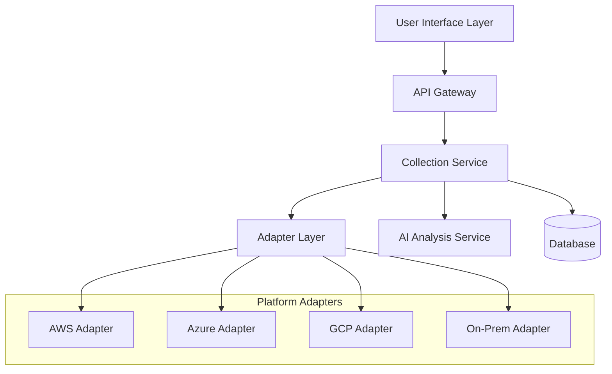

# Adaptive Data Collection System - Technical Design Document

## Table of Contents
1. [Architecture Overview](#architecture-overview)
2. [System Components](#system-components)
3. [Data Collection Tiers](#data-collection-tiers)
4. [Platform Integration](#platform-integration)
5. [User Interface Design](#user-interface-design)
6. [API Specifications](#api-specifications)
7. [Database Schema](#database-schema)
8. [Security Architecture](#security-architecture)
9. [Implementation Plan](#implementation-plan)
10. [Testing Strategy](#testing-strategy)

## Architecture Overview

### High-Level Architecture



### Core Principles
- **Platform Agnostic**: Universal adapter pattern for all cloud platforms
- **Graceful Degradation**: Seamless fallback from automation to manual collection
- **Progressive Enhancement**: Iterative data refinement without blocking workflows
- **Security First**: End-to-end encryption and role-based access controls
- **Scalable Architecture**: Horizontal scaling for large portfolio processing

## System Components

### 1. Collection Orchestrator Service
**Responsibility**: Coordinates data collection workflow and tier detection
**Deployment**: Extended `migration_backend` container with new service modules
**Key Functions**:
- Environment fingerprinting and capability assessment
- Automation tier determination and adapter selection
- Collection workflow orchestration and progress tracking
- Gap analysis and fallback trigger management

**Containerization Strategy**:
```dockerfile
# Extend existing migration_backend container
FROM migration_backend:latest

# Add Collection Service modules
COPY collection_services/ /app/services/collection/
COPY adapters/ /app/adapters/

# Collection-specific dependencies
RUN pip install -r requirements-collection.txt

# Service discovery configuration
ENV COLLECTION_SERVICE_ENABLED=true
ENV DEPLOYMENT_MODE=saas

# Health check for collection services
HEALTHCHECK --interval=30s --timeout=10s --retries=3 \
  CMD curl -f http://localhost:8000/api/v1/collection-flows/health || exit 1
```

```typescript
interface CollectionOrchestrator {
  assessEnvironment(): EnvironmentProfile;
  selectTier(profile: EnvironmentProfile): CollectionTier;
  orchestrateCollection(tier: CollectionTier): CollectionResult;
  analyzeGaps(result: CollectionResult): GapAnalysis;
  triggerFallback(gaps: GapAnalysis): FallbackWorkflow;
}
```

### 2. Universal Adapter Layer
**Responsibility**: Platform-specific data collection and normalization
**Deployment**: Modular adapters within `migration_backend` container
**Key Functions**:
- Cloud platform API integration and authentication
- Data extraction and transformation to common schema
- Error handling and retry logic
- Rate limiting and throttling management

**Docker Compose Service Definition**:
```yaml
# docker-compose.yml extension
services:
  migration_backend:
    build:
      context: ./backend
      dockerfile: Dockerfile.collection
    environment:
      - COLLECTION_SERVICE_ENABLED=true
      - AWS_ADAPTER_ENABLED=${AWS_ADAPTER_ENABLED:-false}
      - AZURE_ADAPTER_ENABLED=${AZURE_ADAPTER_ENABLED:-false}
      - GCP_ADAPTER_ENABLED=${GCP_ADAPTER_ENABLED:-false}
      - DEPLOYMENT_MODE=${DEPLOYMENT_MODE:-saas}
    volumes:
      - adapter_configs:/app/adapters/config
    depends_on:
      - postgres
      - redis

  # Optional: Separate adapter service for high-scale environments
  adapter_service:
    image: migration_backend:latest
    command: ["python", "-m", "app.services.collection.adapter_service"]
    environment:
      - SERVICE_MODE=adapter_only
    profiles:
      - high_scale
```

```typescript
interface UniversalAdapter {
  platform: 'aws' | 'azure' | 'gcp' | 'on-prem' | 'hybrid';
  capabilities: AutomationCapability[];
  
  authenticate(credentials: PlatformCredentials): AuthResult;
  collectData(scope: CollectionScope): Promise<CollectionData>;
  validatePermissions(): PermissionCheck;
  getCapabilities(): AutomationCapability[];
}
```

### 3. AI Analysis Engine
**Responsibility**: Intelligent gap detection and questionnaire generation  
**Deployment**: Leverages existing CrewAI infrastructure within `migration_backend`
**Key Functions**:
- Asset characterization and pattern recognition
- Missing data identification and prioritization
- Dynamic questionnaire generation and adaptation
- Confidence scoring and recommendation enhancement

**CrewAI Agent Integration Strategy**:
```python
# Leverage existing specialist agents for Collection Flow
class CollectionFlowCrews:
    def __init__(self):
        # Reuse existing specialist agents
        self.asset_intelligence_agent = AssetIntelligenceAgent()  # Existing
        self.pattern_recognition_agent = PatternRecognitionAgent()  # Existing
        self.data_validation_expert = DataValidationExpert()  # Existing
        
        # New Collection-specific agents
        self.platform_detection_agent = PlatformDetectionAgent()
        self.gap_analysis_agent = GapAnalysisAgent()
        self.questionnaire_generation_agent = QuestionnaireGenerationAgent()
    
    def create_platform_detection_crew(self) -> Crew:
        """Compose crew using existing + new agents"""
        return Crew(
            agents=[
                self.asset_intelligence_agent,  # Reuse for environment analysis
                self.pattern_recognition_agent, # Reuse for capability pattern detection
                self.platform_detection_agent   # New for platform-specific detection
            ],
            tasks=[
                DetectCloudPlatformsTask(),
                AssessAutomationCapabilitiesTask(),
                RecommendTierStrategyTask()
            ]
        )
    
    def create_gap_analysis_crew(self) -> Crew:
        """Leverage existing intelligence for gap detection"""
        return Crew(
            agents=[
                self.asset_intelligence_agent,    # Existing intelligence
                self.data_validation_expert,      # Existing validation expertise
                self.gap_analysis_agent           # New for gap-specific analysis
            ],
            tasks=[
                AnalyzeDataCompletenessTask(),
                IdentifyCriticalGapsTask(),
                PrioritizeGapsByBusinessImpactTask()
            ]
        )
```

**Agent Specialization Matrix**:
| Agent | Collection Use | Existing Role | New Capabilities |
|-------|----------------|---------------|------------------|
| Asset Intelligence Agent | Environment Analysis | Asset classification | Platform capability assessment |
| Pattern Recognition Agent | Platform Detection | Dependency patterns | Cloud service patterns |
| Data Validation Expert | Quality Assessment | Data validation | Collection quality scoring |
| Platform Detection Agent | NEW | N/A | Cloud platform identification |
| Gap Analysis Agent | NEW | N/A | Missing data identification |
| Questionnaire Generation Agent | NEW | N/A | Adaptive question generation |

```typescript
interface AIAnalysisEngine {
  analyzeAsset(asset: AssetData): AssetCharacterization;
  detectGaps(asset: AssetData, requirements: AssessmentRequirements): DataGap[];
  generateQuestions(gaps: DataGap[]): DynamicQuestionnaire;
  scoreConfidence(data: AssetData): ConfidenceScore;
}
```

### 4. Fallback Management System
**Responsibility**: Manual data collection workflow management
**Key Functions**:
- Form generation and validation
- Bulk data processing and template management
- Modal sequence orchestration
- Progress tracking and completion verification

```typescript
interface FallbackManager {
  generateForm(gaps: DataGap[]): AdaptiveForm;
  processBulkData(data: BulkUpload): ValidationResult;
  orchestrateModals(questions: DynamicQuestionnaire): ModalSequence;
  trackProgress(session: CollectionSession): ProgressMetrics;
}
```

## Data Collection Tiers

### Tier 1: Full Automation (Modern Cloud-Native)
**Target**: 90% automation for modern cloud environments
**Requirements**:
- Full API access to cloud platforms
- Modern monitoring and observability tools
- CI/CD pipeline integration
- Container orchestration platforms

**Collection Methods**:
```typescript
interface Tier1Collection {
  cloudPlatformAPIs: {
    aws: {
      services: ['CloudWatch', 'Config', 'Systems Manager', 'Well-Architected Tool'];
      permissions: ['ReadOnly', 'DescribeResources'];
    };
    azure: {
      services: ['Monitor', 'Resource Graph', 'Advisor', 'Security Center'];
      permissions: ['Reader', 'Monitoring Reader'];
    };
    gcp: {
      services: ['Cloud Monitoring', 'Asset Inventory', 'Security Center'];
      permissions: ['Viewer', 'Monitoring Viewer'];
    };
  };
  
  codeRepositories: {
    platforms: ['GitHub', 'GitLab', 'Azure DevOps'];
    analysis: ['Code Quality', 'Security Scanning', 'Dependency Analysis'];
  };
  
  cicdPipelines: {
    platforms: ['Jenkins', 'GitHub Actions', 'Azure Pipelines'];
    metrics: ['Build Success Rate', 'Deployment Frequency', 'Lead Time'];
  };
}
```

### Tier 2: Hybrid Automation (Mixed Environments)
**Target**: 70% automation with strategic manual input
**Requirements**:
- Partial API access or file upload capabilities
- Mixed modern/legacy tooling
- Some monitoring infrastructure
- Limited integration opportunities

**Collection Methods**:
```typescript
interface Tier2Collection {
  fileUploads: {
    supportedFormats: ['CSV', 'JSON', 'XML', 'PDF', 'YAML'];
    processors: ['Config Parser', 'Log Analyzer', 'Documentation OCR'];
  };
  
  networkScanning: {
    techniques: ['Port Scanning', 'Service Discovery', 'Dependency Mapping'];
    tools: ['Nmap', 'Custom Scripts', 'SNMP Queries'];
  };
  
  guidedWorkflows: {
    questionnaires: 'Adaptive and Context-Aware';
    interviews: 'AI-Assisted SME Capture';
    documentation: 'Intelligent Document Mining';
  };
}
```

### Tier 3: Minimal Automation (Restricted Access)
**Target**: 40% automation with enhanced manual workflows
**Requirements**:
- Basic infrastructure access
- Security restrictions on API usage
- Limited external connectivity
- Compliance and audit requirements

**Collection Methods**:
```typescript
interface Tier3Collection {
  onPremiseDeployment: {
    architecture: 'Standalone Discovery/Assess/Plan Modules';
    security: 'Air-Gapped with Encrypted Export';
    integration: 'Local System APIs Only';
  };
  
  manualProcesses: {
    structuredForms: 'Progressive Disclosure Design';
    bulkImport: 'Template-Based Data Entry';
    validation: 'AI-Powered Consistency Checking';
  };
}
```

### Tier 4: Legacy Focus (Archaeological Approach)
**Target**: 10% automation with comprehensive manual support
**Requirements**:
- Legacy applications with minimal modern tooling
- Limited or no documentation
- Tribal knowledge dependencies
- Archaeological discovery needs

**Collection Methods**:
```typescript
interface Tier4Collection {
  systemArchaeology: {
    techniques: ['Process Analysis', 'Config File Mining', 'Registry Scanning'];
    tools: ['Custom Scripts', 'System Profilers', 'Dependency Trackers'];
  };
  
  knowledgeCapture: {
    interviews: 'Structured Expert Interviews';
    documentation: 'OCR and Document Analysis';
    reverseEngineering: 'Safe Application Profiling';
  };
}
```

## Platform Integration

### AWS Integration Architecture
```typescript
interface AWSAdapter {
  services: {
    discovery: 'Application Discovery Service';
    config: 'AWS Config';
    cloudwatch: 'CloudWatch Metrics and Logs';
    systemsManager: 'Systems Manager Inventory';
    wellArchitected: 'Well-Architected Tool';
  };
  
  permissions: {
    required: ['ec2:Describe*', 'config:Get*', 'cloudwatch:Get*'];
    optional: ['application-discovery:Describe*', 'wellarchitected:Get*'];
  };
  
  dataMapping: {
    infrastructure: 'EC2 Instances → Asset Model';
    applications: 'ECS/EKS Services → Application Inventory';
    dependencies: 'VPC Flow Logs → Dependency Graph';
    performance: 'CloudWatch Metrics → Performance Baseline';
  };
}
```

### Azure Integration Architecture
```typescript
interface AzureAdapter {
  services: {
    resourceGraph: 'Azure Resource Graph';
    monitor: 'Azure Monitor';
    advisor: 'Azure Advisor';
    securityCenter: 'Azure Security Center';
    migrate: 'Azure Migrate';
  };
  
  permissions: {
    required: ['Reader', 'Monitoring Reader'];
    optional: ['Security Reader', 'Azure Service Map Reader'];
  };
  
  dataMapping: {
    infrastructure: 'Virtual Machines → Asset Model';
    applications: 'App Services → Application Inventory';
    dependencies: 'Service Map → Dependency Graph';
    recommendations: 'Advisor → Migration Insights';
  };
}
```

### GCP Integration Architecture
```typescript
interface GCPAdapter {
  services: {
    assetInventory: 'Cloud Asset Inventory';
    monitoring: 'Cloud Monitoring';
    securityCenter: 'Security Command Center';
    recommender: 'Recommender API';
  };
  
  permissions: {
    required: ['Viewer', 'Monitoring Viewer'];
    optional: ['Security Center Admin Viewer'];
  };
  
  dataMapping: {
    infrastructure: 'Compute Instances → Asset Model';
    applications: 'App Engine/GKE → Application Inventory';
    dependencies: 'VPC Flow Logs → Dependency Graph';
    security: 'Security Center → Risk Assessment';
  };
}
```

## User Interface Design

### Form Architecture
```typescript
interface AdaptiveForm {
  layout: 'Single Form with Bulk Toggle';
  sections: FormSection[];
  bulkMode: BulkInterface;
  validation: RealTimeValidation;
  progression: ProgressTracking;
}

interface FormSection {
  id: string;
  title: string;
  fields: FormField[];
  visibility: VisibilityRule[];
  required: boolean;
  automation: AutoPopulationRule[];
}

interface BulkInterface {
  layout: 'Spreadsheet Grid';
  operations: ['Copy Down', 'Apply to Selection', 'Template Fill'];
  validation: 'Real-time with Error Highlighting';
  progress: 'Completion Percentage per Application';
}
```

### Modal Sequence Design
```typescript
interface ModalSequence {
  trigger: {
    condition: 'Confidence Score < 0.85';
    timing: 'Post Form Submission';
  };
  
  sizing: {
    algorithm: 'Dynamic based on question count';
    thresholds: {
      single: 'questions <= 6';
      dual: 'questions 7-12';
      triple: 'questions 13+';
    };
  };
  
  progression: {
    flow: 'Technical → Business → Operational';
    navigation: 'Linear with progress indicators';
    completion: 'Mandatory for 6R unlock';
  };
}
```

### Responsive Design Patterns
```typescript
interface ResponsiveDesign {
  desktop: {
    layout: 'Full form with side panels';
    bulkMode: 'Spreadsheet with frozen headers';
    modals: 'Centered with backdrop';
  };
  
  tablet: {
    layout: 'Tabbed interface';
    bulkMode: 'Horizontal scroll grid';
    modals: 'Full-screen overlay';
  };
  
  mobile: {
    layout: 'Accordion sections';
    bulkMode: 'Card-based entry';
    modals: 'Bottom sheet presentation';
  };
}
```

## API Specifications

### Collection API Endpoints
```typescript
// Start collection workflow
POST /api/v3/collection/start
{
  "engagement_id": "uuid",
  "scope": {
    "applications": ["app1", "app2"],
    "environments": ["prod", "staging"]
  },
  "preferences": {
    "automation_level": "maximum",
    "data_sensitivity": "confidential"
  }
}

// Get collection status
GET /api/v3/collection/{collection_id}/status
Response: {
  "collection_id": "uuid",
  "status": "in_progress",
  "tier": "tier_1",
  "automation_rate": 0.85,
  "progress": {
    "total_assets": 100,
    "completed": 75,
    "failed": 5,
    "pending": 20
  }
}

// Submit manual data
POST /api/v3/collection/{collection_id}/manual-data
{
  "asset_id": "uuid",
  "data": {
    "technical_stack": ["java", "spring", "oracle"],
    "architecture_pattern": "monolith",
    "business_criticality": 4
  },
  "bulk_operation": {
    "apply_to": ["similar_apps"],
    "template_id": "web_application"
  }
}

// Trigger gap analysis
POST /api/v3/collection/{collection_id}/analyze-gaps
Response: {
  "gaps": [
    {
      "asset_id": "uuid",
      "missing_fields": ["custom_logic_complexity", "integration_patterns"],
      "impact_on_confidence": 0.15,
      "questions": [...]
    }
  ],
  "modal_sequence": {...}
}
```

### Platform Adapter APIs
```typescript
// Register platform adapter
POST /api/v3/adapters/register
{
  "platform": "aws",
  "credentials": {
    "access_key": "encrypted",
    "secret_key": "encrypted",
    "region": "us-east-1"
  },
  "scope": {
    "accounts": ["123456789"],
    "regions": ["us-east-1", "us-west-2"]
  }
}

// Test adapter connection
GET /api/v3/adapters/{adapter_id}/test
Response: {
  "status": "connected",
  "capabilities": ["infrastructure", "applications", "monitoring"],
  "limitations": ["no_code_access", "rate_limited"],
  "estimated_automation": 0.78
}

// Execute adapter collection
POST /api/v3/adapters/{adapter_id}/collect
{
  "scope": "all_resources",
  "filters": {
    "resource_types": ["instances", "databases", "applications"],
    "tags": {"Environment": "production"}
  }
}
```

## Database Schema

### Collection Management Tables
```sql
-- Collection Flows
CREATE TABLE collection_flows (
    id UUID PRIMARY KEY,
    engagement_id UUID REFERENCES engagements(id),
    status VARCHAR(30) NOT NULL, -- pending, platform_detection, automated_collection, gap_analysis, manual_collection, completed, failed
    tier VARCHAR(10) NOT NULL, -- tier_1, tier_2, tier_3, tier_4
    automation_rate DECIMAL(3,2),
    confidence_score DECIMAL(3,2),
    started_at TIMESTAMP,
    completed_at TIMESTAMP,
    metadata JSONB
);

-- Platform Adapters
CREATE TABLE platform_adapters (
    id UUID PRIMARY KEY,
    engagement_id UUID REFERENCES engagements(id),
    platform VARCHAR(20) NOT NULL, -- aws, azure, gcp, on_prem
    credentials JSONB, -- encrypted
    capabilities JSONB,
    status VARCHAR(20), -- active, inactive, error
    last_sync TIMESTAMP,
    configuration JSONB
);

-- Collection Results
CREATE TABLE collection_results (
    id UUID PRIMARY KEY,
    collection_flow_id UUID REFERENCES collection_flows(id),
    asset_id UUID REFERENCES assets(id),
    adapter_id UUID REFERENCES platform_adapters(id),
    automation_level VARCHAR(20), -- full, partial, manual, failed
    confidence_score DECIMAL(3,2),
    raw_data JSONB,
    processed_data JSONB,
    validation_status VARCHAR(20),
    collected_at TIMESTAMP
);
```

### Gap Analysis Tables
```sql
-- Data Gaps
CREATE TABLE collection_data_gaps (
    id UUID PRIMARY KEY,
    collection_flow_id UUID REFERENCES collection_flows(id),
    asset_id UUID REFERENCES assets(id),
    gap_type VARCHAR(50), -- technical_debt, business_logic, operational, stakeholder
    missing_attributes JSONB, -- Array of missing critical attributes (1-22)
    impact_score DECIMAL(3,2),
    priority VARCHAR(10), -- high, medium, low
    questionnaire_id UUID REFERENCES adaptive_questionnaires(id),
    resolution_status VARCHAR(20), -- pending, in_progress, resolved
    created_at TIMESTAMP
);

-- Normalized Questionnaire System
CREATE TABLE adaptive_questionnaires (
    id UUID PRIMARY KEY,
    name VARCHAR(255) NOT NULL,
    description TEXT,
    version VARCHAR(20) NOT NULL,
    target_gaps JSONB, -- Array of gap types this questionnaire addresses
    questions JSONB, -- Canonical question definitions
    conditional_logic JSONB, -- Adaptive branching rules
    validation_rules JSONB,
    created_at TIMESTAMP,
    updated_at TIMESTAMP,
    UNIQUE(name, version)
);

-- Questionnaire Response Sessions
CREATE TABLE collection_questionnaire_responses (
    id UUID PRIMARY KEY,
    collection_flow_id UUID REFERENCES collection_flows(id),
    gap_id UUID REFERENCES collection_data_gaps(id),
    questionnaire_id UUID REFERENCES adaptive_questionnaires(id),
    asset_id UUID REFERENCES assets(id),
    responses JSONB, -- User answers mapped to question IDs
    completion_status VARCHAR(20), -- pending, in_progress, completed, abandoned
    started_at TIMESTAMP,
    completed_at TIMESTAMP,
    metadata JSONB -- Session-specific data like UI state, partial progress
);
```

### Enhanced Asset Schema
```sql
-- Extended Asset Model
ALTER TABLE assets ADD COLUMN IF NOT EXISTS collection_metadata JSONB;
ALTER TABLE assets ADD COLUMN IF NOT EXISTS automation_source VARCHAR(50);
ALTER TABLE assets ADD COLUMN IF NOT EXISTS data_completeness_score DECIMAL(3,2);
ALTER TABLE assets ADD COLUMN IF NOT EXISTS last_collection_update TIMESTAMP;

-- Collection Quality Metrics
CREATE TABLE collection_quality_metrics (
    id UUID PRIMARY KEY,
    asset_id UUID REFERENCES assets(id),
    collection_session_id UUID REFERENCES collection_sessions(id),
    completeness_score DECIMAL(3,2),
    accuracy_score DECIMAL(3,2),
    consistency_score DECIMAL(3,2),
    timeliness_score DECIMAL(3,2),
    overall_quality DECIMAL(3,2),
    calculated_at TIMESTAMP
);
```

## Security Architecture

### Enhanced Credential Management System

**Critical Security Requirement**: Platform credentials (AWS, Azure, GCP) require enterprise-grade security due to their high-privilege nature and potential impact.

```typescript
interface CredentialSecurityFramework {
  storage: {
    // SaaS Deployment
    saas: {
      primary: 'HashiCorp Vault Cloud' | 'AWS Secrets Manager' | 'Azure Key Vault';
      encryption: 'AES-256-GCM with customer-managed keys';
      access: 'IAM-based with least-privilege principles';
    };
    
    // On-Premises Deployment  
    onPremises: {
      primary: 'Local HashiCorp Vault instance';
      encryption: 'AES-256-GCM with customer-provided keys';
      access: 'Local RBAC with audit logging';
    };
  };
  
  credentialLifecycle: {
    rotation: {
      automatic: 'Every 90 days';
      emergency: 'Within 5 minutes of compromise detection';
      validation: 'Pre-rotation credential testing';
    };
    
    access: {
      retrieval: 'Just-in-time credential access';
      caching: 'Maximum 15 minutes in memory';
      logging: 'All access logged with correlation IDs';
    };
  };
}
```

### Credential Storage Architecture

```python
# Credential Management Service Implementation
class SecureCredentialManager:
    def __init__(self, deployment_mode: DeploymentMode):
        if deployment_mode == DeploymentMode.SAAS:
            self.vault = CloudSecretsManager()
        else:
            self.vault = LocalVaultManager()
    
    async def store_credential(
        self, 
        platform: Platform, 
        credential: PlatformCredential,
        tenant_id: UUID
    ) -> CredentialReference:
        """Store credential with tenant isolation and encryption"""
        
        # Encrypt credential with tenant-specific key
        encrypted_credential = await self.encrypt_with_tenant_key(
            credential, tenant_id
        )
        
        # Store in vault with metadata
        reference = await self.vault.store(
            path=f"tenants/{tenant_id}/platforms/{platform}",
            credential=encrypted_credential,
            metadata={
                'platform': platform,
                'created_at': datetime.utcnow(),
                'rotation_schedule': '90d',
                'access_policy': 'collection_service_only'
            }
        )
        
        # Log credential storage (no sensitive data)
        await self.audit_log.log_credential_event(
            event='credential_stored',
            tenant_id=tenant_id,
            platform=platform,
            reference=reference.id
        )
        
        return reference

    async def retrieve_credential(
        self, 
        reference: CredentialReference,
        requesting_service: str,
        tenant_id: UUID
    ) -> PlatformCredential:
        """Retrieve credential with access validation"""
        
        # Validate service authorization
        await self.validate_service_access(requesting_service, reference)
        
        # Retrieve encrypted credential
        encrypted_credential = await self.vault.retrieve(reference.path)
        
        # Decrypt with tenant-specific key
        credential = await self.decrypt_with_tenant_key(
            encrypted_credential, tenant_id
        )
        
        # Log access (no sensitive data)
        await self.audit_log.log_credential_event(
            event='credential_accessed',
            tenant_id=tenant_id,
            service=requesting_service,
            reference=reference.id
        )
        
        # Schedule credential cleanup from memory
        asyncio.create_task(
            self.cleanup_credential_from_memory(credential, delay=900)  # 15 min
        )
        
        return credential
```

### Authentication and Authorization
```typescript
interface SecurityFramework {
  authentication: {
    methods: ['SAML', 'OAuth2', 'API Keys'];
    mfa: 'Required for sensitive operations';
    sessionManagement: 'JWT with refresh tokens';
  };
  
  authorization: {
    model: 'Role-Based Access Control (RBAC)';
    scopes: ['collection:read', 'collection:write', 'adapters:manage', 'credentials:manage'];
    tenantIsolation: 'Row-level security with tenant context';
    credentialAccess: 'Service-specific authorization with audit trail';
  };
  
  dataProtection: {
    encryption: {
      atRest: 'AES-256-GCM with tenant-specific keys';
      inTransit: 'TLS 1.3 with certificate pinning';
      keyManagement: 'External KMS (cloud) or Local Vault (on-prem)';
      credentialEncryption: 'Double encryption: application + vault layer';
    };
    
    privacy: {
      dataAnonymization: 'PII detection and masking';
      auditLogging: 'Comprehensive activity tracking';
      retention: 'Configurable per tenant requirements';
      credentialAudit: 'Immutable audit trail for all credential operations';
    };
  };
}
```

### Deployment-Specific Security Configuration

```yaml
# SaaS Deployment Security (docker-compose.yml)
services:
  migration_backend:
    environment:
      - VAULT_PROVIDER=aws_secrets_manager
      - VAULT_ENDPOINT=${AWS_SECRETS_MANAGER_ENDPOINT}
      - ENCRYPTION_KEY_SOURCE=aws_kms
      - AUDIT_LOG_DESTINATION=cloudwatch
    
  vault_proxy:
    image: hashicorp/vault:latest
    command: ["vault", "proxy", "-config=/vault/config"]
    volumes:
      - ./vault/saas-config.hcl:/vault/config

---
# On-Premises Deployment Security (docker-compose.onprem.yml)
services:
  migration_backend:
    environment:
      - VAULT_PROVIDER=local_vault
      - VAULT_ENDPOINT=http://vault:8200
      - ENCRYPTION_KEY_SOURCE=local_vault
      - AUDIT_LOG_DESTINATION=local_file
    depends_on:
      - vault
  
  vault:
    image: hashicorp/vault:latest
    environment:
      - VAULT_DEV_ROOT_TOKEN_ID=${VAULT_ROOT_TOKEN}
      - VAULT_DEV_LISTEN_ADDRESS=0.0.0.0:8200
    volumes:
      - vault_data:/vault/data
      - ./vault/onprem-config.hcl:/vault/config
    cap_add:
      - IPC_LOCK
```

### Secure Adapter Architecture
```typescript
interface SecureAdapterFramework {
  credentialManagement: {
    storage: 'Encrypted vault with rotation support';
    scoping: 'Minimal required permissions';
    rotation: 'Automated credential lifecycle';
  };
  
  networkSecurity: {
    isolation: 'VPC/VNet isolation per tenant';
    monitoring: 'Network traffic analysis';
    restrictions: 'IP allowlisting and rate limiting';
  };
  
  auditCompliance: {
    logging: 'Structured audit logs with tamper evidence';
    monitoring: 'Real-time security event detection';
    reporting: 'Compliance dashboard and alerting';
  };
}
```

## Deployment Flexibility Architecture

### Multi-Mode Service Architecture

The ADCS supports multiple deployment modes through a unified codebase with conditional service initialization. This architecture ensures zero barriers for development while enabling enterprise and on-premises deployments.

```typescript
interface DeploymentConfiguration {
  mode: 'development' | 'saas' | 'on_premises';
  authentication: {
    mode: 'database' | 'active_directory';
    ad_domain?: string;
    ad_connection_string?: string;
    fallback_enabled: boolean;
  };
  telemetry: {
    mode: 'disabled' | 'local' | 'external';
    endpoint?: string;
    local_stack_enabled?: boolean;
  };
  credentials: {
    storage_type: 'cloud_kms' | 'local_vault' | 'development';
    vault_endpoint?: string;
  };
  features: {
    multi_tenant: boolean;
    cloud_integrations: boolean;
    monitoring_required: boolean;
  };
}
```

### Authentication Abstraction Layer

```python
class AuthenticationManager:
    """Handles authentication across deployment modes with graceful fallbacks"""
    
    def __init__(self, auth_mode: str = "database", deployment_mode: str = "development"):
        self.deployment_mode = deployment_mode
        self.auth_mode = self._resolve_auth_mode(auth_mode, deployment_mode)
        self.backend = self._initialize_auth_backend()
    
    def _resolve_auth_mode(self, auth_mode: str, deployment_mode: str) -> str:
        """Resolve authentication mode with development-friendly defaults"""
        if deployment_mode == "development":
            return "database"  # Always use database for development
        
        if auth_mode == "active_directory":
            if self._ad_configuration_available():
                return "active_directory"
            else:
                logger.warning("AD configuration not available, falling back to database auth")
                return "database"
        
        return auth_mode
    
    def _initialize_auth_backend(self):
        """Initialize authentication backend with automatic fallbacks"""
        if self.auth_mode == "active_directory":
            return ActiveDirectoryAuthBackend()
        else:
            return DatabaseAuthBackend()
    
    def _ad_configuration_available(self) -> bool:
        """Check if AD configuration is properly set up"""
        required_env = ['AD_DOMAIN', 'AD_CONNECTION_STRING']
        return all(os.getenv(var) for var in required_env)

class DatabaseAuthBackend:
    """Standard database-based authentication for development and SaaS"""
    async def authenticate_user(self, credentials: UserCredentials) -> AuthResult:
        # Standard database user authentication
        pass

class ActiveDirectoryAuthBackend:
    """Enterprise AD integration for on-premises deployment"""
    async def authenticate_user(self, credentials: UserCredentials) -> AuthResult:
        # AD/LDAP integration for enterprise environments
        pass
```

### Telemetry Abstraction Layer

```python
class TelemetryManager:
    """Handles telemetry across deployment modes with graceful degradation"""
    
    def __init__(self, telemetry_mode: str = "disabled"):
        self.mode = telemetry_mode
        self.backend = self._initialize_telemetry_backend()
    
    def _initialize_telemetry_backend(self):
        """Initialize telemetry with automatic service detection"""
        if self.mode == "disabled":
            return NoOpTelemetryService()
        elif self.mode == "local":
            if self._local_monitoring_available():
                return LocalTelemetryService()
            else:
                logger.info("Local monitoring stack not available, disabling telemetry")
                return NoOpTelemetryService()
        elif self.mode == "external":
            return ExternalTelemetryService()
        else:
            return NoOpTelemetryService()
    
    def _local_monitoring_available(self) -> bool:
        """Check if local Prometheus/Grafana stack is running"""
        try:
            response = requests.get("http://prometheus:9090/api/v1/query", timeout=2)
            return response.status_code == 200
        except:
            return False

class NoOpTelemetryService:
    """No-operation telemetry service for development and disabled modes"""
    def record_metric(self, metric_name: str, value: float, tags: dict = None):
        pass  # Silent no-op
    
    def start_trace(self, operation: str) -> str:
        return "noop-trace-id"
    
    def end_trace(self, trace_id: str, success: bool = True):
        pass

class LocalTelemetryService:
    """Local Prometheus/Grafana integration for on-premises monitoring"""
    def record_metric(self, metric_name: str, value: float, tags: dict = None):
        # Send metrics to local Prometheus instance
        pass

class ExternalTelemetryService:
    """External monitoring service integration for SaaS deployment"""
    def record_metric(self, metric_name: str, value: float, tags: dict = None):
        # Send metrics to managed monitoring service
        pass
```

### Docker Compose Profiles for Flexible Development

```yaml
# docker-compose.dev.yml (minimal development setup)
version: '3.8'
services:
  migration_backend:
    build: .
    environment:
      - DEPLOYMENT_MODE=development
      - AUTHENTICATION_MODE=database
      - TELEMETRY_MODE=disabled
      - CREDENTIAL_STORAGE=development
    depends_on:
      - postgres
      - redis

  postgres:
    image: postgres:15
    environment:
      POSTGRES_DB: migration_dev
      POSTGRES_USER: dev
      POSTGRES_PASSWORD: dev123

  redis:
    image: redis:7

  # Optional monitoring stack (disabled by default)
  prometheus:
    image: prom/prometheus:latest
    ports:
      - "9090:9090"
    volumes:
      - ./config/prometheus.yml:/etc/prometheus/prometheus.yml
    profiles: [monitoring]

  grafana:
    image: grafana/grafana:latest
    ports:
      - "3000:3000"
    volumes:
      - grafana_data:/var/lib/grafana
    profiles: [monitoring]

volumes:
  grafana_data:
```

### Service Registry with Environment Detection

```python
class ServiceRegistry:
    """Central service registry with deployment-aware initialization"""
    
    def __init__(self, deployment_mode: str = "development"):
        self.deployment_mode = deployment_mode
        self.config = self._load_deployment_config()
        self.services = {}
        
    def initialize_all_services(self):
        """Initialize all services with graceful fallbacks"""
        self.services['auth'] = self._initialize_authentication()
        self.services['telemetry'] = self._initialize_telemetry()
        self.services['credentials'] = self._initialize_credential_manager()
        
        # Log service initialization status
        logger.info(f"Services initialized for {self.deployment_mode} mode:", extra={
            "auth_mode": self.services['auth'].__class__.__name__,
            "telemetry_mode": self.services['telemetry'].__class__.__name__,
            "credential_storage": self.services['credentials'].__class__.__name__
        })
    
    def _load_deployment_config(self) -> DeploymentConfiguration:
        """Load configuration with development-friendly defaults"""
        defaults = {
            "development": {
                "authentication": {"mode": "database", "fallback_enabled": True},
                "telemetry": {"mode": "disabled"},
                "credentials": {"storage_type": "development"}
            },
            "saas": {
                "authentication": {"mode": "database", "fallback_enabled": False},
                "telemetry": {"mode": "external"},
                "credentials": {"storage_type": "cloud_kms"}
            },
            "on_premises": {
                "authentication": {"mode": "active_directory", "fallback_enabled": True},
                "telemetry": {"mode": "local"},
                "credentials": {"storage_type": "local_vault"}
            }
        }
        
        base_config = defaults.get(self.deployment_mode, defaults["development"])
        # Override with environment variables if present
        return self._apply_env_overrides(base_config)
```

### Developer Experience Commands

```bash
# Standard development (minimal containers, zero barriers)
docker-compose -f docker-compose.dev.yml up

# Enable optional monitoring for telemetry debugging
docker-compose -f docker-compose.dev.yml --profile monitoring up

# Enable AD integration testing (requires corporate network)
AUTHENTICATION_MODE=active_directory \
AD_DOMAIN=company.local \
docker-compose -f docker-compose.dev.yml up

# Full feature development (all optional services)
docker-compose -f docker-compose.dev.yml --profile monitoring --profile ad-integration up
```

### Benefits of This Architecture

- **Zero Barrier Development**: Developers can start with `docker-compose up` immediately
- **Optional Complexity**: Advanced features available via profiles when needed
- **Production Parity**: Same code paths across all deployment modes
- **Graceful Fallbacks**: No hard failures when optional dependencies unavailable
- **Enterprise Ready**: Full AD and monitoring support for production deployments
- **Future Proof**: Easy to add new deployment modes without breaking existing functionality

## Critical Technical Patterns Compliance

### Mandatory Development Standards
All Collection Flow components must adhere to established critical technical patterns:

#### 1. Async Database Operations
```python
# REQUIRED: Use AsyncSessionLocal for all database operations
from app.database.session import AsyncSessionLocal

class CollectionFlowService:
    async def create_collection_flow(
        self, 
        engagement_id: UUID, 
        config: CollectionFlowConfig
    ) -> CollectionFlow:
        async with AsyncSessionLocal() as session:
            # All database operations must use async session
            collection_flow = CollectionFlow(
                engagement_id=engagement_id,
                automation_tier=config.tier,
                status="pending"
            )
            session.add(collection_flow)
            await session.commit()
            await session.refresh(collection_flow)
            return collection_flow
```

#### 2. Safe JSON Serialization
```python
# REQUIRED: Handle NaN/Infinity values in API responses
from app.utils.json_utils import safe_json_serializer

class CollectionFlowAPI:
    @app.get("/api/v1/collection-flows/{flow_id}/metrics")
    async def get_collection_metrics(flow_id: UUID) -> CollectionMetrics:
        metrics = await self.collection_service.get_metrics(flow_id)
        
        # CRITICAL: Use safe serializer for metrics that may contain NaN
        return JSONResponse(
            content=safe_json_serializer(metrics),
            media_type="application/json"
        )
```

#### 3. CrewAI Integration Patterns
```python
# REQUIRED: Follow existing CrewAI execution patterns
from app.services.crewai_flows.base_flow import BaseCrewAIFlow

class CollectionFlowExecution(BaseCrewAIFlow):
    async def execute_platform_detection_phase(self) -> PhaseResult:
        # Use existing CrewAI patterns
        crew_config = self.get_crew_config("platform_detection_crew")
        
        # CRITICAL: Use existing execution patterns
        result = await self.execute_crew_with_monitoring(
            crew=self.create_platform_detection_crew(),
            config=crew_config,
            phase_name="platform_detection"
        )
        
        return result
```

#### 4. Error Handling Standards
```python
# REQUIRED: Use established error handling patterns
from app.utils.error_handlers import handle_service_error
from app.exceptions.collection_exceptions import CollectionFlowError

class CollectionOrchestrator:
    @handle_service_error
    async def execute_automated_collection(
        self, 
        flow_id: UUID
    ) -> CollectionResult:
        try:
            # Collection logic
            return await self._perform_collection(flow_id)
        except Exception as e:
            # Use established error handling
            raise CollectionFlowError(
                message=f"Automated collection failed for flow {flow_id}",
                flow_id=flow_id,
                phase="automated_collection",
                original_error=e
            )
```

#### 5. Logging and Monitoring
```python
# REQUIRED: Use existing logging patterns
from app.utils.logging import get_structured_logger
from app.monitoring.metrics import track_performance

logger = get_structured_logger(__name__)

class PlatformAdapter:
    @track_performance("adapter.collection.duration")
    async def collect_platform_data(
        self, 
        platform: Platform, 
        credentials: PlatformCredentials
    ) -> PlatformData:
        logger.info(
            "Starting platform data collection",
            extra={
                "platform": platform.name,
                "tenant_id": credentials.tenant_id,
                "correlation_id": self.correlation_id
            }
        )
        
        # Collection implementation
        
        logger.info(
            "Platform data collection completed",
            extra={
                "platform": platform.name,
                "assets_collected": len(result.assets),
                "collection_duration": duration
            }
        )
```

### Implementation Checklist
Each development task must include validation of:
- [ ] AsyncSessionLocal usage for all database operations
- [ ] Safe JSON serialization for all API endpoints
- [ ] CrewAI integration follows existing BaseCrewAIFlow patterns
- [ ] Error handling uses established exception hierarchy
- [ ] Structured logging with correlation IDs
- [ ] Performance monitoring integration
- [ ] Multi-tenant data isolation validation
- [ ] Security audit compliance

## Implementation Plan

### Phase 1: Foundation (Weeks 1-4)
**MVP Development - Tier 1 Support**

**Week 1-2: Core Infrastructure**
- [ ] Collection Orchestrator service implementation
- [ ] Universal Adapter Layer architecture
- [ ] Basic AWS/Azure/GCP adapter scaffolding
- [ ] Database schema creation and migration scripts

**Week 3-4: Basic UI and API**
- [ ] Single form interface with basic fields
- [ ] API endpoints for collection management
- [ ] Simple gap analysis and confidence scoring
- [ ] Basic platform detection and adapter selection

### Phase 2: Enhanced Automation (Weeks 5-8)
**Tier 1 Feature Completion**

**Week 5-6: Platform Integration**
- [ ] Complete AWS adapter with CloudWatch/Config integration
- [ ] Complete Azure adapter with Resource Graph/Monitor
- [ ] Complete GCP adapter with Asset Inventory/Monitoring
- [ ] Code repository integration (GitHub/GitLab APIs)

**Week 7-8: AI and Automation**
- [ ] AI-powered gap analysis engine
- [ ] Dynamic questionnaire generation
- [ ] Automated confidence scoring algorithm
- [ ] Real-time validation and quality checking

### Phase 3: Manual Workflows (Weeks 9-12)
**Tier 2 and Fallback Implementation**

**Week 9-10: Form Enhancement**
- [ ] Bulk toggle and spreadsheet interface
- [ ] Template system for similar applications
- [ ] Progressive disclosure and smart defaults
- [ ] File upload processing and parsing

**Week 11-12: Modal System**
- [ ] Dynamic modal sizing algorithm
- [ ] Guided modal sequence implementation
- [ ] Adaptive questioning logic
- [ ] Progress tracking and completion validation

### Phase 4: Testing and Optimization (Weeks 13-16)
**Quality Assurance and Performance**

**Week 13-14: Testing**
- [ ] Unit test coverage (>90%)
- [ ] Integration test suite
- [ ] End-to-end workflow testing
- [ ] Performance and load testing

**Week 15-16: Production Readiness**
- [ ] Security audit and penetration testing
- [ ] Documentation and user guides
- [ ] Deployment automation and monitoring
- [ ] Beta testing with select clients

## Testing Strategy

### Unit Testing
```typescript
// Collection Orchestrator Tests
describe('CollectionOrchestrator', () => {
  test('should detect environment capabilities correctly', async () => {
    const profile = await orchestrator.assessEnvironment(mockCredentials);
    expect(profile.modernization_score).toBeGreaterThan(70);
    expect(profile.access_level).toBe('full');
  });
  
  test('should select appropriate tier based on capabilities', () => {
    const tier = orchestrator.selectTier(modernProfile);
    expect(tier).toBe('tier_1');
  });
});

// Adapter Tests
describe('AWSAdapter', () => {
  test('should authenticate with valid credentials', async () => {
    const result = await awsAdapter.authenticate(validCredentials);
    expect(result.status).toBe('success');
  });
  
  test('should collect infrastructure data', async () => {
    const data = await awsAdapter.collectData(infraScope);
    expect(data.assets).toBeDefined();
    expect(data.confidence).toBeGreaterThan(0.8);
  });
});
```

### Integration Testing
```typescript
// End-to-End Collection Workflow
describe('Collection Workflow Integration', () => {
  test('should complete full automated collection for modern environment', async () => {
    const session = await startCollection(modernEngagement);
    
    // Verify automation tier selection
    expect(session.tier).toBe('tier_1');
    
    // Wait for completion
    await waitForCompletion(session.id);
    
    // Verify results
    const results = await getCollectionResults(session.id);
    expect(results.automation_rate).toBeGreaterThan(0.85);
    expect(results.confidence_score).toBeGreaterThan(0.8);
  });
  
  test('should fallback to manual collection when automation fails', async () => {
    const session = await startCollection(restrictedEngagement);
    
    // Simulate automation failure
    await simulateAdapterFailure(session.adapters);
    
    // Verify fallback triggered
    const gaps = await getDataGaps(session.id);
    expect(gaps.length).toBeGreaterThan(0);
    
    // Verify questionnaire generation
    const questionnaire = await generateQuestionnaire(gaps);
    expect(questionnaire.questions.length).toBeGreaterThan(0);
  });
});
```

### Performance Testing
```typescript
// Load Testing Scenarios
describe('Performance Testing', () => {
  test('should handle bulk portfolio processing', async () => {
    const portfolioSize = 100;
    const startTime = Date.now();
    
    const session = await startBulkCollection(largePortfolio);
    await waitForCompletion(session.id);
    
    const duration = Date.now() - startTime;
    expect(duration).toBeLessThan(300000); // 5 minutes max
  });
  
  test('should maintain performance under concurrent users', async () => {
    const concurrentUsers = 10;
    const promises = Array(concurrentUsers).fill(null).map(() => 
      startCollection(standardEngagement)
    );
    
    const results = await Promise.all(promises);
    results.forEach(session => {
      expect(session.status).toBe('running');
    });
  });
});
```

### Security Testing
```typescript
// Security Test Suite
describe('Security Testing', () => {
  test('should prevent unauthorized access to collection data', async () => {
    const unauthorizedRequest = await attemptDataAccess(differentTenantToken);
    expect(unauthorizedRequest.status).toBe(403);
  });
  
  test('should encrypt sensitive data at rest', async () => {
    const credentials = await getStoredCredentials(adapterId);
    expect(credentials).toMatch(/^encrypted:/);
  });
  
  test('should validate input to prevent injection attacks', async () => {
    const maliciousInput = "'; DROP TABLE assets; --";
    const result = await submitManualData(maliciousInput);
    expect(result.validation_errors).toBeDefined();
  });
});
```

## Conclusion

The Adaptive Data Collection System represents a sophisticated approach to gathering comprehensive asset information across diverse client environments. The tiered automation strategy ensures maximum efficiency for modern cloud-native organizations while providing robust fallback capabilities for legacy and restricted environments.

The technical design emphasizes security, scalability, and user experience, ensuring the system can handle enterprise-scale deployments while maintaining the flexibility required for various client requirements. The phased implementation approach allows for iterative delivery and validation, reducing risk while delivering immediate value to users.

This design document serves as the technical foundation for implementation, providing detailed specifications for all system components, interfaces, and integration patterns necessary to deliver a production-ready solution.