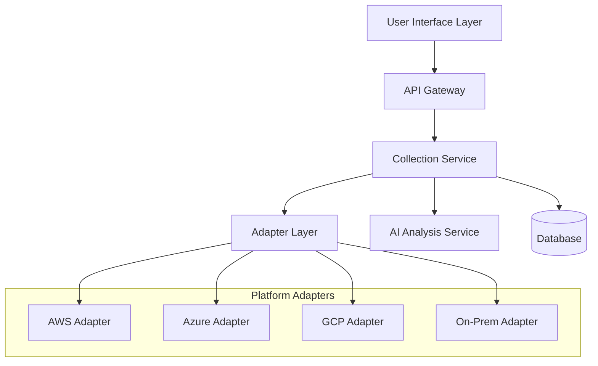

# Adaptive Data Collection System - Technical Design Document

## Table of Contents
1. [Architecture Overview](#architecture-overview)
2. [System Components](#system-components)
3. [Data Collection Tiers](#data-collection-tiers)
4. [Platform Integration](#platform-integration)
5. [User Interface Design](#user-interface-design)
6. [API Specifications](#api-specifications)
7. [Database Schema](#database-schema)
8. [Security Architecture](#security-architecture)
9. [Implementation Plan](#implementation-plan)
10. [Testing Strategy](#testing-strategy)

## Architecture Overview

### High-Level Architecture



### Core Principles
- **Platform Agnostic**: Universal adapter pattern for all cloud platforms
- **Graceful Degradation**: Seamless fallback from automation to manual collection
- **Progressive Enhancement**: Iterative data refinement without blocking workflows
- **Security First**: End-to-end encryption and role-based access controls
- **Scalable Architecture**: Horizontal scaling for large portfolio processing

## System Components

### 1. Collection Orchestrator
**Responsibility**: Coordinates data collection workflow and tier detection
**Key Functions**:
- Environment fingerprinting and capability assessment
- Automation tier determination and adapter selection
- Collection workflow orchestration and progress tracking
- Gap analysis and fallback trigger management

```typescript
interface CollectionOrchestrator {
  assessEnvironment(): EnvironmentProfile;
  selectTier(profile: EnvironmentProfile): CollectionTier;
  orchestrateCollection(tier: CollectionTier): CollectionResult;
  analyzeGaps(result: CollectionResult): GapAnalysis;
  triggerFallback(gaps: GapAnalysis): FallbackWorkflow;
}
```

### 2. Universal Adapter Layer
**Responsibility**: Platform-specific data collection and normalization
**Key Functions**:
- Cloud platform API integration and authentication
- Data extraction and transformation to common schema
- Error handling and retry logic
- Rate limiting and throttling management

```typescript
interface UniversalAdapter {
  platform: 'aws' | 'azure' | 'gcp' | 'on-prem' | 'hybrid';
  capabilities: AutomationCapability[];
  
  authenticate(credentials: PlatformCredentials): AuthResult;
  collectData(scope: CollectionScope): Promise<CollectionData>;
  validatePermissions(): PermissionCheck;
  getCapabilities(): AutomationCapability[];
}
```

### 3. AI Analysis Engine
**Responsibility**: Intelligent gap detection and questionnaire generation
**Key Functions**:
- Asset characterization and pattern recognition
- Missing data identification and prioritization
- Dynamic questionnaire generation and adaptation
- Confidence scoring and recommendation enhancement

```typescript
interface AIAnalysisEngine {
  analyzeAsset(asset: AssetData): AssetCharacterization;
  detectGaps(asset: AssetData, requirements: AssessmentRequirements): DataGap[];
  generateQuestions(gaps: DataGap[]): DynamicQuestionnaire;
  scoreConfidence(data: AssetData): ConfidenceScore;
}
```

### 4. Fallback Management System
**Responsibility**: Manual data collection workflow management
**Key Functions**:
- Form generation and validation
- Bulk data processing and template management
- Modal sequence orchestration
- Progress tracking and completion verification

```typescript
interface FallbackManager {
  generateForm(gaps: DataGap[]): AdaptiveForm;
  processBulkData(data: BulkUpload): ValidationResult;
  orchestrateModals(questions: DynamicQuestionnaire): ModalSequence;
  trackProgress(session: CollectionSession): ProgressMetrics;
}
```

## Data Collection Tiers

### Tier 1: Full Automation (Modern Cloud-Native)
**Target**: 90% automation for modern cloud environments
**Requirements**:
- Full API access to cloud platforms
- Modern monitoring and observability tools
- CI/CD pipeline integration
- Container orchestration platforms

**Collection Methods**:
```typescript
interface Tier1Collection {
  cloudPlatformAPIs: {
    aws: {
      services: ['CloudWatch', 'Config', 'Systems Manager', 'Well-Architected Tool'];
      permissions: ['ReadOnly', 'DescribeResources'];
    };
    azure: {
      services: ['Monitor', 'Resource Graph', 'Advisor', 'Security Center'];
      permissions: ['Reader', 'Monitoring Reader'];
    };
    gcp: {
      services: ['Cloud Monitoring', 'Asset Inventory', 'Security Center'];
      permissions: ['Viewer', 'Monitoring Viewer'];
    };
  };
  
  codeRepositories: {
    platforms: ['GitHub', 'GitLab', 'Azure DevOps'];
    analysis: ['Code Quality', 'Security Scanning', 'Dependency Analysis'];
  };
  
  cicdPipelines: {
    platforms: ['Jenkins', 'GitHub Actions', 'Azure Pipelines'];
    metrics: ['Build Success Rate', 'Deployment Frequency', 'Lead Time'];
  };
}
```

### Tier 2: Hybrid Automation (Mixed Environments)
**Target**: 70% automation with strategic manual input
**Requirements**:
- Partial API access or file upload capabilities
- Mixed modern/legacy tooling
- Some monitoring infrastructure
- Limited integration opportunities

**Collection Methods**:
```typescript
interface Tier2Collection {
  fileUploads: {
    supportedFormats: ['CSV', 'JSON', 'XML', 'PDF', 'YAML'];
    processors: ['Config Parser', 'Log Analyzer', 'Documentation OCR'];
  };
  
  networkScanning: {
    techniques: ['Port Scanning', 'Service Discovery', 'Dependency Mapping'];
    tools: ['Nmap', 'Custom Scripts', 'SNMP Queries'];
  };
  
  guidedWorkflows: {
    questionnaires: 'Adaptive and Context-Aware';
    interviews: 'AI-Assisted SME Capture';
    documentation: 'Intelligent Document Mining';
  };
}
```

### Tier 3: Minimal Automation (Restricted Access)
**Target**: 40% automation with enhanced manual workflows
**Requirements**:
- Basic infrastructure access
- Security restrictions on API usage
- Limited external connectivity
- Compliance and audit requirements

**Collection Methods**:
```typescript
interface Tier3Collection {
  onPremiseDeployment: {
    architecture: 'Standalone Discovery/Assess/Plan Modules';
    security: 'Air-Gapped with Encrypted Export';
    integration: 'Local System APIs Only';
  };
  
  manualProcesses: {
    structuredForms: 'Progressive Disclosure Design';
    bulkImport: 'Template-Based Data Entry';
    validation: 'AI-Powered Consistency Checking';
  };
}
```

### Tier 4: Legacy Focus (Archaeological Approach)
**Target**: 10% automation with comprehensive manual support
**Requirements**:
- Legacy applications with minimal modern tooling
- Limited or no documentation
- Tribal knowledge dependencies
- Archaeological discovery needs

**Collection Methods**:
```typescript
interface Tier4Collection {
  systemArchaeology: {
    techniques: ['Process Analysis', 'Config File Mining', 'Registry Scanning'];
    tools: ['Custom Scripts', 'System Profilers', 'Dependency Trackers'];
  };
  
  knowledgeCapture: {
    interviews: 'Structured Expert Interviews';
    documentation: 'OCR and Document Analysis';
    reverseEngineering: 'Safe Application Profiling';
  };
}
```

## Platform Integration

### AWS Integration Architecture
```typescript
interface AWSAdapter {
  services: {
    discovery: 'Application Discovery Service';
    config: 'AWS Config';
    cloudwatch: 'CloudWatch Metrics and Logs';
    systemsManager: 'Systems Manager Inventory';
    wellArchitected: 'Well-Architected Tool';
  };
  
  permissions: {
    required: ['ec2:Describe*', 'config:Get*', 'cloudwatch:Get*'];
    optional: ['application-discovery:Describe*', 'wellarchitected:Get*'];
  };
  
  dataMapping: {
    infrastructure: 'EC2 Instances → Asset Model';
    applications: 'ECS/EKS Services → Application Inventory';
    dependencies: 'VPC Flow Logs → Dependency Graph';
    performance: 'CloudWatch Metrics → Performance Baseline';
  };
}
```

### Azure Integration Architecture
```typescript
interface AzureAdapter {
  services: {
    resourceGraph: 'Azure Resource Graph';
    monitor: 'Azure Monitor';
    advisor: 'Azure Advisor';
    securityCenter: 'Azure Security Center';
    migrate: 'Azure Migrate';
  };
  
  permissions: {
    required: ['Reader', 'Monitoring Reader'];
    optional: ['Security Reader', 'Azure Service Map Reader'];
  };
  
  dataMapping: {
    infrastructure: 'Virtual Machines → Asset Model';
    applications: 'App Services → Application Inventory';
    dependencies: 'Service Map → Dependency Graph';
    recommendations: 'Advisor → Migration Insights';
  };
}
```

### GCP Integration Architecture
```typescript
interface GCPAdapter {
  services: {
    assetInventory: 'Cloud Asset Inventory';
    monitoring: 'Cloud Monitoring';
    securityCenter: 'Security Command Center';
    recommender: 'Recommender API';
  };
  
  permissions: {
    required: ['Viewer', 'Monitoring Viewer'];
    optional: ['Security Center Admin Viewer'];
  };
  
  dataMapping: {
    infrastructure: 'Compute Instances → Asset Model';
    applications: 'App Engine/GKE → Application Inventory';
    dependencies: 'VPC Flow Logs → Dependency Graph';
    security: 'Security Center → Risk Assessment';
  };
}
```

## User Interface Design

### Form Architecture
```typescript
interface AdaptiveForm {
  layout: 'Single Form with Bulk Toggle';
  sections: FormSection[];
  bulkMode: BulkInterface;
  validation: RealTimeValidation;
  progression: ProgressTracking;
}

interface FormSection {
  id: string;
  title: string;
  fields: FormField[];
  visibility: VisibilityRule[];
  required: boolean;
  automation: AutoPopulationRule[];
}

interface BulkInterface {
  layout: 'Spreadsheet Grid';
  operations: ['Copy Down', 'Apply to Selection', 'Template Fill'];
  validation: 'Real-time with Error Highlighting';
  progress: 'Completion Percentage per Application';
}
```

### Modal Sequence Design
```typescript
interface ModalSequence {
  trigger: {
    condition: 'Confidence Score < 0.85';
    timing: 'Post Form Submission';
  };
  
  sizing: {
    algorithm: 'Dynamic based on question count';
    thresholds: {
      single: 'questions <= 6';
      dual: 'questions 7-12';
      triple: 'questions 13+';
    };
  };
  
  progression: {
    flow: 'Technical → Business → Operational';
    navigation: 'Linear with progress indicators';
    completion: 'Mandatory for 6R unlock';
  };
}
```

### Responsive Design Patterns
```typescript
interface ResponsiveDesign {
  desktop: {
    layout: 'Full form with side panels';
    bulkMode: 'Spreadsheet with frozen headers';
    modals: 'Centered with backdrop';
  };
  
  tablet: {
    layout: 'Tabbed interface';
    bulkMode: 'Horizontal scroll grid';
    modals: 'Full-screen overlay';
  };
  
  mobile: {
    layout: 'Accordion sections';
    bulkMode: 'Card-based entry';
    modals: 'Bottom sheet presentation';
  };
}
```

## API Specifications

### Collection API Endpoints
```typescript
// Start collection workflow
POST /api/v3/collection/start
{
  "engagement_id": "uuid",
  "scope": {
    "applications": ["app1", "app2"],
    "environments": ["prod", "staging"]
  },
  "preferences": {
    "automation_level": "maximum",
    "data_sensitivity": "confidential"
  }
}

// Get collection status
GET /api/v3/collection/{collection_id}/status
Response: {
  "collection_id": "uuid",
  "status": "in_progress",
  "tier": "tier_1",
  "automation_rate": 0.85,
  "progress": {
    "total_assets": 100,
    "completed": 75,
    "failed": 5,
    "pending": 20
  }
}

// Submit manual data
POST /api/v3/collection/{collection_id}/manual-data
{
  "asset_id": "uuid",
  "data": {
    "technical_stack": ["java", "spring", "oracle"],
    "architecture_pattern": "monolith",
    "business_criticality": 4
  },
  "bulk_operation": {
    "apply_to": ["similar_apps"],
    "template_id": "web_application"
  }
}

// Trigger gap analysis
POST /api/v3/collection/{collection_id}/analyze-gaps
Response: {
  "gaps": [
    {
      "asset_id": "uuid",
      "missing_fields": ["custom_logic_complexity", "integration_patterns"],
      "impact_on_confidence": 0.15,
      "questions": [...]
    }
  ],
  "modal_sequence": {...}
}
```

### Platform Adapter APIs
```typescript
// Register platform adapter
POST /api/v3/adapters/register
{
  "platform": "aws",
  "credentials": {
    "access_key": "encrypted",
    "secret_key": "encrypted",
    "region": "us-east-1"
  },
  "scope": {
    "accounts": ["123456789"],
    "regions": ["us-east-1", "us-west-2"]
  }
}

// Test adapter connection
GET /api/v3/adapters/{adapter_id}/test
Response: {
  "status": "connected",
  "capabilities": ["infrastructure", "applications", "monitoring"],
  "limitations": ["no_code_access", "rate_limited"],
  "estimated_automation": 0.78
}

// Execute adapter collection
POST /api/v3/adapters/{adapter_id}/collect
{
  "scope": "all_resources",
  "filters": {
    "resource_types": ["instances", "databases", "applications"],
    "tags": {"Environment": "production"}
  }
}
```

## Database Schema

### Collection Management Tables
```sql
-- Collection Sessions
CREATE TABLE collection_sessions (
    id UUID PRIMARY KEY,
    engagement_id UUID REFERENCES engagements(id),
    status VARCHAR(20) NOT NULL, -- pending, running, completed, failed
    tier VARCHAR(10) NOT NULL, -- tier_1, tier_2, tier_3, tier_4
    automation_rate DECIMAL(3,2),
    confidence_score DECIMAL(3,2),
    started_at TIMESTAMP,
    completed_at TIMESTAMP,
    metadata JSONB
);

-- Platform Adapters
CREATE TABLE platform_adapters (
    id UUID PRIMARY KEY,
    engagement_id UUID REFERENCES engagements(id),
    platform VARCHAR(20) NOT NULL, -- aws, azure, gcp, on_prem
    credentials JSONB, -- encrypted
    capabilities JSONB,
    status VARCHAR(20), -- active, inactive, error
    last_sync TIMESTAMP,
    configuration JSONB
);

-- Collection Results
CREATE TABLE collection_results (
    id UUID PRIMARY KEY,
    collection_session_id UUID REFERENCES collection_sessions(id),
    asset_id UUID REFERENCES assets(id),
    adapter_id UUID REFERENCES platform_adapters(id),
    automation_level VARCHAR(20), -- full, partial, manual, failed
    confidence_score DECIMAL(3,2),
    raw_data JSONB,
    processed_data JSONB,
    validation_status VARCHAR(20),
    collected_at TIMESTAMP
);
```

### Gap Analysis Tables
```sql
-- Data Gaps
CREATE TABLE data_gaps (
    id UUID PRIMARY KEY,
    collection_session_id UUID REFERENCES collection_sessions(id),
    asset_id UUID REFERENCES assets(id),
    gap_type VARCHAR(50), -- technical_debt, business_logic, operational, stakeholder
    missing_fields JSONB,
    impact_score DECIMAL(3,2),
    priority VARCHAR(10), -- high, medium, low
    resolution_status VARCHAR(20), -- pending, in_progress, resolved
    created_at TIMESTAMP
);

-- Dynamic Questionnaires
CREATE TABLE dynamic_questionnaires (
    id UUID PRIMARY KEY,
    collection_session_id UUID REFERENCES collection_sessions(id),
    asset_id UUID REFERENCES assets(id),
    questions JSONB,
    sequence_config JSONB,
    responses JSONB,
    completion_status VARCHAR(20),
    generated_at TIMESTAMP
);
```

### Enhanced Asset Schema
```sql
-- Extended Asset Model
ALTER TABLE assets ADD COLUMN IF NOT EXISTS collection_metadata JSONB;
ALTER TABLE assets ADD COLUMN IF NOT EXISTS automation_source VARCHAR(50);
ALTER TABLE assets ADD COLUMN IF NOT EXISTS data_completeness_score DECIMAL(3,2);
ALTER TABLE assets ADD COLUMN IF NOT EXISTS last_collection_update TIMESTAMP;

-- Collection Quality Metrics
CREATE TABLE collection_quality_metrics (
    id UUID PRIMARY KEY,
    asset_id UUID REFERENCES assets(id),
    collection_session_id UUID REFERENCES collection_sessions(id),
    completeness_score DECIMAL(3,2),
    accuracy_score DECIMAL(3,2),
    consistency_score DECIMAL(3,2),
    timeliness_score DECIMAL(3,2),
    overall_quality DECIMAL(3,2),
    calculated_at TIMESTAMP
);
```

## Security Architecture

### Authentication and Authorization
```typescript
interface SecurityFramework {
  authentication: {
    methods: ['SAML', 'OAuth2', 'API Keys'];
    mfa: 'Required for sensitive operations';
    sessionManagement: 'JWT with refresh tokens';
  };
  
  authorization: {
    model: 'Role-Based Access Control (RBAC)';
    scopes: ['collection:read', 'collection:write', 'adapters:manage'];
    tenantIsolation: 'Row-level security with tenant context';
  };
  
  dataProtection: {
    encryption: {
      atRest: 'AES-256 with tenant-specific keys';
      inTransit: 'TLS 1.3 with certificate pinning';
      keyManagement: 'HSM or cloud KMS integration';
    };
    
    privacy: {
      dataAnonymization: 'PII detection and masking';
      auditLogging: 'Comprehensive activity tracking';
      retention: 'Configurable per tenant requirements';
    };
  };
}
```

### Secure Adapter Architecture
```typescript
interface SecureAdapterFramework {
  credentialManagement: {
    storage: 'Encrypted vault with rotation support';
    scoping: 'Minimal required permissions';
    rotation: 'Automated credential lifecycle';
  };
  
  networkSecurity: {
    isolation: 'VPC/VNet isolation per tenant';
    monitoring: 'Network traffic analysis';
    restrictions: 'IP allowlisting and rate limiting';
  };
  
  auditCompliance: {
    logging: 'Structured audit logs with tamper evidence';
    monitoring: 'Real-time security event detection';
    reporting: 'Compliance dashboard and alerting';
  };
}
```

## Implementation Plan

### Phase 1: Foundation (Weeks 1-4)
**MVP Development - Tier 1 Support**

**Week 1-2: Core Infrastructure**
- [ ] Collection Orchestrator service implementation
- [ ] Universal Adapter Layer architecture
- [ ] Basic AWS/Azure/GCP adapter scaffolding
- [ ] Database schema creation and migration scripts

**Week 3-4: Basic UI and API**
- [ ] Single form interface with basic fields
- [ ] API endpoints for collection management
- [ ] Simple gap analysis and confidence scoring
- [ ] Basic platform detection and adapter selection

### Phase 2: Enhanced Automation (Weeks 5-8)
**Tier 1 Feature Completion**

**Week 5-6: Platform Integration**
- [ ] Complete AWS adapter with CloudWatch/Config integration
- [ ] Complete Azure adapter with Resource Graph/Monitor
- [ ] Complete GCP adapter with Asset Inventory/Monitoring
- [ ] Code repository integration (GitHub/GitLab APIs)

**Week 7-8: AI and Automation**
- [ ] AI-powered gap analysis engine
- [ ] Dynamic questionnaire generation
- [ ] Automated confidence scoring algorithm
- [ ] Real-time validation and quality checking

### Phase 3: Manual Workflows (Weeks 9-12)
**Tier 2 and Fallback Implementation**

**Week 9-10: Form Enhancement**
- [ ] Bulk toggle and spreadsheet interface
- [ ] Template system for similar applications
- [ ] Progressive disclosure and smart defaults
- [ ] File upload processing and parsing

**Week 11-12: Modal System**
- [ ] Dynamic modal sizing algorithm
- [ ] Guided modal sequence implementation
- [ ] Adaptive questioning logic
- [ ] Progress tracking and completion validation

### Phase 4: Testing and Optimization (Weeks 13-16)
**Quality Assurance and Performance**

**Week 13-14: Testing**
- [ ] Unit test coverage (>90%)
- [ ] Integration test suite
- [ ] End-to-end workflow testing
- [ ] Performance and load testing

**Week 15-16: Production Readiness**
- [ ] Security audit and penetration testing
- [ ] Documentation and user guides
- [ ] Deployment automation and monitoring
- [ ] Beta testing with select clients

## Testing Strategy

### Unit Testing
```typescript
// Collection Orchestrator Tests
describe('CollectionOrchestrator', () => {
  test('should detect environment capabilities correctly', async () => {
    const profile = await orchestrator.assessEnvironment(mockCredentials);
    expect(profile.modernization_score).toBeGreaterThan(70);
    expect(profile.access_level).toBe('full');
  });
  
  test('should select appropriate tier based on capabilities', () => {
    const tier = orchestrator.selectTier(modernProfile);
    expect(tier).toBe('tier_1');
  });
});

// Adapter Tests
describe('AWSAdapter', () => {
  test('should authenticate with valid credentials', async () => {
    const result = await awsAdapter.authenticate(validCredentials);
    expect(result.status).toBe('success');
  });
  
  test('should collect infrastructure data', async () => {
    const data = await awsAdapter.collectData(infraScope);
    expect(data.assets).toBeDefined();
    expect(data.confidence).toBeGreaterThan(0.8);
  });
});
```

### Integration Testing
```typescript
// End-to-End Collection Workflow
describe('Collection Workflow Integration', () => {
  test('should complete full automated collection for modern environment', async () => {
    const session = await startCollection(modernEngagement);
    
    // Verify automation tier selection
    expect(session.tier).toBe('tier_1');
    
    // Wait for completion
    await waitForCompletion(session.id);
    
    // Verify results
    const results = await getCollectionResults(session.id);
    expect(results.automation_rate).toBeGreaterThan(0.85);
    expect(results.confidence_score).toBeGreaterThan(0.8);
  });
  
  test('should fallback to manual collection when automation fails', async () => {
    const session = await startCollection(restrictedEngagement);
    
    // Simulate automation failure
    await simulateAdapterFailure(session.adapters);
    
    // Verify fallback triggered
    const gaps = await getDataGaps(session.id);
    expect(gaps.length).toBeGreaterThan(0);
    
    // Verify questionnaire generation
    const questionnaire = await generateQuestionnaire(gaps);
    expect(questionnaire.questions.length).toBeGreaterThan(0);
  });
});
```

### Performance Testing
```typescript
// Load Testing Scenarios
describe('Performance Testing', () => {
  test('should handle bulk portfolio processing', async () => {
    const portfolioSize = 100;
    const startTime = Date.now();
    
    const session = await startBulkCollection(largePortfolio);
    await waitForCompletion(session.id);
    
    const duration = Date.now() - startTime;
    expect(duration).toBeLessThan(300000); // 5 minutes max
  });
  
  test('should maintain performance under concurrent users', async () => {
    const concurrentUsers = 10;
    const promises = Array(concurrentUsers).fill(null).map(() => 
      startCollection(standardEngagement)
    );
    
    const results = await Promise.all(promises);
    results.forEach(session => {
      expect(session.status).toBe('running');
    });
  });
});
```

### Security Testing
```typescript
// Security Test Suite
describe('Security Testing', () => {
  test('should prevent unauthorized access to collection data', async () => {
    const unauthorizedRequest = await attemptDataAccess(differentTenantToken);
    expect(unauthorizedRequest.status).toBe(403);
  });
  
  test('should encrypt sensitive data at rest', async () => {
    const credentials = await getStoredCredentials(adapterId);
    expect(credentials).toMatch(/^encrypted:/);
  });
  
  test('should validate input to prevent injection attacks', async () => {
    const maliciousInput = "'; DROP TABLE assets; --";
    const result = await submitManualData(maliciousInput);
    expect(result.validation_errors).toBeDefined();
  });
});
```

## Conclusion

The Adaptive Data Collection System represents a sophisticated approach to gathering comprehensive asset information across diverse client environments. The tiered automation strategy ensures maximum efficiency for modern cloud-native organizations while providing robust fallback capabilities for legacy and restricted environments.

The technical design emphasizes security, scalability, and user experience, ensuring the system can handle enterprise-scale deployments while maintaining the flexibility required for various client requirements. The phased implementation approach allows for iterative delivery and validation, reducing risk while delivering immediate value to users.

This design document serves as the technical foundation for implementation, providing detailed specifications for all system components, interfaces, and integration patterns necessary to deliver a production-ready solution.