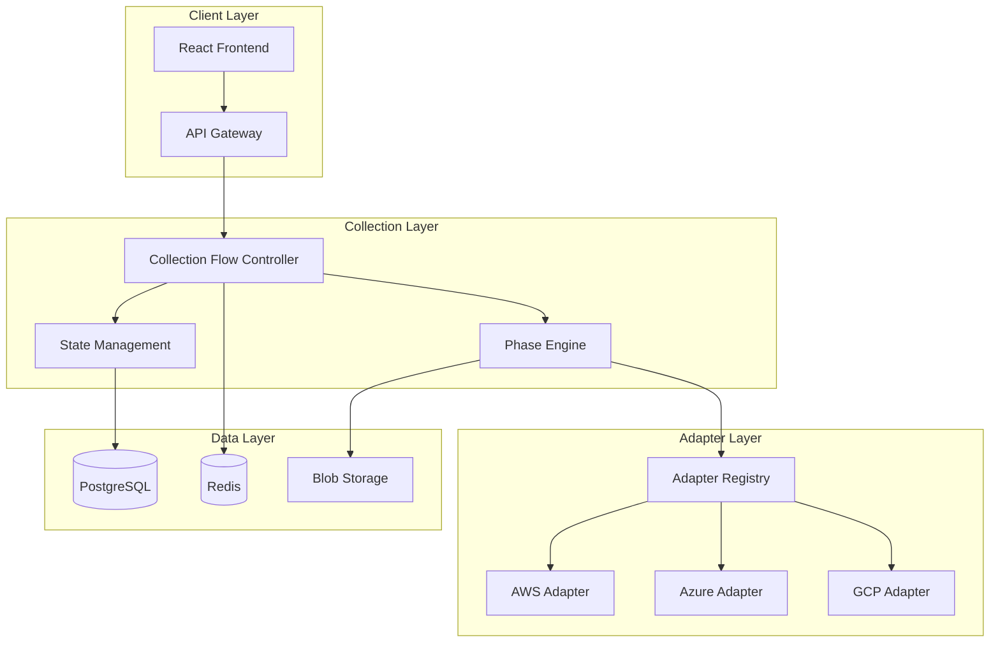

# ADCS Training Materials - User Type Specific Guides

## Overview

This document provides role-specific training materials for the Adaptive Data Collection System (ADCS). Each user type has tailored content focusing on their specific responsibilities, workflows, and required skills.

## Training Program Structure

### Learning Paths by Role
- **Business Analysts**: Focus on data collection strategy and business requirements
- **Technical Architects**: Deep dive into platform integration and data architecture
- **Project Managers**: Workflow orchestration and progress management
- **System Administrators**: System configuration and troubleshooting
- **End Users**: Basic data collection and validation workflows

---

# Business Analyst Training Guide

## Learning Objectives

After completing this training, Business Analysts will be able to:
- Define effective data collection strategies for migration projects
- Configure Collection Flows to meet business requirements
- Validate data quality and completeness against business needs
- Coordinate stakeholder engagement for data collection activities
- Translate business requirements into technical collection specifications

## Module 1: ADCS Business Foundation

### 1.1 Understanding Migration Data Requirements

**Key Concepts:**
- Business criticality assessment
- User impact analysis
- Compliance and regulatory requirements
- Cost optimization opportunities

**Activity: Business Requirements Mapping**
```
Exercise: Map Business Requirements to Data Points

Business Requirement → Data Collection Need
─────────────────────────────────────────────
High Availability (99.9%) → Performance metrics, SLA data
Regulatory Compliance → Data classification, access logs
Cost Optimization → Resource utilization, licensing info
User Experience → Performance data, user analytics
```

### 1.2 Collection Strategy Development

**Smart Workflow vs Traditional Workflow Decision Matrix:**

| Factor | Smart Workflow | Traditional Workflow |
|--------|----------------|---------------------|
| API Access | Available | Limited/None |
| Environment Type | Modern Cloud | Legacy/Air-gapped |
| Timeline | Tight (days) | Flexible (weeks) |
| Resource Availability | Automated | Manual/SME Required |
| Data Volume | Large (100+) | Small/Medium (<100) |

**Workshop Activity: Strategy Selection**
```
Scenario Analysis:
1. Financial services company with 200 applications on AWS
2. Government agency with air-gapped mainframe systems
3. Healthcare organization with mixed cloud/on-premises
4. Startup with 15 microservices on Kubernetes

For each scenario, determine:
- Recommended collection strategy
- Automation tier expectation
- Stakeholder engagement plan
- Timeline and resource requirements
```

### 1.3 Stakeholder Engagement Planning

**Stakeholder Matrix:**
```
Stakeholder Type | Data Contribution | Engagement Method | Timeline
───────────────────────────────────────────────────────────────
Application Owner | Business context | Interviews/Forms | Week 1-2
Technical Lead | Architecture details | Technical review | Week 2-3
End Users | Usage patterns | Surveys/Analytics | Week 1-4
Compliance Team | Regulatory requirements | Documentation review | Week 1
Finance Team | Cost/licensing data | Financial analysis | Week 2-4
```

## Module 2: Collection Flow Configuration

### 2.1 Defining Collection Scope

**Business-Driven Scope Definition:**
```json
{
  "collection_scope": {
    "business_criteria": {
      "criticality_levels": ["critical", "high", "medium"],
      "business_units": ["finance", "operations", "customer_service"],
      "application_types": ["customer_facing", "internal", "integration"],
      "compliance_requirements": ["sox", "pci", "hipaa"]
    },
    "technical_criteria": {
      "platforms": ["aws", "azure", "on_premises"],
      "technologies": ["java", "dotnet", "mainframe"],
      "data_sensitivity": ["public", "internal", "confidential"]
    }
  }
}
```

**Workshop: Scope Definition Exercise**
```
Business Scenario: Regional Bank Migration
- 150 applications across 5 business units
- Mixed AWS and on-premises environment
- Strict regulatory requirements
- 6-month migration timeline

Define collection scope considering:
1. Business priority applications
2. Regulatory compliance needs
3. Technical complexity factors
4. Resource availability constraints
```

### 2.2 Quality Requirements Definition

**Business Quality Metrics:**
```
Completeness Targets by Application Tier:
Tier 1 (Critical): 95% completeness required
Tier 2 (High): 90% completeness required
Tier 3 (Medium): 85% completeness required
Tier 4 (Low): 80% completeness required

Confidence Levels:
High Confidence: Verified by multiple sources
Medium Confidence: Single authoritative source
Low Confidence: Estimated or assumed values
```

## Module 3: Data Validation and Quality Assurance

### 3.1 Business Data Validation

**Critical Business Data Points Checklist:**
```
Application Portfolio Data:
☐ Business function and purpose
☐ User base and usage patterns
☐ Business criticality rating
☐ Compliance and regulatory requirements
☐ Cost and licensing information
☐ Business owner and stakeholder contacts

Operational Data:
☐ Availability requirements and SLAs
☐ Performance characteristics
☐ Business hours and usage patterns
☐ Integration with other business processes
☐ Data sensitivity and classification
☐ Backup and recovery requirements
```

### 3.2 Quality Score Interpretation

**Business Impact of Quality Scores:**
```
Quality Score | Business Impact | Recommended Action
────────────────────────────────────────────────────
0.90 - 1.00 | Excellent | Proceed with confidence
0.85 - 0.89 | Good | Minor validation needed
0.80 - 0.84 | Acceptable | Address critical gaps
0.75 - 0.79 | Concerning | Significant improvement needed
< 0.75 | Poor | Comprehensive data collection required
```

**Case Study: Quality Score Analysis**
```
Scenario: E-commerce Platform Assessment
- Overall quality score: 0.82
- Application data: 0.91 (excellent)
- Infrastructure data: 0.76 (concerning)
- Dependency data: 0.79 (concerning)

Business Questions:
1. What business risks does this quality level present?
2. Which gaps should be prioritized for resolution?
3. How might this impact migration timeline and costs?
4. What stakeholder approval is needed to proceed?
```

---

# Technical Architect Training Guide

## Learning Objectives

Technical Architects will master:
- ADCS architecture and integration patterns
- Platform adapter configuration and optimization
- Data transformation and normalization processes
- Advanced troubleshooting and performance tuning
- Custom integration development

## Module 1: ADCS Technical Architecture

### 1.1 System Architecture Deep Dive

**Component Architecture:**


### 1.2 Platform Adapter Development

**Custom Adapter Implementation:**
```python
from abc import ABC, abstractmethod
from typing import Dict, List, Any
import logging

class BasePlatformAdapter(ABC):
    """Base class for all platform adapters"""
    
    def __init__(self, config: Dict[str, Any]):
        self.config = config
        self.logger = logging.getLogger(self.__class__.__name__)
    
    @abstractmethod
    async def authenticate(self) -> bool:
        """Authenticate with the platform"""
        pass
    
    @abstractmethod
    async def discover_resources(self, scope: Dict[str, Any]) -> List[Dict[str, Any]]:
        """Discover resources within the specified scope"""
        pass
    
    @abstractmethod
    async def analyze_dependencies(self, resources: List[Dict[str, Any]]) -> List[Dict[str, Any]]:
        """Analyze dependencies between resources"""
        pass
    
    async def validate_connectivity(self) -> Dict[str, Any]:
        """Validate connectivity and permissions"""
        try:
            authenticated = await self.authenticate()
            test_resources = await self.discover_resources({"limit": 1})
            
            return {
                "status": "success" if authenticated else "failed",
                "authentication": authenticated,
                "api_access": len(test_resources) > 0,
                "estimated_resources": await self._estimate_resource_count()
            }
        except Exception as e:
            self.logger.error(f"Connectivity validation failed: {e}")
            return {
                "status": "failed",
                "error": str(e),
                "recommendations": self._get_troubleshooting_recommendations()
            }

class CustomVMwareAdapter(BasePlatformAdapter):
    """Custom adapter for VMware vSphere environments"""
    
    async def authenticate(self) -> bool:
        """Authenticate with vCenter Server"""
        # Implementation specific to VMware authentication
        pass
    
    async def discover_resources(self, scope: Dict[str, Any]) -> List[Dict[str, Any]]:
        """Discover VMs, hosts, and datastores"""
        # Implementation for VMware resource discovery
        pass
```

### 1.3 Data Transformation Pipeline

**Data Normalization Framework:**
```python
class DataTransformationPipeline:
    """Pipeline for transforming and normalizing collected data"""
    
    def __init__(self):
        self.transformers = []
        self.validators = []
        self.enrichers = []
    
    def add_transformer(self, transformer):
        """Add a data transformer to the pipeline"""
        self.transformers.append(transformer)
    
    async def process(self, raw_data: Dict[str, Any]) -> Dict[str, Any]:
        """Process raw data through the transformation pipeline"""
        data = raw_data.copy()
        
        # Apply transformations
        for transformer in self.transformers:
            data = await transformer.transform(data)
        
        # Apply validations
        validation_results = []
        for validator in self.validators:
            result = await validator.validate(data)
            validation_results.append(result)
        
        # Apply enrichments
        for enricher in self.enrichers:
            data = await enricher.enrich(data)
        
        return {
            "normalized_data": data,
            "validation_results": validation_results,
            "quality_score": self._calculate_quality_score(validation_results),
            "transformation_metadata": self._get_transformation_metadata()
        }

class ApplicationDataTransformer:
    """Transformer for application data normalization"""
    
    async def transform(self, data: Dict[str, Any]) -> Dict[str, Any]:
        """Transform application data to standard schema"""
        return {
            "id": self._generate_uuid(),
            "name": self._normalize_name(data.get("name")),
            "type": self._classify_application_type(data),
            "platform": self._normalize_platform(data.get("platform")),
            "technology_stack": self._extract_technology_stack(data),
            "business_metadata": self._extract_business_metadata(data),
            "technical_metadata": self._extract_technical_metadata(data),
            "operational_metadata": self._extract_operational_metadata(data)
        }
```

## Module 2: Integration Patterns

### 2.1 Master Flow Orchestrator Integration

**Collection Flow Registration:**
```python
class CollectionFlowRegistration:
    """Register Collection Flow with Master Flow Orchestrator"""
    
    async def register_flow_type(self):
        """Register Collection Flow as a workflow type"""
        flow_definition = {
            "flow_type": "collection_flow",
            "version": "2.1.0",
            "capabilities": {
                "supports_automation": True,
                "supports_manual_collection": True,
                "supports_bulk_upload": True,
                "supports_real_time_monitoring": True
            },
            "phases": [
                {
                    "name": "environment_assessment",
                    "required": True,
                    "estimated_duration": "15_minutes",
                    "dependencies": []
                },
                {
                    "name": "platform_discovery",
                    "required": True,
                    "estimated_duration": "2_hours",
                    "dependencies": ["environment_assessment"]
                },
                {
                    "name": "dependency_mapping",
                    "required": True,
                    "estimated_duration": "1_hour",
                    "dependencies": ["platform_discovery"]
                },
                {
                    "name": "quality_validation",
                    "required": True,
                    "estimated_duration": "30_minutes",
                    "dependencies": ["dependency_mapping"]
                },
                {
                    "name": "data_normalization",
                    "required": True,
                    "estimated_duration": "30_minutes",
                    "dependencies": ["quality_validation"]
                }
            ],
            "handoff_protocols": {
                "discovery_flow": {
                    "data_format": "normalized_json",
                    "quality_requirements": {
                        "minimum_quality_score": 0.8,
                        "required_completeness": 0.85
                    }
                }
            }
        }
        
        return await self.master_flow_orchestrator.register_flow_type(flow_definition)
```

### 2.2 External System Integration

**CMDB Integration Example:**
```python
class CMDBIntegrationService:
    """Service for integrating with external CMDB systems"""
    
    def __init__(self, cmdb_config: Dict[str, Any]):
        self.cmdb_config = cmdb_config
        self.api_client = self._create_api_client()
    
    async def sync_collection_data(self, collection_flow_id: str) -> Dict[str, Any]:
        """Sync collected data with CMDB"""
        
        # Retrieve collected data
        collection_data = await self._get_collection_data(collection_flow_id)
        
        # Transform to CMDB format
        cmdb_records = await self._transform_to_cmdb_format(collection_data)
        
        # Sync with CMDB
        sync_results = []
        for record in cmdb_records:
            result = await self._sync_record(record)
            sync_results.append(result)
        
        return {
            "total_records": len(cmdb_records),
            "successful_syncs": len([r for r in sync_results if r["status"] == "success"]),
            "failed_syncs": len([r for r in sync_results if r["status"] == "failed"]),
            "sync_details": sync_results
        }
    
    async def _transform_to_cmdb_format(self, collection_data: Dict[str, Any]) -> List[Dict[str, Any]]:
        """Transform collection data to CMDB format"""
        cmdb_records = []
        
        for application in collection_data.get("applications", []):
            cmdb_record = {
                "ci_type": "application",
                "name": application["name"],
                "description": application.get("description"),
                "business_service": application.get("business_metadata", {}).get("service"),
                "technical_service": application.get("technical_metadata", {}).get("service"),
                "environment": application.get("environment"),
                "status": application.get("operational_metadata", {}).get("status"),
                "owner": application.get("business_metadata", {}).get("owner"),
                "support_group": application.get("operational_metadata", {}).get("support_group")
            }
            cmdb_records.append(cmdb_record)
        
        return cmdb_records
```

---

# Project Manager Training Guide

## Learning Objectives

Project Managers will learn to:
- Plan and execute data collection projects effectively
- Monitor progress and manage stakeholder expectations
- Coordinate multiple collection workflows
- Manage risks and resolve blockers
- Report on collection outcomes and business value

## Module 1: Project Planning and Setup

### 1.1 Collection Project Planning Framework

**Project Planning Template:**
```
ADCS Collection Project Plan Template
───────────────────────────────────────

Project Overview:
- Project Name: [Migration Discovery - Phase 1]
- Scope: [200 applications across 3 business units]
- Timeline: [8 weeks total collection period]
- Success Criteria: [90% data completeness, quality score >0.85]

Stakeholder Matrix:
Role | Name | Responsibility | Engagement Level
────────────────────────────────────────────────
Executive Sponsor | [Name] | Budget approval | Monthly updates
Business Owner | [Name] | Requirements definition | Weekly check-ins
Technical Lead | [Name] | Platform configuration | Daily coordination
SME Team | [Names] | Data validation | As needed consultation

Collection Strategy:
- Automation Tier: [Tier 1 - 90% automated]
- Primary Workflow: [Smart Workflow with Traditional backup]
- Platform Coverage: [AWS, Azure, On-premises]
- Quality Targets: [Completeness >90%, Confidence >85%]

Timeline and Milestones:
Week 1-2: Environment setup and stakeholder alignment
Week 3-4: Primary data collection execution
Week 5-6: Data validation and gap resolution
Week 7-8: Quality assurance and handoff preparation
```

### 1.2 Resource Planning and Allocation

**Resource Allocation Matrix:**
```
Resource Type | Allocation | Duration | Cost | Dependencies
─────────────────────────────────────────────────────────
Platform Credits | AWS: $2000 | 4 weeks | $2000 | Finance approval
SME Time | 40 hours | 6 weeks | $8000 | Manager approval
Technical Resources | 2 FTE | 8 weeks | $32000 | Team availability
Tool Licensing | ADCS Pro | 3 months | $5000 | Procurement
Training | Team training | 1 week | $3000 | Scheduler availability
```

### 1.3 Risk Management Planning

**Risk Register Template:**
```
Risk ID | Risk Description | Probability | Impact | Mitigation Strategy | Owner
─────────────────────────────────────────────────────────────────────────
R001 | Platform API access denied | Medium | High | Early credential validation | Tech Lead
R002 | SME availability limited | High | Medium | Cross-train multiple SMEs | PM
R003 | Data quality below threshold | Medium | High | Multi-source validation | Business Analyst
R004 | Timeline delays due to scope creep | Medium | Medium | Strict scope management | PM
R005 | Stakeholder approval delays | Low | High | Early stakeholder engagement | Executive Sponsor
```

## Module 2: Progress Monitoring and Control

### 2.1 Progress Tracking Dashboard

**Key Performance Indicators (KPIs):**
```
Collection Progress Metrics:
- Overall Completion: [65%] ████████████░░░░░░░░
- Data Quality Score: [0.87] ████████████████░░░░
- Applications Processed: [130/200] ████████████░░░░░░░░
- Critical Issues: [3] 🔴🔴🔴
- Timeline Status: [On Track] 🟢

Quality Metrics by Category:
- Applications: [0.91] ████████████████████
- Infrastructure: [0.84] ████████████████░░░░
- Dependencies: [0.82] ████████████████░░░░
- Business Data: [0.89] ████████████████████

Resource Utilization:
- Platform API Usage: [75% of quota]
- SME Hours Consumed: [24/40 hours]
- Budget Utilization: [60% of allocated]
- Team Capacity: [85% utilized]
```

### 2.2 Status Reporting Templates

**Weekly Status Report Template:**
```
ADCS Collection Project - Weekly Status Report
Week of: [Date]

Executive Summary:
[3-4 sentences summarizing overall progress, key achievements, and any concerns]

Progress This Week:
✅ Completed AWS environment discovery (145 applications)
✅ Resolved API access issues for Azure subscription
✅ Validated business criticality data with stakeholders
⚠️ Identified dependency mapping gaps requiring SME input

Metrics Update:
- Applications Processed: 130/200 (65%) [+25 this week]
- Quality Score: 0.87 [+0.03 improvement]
- Timeline Status: On track for Week 6 completion
- Budget Status: 60% utilized, 40% remaining

Issues and Risks:
🔴 High: Dependency data quality concerns for legacy applications
🟡 Medium: SME availability for validation sessions next week
🟢 Low: Minor performance optimization needed for bulk uploads

Next Week Priorities:
1. Complete dependency mapping validation (Owner: Tech Lead)
2. Conduct stakeholder review sessions (Owner: Business Analyst)
3. Begin gap resolution for Tier 1 applications (Owner: SME Team)
4. Prepare handoff documentation (Owner: PM)

Action Items:
- [Owner: Tech Lead] Schedule dependency review session by Friday
- [Owner: PM] Escalate SME scheduling conflicts to management
- [Owner: Business Analyst] Prepare validation checklist for stakeholders
```

## Module 3: Stakeholder Management

### 3.1 Communication Strategy

**Stakeholder Communication Plan:**
```
Stakeholder | Information Needs | Communication Method | Frequency | Format
──────────────────────────────────────────────────────────────────────────
Executive Team | Progress, budget, risks | Email dashboard | Weekly | Executive summary
Business Owners | Data validation, timeline | Review meetings | Bi-weekly | Detailed reports
Technical Teams | Technical issues, performance | Slack/Teams | Daily | Technical updates
End Users | Training, change impact | Email, training | As needed | User guides
Compliance | Data security, audit trail | Formal reports | Monthly | Compliance reports
```

### 3.2 Change Management

**Change Request Process:**
```
Change Request Template:
─────────────────────

Change ID: [CR-001]
Requested By: [Stakeholder Name]
Date Requested: [Date]

Change Description:
[Detailed description of requested change]

Impact Analysis:
- Scope Impact: [Description of scope changes]
- Timeline Impact: [Days added/removed]
- Resource Impact: [Additional resources needed]
- Cost Impact: [Budget implications]
- Quality Impact: [Effect on data quality goals]

Approval Status:
☐ Business Owner Approval
☐ Technical Lead Approval  
☐ Executive Sponsor Approval
☐ PM Recommendation: [Approve/Reject/Modify]

Implementation Plan:
[Steps to implement if approved]
```

---

# System Administrator Training Guide

## Learning Objectives

System Administrators will master:
- ADCS deployment and configuration management
- Performance monitoring and optimization
- Security configuration and compliance
- Backup and disaster recovery procedures
- Troubleshooting and maintenance tasks

## Module 1: System Deployment and Configuration

### 1.1 Infrastructure Requirements

**Production Deployment Specifications:**
```yaml
# docker-compose.prod.yml
version: '3.8'

services:
  adcs-backend:
    image: migration-orchestrator:latest
    environment:
      - DATABASE_URL=postgresql://user:pass@db:5432/migration_db
      - REDIS_URL=redis://redis:6379
      - LOG_LEVEL=INFO
      - MAX_CONCURRENT_COLLECTIONS=10
    deploy:
      resources:
        limits:
          memory: 4G
          cpus: '2.0'
        reservations:
          memory: 2G
          cpus: '1.0'
    healthcheck:
      test: ["CMD", "curl", "-f", "http://localhost:8000/health"]
      interval: 30s
      timeout: 10s
      retries: 3

  adcs-database:
    image: postgres:13
    environment:
      - POSTGRES_DB=migration_db
      - POSTGRES_USER=migration_user
      - POSTGRES_PASSWORD=${DB_PASSWORD}
    volumes:
      - postgres_data:/var/lib/postgresql/data
      - ./backups:/backups
    deploy:
      resources:
        limits:
          memory: 8G
          cpus: '4.0'

  adcs-redis:
    image: redis:6-alpine
    command: redis-server --appendonly yes --maxmemory 1gb
    volumes:
      - redis_data:/data
    deploy:
      resources:
        limits:
          memory: 1G
          cpus: '0.5'

volumes:
  postgres_data:
  redis_data:
```

### 1.2 Security Configuration

**Security Hardening Checklist:**
```bash
# SSL/TLS Configuration
openssl req -x509 -nodes -days 365 -newkey rsa:2048 \
  -keyout /etc/ssl/private/adcs.key \
  -out /etc/ssl/certs/adcs.crt

# Firewall Rules
ufw allow 22/tcp
ufw allow 443/tcp
ufw deny 8000/tcp  # Block direct backend access
ufw enable

# Database Security
psql -c "CREATE ROLE adcs_readonly;"
psql -c "GRANT CONNECT ON DATABASE migration_db TO adcs_readonly;"
psql -c "GRANT USAGE ON SCHEMA public TO adcs_readonly;"
psql -c "GRANT SELECT ON ALL TABLES IN SCHEMA public TO adcs_readonly;"

# Environment Variables Security
echo "DB_PASSWORD=$(openssl rand -base64 32)" >> .env.prod
echo "JWT_SECRET=$(openssl rand -base64 64)" >> .env.prod
echo "ENCRYPTION_KEY=$(openssl rand -base64 32)" >> .env.prod
chmod 600 .env.prod
```

### 1.3 Monitoring and Alerting Setup

**Prometheus Configuration:**
```yaml
# prometheus.yml
global:
  scrape_interval: 15s

scrape_configs:
  - job_name: 'adcs-backend'
    static_configs:
      - targets: ['backend:8000']
    metrics_path: /metrics
    scrape_interval: 30s

  - job_name: 'adcs-database'
    static_configs:
      - targets: ['db:5432']
    metrics_path: /metrics

rule_files:
  - "adcs_alerts.yml"

alerting:
  alertmanagers:
    - static_configs:
        - targets:
          - alertmanager:9093
```

**Alert Rules:**
```yaml
# adcs_alerts.yml
groups:
  - name: adcs_collection_flows
    rules:
      - alert: CollectionFlowFailureRate
        expr: (rate(collection_flow_failures_total[5m]) / rate(collection_flow_total[5m])) > 0.1
        for: 2m
        labels:
          severity: warning
        annotations:
          summary: "High collection flow failure rate"
          description: "Collection flow failure rate is {{ $value }} which is above the 10% threshold"

      - alert: DatabaseConnectionFailure
        expr: up{job="adcs-database"} == 0
        for: 1m
        labels:
          severity: critical
        annotations:
          summary: "Database is down"
          description: "ADCS database has been down for more than 1 minute"

      - alert: HighMemoryUsage
        expr: (container_memory_usage_bytes / container_spec_memory_limit_bytes) > 0.9
        for: 5m
        labels:
          severity: warning
        annotations:
          summary: "High memory usage detected"
          description: "Container memory usage is above 90% for more than 5 minutes"
```

## Module 2: Performance Optimization

### 2.1 Database Performance Tuning

**PostgreSQL Optimization:**
```sql
-- Create indexes for Collection Flow queries
CREATE INDEX CONCURRENTLY idx_collection_flows_status_created 
ON collection_flows(status, created_at) 
WHERE status IN ('executing', 'pending');

CREATE INDEX CONCURRENTLY idx_collected_data_flow_type 
ON collected_data_inventory(collection_flow_id, data_type);

-- Optimize memory settings
ALTER SYSTEM SET shared_buffers = '2GB';
ALTER SYSTEM SET work_mem = '256MB';
ALTER SYSTEM SET maintenance_work_mem = '1GB';
ALTER SYSTEM SET effective_cache_size = '6GB';

-- Enable query optimization
ALTER SYSTEM SET random_page_cost = 1.1;
ALTER SYSTEM SET effective_io_concurrency = 200;

SELECT pg_reload_conf();
```

**Performance Monitoring Queries:**
```sql
-- Monitor slow queries
SELECT query, calls, total_time, mean_time, max_time
FROM pg_stat_statements
WHERE query LIKE '%collection_flow%'
ORDER BY total_time DESC
LIMIT 10;

-- Monitor database connections
SELECT state, count(*) 
FROM pg_stat_activity 
GROUP BY state;

-- Monitor table sizes
SELECT schemaname, tablename, 
       pg_size_pretty(pg_total_relation_size(schemaname||'.'||tablename)) as size
FROM pg_tables 
WHERE schemaname = 'public'
ORDER BY pg_total_relation_size(schemaname||'.'||tablename) DESC;
```

### 2.2 Application Performance Tuning

**Backend Configuration Optimization:**
```python
# config/performance.py
PERFORMANCE_CONFIG = {
    "collection_engine": {
        "max_concurrent_flows": 10,
        "max_operations_per_flow": 20,
        "operation_timeout": 300,
        "retry_attempts": 3,
        "backoff_multiplier": 2
    },
    "database": {
        "connection_pool_size": 20,
        "max_overflow": 30,
        "pool_pre_ping": True,
        "pool_recycle": 3600
    },
    "caching": {
        "redis_max_connections": 50,
        "cache_ttl": 3600,
        "adapter_result_cache": True,
        "query_result_cache": True
    },
    "resource_limits": {
        "max_memory_per_flow": "1GB",
        "max_cpu_per_flow": 1.0,
        "disk_space_threshold": "10GB"
    }
}
```

## Module 3: Maintenance and Operations

### 3.1 Backup and Recovery Procedures

**Automated Backup Script:**
```bash
#!/bin/bash
# backup_adcs.sh

set -e

BACKUP_DIR="/backups"
DATE=$(date +%Y%m%d_%H%M%S)
DB_BACKUP_FILE="adcs_db_backup_${DATE}.sql"
CONFIG_BACKUP_FILE="adcs_config_backup_${DATE}.tar.gz"

# Database backup
echo "Starting database backup..."
docker exec adcs-database pg_dump -U migration_user migration_db > "${BACKUP_DIR}/${DB_BACKUP_FILE}"

# Configuration backup
echo "Backing up configuration files..."
tar -czf "${BACKUP_DIR}/${CONFIG_BACKUP_FILE}" \
    docker-compose.prod.yml \
    .env.prod \
    nginx.conf \
    prometheus.yml

# Compress and encrypt database backup
gzip "${BACKUP_DIR}/${DB_BACKUP_FILE}"
gpg --cipher-algo AES256 --compress-algo 1 --s2k-cipher-algo AES256 \
    --s2k-digest-algo SHA512 --s2k-mode 3 --s2k-count 65011712 \
    --symmetric "${BACKUP_DIR}/${DB_BACKUP_FILE}.gz"

# Clean up old backups (keep 30 days)
find ${BACKUP_DIR} -name "adcs_*" -mtime +30 -delete

echo "Backup completed successfully"
```

**Recovery Procedure:**
```bash
#!/bin/bash
# restore_adcs.sh

BACKUP_FILE=$1
if [ -z "$BACKUP_FILE" ]; then
    echo "Usage: $0 <backup_file>"
    exit 1
fi

# Stop services
docker-compose down

# Decrypt and restore database
gpg --decrypt "${BACKUP_FILE}" | gunzip | \
    docker exec -i adcs-database psql -U migration_user -d migration_db

# Restart services
docker-compose up -d

# Verify restoration
sleep 30
curl -f http://localhost:8000/health || echo "Health check failed"
```

### 3.2 Log Management

**Log Rotation Configuration:**
```bash
# /etc/logrotate.d/adcs
/var/log/adcs/*.log {
    daily
    missingok
    rotate 30
    compress
    delaycompress
    notifempty
    create 644 adcs adcs
    postrotate
        docker exec adcs-backend kill -USR1 1
    endscript
}
```

**Log Analysis Scripts:**
```bash
#!/bin/bash
# analyze_logs.sh

# Collection flow error analysis
echo "=== Collection Flow Errors (Last 24 hours) ==="
grep -i "collection.*error" /var/log/adcs/application.log | \
    grep "$(date '+%Y-%m-%d')" | \
    awk '{print $1,$2,$5}' | sort | uniq -c | sort -nr

# Platform adapter performance
echo "=== Platform Adapter Response Times ==="
grep "adapter_response_time" /var/log/adcs/application.log | \
    grep "$(date '+%Y-%m-%d')" | \
    awk '{print $6,$8}' | \
    awk '{sum+=$2; count++} END {print "Average:", sum/count "ms"}'

# Database connection monitoring
echo "=== Database Connection Issues ==="
grep -i "database.*timeout\|connection.*failed" /var/log/adcs/application.log | \
    grep "$(date '+%Y-%m-%d')" | wc -l
```

---

# End User Training Guide

## Learning Objectives

End Users will learn to:
- Navigate the ADCS interface effectively
- Complete data collection tasks accurately
- Validate and approve collected data
- Troubleshoot common issues independently
- Follow best practices for data quality

## Module 1: Getting Started with ADCS

### 1.1 Interface Overview

**Main Dashboard Components:**
```
ADCS Main Dashboard
┌─────────────────────────────────────────────────────────┐
│ 🏠 Home | 📊 Discovery | 📋 Collection | 📈 Reports    │
├─────────────────────────────────────────────────────────┤
│                                                         │
│ Current Collection Flows                                │
│ ┌─────────────────────┐ ┌─────────────────────┐        │
│ │ AWS Production      │ │ Azure Development   │        │
│ │ Status: In Progress │ │ Status: Completed   │        │
│ │ Progress: 75%       │ │ Progress: 100%      │        │
│ │ Quality: 0.87       │ │ Quality: 0.91       │        │
│ └─────────────────────┘ └─────────────────────┘        │
│                                                         │
│ Quick Actions                                           │
│ ➕ Start New Collection  📋 Review Pending Data         │
│ 📤 Upload Data File     ❓ Get Help                    │
└─────────────────────────────────────────────────────────┘
```

### 1.2 Starting Your First Collection

**Step-by-Step Walkthrough:**

1. **Navigate to Collection Page**
   - Click "Collection" in the main navigation
   - Click "Start New Assessment"

2. **Choose Collection Method**
   ```
   Smart Workflow (Recommended)
   ✓ Automated discovery via cloud APIs
   ✓ Fast completion (hours instead of days)
   ✓ High data accuracy
   ❌ Requires API access and credentials
   
   Traditional Workflow
   ✓ Works in any environment
   ✓ Captures business context
   ✓ No special access required
   ❌ More time-intensive
   ❌ Requires manual data entry
   ```

3. **Configure Collection Scope**
   ```
   Collection Scope Configuration
   ┌─────────────────────────────────────┐
   │ Platform: [AWS ▼]                   │
   │ Regions: ☑ us-east-1 ☑ us-west-2   │
   │ Environment: [Production ▼]         │
   │ Scan Depth: [Comprehensive ▼]       │
   │                                     │
   │ Estimated Resources: ~150           │
   │ Estimated Duration: 2-3 hours       │
   │ Automation Tier: Tier 1 (90%)      │
   └─────────────────────────────────────┘
   ```

### 1.3 Monitoring Collection Progress

**Real-Time Progress Monitoring:**
```
Collection Progress Dashboard
┌─────────────────────────────────────────────────────────┐
│ Collection Flow: AWS Production Discovery              │
│ Started: 2025-07-19 10:30 AM | Est. Completion: 2:30 PM│
├─────────────────────────────────────────────────────────┤
│                                                         │
│ Overall Progress: 65% ████████████████░░░░░░░░          │
│                                                         │
│ Phase Progress:                                         │
│ ✅ Environment Assessment    (Completed in 15 min)     │
│ ✅ Platform Discovery        (Completed in 2.5 hours)  │
│ 🔄 Dependency Mapping        (75% complete)           │
│ ⏳ Quality Validation        (Pending)               │
│ ⏳ Data Normalization        (Pending)               │
│                                                         │
│ Current Activity:                                       │
│ Analyzing application dependencies for CustomerPortal   │
│                                                         │
│ Quality Metrics:                                        │
│ Data Quality Score: 0.87 ⭐⭐⭐⭐⭐                      │
│ Completeness: 89% (Very Good)                          │
│ Confidence Level: High                                  │
└─────────────────────────────────────────────────────────┘
```

## Module 2: Data Validation and Quality Management

### 2.1 Understanding Quality Scores

**Quality Score Breakdown:**
```
Quality Assessment Dashboard
┌─────────────────────────────────────────────────────────┐
│ Overall Quality Score: 0.87 (Good)                     │
├─────────────────────────────────────────────────────────┤
│                                                         │
│ Category Breakdown:                                     │
│ Applications:    0.91 ████████████████████░ (Excellent)│
│ Infrastructure:  0.84 ████████████████░░░░░ (Good)     │
│ Dependencies:    0.82 ████████████████░░░░░ (Good)     │
│ Business Data:   0.89 ████████████████████░ (Good)     │
│                                                         │
│ Quality Dimensions:                                     │
│ Completeness:    89% ████████████████████░░            │
│ Accuracy:        95% ████████████████████████           │
│ Consistency:     88% ████████████████████░░░            │
│ Freshness:       96% ████████████████████████           │
└─────────────────────────────────────────────────────────┘

Improvement Recommendations:
🔸 Add technology stack details for 8 applications
🔸 Validate dependency relationships for legacy systems
🔸 Complete business owner information for 12 applications
```

### 2.2 Data Gap Resolution

**Gap Resolution Workflow:**
```
Data Gap Resolution Interface
┌─────────────────────────────────────────────────────────┐
│ 🔍 Identified Gaps: 23 total (2 critical, 8 high)     │
├─────────────────────────────────────────────────────────┤
│                                                         │
│ Gap #1: Missing Database Dependencies                   │
│ Severity: 🔴 Critical                                  │
│ Application: CustomerPortal                             │
│ Description: Database connections not mapped            │
│                                                         │
│ Resolution Options:                                     │
│ 🤖 Automated Analysis    ⏱️ 1 hour    📊 80% success   │
│ 👤 Manual Documentation  ⏱️ 3 hours   📊 95% success   │
│ 💬 Stakeholder Interview ⏱️ 2 hours   📊 90% success   │
│                                                         │
│ [🚀 Start Auto Analysis] [👤 Manual Entry] [📞 Schedule Interview] │
│                                                         │
│ Gap #2: Missing Technology Stack                        │
│ Severity: 🟡 Medium                                    │
│ Application: PaymentService                             │
│ ...                                                     │
└─────────────────────────────────────────────────────────┘
```

### 2.3 Manual Data Entry

**Guided Data Entry Form:**
```
Application Information Form
┌─────────────────────────────────────────────────────────┐
│ Application: PaymentService                             │
├─────────────────────────────────────────────────────────┤
│                                                         │
│ Basic Information                                       │
│ Business Function: [Payment Processing          ▼]     │
│ Criticality:       [● Critical ○ High ○ Medium ○ Low]  │
│ User Count:        [1,500 active users               ]  │
│ Business Owner:    [jane.doe@company.com             ]  │
│                                                         │
│ Technology Stack                                        │
│ Programming Language: [Java ▼]                         │
│ Framework:           [Spring Boot                    ]  │
│ Database:            [PostgreSQL ▼]                    │
│ Runtime:             [OpenJDK 11                     ]  │
│                                                         │
│ 💡 Tip: Use the technology scanner for auto-detection  │
│                                                         │
│ [📷 Scan Tech Stack] [💾 Save Draft] [✅ Submit]       │
└─────────────────────────────────────────────────────────┘

Validation Messages:
✅ Business function validated
✅ User count seems reasonable for this application type
⚠️  Consider adding backup database information
ℹ️  Technology stack matches similar applications in your portfolio
```

## Module 3: Collaboration and Approval Workflows

### 3.1 Stakeholder Review Process

**Review Assignment Interface:**
```
Stakeholder Review Dashboard
┌─────────────────────────────────────────────────────────┐
│ 📋 Applications Pending Your Review: 15                │
├─────────────────────────────────────────────────────────┤
│                                                         │
│ CustomerPortal                     Priority: 🔴 High    │
│ Status: Awaiting business validation                    │
│ Data Quality: 0.85                                     │
│ Missing: Business requirements, SLA information        │
│ [👀 Review] [✅ Approve] [❌ Request Changes]           │
│                                                         │
│ PaymentService                     Priority: 🔴 High    │
│ Status: Technical review needed                         │
│ Data Quality: 0.91                                     │
│ Missing: Disaster recovery procedures                   │
│ [👀 Review] [✅ Approve] [❌ Request Changes]           │
│                                                         │
│ ReportingEngine                    Priority: 🟡 Medium │
│ Status: Awaiting final approval                         │
│ Data Quality: 0.93                                     │
│ Complete: All required information provided             │
│ [👀 Review] [✅ Approve] [❌ Request Changes]           │
└─────────────────────────────────────────────────────────┘
```

### 3.2 Collaborative Data Validation

**Application Review Interface:**
```
Application Review: CustomerPortal
┌─────────────────────────────────────────────────────────┐
│ Collected Data          │ Validation Status             │
├─────────────────────────┼─────────────────────────────────┤
│ Name: CustomerPortal    │ ✅ Confirmed by Tech Lead      │
│ Type: Web Application   │ ✅ Confirmed by Business Owner │
│ Users: 2,500 daily      │ ⚠️  Needs validation           │
│ Criticality: High       │ ✅ Confirmed by Business Owner │
│ Technology: React/Node  │ ✅ Confirmed by Tech Lead      │
│ Database: PostgreSQL    │ ✅ Auto-discovered            │
│ Hosting: AWS ECS        │ ✅ Auto-discovered            │
│ Dependencies: UserSvc   │ ❌ Incomplete - missing AuthSvc │
├─────────────────────────┼─────────────────────────────────┤
│                                                         │
│ Comments & Discussions:                                 │
│ 💬 Tech Lead: "Also depends on AuthService for SSO"    │
│ 💬 Business Owner: "User count varies by season"       │
│ 💬 You: [Add your comment...]                          │
│                                                         │
│ Your Validation:                                        │
│ ☑️ User count is accurate (seasonal variation noted)    │
│ ☑️ Add AuthService dependency                           │
│ ☑️ Confirm high criticality rating                      │
│                                                         │
│ [💾 Save Comments] [✅ Approve] [🔄 Request Update]     │
└─────────────────────────────────────────────────────────┘
```

## Module 4: Best Practices and Tips

### 4.1 Data Quality Best Practices

**Quality Checklist for End Users:**
```
Before Submitting Data - Quality Checklist
┌─────────────────────────────────────────────────────────┐
│ Application Information                                 │
│ ☐ Application name is clear and unambiguous           │
│ ☐ Business function accurately describes purpose       │
│ ☐ User count reflects actual usage                     │
│ ☐ Business criticality aligns with business impact     │
│ ☐ Business owner contact is current and accurate       │
│                                                         │
│ Technical Information                                   │
│ ☐ Technology stack is complete and current             │
│ ☐ Database information includes all data stores        │
│ ☐ Hosting details reflect actual infrastructure        │
│ ☐ Dependencies include all critical integrations       │
│ ☐ Performance requirements are realistic               │
│                                                         │
│ Operational Information                                 │
│ ☐ Support procedures are documented                    │
│ ☐ Backup and recovery processes are accurate           │
│ ☐ Maintenance windows are current                      │
│ ☐ Monitoring and alerting details are complete         │
│                                                         │
│ Validation                                              │
│ ☐ Information cross-checked with multiple sources      │
│ ☐ Recent changes and updates incorporated               │
│ ☐ Assumptions clearly documented                       │
│ ☐ Uncertainties flagged for follow-up                  │
└─────────────────────────────────────────────────────────┘
```

### 4.2 Common Mistakes to Avoid

**Pitfall Prevention Guide:**
```
❌ Common Mistakes                    ✅ Best Practices
─────────────────────────────────────────────────────────
Incomplete dependency mapping         Map ALL integrations, even internal
Generic application descriptions      Specific business function details  
Outdated contact information         Verify current owners and SMEs
Inconsistent naming conventions      Use standard naming patterns
Missing business context             Include business rules and processes
Assumption without documentation     Document all assumptions clearly
Skipping validation steps            Always validate with stakeholders
Ignoring data quality warnings       Address quality issues promptly
```

### 4.3 Efficiency Tips

**Productivity Shortcuts:**
```
🚀 Efficiency Tips for Power Users
┌─────────────────────────────────────────────────────────┐
│ Keyboard Shortcuts:                                     │
│ Ctrl+S: Save current form                              │
│ Ctrl+N: Create new application entry                   │
│ Ctrl+F: Find/search applications                       │
│ Tab: Navigate between form fields                      │
│ Ctrl+Enter: Submit form                                │
│                                                         │
│ Bulk Operations:                                        │
│ 📁 Use templates for similar applications              │
│ 📋 Copy data from existing similar applications        │
│ 📤 Upload CSV files for bulk data entry               │
│ 🔄 Use auto-complete for repeated values              │
│                                                         │
│ Smart Features:                                         │
│ 🔍 Technology scanner for automatic stack detection    │
│ 🤖 Dependency suggestion based on naming patterns      │
│ 📊 Quality score real-time feedback                   │
│ 💡 Contextual help and field explanations             │
│                                                         │
│ Collaboration:                                          │
│ 💬 @mention stakeholders in comments                  │
│ 🔔 Subscribe to notifications for applications         │
│ 📋 Create review checklists for your team             │
│ 📧 Share progress reports with stakeholders           │
└─────────────────────────────────────────────────────────┘
```

This comprehensive training material ensures that all user types can effectively utilize the ADCS system according to their specific roles and responsibilities, maximizing the value and efficiency of data collection efforts.