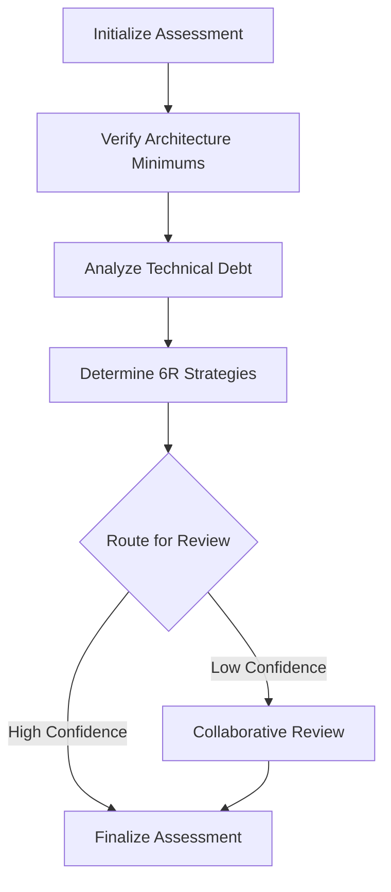

# Assessment Flow Design Document

## Executive Summary

The Assessment Flow is the second major CrewAI flow in the AI Force Migration Platform, following the Discovery Flow. It takes selected applications from the inventory page and performs comprehensive assessment to determine the optimal 6R migration strategy (Rehost, Replatform, Refactor, Repurchase, Retire, Retain) for each application.

## Flow Overview

### Purpose
- Accept selected applications from the Discovery Flow inventory
- Verify architecture requirements and compliance
- Analyze technical debt (moved from Discovery Flow)
- Determine optimal 6R strategy for each application
- Enable user review and override of AI recommendations

### Flow Boundaries
- **Starts**: Application selection from inventory page
- **Ends**: Finalized 6R treatment decisions for each application
- **Next Flow**: Planning Flow (future) will use 6R decisions for wave planning

## Architecture Design

### Flow Structure



### CrewAI Flow Implementation

```python
class AssessmentFlow(Flow[AssessmentFlowState]):
    """
    CrewAI Flow for assessing selected applications and determining 6R strategies
    """
    
    def __init__(self, crewai_service: CrewAIService, context: FlowContext):
        super().__init__()
        self.crewai_service = crewai_service
        self.context = context
        self.state_bridge = FlowStateBridge(context.flow_id)
    
    @start()
    def initialize_assessment(self):
        """
        Initialize flow with selected applications from inventory
        - Load selected applications from discovery flow
        - Create assessment flow record
        - Initialize state tracking
        """
        
    @listen(initialize_assessment)
    def verify_architecture_minimums(self, init_result):
        """
        Verify client/engagement architecture requirements
        - Check compliance standards
        - Validate security requirements
        - Ensure architecture patterns compliance
        """
        
    @listen(verify_architecture_minimums)
    def analyze_technical_debt(self, arch_result):
        """
        Analyze tech debt for selected applications
        - Code quality assessment
        - Security vulnerability scanning
        - Dependency analysis
        - Performance bottlenecks
        """
        
    @listen(analyze_technical_debt)
    def determine_sixr_strategies(self, tech_debt_result):
        """
        Determine 6R treatment for each application
        - Analyze application characteristics
        - Consider technical debt impact
        - Evaluate business value
        - Recommend optimal strategy
        """
        
    @router(determine_sixr_strategies)
    def route_for_review(self, strategies_result):
        """
        Route based on confidence scores
        - High confidence (>80%): Direct to finalization
        - Low confidence (<80%): Route to collaborative review
        """
        
    @listen(route_for_review)
    def collaborative_review(self, routing_result):
        """
        Allow user review and override of 6R decisions
        - Present AI recommendations
        - Capture user overrides
        - Record override rationale
        - Update learning system
        """
        
    @listen(collaborative_review)
    def finalize_assessment(self, review_result):
        """
        Finalize and persist 6R decisions
        - Save final decisions to database
        - Update assessment status
        - Prepare data for Planning Flow
        - Generate assessment report
        """
```

## Data Models

### AssessmentFlowState

```python
from pydantic import BaseModel
from typing import List, Dict, Optional
from datetime import datetime
from enum import Enum

class SixRStrategy(str, Enum):
    REHOST = "rehost"
    REPLATFORM = "replatform"
    REFACTOR = "refactor"
    REPURCHASE = "repurchase"
    RETIRE = "retire"
    RETAIN = "retain"

class ArchitectureRequirement(BaseModel):
    requirement_type: str
    description: str
    mandatory: bool
    verification_status: Optional[str]
    verified_at: Optional[datetime]

class TechDebtItem(BaseModel):
    category: str  # security, performance, maintainability, etc.
    severity: str  # critical, high, medium, low
    description: str
    remediation_effort_hours: int
    impact_on_migration: str

class SixRDecision(BaseModel):
    application_id: str
    application_name: str
    recommended_strategy: SixRStrategy
    confidence_score: float
    rationale: str
    risk_factors: List[str]
    estimated_effort: int
    estimated_cost: float
    user_override: Optional[SixRStrategy]
    override_reason: Optional[str]
    override_by: Optional[str]
    override_at: Optional[datetime]

class AssessmentFlowState(BaseModel):
    flow_id: str
    discovery_flow_id: str
    client_account_id: int
    engagement_id: int
    selected_application_ids: List[str]
    
    # Architecture verification
    architecture_requirements: List[ArchitectureRequirement]
    architecture_verified: bool = False
    architecture_issues: List[str] = []
    
    # Tech debt analysis
    tech_debt_analysis: Dict[str, List[TechDebtItem]]
    overall_tech_debt_score: Optional[float]
    
    # 6R decisions
    sixr_decisions: Dict[str, SixRDecision]
    
    # Flow metadata
    status: str
    progress: int = 0
    current_phase: str
    phase_results: Dict[str, Any]
    agent_insights: List[Dict[str, Any]]
    
    # Timestamps
    created_at: datetime
    updated_at: datetime
    completed_at: Optional[datetime]
```

## Database Schema

### Core Tables

```sql
-- Assessment flow tracking
CREATE TABLE assessment_flows (
    id UUID PRIMARY KEY DEFAULT gen_random_uuid(),
    discovery_flow_id UUID REFERENCES discovery_flows(id) NOT NULL,
    client_account_id INTEGER NOT NULL,
    engagement_id INTEGER NOT NULL,
    selected_application_ids JSONB NOT NULL,
    architecture_verified BOOLEAN DEFAULT FALSE,
    status VARCHAR(50) NOT NULL DEFAULT 'initialized',
    progress INTEGER DEFAULT 0,
    current_phase VARCHAR(100),
    phase_results JSONB DEFAULT '{}',
    agent_insights JSONB DEFAULT '[]',
    created_at TIMESTAMP DEFAULT NOW(),
    updated_at TIMESTAMP DEFAULT NOW(),
    completed_at TIMESTAMP,
    CONSTRAINT valid_progress CHECK (progress >= 0 AND progress <= 100)
);

-- Architecture requirements and verification
CREATE TABLE architecture_requirements (
    id UUID PRIMARY KEY DEFAULT gen_random_uuid(),
    assessment_flow_id UUID REFERENCES assessment_flows(id) ON DELETE CASCADE,
    requirement_type VARCHAR(100) NOT NULL,
    description TEXT,
    mandatory BOOLEAN DEFAULT TRUE,
    requirement_details JSONB,
    verification_status VARCHAR(50) DEFAULT 'pending',
    verification_notes TEXT,
    verified_by VARCHAR(100),
    verified_at TIMESTAMP,
    created_at TIMESTAMP DEFAULT NOW()
);

-- Tech debt analysis results
CREATE TABLE tech_debt_analysis (
    id UUID PRIMARY KEY DEFAULT gen_random_uuid(),
    assessment_flow_id UUID REFERENCES assessment_flows(id) ON DELETE CASCADE,
    application_id UUID NOT NULL,
    debt_category VARCHAR(100) NOT NULL,
    severity VARCHAR(20) NOT NULL CHECK (severity IN ('critical', 'high', 'medium', 'low')),
    description TEXT NOT NULL,
    remediation_effort_hours INTEGER,
    impact_on_migration TEXT,
    detected_by_agent VARCHAR(100),
    agent_confidence FLOAT CHECK (agent_confidence >= 0 AND agent_confidence <= 1),
    created_at TIMESTAMP DEFAULT NOW()
);

-- 6R strategy decisions
CREATE TABLE sixr_decisions (
    id UUID PRIMARY KEY DEFAULT gen_random_uuid(),
    assessment_flow_id UUID REFERENCES assessment_flows(id) ON DELETE CASCADE,
    application_id UUID NOT NULL,
    application_name VARCHAR(255) NOT NULL,
    recommended_strategy VARCHAR(20) NOT NULL CHECK (recommended_strategy IN ('rehost', 'replatform', 'refactor', 'repurchase', 'retire', 'retain')),
    confidence_score FLOAT CHECK (confidence_score >= 0 AND confidence_score <= 1),
    rationale TEXT,
    risk_factors JSONB DEFAULT '[]',
    estimated_effort_hours INTEGER,
    estimated_cost DECIMAL(12, 2),
    
    -- User override fields
    user_override_strategy VARCHAR(20) CHECK (user_override_strategy IN ('rehost', 'replatform', 'refactor', 'repurchase', 'retire', 'retain')),
    override_reason TEXT,
    override_by VARCHAR(100),
    override_at TIMESTAMP,
    
    -- Metadata
    decision_factors JSONB,
    created_at TIMESTAMP DEFAULT NOW(),
    updated_at TIMESTAMP DEFAULT NOW(),
    
    -- Ensure unique decision per application per flow
    CONSTRAINT unique_app_decision UNIQUE (assessment_flow_id, application_id)
);

-- Learning feedback table
CREATE TABLE assessment_learning_feedback (
    id UUID PRIMARY KEY DEFAULT gen_random_uuid(),
    assessment_flow_id UUID REFERENCES assessment_flows(id) ON DELETE CASCADE,
    decision_id UUID REFERENCES sixr_decisions(id) ON DELETE CASCADE,
    original_strategy VARCHAR(20) NOT NULL,
    override_strategy VARCHAR(20) NOT NULL,
    feedback_reason TEXT,
    agent_id VARCHAR(100),
    learned_pattern JSONB,
    created_at TIMESTAMP DEFAULT NOW()
);

-- Indexes for performance
CREATE INDEX idx_assessment_flows_discovery_flow ON assessment_flows(discovery_flow_id);
CREATE INDEX idx_assessment_flows_status ON assessment_flows(status);
CREATE INDEX idx_assessment_flows_client ON assessment_flows(client_account_id, engagement_id);
CREATE INDEX idx_sixr_decisions_app ON sixr_decisions(application_id);
CREATE INDEX idx_tech_debt_severity ON tech_debt_analysis(severity);
CREATE INDEX idx_arch_req_status ON architecture_requirements(verification_status);
```

## Crew Architecture

### 1. Architecture Verification Crew

```python
class ArchitectureVerificationCrew:
    """Verifies architecture requirements and compliance"""
    
    agents = [
        {
            "role": "Architecture Standards Agent",
            "goal": "Verify applications meet enterprise architecture standards",
            "backstory": "Expert in cloud architecture patterns and best practices"
        },
        {
            "role": "Compliance Checker Agent",
            "goal": "Ensure regulatory and security compliance",
            "backstory": "Specialist in compliance frameworks (SOC2, HIPAA, PCI-DSS)"
        }
    ]
    
    tasks = [
        "Review application architecture against standards",
        "Check security compliance requirements",
        "Validate data governance policies",
        "Assess integration patterns"
    ]
```

### 2. Technical Debt Analysis Crew

```python
class TechnicalDebtAnalysisCrew:
    """Analyzes technical debt across multiple dimensions"""
    
    agents = [
        {
            "role": "Code Quality Analyst",
            "goal": "Assess code maintainability and quality metrics",
            "backstory": "Expert in software quality metrics and refactoring"
        },
        {
            "role": "Security Scanner Agent",
            "goal": "Identify security vulnerabilities and risks",
            "backstory": "Cybersecurity expert with knowledge of OWASP and CVEs"
        },
        {
            "role": "Performance Analyzer",
            "goal": "Evaluate performance bottlenecks and scalability issues",
            "backstory": "Performance engineering specialist"
        }
    ]
    
    tasks = [
        "Analyze code complexity and maintainability",
        "Scan for security vulnerabilities",
        "Assess performance metrics",
        "Evaluate dependency risks",
        "Calculate technical debt score"
    ]
```

### 3. Six R Strategy Crew

```python
class SixRStrategyCrew:
    """Determines optimal 6R migration strategy"""
    
    agents = [
        {
            "role": "Migration Strategy Expert",
            "goal": "Recommend optimal 6R strategy based on application characteristics",
            "backstory": "Veteran cloud migration architect with 100+ migrations"
        },
        {
            "role": "Cost-Benefit Analyst",
            "goal": "Analyze financial implications of each strategy",
            "backstory": "FinOps specialist focused on cloud economics"
        },
        {
            "role": "Risk Assessment Specialist",
            "goal": "Evaluate migration risks for each strategy",
            "backstory": "Risk management expert in IT transformations"
        }
    ]
    
    tasks = [
        "Analyze application characteristics",
        "Evaluate technical constraints",
        "Assess business value and criticality",
        "Calculate migration effort and cost",
        "Determine optimal 6R strategy",
        "Generate decision rationale"
    ]
```

## API Endpoints

### API v3 Assessment Flow Endpoints

```yaml
# Initialize Assessment Flow
POST /api/v3/assessment-flow/initialize
Request:
  {
    "discovery_flow_id": "uuid",
    "selected_application_ids": ["uuid1", "uuid2", ...]
  }
Response:
  {
    "flow_id": "uuid",
    "status": "initialized",
    "next_phase": "architecture_verification"
  }

# Get Assessment Flow Status
GET /api/v3/assessment-flow/{flow_id}/status
Response:
  {
    "flow_id": "uuid",
    "status": "in_progress",
    "progress": 45,
    "current_phase": "tech_debt_analysis",
    "phase_results": {...},
    "estimated_completion": "2024-01-15T10:30:00Z"
  }

# Execute Flow Phase
POST /api/v3/assessment-flow/{flow_id}/execute/{phase}
Request:
  {
    "phase_input": {...}  # Phase-specific input
  }
Response:
  {
    "phase": "tech_debt_analysis",
    "status": "completed",
    "results": {...},
    "next_phase": "sixr_strategy"
  }

# Get Architecture Requirements
GET /api/v3/assessment-flow/{flow_id}/architecture-requirements
Response:
  {
    "requirements": [
      {
        "id": "uuid",
        "type": "security",
        "description": "Must comply with SOC2",
        "mandatory": true,
        "verification_status": "verified"
      }
    ]
  }

# Update Architecture Verification
PUT /api/v3/assessment-flow/{flow_id}/architecture-requirements/{req_id}
Request:
  {
    "verification_status": "verified",
    "notes": "Compliant with all requirements"
  }

# Get Tech Debt Analysis
GET /api/v3/assessment-flow/{flow_id}/tech-debt
Response:
  {
    "applications": {
      "app_id_1": {
        "overall_score": 7.5,
        "items": [
          {
            "category": "security",
            "severity": "high",
            "description": "Outdated dependencies with known vulnerabilities"
          }
        ]
      }
    }
  }

# Get 6R Decisions
GET /api/v3/assessment-flow/{flow_id}/sixr-decisions
Response:
  {
    "decisions": [
      {
        "application_id": "uuid",
        "application_name": "Customer Portal",
        "recommended_strategy": "replatform",
        "confidence_score": 0.85,
        "rationale": "Modern architecture suitable for containerization"
      }
    ]
  }

# Override 6R Decision
PUT /api/v3/assessment-flow/{flow_id}/sixr-decisions/{app_id}
Request:
  {
    "override_strategy": "refactor",
    "override_reason": "Business requires significant feature additions"
  }

# Finalize Assessment
POST /api/v3/assessment-flow/{flow_id}/finalize
Response:
  {
    "status": "completed",
    "summary": {
      "total_applications": 25,
      "strategy_distribution": {
        "rehost": 10,
        "replatform": 8,
        "refactor": 3,
        "retire": 2,
        "retain": 2
      },
      "user_overrides": 3
    }
  }

# Get Assessment Report
GET /api/v3/assessment-flow/{flow_id}/report
Response:
  {
    "flow_id": "uuid",
    "generated_at": "2024-01-15T14:30:00Z",
    "executive_summary": "...",
    "detailed_findings": {...},
    "recommendations": [...]
  }
```

## Frontend Integration

### Pages Structure

```
/assessment/
├── initialize/          # Application selection UI
├── architecture/        # Architecture verification
├── tech-debt/          # Tech debt results
├── sixr-review/        # 6R strategy review/override
└── summary/            # Assessment completion summary
```

### useAssessmentFlow Hook

```typescript
interface UseAssessmentFlowReturn {
  // Flow state
  flowId: string | null;
  status: AssessmentFlowStatus;
  progress: number;
  currentPhase: AssessmentPhase;
  
  // Flow control
  initializeFlow: (discoveryFlowId: string, selectedAppIds: string[]) => Promise<void>;
  executePhase: (phase: AssessmentPhase) => Promise<void>;
  
  // Data access
  architectureRequirements: ArchitectureRequirement[];
  techDebtAnalysis: TechDebtAnalysis | null;
  sixrDecisions: SixRDecision[];
  
  // User actions
  verifyRequirement: (reqId: string, status: string, notes?: string) => Promise<void>;
  overrideSixRDecision: (appId: string, strategy: string, reason: string) => Promise<void>;
  finalizeAssessment: () => Promise<void>;
  
  // Real-time updates
  subscribeToUpdates: () => void;
  unsubscribeFromUpdates: () => void;
}
```

## Integration Points

### With Discovery Flow
- Reads discovered applications and dependencies
- Accesses discovery insights for context
- Maintains flow continuity through discovery_flow_id

### With Planning Flow (Future)
- Provides 6R decisions as input
- Shares tech debt analysis for prioritization
- Passes risk assessments for wave planning

## Risk Mitigation

### Technical Risks
1. **Large Application Sets**: Implement pagination and batch processing
2. **Agent Decision Conflicts**: Use consensus mechanisms and confidence thresholds
3. **Performance**: Cache frequently accessed data, optimize database queries

### Business Risks
1. **Incorrect 6R Decisions**: Enable user overrides with rationale capture
2. **Compliance Violations**: Mandatory architecture verification phase
3. **User Adoption**: Intuitive UI with clear value demonstration

## Success Metrics

### Quantitative Metrics
- Assessment completion time per application
- 6R decision confidence scores (target: >80%)
- User override rate (target: <20%)
- Tech debt identification accuracy

### Qualitative Metrics
- User satisfaction with recommendations
- Decision rationale clarity
- Time saved vs manual assessment
- Migration success rate correlation

## Future Enhancements

### Phase 2 Features
- External system integrations (ServiceNow, Jira)
- Advanced risk modeling with Monte Carlo simulations
- Automated remediation recommendations
- Multi-user collaboration workflows

### Phase 3 Features
- ML model fine-tuning based on outcomes
- Industry-specific assessment templates
- Automated compliance report generation
- Real-time cost optimization suggestions

## Appendix

### 6R Strategy Definitions

1. **Rehost** (Lift & Shift): Move applications to cloud with minimal changes
2. **Replatform**: Make small optimizations during migration
3. **Refactor**: Redesign application architecture for cloud-native
4. **Repurchase**: Replace with SaaS solution
5. **Retire**: Decommission the application
6. **Retain**: Keep in current environment

### Tech Debt Categories

- **Security**: Vulnerabilities, outdated dependencies, weak authentication
- **Performance**: Slow queries, memory leaks, inefficient algorithms
- **Maintainability**: Code complexity, lack of documentation, tight coupling
- **Scalability**: Single points of failure, stateful designs
- **Compliance**: Data privacy issues, audit gaps