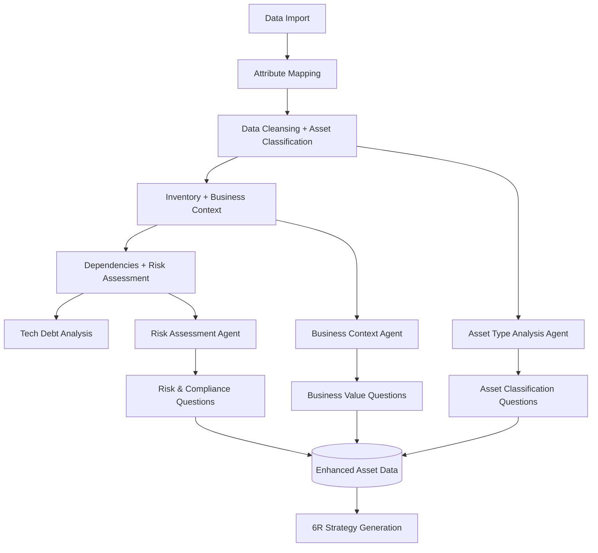
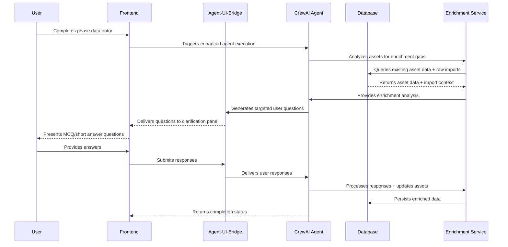

# Asset Enrichment Architecture Overview

## Executive Summary

The Asset Enrichment system enhances the existing discovery flow with intelligent data collection capabilities. By extending current CrewAI agents and leveraging the established agent-ui-bridge pattern, the system automatically analyzes assets and collects critical business/technical context through targeted user interactions.

## Core Architecture

### **High-Level System Flow**



### **Enhanced Asset Data Model**

```sql
-- Extended Asset table with enrichment fields
assets (
    -- Existing fields...
    id, name, asset_type, hostname, ip_address, etc.
    
    -- NEW: Enrichment fields
    asset_subtype VARCHAR(50),           -- web_server, app_server, database
    application_version VARCHAR(50),      -- Software/application version
    end_of_support_date DATE,            -- EOL/EOS date
    data_classification VARCHAR(20),      -- PII, PHI, Financial, Public
    compliance_requirements JSON,         -- SOX, HIPAA, PCI-DSS
    availability_requirement VARCHAR(10), -- 99.9%, 99.99%, 99.999%
    container_ready BOOLEAN,             -- Containerization assessment
    api_maturity_level VARCHAR(20),      -- REST, SOAP, Legacy, None
    middleware_stack JSON,               -- Technology stack details
    database_type VARCHAR(50),           -- Database type and version
    business_value_score INTEGER,        -- 1-10 business value
    license_info JSON,                   -- License compliance data
    security_profile JSON,               -- Security assessment results
    
    -- Enrichment metadata
    enrichment_status VARCHAR(20) DEFAULT 'basic',    -- basic, enhanced, complete
    enrichment_score INTEGER DEFAULT 0,               -- 0-100 completeness
    ai_confidence_score FLOAT DEFAULT 0.0,           -- AI confidence
    user_reviewed_fields JSON DEFAULT '[]',          -- User-reviewed fields
    enrichment_timestamp TIMESTAMP
);
```

### **Agent Enhancement Strategy**

#### **Existing Agents → Enhanced Capabilities**

1. **DataCleansingCrew** → **Asset Classification Agent**
   - Analyzes imported data for asset type patterns
   - Identifies missing critical fields
   - Suggests asset subtype classifications

2. **InventoryBuildingCrew** → **Business Context Agent**  
   - Extracts business value indicators from asset data
   - Analyzes application dependencies for importance scoring
   - Identifies compliance and availability requirements

3. **DependencyAnalysisCrew** → **Risk Assessment Agent**
   - Evaluates security and operational risks
   - Assesses backup and DR requirements
   - Identifies compliance obligations

## Integration Points

### **Phase 3: Data Cleansing + Asset Classification**

**Enhanced Agent Behavior:**
```python
class EnhancedDataCleansingCrew:
    async def execute_cleansing_with_classification(self, flow_id: str):
        # Existing data cleansing logic
        cleansing_results = await self._perform_data_cleansing(flow_id)
        
        # NEW: Asset classification analysis
        classification_results = await self._analyze_asset_classifications(flow_id)
        
        # Generate user questions for unclear classifications
        if classification_results.requires_clarification:
            questions = await self._generate_classification_questions(
                classification_results.uncertain_assets
            )
            await self.agent_ui_bridge.add_batch_questions(questions)
            
        return {
            "cleansing": cleansing_results,
            "classification": classification_results,
            "user_questions_pending": len(questions)
        }
```

**User Interaction Pattern:**
```json
{
  "question_type": "asset_classification",
  "title": "Asset Type Clarification",
  "question": "Based on the hostname 'webserver01' and detected ports, is this asset a:",
  "options": ["Web Server", "Application Server", "Load Balancer", "Other"],
  "context": {
    "asset_id": "asset_123",
    "hostname": "webserver01",
    "detected_ports": [80, 443, 8080],
    "ai_suggestion": "Web Server",
    "confidence": 0.85
  }
}
```

### **Phase 4: Inventory + Business Context**

**Enhanced Agent Behavior:**
```python
class EnhancedInventoryBuildingCrew:
    async def execute_inventory_with_business_context(self, flow_id: str):
        # Existing inventory building
        inventory_results = await self._build_asset_inventory(flow_id)
        
        # NEW: Business context analysis
        business_analysis = await self._analyze_business_context(flow_id)
        
        # Generate targeted business questions
        if business_analysis.requires_user_input:
            questions = await self._generate_business_context_questions(
                business_analysis.applications_needing_context
            )
            await self.agent_ui_bridge.add_batch_questions(questions)
            
        return {
            "inventory": inventory_results,
            "business_context": business_analysis,
            "critical_apps_identified": len(business_analysis.critical_applications)
        }
```

**User Interaction Pattern:**
```json
{
  "question_type": "business_context",
  "title": "Application Business Value",
  "question": "The application 'CustomerPortal' appears to be customer-facing. What's its business criticality?",
  "options": ["Low", "Medium", "High", "Critical"],
  "context": {
    "application_name": "CustomerPortal",
    "asset_count": 5,
    "detected_patterns": ["web interface", "database connections"],
    "ai_suggestion": "High",
    "confidence": 0.75
  }
}
```

### **Phase 5: Dependencies + Risk Assessment**

**Enhanced Agent Behavior:**
```python
class EnhancedDependencyAnalysisCrew:
    async def execute_dependencies_with_risk_assessment(self, flow_id: str):
        # Existing dependency analysis
        dependency_results = await self._analyze_dependencies(flow_id)
        
        # NEW: Risk assessment based on dependencies
        risk_analysis = await self._assess_operational_risks(flow_id)
        
        # Generate risk clarification questions
        if risk_analysis.requires_clarification:
            questions = await self._generate_risk_assessment_questions(
                risk_analysis.high_risk_assets
            )
            await self.agent_ui_bridge.add_batch_questions(questions)
            
        return {
            "dependencies": dependency_results,
            "risk_assessment": risk_analysis,
            "compliance_gaps_identified": len(risk_analysis.compliance_gaps)
        }
```

## Data Flow Architecture

### **Enrichment Data Pipeline**



### **Gating Logic for Flow Progression**

```python
class EnrichmentGatingService:
    def check_phase_completion_requirements(self, flow_id: str, phase: str) -> dict:
        assets = self.get_assets_by_flow(flow_id)
        
        if phase == 'data_cleansing':
            return self._check_classification_requirements(assets)
        elif phase == 'inventory':
            return self._check_business_context_requirements(assets)
        elif phase == 'dependencies':
            return self._check_risk_assessment_requirements(assets)
            
    def _check_business_context_requirements(self, assets: List[Asset]) -> dict:
        applications = [a for a in assets if a.asset_type == 'application']
        
        missing_fields = []
        for app in applications:
            if not app.business_value_score:
                missing_fields.append(f"{app.name}: business_value_score")
            if not app.availability_requirement:
                missing_fields.append(f"{app.name}: availability_requirement")
                
        return {
            "can_proceed": len(missing_fields) == 0,
            "missing_critical_fields": missing_fields,
            "completion_percentage": self._calculate_completion_percentage(assets)
        }
```

## Key Architectural Benefits

### **1. Seamless Integration**
- Leverages existing agent-ui-bridge infrastructure
- Extends current CrewAI agents rather than adding new ones
- Maintains consistent user interaction patterns

### **2. Progressive Enhancement**
- Basic discovery flow continues to work
- Enrichment adds intelligence without breaking existing functionality
- Graceful degradation if enrichment fails

### **3. Scalable Data Architecture**
- Single asset table with conditional enrichment fields
- JSON fields for flexible extension
- Efficient querying with proper indexing

### **4. Intelligent User Experience**
- AI-driven question generation reduces user burden
- Confidence scores help users make informed decisions
- Batch processing minimizes interaction frequency

### **5. Learning-Enabled System**
- User corrections feed back into agent learning
- Confidence scores improve over time
- Pattern recognition enhances automation

## Performance Considerations

### **Asynchronous Processing**
- All enrichment operations run in background
- User interface remains responsive
- Progress indicators show enrichment status

### **Timeout Management**
```python
# Configuration for enrichment timeouts
ENRICHMENT_TIMEOUTS = {
    'asset_classification': 30,    # seconds
    'business_context': 45,        # seconds  
    'risk_assessment': 60,         # seconds
    'external_lookup': 120         # seconds (future)
}
```

### **Batch Optimization**
- Process multiple assets simultaneously
- Cache common lookups (OS versions, software patterns)
- Minimize database round trips

---

*Next: [02_discovery_flow_integration.md](02_discovery_flow_integration.md)*