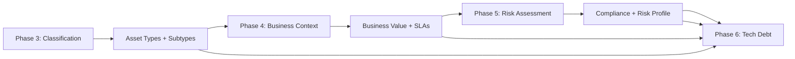

# Discovery Flow Integration Design

## Current vs Enhanced Discovery Flow

### **Current Flow**
```
Data Import → Attribute Mapping → Data Cleansing → Inventory → Dependencies → Tech Debt
```

### **Enhanced Flow with Enrichment**
```
Data Import → Attribute Mapping → 
↓
Data Cleansing + Asset Classification (Phase 3) →
↓
Inventory + Business Context Collection (Phase 4) →
↓  
Dependencies + Risk Assessment (Phase 5) →
↓
Tech Debt Analysis (Enhanced with Context) (Phase 6)
```

## Phase-by-Phase Integration Details

### **Phase 1: Data Import (No Changes)**

**Current Functionality:** File upload, parsing, validation
**Enrichment Impact:** None - maintains existing behavior
**Data Collected:** Raw import records stored for future analysis

---

### **Phase 2: Attribute Mapping (No Changes)**

**Current Functionality:** Field mapping with AI suggestions
**Enrichment Impact:** None - maintains existing behavior  
**Data Collected:** Field mappings stored for enrichment context

---

### **Phase 3: Data Cleansing + Asset Classification**

#### **Enhanced Agent: DataCleansingCrew → AssetClassificationCrew**

**New Capabilities:**
- Asset type pattern analysis
- Missing critical field detection
- Asset subtype classification
- Data quality scoring with enrichment opportunities

#### **Frontend Changes: DataCleansing.tsx**

**Current Structure:**
```tsx
const DataCleansing = () => {
  return (
    <div className="grid grid-cols-1 xl:grid-cols-4 gap-6">
      <div className="xl:col-span-3">
        <DataQualityAssessment />
        <IssueResolutionPanel />
      </div>
      <div className="xl:col-span-1">
        <AgentClarificationPanel pageContext="data-cleansing" />
        <AgentInsightsSection />
      </div>
    </div>
  );
};
```

**Enhanced Structure:**
```tsx
const EnhancedDataCleansing = () => {
  const { enrichmentStatus, classificationQuestions } = useAssetEnrichment(flowId);
  
  return (
    <div className="grid grid-cols-1 xl:grid-cols-4 gap-6">
      <div className="xl:col-span-3 space-y-6">
        {/* Existing components */}
        <DataQualityAssessment />
        <IssueResolutionPanel />
        
        {/* NEW: Asset Classification Overview */}
        <AssetClassificationOverview 
          classificationProgress={enrichmentStatus.classification}
          pendingClassifications={classificationQuestions}
        />
        
        {/* NEW: Critical Field Gaps */}
        <CriticalFieldGapsPanel 
          missingFields={enrichmentStatus.missing_critical_fields}
          affectedAssets={enrichmentStatus.assets_needing_classification}
        />
      </div>
      
      <div className="xl:col-span-1 space-y-6">
        {/* Enhanced agent panel with classification questions */}
        <AgentClarificationPanel 
          pageContext="asset-classification"
          questionTypes={['asset_type_confirmation', 'missing_field_clarification']}
        />
        <AgentInsightsSection category="classification" />
        
        {/* NEW: Classification progress indicator */}
        <EnrichmentProgressCard 
          phase="classification"
          progress={enrichmentStatus.completion_percentage}
          blockers={enrichmentStatus.blockers}
        />
      </div>
    </div>
  );
};
```

#### **Agent Question Examples:**

```json
[
  {
    "question_type": "asset_type_confirmation",
    "title": "Asset Type Verification",
    "question": "Server 'DB-PROD-01' has database ports open. What type of asset is this?",
    "options": ["Database Server", "Application Server", "Web Server", "Other"],
    "context": {
      "asset_name": "DB-PROD-01",
      "detected_ports": [1433, 3306, 5432],
      "hostname_pattern": "DB-PROD",
      "ai_suggestion": "Database Server",
      "confidence": 0.92
    }
  },
  {
    "question_type": "missing_field_clarification", 
    "title": "Critical Field Missing",
    "question": "Application 'CustomerPortal' is missing business criticality. Based on the name, what's the criticality?",
    "options": ["Low", "Medium", "High", "Critical"],
    "context": {
      "asset_name": "CustomerPortal",
      "asset_type": "application",
      "missing_field": "business_criticality",
      "ai_suggestion": "High",
      "confidence": 0.78
    }
  }
]
```

#### **Gating Logic:**
```typescript
const canProceedFromDataCleansing = (enrichmentStatus: EnrichmentStatus): boolean => {
  return (
    enrichmentStatus.classification_completion >= 80 && // 80% of assets classified
    enrichmentStatus.critical_fields_completion >= 100 && // All critical fields populated
    enrichmentStatus.pending_questions.length === 0 // No outstanding questions
  );
};
```

---

### **Phase 4: Inventory + Business Context Collection**

#### **Enhanced Agent: InventoryBuildingCrew → BusinessContextCrew**

**New Capabilities:**
- Business value analysis
- Application tier identification
- User impact assessment
- Availability requirement detection

#### **Frontend Changes: Inventory.tsx**

**Current Structure:**
```tsx
const Inventory = () => {
  return (
    <div className="grid grid-cols-1 xl:grid-cols-4 gap-6">
      <div className="xl:col-span-3">
        <InventoryContent />
      </div>
      <div className="xl:col-span-1">
        <AgentInsightsSection />
      </div>
    </div>
  );
};
```

**Enhanced Structure:**
```tsx
const EnhancedInventory = () => {
  const { businessContextStatus, contextQuestions } = useBusinessContextEnrichment(flowId);
  
  return (
    <div className="grid grid-cols-1 xl:grid-cols-4 gap-6">
      <div className="xl:col-span-3 space-y-6">
        {/* Enhanced inventory with business context */}
        <EnhancedInventoryContent 
          showBusinessContext={true}
          contextCompleteness={businessContextStatus.completion}
        />
        
        {/* NEW: Business Context Overview */}
        <BusinessContextOverview 
          applications={businessContextStatus.applications}
          contextGaps={businessContextStatus.missing_context}
        />
        
        {/* NEW: Application Tier Analysis */}
        <ApplicationTierAnalysis 
          tiers={businessContextStatus.application_tiers}
          recommendations={businessContextStatus.tier_recommendations}
        />
      </div>
      
      <div className="xl:col-span-1 space-y-6">
        <AgentClarificationPanel 
          pageContext="business-context"
          questionTypes={['business_value', 'availability_requirement', 'user_impact']}
        />
        <AgentInsightsSection category="business_context" />
        
        <EnrichmentProgressCard 
          phase="business_context"
          progress={businessContextStatus.completion_percentage}
          criticalApplications={businessContextStatus.critical_applications}
        />
      </div>
    </div>
  );
};
```

#### **Agent Question Examples:**

```json
[
  {
    "question_type": "business_value",
    "title": "Application Business Value",
    "question": "How critical is 'PaymentProcessor' to business operations?",
    "options": ["Low - Internal tool", "Medium - Supports operations", "High - Customer-facing", "Critical - Revenue generating"],
    "context": {
      "application_name": "PaymentProcessor",
      "detected_integrations": ["CreditCardGateway", "BankingAPI"],
      "transaction_indicators": true,
      "ai_suggestion": "Critical - Revenue generating",
      "confidence": 0.88
    }
  },
  {
    "question_type": "availability_requirement",
    "title": "Availability Requirement",
    "question": "What's the SLA requirement for 'CustomerPortal'?",
    "options": ["95% (Basic)", "99% (Standard)", "99.9% (High)", "99.99% (Mission Critical)"],
    "context": {
      "application_name": "CustomerPortal",
      "business_criticality": "High",
      "customer_facing": true,
      "ai_suggestion": "99.9% (High)",
      "confidence": 0.75
    }
  }
]
```

#### **Gating Logic:**
```typescript
const canProceedFromInventory = (businessStatus: BusinessContextStatus): boolean => {
  const criticalApps = businessStatus.applications.filter(app => 
    app.business_criticality === 'High' || app.business_criticality === 'Critical'
  );
  
  const contextComplete = criticalApps.every(app => 
    app.business_value_score && 
    app.availability_requirement
  );
  
  return (
    businessStatus.completion_percentage >= 85 && // 85% context collected
    contextComplete && // All critical apps have required context
    businessStatus.pending_questions.length === 0
  );
};
```

---

### **Phase 5: Dependencies + Risk Assessment**

#### **Enhanced Agent: DependencyAnalysisCrew → RiskAssessmentCrew**

**New Capabilities:**
- Compliance requirement analysis
- Security risk assessment
- Operational risk evaluation
- Data sensitivity analysis

#### **Frontend Changes: Dependencies.tsx**

**Enhanced Structure:**
```tsx
const EnhancedDependencies = () => {
  const { riskAssessmentStatus, riskQuestions } = useRiskAssessmentEnrichment(flowId);
  
  return (
    <div className="grid grid-cols-1 xl:grid-cols-4 gap-6">
      <div className="xl:col-span-3 space-y-6">
        {/* Existing dependency visualization */}
        <DependencyVisualization />
        
        {/* NEW: Risk Assessment Overview */}
        <RiskAssessmentOverview 
          riskProfile={riskAssessmentStatus.risk_profile}
          complianceGaps={riskAssessmentStatus.compliance_gaps}
        />
        
        {/* NEW: Compliance Requirements Matrix */}
        <ComplianceRequirementsMatrix 
          requirements={riskAssessmentStatus.compliance_requirements}
          assetMapping={riskAssessmentStatus.asset_compliance_mapping}
        />
      </div>
      
      <div className="xl:col-span-1 space-y-6">
        <AgentClarificationPanel 
          pageContext="risk-assessment"
          questionTypes={['compliance_requirement', 'data_classification', 'operational_risk']}
        />
        <AgentInsightsSection category="risk_assessment" />
        
        <EnrichmentProgressCard 
          phase="risk_assessment"
          progress={riskAssessmentStatus.completion_percentage}
          highRiskAssets={riskAssessmentStatus.high_risk_assets}
        />
      </div>
    </div>
  );
};
```

#### **Agent Question Examples:**

```json
[
  {
    "question_type": "compliance_requirement",
    "title": "Compliance Requirements",
    "question": "Database 'CustomerDB' contains customer data. What compliance requirements apply?",
    "options": ["PCI-DSS (Payment data)", "HIPAA (Health data)", "SOX (Financial data)", "GDPR (EU personal data)", "None"],
    "context": {
      "asset_name": "CustomerDB",
      "database_type": "customer_database",
      "detected_data_types": ["personal_info", "payment_info"],
      "ai_suggestion": "PCI-DSS (Payment data)",
      "confidence": 0.82
    }
  },
  {
    "question_type": "data_classification",
    "title": "Data Sensitivity",
    "question": "What type of data does 'EmployeeHR' system primarily handle?",
    "options": ["Public", "Internal", "Confidential", "Restricted/PII"],
    "context": {
      "application_name": "EmployeeHR",
      "detected_patterns": ["employee_records", "salary_data", "ssn_patterns"],
      "ai_suggestion": "Restricted/PII",
      "confidence": 0.95
    }
  }
]
```

---

### **Phase 6: Tech Debt Analysis (Enhanced)**

#### **Enhanced with Rich Context**

**New Capabilities:**
- Context-aware modernization recommendations
- Business impact assessment for tech debt
- Migration priority scoring based on enrichment data

**Enhanced Analysis:**
```python
class EnhancedTechDebtAnalysis:
    def analyze_modernization_opportunities(self, assets: List[Asset]) -> dict:
        recommendations = []
        
        for asset in assets:
            # Use enrichment data for smarter recommendations
            if asset.business_value_score >= 8 and asset.container_ready == False:
                recommendations.append({
                    "asset": asset.name,
                    "recommendation": "Containerization Priority",
                    "business_justification": f"High business value ({asset.business_value_score}/10)",
                    "technical_feasibility": self._assess_containerization_effort(asset)
                })
                
            if asset.end_of_support_date and asset.end_of_support_date < datetime.now() + timedelta(days=365):
                recommendations.append({
                    "asset": asset.name,
                    "recommendation": "Urgent Modernization",
                    "business_justification": f"End of support: {asset.end_of_support_date}",
                    "compliance_impact": asset.compliance_requirements
                })
```

## Cross-Phase Data Dependencies

### **Data Flow Between Phases**



### **Enrichment Completeness Tracking**

```typescript
interface EnrichmentStatus {
  phase: string;
  completion_percentage: number;
  critical_fields_complete: boolean;
  pending_questions: AgentQuestion[];
  can_proceed: boolean;
  blockers: string[];
  estimated_completion_time: number; // minutes
}

interface OverallEnrichmentStatus {
  flow_id: string;
  overall_completion: number;
  phase_status: {
    classification: EnrichmentStatus;
    business_context: EnrichmentStatus;
    risk_assessment: EnrichmentStatus;
  };
  readiness_for_6r: number; // 0-100 score
}
```

## User Experience Flow

### **Progress Indication**

```tsx
const EnrichmentProgressIndicator = ({ overallStatus }: { overallStatus: OverallEnrichmentStatus }) => {
  return (
    <div className="bg-white border border-gray-200 rounded-lg p-4">
      <div className="flex items-center justify-between mb-2">
        <h3 className="text-lg font-medium">Asset Enrichment Progress</h3>
        <span className="text-2xl font-bold text-blue-600">{overallStatus.overall_completion}%</span>
      </div>
      
      <div className="space-y-2">
        <ProgressPhase 
          name="Asset Classification" 
          status={overallStatus.phase_status.classification}
          icon={<Tags />}
        />
        <ProgressPhase 
          name="Business Context" 
          status={overallStatus.phase_status.business_context}
          icon={<Building />}
        />
        <ProgressPhase 
          name="Risk Assessment" 
          status={overallStatus.phase_status.risk_assessment}
          icon={<Shield />}
        />
      </div>
      
      <div className="mt-4 p-3 bg-blue-50 rounded-md">
        <p className="text-sm text-blue-700">
          6R Strategy Readiness: <strong>{overallStatus.readiness_for_6r}%</strong>
        </p>
        <p className="text-xs text-blue-600 mt-1">
          Higher enrichment completeness leads to more accurate migration recommendations
        </p>
      </div>
    </div>
  );
};
```

### **Question Batching Strategy**

```typescript
const batchQuestionsByPriority = (questions: AgentQuestion[]): AgentQuestion[][] => {
  // Group questions by priority and type
  const critical = questions.filter(q => q.priority === 'critical');
  const high = questions.filter(q => q.priority === 'high');
  const medium = questions.filter(q => q.priority === 'medium');
  
  // Present in batches of 5-7 questions max
  return [
    ...chunk(critical, 5),
    ...chunk(high, 7),
    ...chunk(medium, 7)
  ];
};
```

---

*Next: [03_agent_enhancements.md](03_agent_enhancements.md)*